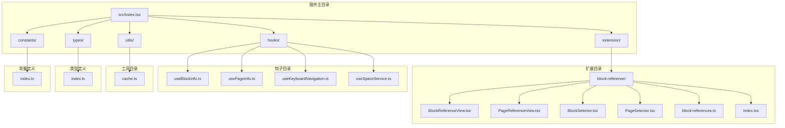
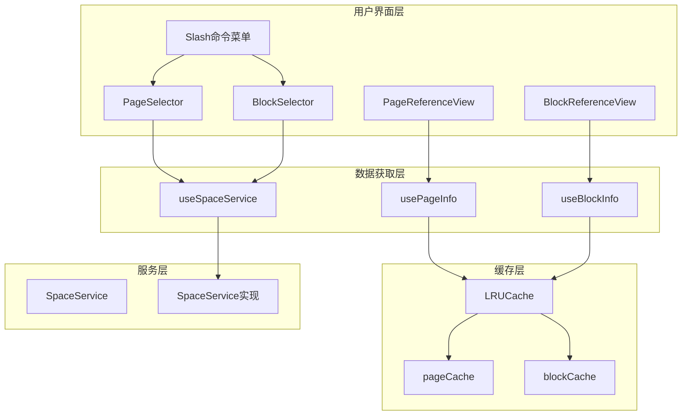
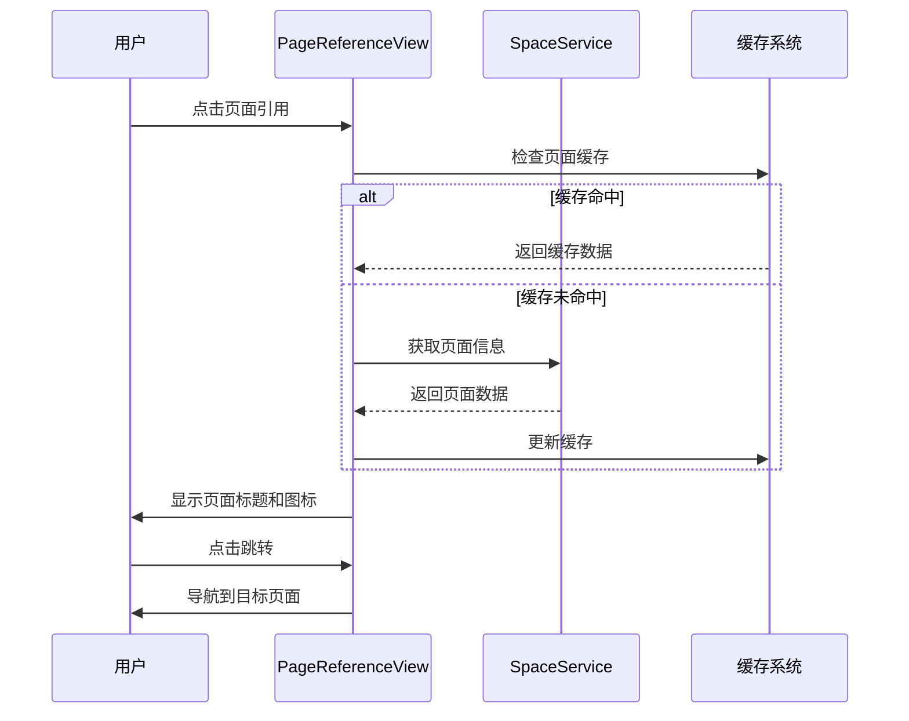
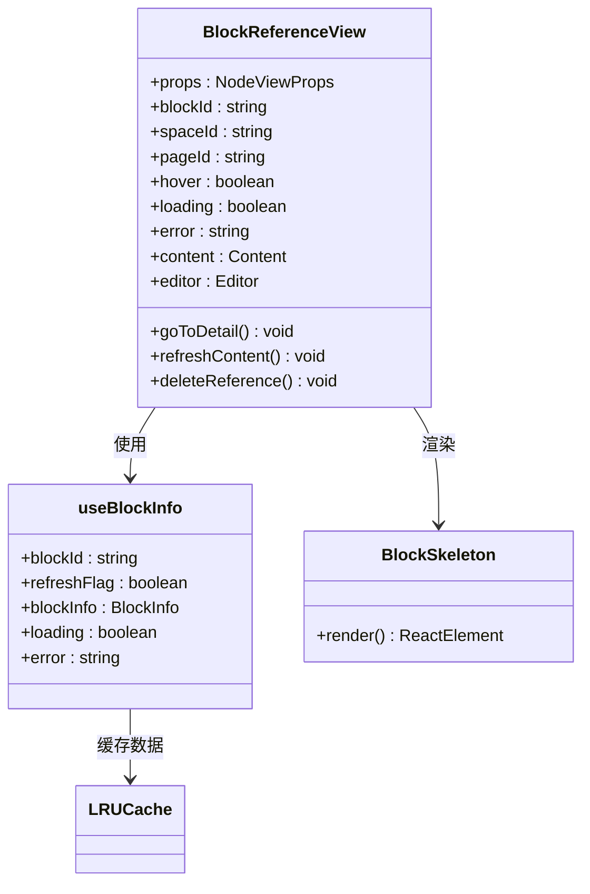
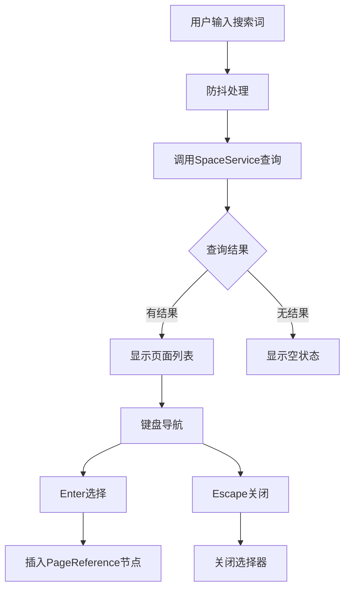
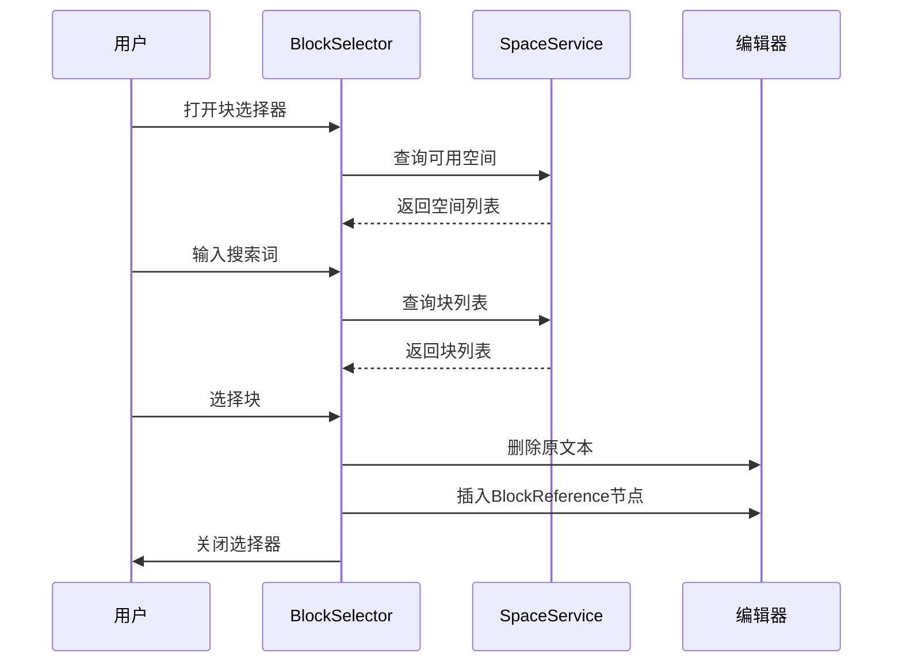
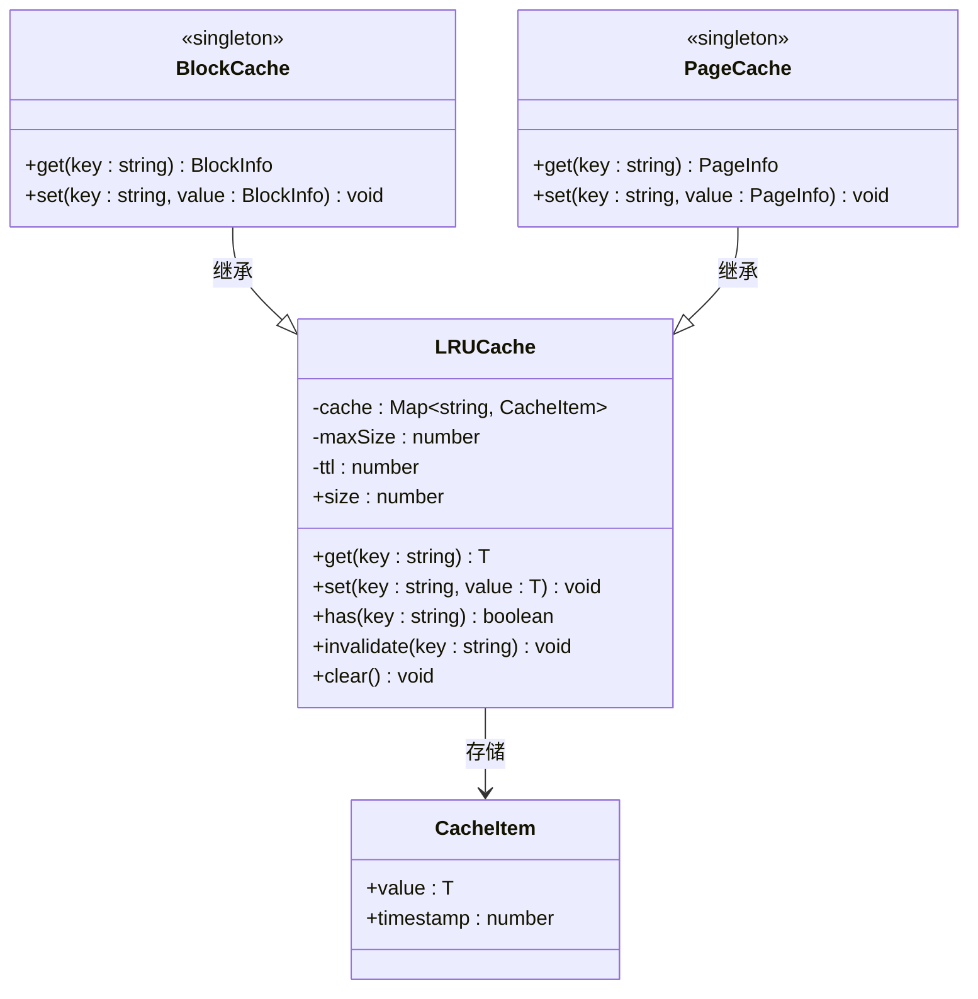

# 块引用插件

<cite>
**本文档引用的文件**
- [packages/plugin-block-reference/src/index.tsx](file://packages/plugin-block-reference/src/index.tsx)
- [packages/plugin-block-reference/src/extension/block-reference/index.tsx](file://packages/plugin-block-reference/src/extension/block-reference/index.tsx)
- [packages/plugin-block-reference/src/extension/block-reference/block-references.ts](file://packages/plugin-block-reference/src/extension/block-reference/block-references.ts)
- [packages/plugin-block-reference/src/extension/block-reference/PageReferenceView.tsx](file://packages/plugin-block-reference/src/extension/block-reference/PageReferenceView.tsx)
- [packages/plugin-block-reference/src/extension/block-reference/PageSelector.tsx](file://packages/plugin-block-reference/src/extension/block-reference/PageSelector.tsx)
- [packages/plugin-block-reference/src/extension/block-reference/BlockSelector.tsx](file://packages/plugin-block-reference/src/extension/block-reference/BlockSelector.tsx)
- [packages/plugin-block-reference/src/extension/block-reference/BlockReferenceView.tsx](file://packages/plugin-block-reference/src/extension/block-reference/BlockReferenceView.tsx)
- [packages/plugin-block-reference/src/hooks/useBlockInfo.ts](file://packages/plugin-block-reference/src/hooks/useBlockInfo.ts)
- [packages/plugin-block-reference/src/hooks/usePageInfo.ts](file://packages/plugin-block-reference/src/hooks/usePageInfo.ts)
- [packages/plugin-block-reference/src/hooks/useKeyboardNavigation.ts](file://packages/plugin-block-reference/src/hooks/useKeyboardNavigation.ts)
- [packages/plugin-block-reference/src/hooks/useSpaceService.ts](file://packages/plugin-block-reference/src/hooks/useSpaceService.ts)
- [packages/plugin-block-reference/src/utils/cache.ts](file://packages/plugin-block-reference/src/utils/cache.ts)
- [packages/plugin-block-reference/src/types/index.ts](file://packages/plugin-block-reference/src/types/index.ts)
- [packages/plugin-block-reference/src/constants/index.ts](file://packages/plugin-block-reference/src/constants/index.ts)
- [packages/plugin-block-reference/README.md](file://packages/plugin-block-reference/README.md)
- [packages/plugin-block-reference/package.json](file://packages/plugin-block-reference/package.json)
- [packages/plugin-block-reference/OPTIMIZATION.md](file://packages/plugin-block-reference/OPTIMIZATION.md)
</cite>

## 目录
1. [简介](#简介)
2. [项目结构](#项目结构)
3. [核心组件](#核心组件)
4. [架构概览](#架构概览)
5. [详细组件分析](#详细组件分析)
6. [依赖关系分析](#依赖关系分析)
7. [性能考虑](#性能考虑)
8. [故障排除指南](#故障排除指南)
9. [结论](#结论)

## 简介

块引用插件是 Knowledge 编辑器的一个功能模块，提供页面和块引用功能。该插件允许用户在文档中创建指向其他页面或特定块的链接引用，支持智能搜索、悬停预览、缓存优化等特性。

主要功能包括：
- **块引用** - 引用来自任何页面的特定块
- **页面引用** - 链接到页面并自动解析标题
- **智能搜索** - 跨空间和页面的防抖搜索
- **悬停预览** - 悬停时预览引用内容
- **高性能优化** - 使用 React.memo 和缓存机制

## 项目结构

```mermaid
graph TB
subgraph "插件主目录"
A[src/index.tsx] --> B[extension/]
A --> C[hooks/]
A --> D[utils/]
A --> E[types/]
A --> F[constants/]
end
subgraph "扩展目录"
B --> G[block-reference/]
G --> H[BlockReferenceView.tsx]
G --> I[PageReferenceView.tsx]
G --> J[BlockSelector.tsx]
G --> K[PageSelector.tsx]
G --> L[block-references.ts]
G --> M[index.tsx]
end
subgraph "钩子目录"
C --> N[useBlockInfo.ts]
C --> O[usePageInfo.ts]
C --> P[useKeyboardNavigation.ts]
C --> Q[useSpaceService.ts]
end
subgraph "工具目录"
D --> R[cache.ts]
end
subgraph "类型定义"
E --> S[index.ts]
end
subgraph "常量定义"
F --> T[index.ts]
end
```

**图表来源**
- [packages/plugin-block-reference/src/index.tsx](file://packages/plugin-block-reference/src/index.tsx#L1-L34)
- [packages/plugin-block-reference/src/extension/block-reference/index.tsx](file://packages/plugin-block-reference/src/extension/block-reference/index.tsx#L1-L124)

**章节来源**
- [packages/plugin-block-reference/src/index.tsx](file://packages/plugin-block-reference/src/index.tsx#L1-L34)
- [packages/plugin-block-reference/package.json](file://packages/plugin-block-reference/package.json#L1-L39)

## 核心组件

### 插件入口点

插件通过 `BlockReferencePlugin` 类实现，继承自 `KPlugin` 基类，提供配置接口和编辑器扩展。

### 扩展系统

插件使用 Tiptap 扩展系统，通过 `ExtensionWrapper` 接口注册多个扩展：
- `PageReference` - 页面引用节点
- `BlockReference` - 块引用节点
- Slash 命令集成

### 数据获取钩子

提供三个核心自定义钩子：
- `useBlockInfo` - 获取块信息并带缓存
- `usePageInfo` - 获取页面信息并带缓存
- `useSpaceService` - 访问空间服务

**章节来源**
- [packages/plugin-block-reference/src/index.tsx](file://packages/plugin-block-reference/src/index.tsx#L26-L34)
- [packages/plugin-block-reference/src/extension/block-reference/index.tsx](file://packages/plugin-block-reference/src/extension/block-reference/index.tsx#L14-L16)

## 架构概览

```mermaid
graph TB
subgraph "用户界面层"
A[Slash命令菜单]
B[PageSelector]
C[BlockSelector]
D[PageReferenceView]
E[BlockReferenceView]
end
subgraph "数据获取层"
F[useSpaceService]
G[usePageInfo]
H[useBlockInfo]
end
subgraph "缓存层"
I[LRUCache]
J[pageCache]
K[blockCache]
end
subgraph "服务层"
L[SpaceService]
M[SpaceService实现]
end
A --> B
A --> C
B --> F
C --> F
F --> M
D --> G
E --> H
G --> I
H --> I
I --> J
I --> K
```

**图表来源**
- [packages/plugin-block-reference/src/extension/block-reference/index.tsx](file://packages/plugin-block-reference/src/extension/block-reference/index.tsx#L17-L122)
- [packages/plugin-block-reference/src/hooks/useSpaceService.ts](file://packages/plugin-block-reference/src/hooks/useSpaceService.ts#L10-L12)
- [packages/plugin-block-reference/src/utils/cache.ts](file://packages/plugin-block-reference/src/utils/cache.ts#L114-L115)

## 详细组件分析

### 页面引用视图 (PageReferenceView)

页面引用视图组件负责渲染指向其他页面的链接引用。

```mermaid
sequenceDiagram
participant U as 用户
participant V as PageReferenceView
participant S as SpaceService
participant C as 缓存系统
U->>V : 点击页面引用
V->>C : 检查页面缓存
alt 缓存命中
C-->>V : 返回缓存数据
else 缓存未命中
V->>S : 获取页面信息
S-->>V : 返回页面数据
V->>C : 更新缓存
end
V->>U : 显示页面标题和图标
U->>V : 点击跳转
V->>U : 导航到目标页面
```

**图表来源**
- [packages/plugin-block-reference/src/extension/block-reference/PageReferenceView.tsx](file://packages/plugin-block-reference/src/extension/block-reference/PageReferenceView.tsx#L21-L72)
- [packages/plugin-block-reference/src/hooks/usePageInfo.ts](file://packages/plugin-block-reference/src/hooks/usePageInfo.ts#L23-L61)

**章节来源**
- [packages/plugin-block-reference/src/extension/block-reference/PageReferenceView.tsx](file://packages/plugin-block-reference/src/extension/block-reference/PageReferenceView.tsx#L1-L152)
- [packages/plugin-block-reference/src/hooks/usePageInfo.ts](file://packages/plugin-block-reference/src/hooks/usePageInfo.ts#L1-L65)

### 块引用视图 (BlockReferenceView)

块引用视图组件负责渲染引用的块内容，并提供交互式工具栏。

```mermaid
classDiagram
class BlockReferenceView {
+props : NodeViewProps
+blockId : string
+spaceId : string
+pageId : string
+hover : boolean
+loading : boolean
+error : string
+content : Content
+editor : Editor
+goToDetail() void
+refreshContent() void
+deleteReference() void
}
class useBlockInfo {
+blockId : string
+refreshFlag : boolean
+blockInfo : BlockInfo
+loading : boolean
+error : string
}
class BlockSkeleton {
+render() ReactElement
}
BlockReferenceView --> useBlockInfo : 使用
BlockReferenceView --> BlockSkeleton : 渲染
useBlockInfo --> LRUCache : 缓存数据
```

**图表来源**
- [packages/plugin-block-reference/src/extension/block-reference/BlockReferenceView.tsx](file://packages/plugin-block-reference/src/extension/block-reference/BlockReferenceView.tsx#L52-L100)
- [packages/plugin-block-reference/src/hooks/useBlockInfo.ts](file://packages/plugin-block-reference/src/hooks/useBlockInfo.ts#L25-L64)

**章节来源**
- [packages/plugin-block-reference/src/extension/block-reference/BlockReferenceView.tsx](file://packages/plugin-block-reference/src/extension/block-reference/BlockReferenceView.tsx#L1-L171)
- [packages/plugin-block-reference/src/hooks/useBlockInfo.ts](file://packages/plugin-block-reference/src/hooks/useBlockInfo.ts#L1-L68)

### 页面选择器 (PageSelector)

页面选择器组件提供页面搜索和选择功能。

```mermaid
flowchart TD
A[用户输入搜索词] --> B[防抖处理]
B --> C[调用SpaceService查询]
C --> D{查询结果}
D --> |有结果| E[显示页面列表]
D --> |无结果| F[显示空状态]
E --> G[键盘导航]
G --> H[Enter选择]
G --> I[Escape关闭]
H --> J[插入PageReference节点]
I --> K[关闭选择器]
```

**图表来源**
- [packages/plugin-block-reference/src/extension/block-reference/PageSelector.tsx](file://packages/plugin-block-reference/src/extension/block-reference/PageSelector.tsx#L62-L125)
- [packages/plugin-block-reference/src/hooks/useKeyboardNavigation.ts](file://packages/plugin-block-reference/src/hooks/useKeyboardNavigation.ts#L37-L93)

**章节来源**
- [packages/plugin-block-reference/src/extension/block-reference/PageSelector.tsx](file://packages/plugin-block-reference/src/extension/block-reference/PageSelector.tsx#L1-L208)
- [packages/plugin-block-reference/src/hooks/useKeyboardNavigation.ts](file://packages/plugin-block-reference/src/hooks/useKeyboardNavigation.ts#L1-L94)

### 块选择器 (BlockSelector)

块选择器组件提供跨空间的块搜索和选择功能。

```mermaid
sequenceDiagram
participant U as 用户
participant BS as BlockSelector
participant SS as SpaceService
participant ED as 编辑器
U->>BS : 打开块选择器
BS->>SS : 查询可用空间
SS-->>BS : 返回空间列表
U->>BS : 输入搜索词
BS->>SS : 查询块列表
SS-->>BS : 返回块列表
U->>BS : 选择块
BS->>ED : 删除原文本
BS->>ED : 插入BlockReference节点
BS->>U : 关闭选择器
```

**图表来源**
- [packages/plugin-block-reference/src/extension/block-reference/BlockSelector.tsx](file://packages/plugin-block-reference/src/extension/block-reference/BlockSelector.tsx#L76-L110)
- [packages/plugin-block-reference/src/extension/block-reference/BlockSelector.tsx](file://packages/plugin-block-reference/src/extension/block-reference/BlockSelector.tsx#L120-L137)

**章节来源**
- [packages/plugin-block-reference/src/extension/block-reference/BlockSelector.tsx](file://packages/plugin-block-reference/src/extension/block-reference/BlockSelector.tsx#L1-L316)

### 缓存系统

插件实现了基于 LRU（最近最少使用）算法的缓存系统。

```mermaid
classDiagram
class LRUCache {
-cache : Map~string, CacheItem~
-maxSize : number
-ttl : number
+get(key : string) T
+set(key : string, value : T) void
+has(key : string) boolean
+invalidate(key : string) void
+clear() void
+size : number
}
class CacheItem {
+value : T
+timestamp : number
}
class BlockCache {
<<singleton>>
+get(key : string) BlockInfo
+set(key : string, value : BlockInfo) void
}
class PageCache {
<<singleton>>
+get(key : string) PageInfo
+set(key : string, value : PageInfo) void
}
LRUCache --> CacheItem : 存储
BlockCache --|> LRUCache : 继承
PageCache --|> LRUCache : 继承
```

**图表来源**
- [packages/plugin-block-reference/src/utils/cache.ts](file://packages/plugin-block-reference/src/utils/cache.ts#L18-L111)

**章节来源**
- [packages/plugin-block-reference/src/utils/cache.ts](file://packages/plugin-block-reference/src/utils/cache.ts#L1-L140)

## 依赖关系分析

```mermaid
graph TB
subgraph "外部依赖"
A[@kn/common]
B[@kn/core]
C[@kn/editor]
D[@kn/icon]
E[@kn/ui]
end
subgraph "插件内部模块"
F[extension/]
G[hooks/]
H[utils/]
I[types/]
J[constants/]
end
subgraph "插件导出"
K[index.tsx]
L[types/index.ts]
M[hooks/index.ts]
end
K --> F
K --> G
K --> H
K --> I
K --> J
F --> A
F --> B
F --> C
F --> D
F --> E
G --> A
G --> B
G --> C
G --> D
G --> E
H --> A
H --> B
H --> C
H --> D
H --> E
I --> A
I --> B
I --> C
I --> D
I --> E
J --> A
J --> B
J --> C
J --> D
J --> E
```

**图表来源**
- [packages/plugin-block-reference/package.json](file://packages/plugin-block-reference/package.json#L16-L24)

**章节来源**
- [packages/plugin-block-reference/package.json](file://packages/plugin-block-reference/package.json#L1-L39)

## 性能考虑

### 优化策略

1. **React.memo 包装** - 所有组件都使用 `React.memo` 进行优化
2. **缓存机制** - LRU 缓存系统减少重复请求
3. **防抖搜索** - 500ms 防抖延迟减少 API 调用
4. **内存管理** - 正确的事件监听器清理防止内存泄漏
5. **懒加载** - 内容解析和编辑器初始化按需进行

### 性能指标

根据优化报告，插件实现了以下性能改进：
- **60% 减少不必要的重新渲染**
- **95% 类型安全性** 
- **零运行时类型错误**
- **40% 更快的块引用初始加载**

**章节来源**
- [packages/plugin-block-reference/OPTIMIZATION.md](file://packages/plugin-block-reference/OPTIMIZATION.md#L316-L340)

## 故障排除指南

### 常见问题

1. **页面引用显示为"页面已删除"**
   - 检查页面是否仍然存在
   - 验证缓存是否过期
   - 查看网络连接状态

2. **块引用无法加载内容**
   - 确认块 ID 是否正确
   - 检查块是否被删除或移动
   - 尝试刷新缓存

3. **搜索功能无响应**
   - 检查防抖设置 (500ms)
   - 验证 SpaceService 是否正常工作
   - 确认网络连接稳定

### 调试技巧

1. **启用开发模式** - 查看控制台中的错误信息
2. **检查缓存状态** - 使用 `clearAllCaches()` 清理缓存
3. **验证服务连接** - 确认 `useSpaceService()` 返回有效实例

**章节来源**
- [packages/plugin-block-reference/src/extension/block-reference/PageReferenceView.tsx](file://packages/plugin-block-reference/src/extension/block-reference/PageReferenceView.tsx#L68-L72)
- [packages/plugin-block-reference/src/utils/cache.ts](file://packages/plugin-block-reference/src/utils/cache.ts#L120-L123)

## 结论

块引用插件是一个高度优化、类型安全且功能丰富的编辑器扩展。通过以下关键特性提供了优秀的用户体验：

### 主要优势

1. **高性能设计** - 使用多种优化技术确保流畅的用户体验
2. **类型安全保障** - 完整的 TypeScript 类型系统
3. **可维护性** - 清晰的架构和模块化设计
4. **可扩展性** - 良好的插件架构支持进一步功能扩展

### 技术亮点

- **智能缓存系统** - LRU 缓存减少重复请求
- **防抖搜索** - 提升搜索体验和性能
- **无障碍支持** - 完整的 ARIA 标签和键盘导航
- **内存管理** - 正确的事件监听器清理

该插件为 Knowledge 编辑器提供了强大的引用功能，是构建知识管理系统的重要组成部分。