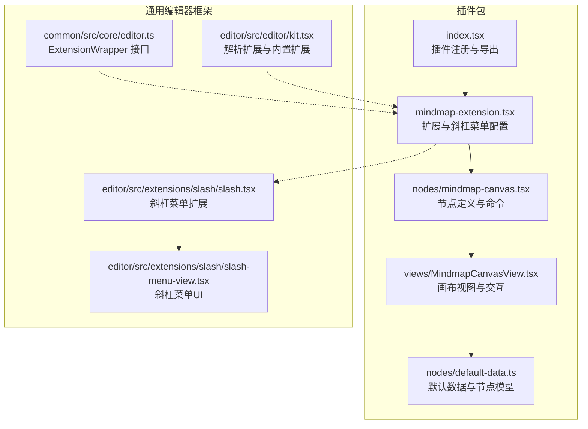
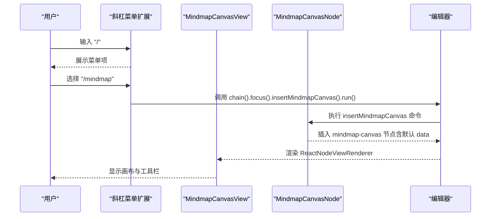
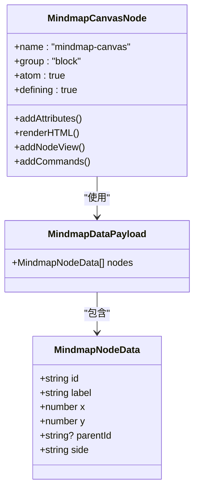
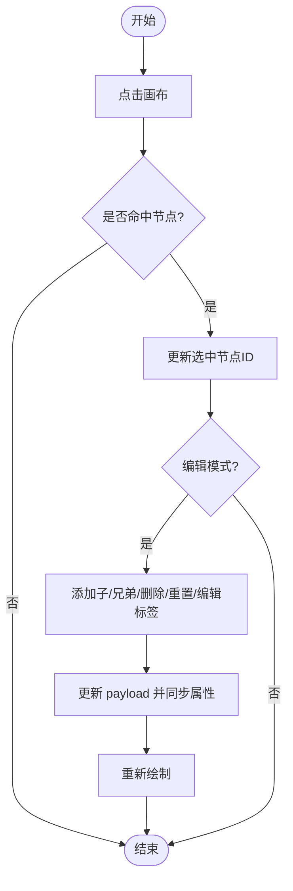
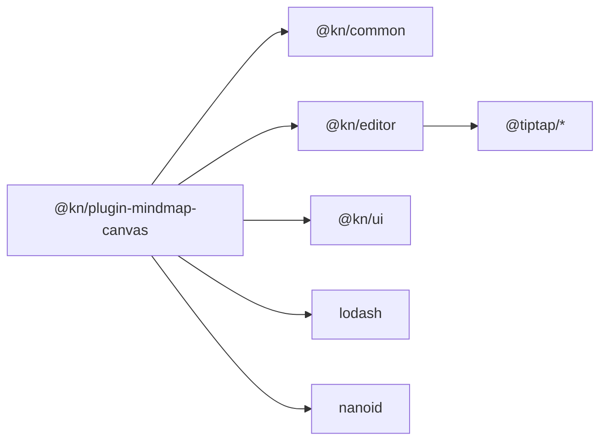

# 思维导图插件

<cite>
**本文引用的文件**
- [packages/plugin-mindmap-canvas/src/index.tsx](file://packages/plugin-mindmap-canvas/src/index.tsx)
- [packages/plugin-mindmap-canvas/src/mindmap-extension.tsx](file://packages/plugin-mindmap-canvas/src/mindmap-extension.tsx)
- [packages/plugin-mindmap-canvas/src/nodes/mindmap-canvas.tsx](file://packages/plugin-mindmap-canvas/src/nodes/mindmap-canvas.tsx)
- [packages/plugin-mindmap-canvas/src/views/MindmapCanvasView.tsx](file://packages/plugin-mindmap-canvas/src/views/MindmapCanvasView.tsx)
- [packages/plugin-mindmap-canvas/src/nodes/default-data.ts](file://packages/plugin-mindmap-canvas/src/nodes/default-data.ts)
- [packages/plugin-mindmap-canvas/package.json](file://packages/plugin-mindmap-canvas/package.json)
- [packages/plugin-mindmap-canvas/tsconfig.json](file://packages/plugin-mindmap-canvas/tsconfig.json)
- [packages/common/src/core/editor.ts](file://packages/common/src/core/editor.ts)
- [packages/editor/src/editor/kit.tsx](file://packages/editor/src/editor/kit.tsx)
- [packages/editor/src/extensions/slash/slash.tsx](file://packages/editor/src/extensions/slash/slash.tsx)
- [packages/editor/src/extensions/slash/slash-menu-view.tsx](file://packages/editor/src/extensions/slash/slash-menu-view.tsx)
</cite>

## 目录
1. [引言](#引言)
2. [项目结构](#项目结构)
3. [核心组件](#核心组件)
4. [架构总览](#架构总览)
5. [详细组件分析](#详细组件分析)
6. [依赖关系分析](#依赖关系分析)
7. [性能考虑](#性能考虑)
8. [故障排查指南](#故障排查指南)
9. [结论](#结论)
10. [附录：使用示例与最佳实践](#附录使用示例与最佳实践)

## 引言
本文件面向“思维导图（Canvas）”插件，系统性阐述其功能与实现，覆盖以下方面：
- 画布渲染与节点管理：基于 HTML Canvas 的节点绘制、连线、选中态与文本换行。
- 交互操作：节点点击选择、添加子/兄弟节点、删除节点、重置布局与标签编辑。
- 视图实现：节点创建、拖拽能力现状与扩展建议、样式定制与主题适配。
- 数据结构：节点模型、默认数据与 payload 组织方式。
- 布局算法：当前为手动布局，提供可演进的自动布局思路。
- 渲染机制：React 节点视图、属性更新与响应式刷新。
- 使用示例与最佳实践：如何在编辑器中插入、编辑与优化思维导图。

## 项目结构
该插件采用“插件入口 + 扩展 + 节点定义 + 视图”的分层组织方式，配合通用编辑器框架完成集成。

图表来源
- [packages/plugin-mindmap-canvas/src/index.tsx](file://packages/plugin-mindmap-canvas/src/index.tsx#L1-L13)
- [packages/plugin-mindmap-canvas/src/mindmap-extension.tsx](file://packages/plugin-mindmap-canvas/src/mindmap-extension.tsx#L1-L18)
- [packages/plugin-mindmap-canvas/src/nodes/mindmap-canvas.tsx](file://packages/plugin-mindmap-canvas/src/nodes/mindmap-canvas.tsx#L1-L52)
- [packages/plugin-mindmap-canvas/src/views/MindmapCanvasView.tsx](file://packages/plugin-mindmap-canvas/src/views/MindmapCanvasView.tsx#L1-L249)
- [packages/plugin-mindmap-canvas/src/nodes/default-data.ts](file://packages/plugin-mindmap-canvas/src/nodes/default-data.ts#L1-L42)
- [packages/common/src/core/editor.ts](file://packages/common/src/core/editor.ts#L1-L30)
- [packages/editor/src/editor/kit.tsx](file://packages/editor/src/editor/kit.tsx#L52-L86)
- [packages/editor/src/extensions/slash/slash.tsx](file://packages/editor/src/extensions/slash/slash.tsx#L1-L145)
- [packages/editor/src/extensions/slash/slash-menu-view.tsx](file://packages/editor/src/extensions/slash/slash-menu-view.tsx#L1-L149)

章节来源
- [packages/plugin-mindmap-canvas/src/index.tsx](file://packages/plugin-mindmap-canvas/src/index.tsx#L1-L13)
- [packages/plugin-mindmap-canvas/src/mindmap-extension.tsx](file://packages/plugin-mindmap-canvas/src/mindmap-extension.tsx#L1-L18)
- [packages/plugin-mindmap-canvas/src/nodes/mindmap-canvas.tsx](file://packages/plugin-mindmap-canvas/src/nodes/mindmap-canvas.tsx#L1-L52)
- [packages/plugin-mindmap-canvas/src/views/MindmapCanvasView.tsx](file://packages/plugin-mindmap-canvas/src/views/MindmapCanvasView.tsx#L1-L249)
- [packages/plugin-mindmap-canvas/src/nodes/default-data.ts](file://packages/plugin-mindmap-canvas/src/nodes/default-data.ts#L1-L42)
- [packages/common/src/core/editor.ts](file://packages/common/src/core/editor.ts#L1-L30)
- [packages/editor/src/editor/kit.tsx](file://packages/editor/src/editor/kit.tsx#L52-L86)
- [packages/editor/src/extensions/slash/slash.tsx](file://packages/editor/src/extensions/slash/slash.tsx#L1-L145)
- [packages/editor/src/extensions/slash/slash-menu-view.tsx](file://packages/editor/src/extensions/slash/slash-menu-view.tsx#L1-L149)

## 核心组件
- 插件入口与注册
  - 通过 KPlugin 注册插件，导出实例并声明 editorExtension 为 MindmapCanvasExtension。
  - 参考路径：[packages/plugin-mindmap-canvas/src/index.tsx](file://packages/plugin-mindmap-canvas/src/index.tsx#L1-L13)

- 扩展与斜杠菜单
  - 定义扩展名称与包含的节点，并提供斜杠菜单项“/mindmap”，触发插入命令。
  - 参考路径：[packages/plugin-mindmap-canvas/src/mindmap-extension.tsx](file://packages/plugin-mindmap-canvas/src/mindmap-extension.tsx#L1-L18)

- 节点定义与命令
  - 节点名为 mindmap-canvas，属性 data 默认值来自默认数据工厂。
  - 提供 ReactNodeViewRenderer 渲染视图，并注册 insertMindmapCanvas 命令用于插入节点。
  - 参考路径：[packages/plugin-mindmap-canvas/src/nodes/mindmap-canvas.tsx](file://packages/plugin-mindmap-canvas/src/nodes/mindmap-canvas.tsx#L1-L52)

- 画布视图与交互
  - 使用 HTML Canvas 绘制连线与节点，支持节点选择、标签编辑、添加子/兄弟节点、删除节点、重置布局。
  - 支持响应式尺寸与高分屏缩放，文本自动换行。
  - 参考路径：[packages/plugin-mindmap-canvas/src/views/MindmapCanvasView.tsx](file://packages/plugin-mindmap-canvas/src/views/MindmapCanvasView.tsx#L1-L249)

- 默认数据与节点模型
  - 定义 MindmapNodeData 与 MindmapDataPayload，提供 createDefaultMindmap 初始化数据。
  - 参考路径：[packages/plugin-mindmap-canvas/src/nodes/default-data.ts](file://packages/plugin-mindmap-canvas/src/nodes/default-data.ts#L1-L42)

章节来源
- [packages/plugin-mindmap-canvas/src/index.tsx](file://packages/plugin-mindmap-canvas/src/index.tsx#L1-L13)
- [packages/plugin-mindmap-canvas/src/mindmap-extension.tsx](file://packages/plugin-mindmap-canvas/src/mindmap-extension.tsx#L1-L18)
- [packages/plugin-mindmap-canvas/src/nodes/mindmap-canvas.tsx](file://packages/plugin-mindmap-canvas/src/nodes/mindmap-canvas.tsx#L1-L52)
- [packages/plugin-mindmap-canvas/src/views/MindmapCanvasView.tsx](file://packages/plugin-mindmap-canvas/src/views/MindmapCanvasView.tsx#L1-L249)
- [packages/plugin-mindmap-canvas/src/nodes/default-data.ts](file://packages/plugin-mindmap-canvas/src/nodes/default-data.ts#L1-L42)

## 架构总览
思维导图插件在编辑器中的工作流如下：

图表来源
- [packages/plugin-mindmap-canvas/src/mindmap-extension.tsx](file://packages/plugin-mindmap-canvas/src/mindmap-extension.tsx#L1-L18)
- [packages/plugin-mindmap-canvas/src/nodes/mindmap-canvas.tsx](file://packages/plugin-mindmap-canvas/src/nodes/mindmap-canvas.tsx#L38-L50)
- [packages/editor/src/extensions/slash/slash.tsx](file://packages/editor/src/extensions/slash/slash.tsx#L1-L145)
- [packages/editor/src/editor/kit.tsx](file://packages/editor/src/editor/kit.tsx#L52-L86)

## 详细组件分析

### 数据结构与布局
- 节点模型
  - 字段：id、label、x、y、parentId、side（left/right/center）。
  - 参考路径：[packages/plugin-mindmap-canvas/src/nodes/default-data.ts](file://packages/plugin-mindmap-canvas/src/nodes/default-data.ts#L1-L13)

- 默认数据
  - 包含根节点与两个初始分支节点，提供初始布局参考。
  - 参考路径：[packages/plugin-mindmap-canvas/src/nodes/default-data.ts](file://packages/plugin-mindmap-canvas/src/nodes/default-data.ts#L14-L42)

- 当前布局策略
  - 手动布局：节点坐标由默认数据与添加逻辑直接设定，未引入自动布局算法。
  - 可演进方向：可替换为树形布局算法（如 Reingold–Tilford）或力导向布局，以支持动态调整与自适应排版。

- payload 管理
  - 视图内部维护 payload 并通过 updateAttributes 同步回节点属性，保证持久化。
  - 参考路径：[packages/plugin-mindmap-canvas/src/views/MindmapCanvasView.tsx](file://packages/plugin-mindmap-canvas/src/views/MindmapCanvasView.tsx#L49-L54)

图表来源
- [packages/plugin-mindmap-canvas/src/nodes/default-data.ts](file://packages/plugin-mindmap-canvas/src/nodes/default-data.ts#L1-L42)
- [packages/plugin-mindmap-canvas/src/nodes/mindmap-canvas.tsx](file://packages/plugin-mindmap-canvas/src/nodes/mindmap-canvas.tsx#L1-L52)

章节来源
- [packages/plugin-mindmap-canvas/src/nodes/default-data.ts](file://packages/plugin-mindmap-canvas/src/nodes/default-data.ts#L1-L42)
- [packages/plugin-mindmap-canvas/src/nodes/mindmap-canvas.tsx](file://packages/plugin-mindmap-canvas/src/nodes/mindmap-canvas.tsx#L1-L52)

### 画布渲染与交互流程
- 尺寸与高分屏适配
  - 读取容器尺寸，设置 canvas 的 width/height 与 style，并按 devicePixelRatio 缩放上下文。
  - 参考路径：[packages/plugin-mindmap-canvas/src/views/MindmapCanvasView.tsx](file://packages/plugin-mindmap-canvas/src/views/MindmapCanvasView.tsx#L26-L41)

- 连线与节点绘制
  - 遍历节点，根据 parentId 绘制从父到子的连线；绘制节点圆与居中文本（自动换行）。
  - 参考路径：[packages/plugin-mindmap-canvas/src/views/MindmapCanvasView.tsx](file://packages/plugin-mindmap-canvas/src/views/MindmapCanvasView.tsx#L60-L99)

- 文本换行
  - 按空格拆词，逐行测量宽度，超过节点直径则换行。
  - 参考路径：[packages/plugin-mindmap-canvas/src/views/MindmapCanvasView.tsx](file://packages/plugin-mindmap-canvas/src/views/MindmapCanvasView.tsx#L102-L117)

- 节点选择与点击命中
  - 计算点击位置到节点中心的距离，小于半径+内边距阈值即视为命中。
  - 参考路径：[packages/plugin-mindmap-canvas/src/views/MindmapCanvasView.tsx](file://packages/plugin-mindmap-canvas/src/views/MindmapCanvasView.tsx#L119-L125)

- 交互操作
  - 添加子节点：根据父节点侧（left/right/center）与兄弟数量计算偏移，生成新节点并加入 payload。
  - 添加兄弟节点：同父节点下按顺序排列，保持左右分布。
  - 删除节点：递归收集待删除节点集合，保留剩余节点并重置选中为根节点。
  - 重置布局：恢复默认数据。
  - 标签编辑：更新当前选中节点的 label。
  - 参考路径：[packages/plugin-mindmap-canvas/src/views/MindmapCanvasView.tsx](file://packages/plugin-mindmap-canvas/src/views/MindmapCanvasView.tsx#L140-L205)

图表来源
- [packages/plugin-mindmap-canvas/src/views/MindmapCanvasView.tsx](file://packages/plugin-mindmap-canvas/src/views/MindmapCanvasView.tsx#L119-L205)

章节来源
- [packages/plugin-mindmap-canvas/src/views/MindmapCanvasView.tsx](file://packages/plugin-mindmap-canvas/src/views/MindmapCanvasView.tsx#L1-L249)

### 视图实现与集成
- React 节点视图
  - 使用 ReactNodeViewRenderer 渲染 MindmapCanvasView，stopEvent 设置为 true 以阻止事件冒泡影响编辑器。
  - 参考路径：[packages/plugin-mindmap-canvas/src/nodes/mindmap-canvas.tsx](file://packages/plugin-mindmap-canvas/src/nodes/mindmap-canvas.tsx#L32-L36)

- 插入命令
  - insertMindmapCanvas 会向编辑器插入 mindmap-canvas 节点，并携带默认 data。
  - 参考路径：[packages/plugin-mindmap-canvas/src/nodes/mindmap-canvas.tsx](file://packages/plugin-mindmap-canvas/src/nodes/mindmap-canvas.tsx#L38-L49)

- 斜杠菜单集成
  - 扩展中定义 slashConfig，提供“/mindmap”菜单项，调用链聚焦后插入节点。
  - 参考路径：[packages/plugin-mindmap-canvas/src/mindmap-extension.tsx](file://packages/plugin-mindmap-canvas/src/mindmap-extension.tsx#L8-L17)

- 通用编辑器框架
  - ExtensionWrapper 接口定义扩展的名称、菜单与工具等；resolveEditorKit 将扩展注入编辑器运行时。
  - 参考路径：[packages/common/src/core/editor.ts](file://packages/common/src/core/editor.ts#L1-L30), [packages/editor/src/editor/kit.tsx](file://packages/editor/src/editor/kit.tsx#L52-L86)

章节来源
- [packages/plugin-mindmap-canvas/src/nodes/mindmap-canvas.tsx](file://packages/plugin-mindmap-canvas/src/nodes/mindmap-canvas.tsx#L1-L52)
- [packages/plugin-mindmap-canvas/src/mindmap-extension.tsx](file://packages/plugin-mindmap-canvas/src/mindmap-extension.tsx#L1-L18)
- [packages/common/src/core/editor.ts](file://packages/common/src/core/editor.ts#L1-L30)
- [packages/editor/src/editor/kit.tsx](file://packages/editor/src/editor/kit.tsx#L52-L86)

## 依赖关系分析
- 内部依赖
  - @kn/common：提供 ExtensionWrapper 接口与插件基类。
  - @kn/editor：提供节点视图渲染、命令扩展与 React 集成。
  - @kn/ui：提供 UI 工具与样式基础。
  - lodash、nanoid：工具库与唯一 ID 生成。

- 外部依赖
  - 浏览器原生 Canvas API：用于绘制连线与节点。
  - React：用于节点视图与交互 UI。
  - Floating UI（编辑器斜杠菜单）：用于定位与滚动。

图表来源
- [packages/plugin-mindmap-canvas/package.json](file://packages/plugin-mindmap-canvas/package.json#L15-L31)

章节来源
- [packages/plugin-mindmap-canvas/package.json](file://packages/plugin-mindmap-canvas/package.json#L1-L36)
- [packages/plugin-mindmap-canvas/tsconfig.json](file://packages/plugin-mindmap-canvas/tsconfig.json#L1-L28)

## 性能考虑
- 绘制优化
  - 仅在节点列表或画布尺寸变化时重绘，避免频繁重绘。
  - 高分屏缩放后统一使用设备像素比，减少模糊。
  - 文本换行采用逐词测量，建议对长文本进行缓存或节流。
  - 参考路径：[packages/plugin-mindmap-canvas/src/views/MindmapCanvasView.tsx](file://packages/plugin-mindmap-canvas/src/views/MindmapCanvasView.tsx#L26-L41), [packages/plugin-mindmap-canvas/src/views/MindmapCanvasView.tsx](file://packages/plugin-mindmap-canvas/src/views/MindmapCanvasView.tsx#L60-L99)

- 交互性能
  - 点击命中检测为 O(n) 遍历，节点较多时可引入四叉树或空间分割加速。
  - 更新 payload 使用浅拷贝克隆，避免直接修改引用导致的不可控重渲染。
  - 参考路径：[packages/plugin-mindmap-canvas/src/views/MindmapCanvasView.tsx](file://packages/plugin-mindmap-canvas/src/views/MindmapCanvasView.tsx#L11-L13), [packages/plugin-mindmap-canvas/src/views/MindmapCanvasView.tsx](file://packages/plugin-mindmap-canvas/src/views/MindmapCanvasView.tsx#L119-L125)

- 布局演进
  - 自动布局算法（如 Reingold–Tilford）可显著提升大规模节点的可读性与稳定性。
  - 参考路径：[packages/plugin-mindmap-canvas/src/nodes/default-data.ts](file://packages/plugin-mindmap-canvas/src/nodes/default-data.ts#L14-L42)

## 故障排查指南
- 插入失败或无反应
  - 检查斜杠菜单是否正确注册，确认扩展已注入编辑器运行时。
  - 参考路径：[packages/plugin-mindmap-canvas/src/mindmap-extension.tsx](file://packages/plugin-mindmap-canvas/src/mindmap-extension.tsx#L8-L17), [packages/editor/src/editor/kit.tsx](file://packages/editor/src/editor/kit.tsx#L52-L86)

- 画布不显示或空白
  - 确认容器尺寸变化监听生效，检查 canvas 尺寸与 style 是否一致，以及 devicePixelRatio 缩放是否应用。
  - 参考路径：[packages/plugin-mindmap-canvas/src/views/MindmapCanvasView.tsx](file://packages/plugin-mindmap-canvas/src/views/MindmapCanvasView.tsx#L26-L41)

- 节点无法选择
  - 检查点击命中半径与内边距阈值，确保坐标转换正确。
  - 参考路径：[packages/plugin-mindmap-canvas/src/views/MindmapCanvasView.tsx](file://packages/plugin-mindmap-canvas/src/views/MindmapCanvasView.tsx#L119-L125)

- 标签编辑无效
  - 确认处于可编辑状态，检查 updatePayload 与 updateAttributes 的调用链。
  - 参考路径：[packages/plugin-mindmap-canvas/src/views/MindmapCanvasView.tsx](file://packages/plugin-mindmap-canvas/src/views/MindmapCanvasView.tsx#L195-L200), [packages/plugin-mindmap-canvas/src/views/MindmapCanvasView.tsx](file://packages/plugin-mindmap-canvas/src/views/MindmapCanvasView.tsx#L49-L54)

## 结论
该思维导图插件以轻量的 Canvas 实现提供了直观的节点绘制与交互体验，具备良好的扩展性。当前以手动布局为主，适合快速原型与小规模知识整理；对于大规模节点与复杂交互，建议引入自动布局算法与空间索引优化，以进一步提升性能与可用性。

## 附录：使用示例与最佳实践
- 在编辑器中插入思维导图
  - 在任意位置输入斜杠“/”，选择“/mindmap”菜单项，即可插入默认数据的思维导图节点。
  - 参考路径：[packages/plugin-mindmap-canvas/src/mindmap-extension.tsx](file://packages/plugin-mindmap-canvas/src/mindmap-extension.tsx#L8-L17), [packages/plugin-mindmap-canvas/src/nodes/mindmap-canvas.tsx](file://packages/plugin-mindmap-canvas/src/nodes/mindmap-canvas.tsx#L38-L49)

- 编辑节点
  - 点击画布选择节点，在顶部输入框修改标签；支持添加子/兄弟节点、删除节点与重置布局。
  - 参考路径：[packages/plugin-mindmap-canvas/src/views/MindmapCanvasView.tsx](file://packages/plugin-mindmap-canvas/src/views/MindmapCanvasView.tsx#L136-L205)

- 样式定制建议
  - 节点颜色：根据选中态切换不同填充色，未选中使用深色背景，选中使用蓝色强调。
  - 连线样式：统一线条宽度与颜色，确保对比度良好。
  - 文本样式：固定字号与字体族，控制行高与行数，避免过长文本遮挡连线。
  - 参考路径：[packages/plugin-mindmap-canvas/src/views/MindmapCanvasView.tsx](file://packages/plugin-mindmap-canvas/src/views/MindmapCanvasView.tsx#L83-L99)

- 性能优化最佳实践
  - 控制节点数量与重绘频率，必要时启用节流或虚拟化策略。
  - 对命中检测引入空间索引（如四叉树），降低点击检测复杂度。
  - 使用高分屏缩放时，优先在初始化阶段设置，避免重复缩放。
  - 参考路径：[packages/plugin-mindmap-canvas/src/views/MindmapCanvasView.tsx](file://packages/plugin-mindmap-canvas/src/views/MindmapCanvasView.tsx#L26-L41), [packages/plugin-mindmap-canvas/src/views/MindmapCanvasView.tsx](file://packages/plugin-mindmap-canvas/src/views/MindmapCanvasView.tsx#L119-L125)