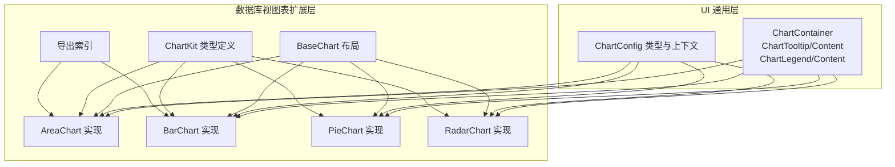
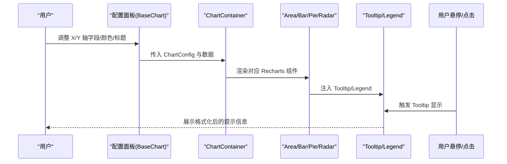
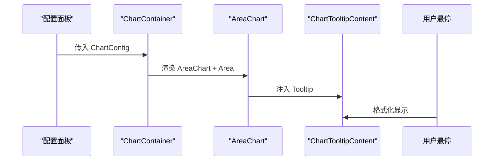
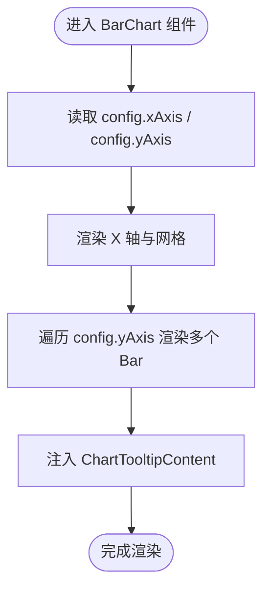
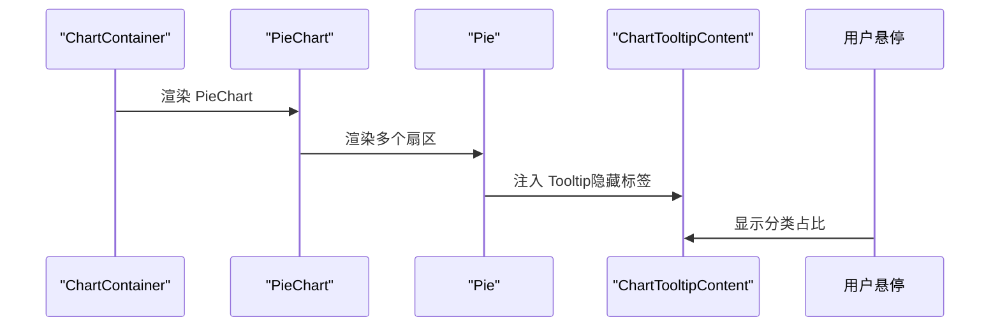
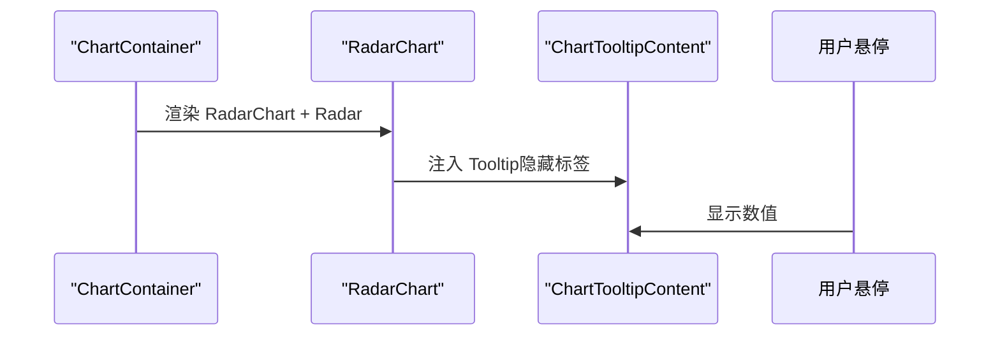
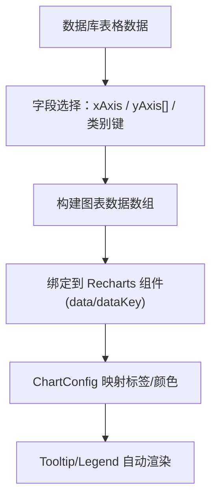
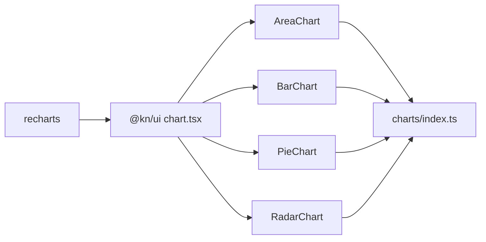

# 图表视图

<cite>
**本文引用的文件**
- [packages/ui/src/components/ui/chart.tsx](file://packages/ui/src/components/ui/chart.tsx)
- [packages/ui/src/charts/index.ts](file://packages/ui/src/charts/index.ts)
- [packages/plugin-database/src/database/view/charts/BaseChart.tsx](file://packages/plugin-database/src/database/view/charts/BaseChart.tsx)
- [packages/plugin-database/src/database/view/charts/AreaChart.tsx](file://packages/plugin-database/src/database/view/charts/AreaChart.tsx)
- [packages/plugin-database/src/database/view/charts/BarChart.tsx](file://packages/plugin-database/src/database/view/charts/BarChart.tsx)
- [packages/plugin-database/src/database/view/charts/PieChart.tsx](file://packages/plugin-database/src/database/view/charts/PieChart.tsx)
- [packages/plugin-database/src/database/view/charts/RadarChart.tsx](file://packages/plugin-database/src/database/view/charts/RadarChart.tsx)
- [packages/plugin-database/src/database/view/charts/types.ts](file://packages/plugin-database/src/database/view/charts/types.ts)
- [packages/plugin-database/src/database/view/charts/index.ts](file://packages/plugin-database/src/database/view/charts/index.ts)
</cite>

## 目录
1. [简介](#简介)
2. [项目结构](#项目结构)
3. [核心组件](#核心组件)
4. [架构总览](#架构总览)
5. [详细组件分析](#详细组件分析)
6. [依赖关系分析](#依赖关系分析)
7. [性能考虑](#性能考虑)
8. [故障排查指南](#故障排查指南)
9. [结论](#结论)
10. [附录](#附录)

## 简介
本章节面向“图表视图”能力，系统性介绍基于 Recharts 的图表渲染体系，覆盖面积图、柱状图、饼图、雷达图等常见图表类型的实现方式与配置入口；阐明从数据库表格数据到图表组件数据格式的转换机制；说明交互能力（筛选、动态更新、配置调整）；并提供选型建议、性能优化、动画与响应式设计实践。

## 项目结构
图表视图由两部分组成：
- 通用图表容器与工具：位于 UI 包，提供 ChartContainer、ChartTooltip、ChartLegend 等可复用组件及主题色注入能力。
- 数据库视图表扩展：位于数据库插件包，提供 AreaChart、BarChart、PieChart、RadarChart 等具体图表实现，并通过 BaseChart 统一布局与配置面板。



**图表来源**
- [packages/ui/src/components/ui/chart.tsx](file://packages/ui/src/components/ui/chart.tsx#L1-L364)
- [packages/plugin-database/src/database/view/charts/BaseChart.tsx](file://packages/plugin-database/src/database/view/charts/BaseChart.tsx#L1-L37)
- [packages/plugin-database/src/database/view/charts/AreaChart.tsx](file://packages/plugin-database/src/database/view/charts/AreaChart.tsx#L1-L86)
- [packages/plugin-database/src/database/view/charts/BarChart.tsx](file://packages/plugin-database/src/database/view/charts/BarChart.tsx#L1-L238)
- [packages/plugin-database/src/database/view/charts/PieChart.tsx](file://packages/plugin-database/src/database/view/charts/PieChart.tsx#L1-L127)
- [packages/plugin-database/src/database/view/charts/RadarChart.tsx](file://packages/plugin-database/src/database/view/charts/RadarChart.tsx#L1-L81)
- [packages/plugin-database/src/database/view/charts/types.ts](file://packages/plugin-database/src/database/view/charts/types.ts#L1-L7)
- [packages/plugin-database/src/database/view/charts/index.ts](file://packages/plugin-database/src/database/view/charts/index.ts#L1-L3)

**章节来源**
- [packages/ui/src/components/ui/chart.tsx](file://packages/ui/src/components/ui/chart.tsx#L1-L364)
- [packages/plugin-database/src/database/view/charts/BaseChart.tsx](file://packages/plugin-database/src/database/view/charts/BaseChart.tsx#L1-L37)
- [packages/plugin-database/src/database/view/charts/AreaChart.tsx](file://packages/plugin-database/src/database/view/charts/AreaChart.tsx#L1-L86)
- [packages/plugin-database/src/database/view/charts/BarChart.tsx](file://packages/plugin-database/src/database/view/charts/BarChart.tsx#L1-L238)
- [packages/plugin-database/src/database/view/charts/PieChart.tsx](file://packages/plugin-database/src/database/view/charts/PieChart.tsx#L1-L127)
- [packages/plugin-database/src/database/view/charts/RadarChart.tsx](file://packages/plugin-database/src/database/view/charts/RadarChart.tsx#L1-L81)
- [packages/plugin-database/src/database/view/charts/types.ts](file://packages/plugin-database/src/database/view/charts/types.ts#L1-L7)
- [packages/plugin-database/src/database/view/charts/index.ts](file://packages/plugin-database/src/database/view/charts/index.ts#L1-L3)

## 核心组件
- ChartContainer：提供响应式容器、主题色注入、默认样式类，作为所有图表的根容器。
- ChartTooltip/ChartTooltipContent：统一的悬浮提示，支持隐藏标签/指示器、自定义格式化器、多条目嵌套显示。
- ChartLegend/ChartLegendContent：统一的图例渲染，支持图标、颜色、垂直对齐等。
- ChartConfig：用于将数据键映射到标签、颜色或主题色，贯穿 Tooltip/Legend/样式变量生成。
- UI 层导出：UI 包将 recharts 全量导出，便于直接按需引入具体图表组件。

关键点
- 主题色通过 CSS 变量注入，支持 light/dark 两套主题。
- Tooltip/Legend 通过 useChart 上下文读取 ChartConfig，自动匹配数据键对应的标签与颜色。
- UI 层对 recharts 进行了轻量封装，保留原生 API 的同时增强一致性与可定制性。

**章节来源**
- [packages/ui/src/components/ui/chart.tsx](file://packages/ui/src/components/ui/chart.tsx#L1-L364)
- [packages/ui/src/charts/index.ts](file://packages/ui/src/charts/index.ts#L1-L1)

## 架构总览
图表视图采用“通用容器 + 具体图表实现”的分层架构。UI 层提供统一的容器与交互组件，数据库视图表扩展层在该基础上完成数据绑定、配置面板与具体图表渲染。



**图表来源**
- [packages/plugin-database/src/database/view/charts/BaseChart.tsx](file://packages/plugin-database/src/database/view/charts/BaseChart.tsx#L1-L37)
- [packages/plugin-database/src/database/view/charts/AreaChart.tsx](file://packages/plugin-database/src/database/view/charts/AreaChart.tsx#L1-L86)
- [packages/plugin-database/src/database/view/charts/BarChart.tsx](file://packages/plugin-database/src/database/view/charts/BarChart.tsx#L1-L238)
- [packages/plugin-database/src/database/view/charts/PieChart.tsx](file://packages/plugin-database/src/database/view/charts/PieChart.tsx#L1-L127)
- [packages/plugin-database/src/database/view/charts/RadarChart.tsx](file://packages/plugin-database/src/database/view/charts/RadarChart.tsx#L1-L81)
- [packages/ui/src/components/ui/chart.tsx](file://packages/ui/src/components/ui/chart.tsx#L1-L364)

## 详细组件分析

### 通用图表容器与工具（UI 层）
- ChartContainer
  - 功能：包裹响应式容器，注入主题色 CSS 变量，设置默认样式类，承载 Tooltip/Legend。
  - 关键实现位置：[ChartContainer 定义](file://packages/ui/src/components/ui/chart.tsx#L35-L67)，[ChartStyle 注入](file://packages/ui/src/components/ui/chart.tsx#L68-L99)。
- ChartTooltip/ChartTooltipContent
  - 功能：统一提示内容，支持隐藏标签/指示器、自定义格式化器、多条目显示、指示器样式（line/dot/dashed）。
  - 关键实现位置：[ChartTooltip/Content](file://packages/ui/src/components/ui/chart.tsx#L101-L256)，[getPayloadConfigFromPayload](file://packages/ui/src/components/ui/chart.tsx#L317-L355)。
- ChartLegend/ChartLegendContent
  - 功能：统一图例渲染，支持图标、颜色、垂直对齐、名称键映射。
  - 关键实现位置：[ChartLegend/Content](file://packages/ui/src/components/ui/chart.tsx#L257-L316)。
- ChartConfig 与上下文
  - 功能：提供标签、颜色或主题色映射，贯穿 Tooltip/Legend/样式变量生成。
  - 关键实现位置：[ChartConfig 类型](file://packages/ui/src/components/ui/chart.tsx#L9-L18)，[useChart 上下文](file://packages/ui/src/components/ui/chart.tsx#L23-L33)。

```mermaid
classDiagram
class ChartContainer {
+config : ChartConfig
+children : ReactNode
}
class ChartTooltip {
+content : TooltipContent
}
class ChartTooltipContent {
+hideLabel : boolean
+hideIndicator : boolean
+indicator : "line"|"dot"|"dashed"
+formatter(...)
}
class ChartLegend {
+payload : LegendPayload[]
}
class ChartLegendContent {
+hideIcon : boolean
+nameKey : string
}
class ChartConfig {
+[key : string] : { label?, icon?, color?, theme? }
}
ChartContainer --> ChartTooltip : "提供上下文"
ChartContainer --> ChartLegend : "提供上下文"
ChartTooltip --> ChartTooltipContent : "组合"
ChartLegend --> ChartLegendContent : "组合"
ChartContainer --> ChartConfig : "消费"
```

**图表来源**
- [packages/ui/src/components/ui/chart.tsx](file://packages/ui/src/components/ui/chart.tsx#L1-L364)

**章节来源**
- [packages/ui/src/components/ui/chart.tsx](file://packages/ui/src/components/ui/chart.tsx#L1-L364)

### 面积图（AreaChart）
- 数据与配置
  - 数据键：如 desktop。
  - 配置项：ChartConfig 中的 desktop 键，包含 label 与 color/theme。
- 渲染要点
  - 使用 AreaChart、Area、CartesianGrid、XAxis 等组件。
  - Tooltip 采用线性指示器，Area 使用 CSS 变量填充与描边。
- 配置面板
  - 当前示例中配置面板为空，实际可扩展为字段选择、样式调整等。
- 关键实现位置
  - [示例数据与配置](file://packages/plugin-database/src/database/view/charts/AreaChart.tsx#L23-L38)
  - [组件渲染流程](file://packages/plugin-database/src/database/view/charts/AreaChart.tsx#L39-L80)
  - [ChartKit 导出](file://packages/plugin-database/src/database/view/charts/AreaChart.tsx#L82-L86)



**图表来源**
- [packages/plugin-database/src/database/view/charts/AreaChart.tsx](file://packages/plugin-database/src/database/view/charts/AreaChart.tsx#L1-L86)
- [packages/ui/src/components/ui/chart.tsx](file://packages/ui/src/components/ui/chart.tsx#L101-L256)

**章节来源**
- [packages/plugin-database/src/database/view/charts/AreaChart.tsx](file://packages/plugin-database/src/database/view/charts/AreaChart.tsx#L1-L86)

### 柱状图（BarChart）
- 数据与配置
  - 多 Y 轴支持：通过 config.yAxis 数组管理多个数据键与颜色。
  - X 轴字段：config.xAxis 指定横轴字段。
- 渲染要点
  - 使用 BarChart、Bar、CartesianGrid、XAxis 等组件。
  - Tooltip 采用虚线指示器，Bar 支持圆角与颜色映射。
- 配置面板
  - 支持动态增删 Y 轴字段、颜色选择、标题/描述/页脚编辑。
- 关键实现位置
  - [ChartConfig 定义](file://packages/plugin-database/src/database/view/charts/BarChart.tsx#L22-L31)
  - [配置面板交互](file://packages/plugin-database/src/database/view/charts/BarChart.tsx#L41-L203)
  - [渲染与数据绑定](file://packages/plugin-database/src/database/view/charts/BarChart.tsx#L205-L231)
  - [ChartKit 导出](file://packages/plugin-database/src/database/view/charts/BarChart.tsx#L233-L238)



**图表来源**
- [packages/plugin-database/src/database/view/charts/BarChart.tsx](file://packages/plugin-database/src/database/view/charts/BarChart.tsx#L1-L238)
- [packages/ui/src/components/ui/chart.tsx](file://packages/ui/src/components/ui/chart.tsx#L101-L256)

**章节来源**
- [packages/plugin-database/src/database/view/charts/BarChart.tsx](file://packages/plugin-database/src/database/view/charts/BarChart.tsx#L1-L238)

### 饼图（PieChart）
- 数据与配置
  - 数据键：如 visitors；类别键：如 browser。
  - 配置项：对类别键（如 chrome/safari/firefox/edge/other）与总体键（如 visitors）分别配置 label/color。
- 渲染要点
  - 使用 PieChart、Pie、ChartLabel 自定义中心文本。
  - Tooltip 隐藏标签，仅显示数值。
- 关键实现位置
  - [示例数据与配置](file://packages/plugin-database/src/database/view/charts/PieChart.tsx#L21-L54)
  - [渲染与中心文本](file://packages/plugin-database/src/database/view/charts/PieChart.tsx#L67-L114)



**图表来源**
- [packages/plugin-database/src/database/view/charts/PieChart.tsx](file://packages/plugin-database/src/database/view/charts/PieChart.tsx#L1-L127)
- [packages/ui/src/components/ui/chart.tsx](file://packages/ui/src/components/ui/chart.tsx#L101-L256)

**章节来源**
- [packages/plugin-database/src/database/view/charts/PieChart.tsx](file://packages/plugin-database/src/database/view/charts/PieChart.tsx#L1-L127)

### 雷达图（RadarChart）
- 数据与配置
  - 数据键：如 month（角度轴）、desktop（半径轴）。
  - 配置项：对 desktop 配置 label/color。
- 渲染要点
  - 使用 RadarChart、Radar、PolarGrid、PolarAngleAxis。
  - Tooltip 隐藏标签，PolarGrid 自定义极坐标网格。
- 关键实现位置
  - [示例数据与配置](file://packages/plugin-database/src/database/view/charts/RadarChart.tsx#L21-L36)
  - [渲染流程](file://packages/plugin-database/src/database/view/charts/RadarChart.tsx#L47-L64)



**图表来源**
- [packages/plugin-database/src/database/view/charts/RadarChart.tsx](file://packages/plugin-database/src/database/view/charts/RadarChart.tsx#L1-L81)
- [packages/ui/src/components/ui/chart.tsx](file://packages/ui/src/components/ui/chart.tsx#L101-L256)

**章节来源**
- [packages/plugin-database/src/database/view/charts/RadarChart.tsx](file://packages/plugin-database/src/database/view/charts/RadarChart.tsx#L1-L81)

### 数据转换机制（从数据库表格到图表）
- 字段映射
  - X 轴：config.xAxis 对应列 ID，作为 XAxis 的 dataKey。
  - Y 轴：config.yAxis 为数组，每个元素包含 value（列 ID）与 color，作为多个 Bar 的 dataKey。
  - 类别键：PieChart 的 browser 与 visitors 分别对应类别与数值。
- 数据格式
  - Recharts 接受数组对象，每项包含 dataKey 对应的字段值。
- 配置驱动
  - ChartConfig 将数据键映射为标签与颜色，Tooltip/Legend 自动识别并渲染。



**图表来源**
- [packages/plugin-database/src/database/view/charts/BarChart.tsx](file://packages/plugin-database/src/database/view/charts/BarChart.tsx#L205-L231)
- [packages/plugin-database/src/database/view/charts/PieChart.tsx](file://packages/plugin-database/src/database/view/charts/PieChart.tsx#L21-L54)
- [packages/ui/src/components/ui/chart.tsx](file://packages/ui/src/components/ui/chart.tsx#L101-L256)

**章节来源**
- [packages/plugin-database/src/database/view/charts/BarChart.tsx](file://packages/plugin-database/src/database/view/charts/BarChart.tsx#L1-L238)
- [packages/plugin-database/src/database/view/charts/PieChart.tsx](file://packages/plugin-database/src/database/view/charts/PieChart.tsx#L1-L127)
- [packages/ui/src/components/ui/chart.tsx](file://packages/ui/src/components/ui/chart.tsx#L1-L364)

### 交互功能（筛选、动态更新、配置调整）
- 动态更新
  - 通过 updateAttributes 更新节点属性（含图表配置），触发组件重渲染。
  - 示例：BarChart 的配置面板在字段/颜色变更后调用 updateAttributes 并刷新视图。
- 数据筛选
  - 可在上层编辑器或数据源处进行筛选，再将过滤后的数据传入图表组件。
- 配置调整
  - 支持标题、描述、页脚、X/Y 轴字段、颜色等实时调整。
- 关键实现位置
  - [BarChart 配置面板交互](file://packages/plugin-database/src/database/view/charts/BarChart.tsx#L41-L203)
  - [BaseChart 布局与传参](file://packages/plugin-database/src/database/view/charts/BaseChart.tsx#L1-L37)

**章节来源**
- [packages/plugin-database/src/database/view/charts/BarChart.tsx](file://packages/plugin-database/src/database/view/charts/BarChart.tsx#L1-L238)
- [packages/plugin-database/src/database/view/charts/BaseChart.tsx](file://packages/plugin-database/src/database/view/charts/BaseChart.tsx#L1-L37)

### 图表类型选型建议
- 面积图：适合趋势变化与累计量展示，强调连续性与平滑曲线。
- 柱状图：适合对比不同类别的数值，支持多系列并排/堆叠（可扩展）。
- 饼图：适合占比类数据，注意类别不宜过多，避免信息过载。
- 雷达图：适合多维度评分或能力对比，强调相对差异与整体形状。

（本节为概念性建议，不直接分析具体文件）

## 依赖关系分析
- UI 层依赖
  - Recharts：提供 AreaChart、BarChart、PieChart、RadarChart 等组件。
  - 主题系统：通过 ChartStyle 注入 CSS 变量，适配 light/dark。
- 插件层依赖
  - @kn/ui：统一的 UI 组件与 ChartContainer/Tooltip/Legend。
  - NodeViewContext：用于读取编辑器上下文与节点属性。
- 导出与索引
  - UI 层导出 recharts 全量 API，便于直接按需引入。
  - 数据库视图表通过 index.ts 聚合导出具体图表实现。



**图表来源**
- [packages/ui/src/charts/index.ts](file://packages/ui/src/charts/index.ts#L1-L1)
- [packages/plugin-database/src/database/view/charts/index.ts](file://packages/plugin-database/src/database/view/charts/index.ts#L1-L3)
- [packages/ui/src/components/ui/chart.tsx](file://packages/ui/src/components/ui/chart.tsx#L1-L364)

**章节来源**
- [packages/ui/src/charts/index.ts](file://packages/ui/src/charts/index.ts#L1-L1)
- [packages/plugin-database/src/database/view/charts/index.ts](file://packages/plugin-database/src/database/view/charts/index.ts#L1-L3)
- [packages/ui/src/components/ui/chart.tsx](file://packages/ui/src/components/ui/chart.tsx#L1-L364)

## 性能考虑
- 数据规模控制
  - 对于大量数据的折线/面积图，建议在上游进行聚合或抽样，减少渲染节点数量。
- 渲染优化
  - 合理使用 React.memo 或稳定的数据引用，避免不必要的重渲染。
  - Tooltip/Legend 的 formatter 应尽量轻量，避免复杂计算。
- 主题切换
  - 主题色通过 CSS 变量注入，切换时无需重新挂载组件，性能开销低。
- 响应式设计
  - ChartContainer 内部已包裹响应式容器，建议配合卡片布局与最小宽度约束，保证小屏可读性。
- 动画与交互
  - Recharts 默认具备基础动画，若数据频繁变动，可考虑关闭动画或降低帧率以节省资源。

（本节提供通用指导，不直接分析具体文件）

## 故障排查指南
- “useChart 必须在 ChartContainer 内使用”
  - 现象：在未包裹 ChartContainer 的情况下使用 ChartTooltip/ChartLegend，抛出错误。
  - 处理：确保 Tooltip/Legend 在 ChartContainer 子树内使用。
  - 参考位置：[useChart 上下文校验](file://packages/ui/src/components/ui/chart.tsx#L23-L33)
- Tooltip 不显示或标签错位
  - 检查 payload 是否存在，确认 dataKey 与 ChartConfig 键一致。
  - 参考位置：[TooltipContent 逻辑](file://packages/ui/src/components/ui/chart.tsx#L132-L253)，[getPayloadConfigFromPayload](file://packages/ui/src/components/ui/chart.tsx#L317-L355)
- 颜色不生效
  - 确认 ChartConfig 中对应键存在 color/theme，且 CSS 变量被正确注入。
  - 参考位置：[ChartStyle 注入](file://packages/ui/src/components/ui/chart.tsx#L68-L99)
- 柱状图无法动态增删 Y 轴
  - 检查 config.yAxis 结构与 key 唯一性，确保 updateAttributes 正确写回节点属性。
  - 参考位置：[BarChart 配置面板](file://packages/plugin-database/src/database/view/charts/BarChart.tsx#L41-L203)

**章节来源**
- [packages/ui/src/components/ui/chart.tsx](file://packages/ui/src/components/ui/chart.tsx#L23-L33)
- [packages/ui/src/components/ui/chart.tsx](file://packages/ui/src/components/ui/chart.tsx#L68-L99)
- [packages/ui/src/components/ui/chart.tsx](file://packages/ui/src/components/ui/chart.tsx#L132-L253)
- [packages/ui/src/components/ui/chart.tsx](file://packages/ui/src/components/ui/chart.tsx#L317-L355)
- [packages/plugin-database/src/database/view/charts/BarChart.tsx](file://packages/plugin-database/src/database/view/charts/BarChart.tsx#L41-L203)

## 结论
本图表视图体系以 UI 层通用容器与工具为核心，结合数据库插件层的具体图表实现，形成“配置驱动 + 数据绑定 + 交互扩展”的完整链路。通过 ChartConfig 将数据键映射为标签与颜色，配合 Tooltip/Legend 的统一渲染，既保证了易用性，也兼顾了可扩展性。在实际使用中，建议依据数据特征选择合适图表类型，并结合性能与交互策略进行优化。

## 附录
- 类型定义参考
  - ChartKit：用于标识图表组件与其名称。
  - 参考位置：[ChartKit 类型](file://packages/plugin-database/src/database/view/charts/types.ts#L1-L7)
- 导出索引参考
  - UI 层导出 recharts 全量 API。
  - 数据库视图表导出各图表实现。
  - 参考位置：[UI recharts 导出](file://packages/ui/src/charts/index.ts#L1-L1)，[图表导出索引](file://packages/plugin-database/src/database/view/charts/index.ts#L1-L3)

**章节来源**
- [packages/plugin-database/src/database/view/charts/types.ts](file://packages/plugin-database/src/database/view/charts/types.ts#L1-L7)
- [packages/ui/src/charts/index.ts](file://packages/ui/src/charts/index.ts#L1-L1)
- [packages/plugin-database/src/database/view/charts/index.ts](file://packages/plugin-database/src/database/view/charts/index.ts#L1-L3)