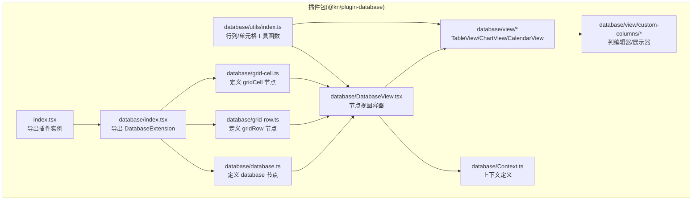
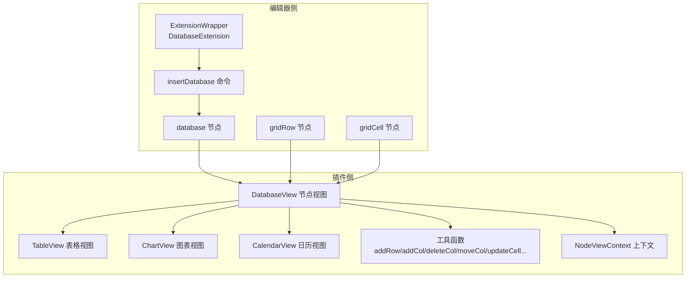
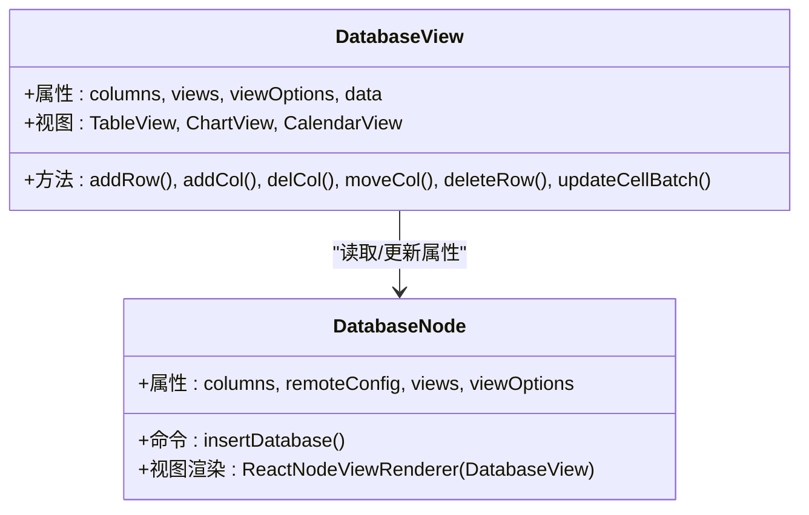
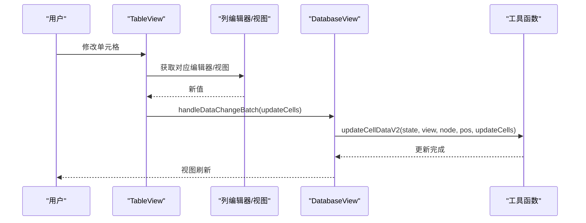
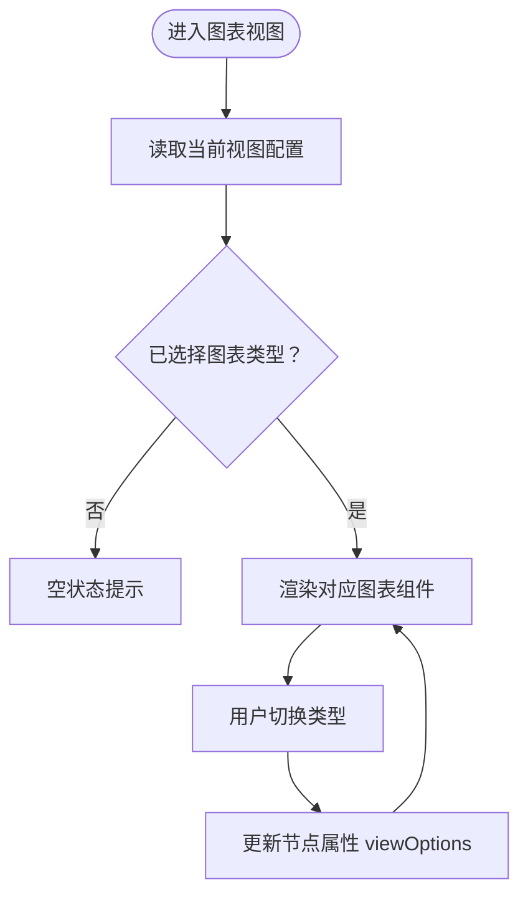
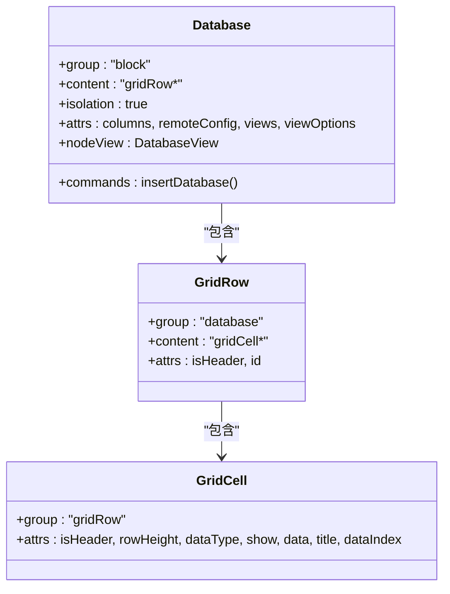
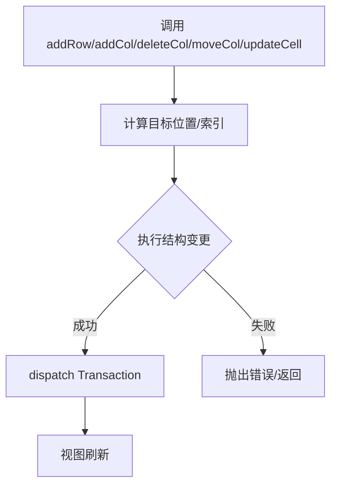
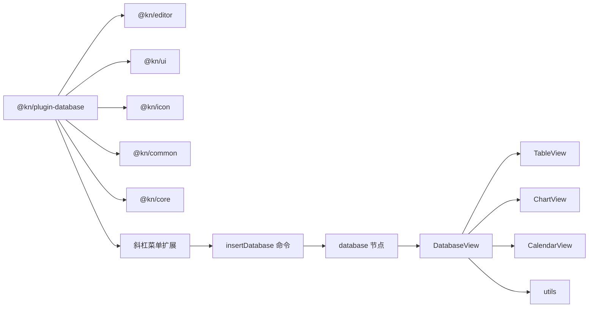

# 数据库功能概览

<cite>
**本文引用的文件**
- [packages/plugin-database/src/index.tsx](file://packages/plugin-database/src/index.tsx)
- [packages/plugin-database/src/database/index.tsx](file://packages/plugin-database/src/database/index.tsx)
- [packages/plugin-database/src/database/database.ts](file://packages/plugin-database/src/database/database.ts)
- [packages/plugin-database/src/database/DatabaseView.tsx](file://packages/plugin-database/src/database/DatabaseView.tsx)
- [packages/plugin-database/src/database/grid-row.ts](file://packages/plugin-database/src/database/grid-row.ts)
- [packages/plugin-database/src/database/grid-cell.ts](file://packages/plugin-database/src/database/grid-cell.ts)
- [packages/plugin-database/src/database/utils/index.ts](file://packages/plugin-database/src/database/utils/index.ts)
- [packages/plugin-database/src/database/view/TableView.tsx](file://packages/plugin-database/src/database/view/TableView.tsx)
- [packages/plugin-database/src/database/view/TableViewCfg.tsx](file://packages/plugin-database/src/database/view/TableViewCfg.tsx)
- [packages/plugin-database/src/database/view/ChartView.tsx](file://packages/plugin-database/src/database/view/ChartView.tsx)
- [packages/plugin-database/src/database/view/CalendarView.tsx](file://packages/plugin-database/src/database/view/CalendarView.tsx)
- [packages/plugin-database/src/database/view/custom-columns/DateColumns.tsx](file://packages/plugin-database/src/database/view/custom-columns/DateColumns.tsx)
- [packages/plugin-database/src/database/Context.ts](file://packages/plugin-database/src/database/Context.ts)
- [packages/plugin-database/package.json](file://packages/plugin-database/package.json)
- [packages/editor/src/extensions/database/index.tsx](file://packages/editor/src/extensions/database/index.tsx)
</cite>

## 目录
1. [简介](#简介)
2. [项目结构](#项目结构)
3. [核心组件](#核心组件)
4. [架构总览](#架构总览)
5. [详细组件分析](#详细组件分析)
6. [依赖关系分析](#依赖关系分析)
7. [性能考量](#性能考量)
8. [故障排查指南](#故障排查指南)
9. [结论](#结论)
10. [附录：使用示例与配置](#附录使用示例与配置)

## 简介
本文件面向希望在 Tiptap 编辑器中集成“数据库”能力的开发者，系统性介绍数据库插件的整体架构、核心功能与使用方式。内容涵盖插件初始化、编辑器扩展集成、节点模型（database/gridRow/gridCell）、视图层（表格、图表、日历）以及工具函数对单元格、行列操作的支持。同时给出插件注册机制、生命周期管理要点与与其他插件的交互关系，帮助开发者快速上手并扩展数据库功能。

## 项目结构
数据库插件位于独立包中，通过扩展 Tiptap 的 Node 扩展体系，向编辑器注入自定义节点与视图渲染器，并提供多种视图模式与列类型支持。

**图示来源**
- [packages/plugin-database/src/index.tsx](file://packages/plugin-database/src/index.tsx#L1-L17)
- [packages/plugin-database/src/database/index.tsx](file://packages/plugin-database/src/database/index.tsx#L1-L21)
- [packages/plugin-database/src/database/database.ts](file://packages/plugin-database/src/database/database.ts#L1-L120)
- [packages/plugin-database/src/database/grid-row.ts](file://packages/plugin-database/src/database/grid-row.ts#L1-L34)
- [packages/plugin-database/src/database/grid-cell.ts](file://packages/plugin-database/src/database/grid-cell.ts#L1-L55)
- [packages/plugin-database/src/database/DatabaseView.tsx](file://packages/plugin-database/src/database/DatabaseView.tsx#L1-L292)
- [packages/plugin-database/src/database/utils/index.ts](file://packages/plugin-database/src/database/utils/index.ts#L1-L295)
- [packages/plugin-database/src/database/view/TableView.tsx](file://packages/plugin-database/src/database/view/TableView.tsx#L1-L143)
- [packages/plugin-database/src/database/view/ChartView.tsx](file://packages/plugin-database/src/database/view/ChartView.tsx#L1-L103)
- [packages/plugin-database/src/database/view/CalendarView.tsx](file://packages/plugin-database/src/database/view/CalendarView.tsx#L1-L181)
- [packages/plugin-database/src/database/view/custom-columns/DateColumns.tsx](file://packages/plugin-database/src/database/view/custom-columns/DateColumns.tsx#L1-L347)
- [packages/plugin-database/src/database/Context.ts](file://packages/plugin-database/src/database/Context.ts#L1-L18)

**章节来源**
- [packages/plugin-database/src/index.tsx](file://packages/plugin-database/src/index.tsx#L1-L17)
- [packages/plugin-database/src/database/index.tsx](file://packages/plugin-database/src/database/index.tsx#L1-L21)
- [packages/plugin-database/package.json](file://packages/plugin-database/package.json#L1-L35)

## 核心组件
- 插件入口与注册
  - 插件实例导出，声明编辑器扩展列表，供上层应用加载。
  - 参考路径：[packages/plugin-database/src/index.tsx](file://packages/plugin-database/src/index.tsx#L1-L17)
- 数据库扩展（ExtensionWrapper）
  - 暴露 Database、GridRow、GridCell 三个节点扩展，并提供斜杠菜单触发插入命令。
  - 参考路径：[packages/plugin-database/src/database/index.tsx](file://packages/plugin-database/src/database/index.tsx#L1-L21)
  - 对应编辑器侧扩展位置：[packages/editor/src/extensions/database/index.tsx](file://packages/editor/src/extensions/database/index.tsx#L1-L22)
- 节点定义
  - database：块级节点，包含 gridRow 子节点；提供默认视图配置、属性与 NodeView 渲染。
  - gridRow：行节点，可选、可拖拽。
  - gridCell：单元格节点，含数据类型、显示状态、数据值等属性。
  - 参考路径：
    - [packages/plugin-database/src/database/database.ts](file://packages/plugin-database/src/database/database.ts#L1-L120)
    - [packages/plugin-database/src/database/grid-row.ts](file://packages/plugin-database/src/database/grid-row.ts#L1-L34)
    - [packages/plugin-database/src/database/grid-cell.ts](file://packages/plugin-database/src/database/grid-cell.ts#L1-L55)
- 视图层
  - DatabaseView：聚合多视图（表格/图表/日历），负责列类型、视图切换、增删改查等交互。
  - TableView：基于 react-data-grid 的表格视图，支持批量更新、列宽调整、列重排、选择删除等。
  - ChartView：基于下拉选择的图表视图，支持配置图表类型。
  - CalendarView：基于 react-big-calendar 的日历视图，支持事件映射与配置。
  - 参考路径：
    - [packages/plugin-database/src/database/DatabaseView.tsx](file://packages/plugin-database/src/database/DatabaseView.tsx#L1-L292)
    - [packages/plugin-database/src/database/view/TableView.tsx](file://packages/plugin-database/src/database/view/TableView.tsx#L1-L143)
    - [packages/plugin-database/src/database/view/ChartView.tsx](file://packages/plugin-database/src/database/view/ChartView.tsx#L1-L103)
    - [packages/plugin-database/src/database/view/CalendarView.tsx](file://packages/plugin-database/src/database/view/CalendarView.tsx#L1-L181)
- 列类型与编辑器
  - 支持文本、日期、评分、图片、Markdown、Slider、Checkbox、Rate、Select、PageLink 等列类型。
  - 提供统一的编辑器/展示器映射与图标。
  - 参考路径：[packages/plugin-database/src/database/view/custom-columns/DateColumns.tsx](file://packages/plugin-database/src/database/view/custom-columns/DateColumns.tsx#L1-L347)
- 工具函数
  - 行/列/单元格操作：新增行、新增列、删除列、移动列、删除行、批量更新单元格、定位单元格位置等。
  - 参考路径：[packages/plugin-database/src/database/utils/index.ts](file://packages/plugin-database/src/database/utils/index.ts#L1-L295)

**章节来源**
- [packages/plugin-database/src/index.tsx](file://packages/plugin-database/src/index.tsx#L1-L17)
- [packages/plugin-database/src/database/index.tsx](file://packages/plugin-database/src/database/index.tsx#L1-L21)
- [packages/plugin-database/src/database/database.ts](file://packages/plugin-database/src/database/database.ts#L1-L120)
- [packages/plugin-database/src/database/grid-row.ts](file://packages/plugin-database/src/database/grid-row.ts#L1-L34)
- [packages/plugin-database/src/database/grid-cell.ts](file://packages/plugin-database/src/database/grid-cell.ts#L1-L55)
- [packages/plugin-database/src/database/DatabaseView.tsx](file://packages/plugin-database/src/database/DatabaseView.tsx#L1-L292)
- [packages/plugin-database/src/database/view/TableView.tsx](file://packages/plugin-database/src/database/view/TableView.tsx#L1-L143)
- [packages/plugin-database/src/database/view/ChartView.tsx](file://packages/plugin-database/src/database/view/ChartView.tsx#L1-L103)
- [packages/plugin-database/src/database/view/CalendarView.tsx](file://packages/plugin-database/src/database/view/CalendarView.tsx#L1-L181)
- [packages/plugin-database/src/database/view/custom-columns/DateColumns.tsx](file://packages/plugin-database/src/database/view/custom-columns/DateColumns.tsx#L1-L347)
- [packages/plugin-database/src/database/utils/index.ts](file://packages/plugin-database/src/database/utils/index.ts#L1-L295)

## 架构总览
数据库插件通过“扩展 + 节点 + 视图 + 工具”的分层设计，将 Tiptap 的命令与节点模型扩展到“数据库网格”，并在节点视图层提供多样的可视化与交互能力。

**图示来源**
- [packages/plugin-database/src/database/index.tsx](file://packages/plugin-database/src/database/index.tsx#L1-L21)
- [packages/plugin-database/src/database/database.ts](file://packages/plugin-database/src/database/database.ts#L1-L120)
- [packages/plugin-database/src/database/DatabaseView.tsx](file://packages/plugin-database/src/database/DatabaseView.tsx#L1-L292)
- [packages/plugin-database/src/database/utils/index.ts](file://packages/plugin-database/src/database/utils/index.ts#L1-L295)
- [packages/plugin-database/src/database/view/TableView.tsx](file://packages/plugin-database/src/database/view/TableView.tsx#L1-L143)
- [packages/plugin-database/src/database/view/ChartView.tsx](file://packages/plugin-database/src/database/view/ChartView.tsx#L1-L103)
- [packages/plugin-database/src/database/view/CalendarView.tsx](file://packages/plugin-database/src/database/view/CalendarView.tsx#L1-L181)
- [packages/plugin-database/src/database/Context.ts](file://packages/plugin-database/src/database/Context.ts#L1-L18)

## 详细组件分析

### 组件A：数据库节点与视图（DatabaseView）
- 职责
  - 作为 database 节点的 React 视图容器，承载多视图切换与交互。
  - 维护列类型、视图集合、数据读取与更新、行/列操作。
- 关键行为
  - 初始化时从节点属性读取 columns/views/viewOptions 并渲染。
  - 通过上下文暴露增删改查与批量更新接口给子视图。
  - 支持动态添加/删除视图、重命名/移除视图、列宽调整、列移动等。
- 代码片段路径
  - [packages/plugin-database/src/database/DatabaseView.tsx](file://packages/plugin-database/src/database/DatabaseView.tsx#L1-L292)
  - [packages/plugin-database/src/database/database.ts](file://packages/plugin-database/src/database/database.ts#L1-L120)

**图示来源**
- [packages/plugin-database/src/database/DatabaseView.tsx](file://packages/plugin-database/src/database/DatabaseView.tsx#L1-L292)
- [packages/plugin-database/src/database/database.ts](file://packages/plugin-database/src/database/database.ts#L1-L120)

**章节来源**
- [packages/plugin-database/src/database/DatabaseView.tsx](file://packages/plugin-database/src/database/DatabaseView.tsx#L1-L292)
- [packages/plugin-database/src/database/database.ts](file://packages/plugin-database/src/database/database.ts#L1-L120)

### 组件B：表格视图（TableView）
- 职责
  - 基于 react-data-grid 展示数据库数据，支持列编辑器、单元格视图、列宽调整、列重排、行选择与批量删除。
- 关键行为
  - 将列类型映射为编辑器/视图组件，按需启用可编辑与拖拽。
  - 监听行变更回调，转换为批量更新请求。
- 代码片段路径
  - [packages/plugin-database/src/database/view/TableView.tsx](file://packages/plugin-database/src/database/view/TableView.tsx#L1-L143)
  - [packages/plugin-database/src/database/view/custom-columns/DateColumns.tsx](file://packages/plugin-database/src/database/view/custom-columns/DateColumns.tsx#L1-L347)

**图示来源**
- [packages/plugin-database/src/database/view/TableView.tsx](file://packages/plugin-database/src/database/view/TableView.tsx#L1-L143)
- [packages/plugin-database/src/database/view/custom-columns/DateColumns.tsx](file://packages/plugin-database/src/database/view/custom-columns/DateColumns.tsx#L1-L347)
- [packages/plugin-database/src/database/utils/index.ts](file://packages/plugin-database/src/database/utils/index.ts#L241-L295)

**章节来源**
- [packages/plugin-database/src/database/view/TableView.tsx](file://packages/plugin-database/src/database/view/TableView.tsx#L1-L143)
- [packages/plugin-database/src/database/view/custom-columns/DateColumns.tsx](file://packages/plugin-database/src/database/view/custom-columns/DateColumns.tsx#L1-L347)
- [packages/plugin-database/src/database/utils/index.ts](file://packages/plugin-database/src/database/utils/index.ts#L241-L295)

### 组件C：图表视图（ChartView）
- 职责
  - 提供图表类型选择与配置，将数据映射到具体图表组件。
- 关键行为
  - 通过下拉框切换图表类型，更新节点属性中的 viewOptions。
- 代码片段路径
  - [packages/plugin-database/src/database/view/ChartView.tsx](file://packages/plugin-database/src/database/view/ChartView.tsx#L1-L103)

**图示来源**
- [packages/plugin-database/src/database/view/ChartView.tsx](file://packages/plugin-database/src/database/view/ChartView.tsx#L1-L103)

**章节来源**
- [packages/plugin-database/src/database/view/ChartView.tsx](file://packages/plugin-database/src/database/view/ChartView.tsx#L1-L103)

### 组件D：日历视图（CalendarView）
- 职责
  - 将数据库数据映射为日历事件，支持配置标题、描述、开始/结束时间字段。
- 关键行为
  - 从 columns 中选择映射字段，解析日期字符串为有效时间戳。
  - 提供事件添加回调，自动插入新行并填充字段。
- 代码片段路径
  - [packages/plugin-database/src/database/view/CalendarView.tsx](file://packages/plugin-database/src/database/view/CalendarView.tsx#L1-L181)

**章节来源**
- [packages/plugin-database/src/database/view/CalendarView.tsx](file://packages/plugin-database/src/database/view/CalendarView.tsx#L1-L181)

### 组件E：节点模型（database/gridRow/gridCell）
- 职责
  - 定义数据库网格的节点层次与属性，确保编辑器序列化/反序列化正确。
- 关键行为
  - database：块级节点，包含 gridRow*，提供默认列与视图配置。
  - gridRow：可选、可拖拽，记录行标识。
  - gridCell：记录数据类型、是否显示、数据值、标题、索引等。
- 代码片段路径
  - [packages/plugin-database/src/database/database.ts](file://packages/plugin-database/src/database/database.ts#L1-L120)
  - [packages/plugin-database/src/database/grid-row.ts](file://packages/plugin-database/src/database/grid-row.ts#L1-L34)
  - [packages/plugin-database/src/database/grid-cell.ts](file://packages/plugin-database/src/database/grid-cell.ts#L1-L55)

**图示来源**
- [packages/plugin-database/src/database/database.ts](file://packages/plugin-database/src/database/database.ts#L1-L120)
- [packages/plugin-database/src/database/grid-row.ts](file://packages/plugin-database/src/database/grid-row.ts#L1-L34)
- [packages/plugin-database/src/database/grid-cell.ts](file://packages/plugin-database/src/database/grid-cell.ts#L1-L55)

**章节来源**
- [packages/plugin-database/src/database/database.ts](file://packages/plugin-database/src/database/database.ts#L1-L120)
- [packages/plugin-database/src/database/grid-row.ts](file://packages/plugin-database/src/database/grid-row.ts#L1-L34)
- [packages/plugin-database/src/database/grid-cell.ts](file://packages/plugin-database/src/database/grid-cell.ts#L1-L55)

### 组件F：工具函数（行列/单元格操作）
- 职责
  - 提供插入行/列、删除列、移动列、删除行、批量更新单元格、定位单元格位置等底层操作。
- 关键行为
  - 通过 EditorState/EditorView/Transaction 进行文档结构修改，保证一致性。
- 代码片段路径
  - [packages/plugin-database/src/database/utils/index.ts](file://packages/plugin-database/src/database/utils/index.ts#L1-L295)

**图示来源**
- [packages/plugin-database/src/database/utils/index.ts](file://packages/plugin-database/src/database/utils/index.ts#L1-L295)

**章节来源**
- [packages/plugin-database/src/database/utils/index.ts](file://packages/plugin-database/src/database/utils/index.ts#L1-L295)

## 依赖关系分析
- 包依赖
  - 依赖 @kn/editor 提供 Node、ReactNodeViewRenderer、命令扩展等能力。
  - 依赖 @kn/ui、@kn/icon、@kn/common、@kn/core 提供 UI 组件、图标、通用工具与上传能力。
  - 外部库：react-data-grid、react-big-calendar、date-fns、react-dnd 等。
- 代码依赖
  - 插件入口依赖 DatabaseExtension；DatabaseExtension 依赖 database/gridRow/gridCell 节点定义。
  - DatabaseView 依赖各视图组件与工具函数；TableView 依赖列编辑器/视图映射。
- 交互关系
  - 斜杠菜单触发 insertDatabase 命令，生成初始数据库节点与默认列。
  - 各视图通过 NodeViewContext 共享状态与操作函数，实现解耦。

**图示来源**
- [packages/plugin-database/package.json](file://packages/plugin-database/package.json#L1-L35)
- [packages/plugin-database/src/database/index.tsx](file://packages/plugin-database/src/database/index.tsx#L1-L21)
- [packages/editor/src/extensions/database/index.tsx](file://packages/editor/src/extensions/database/index.tsx#L1-L22)

**章节来源**
- [packages/plugin-database/package.json](file://packages/plugin-database/package.json#L1-L35)
- [packages/plugin-database/src/database/index.tsx](file://packages/plugin-database/src/database/index.tsx#L1-L21)
- [packages/editor/src/extensions/database/index.tsx](file://packages/editor/src/extensions/database/index.tsx#L1-L22)

## 性能考量
- 大表格渲染
  - 使用虚拟滚动与按需渲染（react-data-grid 默认具备一定优化），避免一次性渲染过多行/列。
  - 合理设置列宽与固定列数，减少 DOM 节点数量。
- 批量更新
  - 优先使用批量更新接口，减少多次 Transaction 分发带来的重绘成本。
- 视图切换
  - 避免频繁切换视图导致重复挂载/卸载，可在应用层缓存视图状态。
- 图片/富文本
  - 图片上传与 Markdown 渲染可能带来额外开销，建议懒加载与节流处理。

[本节为通用指导，无需列出具体文件来源]

## 故障排查指南
- 插件未生效
  - 确认插件实例已导出并被应用加载。
  - 确认编辑器扩展列表包含 DatabaseExtension。
  - 参考路径：
    - [packages/plugin-database/src/index.tsx](file://packages/plugin-database/src/index.tsx#L1-L17)
    - [packages/plugin-database/src/database/index.tsx](file://packages/plugin-database/src/database/index.tsx#L1-L21)
- 斜杠菜单无响应
  - 检查斜杠菜单扩展是否正确注册，命令是否指向 insertDatabase。
  - 参考路径：
    - [packages/editor/src/extensions/database/index.tsx](file://packages/editor/src/extensions/database/index.tsx#L1-L22)
- 表格无法编辑或列不显示
  - 检查 columns 的 isShow 字段与列类型映射是否正确。
  - 参考路径：
    - [packages/plugin-database/src/database/DatabaseView.tsx](file://packages/plugin-database/src/database/DatabaseView.tsx#L1-L292)
    - [packages/plugin-database/src/database/view/custom-columns/DateColumns.tsx](file://packages/plugin-database/src/database/view/custom-columns/DateColumns.tsx#L1-L347)
- 单元格更新无效
  - 确认使用了批量更新接口或单个 updateCellData，并传入正确的行列索引。
  - 参考路径：
    - [packages/plugin-database/src/database/utils/index.ts](file://packages/plugin-database/src/database/utils/index.ts#L241-L295)
- 日历事件为空
  - 检查 viewOptions 中的字段映射是否正确，日期字段是否为合法时间戳。
  - 参考路径：
    - [packages/plugin-database/src/database/view/CalendarView.tsx](file://packages/plugin-database/src/database/view/CalendarView.tsx#L1-L181)

**章节来源**
- [packages/plugin-database/src/index.tsx](file://packages/plugin-database/src/index.tsx#L1-L17)
- [packages/plugin-database/src/database/index.tsx](file://packages/plugin-database/src/database/index.tsx#L1-L21)
- [packages/editor/src/extensions/database/index.tsx](file://packages/editor/src/extensions/database/index.tsx#L1-L22)
- [packages/plugin-database/src/database/DatabaseView.tsx](file://packages/plugin-database/src/database/DatabaseView.tsx#L1-L292)
- [packages/plugin-database/src/database/view/custom-columns/DateColumns.tsx](file://packages/plugin-database/src/database/view/custom-columns/DateColumns.tsx#L1-L347)
- [packages/plugin-database/src/database/utils/index.ts](file://packages/plugin-database/src/database/utils/index.ts#L241-L295)
- [packages/plugin-database/src/database/view/CalendarView.tsx](file://packages/plugin-database/src/database/view/CalendarView.tsx#L1-L181)

## 结论
数据库插件以清晰的分层设计实现了“节点 + 视图 + 工具”的完整闭环：通过扩展 Tiptap 的节点模型与命令，结合丰富的视图与列类型，为用户提供表格、图表与日历三种数据呈现方式；借助工具函数保障数据一致性与性能。开发者可在此基础上进一步扩展列类型、视图与交互能力，满足复杂业务场景。

[本节为总结性内容，无需列出具体文件来源]

## 附录：使用示例与配置
- 插件初始化与注册
  - 在应用侧引入插件实例并加入编辑器扩展列表。
  - 参考路径：
    - [packages/plugin-database/src/index.tsx](file://packages/plugin-database/src/index.tsx#L1-L17)
    - [packages/plugin-database/src/database/index.tsx](file://packages/plugin-database/src/database/index.tsx#L1-L21)
- 插入数据库节点
  - 通过斜杠菜单输入 “/database” 或直接调用命令 insertDatabase。
  - 参考路径：
    - [packages/editor/src/extensions/database/index.tsx](file://packages/editor/src/extensions/database/index.tsx#L1-L22)
    - [packages/plugin-database/src/database/database.ts](file://packages/plugin-database/src/database/database.ts#L105-L119)
- 基本配置项
  - columns：列定义数组，包含标题、ID、数据类型、宽度、是否显示等。
  - views：视图集合，默认包含 table、chart、calendar。
  - viewOptions：各视图的配置对象，如图表类型、日历字段映射等。
  - remoteConfig：远程数据源配置（URL/Headers）。
  - 参考路径：
    - [packages/plugin-database/src/database/database.ts](file://packages/plugin-database/src/database/database.ts#L66-L87)
- 常用操作
  - 新增行：TableView 提供按钮或汇总行入口。
  - 新增列：通过表格设置弹窗选择列类型并填写字段名。
  - 删除列/行：在表格设置或行选择后执行删除。
  - 批量更新：通过 onRowsChange 回调收集变更并调用批量更新。
  - 参考路径：
    - [packages/plugin-database/src/database/view/TableView.tsx](file://packages/plugin-database/src/database/view/TableView.tsx#L1-L143)
    - [packages/plugin-database/src/database/view/TableViewCfg.tsx](file://packages/plugin-database/src/database/view/TableViewCfg.tsx#L1-L114)
    - [packages/plugin-database/src/database/utils/index.ts](file://packages/plugin-database/src/database/utils/index.ts#L1-L295)

**章节来源**
- [packages/plugin-database/src/index.tsx](file://packages/plugin-database/src/index.tsx#L1-L17)
- [packages/plugin-database/src/database/index.tsx](file://packages/plugin-database/src/database/index.tsx#L1-L21)
- [packages/editor/src/extensions/database/index.tsx](file://packages/editor/src/extensions/database/index.tsx#L1-L22)
- [packages/plugin-database/src/database/database.ts](file://packages/plugin-database/src/database/database.ts#L66-L119)
- [packages/plugin-database/src/database/view/TableView.tsx](file://packages/plugin-database/src/database/view/TableView.tsx#L1-L143)
- [packages/plugin-database/src/database/view/TableViewCfg.tsx](file://packages/plugin-database/src/database/view/TableViewCfg.tsx#L1-L114)
- [packages/plugin-database/src/database/utils/index.ts](file://packages/plugin-database/src/database/utils/index.ts#L1-L295)