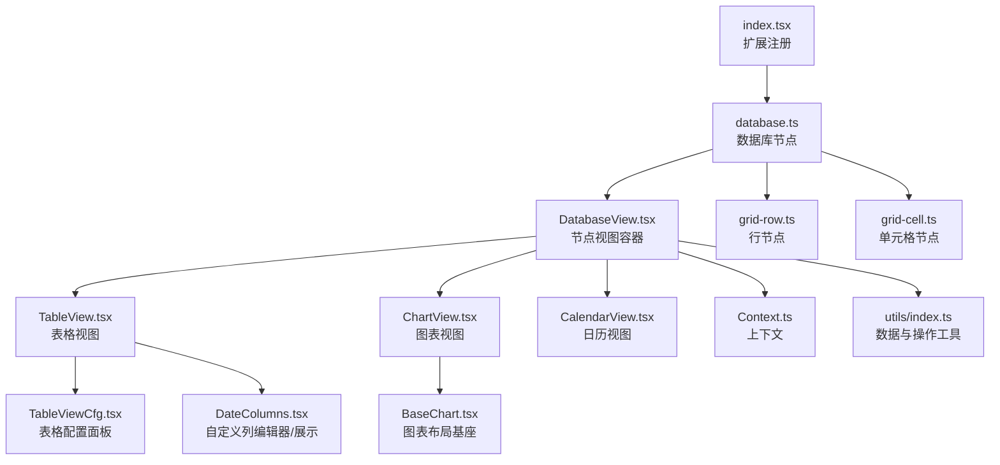
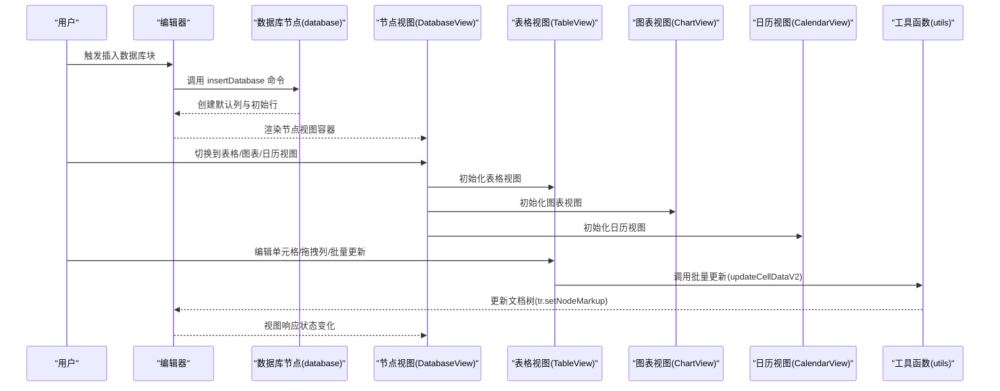
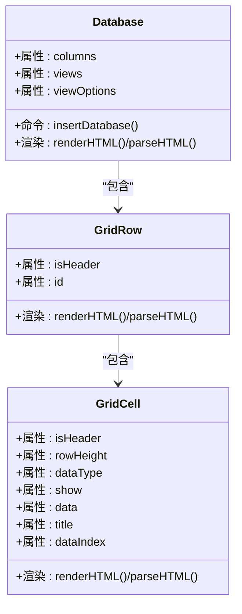
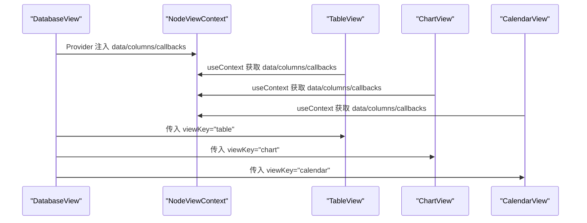
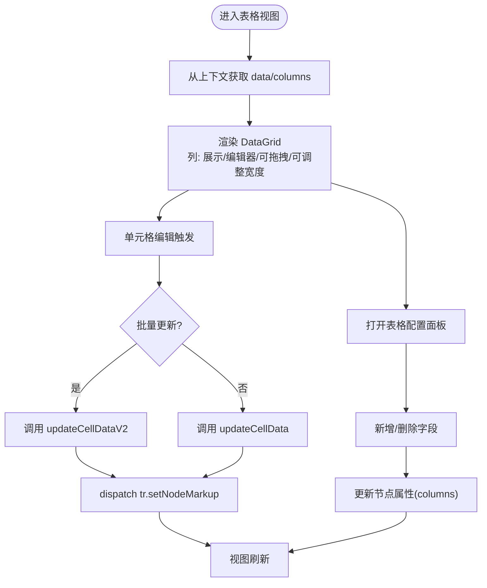
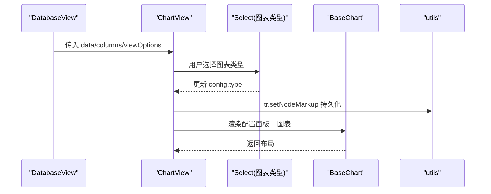
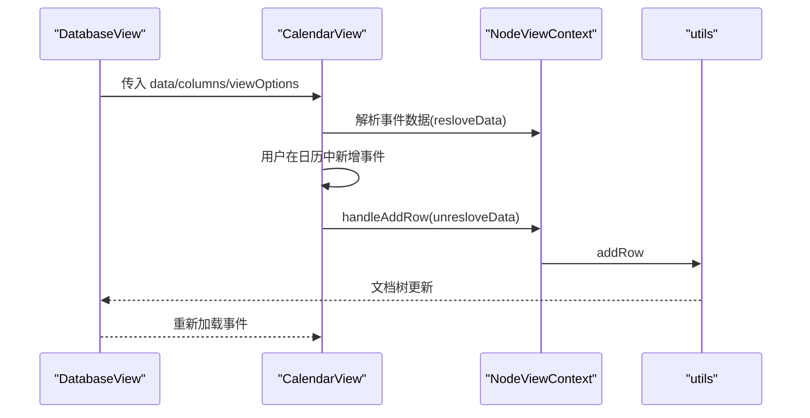
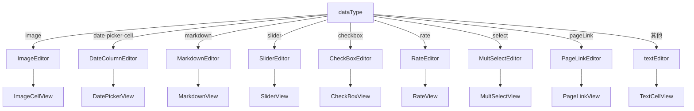
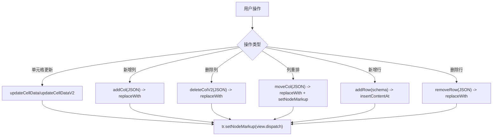
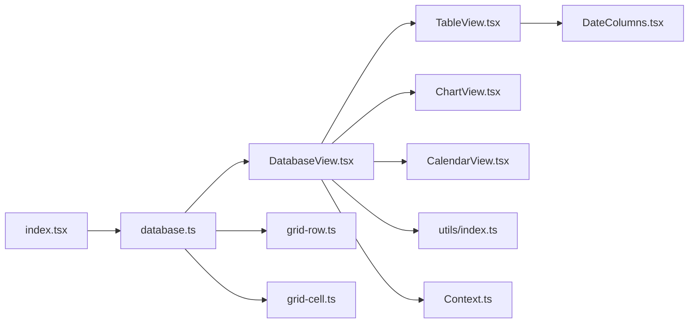

# 数据库插件

<cite>
**本文引用的文件**
- [packages/plugin-database/src/database/index.tsx](file://packages/plugin-database/src/database/index.tsx)
- [packages/plugin-database/src/database/database.ts](file://packages/plugin-database/src/database/database.ts)
- [packages/plugin-database/src/database/DatabaseView.tsx](file://packages/plugin-database/src/database/DatabaseView.tsx)
- [packages/plugin-database/src/database/grid-row.ts](file://packages/plugin-database/src/database/grid-row.ts)
- [packages/plugin-database/src/database/grid-cell.ts](file://packages/plugin-database/src/database/grid-cell.ts)
- [packages/plugin-database/src/database/Context.ts](file://packages/plugin-database/src/database/Context.ts)
- [packages/plugin-database/src/database/utils/index.ts](file://packages/plugin-database/src/database/utils/index.ts)
- [packages/plugin-database/src/database/view/TableView.tsx](file://packages/plugin-database/src/database/view/TableView.tsx)
- [packages/plugin-database/src/database/view/TableViewCfg.tsx](file://packages/plugin-database/src/database/view/TableViewCfg.tsx)
- [packages/plugin-database/src/database/view/ChartView.tsx](file://packages/plugin-database/src/database/view/ChartView.tsx)
- [packages/plugin-database/src/database/view/CalendarView.tsx](file://packages/plugin-database/src/database/view/CalendarView.tsx)
- [packages/plugin-database/src/database/view/custom-columns/DateColumns.tsx](file://packages/plugin-database/src/database/view/custom-columns/DateColumns.tsx)
- [packages/plugin-database/src/database/view/charts/BaseChart.tsx](file://packages/plugin-database/src/database/view/charts/BaseChart.tsx)
</cite>

## 目录
1. [简介](#简介)
2. [项目结构](#项目结构)
3. [核心组件](#核心组件)
4. [架构总览](#架构总览)
5. [详细组件分析](#详细组件分析)
6. [依赖关系分析](#依赖关系分析)
7. [性能考虑](#性能考虑)
8. [故障排查指南](#故障排查指南)
9. [结论](#结论)
10. [附录：使用示例与最佳实践](#附录使用示例与最佳实践)

## 简介
本文件面向数据库插件的使用者与维护者，系统性阐述数据库功能的实现与使用方法，覆盖表格视图、日历视图、图表视图与自定义列能力；详解数据网格组件、行操作与单元格编辑流程；解释数据模型设计、视图切换机制与数据同步策略；并提供导入导出、权限控制与性能优化的最佳实践建议。

## 项目结构
数据库插件位于 packages/plugin-database，采用“扩展节点 + 视图渲染 + 工具函数”的分层组织方式：
- 扩展注册与入口：在 index.tsx 中注册扩展名、扩展节点集合与斜杠菜单入口。
- 节点定义：database.ts 定义数据库节点、默认属性、命令与渲染；grid-row.ts、grid-cell.ts 定义表格行与单元格节点。
- 视图容器：DatabaseView.tsx 作为节点视图容器，负责多视图切换、上下文传递与基础操作。
- 视图实现：TableView.tsx（表格）、ChartView.tsx（图表）、CalendarView.tsx（日历）。
- 自定义列与编辑器：custom-columns/DateColumns.tsx 提供多种列类型编辑器与展示组件。
- 工具函数：utils/index.ts 提供数据读取、行列增删改、列移动、位置计算等核心逻辑。
- 上下文：Context.ts 定义 NodeViewContext，统一向子视图传递数据与回调。

**图表来源**
- [packages/plugin-database/src/database/index.tsx](file://packages/plugin-database/src/database/index.tsx#L1-L21)
- [packages/plugin-database/src/database/database.ts](file://packages/plugin-database/src/database/database.ts#L1-L120)
- [packages/plugin-database/src/database/DatabaseView.tsx](file://packages/plugin-database/src/database/DatabaseView.tsx#L1-L292)
- [packages/plugin-database/src/database/view/TableView.tsx](file://packages/plugin-database/src/database/view/TableView.tsx#L1-L143)
- [packages/plugin-database/src/database/view/TableViewCfg.tsx](file://packages/plugin-database/src/database/view/TableViewCfg.tsx#L1-L114)
- [packages/plugin-database/src/database/view/ChartView.tsx](file://packages/plugin-database/src/database/view/ChartView.tsx#L1-L103)
- [packages/plugin-database/src/database/view/CalendarView.tsx](file://packages/plugin-database/src/database/view/CalendarView.tsx#L1-L181)
- [packages/plugin-database/src/database/view/custom-columns/DateColumns.tsx](file://packages/plugin-database/src/database/view/custom-columns/DateColumns.tsx#L1-L347)
- [packages/plugin-database/src/database/view/charts/BaseChart.tsx](file://packages/plugin-database/src/database/view/charts/BaseChart.tsx#L1-L37)
- [packages/plugin-database/src/database/grid-row.ts](file://packages/plugin-database/src/database/grid-row.ts#L1-L34)
- [packages/plugin-database/src/database/grid-cell.ts](file://packages/plugin-database/src/database/grid-cell.ts#L1-L55)
- [packages/plugin-database/src/database/Context.ts](file://packages/plugin-database/src/database/Context.ts#L1-L18)
- [packages/plugin-database/src/database/utils/index.ts](file://packages/plugin-database/src/database/utils/index.ts#L1-L295)

**章节来源**
- [packages/plugin-database/src/database/index.tsx](file://packages/plugin-database/src/database/index.tsx#L1-L21)
- [packages/plugin-database/src/database/database.ts](file://packages/plugin-database/src/database/database.ts#L1-L120)

## 核心组件
- 数据库节点（database）：定义数据库块的属性（列定义、视图列表、视图配置）、默认视图配置、插入命令与渲染行为。
- 行节点（gridRow）：承载单元格集合，支持选择与拖拽。
- 单元格节点（gridCell）：承载具体数据，支持多种数据类型与可编辑属性。
- 节点视图容器（DatabaseView）：聚合多视图（表格/图表/日历），提供列操作、行操作、批量更新与视图切换。
- 视图组件：
  - 表格视图（TableView）：基于 react-data-grid 的数据网格，支持列拖拽、批量编辑、筛选/排序占位、远程数据占位。
  - 图表视图（ChartView）：根据配置渲染不同图表类型，支持配置面板与空态提示。
  - 日历视图（CalendarView）：基于 react-big-calendar 的日历组件，支持事件解析、配置映射与新增行联动。
- 自定义列（DateColumns）：按列类型提供编辑器与展示组件，覆盖文本、日期、评分、图片、Markdown、Slider、Checkbox、Rate、Select、PageLink 等。
- 工具函数（utils）：提供数据读取、行列增删改、列重排、位置计算、装饰绘制等。
- 上下文（Context）：统一注入数据、回调与节点信息，供各视图消费。

**章节来源**
- [packages/plugin-database/src/database/database.ts](file://packages/plugin-database/src/database/database.ts#L1-L120)
- [packages/plugin-database/src/database/grid-row.ts](file://packages/plugin-database/src/database/grid-row.ts#L1-L34)
- [packages/plugin-database/src/database/grid-cell.ts](file://packages/plugin-database/src/database/grid-cell.ts#L1-L55)
- [packages/plugin-database/src/database/DatabaseView.tsx](file://packages/plugin-database/src/database/DatabaseView.tsx#L1-L292)
- [packages/plugin-database/src/database/view/TableView.tsx](file://packages/plugin-database/src/database/view/TableView.tsx#L1-L143)
- [packages/plugin-database/src/database/view/ChartView.tsx](file://packages/plugin-database/src/database/view/ChartView.tsx#L1-L103)
- [packages/plugin-database/src/database/view/CalendarView.tsx](file://packages/plugin-database/src/database/view/CalendarView.tsx#L1-L181)
- [packages/plugin-database/src/database/view/custom-columns/DateColumns.tsx](file://packages/plugin-database/src/database/view/custom-columns/DateColumns.tsx#L1-L347)
- [packages/plugin-database/src/database/utils/index.ts](file://packages/plugin-database/src/database/utils/index.ts#L1-L295)
- [packages/plugin-database/src/database/Context.ts](file://packages/plugin-database/src/database/Context.ts#L1-L18)

## 架构总览
数据库插件以 ProseMirror 节点为核心，通过 React 节点视图渲染器挂载 UI 组件。DatabaseView 作为容器协调多视图，各视图通过 NodeViewContext 获取数据与操作回调，工具函数负责底层状态变更与同步。

**图表来源**
- [packages/plugin-database/src/database/database.ts](file://packages/plugin-database/src/database/database.ts#L105-L120)
- [packages/plugin-database/src/database/DatabaseView.tsx](file://packages/plugin-database/src/database/DatabaseView.tsx#L1-L292)
- [packages/plugin-database/src/database/view/TableView.tsx](file://packages/plugin-database/src/database/view/TableView.tsx#L1-L143)
- [packages/plugin-database/src/database/view/ChartView.tsx](file://packages/plugin-database/src/database/view/ChartView.tsx#L1-L103)
- [packages/plugin-database/src/database/view/CalendarView.tsx](file://packages/plugin-database/src/database/view/CalendarView.tsx#L1-L181)
- [packages/plugin-database/src/database/utils/index.ts](file://packages/plugin-database/src/database/utils/index.ts#L241-L283)

## 详细组件分析

### 数据模型与节点关系
数据库块由三层节点构成：database（根）、gridRow（行）、gridCell（单元格）。database 持有列定义、视图列表与视图配置；gridRow 持有行标识与是否为标题行；gridCell 持有数据类型、显示开关、实际数据与索引等。

**图表来源**
- [packages/plugin-database/src/database/database.ts](file://packages/plugin-database/src/database/database.ts#L66-L104)
- [packages/plugin-database/src/database/grid-row.ts](file://packages/plugin-database/src/database/grid-row.ts#L1-L34)
- [packages/plugin-database/src/database/grid-cell.ts](file://packages/plugin-database/src/database/grid-cell.ts#L1-L55)

**章节来源**
- [packages/plugin-database/src/database/database.ts](file://packages/plugin-database/src/database/database.ts#L66-L104)
- [packages/plugin-database/src/database/grid-row.ts](file://packages/plugin-database/src/database/grid-row.ts#L1-L34)
- [packages/plugin-database/src/database/grid-cell.ts](file://packages/plugin-database/src/database/grid-cell.ts#L1-L55)

### 节点视图容器与上下文
DatabaseView 负责：
- 从节点中提取列定义与行数据，提供给各视图。
- 统一暴露列操作（新增/删除/移动）、行操作（新增/删除）、单元格更新（单个/批量）。
- 多标签页切换视图，并提供视图配置入口。
- 通过 NodeViewContext 将数据与回调注入子视图。

**图表来源**
- [packages/plugin-database/src/database/DatabaseView.tsx](file://packages/plugin-database/src/database/DatabaseView.tsx#L1-L292)
- [packages/plugin-database/src/database/Context.ts](file://packages/plugin-database/src/database/Context.ts#L1-L18)

**章节来源**
- [packages/plugin-database/src/database/DatabaseView.tsx](file://packages/plugin-database/src/database/DatabaseView.tsx#L1-L292)
- [packages/plugin-database/src/database/Context.ts](file://packages/plugin-database/src/database/Context.ts#L1-L18)

### 表格视图（TableView）
特性：
- 使用 react-data-grid 渲染，支持列拖拽、列宽调整、行选择、底部汇总行。
- 通过自定义列编辑器与展示组件支持多种数据类型。
- 支持批量更新（onRowsChange -> updateCellDataV2）。
- 配置面板（TableViewCfg）支持字段管理、过滤/排序占位、远程数据占位、锁定与移除。

**图表来源**
- [packages/plugin-database/src/database/view/TableView.tsx](file://packages/plugin-database/src/database/view/TableView.tsx#L1-L143)
- [packages/plugin-database/src/database/view/TableViewCfg.tsx](file://packages/plugin-database/src/database/view/TableViewCfg.tsx#L1-L114)
- [packages/plugin-database/src/database/utils/index.ts](file://packages/plugin-database/src/database/utils/index.ts#L241-L283)

**章节来源**
- [packages/plugin-database/src/database/view/TableView.tsx](file://packages/plugin-database/src/database/view/TableView.tsx#L1-L143)
- [packages/plugin-database/src/database/view/TableViewCfg.tsx](file://packages/plugin-database/src/database/view/TableViewCfg.tsx#L1-L114)
- [packages/plugin-database/src/database/utils/index.ts](file://packages/plugin-database/src/database/utils/index.ts#L241-L283)

### 图表视图（ChartView）
特性：
- 支持多种图表类型（柱状、面积、饼、雷达等），通过配置面板切换。
- 读取节点的 viewOptions 并在编辑器中持久化修改。
- 空态时提供选择图表类型的引导。

**图表来源**
- [packages/plugin-database/src/database/view/ChartView.tsx](file://packages/plugin-database/src/database/view/ChartView.tsx#L1-L103)
- [packages/plugin-database/src/database/view/charts/BaseChart.tsx](file://packages/plugin-database/src/database/view/charts/BaseChart.tsx#L1-L37)

**章节来源**
- [packages/plugin-database/src/database/view/ChartView.tsx](file://packages/plugin-database/src/database/view/ChartView.tsx#L1-L103)
- [packages/plugin-database/src/database/view/charts/BaseChart.tsx](file://packages/plugin-database/src/database/view/charts/BaseChart.tsx#L1-L37)

### 日历视图（CalendarView）
特性：
- 基于 react-big-calendar，将数据库数据映射为事件。
- 通过配置面板将标题、描述、开始/结束时间映射到对应列。
- 新增事件时自动新增一行并回填对应列值。

**图表来源**
- [packages/plugin-database/src/database/view/CalendarView.tsx](file://packages/plugin-database/src/database/view/CalendarView.tsx#L1-L181)
- [packages/plugin-database/src/database/utils/index.ts](file://packages/plugin-database/src/database/utils/index.ts#L86-L107)

**章节来源**
- [packages/plugin-database/src/database/view/CalendarView.tsx](file://packages/plugin-database/src/database/view/CalendarView.tsx#L1-L181)
- [packages/plugin-database/src/database/utils/index.ts](file://packages/plugin-database/src/database/utils/index.ts#L86-L107)

### 自定义列与单元格编辑
自定义列模块提供丰富的编辑器与展示组件，覆盖常用数据类型：
- 文本、日期（DateTimePicker）、评分（Rate）、图片（上传/预览）、Markdown（内嵌编辑器）、Slider、Checkbox、Rate、Select（多选标签）、PageLink。
- 通过 getEditor/getCellView 根据 dataType 动态选择编辑器与展示组件。
- 通过 getCellIcon 为列头提供图标。

**图表来源**
- [packages/plugin-database/src/database/view/custom-columns/DateColumns.tsx](file://packages/plugin-database/src/database/view/custom-columns/DateColumns.tsx#L1-L347)

**章节来源**
- [packages/plugin-database/src/database/view/custom-columns/DateColumns.tsx](file://packages/plugin-database/src/database/view/custom-columns/DateColumns.tsx#L1-L347)

### 数据同步策略
- 单元格更新：单个更新通过 updateCellData 计算目标节点位置并 setNodeMarkup；批量更新通过 updateCellDataV2 在一次事务中完成多次 setNodeMarkup。
- 列操作：新增列通过 JSON 序列化后 replaceWith 替换节点；删除列通过过滤 JSON 内容与列定义后替换；列重排通过交换 JSON 中列顺序后替换。
- 行操作：新增行通过 schema 创建 gridCell 与 gridRow 后插入；删除行通过过滤首列值匹配的行后替换。
- 选择高亮：drawCellSelection 通过 DecorationSet 为当前选中的单元格添加边框装饰。

**图表来源**
- [packages/plugin-database/src/database/utils/index.ts](file://packages/plugin-database/src/database/utils/index.ts#L86-L215)
- [packages/plugin-database/src/database/utils/index.ts](file://packages/plugin-database/src/database/utils/index.ts#L218-L230)

**章节来源**
- [packages/plugin-database/src/database/utils/index.ts](file://packages/plugin-database/src/database/utils/index.ts#L86-L215)
- [packages/plugin-database/src/database/utils/index.ts](file://packages/plugin-database/src/database/utils/index.ts#L218-L230)

## 依赖关系分析
- 扩展注册：index.tsx 将 Database、GridRow、GridCell 注册为扩展，并提供斜杠菜单入口。
- 节点命令：database.ts 定义 insertDatabase 命令，使用 schema 创建默认列与初始行。
- 视图容器：DatabaseView 依赖 utils 读取数据与执行操作，依赖 UI 组件与图标资源。
- 视图实现：TableView 依赖 react-data-grid；ChartView 依赖图表集合；CalendarView 依赖 react-big-calendar 与本地化资源。
- 自定义列：DateColumns 依赖 UI 组件与上传能力，以及编辑器渲染。

**图表来源**
- [packages/plugin-database/src/database/index.tsx](file://packages/plugin-database/src/database/index.tsx#L1-L21)
- [packages/plugin-database/src/database/database.ts](file://packages/plugin-database/src/database/database.ts#L105-L120)
- [packages/plugin-database/src/database/DatabaseView.tsx](file://packages/plugin-database/src/database/DatabaseView.tsx#L1-L292)
- [packages/plugin-database/src/database/view/TableView.tsx](file://packages/plugin-database/src/database/view/TableView.tsx#L1-L143)
- [packages/plugin-database/src/database/view/ChartView.tsx](file://packages/plugin-database/src/database/view/ChartView.tsx#L1-L103)
- [packages/plugin-database/src/database/view/CalendarView.tsx](file://packages/plugin-database/src/database/view/CalendarView.tsx#L1-L181)
- [packages/plugin-database/src/database/view/custom-columns/DateColumns.tsx](file://packages/plugin-database/src/database/view/custom-columns/DateColumns.tsx#L1-L347)
- [packages/plugin-database/src/database/utils/index.ts](file://packages/plugin-database/src/database/utils/index.ts#L1-L295)
- [packages/plugin-database/src/database/Context.ts](file://packages/plugin-database/src/database/Context.ts#L1-L18)
- [packages/plugin-database/src/database/grid-row.ts](file://packages/plugin-database/src/database/grid-row.ts#L1-L34)
- [packages/plugin-database/src/database/grid-cell.ts](file://packages/plugin-database/src/database/grid-cell.ts#L1-L55)

**章节来源**
- [packages/plugin-database/src/database/index.tsx](file://packages/plugin-database/src/database/index.tsx#L1-L21)
- [packages/plugin-database/src/database/database.ts](file://packages/plugin-database/src/database/database.ts#L105-L120)

## 性能考虑
- 批量更新：优先使用 updateCellDataV2 进行批量写入，减少事务次数与重绘开销。
- 列操作：新增/删除列采用 JSON 序列化后一次性 replaceWith，避免逐单元格修改。
- 视图切换：仅在当前激活标签页渲染对应视图，减少不必要的 DOM 渲染。
- 表格尺寸：TableView 通过固定行高与分页参数控制高度，避免超大数据集导致的滚动卡顿。
- 装饰绘制：drawCellSelection 仅在需要时创建 DecorationSet，避免常驻装饰影响性能。

[本节为通用指导，不直接分析具体文件]

## 故障排查指南
- 插入数据库块无效：检查 insertDatabase 命令是否被正确注册，schema 是否包含 database/gridRow/gridCell。
- 表格无法编辑：确认 editor.isEditable 为真，且列的 dataType 不为 id（id 列不可编辑）。
- 列删除后数据未同步：确认使用 deleteColV2 或 moveCol 的 JSON 替换路径，确保 tr.dispatch 生效。
- 日历事件不显示：检查 viewOptions 中 titleAccessor/descAccessor/startAccessor/endAccessor 是否正确映射到列。
- 图表无内容：确认已选择图表类型，viewOptions 中的 type 已持久化到节点属性。

**章节来源**
- [packages/plugin-database/src/database/database.ts](file://packages/plugin-database/src/database/database.ts#L105-L120)
- [packages/plugin-database/src/database/view/TableView.tsx](file://packages/plugin-database/src/database/view/TableView.tsx#L1-L143)
- [packages/plugin-database/src/database/view/CalendarView.tsx](file://packages/plugin-database/src/database/view/CalendarView.tsx#L1-L181)
- [packages/plugin-database/src/database/utils/index.ts](file://packages/plugin-database/src/database/utils/index.ts#L137-L215)

## 结论
数据库插件通过清晰的节点模型与视图容器，提供了表格、图表、日历三种视图的统一体验；借助自定义列与批量更新机制，满足多样化的数据录入与可视化需求。配合完善的工具函数与上下文抽象，开发者可以快速扩展新的视图与列类型。

[本节为总结，不直接分析具体文件]

## 附录：使用示例与最佳实践

### 快速创建数据库视图
- 在编辑器中输入斜杠菜单，选择“database”即可插入默认数据库块。
- 默认包含若干列与初始行，可在表格视图中直接编辑或通过配置面板新增列。

**章节来源**
- [packages/plugin-database/src/database/index.tsx](file://packages/plugin-database/src/database/index.tsx#L1-L21)
- [packages/plugin-database/src/database/database.ts](file://packages/plugin-database/src/database/database.ts#L105-L120)

### 管理数据库视图
- 新建视图：点击“新建视图”，选择表格/时间线/图表/Kanban/日历。
- 删除视图：在视图标签右侧菜单中移除。
- 切换视图：使用顶部标签页进行切换。

**章节来源**
- [packages/plugin-database/src/database/DatabaseView.tsx](file://packages/plugin-database/src/database/DatabaseView.tsx#L1-L292)

### 表格视图操作
- 新增行：在表格设置中点击“Add Row”，或在汇总行处触发新增。
- 删除行：勾选行后点击“Delete”。
- 批量编辑：在表格中进行批量填充或拖拽复制。
- 列管理：通过表格配置面板新增/删除列，设置列名与类型。

**章节来源**
- [packages/plugin-database/src/database/view/TableView.tsx](file://packages/plugin-database/src/database/view/TableView.tsx#L1-L143)
- [packages/plugin-database/src/database/view/TableViewCfg.tsx](file://packages/plugin-database/src/database/view/TableViewCfg.tsx#L1-L114)

### 图表视图配置
- 选择图表类型：在图表头部选择 Bar/Area/Pie/Radar 等。
- 配置项：可在图表配置面板中设置标题、描述、页脚等（具体字段以图表组件为准）。

**章节来源**
- [packages/plugin-database/src/database/view/ChartView.tsx](file://packages/plugin-database/src/database/view/ChartView.tsx#L1-L103)
- [packages/plugin-database/src/database/view/charts/BaseChart.tsx](file://packages/plugin-database/src/database/view/charts/BaseChart.tsx#L1-L37)

### 日历视图映射
- 将标题、描述、开始/结束时间映射到对应列，事件将自动渲染。
- 新增事件会自动新增一行并回填对应列值。

**章节来源**
- [packages/plugin-database/src/database/view/CalendarView.tsx](file://packages/plugin-database/src/database/view/CalendarView.tsx#L1-L181)

### 数据导入导出
- 导入：通过“远程数据”占位入口接入外部数据源（需自行实现数据拉取与节点属性更新）。
- 导出：可将数据库块内容序列化为 JSON，再转换为目标格式（如 CSV/Excel）。

**章节来源**
- [packages/plugin-database/src/database/view/TableViewCfg.tsx](file://packages/plugin-database/src/database/view/TableViewCfg.tsx#L1-L114)

### 权限控制
- 可通过 editor.isEditable 控制视图的可编辑状态，从而限制编辑权限。
- 对特定列（如 id）设置不可编辑，防止误改主键。

**章节来源**
- [packages/plugin-database/src/database/view/TableView.tsx](file://packages/plugin-database/src/database/view/TableView.tsx#L1-L143)
- [packages/plugin-database/src/database/grid-cell.ts](file://packages/plugin-database/src/database/grid-cell.ts#L1-L55)

### 性能优化建议
- 大数据量场景：使用分页与固定高度，避免一次性渲染过多行。
- 频繁更新：合并多次编辑为批量更新，减少事务与重绘。
- 列操作：尽量使用 JSON 替换而非逐单元格修改。
- 装饰与高亮：仅在需要时启用，避免常驻装饰。

**章节来源**
- [packages/plugin-database/src/database/view/TableView.tsx](file://packages/plugin-database/src/database/view/TableView.tsx#L1-L143)
- [packages/plugin-database/src/database/utils/index.ts](file://packages/plugin-database/src/database/utils/index.ts#L218-L230)