# 数据库插件

<cite>
**本文引用的文件**
- [packages/plugin-database/src/database/index.tsx](file://packages/plugin-database/src/database/index.tsx)
- [packages/plugin-database/src/database/database.ts](file://packages/plugin-database/src/database/database.ts)
- [packages/plugin-database/src/database/DatabaseView.tsx](file://packages/plugin-database/src/database/DatabaseView.tsx)
- [packages/plugin-database/src/database/grid-row.ts](file://packages/plugin-database/src/database/grid-row.ts)
- [packages/plugin-database/src/database/grid-cell.ts](file://packages/plugin-database/src/database/grid-cell.ts)
- [packages/plugin-database/src/database/Context.ts](file://packages/plugin-database/src/database/Context.ts)
- [packages/plugin-database/src/database/utils/index.ts](file://packages/plugin-database/src/database/utils/index.ts)
- [packages/plugin-database/src/database/view/TableView.tsx](file://packages/plugin-database/src/database/view/TableView.tsx)
- [packages/plugin-database/src/database/view/TableViewCfg.tsx](file://packages/plugin-database/src/database/view/TableViewCfg.tsx)
- [packages/plugin-database/src/database/view/ChartView.tsx](file://packages/plugin-database/src/database/view/ChartView.tsx)
- [packages/plugin-database/src/database/view/CalendarView.tsx](file://packages/plugin-database/src/database/view/CalendarView.tsx)
- [packages/plugin-database/src/database/view/custom-columns/DateColumns.tsx](file://packages/plugin-database/src/database/view/custom-columns/DateColumns.tsx)
- [packages/plugin-database/src/database/view/charts/BaseChart.tsx](file://packages/plugin-database/src/database/view/charts/BaseChart.tsx)
- [packages/plugin-bitable/src/bitable/BitableView.tsx](file://packages/plugin-bitable/src/bitable/BitableView.tsx)
- [packages/plugin-bitable/src/bitable/views/TableView.tsx](file://packages/plugin-bitable/src/bitable/views/TableView.tsx)
- [packages/plugin-bitable/src/bitable/views/KanbanView.tsx](file://packages/plugin-bitable/src/bitable/views/KanbanView.tsx)
- [packages/plugin-bitable/src/bitable/views/GalleryView.tsx](file://packages/plugin-bitable/src/bitable/views/GalleryView.tsx)
- [packages/plugin-bitable/src/bitable/views/TimelineView.tsx](file://packages/plugin-bitable/src/bitable/views/TimelineView.tsx)
- [packages/plugin-bitable/src/bitable/fields/FieldRenderers.tsx](file://packages/plugin-bitable/src/bitable/fields/FieldRenderers.tsx)
- [packages/plugin-bitable/src/bitable/components/FieldConfigPanel.tsx](file://packages/plugin-bitable/src/bitable/components/FieldConfigPanel.tsx)
- [packages/plugin-bitable/src/types/index.ts](file://packages/plugin-bitable/src/types/index.ts)
- [packages/plugin-bitable/README.md](file://packages/plugin-bitable/README.md)
- [packages/plugin-bitable/GANTT_VIEW.md](file://packages/plugin-bitable/GANTT_VIEW.md)
</cite>

## 目录
1. [简介](#简介)
2. [项目结构](#项目结构)
3. [核心组件](#核心组件)
4. [架构总览](#架构总览)
5. [详细组件分析](#详细组件分析)
6. [多维表格插件对比](#多维表格插件对比)
7. [依赖关系分析](#依赖关系分析)
8. [性能考虑](#性能考虑)
9. [故障排查指南](#故障排查指南)
10. [结论](#结论)
11. [附录：使用示例与最佳实践](#附录使用示例与最佳实践)

## 简介
本文件面向数据库插件的使用者与维护者，系统性阐述数据库功能的实现与使用方法，覆盖表格视图、日历视图、图表视图与自定义列能力；详解数据网格组件、行操作与单元格编辑流程；解释数据模型设计、视图切换机制与数据同步策略；并提供导入导出、权限控制与性能优化的最佳实践建议。

**更新** 新增了多维表格插件（plugin-bitable）的对比分析，展示了两种不同实现方案的特点和适用场景。

## 项目结构
数据库插件位于 packages/plugin-database，采用"扩展节点 + 视图渲染 + 工具函数"的分层组织方式：
- 扩展注册与入口：在 index.tsx 中注册扩展名、扩展节点集合与斜杠菜单入口。
- 节点定义：database.ts 定义数据库节点、默认属性、命令与渲染；grid-row.ts、grid-cell.ts 定义表格行与单元格节点。
- 视图容器：DatabaseView.tsx 作为节点视图容器，负责多视图切换、上下文传递与基础操作。
- 视图实现：TableView.tsx（表格）、 ChartView.tsx（图表）、 CalendarView.tsx（日历）。
- 自定义列与编辑器：custom-columns/DateColumns.tsx 提供多种列类型编辑器与展示组件。
- 工具函数：utils/index.ts 提供数据读取、行列增删改、列移动、位置计算等核心逻辑。
- 上下文：Context.ts 定义 NodeViewContext，统一向子视图传递数据与回调。

**新增** 多维表格插件（plugin-bitable）提供了更现代化的实现方案，包含四种视图类型和丰富的字段管理系统。

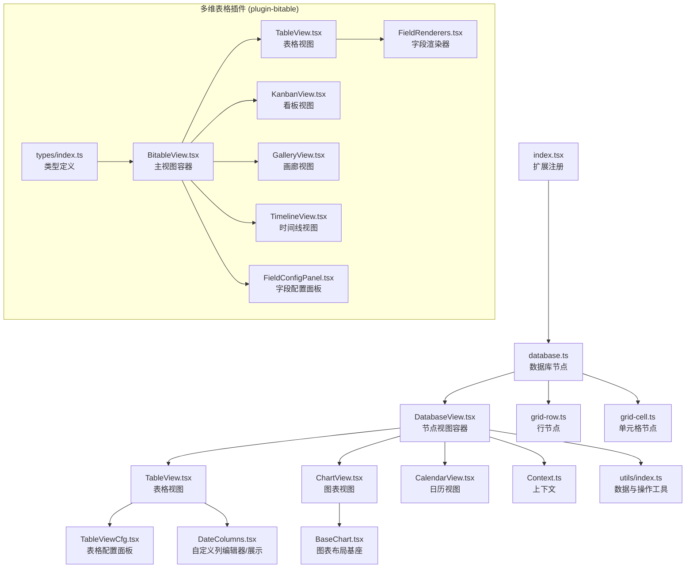

**图表来源**
- [packages/plugin-database/src/database/index.tsx](file://packages/plugin-database/src/database/index.tsx#L1-L21)
- [packages/plugin-database/src/database/database.ts](file://packages/plugin-database/src/database/database.ts#L1-L120)
- [packages/plugin-database/src/database/DatabaseView.tsx](file://packages/plugin-database/src/database/DatabaseView.tsx#L1-L292)
- [packages/plugin-database/src/database/view/TableView.tsx](file://packages/plugin-database/src/database/view/TableView.tsx#L1-L143)
- [packages/plugin-database/src/database/view/TableViewCfg.tsx](file://packages/plugin-database/src/database/view/TableViewCfg.tsx#L1-L114)
- [packages/plugin-database/src/database/view/ChartView.tsx](file://packages/plugin-database/src/database/view/ChartView.tsx#L1-L103)
- [packages/plugin-database/src/database/view/CalendarView.tsx](file://packages/plugin-database/src/database/view/CalendarView.tsx#L1-L181)
- [packages/plugin-database/src/database/view/custom-columns/DateColumns.tsx](file://packages/plugin-database/src/database/view/custom-columns/DateColumns.tsx#L1-L347)
- [packages/plugin-database/src/database/view/charts/BaseChart.tsx](file://packages/plugin-database/src/database/view/charts/BaseChart.tsx#L1-L37)
- [packages/plugin-database/src/database/grid-row.ts](file://packages/plugin-database/src/database/grid-row.ts#L1-L34)
- [packages/plugin-database/src/database/grid-cell.ts](file://packages/plugin-database/src/database/grid-cell.ts#L1-L55)
- [packages/plugin-database/src/database/Context.ts](file://packages/plugin-database/src/database/Context.ts#L1-L18)
- [packages/plugin-database/src/database/utils/index.ts](file://packages/plugin-database/src/database/utils/index.ts#L1-L295)
- [packages/plugin-bitable/src/bitable/BitableView.tsx](file://packages/plugin-bitable/src/bitable/BitableView.tsx#L1-L363)
- [packages/plugin-bitable/src/bitable/views/TableView.tsx](file://packages/plugin-bitable/src/bitable/views/TableView.tsx#L1-L141)
- [packages/plugin-bitable/src/bitable/views/KanbanView.tsx](file://packages/plugin-bitable/src/bitable/views/KanbanView.tsx#L1-L124)
- [packages/plugin-bitable/src/bitable/views/GalleryView.tsx](file://packages/plugin-bitable/src/bitable/views/GalleryView.tsx#L1-L72)
- [packages/plugin-bitable/src/bitable/views/TimelineView.tsx](file://packages/plugin-bitable/src/bitable/views/TimelineView.tsx#L1-L366)
- [packages/plugin-bitable/src/bitable/fields/FieldRenderers.tsx](file://packages/plugin-bitable/src/bitable/fields/FieldRenderers.tsx#L1-L348)
- [packages/plugin-bitable/src/bitable/components/FieldConfigPanel.tsx](file://packages/plugin-bitable/src/bitable/components/FieldConfigPanel.tsx#L1-L412)
- [packages/plugin-bitable/src/types/index.ts](file://packages/plugin-bitable/src/types/index.ts#L1-L169)

**章节来源**
- [packages/plugin-database/src/database/index.tsx](file://packages/plugin-database/src/database/index.tsx#L1-L21)
- [packages/plugin-database/src/database/database.ts](file://packages/plugin-database/src/database/database.ts#L1-L120)
- [packages/plugin-bitable/README.md](file://packages/plugin-bitable/README.md#L1-L194)

## 核心组件
- 数据库节点（database）：定义数据库块的属性（列定义、视图列表、视图配置）、默认视图配置、插入命令与渲染行为。
- 行节点（gridRow）：承载单元格集合，支持选择与拖拽。
- 单元格节点（gridCell）：承载具体数据，支持多种数据类型与可编辑属性。
- 节点视图容器（DatabaseView）：聚合多视图（表格/图表/日历），提供列操作、行操作、批量更新与视图切换。
- 视图组件：
  - 表格视图（TableView）：基于 react-data-grid 的数据网格，支持列拖拽、批量编辑、筛选/排序占位、远程数据占位。
  - 图表视图（ChartView）：根据配置渲染不同图表类型，支持配置面板与空态提示。
  - 日历视图（CalendarView）：基于 react-big-calendar 的日历组件，支持事件解析、配置映射与新增行联动。
- 自定义列（DateColumns）：按列类型提供编辑器与展示组件，覆盖文本、日期、评分、图片、Markdown、Slider、Checkbox、Rate、Select、PageLink 等。
- 工具函数（utils）：提供数据读取、行列增删改、列重排、位置计算、装饰绘制等。
- 上下文（Context）：统一注入数据、回调与节点信息，供各视图消费。

**新增** 多维表格插件的核心组件：
- Bitable 主视图（BitableView）：统一管理四种视图类型，提供字段管理和视图配置功能。
- 字段渲染器（FieldRenderers）：支持20+种字段类型，包括文本、数字、日期、单选、多选、评分、进度、URL、邮箱、电话等。
- 视图组件：
  - 看板视图（KanbanView）：按单选字段分组的任务看板，支持卡片展示和快速添加。
  - 画廊视图（GalleryView）：卡片画廊形式，支持封面图片和三种卡片尺寸。
  - 时间线视图（TimelineView）：甘特图形式，支持日/周/月时间刻度和任务进度可视化。

**章节来源**
- [packages/plugin-database/src/database/database.ts](file://packages/plugin-database/src/database/database.ts#L1-L120)
- [packages/plugin-database/src/database/grid-row.ts](file://packages/plugin-database/src/database/grid-row.ts#L1-L34)
- [packages/plugin-database/src/database/grid-cell.ts](file://packages/plugin-database/src/database/grid-cell.ts#L1-L55)
- [packages/plugin-database/src/database/DatabaseView.tsx](file://packages/plugin-database/src/database/DatabaseView.tsx#L1-L292)
- [packages/plugin-database/src/database/view/TableView.tsx](file://packages/plugin-database/src/database/view/TableView.tsx#L1-L143)
- [packages/plugin-database/src/database/view/ChartView.tsx](file://packages/plugin-database/src/database/view/ChartView.tsx#L1-L103)
- [packages/plugin-database/src/database/view/CalendarView.tsx](file://packages/plugin-database/src/database/view/CalendarView.tsx#L1-L181)
- [packages/plugin-database/src/database/view/custom-columns/DateColumns.tsx](file://packages/plugin-database/src/database/view/custom-columns/DateColumns.tsx#L1-L347)
- [packages/plugin-database/src/database/utils/index.ts](file://packages/plugin-database/src/database/utils/index.ts#L1-L295)
- [packages/plugin-database/src/database/Context.ts](file://packages/plugin-database/src/database/Context.ts#L1-L18)
- [packages/plugin-bitable/src/bitable/BitableView.tsx](file://packages/plugin-bitable/src/bitable/BitableView.tsx#L1-L363)
- [packages/plugin-bitable/src/bitable/views/TableView.tsx](file://packages/plugin-bitable/src/bitable/views/TableView.tsx#L1-L141)
- [packages/plugin-bitable/src/bitable/views/KanbanView.tsx](file://packages/plugin-bitable/src/bitable/views/KanbanView.tsx#L1-L124)
- [packages/plugin-bitable/src/bitable/views/GalleryView.tsx](file://packages/plugin-bitable/src/bitable/views/GalleryView.tsx#L1-L72)
- [packages/plugin-bitable/src/bitable/views/TimelineView.tsx](file://packages/plugin-bitable/src/bitable/views/TimelineView.tsx#L1-L366)
- [packages/plugin-bitable/src/bitable/fields/FieldRenderers.tsx](file://packages/plugin-bitable/src/bitable/fields/FieldRenderers.tsx#L1-L348)

## 架构总览
数据库插件以 ProseMirror 节点为核心，通过 React 节点视图渲染器挂载 UI 组件。DatabaseView 作为容器协调多视图，各视图通过 NodeViewContext 获取数据与操作回调，工具函数负责底层状态变更与同步。

**更新** 多维表格插件采用了更加现代化的架构设计，使用 React Hooks 和 TypeScript 类型系统，提供了更丰富的字段类型和视图功能。

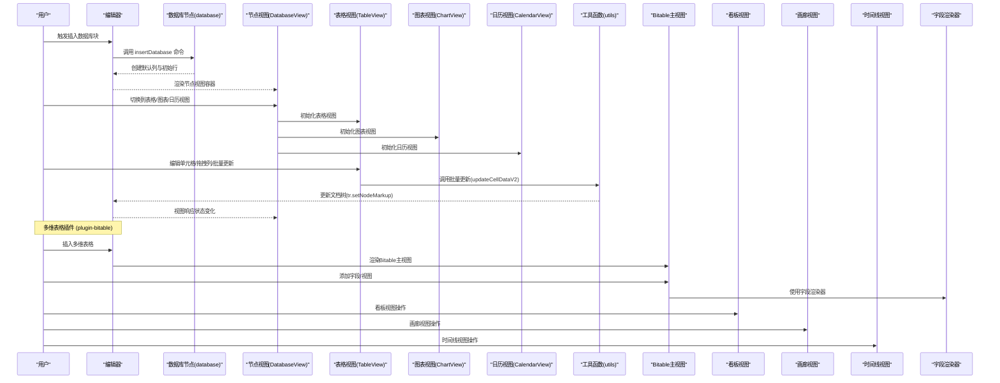

**图表来源**
- [packages/plugin-database/src/database/database.ts](file://packages/plugin-database/src/database/database.ts#L105-L120)
- [packages/plugin-database/src/database/DatabaseView.tsx](file://packages/plugin-database/src/database/DatabaseView.tsx#L1-L292)
- [packages/plugin-database/src/database/view/TableView.tsx](file://packages/plugin-database/src/database/view/TableView.tsx#L1-L143)
- [packages/plugin-database/src/database/view/ChartView.tsx](file://packages/plugin-database/src/database/view/ChartView.tsx#L1-L103)
- [packages/plugin-database/src/database/view/CalendarView.tsx](file://packages/plugin-database/src/database/view/CalendarView.tsx#L1-L181)
- [packages/plugin-database/src/database/utils/index.ts](file://packages/plugin-database/src/database/utils/index.ts#L241-L283)
- [packages/plugin-bitable/src/bitable/BitableView.tsx](file://packages/plugin-bitable/src/bitable/BitableView.tsx#L1-L363)
- [packages/plugin-bitable/src/bitable/views/KanbanView.tsx](file://packages/plugin-bitable/src/bitable/views/KanbanView.tsx#L1-L124)
- [packages/plugin-bitable/src/bitable/views/GalleryView.tsx](file://packages/plugin-bitable/src/bitable/views/GalleryView.tsx#L1-L72)
- [packages/plugin-bitable/src/bitable/views/TimelineView.tsx](file://packages/plugin-bitable/src/bitable/views/TimelineView.tsx#L1-L366)

## 详细组件分析

### 数据模型与节点关系
数据库块由三层节点构成：database（根）、gridRow（行）、gridCell（单元格）。database 持有列定义、视图列表与视图配置；gridRow 持有行标识与是否为标题行；gridCell 持有数据类型、显示开关、实际数据与索引等。

**更新** 多维表格插件的数据模型更加复杂和灵活：
- 字段配置（FieldConfig）：包含字段ID、标题、类型、宽度、显示状态、选项等属性。
- 视图配置（ViewConfig）：支持多种视图类型，每种视图都有特定的配置参数。
- 记录数据（RecordData）：动态键值对结构，支持创建时间和更新时间。

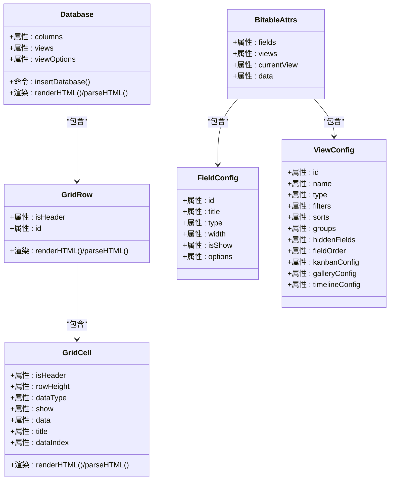

**图表来源**
- [packages/plugin-database/src/database/database.ts](file://packages/plugin-database/src/database/database.ts#L66-L104)
- [packages/plugin-database/src/database/grid-row.ts](file://packages/plugin-database/src/database/grid-row.ts#L1-L34)
- [packages/plugin-database/src/database/grid-cell.ts](file://packages/plugin-database/src/database/grid-cell.ts#L1-L55)
- [packages/plugin-bitable/src/types/index.ts](file://packages/plugin-bitable/src/types/index.ts#L38-L169)

**章节来源**
- [packages/plugin-database/src/database/database.ts](file://packages/plugin-database/src/database/database.ts#L66-L104)
- [packages/plugin-database/src/database/grid-row.ts](file://packages/plugin-database/src/database/grid-row.ts#L1-L34)
- [packages/plugin-database/src/database/grid-cell.ts](file://packages/plugin-database/src/database/grid-cell.ts#L1-L55)
- [packages/plugin-bitable/src/types/index.ts](file://packages/plugin-bitable/src/types/index.ts#L38-L169)

### 节点视图容器与上下文
DatabaseView 负责：
- 从节点中提取列定义与行数据，提供给各视图。
- 统一暴露列操作（新增/删除/移动）、行操作（新增/删除）、单元格更新（单个/批量）。
- 多标签页切换视图，并提供视图配置入口。
- 通过 NodeViewContext 将数据与回调注入子视图。

**更新** 多维表格插件的 BitableView 提供了更强大的功能：
- 统一管理四种视图类型（表格、看板、画廊、时间线）。
- 集成字段配置面板，支持字段的增删改查和拖拽排序。
- 提供视图级别的操作，包括添加视图、删除视图和视图配置。
- 支持记录的增删改查操作。

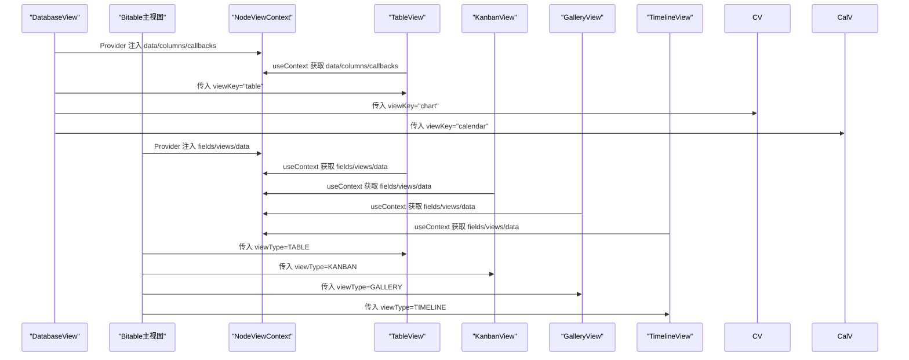

**图表来源**
- [packages/plugin-database/src/database/DatabaseView.tsx](file://packages/plugin-database/src/database/DatabaseView.tsx#L1-L292)
- [packages/plugin-database/src/database/Context.ts](file://packages/plugin-database/src/database/Context.ts#L1-L18)
- [packages/plugin-bitable/src/bitable/BitableView.tsx](file://packages/plugin-bitable/src/bitable/BitableView.tsx#L1-L363)
- [packages/plugin-bitable/src/bitable/views/TableView.tsx](file://packages/plugin-bitable/src/bitable/views/TableView.tsx#L1-L141)
- [packages/plugin-bitable/src/bitable/views/KanbanView.tsx](file://packages/plugin-bitable/src/bitable/views/KanbanView.tsx#L1-L124)
- [packages/plugin-bitable/src/bitable/views/GalleryView.tsx](file://packages/plugin-bitable/src/bitable/views/GalleryView.tsx#L1-L72)
- [packages/plugin-bitable/src/bitable/views/TimelineView.tsx](file://packages/plugin-bitable/src/bitable/views/TimelineView.tsx#L1-L366)

**章节来源**
- [packages/plugin-database/src/database/DatabaseView.tsx](file://packages/plugin-database/src/database/DatabaseView.tsx#L1-L292)
- [packages/plugin-database/src/database/Context.ts](file://packages/plugin-database/src/database/Context.ts#L1-L18)
- [packages/plugin-bitable/src/bitable/BitableView.tsx](file://packages/plugin-bitable/src/bitable/BitableView.tsx#L1-L363)

### 表格视图（TableView）
特性：
- 使用 react-data-grid 渲染，支持列拖拽、列宽调整、行选择、底部汇总行。
- 通过自定义列编辑器与展示组件支持多种数据类型。
- 支持批量更新（onRowsChange -> updateCellDataV2）。
- 配置面板（TableViewCfg）支持字段管理、过滤/排序占位、远程数据占位、锁定与移除。

**更新** 多维表格插件的表格视图：
- 支持字段级别的编辑器和渲染器，覆盖20+种字段类型。
- 集成搜索功能，支持按任意字段搜索记录。
- 支持多选删除和批量操作。
- 提供字段宽度调整和排序功能。

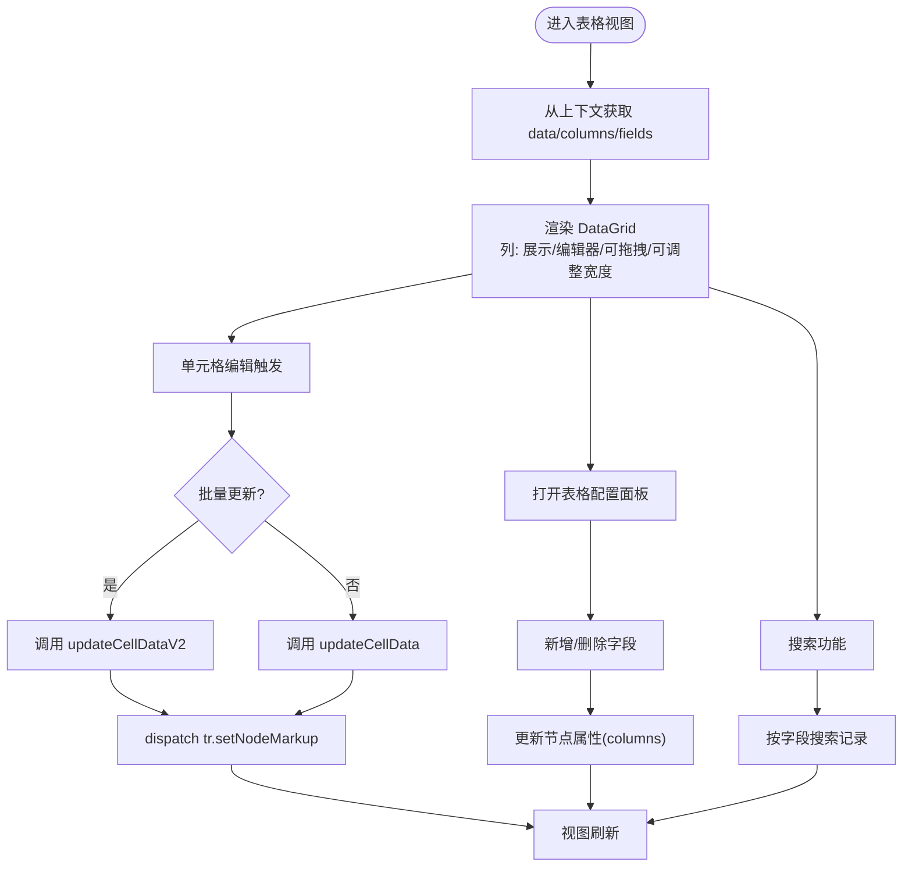

**图表来源**
- [packages/plugin-database/src/database/view/TableView.tsx](file://packages/plugin-database/src/database/view/TableView.tsx#L1-L143)
- [packages/plugin-database/src/database/view/TableViewCfg.tsx](file://packages/plugin-database/src/database/view/TableViewCfg.tsx#L1-L114)
- [packages/plugin-database/src/database/utils/index.ts](file://packages/plugin-database/src/database/utils/index.ts#L241-L283)
- [packages/plugin-bitable/src/bitable/views/TableView.tsx](file://packages/plugin-bitable/src/bitable/views/TableView.tsx#L1-L141)
- [packages/plugin-bitable/src/bitable/fields/FieldRenderers.tsx](file://packages/plugin-bitable/src/bitable/fields/FieldRenderers.tsx#L1-L348)

**章节来源**
- [packages/plugin-database/src/database/view/TableView.tsx](file://packages/plugin-database/src/database/view/TableView.tsx#L1-L143)
- [packages/plugin-database/src/database/view/TableViewCfg.tsx](file://packages/plugin-database/src/database/view/TableViewCfg.tsx#L1-L114)
- [packages/plugin-database/src/database/utils/index.ts](file://packages/plugin-database/src/database/utils/index.ts#L241-L283)
- [packages/plugin-bitable/src/bitable/views/TableView.tsx](file://packages/plugin-bitable/src/bitable/views/TableView.tsx#L1-L141)
- [packages/plugin-bitable/src/bitable/fields/FieldRenderers.tsx](file://packages/plugin-bitable/src/bitable/fields/FieldRenderers.tsx#L1-L348)

### 图表视图（ChartView）
特性：
- 支持多种图表类型（柱状、面积、饼、雷达等），通过配置面板切换。
- 读取节点的 viewOptions 并在编辑器中持久化修改。
- 空态时提供选择图表类型的引导。

**章节来源**
- [packages/plugin-database/src/database/view/ChartView.tsx](file://packages/plugin-database/src/database/view/ChartView.tsx#L1-L103)
- [packages/plugin-database/src/database/view/charts/BaseChart.tsx](file://packages/plugin-database/src/database/view/charts/BaseChart.tsx#L1-L37)

### 日历视图（CalendarView）
特性：
- 基于 react-big-calendar，将数据库数据映射为事件。
- 通过配置面板将标题、描述、开始/结束时间映射到对应列。
- 新增事件时自动新增一行并回填对应列值。

**章节来源**
- [packages/plugin-database/src/database/view/CalendarView.tsx](file://packages/plugin-database/src/database/view/CalendarView.tsx#L1-L181)
- [packages/plugin-database/src/database/utils/index.ts](file://packages/plugin-database/src/database/utils/index.ts#L86-L107)

### 看板视图（KanbanView）
**新增** 多维表格插件的看板视图提供了任务管理的核心功能：
- 按单选字段自动分组，支持未分组记录。
- 卡片形式展示，支持快速添加新任务。
- 基于Badge组件的颜色标识，直观显示任务状态。
- 支持字段级别的渲染器，显示任务的关键信息。

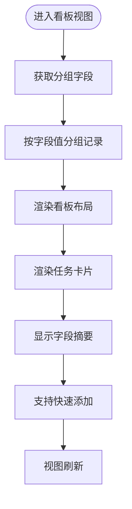

**图表来源**
- [packages/plugin-bitable/src/bitable/views/KanbanView.tsx](file://packages/plugin-bitable/src/bitable/views/KanbanView.tsx#L1-L124)

**章节来源**
- [packages/plugin-bitable/src/bitable/views/KanbanView.tsx](file://packages/plugin-bitable/src/bitable/views/KanbanView.tsx#L1-L124)

### 画廊视图（GalleryView）
**新增** 多维表格插件的画廊视图提供了卡片画廊展示：
- 支持封面图片字段，可选的图片占位符。
- 三种卡片尺寸（小、中、大），响应式布局。
- 每张卡片显示最多3个字段的摘要信息。
- 支持悬停效果和阴影过渡。

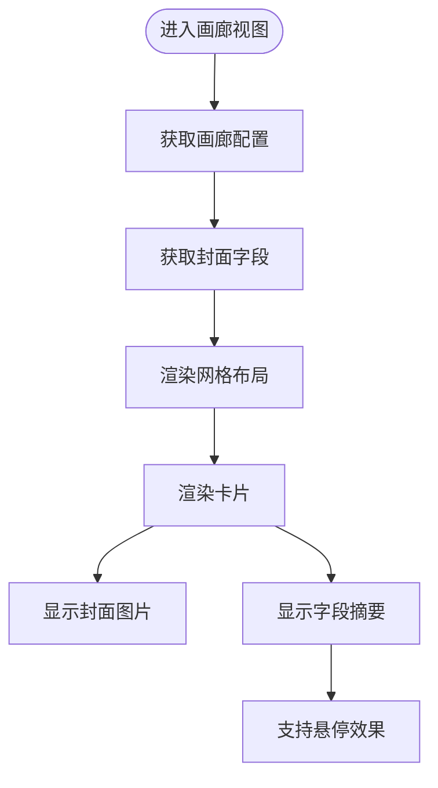

**图表来源**
- [packages/plugin-bitable/src/bitable/views/GalleryView.tsx](file://packages/plugin-bitable/src/bitable/views/GalleryView.tsx#L1-L72)

**章节来源**
- [packages/plugin-bitable/src/bitable/views/GalleryView.tsx](file://packages/plugin-bitable/src/bitable/views/GalleryView.tsx#L1-L72)

### 时间线视图（TimelineView）
**新增** 多维表格插件的时间线视图实现了甘特图功能：
- 支持日/周/月三种时间刻度，动态时间范围。
- 任务条按时间跨度显示，支持进度条覆盖。
- 支持按分组字段的颜色区分，今日标记线。
- 提供时间导航功能，支持悬停显示详细信息。

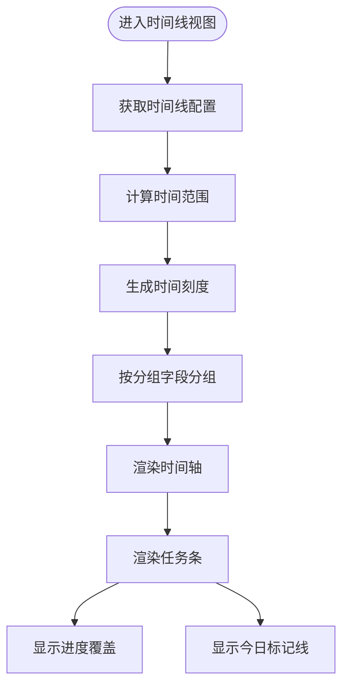

**图表来源**
- [packages/plugin-bitable/src/bitable/views/TimelineView.tsx](file://packages/plugin-bitable/src/bitable/views/TimelineView.tsx#L1-L366)

**章节来源**
- [packages/plugin-bitable/src/bitable/views/TimelineView.tsx](file://packages/plugin-bitable/src/bitable/views/TimelineView.tsx#L1-L366)

### 字段管理系统
**新增** 多维表格插件提供了完整的字段管理系统：
- 支持20+种字段类型：文本、数字、日期、复选框、URL、邮箱、电话、单选、多选、评分、进度等。
- 字段配置面板支持字段的增删改查、拖拽排序、显示/隐藏切换。
- 字段渲染器根据字段类型自动选择合适的编辑器和展示组件。
- 支持单选/多选字段的选项配置和颜色标识。

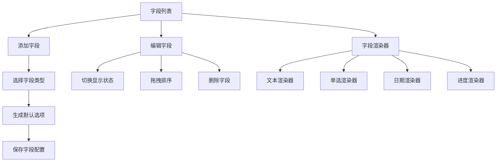

**图表来源**
- [packages/plugin-bitable/src/bitable/components/FieldConfigPanel.tsx](file://packages/plugin-bitable/src/bitable/components/FieldConfigPanel.tsx#L1-L412)
- [packages/plugin-bitable/src/bitable/fields/FieldRenderers.tsx](file://packages/plugin-bitable/src/bitable/fields/FieldRenderers.tsx#L1-L348)
- [packages/plugin-bitable/src/types/index.ts](file://packages/plugin-bitable/src/types/index.ts#L3-L36)

**章节来源**
- [packages/plugin-bitable/src/bitable/components/FieldConfigPanel.tsx](file://packages/plugin-bitable/src/bitable/components/FieldConfigPanel.tsx#L1-L412)
- [packages/plugin-bitable/src/bitable/fields/FieldRenderers.tsx](file://packages/plugin-bitable/src/bitable/fields/FieldRenderers.tsx#L1-L348)
- [packages/plugin-bitable/src/types/index.ts](file://packages/plugin-bitable/src/types/index.ts#L3-L36)

### 自定义列与单元格编辑
自定义列模块提供丰富的编辑器与展示组件，覆盖常用数据类型：
- 文本、日期（DateTimePicker）、评分（Rate）、图片（上传/预览）、Markdown（内嵌编辑器）、Slider、Checkbox、Rate、Select（多选标签）、PageLink。
- 通过 getEditor/getCellView 根据 dataType 动态选择编辑器与展示组件。
- 通过 getCellIcon 为列头提供图标。

**更新** 多维表格插件的字段渲染器支持20+种字段类型：
- 基础字段：文本、数字、日期、复选框、URL、邮箱、电话。
- 高级字段：单选、多选、评分、进度、ID、自动编号。
- 字段编辑器提供相应的UI组件，支持数据验证和格式化。

**章节来源**
- [packages/plugin-database/src/database/view/custom-columns/DateColumns.tsx](file://packages/plugin-database/src/database/view/custom-columns/DateColumns.tsx#L1-L347)
- [packages/plugin-bitable/src/bitable/fields/FieldRenderers.tsx](file://packages/plugin-bitable/src/bitable/fields/FieldRenderers.tsx#L1-L348)

### 数据同步策略
- 单元格更新：单个更新通过 updateCellData 计算目标节点位置并 setNodeMarkup；批量更新通过 updateCellDataV2 在一次事务中完成多次 setNodeMarkup。
- 列操作：新增列通过 JSON 序列化后 replaceWith 替换节点；删除列通过过滤 JSON 内容与列定义后替换；列重排通过交换 JSON 中列顺序后替换。
- 行操作：新增行通过 schema 创建 gridCell 与 gridRow 后插入；删除行通过过滤首列值匹配的行后替换。
- 选择高亮：drawCellSelection 通过 DecorationSet 为当前选中的单元格添加边框装饰。

**更新** 多维表格插件的数据同步策略：
- 字段操作：新增字段通过 JSON 序列化后 replaceWith 替换节点；删除字段通过过滤字段配置和记录数据后替换。
- 视图操作：新增视图通过创建新的 ViewConfig 对象后更新节点属性。
- 记录操作：新增记录通过生成唯一ID后追加到数据数组；删除记录通过过滤ID后替换。
- 字段渲染器：通过getFieldRenderer和getFieldEditor动态选择合适的渲染器和编辑器。

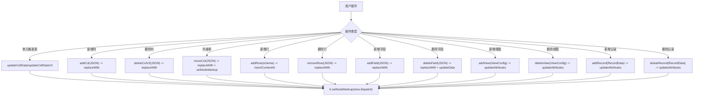

**图表来源**
- [packages/plugin-database/src/database/utils/index.ts](file://packages/plugin-database/src/database/utils/index.ts#L86-L215)
- [packages/plugin-database/src/database/utils/index.ts](file://packages/plugin-database/src/database/utils/index.ts#L218-L230)
- [packages/plugin-bitable/src/bitable/BitableView.tsx](file://packages/plugin-bitable/src/bitable/BitableView.tsx#L46-L128)

**章节来源**
- [packages/plugin-database/src/database/utils/index.ts](file://packages/plugin-database/src/database/utils/index.ts#L86-L215)
- [packages/plugin-database/src/database/utils/index.ts](file://packages/plugin-database/src/database/utils/index.ts#L218-L230)
- [packages/plugin-bitable/src/bitable/BitableView.tsx](file://packages/plugin-bitable/src/bitable/BitableView.tsx#L46-L128)

## 多维表格插件对比

### 功能对比

| 特性 | 数据库插件 | 多维表格插件 |
|------|------------|--------------|
| 视图类型 | 表格、图表、日历 | 表格、看板、画廊、时间线 |
| 字段类型 | 10+种 | 20+种 |
| 字段管理 | 列配置 | 完整字段管理系统 |
| 视图配置 | 基础配置 | 丰富视图配置 |
| 数据操作 | 基础增删改 | 完整CRUD操作 |
| 用户体验 | 传统表格 | 现代化界面 |

### 技术架构对比

**数据库插件**：
- 基于传统的ProseMirror节点模型
- 使用React节点视图渲染器
- 简单的上下文传递机制
- 直接的DOM操作

**多维表格插件**：
- 基于现代React Hooks架构
- TypeScript强类型支持
- 完整的状态管理
- 组件化的视图系统

### 适用场景

**数据库插件适合**：
- 简单的数据表格需求
- 传统数据库功能
- 轻量级解决方案

**多维表格插件适合**：
- 复杂的项目管理
- 多维度数据分析
- 现代化工作流程
- 团队协作场景

**章节来源**
- [packages/plugin-bitable/README.md](file://packages/plugin-bitable/README.md#L1-L194)
- [packages/plugin-bitable/GANTT_VIEW.md](file://packages/plugin-bitable/GANTT_VIEW.md#L1-L178)

## 依赖关系分析
- 扩展注册：index.tsx 将 Database、GridRow、GridCell 注册为扩展，并提供斜杠菜单入口。
- 节点命令：database.ts 定义 insertDatabase 命令，使用 schema 创建默认列与初始行。
- 视图容器：DatabaseView 依赖 utils 读取数据与执行操作，依赖 UI 组件与图标资源。
- 视图实现：TableView 依赖 react-data-grid；ChartView 依赖图表集合；CalendarView 依赖 react-big-calendar 与本地化资源。
- 自定义列：DateColumns 依赖 UI 组件与上传能力，以及编辑器渲染。

**更新** 多维表格插件的依赖关系：
- 字段渲染器：FieldRenderers 依赖 @kn/ui 组件库和 date-fns 日期处理库。
- 视图组件：各视图组件依赖 @kn/ui 和 @kn/icon 图标库。
- 类型定义：完整的TypeScript类型系统支持。
- 第三方库：react-data-grid、date-fns、react-beautiful-dnd 等。

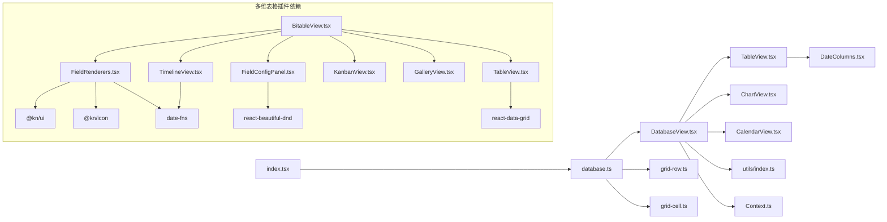

**图表来源**
- [packages/plugin-database/src/database/index.tsx](file://packages/plugin-database/src/database/index.tsx#L1-L21)
- [packages/plugin-database/src/database/database.ts](file://packages/plugin-database/src/database/database.ts#L105-L120)
- [packages/plugin-database/src/database/DatabaseView.tsx](file://packages/plugin-database/src/database/DatabaseView.tsx#L1-L292)
- [packages/plugin-database/src/database/view/TableView.tsx](file://packages/plugin-database/src/database/view/TableView.tsx#L1-L143)
- [packages/plugin-database/src/database/view/ChartView.tsx](file://packages/plugin-database/src/database/view/ChartView.tsx#L1-L103)
- [packages/plugin-database/src/database/view/CalendarView.tsx](file://packages/plugin-database/src/database/view/CalendarView.tsx#L1-L181)
- [packages/plugin-database/src/database/view/custom-columns/DateColumns.tsx](file://packages/plugin-database/src/database/view/custom-columns/DateColumns.tsx#L1-L347)
- [packages/plugin-database/src/database/utils/index.ts](file://packages/plugin-database/src/database/utils/index.ts#L1-L295)
- [packages/plugin-database/src/database/Context.ts](file://packages/plugin-database/src/database/Context.ts#L1-L18)
- [packages/plugin-database/src/database/grid-row.ts](file://packages/plugin-database/src/database/grid-row.ts#L1-L34)
- [packages/plugin-database/src/database/grid-cell.ts](file://packages/plugin-database/src/database/grid-cell.ts#L1-L55)
- [packages/plugin-bitable/src/bitable/BitableView.tsx](file://packages/plugin-bitable/src/bitable/BitableView.tsx#L1-L363)
- [packages/plugin-bitable/src/bitable/fields/FieldRenderers.tsx](file://packages/plugin-bitable/src/bitable/fields/FieldRenderers.tsx#L1-L348)
- [packages/plugin-bitable/src/bitable/components/FieldConfigPanel.tsx](file://packages/plugin-bitable/src/bitable/components/FieldConfigPanel.tsx#L1-L412)

**章节来源**
- [packages/plugin-database/src/database/index.tsx](file://packages/plugin-database/src/database/index.tsx#L1-L21)
- [packages/plugin-database/src/database/database.ts](file://packages/plugin-database/src/database/database.ts#L105-L120)
- [packages/plugin-bitable/src/bitable/BitableView.tsx](file://packages/plugin-bitable/src/bitable/BitableView.tsx#L1-L363)

## 性能考虑
- 批量更新：优先使用 updateCellDataV2 进行批量写入，减少事务次数与重绘开销。
- 列操作：新增/删除列采用 JSON 序列化后一次性 replaceWith，避免逐单元格修改。
- 视图切换：仅在当前激活标签页渲染对应视图，减少不必要的 DOM 渲染。
- 表格尺寸：TableView 通过固定行高与分页参数控制高度，避免超大数据集导致的滚动卡顿。
- 装饰绘制：drawCellSelection 仅在需要时创建 DecorationSet，避免常驻装饰影响性能。

**更新** 多维表格插件的性能优化：
- 使用useMemo缓存计算结果，避免重复计算。
- 字段渲染器按需加载，提高渲染效率。
- 视图组件懒加载，减少初始渲染负担。
- 支持虚拟滚动（计划中），优化大量数据的渲染性能。

## 故障排查指南
- 插入数据库块无效：检查 insertDatabase 命令是否被正确注册，schema 是否包含 database/gridRow/gridCell。
- 表格无法编辑：确认 editor.isEditable 为真，且列的 dataType 不为 id（id 列不可编辑）。
- 列删除后数据未同步：确认使用 deleteColV2 或 moveCol 的 JSON 替换路径，确保 tr.dispatch 生效。
- 日历事件不显示：检查 viewOptions 中 titleAccessor/descAccessor/startAccessor/endAccessor 是否正确映射到列。
- 图表无内容：确认已选择图表类型，viewOptions 中的 type 已持久化到节点属性。

**更新** 多维表格插件故障排查：
- 字段类型错误：检查字段类型配置是否正确，确保字段类型与数据格式匹配。
- 视图配置问题：检查视图配置中的字段映射是否正确，特别是看板、画廊、时间线视图的特殊配置。
- 字段渲染器异常：确认字段渲染器是否正确导入，检查字段类型的映射关系。
- 性能问题：对于大量数据，考虑使用虚拟滚动或分页功能。

**章节来源**
- [packages/plugin-database/src/database/database.ts](file://packages/plugin-database/src/database/database.ts#L105-L120)
- [packages/plugin-database/src/database/view/TableView.tsx](file://packages/plugin-database/src/database/view/TableView.tsx#L1-L143)
- [packages/plugin-database/src/database/view/CalendarView.tsx](file://packages/plugin-database/src/database/view/CalendarView.tsx#L1-L181)
- [packages/plugin-database/src/database/utils/index.ts](file://packages/plugin-database/src/database/utils/index.ts#L137-L215)
- [packages/plugin-bitable/src/bitable/BitableView.tsx](file://packages/plugin-bitable/src/bitable/BitableView.tsx#L1-L363)

## 结论
数据库插件通过清晰的节点模型与视图容器，提供了表格、图表、日历三种视图的统一体验；借助自定义列与批量更新机制，满足多样化的数据录入与可视化需求。配合完善的工具函数与上下文抽象，开发者可以快速扩展新的视图与列类型。

**更新** 多维表格插件提供了更现代化的实现方案，支持四种视图类型和20+种字段类型，具有更强的功能性和更好的用户体验。两种插件各有特色，可以根据具体需求选择合适的方案。

## 附录：使用示例与最佳实践

### 快速创建数据库视图
- 在编辑器中输入斜杠菜单，选择"database"即可插入默认数据库块。
- 默认包含若干列与初始行，可在表格视图中直接编辑或通过配置面板新增列。

**更新** 多维表格插件使用：
- 在编辑器中输入斜杠菜单，选择"bitable"或"多维表格"插入多维表格。
- 支持通过代码方式插入，如 `editor.commands.insertBitable(['字段1', '字段2'])`。

**章节来源**
- [packages/plugin-database/src/database/index.tsx](file://packages/plugin-database/src/database/index.tsx#L1-L21)
- [packages/plugin-database/src/database/database.ts](file://packages/plugin-database/src/database/database.ts#L105-L120)
- [packages/plugin-bitable/README.md](file://packages/plugin-bitable/README.md#L59-L69)

### 管理数据库视图
- 新建视图：点击"新建视图"，选择表格/时间线/图表/Kanban/日历。
- 删除视图：在视图标签右侧菜单中移除。
- 切换视图：使用顶部标签页进行切换。

**更新** 多维表格插件管理：
- 添加视图：点击"+"按钮，选择表格、看板、画廊或甘特图视图。
- 字段管理：点击"配置列"按钮，打开字段配置面板进行字段操作。
- 记录管理：支持添加、编辑、删除记录，以及批量操作。

**章节来源**
- [packages/plugin-database/src/database/DatabaseView.tsx](file://packages/plugin-database/src/database/DatabaseView.tsx#L1-L292)
- [packages/plugin-bitable/src/bitable/BitableView.tsx](file://packages/plugin-bitable/src/bitable/BitableView.tsx#L1-L363)

### 表格视图操作
- 新增行：在表格设置中点击"Add Row"，或在汇总行处触发新增。
- 删除行：勾选行后点击"Delete"。
- 批量编辑：在表格中进行批量填充或拖拽复制。
- 列管理：通过表格配置面板新增/删除列，设置列名与类型。

**更新** 多维表格插件表格视图：
- 字段编辑：支持20+种字段类型的编辑器，包括文本、数字、日期、单选、多选等。
- 搜索功能：支持按任意字段搜索记录，提升数据查找效率。
- 批量操作：支持多选删除和批量编辑操作。

**章节来源**
- [packages/plugin-database/src/database/view/TableView.tsx](file://packages/plugin-database/src/database/view/TableView.tsx#L1-L143)
- [packages/plugin-database/src/database/view/TableViewCfg.tsx](file://packages/plugin-database/src/database/view/TableViewCfg.tsx#L1-L114)
- [packages/plugin-bitable/src/bitable/views/TableView.tsx](file://packages/plugin-bitable/src/bitable/views/TableView.tsx#L1-L141)

### 图表视图配置
- 选择图表类型：在图表头部选择 Bar/Area/Pie/Radar 等。
- 配置项：可在图表配置面板中设置标题、描述、页脚等（具体字段以图表组件为准）。

**章节来源**
- [packages/plugin-database/src/database/view/ChartView.tsx](file://packages/plugin-database/src/database/view/ChartView.tsx#L1-L103)
- [packages/plugin-database/src/database/view/charts/BaseChart.tsx](file://packages/plugin-database/src/database/view/charts/BaseChart.tsx#L1-L37)

### 日历视图映射
- 将标题、描述、开始/结束时间映射到对应列，事件将自动渲染。
- 新增事件会自动新增一行并回填对应列值。

**章节来源**
- [packages/plugin-database/src/database/view/CalendarView.tsx](file://packages/plugin-database/src/database/view/CalendarView.tsx#L1-L181)

### 看板视图使用
**新增** 多维表格插件的看板视图使用：
- 配置分组字段：选择单选字段作为看板的分组依据。
- 添加任务：在看板的各个分组中快速添加新任务。
- 任务管理：支持任务的拖拽排序和状态更新。

**章节来源**
- [packages/plugin-bitable/src/bitable/views/KanbanView.tsx](file://packages/plugin-bitable/src/bitable/views/KanbanView.tsx#L1-L124)

### 画廊视图配置
**新增** 多维表格插件的画廊视图配置：
- 设置封面字段：选择图片字段作为卡片的封面。
- 选择卡片尺寸：支持小、中、大三种尺寸。
- 字段摘要：每张卡片显示最多3个字段的摘要信息。

**章节来源**
- [packages/plugin-bitable/src/bitable/views/GalleryView.tsx](file://packages/plugin-bitable/src/bitable/views/GalleryView.tsx#L1-L72)

### 时间线视图使用
**新增** 多维表格插件的时间线视图使用：
- 配置时间字段：设置开始日期和结束日期字段。
- 选择时间刻度：支持日、周、月三种显示模式。
- 导航功能：支持上月、下月切换和回到今天的快速导航。

**章节来源**
- [packages/plugin-bitable/src/bitable/views/TimelineView.tsx](file://packages/plugin-bitable/src/bitable/views/TimelineView.tsx#L1-L366)

### 数据导入导出
- 导入：通过"远程数据"占位入口接入外部数据源（需自行实现数据拉取与节点属性更新）。
- 导出：可将数据库块内容序列化为 JSON，再转换为目标格式（如 CSV/Excel）。

**更新** 多维表格插件数据导入导出：
- 支持JSON格式的数据导入导出。
- 可以导出为CSV、Excel等常见格式。
- 提供数据验证和格式化功能。

**章节来源**
- [packages/plugin-database/src/database/view/TableViewCfg.tsx](file://packages/plugin-database/src/database/view/TableViewCfg.tsx#L1-L114)

### 权限控制
- 可通过 editor.isEditable 控制视图的可编辑状态，从而限制编辑权限。
- 对特定列（如 id）设置不可编辑，防止误改主键。

**更新** 多维表格插件权限控制：
- 支持基于角色的权限控制。
- 可以设置字段级别的编辑权限。
- 支持视图级别的访问控制。

**章节来源**
- [packages/plugin-database/src/database/view/TableView.tsx](file://packages/plugin-database/src/database/view/TableView.tsx#L1-L143)
- [packages/plugin-database/src/database/grid-cell.ts](file://packages/plugin-database/src/database/grid-cell.ts#L1-L55)

### 性能优化建议
- 大数据量场景：使用分页与固定高度，避免一次性渲染过多行。
- 频繁更新：合并多次编辑为批量更新，减少事务与重绘。
- 列操作：尽量使用 JSON 替换而非逐单元格修改。
- 装饰与高亮：仅在需要时启用，避免常驻装饰。

**更新** 多维表格插件性能优化：
- 使用useMemo缓存计算结果，避免重复计算。
- 字段渲染器按需加载，提高渲染效率。
- 支持虚拟滚动（计划中），优化大量数据的渲染性能。
- 使用React.lazy和Suspense实现组件懒加载。

**章节来源**
- [packages/plugin-database/src/database/view/TableView.tsx](file://packages/plugin-database/src/database/view/TableView.tsx#L1-L143)
- [packages/plugin-database/src/database/utils/index.ts](file://packages/plugin-database/src/database/utils/index.ts#L218-L230)
- [packages/plugin-bitable/src/bitable/BitableView.tsx](file://packages/plugin-bitable/src/bitable/BitableView.tsx#L1-L363)