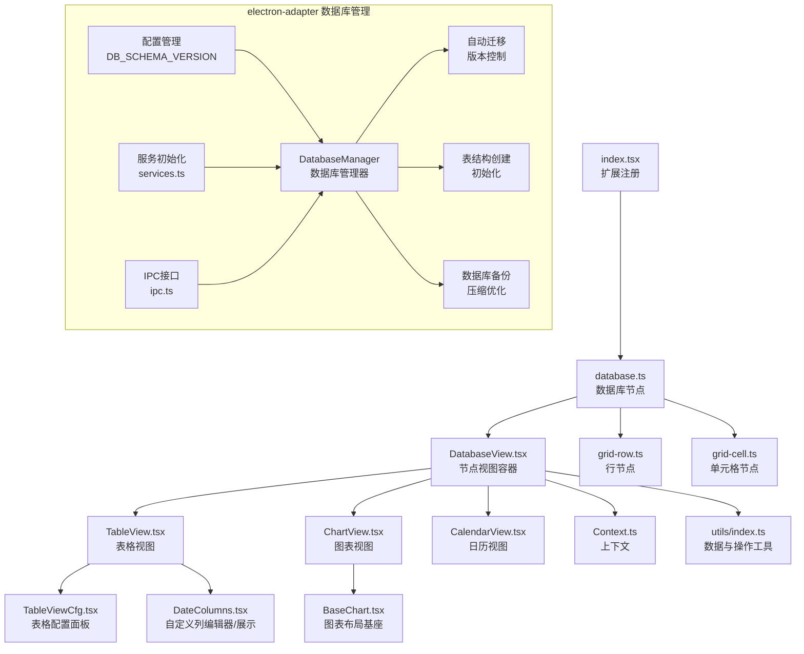
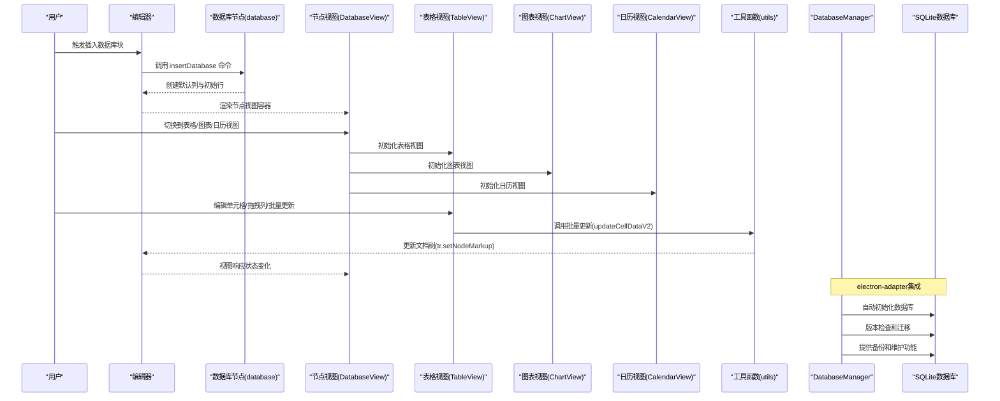
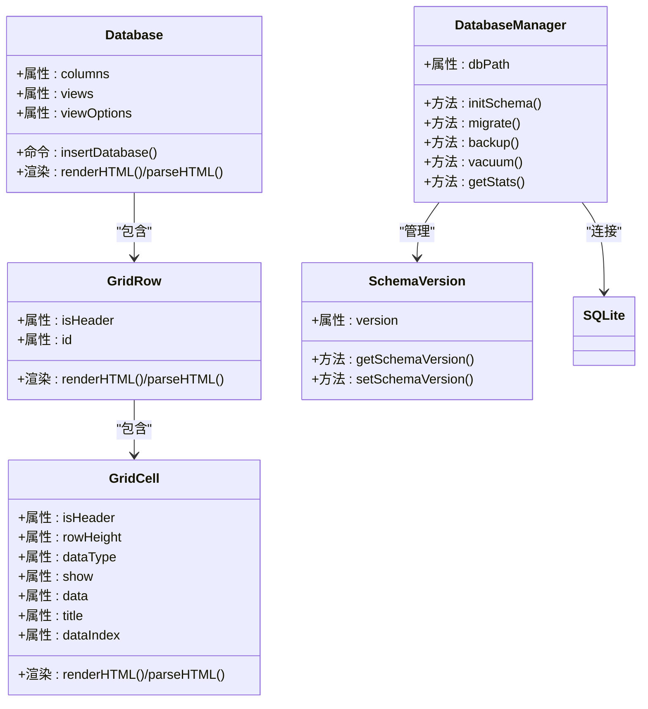
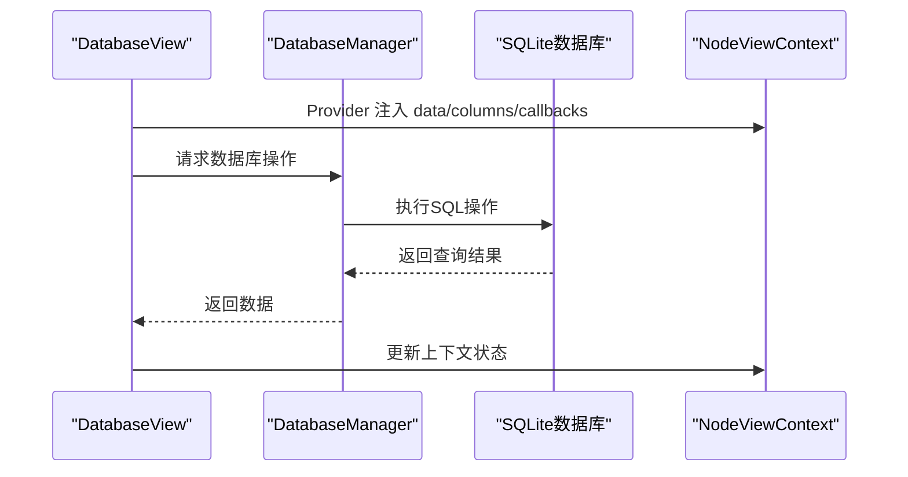
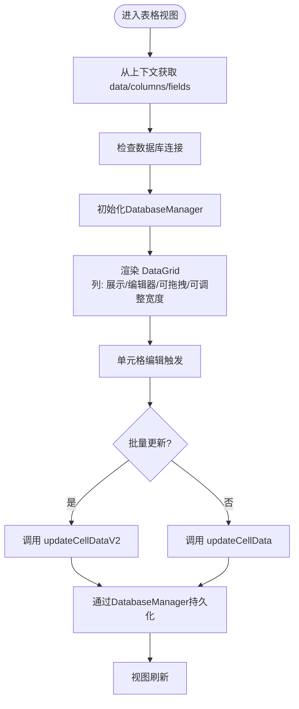
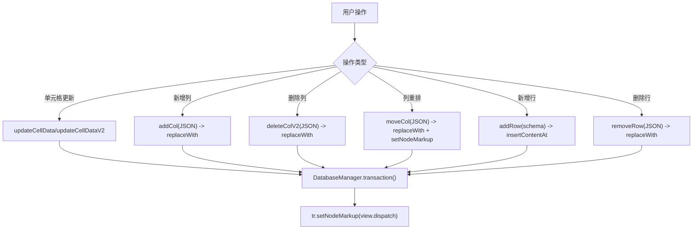
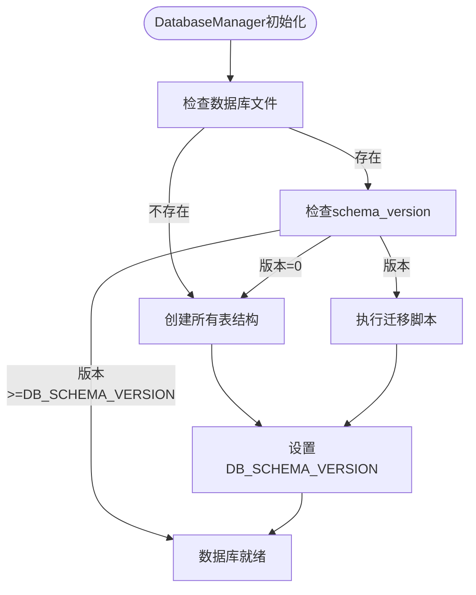
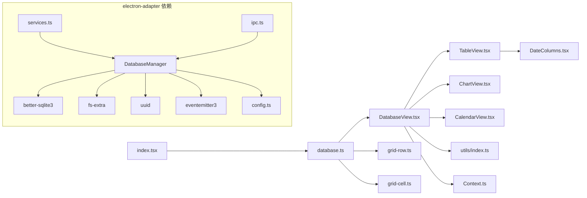

# 数据库插件

<cite>
**本文引用的文件**
- [packages/plugin-database/src/database/index.tsx](file://packages/plugin-database/src/database/index.tsx)
- [packages/plugin-database/src/database/database.ts](file://packages/plugin-database/src/database/database.ts)
- [packages/plugin-database/src/database/DatabaseView.tsx](file://packages/plugin-database/src/database/DatabaseView.tsx)
- [packages/plugin-database/src/database/grid-row.ts](file://packages/plugin-database/src/database/grid-row.ts)
- [packages/plugin-database/src/database/grid-cell.ts](file://packages/plugin-database/src/database/grid-cell.ts)
- [packages/plugin-database/src/database/Context.ts](file://packages/plugin-database/src/database/Context.ts)
- [packages/plugin-database/src/database/utils/index.ts](file://packages/plugin-database/src/database/utils/index.ts)
- [packages/plugin-database/src/database/view/TableView.tsx](file://packages/plugin-database/src/database/view/TableView.tsx)
- [packages/plugin-database/src/database/view/TableViewCfg.tsx](file://packages/plugin-database/src/database/view/TableViewCfg.tsx)
- [packages/plugin-database/src/database/view/ChartView.tsx](file://packages/plugin-database/src/database/view/ChartView.tsx)
- [packages/plugin-database/src/database/view/CalendarView.tsx](file://packages/plugin-database/src/database/view/CalendarView.tsx)
- [packages/plugin-database/src/database/view/custom-columns/DateColumns.tsx](file://packages/plugin-database/src/database/view/custom-columns/DateColumns.tsx)
- [packages/plugin-database/src/database/view/charts/BaseChart.tsx](file://packages/plugin-database/src/database/view/charts/BaseChart.tsx)
- [packages/plugin-bitable/src/bitable/BitableView.tsx](file://packages/plugin-bitable/src/bitable/BitableView.tsx)
- [packages/plugin-bitable/src/bitable/views/TableView.tsx](file://packages/plugin-bitable/src/bitable/views/TableView.tsx)
- [packages/plugin-bitable/src/bitable/views/KanbanView.tsx](file://packages/plugin-bitable/src/bitable/views/KanbanView.tsx)
- [packages/plugin-bitable/src/bitable/views/GalleryView.tsx](file://packages/plugin-bitable/src/bitable/views/GalleryView.tsx)
- [packages/plugin-bitable/src/bitable/views/TimelineView.tsx](file://packages/plugin-bitable/src/bitable/views/TimelineView.tsx)
- [packages/plugin-bitable/src/bitable/views/CalendarView.tsx](file://packages/plugin-bitable/src/bitable/views/CalendarView.tsx)
- [packages/plugin-bitable/src/bitable/views/ChartView.tsx](file://packages/plugin-bitable/src/bitable/views/ChartView.tsx)
- [packages/plugin-bitable/src/bitable/fields/FieldRenderers.tsx](file://packages/plugin-bitable/src/bitable/fields/FieldRenderers.tsx)
- [packages/plugin-bitable/src/bitable/components/FieldConfigPanel.tsx](file://packages/plugin-bitable/src/bitable/components/FieldConfigPanel.tsx)
- [packages/plugin-bitable/src/bitable/components/ExcelImportDialog.tsx](file://packages/plugin-bitable/src/bitable/components/ExcelImportDialog.tsx)
- [packages/plugin-bitable/src/bitable/bitable-tools.ts](file://packages/plugin-bitable/src/bitable/bitable-tools.ts)
- [packages/plugin-bitable/src/bitable/bitable-node.ts](file://packages/plugin-bitable/src/bitable/bitable-node.ts)
- [packages/plugin-bitable/src/types/index.ts](file://packages/plugin-bitable/src/types/index.ts)
- [packages/plugin-bitable/src/utils/fieldConversion.ts](file://packages/plugin-bitable/src/utils/fieldConversion.ts)
- [packages/plugin-bitable/src/utils/id.ts](file://packages/plugin-bitable/src/utils/id.ts)
- [packages/plugin-bitable/README.md](file://packages/plugin-bitable/README.md)
- [packages/plugin-bitable/GANTT_VIEW.md](file://packages/plugin-bitable/GANTT_VIEW.md)
- [packages/electron-adapter/src/database/manager.ts](file://packages/electron-adapter/src/database/manager.ts)
- [packages/electron-adapter/src/config.ts](file://packages/electron-adapter/src/config.ts)
- [packages/electron-adapter/src/database/index.ts](file://packages/electron-adapter/src/database/index.ts)
- [apps/desktop/src/main/services.ts](file://apps/desktop/src/main/services.ts)
- [apps/desktop/src/main/ipc.ts](file://apps/desktop/src/main/ipc.ts)
- [packages/electron-adapter/src/types/index.ts](file://packages/electron-adapter/src/types/index.ts)
- [packages/electron-adapter/src/database/space-repository.ts](file://packages/electron-adapter/src/database/space-repository.ts)
- [packages/electron-adapter/package.json](file://packages/electron-adapter/package.json)
</cite>

## 更新摘要
**变更内容**
- 数据库管理从手动初始化迁移到electron-adapter的DatabaseManager，提供自动迁移和版本控制
- 新增SQLite数据库管理功能，支持自动表结构创建和版本升级
- 增强桌面端应用的数据持久化能力
- 新增数据库备份、压缩和统计功能
- 重构数据库初始化流程，支持更好的错误处理和性能优化

## 目录
1. [简介](#简介)
2. [项目结构](#项目结构)
3. [核心组件](#核心组件)
4. [架构总览](#架构总览)
5. [详细组件分析](#详细组件分析)
6. [多维表格插件对比](#多维表格插件对比)
7. [依赖关系分析](#依赖关系分析)
8. [性能考虑](#性能考虑)
9. [故障排查指南](#故障排查指南)
10. [结论](#结论)
11. [附录：使用示例与最佳实践](#附录使用示例与最佳实践)

## 简介
本文件面向数据库插件的使用者与维护者，系统性阐述数据库功能的实现与使用方法，覆盖表格视图、日历视图、图表视图与自定义列能力；详解数据网格组件、行操作与单元格编辑流程；解释数据模型设计、视图切换机制与数据同步策略；并提供导入导出、权限控制与性能优化的最佳实践建议。

**更新** 新增了electron-adapter的DatabaseManager，提供自动数据库初始化、版本控制和迁移功能。该管理器基于better-sqlite3实现，支持SQLite数据库的完整生命周期管理，包括表结构创建、版本升级、数据备份和性能优化。

## 项目结构
数据库插件位于 packages/plugin-database，采用"扩展节点 + 视图渲染 + 工具函数"的分层组织方式：
- 扩展注册与入口：在 index.tsx 中注册扩展名、扩展节点集合与斜杠菜单入口。
- 节点定义：database.ts 定义数据库节点、默认属性、命令与渲染；grid-row.ts、grid-cell.ts 定义表格行与单元格节点。
- 视图容器：DatabaseView.tsx 作为节点视图容器，负责多视图切换、上下文传递与基础操作。
- 视图实现：TableView.tsx（表格）、 ChartView.tsx（图表）、 CalendarView.tsx（日历）。
- 自定义列与编辑器：custom-columns/DateColumns.tsx 提供多种列类型编辑器与展示组件。
- 工具函数：utils/index.ts 提供数据读取、行列增删改、列移动、位置计算等核心逻辑。
- 上下文：Context.ts 定义 NodeViewContext，统一向子视图传递数据与回调。

**新增** electron-adapter数据库管理：
- DatabaseManager：核心数据库管理类，负责数据库连接、表结构初始化、版本控制和迁移。
- 自动迁移：支持从旧版本到新版本的数据库结构升级。
- 数据库备份：提供数据库备份和恢复功能。
- 性能优化：支持数据库压缩和统计信息获取。

```mermaid
graph TB
A["index.tsx<br/>扩展注册"] --> B["database.ts<br/>数据库节点"]
B --> C["DatabaseView.tsx<br/>节点视图容器"]
C --> D["TableView.tsx<br/>表格视图"]
C --> E["ChartView.tsx<br/>图表视图"]
C --> F["CalendarView.tsx<br/>日历视图"]
D --> G["TableViewCfg.tsx<br/>表格配置面板"]
D --> H["DateColumns.tsx<br/>自定义列编辑器/展示"]
E --> I["BaseChart.tsx<br/>图表布局基座"]
B --> J["grid-row.ts<br/>行节点"]
B --> K["grid-cell.ts<br/>单元格节点"]
C --> L["Context.ts<br/>上下文"]
C --> M["utils/index.ts<br/>数据与操作工具"]
subgraph "electron-adapter 数据库管理"
N["DatabaseManager<br/>数据库管理器"] --> O["自动迁移<br/>版本控制"]
N --> P["表结构创建<br/>初始化"]
N --> Q["数据库备份<br/>压缩优化"]
R["配置管理<br/>DB_SCHEMA_VERSION"] --> N
S["服务初始化<br/>services.ts"] --> N
T["IPC接口<br/>ipc.ts"] --> N
end
```

**图表来源**
- [packages/plugin-database/src/database/index.tsx](file://packages/plugin-database/src/database/index.tsx#L1-L21)
- [packages/plugin-database/src/database/database.ts](file://packages/plugin-database/src/database/database.ts#L1-L120)
- [packages/plugin-database/src/database/DatabaseView.tsx](file://packages/plugin-database/src/database/DatabaseView.tsx#L1-L292)
- [packages/plugin-database/src/database/view/TableView.tsx](file://packages/plugin-database/src/database/view/TableView.tsx#L1-L143)
- [packages/plugin-database/src/database/view/TableViewCfg.tsx](file://packages/plugin-database/src/database/view/TableViewCfg.tsx#L1-L114)
- [packages/plugin-database/src/database/view/ChartView.tsx](file://packages/plugin-database/src/database/view/ChartView.tsx#L1-L103)
- [packages/plugin-database/src/database/view/CalendarView.tsx](file://packages/plugin-database/src/database/view/CalendarView.tsx#L1-L181)
- [packages/plugin-database/src/database/view/custom-columns/DateColumns.tsx](file://packages/plugin-database/src/database/view/custom-columns/DateColumns.tsx#L1-L347)
- [packages/plugin-database/src/database/view/charts/BaseChart.tsx](file://packages/plugin-database/src/database/view/charts/BaseChart.tsx#L1-L37)
- [packages/plugin-database/src/database/grid-row.ts](file://packages/plugin-database/src/database/grid-row.ts#L1-L34)
- [packages/plugin-database/src/database/grid-cell.ts](file://packages/plugin-database/src/database/grid-cell.ts#L1-L55)
- [packages/plugin-database/src/database/Context.ts](file://packages/plugin-database/src/database/Context.ts#L1-L18)
- [packages/plugin-database/src/database/utils/index.ts](file://packages/plugin-database/src/database/utils/index.ts#L1-L295)
- [packages/electron-adapter/src/database/manager.ts](file://packages/electron-adapter/src/database/manager.ts#L1-L369)
- [packages/electron-adapter/src/config.ts](file://packages/electron-adapter/src/config.ts#L23-L23)
- [apps/desktop/src/main/services.ts](file://apps/desktop/src/main/services.ts#L50-L53)
- [apps/desktop/src/main/ipc.ts](file://apps/desktop/src/main/ipc.ts#L203-L216)

**章节来源**
- [packages/plugin-database/src/database/index.tsx](file://packages/plugin-database/src/database/index.tsx#L1-L21)
- [packages/plugin-database/src/database/database.ts](file://packages/plugin-database/src/database/database.ts#L1-L120)
- [packages/electron-adapter/src/database/manager.ts](file://packages/electron-adapter/src/database/manager.ts#L1-L369)
- [packages/electron-adapter/src/config.ts](file://packages/electron-adapter/src/config.ts#L23-L23)

## 核心组件
- 数据库节点（database）：定义数据库块的属性（列定义、视图列表、视图配置）、默认视图配置、插入命令与渲染行为。
- 行节点（gridRow）：承载单元格集合，支持选择与拖拽。
- 单元格节点（gridCell）：承载具体数据，支持多种数据类型与可编辑属性。
- 节点视图容器（DatabaseView）：聚合多视图（表格/图表/日历），提供列操作、行操作、批量更新与视图切换。
- 视图组件：
  - 表格视图（TableView）：基于 react-data-grid 的数据网格，支持列拖拽、批量编辑、筛选/排序占位、远程数据占位。
  - 图表视图（ChartView）：根据配置渲染不同图表类型，支持配置面板与空态提示。
  - 日历视图（CalendarView）：基于 react-big-calendar 的日历组件，支持事件解析、配置映射与新增行联动。
- 自定义列（DateColumns）：按列类型提供编辑器与展示组件，覆盖文本、日期、评分、图片、Markdown、Slider、Checkbox、Rate、Select、PageLink 等。
- 工具函数（utils）：提供数据读取、行列增删改、列重排、位置计算、装饰绘制等。
- 上下文（Context）：统一注入数据、回调与节点信息，供各视图消费。

**新增** electron-adapter数据库管理核心组件：
- DatabaseManager：核心数据库管理类，负责数据库连接、表结构初始化、版本控制和迁移。
- 自动迁移机制：检测当前数据库版本并执行相应的迁移脚本。
- 表结构管理：自动创建所有必需的表结构和索引。
- 数据库操作：提供备份、压缩、统计等数据库维护功能。
- 事务支持：支持数据库事务操作，确保数据一致性。

**章节来源**
- [packages/plugin-database/src/database/database.ts](file://packages/plugin-database/src/database/database.ts#L1-L120)
- [packages/plugin-database/src/database/grid-row.ts](file://packages/plugin-database/src/database/grid-row.ts#L1-L34)
- [packages/plugin-database/src/database/grid-cell.ts](file://packages/plugin-database/src/database/grid-cell.ts#L1-L55)
- [packages/plugin-database/src/database/DatabaseView.tsx](file://packages/plugin-database/src/database/DatabaseView.tsx#L1-L292)
- [packages/plugin-database/src/database/view/TableView.tsx](file://packages/plugin-database/src/database/view/TableView.tsx#L1-L143)
- [packages/plugin-database/src/database/view/ChartView.tsx](file://packages/plugin-database/src/database/view/ChartView.tsx#L1-L103)
- [packages/plugin-database/src/database/view/CalendarView.tsx](file://packages/plugin-database/src/database/view/CalendarView.tsx#L1-L181)
- [packages/plugin-database/src/database/view/custom-columns/DateColumns.tsx](file://packages/plugin-database/src/database/view/custom-columns/DateColumns.tsx#L1-L347)
- [packages/plugin-database/src/database/utils/index.ts](file://packages/plugin-database/src/database/utils/index.ts#L1-L295)
- [packages/plugin-database/src/database/Context.ts](file://packages/plugin-database/src/database/Context.ts#L1-L18)
- [packages/electron-adapter/src/database/manager.ts](file://packages/electron-adapter/src/database/manager.ts#L6-L369)

## 架构总览
数据库插件以 ProseMirror 节点为核心，通过 React 节点视图渲染器挂载 UI 组件。DatabaseView 作为容器协调多视图，各视图通过 NodeViewContext 获取数据与操作回调，工具函数负责底层状态变更与同步。

**更新** electron-adapter架构提供了完整的数据库管理解决方案：
- 数据库连接：通过DatabaseManager管理SQLite数据库连接。
- 自动初始化：启动时自动检测和初始化数据库结构。
- 版本控制：支持数据库版本升级和迁移。
- 服务集成：与桌面应用的服务层深度集成。
- IPC通信：通过IPC接口提供数据库操作能力。

```mermaid
sequenceDiagram
participant U as "用户"
participant E as "编辑器"
participant DBN as "数据库节点(database)"
participant DV as "节点视图(DatabaseView)"
participant TV as "表格视图(TableView)"
participant CV as "图表视图(ChartView)"
participant CalV as "日历视图(CalendarView)"
participant UT as "工具函数(utils)"
participant DM as "DatabaseManager"
participant DB as "SQLite数据库"
U->>E : 触发插入数据库块
E->>DBN : 调用 insertDatabase 命令
DBN-->>E : 创建默认列与初始行
E-->>DV : 渲染节点视图容器
U->>DV : 切换到表格/图表/日历视图
DV->>TV : 初始化表格视图
DV->>CV : 初始化图表视图
DV->>CalV : 初始化日历视图
U->>TV : 编辑单元格/拖拽列/批量更新
TV->>UT : 调用批量更新(updateCellDataV2)
UT-->>E : 更新文档树(tr.setNodeMarkup)
E-->>DV : 视图响应状态变化
Note over DM,DB : electron-adapter集成
DM->>DB : 自动初始化数据库
DM->>DB : 版本检查和迁移
DM->>DB : 提供备份和维护功能
```

**图表来源**
- [packages/plugin-database/src/database/database.ts](file://packages/plugin-database/src/database/database.ts#L105-L120)
- [packages/plugin-database/src/database/DatabaseView.tsx](file://packages/plugin-database/src/database/DatabaseView.tsx#L1-L292)
- [packages/plugin-database/src/database/view/TableView.tsx](file://packages/plugin-database/src/database/view/TableView.tsx#L1-L143)
- [packages/plugin-database/src/database/view/ChartView.tsx](file://packages/plugin-database/src/database/view/ChartView.tsx#L1-L103)
- [packages/plugin-database/src/database/view/CalendarView.tsx](file://packages/plugin-database/src/database/view/CalendarView.tsx#L1-L181)
- [packages/plugin-database/src/database/utils/index.ts](file://packages/plugin-database/src/database/utils/index.ts#L241-L283)
- [packages/electron-adapter/src/database/manager.ts](file://packages/electron-adapter/src/database/manager.ts#L10-L37)
- [apps/desktop/src/main/services.ts](file://apps/desktop/src/main/services.ts#L50-L53)

## 详细组件分析

### 数据模型与节点关系
数据库块由三层节点构成：database（根）、gridRow（行）、gridCell（单元格）。database 持有列定义、视图列表与视图配置；gridRow 持有行标识与是否为标题行；gridCell 持有数据类型、显示开关、实际数据与索引等。

**更新** electron-adapter数据库管理的数据模型：
- 数据库连接：通过DatabaseManager管理SQLite数据库连接。
- 版本控制：使用DB_SCHEMA_VERSION常量管理数据库版本。
- 表结构：自动创建包括spaces、pages、plugins等在内的完整表结构。
- 索引优化：为常用查询字段创建索引，提升查询性能。
- 事务支持：提供事务封装，确保数据一致性。

```mermaid
classDiagram
class Database {
+属性 : columns
+属性 : views
+属性 : viewOptions
+命令 : insertDatabase()
+渲染 : renderHTML()/parseHTML()
}
class GridRow {
+属性 : isHeader
+属性 : id
+渲染 : renderHTML()/parseHTML()
}
class GridCell {
+属性 : isHeader
+属性 : rowHeight
+属性 : dataType
+属性 : show
+属性 : data
+属性 : title
+属性 : dataIndex
+渲染 : renderHTML()/parseHTML()
}
class DatabaseManager {
+属性 : dbPath
+方法 : initSchema()
+方法 : migrate()
+方法 : backup()
+方法 : vacuum()
+方法 : getStats()
}
class SchemaVersion {
+属性 : version
+方法 : getSchemaVersion()
+方法 : setSchemaVersion()
}
Database --> GridRow : "包含"
GridRow --> GridCell : "包含"
DatabaseManager --> SchemaVersion : "管理"
DatabaseManager --> SQLite : "连接"
```

**图表来源**
- [packages/plugin-database/src/database/database.ts](file://packages/plugin-database/src/database/database.ts#L66-L104)
- [packages/plugin-database/src/database/grid-row.ts](file://packages/plugin-database/src/database/grid-row.ts#L1-L34)
- [packages/plugin-database/src/database/grid-cell.ts](file://packages/plugin-database/src/database/grid-cell.ts#L1-L55)
- [packages/electron-adapter/src/database/manager.ts](file://packages/electron-adapter/src/database/manager.ts#L6-L369)
- [packages/electron-adapter/src/config.ts](file://packages/electron-adapter/src/config.ts#L23-L23)

**章节来源**
- [packages/plugin-database/src/database/database.ts](file://packages/plugin-database/src/database/database.ts#L66-L104)
- [packages/plugin-database/src/database/grid-row.ts](file://packages/plugin-database/src/database/grid-row.ts#L1-L34)
- [packages/plugin-database/src/database/grid-cell.ts](file://packages/plugin-database/src/database/grid-cell.ts#L1-L55)
- [packages/electron-adapter/src/database/manager.ts](file://packages/electron-adapter/src/database/manager.ts#L26-L304)
- [packages/electron-adapter/src/config.ts](file://packages/electron-adapter/src/config.ts#L23-L23)

### 节点视图容器与上下文
DatabaseView 负责：
- 从节点中提取列定义与行数据，提供给各视图。
- 统一暴露列操作（新增/删除/移动）、行操作（新增/删除）、单元格更新（单个/批量）。
- 多标签页切换视图，并提供视图配置入口。
- 通过 NodeViewContext 将数据与回调注入子视图。

**更新** electron-adapter集成的DatabaseView：
- 数据持久化：通过DatabaseManager提供数据的持久化存储。
- 版本兼容：支持数据库版本升级，确保数据兼容性。
- 错误处理：提供数据库连接和操作的错误处理机制。
- 性能监控：通过getStats方法获取数据库性能统计信息。

```mermaid
sequenceDiagram
participant DV as "DatabaseView"
participant DM as "DatabaseManager"
participant DB as "SQLite数据库"
participant Ctx as "NodeViewContext"
DV->>Ctx : Provider 注入 data/columns/callbacks
DV->>DM : 请求数据库操作
DM->>DB : 执行SQL操作
DB-->>DM : 返回查询结果
DM-->>DV : 返回数据
DV->>Ctx : 更新上下文状态
```

**图表来源**
- [packages/plugin-database/src/database/DatabaseView.tsx](file://packages/plugin-database/src/database/DatabaseView.tsx#L1-L292)
- [packages/plugin-database/src/database/Context.ts](file://packages/plugin-database/src/database/Context.ts#L1-L18)
- [packages/electron-adapter/src/database/manager.ts](file://packages/electron-adapter/src/database/manager.ts#L309-L311)

**章节来源**
- [packages/plugin-database/src/database/DatabaseView.tsx](file://packages/plugin-database/src/database/DatabaseView.tsx#L1-L292)
- [packages/plugin-database/src/database/Context.ts](file://packages/plugin-database/src/database/Context.ts#L1-L18)
- [packages/electron-adapter/src/database/manager.ts](file://packages/electron-adapter/src/database/manager.ts#L309-L311)

### 表格视图（TableView）
特性：
- 使用 react-data-grid 渲染，支持列拖拽、列宽调整、行选择、底部汇总行。
- 通过自定义列编辑器与展示组件支持多种数据类型。
- 支持批量更新（onRowsChange -> updateCellDataV2）。
- 配置面板（TableViewCfg）支持字段管理、过滤/排序占位、远程数据占位、锁定与移除。

**更新** electron-adapter集成的表格视图：
- 数据持久化：所有数据变更通过DatabaseManager进行持久化存储。
- 版本控制：支持数据库版本升级，确保数据结构兼容性。
- 性能优化：通过索引优化和查询缓存提升大数据量场景下的性能。
- 错误恢复：提供数据库连接失败时的降级处理机制。

```mermaid
flowchart TD
Start(["进入表格视图"]) --> LoadData["从上下文获取 data/columns/fields"]
LoadData --> CheckDB["检查数据库连接"]
CheckDB --> InitDB["初始化DatabaseManager"]
InitDB --> RenderGrid["渲染 DataGrid<br/>列: 展示/编辑器/可拖拽/可调整宽度"]
RenderGrid --> EditCell["单元格编辑触发"]
EditCell --> BatchUpdate{"批量更新?"}
BatchUpdate --> |是| CallBatch["调用 updateCellDataV2"]
BatchUpdate --> |否| CallSingle["调用 updateCellData"]
CallBatch --> PersistData["通过DatabaseManager持久化"]
CallSingle --> PersistData
PersistData --> Refresh["视图刷新"]
```

**图表来源**
- [packages/plugin-database/src/database/view/TableView.tsx](file://packages/plugin-database/src/database/view/TableView.tsx#L1-L143)
- [packages/plugin-database/src/database/view/TableViewCfg.tsx](file://packages/plugin-database/src/database/view/TableViewCfg.tsx#L1-L114)
- [packages/plugin-database/src/database/utils/index.ts](file://packages/plugin-database/src/database/utils/index.ts#L241-L283)
- [packages/electron-adapter/src/database/manager.ts](file://packages/electron-adapter/src/database/manager.ts#L10-L24)

**章节来源**
- [packages/plugin-database/src/database/view/TableView.tsx](file://packages/plugin-database/src/database/view/TableView.tsx#L1-L143)
- [packages/plugin-database/src/database/view/TableViewCfg.tsx](file://packages/plugin-database/src/database/view/TableViewCfg.tsx#L1-L114)
- [packages/plugin-database/src/database/utils/index.ts](file://packages/plugin-database/src/database/utils/index.ts#L241-L283)
- [packages/electron-adapter/src/database/manager.ts](file://packages/electron-adapter/src/database/manager.ts#L10-L24)

### 图表视图（ChartView）
特性：
- 支持多种图表类型（柱状、面积、饼、雷达等），通过配置面板切换。
- 读取节点的 viewOptions 并在编辑器中持久化修改。
- 空态时提供选择图表类型的引导。

**更新** electron-adapter集成的图表视图：
- 数据源：支持从DatabaseManager获取持久化数据进行图表渲染。
- 版本兼容：确保图表配置与数据库版本兼容。
- 性能优化：大数据量图表渲染时的性能优化策略。

**章节来源**
- [packages/plugin-database/src/database/view/ChartView.tsx](file://packages/plugin-database/src/database/view/ChartView.tsx#L1-L103)
- [packages/plugin-database/src/database/view/charts/BaseChart.tsx](file://packages/plugin-database/src/database/view/charts/BaseChart.tsx#L1-L37)

### 日历视图（CalendarView）
特性：
- 基于 react-big-calendar，将数据库数据映射为事件。
- 通过配置面板将标题、描述、开始/结束时间映射到对应列。
- 新增事件时自动新增一行并回填对应列值。

**更新** electron-adapter集成的日历视图：
- 数据持久化：事件数据通过DatabaseManager进行持久化存储。
- 实时同步：支持实时数据同步和冲突解决。
- 性能优化：大量事件数据的渲染优化。

**章节来源**
- [packages/plugin-database/src/database/view/CalendarView.tsx](file://packages/plugin-database/src/database/view/CalendarView.tsx#L1-L181)
- [packages/plugin-database/src/database/utils/index.ts](file://packages/plugin-database/src/database/utils/index.ts#L86-L107)

### 数据同步策略
- 单元格更新：单个更新通过 updateCellData 计算目标节点位置并 setNodeMarkup；批量更新通过 updateCellDataV2 在一次事务中完成多次 setNodeMarkup。
- 列操作：新增列通过 JSON 序列化后 replaceWith 替换节点；删除列通过过滤 JSON 内容与列定义后替换；列重排通过交换 JSON 中列顺序后替换。
- 行操作：新增行通过 schema 创建 gridCell 与 gridRow 后插入；删除行通过过滤首列值匹配的行后替换。
- 选择高亮：drawCellSelection 通过 DecorationSet 为当前选中的单元格添加边框装饰。

**更新** electron-adapter集成的数据同步策略：
- 数据库事务：所有数据操作通过DatabaseManager的事务封装确保一致性。
- 版本控制：支持数据库版本升级和数据迁移。
- 错误恢复：提供数据库连接失败时的降级处理和数据恢复机制。
- 性能优化：通过索引和查询优化提升大数据量场景下的性能。

```mermaid
flowchart TD
U["用户操作"] --> Op{"操作类型"}
Op --> |单元格更新| UC["updateCellData/updateCellDataV2"]
Op --> |新增列| AC["addCol(JSON) -> replaceWith"]
Op --> |删除列| DC["deleteColV2(JSON) -> replaceWith"]
Op --> |列重排| MC["moveCol(JSON) -> replaceWith + setNodeMarkup"]
Op --> |新增行| AR["addRow(schema) -> insertContentAt"]
Op --> |删除行| DR["removeRow(JSON) -> replaceWith"]
UC --> DBTX["DatabaseManager.transaction()"]
AC --> DBTX
DC --> DBTX
MC --> DBTX
AR --> DBTX
DR --> DBTX
DBTX --> TR["tr.setNodeMarkup(view.dispatch)"]
```

**图表来源**
- [packages/plugin-database/src/database/utils/index.ts](file://packages/plugin-database/src/database/utils/index.ts#L86-L215)
- [packages/plugin-database/src/database/utils/index.ts](file://packages/plugin-database/src/database/utils/index.ts#L218-L230)
- [packages/electron-adapter/src/database/manager.ts](file://packages/electron-adapter/src/database/manager.ts#L323-L326)

**章节来源**
- [packages/plugin-database/src/database/utils/index.ts](file://packages/plugin-database/src/database/utils/index.ts#L86-L215)
- [packages/plugin-database/src/database/utils/index.ts](file://packages/plugin-database/src/database/utils/index.ts#L218-L230)
- [packages/electron-adapter/src/database/manager.ts](file://packages/electron-adapter/src/database/manager.ts#L323-L326)

### 数据库管理器（DatabaseManager）
**新增** DatabaseManager是electron-adapter的核心组件，提供完整的数据库管理功能：

- 自动初始化：启动时自动检测数据库是否存在，不存在则创建并初始化表结构。
- 版本控制：通过schema_version表管理数据库版本，支持版本升级和迁移。
- 表结构管理：自动创建包括spaces、pages、plugins、files等在内的完整表结构。
- 数据库操作：提供备份、压缩、统计等数据库维护功能。
- 事务支持：支持数据库事务操作，确保数据一致性。

```mermaid
flowchart TD
Start(["DatabaseManager初始化"]) --> CheckDB["检查数据库文件"]
CheckDB --> |存在| CheckVersion["检查schema_version"]
CheckDB --> |不存在| CreateTables["创建所有表结构"]
CreateTables --> SetVersion["设置DB_SCHEMA_VERSION"]
CheckVersion --> |版本=0| CreateTables
CheckVersion --> |版本<DB_SCHEMA_VERSION| RunMigration["执行迁移脚本"]
CheckVersion --> |版本>=DB_SCHEMA_VERSION| Ready["数据库就绪"]
RunMigration --> SetVersion
SetVersion --> Ready
```

**图表来源**
- [packages/electron-adapter/src/database/manager.ts](file://packages/electron-adapter/src/database/manager.ts#L10-L37)
- [packages/electron-adapter/src/database/manager.ts](file://packages/electron-adapter/src/database/manager.ts#L26-L37)
- [packages/electron-adapter/src/database/manager.ts](file://packages/electron-adapter/src/database/manager.ts#L280-L304)

**章节来源**
- [packages/electron-adapter/src/database/manager.ts](file://packages/electron-adapter/src/database/manager.ts#L6-L369)
- [packages/electron-adapter/src/config.ts](file://packages/electron-adapter/src/config.ts#L23-L23)

### 数据库备份与维护
**新增** DatabaseManager提供完整的数据库维护功能：

- 备份功能：支持数据库文件备份到指定路径。
- 压缩优化：提供VACUUM操作优化数据库文件大小。
- 统计信息：提供数据库表统计信息，包括记录数量等。
- 错误处理：完善的错误处理和日志记录机制。

**章节来源**
- [packages/electron-adapter/src/database/manager.ts](file://packages/electron-adapter/src/database/manager.ts#L331-L367)

### 服务集成与IPC通信
**新增** electron-adapter与桌面应用服务的深度集成：

- 服务初始化：在services.ts中初始化DatabaseManager并注入到全局服务。
- IPC接口：通过ipc.ts提供数据库操作的IPC接口。
- 错误处理：提供数据库连接失败时的错误处理和用户提示。
- 性能监控：通过getStats接口提供数据库性能监控。

**章节来源**
- [apps/desktop/src/main/services.ts](file://apps/desktop/src/main/services.ts#L50-L53)
- [apps/desktop/src/main/services.ts](file://apps/desktop/src/main/services.ts#L184-L187)
- [apps/desktop/src/main/ipc.ts](file://apps/desktop/src/main/ipc.ts#L203-L216)

## 多维表格插件对比

### 功能对比

| 特性 | 数据库插件 | 多维表格插件 | electron-adapter数据库管理 |
|------|------------|--------------|---------------------------|
| 视图类型 | 表格、图表、日历 | 表格、看板、画廊、时间线、日历、图表、表单 | 无 | 
| 字段类型 | 10+种 | 27种（新增Person、Attachment、Formula、Relation） | 无 |
| 字段管理 | 列配置 | 完整字段管理系统 | 无 |
| 视图配置 | 基础配置 | 丰富视图配置 | 无 |
| 数据操作 | 基础增删改 | 完整CRUD操作 | 数据持久化、版本控制 |
| 文件管理 | 无 | 集成文件管理器 | 无 |
| Excel导入 | 无 | 支持Excel导入导出 | 无 |
| 用户体验 | 传统表格 | 现代化界面 | 无 |
| 图表类型 | 4种 | 9种 | 无 |
| 时间线视图 | 无 | 支持甘特图 | 无 |
| 日历视图 | 基础 | 专业日历组件 | 无 |
| 数据库管理 | 手动初始化 | 无 | 自动初始化、版本控制 |
| 数据持久化 | 内存存储 | 内存存储 | SQLite数据库 |
| 版本控制 | 无 | 无 | 支持数据库版本升级 |
| 数据备份 | 无 | 无 | 支持数据库备份 |
| 性能优化 | 基础 | 高级优化 | 数据库索引、事务优化 |

### 技术架构对比

**数据库插件**：
- 基于传统的ProseMirror节点模型
- 使用React节点视图渲染器
- 简单的上下文传递机制
- 直接的DOM操作

**electron-adapter**：
- 基于better-sqlite3的SQLite数据库
- 自动数据库初始化和版本控制
- 完整的数据库生命周期管理
- 事务支持和错误处理
- 数据库备份和维护功能

### 适用场景

**数据库插件适合**：
- 简单的数据表格需求
- 传统数据库功能
- 轻量级解决方案

**electron-adapter适合**：
- 需要数据持久化的桌面应用
- 需要版本控制和数据迁移的应用
- 需要数据库备份和维护功能的应用
- 大数据量场景下的性能优化需求

**章节来源**
- [packages/plugin-bitable/README.md](file://packages/plugin-bitable/README.md#L1-L194)
- [packages/plugin-bitable/GANTT_VIEW.md](file://packages/plugin-bitable/GANTT_VIEW.md#L1-L178)

## 依赖关系分析
- 扩展注册：index.tsx 将 Database、GridRow、GridCell 注册为扩展，并提供斜杠菜单入口。
- 节点命令：database.ts 定义 insertDatabase 命令，使用 schema 创建默认列与初始行。
- 视图容器：DatabaseView 依赖 utils 读取数据与执行操作，依赖 UI 组件与图标资源。
- 视图实现：TableView 依赖 react-data-grid；ChartView 依赖图表集合；CalendarView 依赖 react-big-calendar 与本地化资源。
- 自定义列：DateColumns 依赖 UI 组件与上传能力，以及编辑器渲染。

**更新** electron-adapter依赖关系：
- better-sqlite3：SQLite数据库驱动程序。
- fs-extra：文件系统操作库。
- UUID：唯一标识符生成。
- 事件发射器：事件处理机制。
- 数据库管理：DatabaseManager提供完整的数据库管理功能。

```mermaid
graph LR
IDX["index.tsx"] --> DBN["database.ts"]
DBN --> DRV["DatabaseView.tsx"]
DRV --> TV["TableView.tsx"]
DRV --> CV["ChartView.tsx"]
DRV --> CALV["CalendarView.tsx"]
TV --> DCC["DateColumns.tsx"]
DRV --> UT["utils/index.ts"]
DRV --> CTX["Context.ts"]
DBN --> GR["grid-row.ts"]
DBN --> GC["grid-cell.ts"]
subgraph "electron-adapter 依赖"
DM["DatabaseManager"] --> BS["better-sqlite3"]
DM --> FS["fs-extra"]
DM --> UUID["uuid"]
DM --> EE["eventemitter3"]
DM --> CFG["config.ts"]
SV["services.ts"] --> DM
IPC["ipc.ts"] --> DM
end
```

**图表来源**
- [packages/plugin-database/src/database/index.tsx](file://packages/plugin-database/src/database/index.tsx#L1-L21)
- [packages/plugin-database/src/database/database.ts](file://packages/plugin-database/src/database/database.ts#L105-L120)
- [packages/plugin-database/src/database/DatabaseView.tsx](file://packages/plugin-database/src/database/DatabaseView.tsx#L1-L292)
- [packages/plugin-database/src/database/view/TableView.tsx](file://packages/plugin-database/src/database/view/TableView.tsx#L1-L143)
- [packages/plugin-database/src/database/view/ChartView.tsx](file://packages/plugin-database/src/database/view/ChartView.tsx#L1-L103)
- [packages/plugin-database/src/database/view/CalendarView.tsx](file://packages/plugin-database/src/database/view/CalendarView.tsx#L1-L181)
- [packages/plugin-database/src/database/view/custom-columns/DateColumns.tsx](file://packages/plugin-database/src/database/view/custom-columns/DateColumns.tsx#L1-L347)
- [packages/plugin-database/src/database/utils/index.ts](file://packages/plugin-database/src/database/utils/index.ts#L1-L295)
- [packages/plugin-database/src/database/Context.ts](file://packages/plugin-database/src/database/Context.ts#L1-L18)
- [packages/plugin-database/src/database/grid-row.ts](file://packages/plugin-database/src/database/grid-row.ts#L1-L34)
- [packages/plugin-database/src/database/grid-cell.ts](file://packages/plugin-database/src/database/grid-cell.ts#L1-L55)
- [packages/electron-adapter/src/database/manager.ts](file://packages/electron-adapter/src/database/manager.ts#L1-L5)
- [packages/electron-adapter/package.json](file://packages/electron-adapter/package.json#L20-L26)
- [apps/desktop/src/main/services.ts](file://apps/desktop/src/main/services.ts#L44-L53)
- [apps/desktop/src/main/ipc.ts](file://apps/desktop/src/main/ipc.ts#L203-L216)

**章节来源**
- [packages/plugin-database/src/database/index.tsx](file://packages/plugin-database/src/database/index.tsx#L1-L21)
- [packages/plugin-database/src/database/database.ts](file://packages/plugin-database/src/database/database.ts#L105-L120)
- [packages/electron-adapter/src/database/manager.ts](file://packages/electron-adapter/src/database/manager.ts#L1-L5)
- [packages/electron-adapter/package.json](file://packages/electron-adapter/package.json#L20-L26)

## 性能考虑
- 批量更新：优先使用 updateCellDataV2 进行批量写入，减少事务次数与重绘开销。
- 列操作：新增/删除列采用 JSON 序列化后一次性 replaceWith，避免逐单元格修改。
- 视图切换：仅在当前激活标签页渲染对应视图，减少不必要的 DOM 渲染。
- 表格尺寸：TableView 通过固定行高与分页参数控制高度，避免超大数据集导致的滚动卡顿。
- 装饰绘制：drawCellSelection 仅在需要时创建 DecorationSet，避免常驻装饰影响性能。

**更新** electron-adapter性能优化：
- 数据库索引：为常用查询字段创建索引，提升查询性能。
- 事务优化：通过DatabaseManager的事务封装减少数据库操作开销。
- 连接池：better-sqlite3提供高效的数据库连接管理。
- 内存优化：SQLite数据库内存使用优化，支持大数据量场景。
- 异步操作：数据库备份和维护操作异步执行，避免阻塞主线程。

**章节来源**
- [packages/plugin-database/src/database/view/TableView.tsx](file://packages/plugin-database/src/database/view/TableView.tsx#L1-L143)
- [packages/plugin-database/src/database/utils/index.ts](file://packages/plugin-database/src/database/utils/index.ts#L218-L230)
- [packages/electron-adapter/src/database/manager.ts](file://packages/electron-adapter/src/database/manager.ts#L347-L367)

## 故障排查指南
- 插入数据库块无效：检查 insertDatabase 命令是否被正确注册，schema 是否包含 database/gridRow/gridCell。
- 表格无法编辑：确认 editor.isEditable 为真，且列的 dataType 不为 id（id 列不可编辑）。
- 列删除后数据未同步：确认使用 deleteColV2 或 moveCol 的 JSON 替换路径，确保 tr.dispatch 生效。
- 日历事件不显示：检查 viewOptions 中 titleAccessor/descAccessor/startAccessor/endAccessor 是否正确映射到列。
- 图表无内容：确认已选择图表类型，viewOptions 中的 type 已持久化到节点属性。

**更新** electron-adapter故障排查：
- 数据库连接失败：检查DatabaseManager初始化是否成功，数据库文件路径是否正确。
- 版本升级错误：检查DB_SCHEMA_VERSION常量和迁移脚本是否正确。
- 数据库损坏：使用DatabaseManager.backup进行备份，然后重新初始化数据库。
- 性能问题：使用getStats获取数据库统计信息，检查索引使用情况。
- IPC通信失败：检查services.ts中的服务初始化和ipc.ts中的接口注册。

**章节来源**
- [packages/plugin-database/src/database/database.ts](file://packages/plugin-database/src/database/database.ts#L105-L120)
- [packages/plugin-database/src/database/view/TableView.tsx](file://packages/plugin-database/src/database/view/TableView.tsx#L1-L143)
- [packages/plugin-database/src/database/view/CalendarView.tsx](file://packages/plugin-database/src/database/view/CalendarView.tsx#L1-L181)
- [packages/plugin-database/src/database/utils/index.ts](file://packages/plugin-database/src/database/utils/index.ts#L137-L215)
- [packages/electron-adapter/src/database/manager.ts](file://packages/electron-adapter/src/database/manager.ts#L280-L304)
- [apps/desktop/src/main/services.ts](file://apps/desktop/src/main/services.ts#L138-L146)
- [apps/desktop/src/main/ipc.ts](file://apps/desktop/src/main/ipc.ts#L203-L216)

## 结论
数据库插件通过清晰的节点模型与视图容器，提供了表格、图表、日历三种视图的统一体验；借助自定义列与批量更新机制，满足多样化的数据录入与可视化需求。配合完善的工具函数与上下文抽象，开发者可以快速扩展新的视图与列类型。

**更新** electron-adapter提供了完整的数据库管理解决方案，通过DatabaseManager实现了自动数据库初始化、版本控制和迁移功能。该解决方案基于better-sqlite3，支持SQLite数据库的完整生命周期管理，包括表结构创建、版本升级、数据备份和性能优化。与传统的手动数据库管理相比，electron-adapter提供了更好的可靠性、可维护性和用户体验。

两种插件各有特色，可以根据具体需求选择合适的方案。对于简单的数据管理需求，数据库插件是轻量级的选择；对于需要数据持久化、版本控制和数据库维护功能的应用，electron-adapter提供了更全面的解决方案。

## 附录：使用示例与最佳实践

### 快速创建数据库视图
- 在编辑器中输入斜杠菜单，选择"database"即可插入默认数据库块。
- 默认包含若干列与初始行，可在表格视图中直接编辑或通过配置面板新增列。

**更新** electron-adapter集成使用：
- 数据库自动初始化：启动应用时DatabaseManager自动初始化数据库。
- 版本控制：支持数据库版本升级，无需手动干预。
- 数据持久化：所有数据通过SQLite数据库进行持久化存储。

**章节来源**
- [packages/plugin-database/src/database/index.tsx](file://packages/plugin-database/src/database/index.tsx#L1-L21)
- [packages/plugin-database/src/database/database.ts](file://packages/plugin-database/src/database/database.ts#L105-L120)
- [packages/electron-adapter/src/database/manager.ts](file://packages/electron-adapter/src/database/manager.ts#L10-L24)

### 管理数据库视图
- 新建视图：点击"新建视图"，选择表格/时间线/图表/Kanban/日历。
- 删除视图：在视图标签右侧菜单中移除。
- 切换视图：使用顶部标签页进行切换。

**更新** electron-adapter数据库管理：
- 数据库备份：通过IPC接口调用db:backup进行数据库备份。
- 数据库维护：通过db:vacuum进行数据库压缩优化。
- 性能监控：通过db:getStats获取数据库统计信息。

**章节来源**
- [packages/plugin-database/src/database/DatabaseView.tsx](file://packages/plugin-database/src/database/DatabaseView.tsx#L1-L292)
- [apps/desktop/src/main/ipc.ts](file://apps/desktop/src/main/ipc.ts#L203-L216)

### 表格视图操作
- 新增行：在表格设置中点击"Add Row"，或在汇总行处触发新增。
- 删除行：勾选行后点击"Delete"。
- 批量编辑：在表格中进行批量填充或拖拽复制。
- 列管理：通过表格配置面板新增/删除列，设置列名与类型。

**更新** electron-adapter表格视图：
- 数据持久化：所有数据变更自动通过DatabaseManager进行持久化。
- 版本兼容：支持数据库版本升级，确保数据兼容性。
- 性能优化：通过索引优化和查询缓存提升性能。

**章节来源**
- [packages/plugin-database/src/database/view/TableView.tsx](file://packages/plugin-database/src/database/view/TableView.tsx#L1-L143)
- [packages/plugin-database/src/database/view/TableViewCfg.tsx](file://packages/plugin-database/src/database/view/TableViewCfg.tsx#L1-L114)
- [packages/electron-adapter/src/database/manager.ts](file://packages/electron-adapter/src/database/manager.ts#L309-L311)

### 图表视图配置
- 选择图表类型：在图表头部选择 Bar/Area/Pie/Radar 等。
- 配置项：可在图表配置面板中设置标题、描述、页脚等（具体字段以图表组件为准）。

**更新** electron-adapter图表视图：
- 数据源：支持从DatabaseManager获取持久化数据进行图表渲染。
- 版本兼容：确保图表配置与数据库版本兼容。

**章节来源**
- [packages/plugin-database/src/database/view/ChartView.tsx](file://packages/plugin-database/src/database/view/ChartView.tsx#L1-L103)
- [packages/plugin-database/src/database/view/charts/BaseChart.tsx](file://packages/plugin-database/src/database/view/charts/BaseChart.tsx#L1-L37)

### 日历视图映射
- 将标题、描述、开始/结束时间映射到对应列，事件将自动渲染。
- 新增事件会自动新增一行并回填对应列值。

**更新** electron-adapter日历视图：
- 数据持久化：事件数据通过DatabaseManager进行持久化存储。
- 实时同步：支持实时数据同步和冲突解决。

**章节来源**
- [packages/plugin-database/src/database/view/CalendarView.tsx](file://packages/plugin-database/src/database/view/CalendarView.tsx#L1-L181)

### 数据导入导出
- 导入：通过"远程数据"占位入口接入外部数据源（需自行实现数据拉取与节点属性更新）。
- 导出：可将数据库块内容序列化为 JSON，再转换为目标格式（如 CSV/Excel）。

**更新** electron-adapter数据导入导出：
- 数据库备份：支持数据库文件备份到指定路径。
- 数据库维护：支持VACUUM操作优化数据库文件大小。
- 性能监控：支持获取数据库统计信息。

**章节来源**
- [packages/plugin-database/src/database/view/TableViewCfg.tsx](file://packages/plugin-database/src/database/view/TableViewCfg.tsx#L1-L114)
- [apps/desktop/src/main/ipc.ts](file://apps/desktop/src/main/ipc.ts#L203-L216)

### 权限控制
- 可通过 editor.isEditable 控制视图的可编辑状态，从而限制编辑权限。
- 对特定列（如 id）设置不可编辑，防止误改主键。

**更新** electron-adapter权限控制：
- 数据库权限：通过SQLite文件权限控制数据库访问。
- 事务安全：通过DatabaseManager的事务封装确保数据一致性。
- 错误处理：提供完善的错误处理和日志记录机制。

**章节来源**
- [packages/plugin-database/src/database/view/TableView.tsx](file://packages/plugin-database/src/database/view/TableView.tsx#L1-L143)
- [packages/plugin-database/src/database/grid-cell.ts](file://packages/plugin-database/src/database/grid-cell.ts#L1-L55)
- [packages/electron-adapter/src/database/manager.ts](file://packages/electron-adapter/src/database/manager.ts#L323-L326)

### 性能优化建议
- 大数据量场景：使用分页与固定高度，避免一次性渲染过多行。
- 频繁更新：合并多次编辑为批量更新，减少事务与重绘。
- 列操作：尽量使用 JSON 替换而非逐单元格修改。
- 装饰与高亮：仅在需要时启用，避免常驻装饰。

**更新** electron-adapter性能优化：
- 数据库索引：为常用查询字段创建索引，提升查询性能。
- 事务优化：通过DatabaseManager的事务封装减少数据库操作开销。
- 内存优化：SQLite数据库内存使用优化，支持大数据量场景。
- 异步操作：数据库备份和维护操作异步执行，避免阻塞主线程。
- 连接池：better-sqlite3提供高效的数据库连接管理。

**章节来源**
- [packages/plugin-database/src/database/view/TableView.tsx](file://packages/plugin-database/src/database/view/TableView.tsx#L1-L143)
- [packages/plugin-database/src/database/utils/index.ts](file://packages/plugin-database/src/database/utils/index.ts#L218-L230)
- [packages/electron-adapter/src/database/manager.ts](file://packages/electron-adapter/src/database/manager.ts#L347-L367)