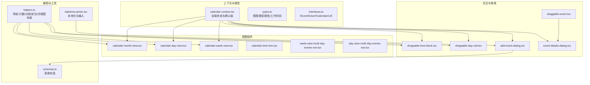
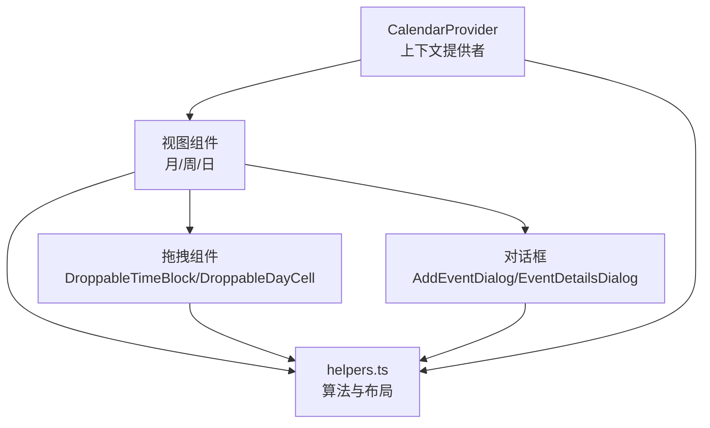
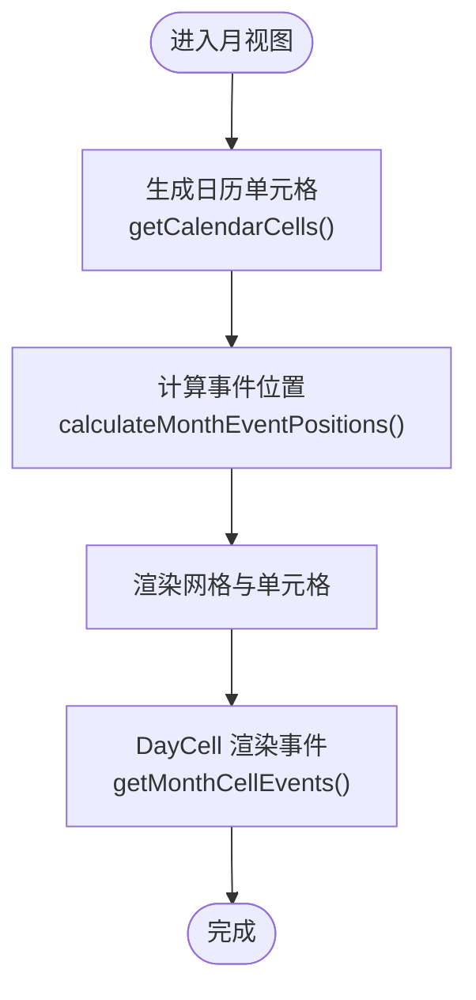
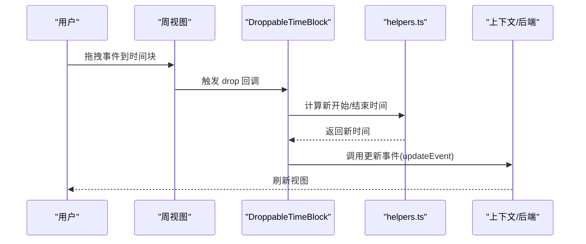
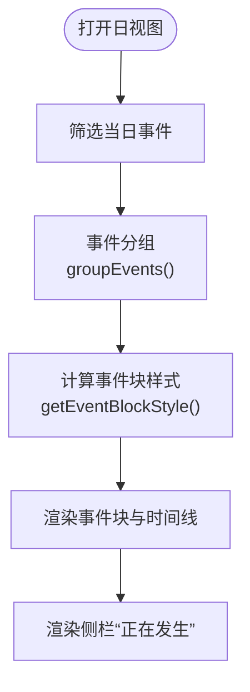
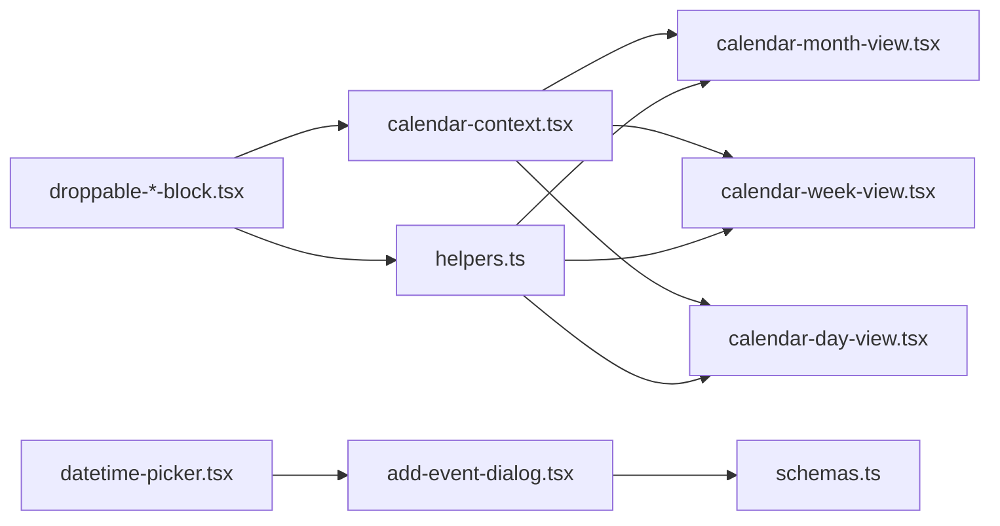

# 日历视图

<cite>
**本文引用的文件**
- [packages/plugin-database/src/database/view/calendar/contexts/calendar-context.tsx](file://packages/plugin-database/src/database/view/calendar/contexts/calendar-context.tsx)
- [packages/plugin-database/src/database/view/calendar/types.ts](file://packages/plugin-database/src/database/view/calendar/types.ts)
- [packages/plugin-database/src/database/view/calendar/interfaces.ts](file://packages/plugin-database/src/database/view/calendar/interfaces.ts)
- [packages/plugin-database/src/database/view/calendar/helpers.ts](file://packages/plugin-database/src/database/view/calendar/helpers.ts)
- [packages/plugin-database/src/database/view/calendar/components/month-view/calendar-month-view.tsx](file://packages/plugin-database/src/database/view/calendar/components/month-view/calendar-month-view.tsx)
- [packages/plugin-database/src/database/view/calendar/components/month-view/day-cell.tsx](file://packages/plugin-database/src/database/view/calendar/components/month-view/day-cell.tsx)
- [packages/plugin-database/src/database/view/calendar/components/month-view/month-event-badge.tsx](file://packages/plugin-database/src/database/view/calendar/components/month-view/month-event-badge.tsx)
- [packages/plugin-database/src/database/view/calendar/components/week-and-day-view/calendar-week-view.tsx](file://packages/plugin-database/src/database/view/calendar/components/week-and-day-view/calendar-week-view.tsx)
- [packages/plugin-database/src/database/view/calendar/components/week-and-day-view/calendar-day-view.tsx](file://packages/plugin-database/src/database/view/calendar/components/week-and-day-view/calendar-day-view.tsx)
- [packages/plugin-database/src/database/view/calendar/components/week-and-day-view/calendar-time-line.tsx](file://packages/plugin-database/src/database/view/calendar/components/week-and-day-view/calendar-time-line.tsx)
- [packages/plugin-database/src/database/view/calendar/components/week-and-day-view/event-block.tsx](file://packages/plugin-database/src/database/view/calendar/components/week-and-day-view/event-block.tsx)
- [packages/plugin-database/src/database/view/calendar/components/week-and-day-view/week-view-multi-day-events-row.tsx](file://packages/plugin-database/src/database/view/calendar/components/week-and-day-view/week-view-multi-day-events-row.tsx)
- [packages/plugin-database/src/database/view/calendar/components/week-and-day-view/day-view-multi-day-events-row.tsx](file://packages/plugin-database/src/database/view/calendar/components/week-and-day-view/day-view-multi-day-events-row.tsx)
- [packages/plugin-database/src/database/view/calendar/components/dnd/droppable-time-block.tsx](file://packages/plugin-database/src/database/view/calendar/components/dnd/droppable-time-block.tsx)
- [packages/plugin-database/src/database/view/calendar/components/dnd/droppable-day-cell.tsx](file://packages/plugin-database/src/database/view/calendar/components/dnd/droppable-day-cell.tsx)
- [packages/plugin-database/src/database/view/calendar/components/dnd/draggable-event.tsx](file://packages/plugin-database/src/database/view/calendar/components/dnd/draggable-event.tsx)
- [packages/plugin-database/src/database/view/calendar/components/dialogs/add-event-dialog.tsx](file://packages/plugin-database/src/database/view/calendar/components/dialogs/add-event-dialog.tsx)
- [packages/plugin-database/src/database/view/calendar/components/dialogs/event-details-dialog.tsx](file://packages/plugin-database/src/database/view/calendar/components/dialogs/event-details-dialog.tsx)
- [packages/plugin-database/src/database/view/calendar/schemas.ts](file://packages/plugin-database/src/database/view/calendar/schemas.ts)
- [packages/plugin-database/src/database/view/CalendarView.tsx](file://packages/plugin-database/src/database/view/CalendarView.tsx)
- [packages/plugin-database/src/database/view/client-container.tsx](file://packages/plugin-database/src/database/view/client-container.tsx)
- [packages/ui/src/components/ui/datetime-picker.tsx](file://packages/ui/src/components/ui/datetime-picker.tsx)
</cite>

## 目录
1. [简介](#简介)
2. [项目结构](#项目结构)
3. [核心组件](#核心组件)
4. [架构总览](#架构总览)
5. [详细组件分析](#详细组件分析)
6. [依赖关系分析](#依赖关系分析)
7. [性能考虑](#性能考虑)
8. [故障排查指南](#故障排查指南)
9. [结论](#结论)
10. [附录](#附录)

## 简介
本文件系统性梳理仓库中“日历视图”功能，覆盖多视图（月、周、日）实现、交互设计（事件创建、拖拽调整时间、视图切换）、数据模型与事件管理（存储、时间范围查询、重复事件处理）、使用示例（数据库存储与展示）、性能优化、本地化与移动端适配等主题。目标是帮助开发者快速理解并扩展该日历能力。

## 项目结构
日历视图位于插件数据库模块的“数据库视图”子系统内，采用上下文驱动的状态管理与按视图拆分的组件组织方式。核心目录与职责如下：
- 上下文与类型：提供全局状态（当前日期、用户、工作时间、可见小时、视图模式、事件列表等）
- 视图组件：月/周/日视图分别渲染网格、时间线、事件块
- 拖拽与对话框：支持拖拽放置到时间块或日单元格，以及弹窗创建/查看事件
- 辅助函数：计算时间范围、事件分组与定位、月视图事件位置等
- 数据模型：事件接口、用户信息、日历单元格定义
- 本地化与输入控件：基于日期库与UI组件的本地化与时间选择器

图表来源
- [packages/plugin-database/src/database/view/calendar/contexts/calendar-context.tsx](file://packages/plugin-database/src/database/view/calendar/contexts/calendar-context.tsx#L1-L96)
- [packages/plugin-database/src/database/view/calendar/types.ts](file://packages/plugin-database/src/database/view/calendar/types.ts#L1-L6)
- [packages/plugin-database/src/database/view/calendar/interfaces.ts](file://packages/plugin-database/src/database/view/calendar/interfaces.ts#L1-L24)
- [packages/plugin-database/src/database/view/calendar/helpers.ts](file://packages/plugin-database/src/database/view/calendar/helpers.ts#L1-L276)
- [packages/plugin-database/src/database/view/calendar/components/month-view/calendar-month-view.tsx](file://packages/plugin-database/src/database/view/calendar/components/month-view/calendar-month-view.tsx#L1-L49)
- [packages/plugin-database/src/database/view/calendar/components/week-and-day-view/calendar-week-view.tsx](file://packages/plugin-database/src/database/view/calendar/components/week-and-day-view/calendar-week-view.tsx#L1-L178)
- [packages/plugin-database/src/database/view/calendar/components/week-and-day-view/calendar-day-view.tsx](file://packages/plugin-database/src/database/view/calendar/components/week-and-day-view/calendar-day-view.tsx#L1-L210)
- [packages/plugin-database/src/database/view/calendar/components/week-and-day-view/calendar-time-line.tsx](file://packages/plugin-database/src/database/view/calendar/components/week-and-day-view/calendar-time-line.tsx#L1-L41)
- [packages/plugin-database/src/database/view/calendar/components/week-and-day-view/week-view-multi-day-events-row.tsx](file://packages/plugin-database/src/database/view/calendar/components/week-and-day-view/week-view-multi-day-events-row.tsx#L77-L113)
- [packages/plugin-database/src/database/view/calendar/components/week-and-day-view/day-view-multi-day-events-row.tsx](file://packages/plugin-database/src/database/view/calendar/components/week-and-day-view/day-view-multi-day-events-row.tsx)
- [packages/plugin-database/src/database/view/calendar/components/dnd/droppable-time-block.tsx](file://packages/plugin-database/src/database/view/calendar/components/dnd/droppable-time-block.tsx#L1-L58)
- [packages/plugin-database/src/database/view/calendar/components/dnd/droppable-day-cell.tsx](file://packages/plugin-database/src/database/view/calendar/components/dnd/droppable-day-cell.tsx#L1-L56)
- [packages/plugin-database/src/database/view/calendar/components/dnd/draggable-event.tsx](file://packages/plugin-database/src/database/view/calendar/components/dnd/draggable-event.tsx)
- [packages/plugin-database/src/database/view/calendar/components/dialogs/add-event-dialog.tsx](file://packages/plugin-database/src/database/view/calendar/components/dialogs/add-event-dialog.tsx#L1-L314)
- [packages/plugin-database/src/database/view/calendar/components/dialogs/event-details-dialog.tsx](file://packages/plugin-database/src/database/view/calendar/components/dialogs/event-details-dialog.tsx)
- [packages/plugin-database/src/database/view/calendar/schemas.ts](file://packages/plugin-database/src/database/view/calendar/schemas.ts#L1-L15)
- [packages/ui/src/components/ui/datetime-picker.tsx](file://packages/ui/src/components/ui/datetime-picker.tsx#L183-L239)

章节来源
- [packages/plugin-database/src/database/view/calendar/contexts/calendar-context.tsx](file://packages/plugin-database/src/database/view/calendar/contexts/calendar-context.tsx#L1-L96)
- [packages/plugin-database/src/database/view/calendar/helpers.ts](file://packages/plugin-database/src/database/view/calendar/helpers.ts#L1-L276)

## 核心组件
- 全局上下文与默认值
  - 提供 selectedDate、selectedUserId、view、workingHours、visibleHours、users、events 等状态，默认工作时间与可见小时范围
  - 提供设置方法与编辑器实例，用于事件新增回调与可编辑态控制
- 类型与接口
  - 视图类型：day、week、month、year、agenda
  - 事件颜色枚举：blue、green、red、yellow、purple、orange、gray
  - 接口：IEvent（含时间范围、标题、描述、用户、颜色）、IUser、ICalendarCell
- 辅助函数
  - 导航与范围文本：根据视图返回起止日期字符串
  - 事件计数：按视图统计某日事件数量
  - 当前事件：筛选当前进行中的事件
  - 事件分组：按结束时间贪心分组，避免重叠
  - 事件块样式：计算事件块 top/left/width 百分比
  - 工作时间判断：按星期几与小时判断是否可用
  - 可见小时范围：从单日事件推导可视时间段
  - 月视图单元格生成：前后月份衔接与当月天数
  - 月视图事件定位：为多日事件分配列位，避免重叠
  - 月视图单元格事件：按日期过滤并排序

章节来源
- [packages/plugin-database/src/database/view/calendar/contexts/calendar-context.tsx](file://packages/plugin-database/src/database/view/calendar/contexts/calendar-context.tsx#L1-L96)
- [packages/plugin-database/src/database/view/calendar/types.ts](file://packages/plugin-database/src/database/view/calendar/types.ts#L1-L6)
- [packages/plugin-database/src/database/view/calendar/interfaces.ts](file://packages/plugin-database/src/database/view/calendar/interfaces.ts#L1-L24)
- [packages/plugin-database/src/database/view/calendar/helpers.ts](file://packages/plugin-database/src/database/view/calendar/helpers.ts#L1-L276)

## 架构总览
日历采用“上下文驱动 + 视图组件 + 交互层”的分层架构：
- 上下文层：集中管理视图状态、用户与事件数据、工作时间与可见小时
- 视图层：月/周/日视图分别渲染网格、时间线与事件块；多日事件在周/日顶部行展示
- 交互层：拖拽放置到时间块或日单元格，弹窗创建/编辑事件，键盘可访问
- 工具层：helpers 提供时间计算、事件分组与定位、月视图布局等算法

图表来源
- [packages/plugin-database/src/database/view/calendar/contexts/calendar-context.tsx](file://packages/plugin-database/src/database/view/calendar/contexts/calendar-context.tsx#L43-L96)
- [packages/plugin-database/src/database/view/calendar/components/month-view/calendar-month-view.tsx](file://packages/plugin-database/src/database/view/calendar/components/month-view/calendar-month-view.tsx#L1-L49)
- [packages/plugin-database/src/database/view/calendar/components/week-and-day-view/calendar-week-view.tsx](file://packages/plugin-database/src/database/view/calendar/components/week-and-day-view/calendar-week-view.tsx#L1-L178)
- [packages/plugin-database/src/database/view/calendar/components/week-and-day-view/calendar-day-view.tsx](file://packages/plugin-database/src/database/view/calendar/components/week-and-day-view/calendar-day-view.tsx#L1-L210)
- [packages/plugin-database/src/database/view/calendar/components/dnd/droppable-time-block.tsx](file://packages/plugin-database/src/database/view/calendar/components/dnd/droppable-time-block.tsx#L1-L58)
- [packages/plugin-database/src/database/view/calendar/components/dnd/droppable-day-cell.tsx](file://packages/plugin-database/src/database/view/calendar/components/dnd/droppable-day-cell.tsx#L1-L56)
- [packages/plugin-database/src/database/view/calendar/components/dialogs/add-event-dialog.tsx](file://packages/plugin-database/src/database/view/calendar/components/dialogs/add-event-dialog.tsx#L1-L314)
- [packages/plugin-database/src/database/view/calendar/helpers.ts](file://packages/plugin-database/src/database/view/calendar/helpers.ts#L1-L276)

## 详细组件分析

### 月视图（CalendarMonthView）
- 渲染逻辑
  - 周标题行固定
  - 使用 helpers 生成日历单元格（包含上月/当月/下月衔接）
  - 计算多日与单日事件在月内的位置，避免重叠
  - DayCell 展示每个单元格内的事件标记与省略计数
- 事件展示
  - 月事件徽章（MonthEventBadge）按首/中/尾三段式展示多日事件
  - 小屏隐藏徽章，仅显示点状标记
- 拖拽与创建
  - 支持拖拽到日单元格，更新事件日期但保持时长不变

图表来源
- [packages/plugin-database/src/database/view/calendar/components/month-view/calendar-month-view.tsx](file://packages/plugin-database/src/database/view/calendar/components/month-view/calendar-month-view.tsx#L1-L49)
- [packages/plugin-database/src/database/view/calendar/components/month-view/day-cell.tsx](file://packages/plugin-database/src/database/view/calendar/components/month-view/day-cell.tsx#L1-L69)
- [packages/plugin-database/src/database/view/calendar/components/month-view/month-event-badge.tsx](file://packages/plugin-database/src/database/view/calendar/components/month-view/month-event-badge.tsx#L1-L126)
- [packages/plugin-database/src/database/view/calendar/helpers.ts](file://packages/plugin-database/src/database/view/calendar/helpers.ts#L170-L276)

章节来源
- [packages/plugin-database/src/database/view/calendar/components/month-view/calendar-month-view.tsx](file://packages/plugin-database/src/database/view/calendar/components/month-view/calendar-month-view.tsx#L1-L49)
- [packages/plugin-database/src/database/view/calendar/components/month-view/day-cell.tsx](file://packages/plugin-database/src/database/view/calendar/components/month-view/day-cell.tsx#L1-L69)
- [packages/plugin-database/src/database/view/calendar/components/month-view/month-event-badge.tsx](file://packages/plugin-database/src/database/view/calendar/components/month-view/month-event-badge.tsx#L1-L126)
- [packages/plugin-database/src/database/view/calendar/helpers.ts](file://packages/plugin-database/src/database/view/calendar/helpers.ts#L170-L276)

### 周视图（CalendarWeekView）
- 渲染逻辑
  - 周头部显示七天名称与日期
  - 时间轴每小时四格（0/15/30/45 分），支持工作时间禁用区域
  - 多日事件在顶部行按天区间展示
  - 单日事件按开始时间分组，避免重叠
- 事件块样式
  - 通过 helpers 计算 top/left/width 百分比，支持可见小时范围裁剪
- 交互
  - DroppableTimeBlock 支持拖拽到时间块，保持事件时长
  - 点击空白时间块打开添加事件对话框
  - 现在时间线随分钟滚动定位

图表来源
- [packages/plugin-database/src/database/view/calendar/components/week-and-day-view/calendar-week-view.tsx](file://packages/plugin-database/src/database/view/calendar/components/week-and-day-view/calendar-week-view.tsx#L1-L178)
- [packages/plugin-database/src/database/view/calendar/components/dnd/droppable-time-block.tsx](file://packages/plugin-database/src/database/view/calendar/components/dnd/droppable-time-block.tsx#L1-L58)
- [packages/plugin-database/src/database/view/calendar/helpers.ts](file://packages/plugin-database/src/database/view/calendar/helpers.ts#L121-L167)

章节来源
- [packages/plugin-database/src/database/view/calendar/components/week-and-day-view/calendar-week-view.tsx](file://packages/plugin-database/src/database/view/calendar/components/week-and-day-view/calendar-week-view.tsx#L1-L178)
- [packages/plugin-database/src/database/view/calendar/components/week-and-day-view/week-view-multi-day-events-row.tsx](file://packages/plugin-database/src/database/view/calendar/components/week-and-day-view/week-view-multi-day-events-row.tsx#L77-L113)
- [packages/plugin-database/src/database/view/calendar/components/week-and-day-view/event-block.tsx](file://packages/plugin-database/src/database/view/calendar/components/week-and-day-view/event-block.tsx#L1-L93)
- [packages/plugin-database/src/database/view/calendar/components/week-and-day-view/calendar-time-line.tsx](file://packages/plugin-database/src/database/view/calendar/components/week-and-day-view/calendar-time-line.tsx#L1-L41)
- [packages/plugin-database/src/database/view/calendar/helpers.ts](file://packages/plugin-database/src/database/view/calendar/helpers.ts#L121-L167)

### 日视图（CalendarDayView）
- 渲染逻辑
  - 顶部显示当天日期与多日事件行
  - 时间轴每小时四格，支持工作时间禁用区域
  - 单日事件分组后绝对定位，处理重叠
- 侧栏“正在发生”
  - 展示当前正在进行的事件列表
- 交互
  - DroppableTimeBlock 支持拖拽到时间块
  - 添加事件对话框支持用户、标题、描述、起止日期与时间、颜色

图表来源
- [packages/plugin-database/src/database/view/calendar/components/week-and-day-view/calendar-day-view.tsx](file://packages/plugin-database/src/database/view/calendar/components/week-and-day-view/calendar-day-view.tsx#L1-L210)
- [packages/plugin-database/src/database/view/calendar/helpers.ts](file://packages/plugin-database/src/database/view/calendar/helpers.ts#L96-L167)

章节来源
- [packages/plugin-database/src/database/view/calendar/components/week-and-day-view/calendar-day-view.tsx](file://packages/plugin-database/src/database/view/calendar/components/week-and-day-view/calendar-day-view.tsx#L1-L210)
- [packages/plugin-database/src/database/view/calendar/components/week-and-day-view/day-view-multi-day-events-row.tsx](file://packages/plugin-database/src/database/view/calendar/components/week-and-day-view/day-view-multi-day-events-row.tsx)
- [packages/plugin-database/src/database/view/calendar/components/week-and-day-view/event-block.tsx](file://packages/plugin-database/src/database/view/calendar/components/week-and-day-view/event-block.tsx#L1-L93)
- [packages/plugin-database/src/database/view/calendar/components/week-and-day-view/calendar-time-line.tsx](file://packages/plugin-database/src/database/view/calendar/components/week-and-day-view/calendar-time-line.tsx#L1-L41)
- [packages/plugin-database/src/database/view/calendar/helpers.ts](file://packages/plugin-database/src/database/view/calendar/helpers.ts#L96-L167)

### 事件创建与详情（对话框）
- 添加事件对话框
  - 表单字段：负责人、标题、描述、起始/结束日期与时间、颜色
  - 使用 Zod 校验 schema，提交时触发 onEventAdd 回调
  - 集成时间输入与时钟选择器，支持 12 小时制
- 事件详情对话框
  - 展示事件详情，配合拖拽事件卡片使用

章节来源
- [packages/plugin-database/src/database/view/calendar/components/dialogs/add-event-dialog.tsx](file://packages/plugin-database/src/database/view/calendar/components/dialogs/add-event-dialog.tsx#L1-L314)
- [packages/plugin-database/src/database/view/calendar/schemas.ts](file://packages/plugin-database/src/database/view/calendar/schemas.ts#L1-L15)
- [packages/ui/src/components/ui/datetime-picker.tsx](file://packages/ui/src/components/ui/datetime-picker.tsx#L183-L239)
- [packages/plugin-database/src/database/view/calendar/components/dialogs/event-details-dialog.tsx](file://packages/plugin-database/src/database/view/calendar/components/dialogs/event-details-dialog.tsx)

### 拖拽与放置（DnD）
- DroppableTimeBlock
  - 接受事件拖拽，按目标时间块设置新开始时间，保持事件时长
- DroppableDayCell
  - 接受事件拖拽到日单元格，保持事件时长，仅变更日期
- DraggableEvent
  - 包裹事件卡片，支持键盘操作与拖拽源

章节来源
- [packages/plugin-database/src/database/view/calendar/components/dnd/droppable-time-block.tsx](file://packages/plugin-database/src/database/view/calendar/components/dnd/droppable-time-block.tsx#L1-L58)
- [packages/plugin-database/src/database/view/calendar/components/dnd/droppable-day-cell.tsx](file://packages/plugin-database/src/database/view/calendar/components/dnd/droppable-day-cell.tsx#L1-L56)
- [packages/plugin-database/src/database/view/calendar/components/dnd/draggable-event.tsx](file://packages/plugin-database/src/database/view/calendar/components/dnd/draggable-event.tsx)

### 数据模型与事件管理
- 数据模型
  - IEvent：id、startDate、endDate、title、color、description、user
  - IUser：id、name、picturePath
  - ICalendarCell：day、currentMonth、date
- 事件管理机制
  - 时间范围查询：按年/月/周/日/agenda 计算起止边界
  - 事件计数：按视图统计某日事件数量
  - 当前事件：筛选当前进行中的事件
  - 事件分组：按结束时间贪心分组，避免重叠
  - 事件块样式：计算 top/left/width 百分比，支持可见小时范围
  - 月视图布局：多日事件优先级与列位分配，避免重叠
- 与数据库交互
  - 客户端容器根据视图与用户筛选事件集合
  - 添加事件通过 onEventAdd 回调写入数据源并刷新

章节来源
- [packages/plugin-database/src/database/view/calendar/interfaces.ts](file://packages/plugin-database/src/database/view/calendar/interfaces.ts#L1-L24)
- [packages/plugin-database/src/database/view/calendar/helpers.ts](file://packages/plugin-database/src/database/view/calendar/helpers.ts#L34-L167)
- [packages/plugin-database/src/database/view/client-container.tsx](file://packages/plugin-database/src/database/view/client-container.tsx#L34-L59)
- [packages/plugin-database/src/database/view/CalendarView.tsx](file://packages/plugin-database/src/database/view/CalendarView.tsx#L72-L96)

## 依赖关系分析
- 组件耦合
  - 视图组件强依赖上下文（selectedDate、workingHours、visibleHours、users、events）
  - 交互组件（DnD）依赖 helpers 的时间计算与事件更新回调
  - 对话框依赖 schema 进行表单校验
- 外部依赖
  - 日期库：date-fns（导航、格式化、区间判断、差值计算）
  - UI 组件：@kn/ui（按钮、表单、日历、滚动区、头像等）
  - 拖拽：react-dnd（DnD 组件）

图表来源
- [packages/plugin-database/src/database/view/calendar/contexts/calendar-context.tsx](file://packages/plugin-database/src/database/view/calendar/contexts/calendar-context.tsx#L43-L96)
- [packages/plugin-database/src/database/view/calendar/helpers.ts](file://packages/plugin-database/src/database/view/calendar/helpers.ts#L1-L276)
- [packages/plugin-database/src/database/view/calendar/components/month-view/calendar-month-view.tsx](file://packages/plugin-database/src/database/view/calendar/components/month-view/calendar-month-view.tsx#L1-L49)
- [packages/plugin-database/src/database/view/calendar/components/week-and-day-view/calendar-week-view.tsx](file://packages/plugin-database/src/database/view/calendar/components/week-and-day-view/calendar-week-view.tsx#L1-L178)
- [packages/plugin-database/src/database/view/calendar/components/week-and-day-view/calendar-day-view.tsx](file://packages/plugin-database/src/database/view/calendar/components/week-and-day-view/calendar-day-view.tsx#L1-L210)
- [packages/plugin-database/src/database/view/calendar/components/dnd/droppable-time-block.tsx](file://packages/plugin-database/src/database/view/calendar/components/dnd/droppable-time-block.tsx#L1-L58)
- [packages/plugin-database/src/database/view/calendar/components/dnd/droppable-day-cell.tsx](file://packages/plugin-database/src/database/view/calendar/components/dnd/droppable-day-cell.tsx#L1-L56)
- [packages/plugin-database/src/database/view/calendar/components/dialogs/add-event-dialog.tsx](file://packages/plugin-database/src/database/view/calendar/components/dialogs/add-event-dialog.tsx#L1-L314)
- [packages/plugin-database/src/database/view/calendar/schemas.ts](file://packages/plugin-database/src/database/view/calendar/schemas.ts#L1-L15)
- [packages/ui/src/components/ui/datetime-picker.tsx](file://packages/ui/src/components/ui/datetime-picker.tsx#L183-L239)

## 性能考虑
- 渲染优化
  - 使用 useMemo 缓存月视图单元格与事件位置，减少重复计算
  - 事件分组与样式计算在渲染前完成，避免每次重排
- 事件布局
  - 月视图多日事件按持续天数与开始时间排序，优先放置长事件，降低冲突概率
  - 可见小时范围裁剪，仅渲染可视时段内的事件块
- 拖拽性能
  - 拖拽放置时仅计算新开始/结束时间，不触发全量重绘
- 滚动与懒加载
  - 周/日视图使用滚动区域，避免整页滚动
- 本地化与输入
  - 12 小时制转换与月份/年份生成使用 memo 化，减少重复开销

章节来源
- [packages/plugin-database/src/database/view/calendar/components/month-view/calendar-month-view.tsx](file://packages/plugin-database/src/database/view/calendar/components/month-view/calendar-month-view.tsx#L1-L49)
- [packages/plugin-database/src/database/view/calendar/helpers.ts](file://packages/plugin-database/src/database/view/calendar/helpers.ts#L170-L276)
- [packages/ui/src/components/ui/datetime-picker.tsx](file://packages/ui/src/components/ui/datetime-picker.tsx#L183-L239)

## 故障排查指南
- 事件未显示
  - 检查 selectedDate 与视图范围是否匹配（年/月/周/日/agenda）
  - 确认用户筛选条件（selectedUserId）是否限制了事件
- 拖拽无效
  - 确认 DroppableTimeBlock/DroppableDayCell 的 accept 类型与 DraggableEvent 的类型一致
  - 检查 updateEvent 回调是否正确更新事件并刷新数据
- 时间线不显示
  - 确认当前时间处于可见小时范围内
  - 检查 visibleHours 设置与 getVisibleHours 推导结果
- 月视图事件重叠
  - 检查 calculateMonthEventPositions 的排序与占用位逻辑
  - 确认事件开始/结束时间与日期边界处理

章节来源
- [packages/plugin-database/src/database/view/client-container.tsx](file://packages/plugin-database/src/database/view/client-container.tsx#L34-L59)
- [packages/plugin-database/src/database/view/calendar/components/dnd/droppable-time-block.tsx](file://packages/plugin-database/src/database/view/calendar/components/dnd/droppable-time-block.tsx#L1-L58)
- [packages/plugin-database/src/database/view/calendar/components/dnd/droppable-day-cell.tsx](file://packages/plugin-database/src/database/view/calendar/components/dnd/droppable-day-cell.tsx#L1-L56)
- [packages/plugin-database/src/database/view/calendar/helpers.ts](file://packages/plugin-database/src/database/view/calendar/helpers.ts#L204-L276)

## 结论
该日历视图以上下文为核心，结合视图组件与交互层，提供了完整的月/周/日多视图体验。通过 helpers 的时间计算与布局算法，实现了高效的事件分组与月视图多日事件排列。拖拽与对话框增强了交互性，schema 与本地化控件提升了可用性。建议在实际项目中结合后端数据流与权限体系进一步完善事件持久化与并发冲突处理。

## 附录
- 使用示例（数据库存储与展示）
  - 在客户端容器中根据视图与用户筛选事件集合
  - 添加事件通过 onEventAdd 回调写入数据源并刷新
  - 参考路径：[packages/plugin-database/src/database/view/CalendarView.tsx](file://packages/plugin-database/src/database/view/CalendarView.tsx#L72-L96)，[packages/plugin-database/src/database/view/client-container.tsx](file://packages/plugin-database/src/database/view/client-container.tsx#L34-L59)
- 本地化支持
  - 12 小时制转换与月份/年份生成，支持传入 locale
  - 参考路径：[packages/ui/src/components/ui/datetime-picker.tsx](file://packages/ui/src/components/ui/datetime-picker.tsx#L183-L239)
- 移动端适配
  - 周视图在小屏提示不可用并建议切换至日/月视图
  - 月事件徽章在小屏隐藏，仅显示点状标记
  - 参考路径：[packages/plugin-database/src/database/view/calendar/components/week-and-day-view/calendar-week-view.tsx](file://packages/plugin-database/src/database/view/calendar/components/week-and-day-view/calendar-week-view.tsx#L38-L41)，[packages/plugin-database/src/database/view/calendar/components/month-view/day-cell.tsx](file://packages/plugin-database/src/database/view/calendar/components/month-view/day-cell.tsx#L41-L66)