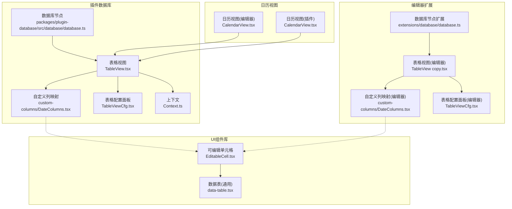
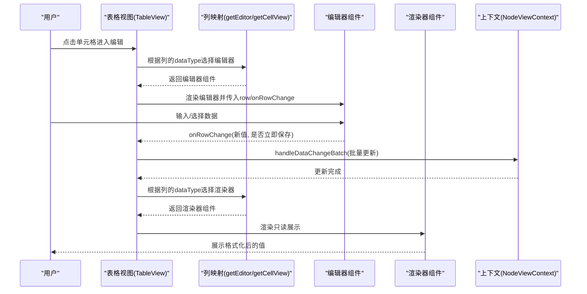
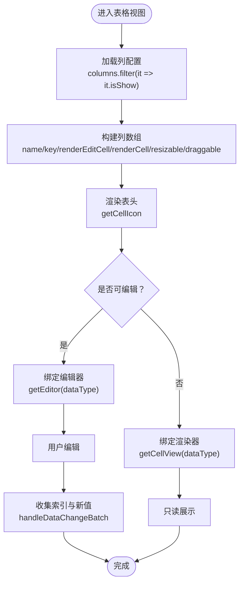
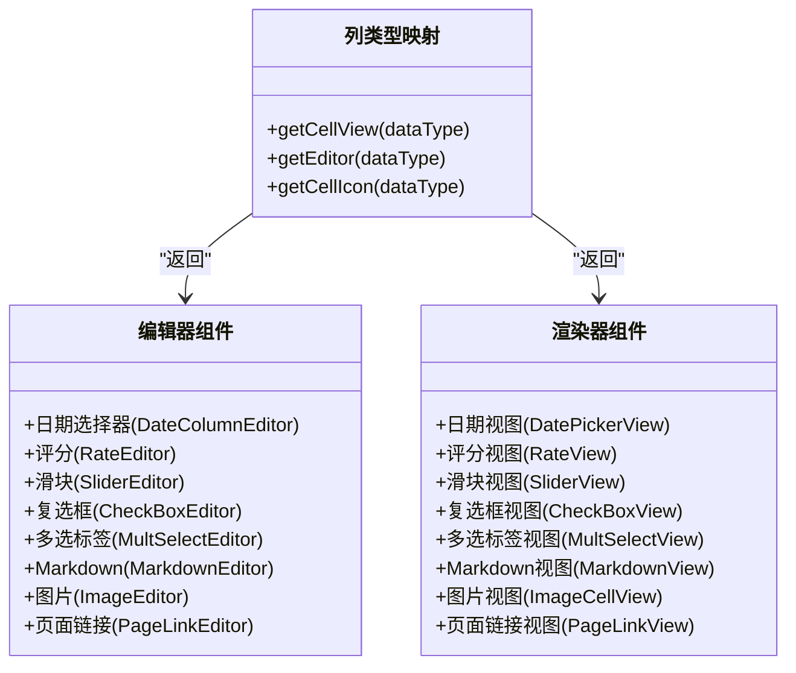
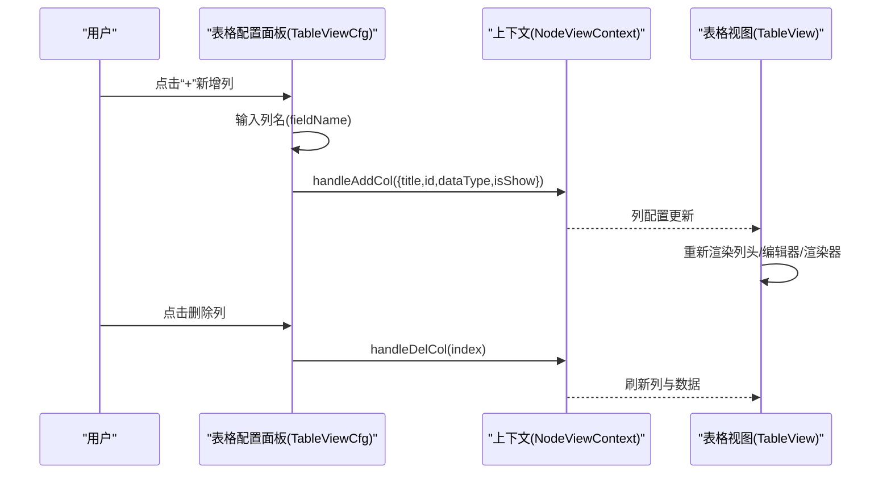
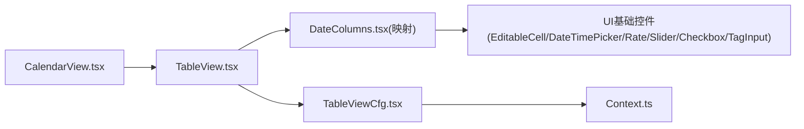

# 自定义列功能

<cite>
**本文引用的文件**
- [packages/plugin-database/src/database/view/TableView.tsx](file://packages/plugin-database/src/database/view/TableView.tsx)
- [packages/plugin-database/src/database/view/custom-columns/DateColumns.tsx](file://packages/plugin-database/src/database/view/custom-columns/DateColumns.tsx)
- [packages/plugin-database/src/database/view/TableViewCfg.tsx](file://packages/plugin-database/src/database/view/TableViewCfg.tsx)
- [packages/plugin-database/src/database/Context.ts](file://packages/plugin-database/src/database/Context.ts)
- [packages/editor/src/extensions/database/view/TableView copy.tsx](file://packages/editor/src/extensions/database/view/TableView copy.tsx)
- [packages/editor/src/extensions/database/view/custom-columns/DateColumns.tsx](file://packages/editor/src/extensions/database/view/custom-columns/DateColumns.tsx)
- [packages/editor/src/extensions/database/view/TableViewCfg.tsx](file://packages/editor/src/extensions/database/view/TableViewCfg.tsx)
- [packages/editor/src/extensions/database/database.ts](file://packages/editor/src/extensions/database/database.ts)
- [packages/plugin-database/src/database/database.ts](file://packages/plugin-database/src/database/database.ts)
- [packages/ui/src/components/DataTable/EditableCell.tsx](file://packages/ui/src/components/DataTable/EditableCell.tsx)
- [packages/ui/src/components/DataTable/data-table.tsx](file://packages/ui/src/components/DataTable/data-table.tsx)
- [packages/editor/src/extensions/database/view/CalendarView.tsx](file://packages/editor/src/extensions/database/view/CalendarView.tsx)
- [packages/plugin-database/src/database/view/CalendarView.tsx](file://packages/plugin-database/src/database/view/CalendarView.tsx)
</cite>

## 目录
1. [简介](#简介)
2. [项目结构](#项目结构)
3. [核心组件](#核心组件)
4. [架构总览](#架构总览)
5. [详细组件分析](#详细组件分析)
6. [依赖关系分析](#依赖关系分析)
7. [性能考量](#性能考量)
8. [故障排查指南](#故障排查指南)
9. [结论](#结论)
10. [附录：开发示例与最佳实践](#附录开发示例与最佳实践)

## 简介
本文件系统性阐述“自定义列功能”的实现与使用，覆盖数据库列类型的扩展机制（如日期列等特殊列类型）、列配置系统（列类型定义、显示格式与数据验证规则）、自定义列的渲染与编辑行为（日期选择器、下拉多选、评分、图片上传等专用控件），并提供可复用的开发示例与性能优化建议。目标读者既包括需要快速上手的使用者，也包括希望扩展或二次开发的工程师。

## 项目结构
自定义列能力在两个包中协同实现：
- 插件数据库（plugin-database）：提供基于 react-data-grid 的表格视图、列类型映射、编辑器与渲染器、列配置面板等。
- 编辑器扩展（editor）：提供基于 glide-data-grid 的表格视图、自定义单元格类型（含日期选择器）、列类型映射与渲染器等。
- UI 组件库（ui）：提供通用的可编辑单元格、日期时间选择器、评分组件等基础控件。
- 日历视图：支持以日历视图绑定列作为开始/结束时间、描述等字段。

图表来源
- [packages/plugin-database/src/database/database.ts](file://packages/plugin-database/src/database/database.ts#L47-L96)
- [packages/editor/src/extensions/database/database.ts](file://packages/editor/src/extensions/database/database.ts#L49-L102)
- [packages/plugin-database/src/database/view/TableView.tsx](file://packages/plugin-database/src/database/view/TableView.tsx#L79-L139)
- [packages/plugin-database/src/database/view/custom-columns/DateColumns.tsx](file://packages/plugin-database/src/database/view/custom-columns/DateColumns.tsx#L280-L347)
- [packages/plugin-database/src/database/view/TableViewCfg.tsx](file://packages/plugin-database/src/database/view/TableViewCfg.tsx#L1-L114)
- [packages/plugin-database/src/database/Context.ts](file://packages/plugin-database/src/database/Context.ts#L1-L18)
- [packages/editor/src/extensions/database/view/TableView copy.tsx](file://packages/editor/src/extensions/database/view/TableView copy.tsx#L123-L153)
- [packages/editor/src/extensions/database/view/custom-columns/DateColumns.tsx](file://packages/editor/src/extensions/database/view/custom-columns/DateColumns.tsx#L266-L331)
- [packages/editor/src/extensions/database/view/TableViewCfg.tsx](file://packages/editor/src/extensions/database/view/TableViewCfg.tsx#L1-L113)
- [packages/ui/src/components/DataTable/EditableCell.tsx](file://packages/ui/src/components/DataTable/EditableCell.tsx#L45-L98)
- [packages/ui/src/components/DataTable/data-table.tsx](file://packages/ui/src/components/DataTable/data-table.tsx#L105-L167)
- [packages/editor/src/extensions/database/view/CalendarView.tsx](file://packages/editor/src/extensions/database/view/CalendarView.tsx#L147-L199)
- [packages/plugin-database/src/database/view/CalendarView.tsx](file://packages/plugin-database/src/database/view/CalendarView.tsx#L116-L181)

章节来源
- [packages/plugin-database/src/database/view/TableView.tsx](file://packages/plugin-database/src/database/view/TableView.tsx#L79-L139)
- [packages/plugin-database/src/database/view/custom-columns/DateColumns.tsx](file://packages/plugin-database/src/database/view/custom-columns/DateColumns.tsx#L280-L347)
- [packages/editor/src/extensions/database/view/TableView copy.tsx](file://packages/editor/src/extensions/database/view/TableView copy.tsx#L123-L153)

## 核心组件
- 表格视图（TableView）
  - 负责渲染列头、列编辑器、列渲染器、行变更批量提交、列宽调整、列重排等。
  - 关键点：通过列配置中的 dataType 动态选择编辑器与渲染器；在行变更时收集索引与新值，批量更新。
- 自定义列映射（getCellView/getEditor/getCellIcon）
  - 将列类型（如日期、评分、滑块、复选框、多选标签、Markdown、图片、页面链接）映射到对应的编辑器与渲染器组件，并提供图标。
- 列配置面板（TableViewCfg）
  - 提供新增列、删除列、过滤、排序、锁定、移除等操作入口，支持从预设列类型集合中添加列。
- 上下文（NodeViewContext）
  - 暴露数据、列定义、增删改列与行、批量更新等方法，供表格视图与配置面板使用。
- 日历视图（CalendarView）
  - 支持将数据库列映射为描述、开始时间、结束时间等字段，便于以日历形式查看与编辑。

章节来源
- [packages/plugin-database/src/database/view/TableView.tsx](file://packages/plugin-database/src/database/view/TableView.tsx#L79-L139)
- [packages/plugin-database/src/database/view/custom-columns/DateColumns.tsx](file://packages/plugin-database/src/database/view/custom-columns/DateColumns.tsx#L280-L347)
- [packages/plugin-database/src/database/view/TableViewCfg.tsx](file://packages/plugin-database/src/database/view/TableViewCfg.tsx#L1-L114)
- [packages/plugin-database/src/database/Context.ts](file://packages/plugin-database/src/database/Context.ts#L1-L18)
- [packages/plugin-database/src/database/view/CalendarView.tsx](file://packages/plugin-database/src/database/view/CalendarView.tsx#L116-L181)

## 架构总览
自定义列功能采用“列类型 → 编辑器/渲染器 → 视图”的分层设计：
- 列类型定义：由列配置提供 dataType 字段，决定该列的编辑与展示方式。
- 映射层：根据 dataType 选择对应编辑器与渲染器；同时提供列图标用于表头显示。
- 视图层：表格视图负责调用映射层，渲染列头、单元格、处理用户交互与批量更新。
- 配置层：提供列的增删、显示控制、视图切换等管理能力。
- 扩展层：日历视图等其他视图可直接消费同一套列配置与数据。

图表来源
- [packages/plugin-database/src/database/view/TableView.tsx](file://packages/plugin-database/src/database/view/TableView.tsx#L79-L139)
- [packages/plugin-database/src/database/view/custom-columns/DateColumns.tsx](file://packages/plugin-database/src/database/view/custom-columns/DateColumns.tsx#L280-L347)
- [packages/plugin-database/src/database/Context.ts](file://packages/plugin-database/src/database/Context.ts#L1-L18)

## 详细组件分析

### 表格视图（TableView）
- 列头渲染：使用 getCellIcon 为每列显示类型图标。
- 编辑器与渲染器：通过 getEditor/getCellView 根据 dataType 动态绑定。
- 行变更：onRowsChange 收集被修改的行索引与新值，转换为 UpdateCellProps 并批量提交。
- 可选功能：底部汇总行、列宽调整、列重排、搜索、新增/删除行等。

图表来源
- [packages/plugin-database/src/database/view/TableView.tsx](file://packages/plugin-database/src/database/view/TableView.tsx#L79-L139)
- [packages/plugin-database/src/database/view/custom-columns/DateColumns.tsx](file://packages/plugin-database/src/database/view/custom-columns/DateColumns.tsx#L280-L347)

章节来源
- [packages/plugin-database/src/database/view/TableView.tsx](file://packages/plugin-database/src/database/view/TableView.tsx#L79-L139)

### 自定义列映射（DateColumns）
- 编辑器映射：针对不同 dataType 返回对应的编辑器组件（如日期选择器、评分、滑块、复选框、多选标签、Markdown、图片、页面链接）。
- 渲染器映射：返回对应的只读渲染组件（如日期格式化、评分只读、滑块只读、复选框只读、多选标签只读、Markdown 预览、图片缩略图、页面链接）。
- 图标映射：为每种列类型提供表头图标，便于识别。

图表来源
- [packages/plugin-database/src/database/view/custom-columns/DateColumns.tsx](file://packages/plugin-database/src/database/view/custom-columns/DateColumns.tsx#L280-L347)
- [packages/editor/src/extensions/database/view/custom-columns/DateColumns.tsx](file://packages/editor/src/extensions/database/view/custom-columns/DateColumns.tsx#L266-L331)

章节来源
- [packages/plugin-database/src/database/view/custom-columns/DateColumns.tsx](file://packages/plugin-database/src/database/view/custom-columns/DateColumns.tsx#L280-L347)
- [packages/editor/src/extensions/database/view/custom-columns/DateColumns.tsx](file://packages/editor/src/extensions/database/view/custom-columns/DateColumns.tsx#L266-L331)

### 列配置系统（TableViewCfg）
- 新增列：从 columnTypes 中选择列类型，输入列名后创建列（包含 title/id/dataType/isShow 等）。
- 删除列：根据索引删除列及其在各行中的单元格。
- 其他：过滤、排序、锁定、移除数据库节点等。

图表来源
- [packages/plugin-database/src/database/view/TableViewCfg.tsx](file://packages/plugin-database/src/database/view/TableViewCfg.tsx#L1-L114)
- [packages/editor/src/extensions/database/view/TableViewCfg.tsx](file://packages/editor/src/extensions/database/view/TableViewCfg.tsx#L1-L113)
- [packages/plugin-database/src/database/view/TableView.tsx](file://packages/plugin-database/src/database/view/TableView.tsx#L79-L139)

章节来源
- [packages/plugin-database/src/database/view/TableViewCfg.tsx](file://packages/plugin-database/src/database/view/TableViewCfg.tsx#L1-L114)
- [packages/editor/src/extensions/database/view/TableViewCfg.tsx](file://packages/editor/src/extensions/database/view/TableViewCfg.tsx#L1-L113)

### 数据验证与格式化
- 日期列：编辑器返回 ISO 时间字符串，渲染器使用本地化格式进行展示。
- 评分列：编辑器支持 0~N 的评分，渲染器为只读展示。
- 多选标签：编辑器支持标签输入与回车确认，渲染器为只读标签列表。
- 图片列：编辑器支持上传与删除，渲染器展示缩略图。
- 文本/Markdown：编辑器支持富文本编辑，渲染器展示标题或预览内容。

章节来源
- [packages/plugin-database/src/database/view/custom-columns/DateColumns.tsx](file://packages/plugin-database/src/database/view/custom-columns/DateColumns.tsx#L1-L194)
- [packages/editor/src/extensions/database/view/custom-columns/DateColumns.tsx](file://packages/editor/src/extensions/database/view/custom-columns/DateColumns.tsx#L1-L213)
- [packages/ui/src/components/DataTable/data-table.tsx](file://packages/ui/src/components/DataTable/data-table.tsx#L105-L167)

### 日历视图集成
- 日历视图通过配置面板选择“描述”、“开始时间”、“结束时间”等列，从而在日历中展示事件。
- 支持在日历视图中对这些列进行字段映射与更新。

章节来源
- [packages/editor/src/extensions/database/view/CalendarView.tsx](file://packages/editor/src/extensions/database/view/CalendarView.tsx#L147-L199)
- [packages/plugin-database/src/database/view/CalendarView.tsx](file://packages/plugin-database/src/database/view/CalendarView.tsx#L116-L181)

## 依赖关系分析
- 表格视图依赖列映射模块，动态选择编辑器与渲染器。
- 列映射模块依赖 UI 组件库中的基础控件（日期时间选择器、评分、滑块、复选框、标签输入、按钮、弹窗等）。
- 配置面板依赖上下文提供的增删改列与行的方法。
- 日历视图与表格视图共享列配置，实现跨视图的数据一致性。

图表来源
- [packages/plugin-database/src/database/view/TableView.tsx](file://packages/plugin-database/src/database/view/TableView.tsx#L79-L139)
- [packages/plugin-database/src/database/view/custom-columns/DateColumns.tsx](file://packages/plugin-database/src/database/view/custom-columns/DateColumns.tsx#L280-L347)
- [packages/plugin-database/src/database/view/TableViewCfg.tsx](file://packages/plugin-database/src/database/view/TableViewCfg.tsx#L1-L114)
- [packages/plugin-database/src/database/Context.ts](file://packages/plugin-database/src/database/Context.ts#L1-L18)
- [packages/plugin-database/src/database/view/CalendarView.tsx](file://packages/plugin-database/src/database/view/CalendarView.tsx#L116-L181)

章节来源
- [packages/plugin-database/src/database/view/TableView.tsx](file://packages/plugin-database/src/database/view/TableView.tsx#L79-L139)
- [packages/plugin-database/src/database/view/custom-columns/DateColumns.tsx](file://packages/plugin-database/src/database/view/custom-columns/DateColumns.tsx#L280-L347)
- [packages/plugin-database/src/database/view/TableViewCfg.tsx](file://packages/plugin-database/src/database/view/TableViewCfg.tsx#L1-L114)
- [packages/plugin-database/src/database/Context.ts](file://packages/plugin-database/src/database/Context.ts#L1-L18)
- [packages/plugin-database/src/database/view/CalendarView.tsx](file://packages/plugin-database/src/database/view/CalendarView.tsx#L116-L181)

## 性能考量
- 批量更新：表格视图在行变更时仅收集受影响的行索引与新值，统一提交，避免逐行触发重渲染。
- 条件渲染：编辑器与渲染器按列类型动态选择，减少不必要的组件实例化。
- 列宽与滚动：固定高度与可选的自动宽度策略，降低大数据量下的布局抖动。
- 只读渲染：对于非编辑列，优先使用只读渲染器，减少交互开销。
- 图片与富文本：图片缩略图与 Markdown 预览按需加载，避免一次性渲染大量内容。

章节来源
- [packages/plugin-database/src/database/view/TableView.tsx](file://packages/plugin-database/src/database/view/TableView.tsx#L122-L134)
- [packages/plugin-database/src/database/view/custom-columns/DateColumns.tsx](file://packages/plugin-database/src/database/view/custom-columns/DateColumns.tsx#L124-L194)

## 故障排查指南
- 新增列不生效
  - 检查列配置是否包含 title/id/dataType/isShow；确认 handleAddCol 调用成功。
  - 章节来源
    - [packages/plugin-database/src/database/view/TableViewCfg.tsx](file://packages/plugin-database/src/database/view/TableViewCfg.tsx#L30-L50)
    - [packages/editor/src/extensions/database/view/TableViewCfg.tsx](file://packages/editor/src/extensions/database/view/TableViewCfg.tsx#L30-L49)
- 删除列后数据错位
  - 确认删除列时同步删除各行对应单元格，并更新列数组索引。
  - 章节来源
    - [packages/editor/src/extensions/database/utils/index.ts](file://packages/editor/src/extensions/database/utils/index.ts#L138-L175)
- 日期列编辑未保存
  - 确认编辑器返回的是 ISO 时间字符串，并在表格视图中正确转换为存储格式。
  - 章节来源
    - [packages/editor/src/extensions/database/view/TableView copy.tsx](file://packages/editor/src/extensions/database/view/TableView copy.tsx#L100-L116)
    - [packages/plugin-database/src/database/view/custom-columns/DateColumns.tsx](file://packages/plugin-database/src/database/view/custom-columns/DateColumns.tsx#L21-L33)
- 评分/滑块编辑无反馈
  - 检查 onRatingChange/onValueCommit 是否触发 onRowChange，并确认 isEditable 状态。
  - 章节来源
    - [packages/plugin-database/src/database/view/custom-columns/DateColumns.tsx](file://packages/plugin-database/src/database/view/custom-columns/DateColumns.tsx#L72-L97)
    - [packages/plugin-database/src/database/view/custom-columns/DateColumns.tsx](file://packages/plugin-database/src/database/view/custom-columns/DateColumns.tsx#L88-L97)

## 结论
自定义列功能通过“列类型 → 编辑器/渲染器 → 视图”的清晰分层，实现了对多种数据类型的统一管理与扩展。借助批量更新、条件渲染与只读优化，系统在可用性与性能之间取得平衡。日历视图与表格视图共享列配置，进一步提升了跨视图的一致性与协作效率。

## 附录：开发示例与最佳实践

### 如何新增一种列类型
- 定义列类型标识
  - 在列配置中新增一个 dataType 值（例如 my-type）。
  - 章节来源
    - [packages/plugin-database/src/database/database.ts](file://packages/plugin-database/src/database/database.ts#L47-L96)
    - [packages/editor/src/extensions/database/database.ts](file://packages/editor/src/extensions/database/database.ts#L49-L102)
- 实现编辑器与渲染器
  - 在映射文件中为该类型提供编辑器与渲染器组件，并注册图标。
  - 章节来源
    - [packages/plugin-database/src/database/view/custom-columns/DateColumns.tsx](file://packages/plugin-database/src/database/view/custom-columns/DateColumns.tsx#L280-L347)
    - [packages/editor/src/extensions/database/view/custom-columns/DateColumns.tsx](file://packages/editor/src/extensions/database/view/custom-columns/DateColumns.tsx#L266-L331)
- 在表格视图中启用
  - 确保 getEditor/getCellView 能够识别新类型并返回对应组件。
  - 章节来源
    - [packages/plugin-database/src/database/view/TableView.tsx](file://packages/plugin-database/src/database/view/TableView.tsx#L79-L116)
- 验证与测试
  - 使用配置面板新增该列，检查编辑器与渲染器表现，确保数据持久化与格式化正确。
  - 章节来源
    - [packages/plugin-database/src/database/view/TableViewCfg.tsx](file://packages/plugin-database/src/database/view/TableViewCfg.tsx#L1-L114)

### 最佳实践
- 列类型命名规范：使用语义化标识符，避免与内置类型冲突。
- 编辑器与渲染器解耦：编辑器负责交互，渲染器负责展示，保持职责单一。
- 数据格式化：编辑器输出标准化格式（如 ISO 时间），渲染器负责本地化展示。
- 用户体验：提供键盘快捷键（回车保存、Esc 取消）、悬浮提示与最小可点击区域。
- 性能优化：大表格场景下启用批量更新、懒加载与只读渲染，避免全量重绘。
- 可访问性：为图标与控件提供替代文案与键盘导航支持。