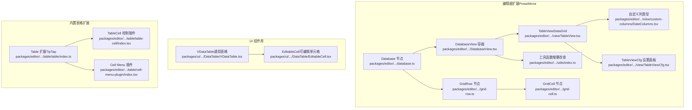
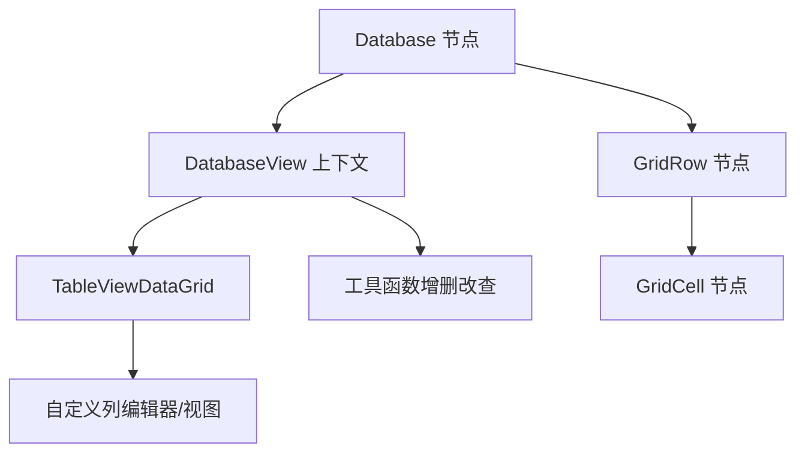
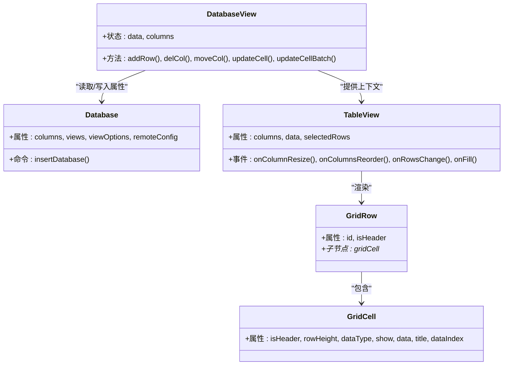
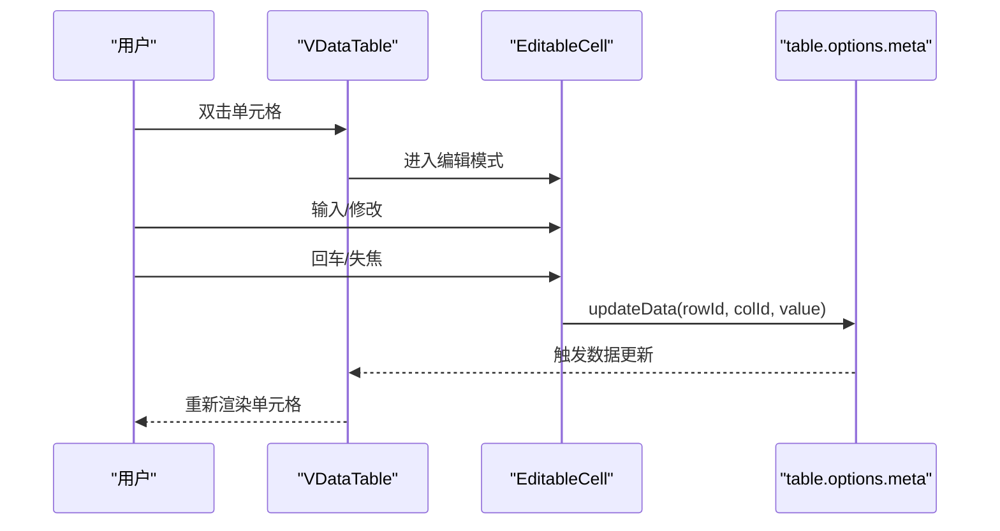
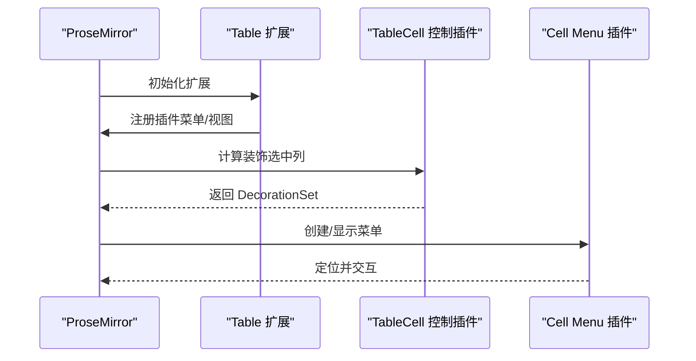
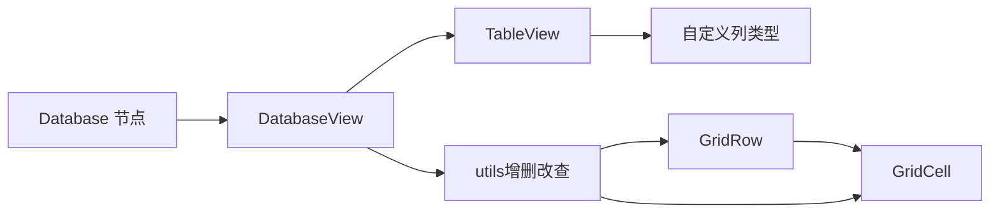

# 表格视图

<cite>
**本文引用的文件**
- [packages/editor/src/extensions/database/view/TableView.tsx](file://packages/editor/src/extensions/database/view/TableView.tsx)
- [packages/editor/src/extensions/database/DatabaseView.tsx](file://packages/editor/src/extensions/database/DatabaseView.tsx)
- [packages/editor/src/extensions/database/view/custom-columns/DateColumns.tsx](file://packages/editor/src/extensions/database/view/custom-columns/DateColumns.tsx)
- [packages/editor/src/extensions/database/view/TableViewCfg.tsx](file://packages/editor/src/extensions/database/view/TableViewCfg.tsx)
- [packages/editor/src/extensions/database/database.ts](file://packages/editor/src/extensions/database/database.ts)
- [packages/editor/src/extensions/database/utils/index.ts](file://packages/editor/src/extensions/database/utils/index.ts)
- [packages/editor/src/extensions/database/grid-cell.ts](file://packages/editor/src/extensions/database/grid-cell.ts)
- [packages/editor/src/extensions/database/grid-row.ts](file://packages/editor/src/extensions/database/grid-row.ts)
- [packages/ui/src/components/DataTable/VDataTable.tsx](file://packages/ui/src/components/DataTable/VDataTable.tsx)
- [packages/ui/src/components/DataTable/EditableCell.tsx](file://packages/ui/src/components/DataTable/EditableCell.tsx)
- [packages/editor/src/extensions/table/table/index.ts](file://packages/editor/src/extensions/table/table/index.ts)
- [packages/editor/src/extensions/table/table-cell/index.tsx](file://packages/editor/src/extensions/table/table-cell/index.tsx)
- [packages/editor/src/extensions/table/cell-menu-plugin/index.tsx](file://packages/editor/src/extensions/table/cell-menu-plugin/index.tsx)
- [packages/editor/src/extensions/dragable/dragable.ts](file://packages/editor/src/extensions/dragable/dragable.ts)
</cite>

## 目录
1. [简介](#简介)
2. [项目结构](#项目结构)
3. [核心组件](#核心组件)
4. [架构总览](#架构总览)
5. [详细组件分析](#详细组件分析)
6. [依赖关系分析](#依赖关系分析)
7. [性能考虑](#性能考虑)
8. [故障排查指南](#故障排查指南)
9. [结论](#结论)
10. [附录](#附录)

## 简介
本文件系统性梳理仓库中的“表格视图”能力，覆盖两大实现路径：基于 ProseMirror 的数据库表格（Database/Table Grid）与基于 UI 组件库的通用数据表格（VDataTable）。内容包括：
- 数据网格组件、行与列的操作机制
- 渲染逻辑、单元格编辑、行选择与拖拽
- 数据模型设计（行/列/单元格结构）、数据绑定与更新
- 使用示例、最佳实践（性能优化、大数据量处理、响应式设计）

## 项目结构
围绕表格视图的关键模块分布如下：
- 编辑器扩展（ProseMirror）：数据库节点、表格视图、自定义列类型、工具函数、行/单元格节点
- UI 组件库：通用数据表格与可编辑单元格
- 表格扩展（内置 TipTap Table）：表格选项、菜单插件、单元格控制装饰

图表来源
- [packages/editor/src/extensions/database/database.ts](file://packages/editor/src/extensions/database/database.ts#L1-L117)
- [packages/editor/src/extensions/database/DatabaseView.tsx](file://packages/editor/src/extensions/database/DatabaseView.tsx#L1-L315)
- [packages/editor/src/extensions/database/view/TableView.tsx](file://packages/editor/src/extensions/database/view/TableView.tsx#L1-L146)
- [packages/editor/src/extensions/database/view/TableViewCfg.tsx](file://packages/editor/src/extensions/database/view/TableViewCfg.tsx#L1-L113)
- [packages/editor/src/extensions/database/view/custom-columns/DateColumns.tsx](file://packages/editor/src/extensions/database/view/custom-columns/DateColumns.tsx#L1-L331)
- [packages/editor/src/extensions/database/utils/index.ts](file://packages/editor/src/extensions/database/utils/index.ts#L85-L343)
- [packages/editor/src/extensions/database/grid-row.ts](file://packages/editor/src/extensions/database/grid-row.ts#L1-L34)
- [packages/editor/src/extensions/database/grid-cell.ts](file://packages/editor/src/extensions/database/grid-cell.ts#L1-L55)
- [packages/ui/src/components/DataTable/VDataTable.tsx](file://packages/ui/src/components/DataTable/VDataTable.tsx#L1-L200)
- [packages/ui/src/components/DataTable/EditableCell.tsx](file://packages/ui/src/components/DataTable/EditableCell.tsx#L1-L43)
- [packages/editor/src/extensions/table/table/index.ts](file://packages/editor/src/extensions/table/table/index.ts#L1-L32)
- [packages/editor/src/extensions/table/table-cell/index.tsx](file://packages/editor/src/extensions/table/table-cell/index.tsx#L91-L108)
- [packages/editor/src/extensions/table/cell-menu-plugin/index.tsx](file://packages/editor/src/extensions/table/cell-menu-plugin/index.tsx#L115-L153)

章节来源
- [packages/editor/src/extensions/database/database.ts](file://packages/editor/src/extensions/database/database.ts#L1-L117)
- [packages/editor/src/extensions/database/DatabaseView.tsx](file://packages/editor/src/extensions/database/DatabaseView.tsx#L1-L315)
- [packages/ui/src/components/DataTable/VDataTable.tsx](file://packages/ui/src/components/DataTable/VDataTable.tsx#L1-L200)

## 核心组件
- 数据库表格（Database/Table Grid）
  - Database 节点：定义表格属性（列配置、视图集合等），提供插入命令
  - DatabaseView：上下文提供者，聚合数据、列配置、增删改查回调
  - TableView：基于 react-data-grid 的渲染层，支持列宽调整、重排、批量更新、行选择、摘要行
  - 自定义列类型：日期、复选框、多选标签、评分、滑条、图片、Markdown、页面链接等编辑器与视图
  - 工具函数：新增/删除行、新增/删除列、移动列、更新单个或批量单元格、定位单元格位置
  - 行/单元格节点：GridRow/GridCell，承载数据与交互
- 通用数据表格（UI 组件）
  - VDataTable：基于 @tanstack/react-table 与 react-virtuoso，提供虚拟滚动、单元格选择、键盘导航
  - EditableCell：可编辑单元格接口与状态切换（查看/编辑）
- 内置表格扩展（TipTap Table）
  - Table 扩展：表格选项与视图替换
  - TableCell 控制插件：为表格单元格添加装饰与交互
  - Cell Menu 插件：弹出菜单与定位

章节来源
- [packages/editor/src/extensions/database/database.ts](file://packages/editor/src/extensions/database/database.ts#L1-L117)
- [packages/editor/src/extensions/database/DatabaseView.tsx](file://packages/editor/src/extensions/database/DatabaseView.tsx#L1-L315)
- [packages/editor/src/extensions/database/view/TableView.tsx](file://packages/editor/src/extensions/database/view/TableView.tsx#L1-L146)
- [packages/editor/src/extensions/database/view/custom-columns/DateColumns.tsx](file://packages/editor/src/extensions/database/view/custom-columns/DateColumns.tsx#L1-L331)
- [packages/editor/src/extensions/database/utils/index.ts](file://packages/editor/src/extensions/database/utils/index.ts#L85-L343)
- [packages/editor/src/extensions/database/grid-row.ts](file://packages/editor/src/extensions/database/grid-row.ts#L1-L34)
- [packages/editor/src/extensions/database/grid-cell.ts](file://packages/editor/src/extensions/database/grid-cell.ts#L1-L55)
- [packages/ui/src/components/DataTable/VDataTable.tsx](file://packages/ui/src/components/DataTable/VDataTable.tsx#L1-L200)
- [packages/ui/src/components/DataTable/EditableCell.tsx](file://packages/ui/src/components/DataTable/EditableCell.tsx#L1-L43)
- [packages/editor/src/extensions/table/table/index.ts](file://packages/editor/src/extensions/table/table/index.ts#L1-L32)
- [packages/editor/src/extensions/table/table-cell/index.tsx](file://packages/editor/src/extensions/table/table-cell/index.tsx#L91-L108)
- [packages/editor/src/extensions/table/cell-menu-plugin/index.tsx](file://packages/editor/src/extensions/table/cell-menu-plugin/index.tsx#L115-L153)

## 架构总览
数据库表格采用“节点树 + 视图容器 + 可编辑网格”的分层架构：
- 节点层：Database/Row/Cell 负责数据与结构
- 容器层：DatabaseView 提供上下文与业务回调
- 视图层：TableView 基于 react-data-grid 渲染，结合自定义列编辑器/视图
- 工具层：统一的增删改查与批量更新 API

图表来源
- [packages/editor/src/extensions/database/database.ts](file://packages/editor/src/extensions/database/database.ts#L1-L117)
- [packages/editor/src/extensions/database/DatabaseView.tsx](file://packages/editor/src/extensions/database/DatabaseView.tsx#L1-L315)
- [packages/editor/src/extensions/database/view/TableView.tsx](file://packages/editor/src/extensions/database/view/TableView.tsx#L1-L146)
- [packages/editor/src/extensions/database/view/custom-columns/DateColumns.tsx](file://packages/editor/src/extensions/database/view/custom-columns/DateColumns.tsx#L1-L331)
- [packages/editor/src/extensions/database/utils/index.ts](file://packages/editor/src/extensions/database/utils/index.ts#L85-L343)
- [packages/editor/src/extensions/database/grid-row.ts](file://packages/editor/src/extensions/database/grid-row.ts#L1-L34)
- [packages/editor/src/extensions/database/grid-cell.ts](file://packages/editor/src/extensions/database/grid-cell.ts#L1-L55)

## 详细组件分析

### 数据库表格（Database/Table Grid）组件分析
- Database 节点
  - 属性：columns、views、viewOptions、remoteConfig
  - 命令：insertDatabase 插入默认表格
- DatabaseView
  - 职责：从节点 JSON 中提取数据；提供增删改查、列移动、列宽更新、批量更新等回调
  - 视图切换：支持 table/chart/calendar 多视图
- TableView
  - 列配置：动态映射 columns，设置 key/name/width/resizable/editable/draggable
  - 渲染：renderCell/renderEditCell/renderHeaderCell
  - 事件：onColumnResize/onColumnsReorder/onRowsChange/onFill/selectedRowsChange
  - 摘要行：底部汇总（仅编辑态）
- 自定义列类型（DateColumns）
  - 编辑器：日期选择器、复选框、多选标签、评分、滑条、图片上传、Markdown 弹窗编辑
  - 视图：只读展示对应组件
- 工具函数（utils）
  - 新增/删除行：addRow/removeRow
  - 新增/删除列：addCol/deleteColV2
  - 移动列：moveCol
  - 更新单元格：updateCellData/updateCellDataV2（单个/批量）
  - 单元格定位：getCellPos
- 行/单元格节点（grid-row/grid-cell）
  - GridRow：可选择、可拖拽，承载多个 GridCell
  - GridCell：承载数据、类型、标题、索引、是否头部等属性

图表来源
- [packages/editor/src/extensions/database/database.ts](file://packages/editor/src/extensions/database/database.ts#L1-L117)
- [packages/editor/src/extensions/database/DatabaseView.tsx](file://packages/editor/src/extensions/database/DatabaseView.tsx#L1-L315)
- [packages/editor/src/extensions/database/view/TableView.tsx](file://packages/editor/src/extensions/database/view/TableView.tsx#L1-L146)
- [packages/editor/src/extensions/database/grid-row.ts](file://packages/editor/src/extensions/database/grid-row.ts#L1-L34)
- [packages/editor/src/extensions/database/grid-cell.ts](file://packages/editor/src/extensions/database/grid-cell.ts#L1-L55)

章节来源
- [packages/editor/src/extensions/database/database.ts](file://packages/editor/src/extensions/database/database.ts#L1-L117)
- [packages/editor/src/extensions/database/DatabaseView.tsx](file://packages/editor/src/extensions/database/DatabaseView.tsx#L1-L315)
- [packages/editor/src/extensions/database/view/TableView.tsx](file://packages/editor/src/extensions/database/view/TableView.tsx#L1-L146)
- [packages/editor/src/extensions/database/view/custom-columns/DateColumns.tsx](file://packages/editor/src/extensions/database/view/custom-columns/DateColumns.tsx#L1-L331)
- [packages/editor/src/extensions/database/utils/index.ts](file://packages/editor/src/extensions/database/utils/index.ts#L85-L343)
- [packages/editor/src/extensions/database/grid-row.ts](file://packages/editor/src/extensions/database/grid-row.ts#L1-L34)
- [packages/editor/src/extensions/database/grid-cell.ts](file://packages/editor/src/extensions/database/grid-cell.ts#L1-L55)

### 通用数据表格（VDataTable）组件分析
- VDataTable
  - 基于 @tanstack/react-table 与 react-virtuoso，提供虚拟滚动与高性能渲染
  - 支持单元格选择、键盘导航、范围高亮
  - 通过 meta.updateData 接口与外部数据源联动
- EditableCell
  - 提供双击进入编辑、输入变更、回车确认、失焦取消等流程
  - 通过 table.options.meta.updateData 回传值到上层

图表来源
- [packages/ui/src/components/DataTable/VDataTable.tsx](file://packages/ui/src/components/DataTable/VDataTable.tsx#L1-L200)
- [packages/ui/src/components/DataTable/EditableCell.tsx](file://packages/ui/src/components/DataTable/EditableCell.tsx#L1-L43)

章节来源
- [packages/ui/src/components/DataTable/VDataTable.tsx](file://packages/ui/src/components/DataTable/VDataTable.tsx#L1-L200)
- [packages/ui/src/components/DataTable/EditableCell.tsx](file://packages/ui/src/components/DataTable/EditableCell.tsx#L1-L43)

### 内置表格扩展（TipTap Table）分析
- Table 扩展
  - 替换 View 为自定义 TableView
  - 启用 TableCellMenuPlugin
- TableCell 控制插件
  - 在可编辑状态下为选中列添加装饰与回调清理
- Cell Menu 插件
  - 动态创建菜单容器，根据选区定位并显示

图表来源
- [packages/editor/src/extensions/table/table/index.ts](file://packages/editor/src/extensions/table/table/index.ts#L1-L32)
- [packages/editor/src/extensions/table/table-cell/index.tsx](file://packages/editor/src/extensions/table/table-cell/index.tsx#L91-L108)
- [packages/editor/src/extensions/table/cell-menu-plugin/index.tsx](file://packages/editor/src/extensions/table/cell-menu-plugin/index.tsx#L115-L153)

章节来源
- [packages/editor/src/extensions/table/table/index.ts](file://packages/editor/src/extensions/table/table/index.ts#L1-L32)
- [packages/editor/src/extensions/table/table-cell/index.tsx](file://packages/editor/src/extensions/table/table-cell/index.tsx#L91-L108)
- [packages/editor/src/extensions/table/cell-menu-plugin/index.tsx](file://packages/editor/src/extensions/table/cell-menu-plugin/index.tsx#L115-L153)

## 依赖关系分析
- DatabaseView 作为上下文提供者，向下传递 data/columns 与各类操作回调
- TableView 依赖自定义列编辑器/视图，通过 columns 映射渲染
- 工具函数封装对 ProseMirror Transaction 的操作，保证节点树一致性
- VDataTable 与 EditableCell 解耦于编辑器，适合通用场景

图表来源
- [packages/editor/src/extensions/database/DatabaseView.tsx](file://packages/editor/src/extensions/database/DatabaseView.tsx#L1-L315)
- [packages/editor/src/extensions/database/view/TableView.tsx](file://packages/editor/src/extensions/database/view/TableView.tsx#L1-L146)
- [packages/editor/src/extensions/database/view/custom-columns/DateColumns.tsx](file://packages/editor/src/extensions/database/view/custom-columns/DateColumns.tsx#L1-L331)
- [packages/editor/src/extensions/database/utils/index.ts](file://packages/editor/src/extensions/database/utils/index.ts#L85-L343)
- [packages/editor/src/extensions/database/database.ts](file://packages/editor/src/extensions/database/database.ts#L1-L117)
- [packages/editor/src/extensions/database/grid-row.ts](file://packages/editor/src/extensions/database/grid-row.ts#L1-L34)
- [packages/editor/src/extensions/database/grid-cell.ts](file://packages/editor/src/extensions/database/grid-cell.ts#L1-L55)

章节来源
- [packages/editor/src/extensions/database/DatabaseView.tsx](file://packages/editor/src/extensions/database/DatabaseView.tsx#L1-L315)
- [packages/editor/src/extensions/database/view/TableView.tsx](file://packages/editor/src/extensions/database/view/TableView.tsx#L1-L146)
- [packages/editor/src/extensions/database/utils/index.ts](file://packages/editor/src/extensions/database/utils/index.ts#L85-L343)

## 性能考虑
- 虚拟滚动
  - VDataTable 使用 react-virtuoso，仅渲染可视区域行，适合大数据量
  - TableView 通过 DataGrid 的虚拟化能力提升渲染性能
- 批量更新
  - updateCellDataV2 支持批量更新，减少多次事务开销
- 列宽与重排
  - onColumnResize 仅更新节点属性，避免全量重绘
  - onColumnsReorder 通过 moveCol 与列交换，降低 DOM 重排成本
- 选择与拖拽
  - DatabaseView 的 selectedRows 仅维护键集合，行选择成本低
  - Dragable 插件仅在可编辑块级节点显示拖拽手柄，避免全局监听

章节来源
- [packages/ui/src/components/DataTable/VDataTable.tsx](file://packages/ui/src/components/DataTable/VDataTable.tsx#L1-L200)
- [packages/editor/src/extensions/database/view/TableView.tsx](file://packages/editor/src/extensions/database/view/TableView.tsx#L1-L146)
- [packages/editor/src/extensions/database/utils/index.ts](file://packages/editor/src/extensions/database/utils/index.ts#L317-L331)
- [packages/editor/src/extensions/dragable/dragable.ts](file://packages/editor/src/extensions/dragable/dragable.ts#L1-L341)

## 故障排查指南
- 单元格更新未生效
  - 检查 onRowsChange 是否触发 handleDataChangeBatch
  - 确认 updateCellDataV2 的 colIndex/rowIndex 与数据索引一致
  - 参考路径：[packages/editor/src/extensions/database/view/TableView.tsx](file://packages/editor/src/extensions/database/view/TableView.tsx#L120-L139)，[packages/editor/src/extensions/database/utils/index.ts](file://packages/editor/src/extensions/database/utils/index.ts#L317-L331)
- 列宽调整无效
  - 确认 onColumnResize 是否更新 node.attrs.columns
  - 参考路径：[packages/editor/src/extensions/database/view/TableView.tsx](file://packages/editor/src/extensions/database/view/TableView.tsx#L57-L63)
- 行选择后删除按钮不出现
  - 检查 selectedRows 是否被正确更新
  - 参考路径：[packages/editor/src/extensions/database/view/TableView.tsx](file://packages/editor/src/extensions/database/view/TableView.tsx#L84-L93)
- 自定义列编辑器不显示
  - 确认 columns.dataType 与 getEditor/getCellView 匹配
  - 参考路径：[packages/editor/src/extensions/database/view/custom-columns/DateColumns.tsx](file://packages/editor/src/extensions/database/view/custom-columns/DateColumns.tsx#L266-L331)
- 通用表格编辑无响应
  - 确认 meta.updateData 是否实现并回写数据
  - 参考路径：[packages/ui/src/components/DataTable/VDataTable.tsx](file://packages/ui/src/components/DataTable/VDataTable.tsx#L40-L70)，[packages/ui/src/components/DataTable/EditableCell.tsx](file://packages/ui/src/components/DataTable/EditableCell.tsx#L19-L43)

章节来源
- [packages/editor/src/extensions/database/view/TableView.tsx](file://packages/editor/src/extensions/database/view/TableView.tsx#L57-L63)
- [packages/editor/src/extensions/database/view/TableView.tsx](file://packages/editor/src/extensions/database/view/TableView.tsx#L84-L93)
- [packages/editor/src/extensions/database/view/TableView.tsx](file://packages/editor/src/extensions/database/view/TableView.tsx#L120-L139)
- [packages/editor/src/extensions/database/utils/index.ts](file://packages/editor/src/extensions/database/utils/index.ts#L317-L331)
- [packages/editor/src/extensions/database/view/custom-columns/DateColumns.tsx](file://packages/editor/src/extensions/database/view/custom-columns/DateColumns.tsx#L266-L331)
- [packages/ui/src/components/DataTable/VDataTable.tsx](file://packages/ui/src/components/DataTable/VDataTable.tsx#L40-L70)
- [packages/ui/src/components/DataTable/EditableCell.tsx](file://packages/ui/src/components/DataTable/EditableCell.tsx#L19-L43)

## 结论
仓库提供了两条成熟的表格实现路径：
- 数据库表格（Database/Table Grid）：面向富文本编辑场景，具备丰富的列类型、批量更新、行选择与设置面板，适合知识库/数据库视图
- 通用数据表格（VDataTable）：面向纯数据场景，具备虚拟滚动、单元格选择与编辑接口，适合报表/数据面板

两者在数据模型、渲染与交互上各有侧重，可根据业务场景灵活选择与组合。

## 附录
- 使用示例（概念性说明）
  - 创建数据库表格：调用 insertDatabase 命令，生成默认列与行
  - 添加/删除列：通过 TableViewCfg 或 DatabaseView 的 handleAddCol/handleDelCol
  - 批量更新：在 onRowsChange 中收集 indexes 并调用 handleDataChangeBatch
  - 通用表格编辑：在 VDataTable 的 meta.updateData 中回写数据
- 最佳实践
  - 大数据量优先使用虚拟滚动（VDataTable/TableView）
  - 尽量使用批量更新 API（updateCellDataV2）减少事务次数
  - 自定义列编辑器应保持受控组件与即时提交策略
  - 对可拖拽列与行，确保唯一标识（dataIndex/id）稳定