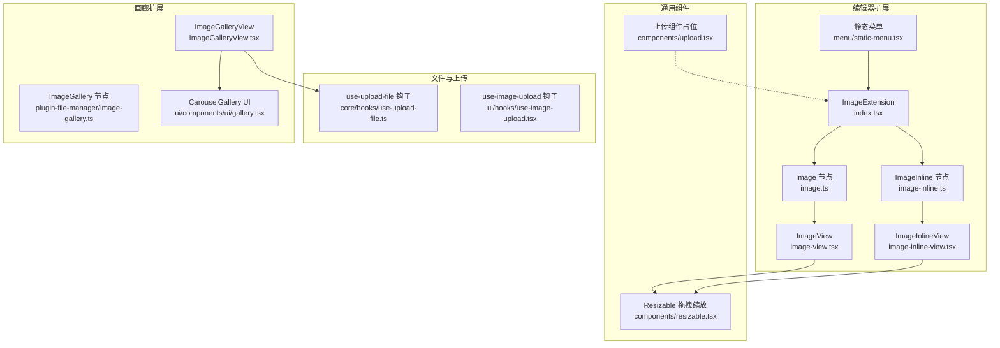
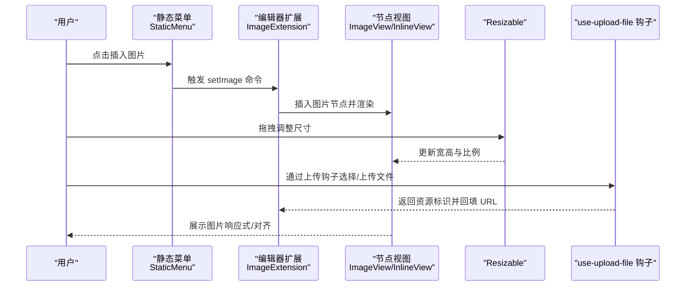
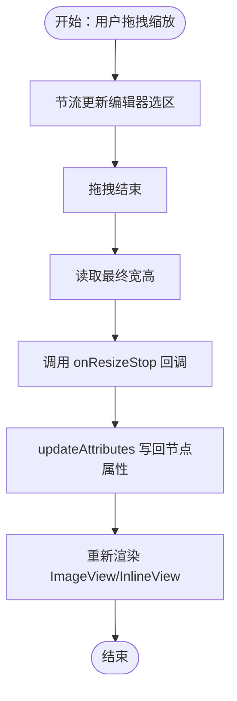
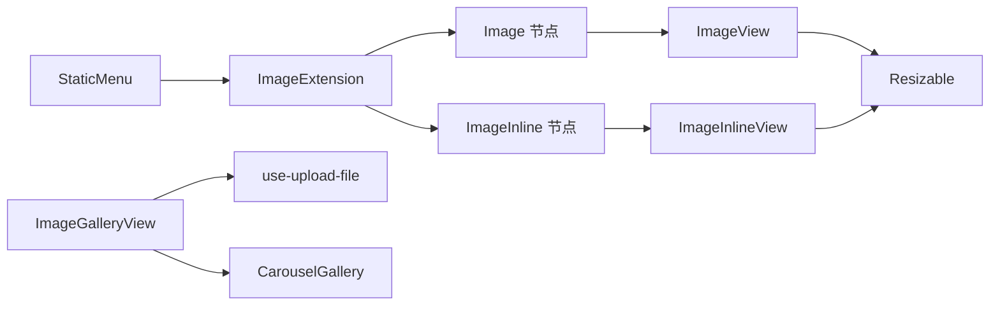

# 图片管理

<cite>
**本文引用的文件**
- [packages/editor/src/extensions/image/index.tsx](file://packages/editor/src/extensions/image/index.tsx)
- [packages/editor/src/extensions/image/image.ts](file://packages/editor/src/extensions/image/image.ts)
- [packages/editor/src/extensions/image/image-inline.ts](file://packages/editor/src/extensions/image/image-inline.ts)
- [packages/editor/src/extensions/image/image-view.tsx](file://packages/editor/src/extensions/image/image-view.tsx)
- [packages/editor/src/extensions/image/image-inline-view.tsx](file://packages/editor/src/extensions/image/image-inline-view.tsx)
- [packages/editor/src/extensions/image/menu/static-menu.tsx](file://packages/editor/src/extensions/image/menu/static-menu.tsx)
- [packages/editor/src/components/resizable.tsx](file://packages/editor/src/components/resizable.tsx)
- [packages/editor/src/components/upload.tsx](file://packages/editor/src/components/upload.tsx)
- [packages/core/src/hooks/use-upload-file.ts](file://packages/core/src/hooks/use-upload-file.ts)
- [packages/ui/src/hooks/use-image-upload.tsx](file://packages/ui/src/hooks/use-image-upload.tsx)
- [packages/plugin-file-manager/src/editor-extensions/image/image.ts](file://packages/plugin-file-manager/src/editor-extensions/image/image.ts)
- [packages/plugin-file-manager/src/editor-extensions/image/image-gallery/image-gallery.ts](file://packages/plugin-file-manager/src/editor-extensions/image/image-gallery/image-gallery.ts)
- [packages/plugin-file-manager/src/editor-extensions/image/image-gallery/ImageGalleryView.tsx](file://packages/plugin-file-manager/src/editor-extensions/image/image-gallery/ImageGalleryView.tsx)
- [packages/ui/src/components/ui/gallery.tsx](file://packages/ui/src/components/ui/gallery.tsx)
</cite>

## 目录
1. [简介](#简介)
2. [项目结构](#项目结构)
3. [核心组件](#核心组件)
4. [架构总览](#架构总览)
5. [详细组件分析](#详细组件分析)
6. [依赖关系分析](#依赖关系分析)
7. [性能与优化](#性能与优化)
8. [故障排查指南](#故障排查指南)
9. [结论](#结论)
10. [附录：使用示例与最佳实践](#附录使用示例与最佳实践)

## 简介
本文件系统性梳理仓库中的图片管理能力，覆盖编辑器扩展层（ImageExtension、ImageView、ImageInlineView）、上传与文件管理、画廊展示、响应式与缩放、权限与CDN集成建议以及性能优化策略。文档以“可读性强、循序渐进”的方式组织，既适合开发者深入理解实现细节，也便于非技术读者快速掌握使用方法。

## 项目结构
图片管理功能主要分布在以下模块：
- 编辑器扩展：定义块级与行内图片节点、渲染视图、菜单与输入规则
- 可调整组件：封装拖拽缩放、宽高同步与比例锁定
- 上传与文件管理：统一的文件上传钩子与UI交互
- 画廊扩展：基于节点视图的多图展示与批量上传
- UI 组件：轮播画廊、缩略图上传等

图表来源
- [packages/editor/src/extensions/image/index.tsx](file://packages/editor/src/extensions/image/index.tsx#L1-L29)
- [packages/editor/src/extensions/image/image.ts](file://packages/editor/src/extensions/image/image.ts#L1-L120)
- [packages/editor/src/extensions/image/image-inline.ts](file://packages/editor/src/extensions/image/image-inline.ts#L1-L121)
- [packages/editor/src/extensions/image/image-view.tsx](file://packages/editor/src/extensions/image/image-view.tsx#L1-L49)
- [packages/editor/src/extensions/image/image-inline-view.tsx](file://packages/editor/src/extensions/image/image-inline-view.tsx#L1-L50)
- [packages/editor/src/extensions/image/menu/static-menu.tsx](file://packages/editor/src/extensions/image/menu/static-menu.tsx#L1-L32)
- [packages/editor/src/components/resizable.tsx](file://packages/editor/src/components/resizable.tsx#L1-L84)
- [packages/editor/src/components/upload.tsx](file://packages/editor/src/components/upload.tsx#L1-L31)
- [packages/core/src/hooks/use-upload-file.ts](file://packages/core/src/hooks/use-upload-file.ts#L1-L59)
- [packages/ui/src/hooks/use-image-upload.tsx](file://packages/ui/src/hooks/use-image-upload.tsx#L1-L59)
- [packages/plugin-file-manager/src/editor-extensions/image/image-gallery/image-gallery.ts](file://packages/plugin-file-manager/src/editor-extensions/image/image-gallery/image-gallery.ts#L1-L37)
- [packages/plugin-file-manager/src/editor-extensions/image/image-gallery/ImageGalleryView.tsx](file://packages/plugin-file-manager/src/editor-extensions/image/image-gallery/ImageGalleryView.tsx#L1-L41)
- [packages/ui/src/components/ui/gallery.tsx](file://packages/ui/src/components/ui/gallery.tsx#L1-L62)

章节来源
- [packages/editor/src/extensions/image/index.tsx](file://packages/editor/src/extensions/image/index.tsx#L1-L29)
- [packages/editor/src/extensions/image/image.ts](file://packages/editor/src/extensions/image/image.ts#L1-L120)
- [packages/editor/src/extensions/image/image-inline.ts](file://packages/editor/src/extensions/image/image-inline.ts#L1-L121)
- [packages/editor/src/extensions/image/image-view.tsx](file://packages/editor/src/extensions/image/image-view.tsx#L1-L49)
- [packages/editor/src/extensions/image/image-inline-view.tsx](file://packages/editor/src/extensions/image/image-inline-view.tsx#L1-L50)
- [packages/editor/src/extensions/image/menu/static-menu.tsx](file://packages/editor/src/extensions/image/menu/static-menu.tsx#L1-L32)
- [packages/editor/src/components/resizable.tsx](file://packages/editor/src/components/resizable.tsx#L1-L84)
- [packages/editor/src/components/upload.tsx](file://packages/editor/src/components/upload.tsx#L1-L31)
- [packages/core/src/hooks/use-upload-file.ts](file://packages/core/src/hooks/use-upload-file.ts#L1-L59)
- [packages/ui/src/hooks/use-image-upload.tsx](file://packages/ui/src/hooks/use-image-upload.tsx#L1-L59)
- [packages/plugin-file-manager/src/editor-extensions/image/image-gallery/image-gallery.ts](file://packages/plugin-file-manager/src/editor-extensions/image/image-gallery/image-gallery.ts#L1-L37)
- [packages/plugin-file-manager/src/editor-extensions/image/image-gallery/ImageGalleryView.tsx](file://packages/plugin-file-manager/src/editor-extensions/image/image-gallery/ImageGalleryView.tsx#L1-L41)
- [packages/ui/src/components/ui/gallery.tsx](file://packages/ui/src/components/ui/gallery.tsx#L1-L62)

## 核心组件
- ImageExtension：导出扩展名、扩展节点集合、气泡菜单与静态菜单配置，以及斜杠命令入口
- Image 与 ImageInline：分别定义块级与行内图片节点，含属性、输入规则、命令与节点视图
- ImageView 与 ImageInlineView：负责渲染 img 标签、对齐、拖拽缩放与尺寸更新
- Resizable：封装拖拽缩放、节流更新、比例锁定与最小宽度约束
- StaticMenu：提供图片插入按钮与占位上传逻辑
- use-upload-file：浏览器文件选择、上传、路径拼接与状态管理
- use-image-upload：本地预览、移除与回调
- ImageGallery 与 ImageGalleryView：多图节点与画廊视图，支持批量上传与 CDN 路径
- CarouselGallery：轮播与键盘导航的画廊 UI

章节来源
- [packages/editor/src/extensions/image/index.tsx](file://packages/editor/src/extensions/image/index.tsx#L1-L29)
- [packages/editor/src/extensions/image/image.ts](file://packages/editor/src/extensions/image/image.ts#L1-L120)
- [packages/editor/src/extensions/image/image-inline.ts](file://packages/editor/src/extensions/image/image-inline.ts#L1-L121)
- [packages/editor/src/extensions/image/image-view.tsx](file://packages/editor/src/extensions/image/image-view.tsx#L1-L49)
- [packages/editor/src/extensions/image/image-inline-view.tsx](file://packages/editor/src/extensions/image/image-inline-view.tsx#L1-L50)
- [packages/editor/src/components/resizable.tsx](file://packages/editor/src/components/resizable.tsx#L1-L84)
- [packages/editor/src/extensions/image/menu/static-menu.tsx](file://packages/editor/src/extensions/image/menu/static-menu.tsx#L1-L32)
- [packages/core/src/hooks/use-upload-file.ts](file://packages/core/src/hooks/use-upload-file.ts#L1-L59)
- [packages/ui/src/hooks/use-image-upload.tsx](file://packages/ui/src/hooks/use-image-upload.tsx#L1-L59)
- [packages/plugin-file-manager/src/editor-extensions/image/image-gallery/image-gallery.ts](file://packages/plugin-file-manager/src/editor-extensions/image/image-gallery/image-gallery.ts#L1-L37)
- [packages/plugin-file-manager/src/editor-extensions/image/image-gallery/ImageGalleryView.tsx](file://packages/plugin-file-manager/src/editor-extensions/image/image-gallery/ImageGalleryView.tsx#L1-L41)
- [packages/ui/src/components/ui/gallery.tsx](file://packages/ui/src/components/ui/gallery.tsx#L1-L62)

## 架构总览
下图展示了从用户操作到图片渲染与上传的整体流程，涵盖块级/行内图片、拖拽缩放、画廊与上传钩子之间的协作关系。

图表来源
- [packages/editor/src/extensions/image/menu/static-menu.tsx](file://packages/editor/src/extensions/image/menu/static-menu.tsx#L1-L32)
- [packages/editor/src/extensions/image/index.tsx](file://packages/editor/src/extensions/image/index.tsx#L1-L29)
- [packages/editor/src/extensions/image/image-view.tsx](file://packages/editor/src/extensions/image/image-view.tsx#L1-L49)
- [packages/editor/src/extensions/image/image-inline-view.tsx](file://packages/editor/src/extensions/image/image-inline-view.tsx#L1-L50)
- [packages/editor/src/components/resizable.tsx](file://packages/editor/src/components/resizable.tsx#L1-L84)
- [packages/core/src/hooks/use-upload-file.ts](file://packages/core/src/hooks/use-upload-file.ts#L1-L59)

## 详细组件分析

### ImageExtension 类与菜单
- 扩展注册：导出扩展名、扩展节点数组、气泡菜单与静态菜单配置
- 斜杠命令：提供“图片”快捷入口，便于快速插入
- 静态菜单：提供按钮切换与占位上传逻辑，便于后续接入真实上传流程

章节来源
- [packages/editor/src/extensions/image/index.tsx](file://packages/editor/src/extensions/image/index.tsx#L1-L29)
- [packages/editor/src/extensions/image/menu/static-menu.tsx](file://packages/editor/src/extensions/image/menu/static-menu.tsx#L1-L32)

### Image 与 ImageInline 节点
- 节点属性：包含 src、alt、title、width、height、aspectRatio、align 等
- 输入规则：支持 Markdown 风格的图片语法解析
- 命令：提供 setImage 命令用于插入或更新图片
- 节点视图：分别绑定块级与行内视图，实现可拖拽与可选中

章节来源
- [packages/editor/src/extensions/image/image.ts](file://packages/editor/src/extensions/image/image.ts#L1-L120)
- [packages/editor/src/extensions/image/image-inline.ts](file://packages/editor/src/extensions/image/image-inline.ts#L1-L121)

### ImageView 与 ImageInlineView 渲染
- 对齐逻辑：根据 align 计算居中/右对齐的布局
- 尺寸更新：通过 onResizeStop 回调写回宽高
- 比例保持：结合 Resizable 的比例锁定实现等比缩放
- 行内/块级差异：通过 NodeViewWrapper 的标签类型区分

章节来源
- [packages/editor/src/extensions/image/image-view.tsx](file://packages/editor/src/extensions/image/image-view.tsx#L1-L49)
- [packages/editor/src/extensions/image/image-inline-view.tsx](file://packages/editor/src/extensions/image/image-inline-view.tsx#L1-L50)

### Resizable 拖拽缩放
- 节流更新：在拖拽过程中节流触发编辑器选区更新，避免频繁重绘
- 比例锁定：支持按比例锁定宽高，保证图片不被拉变形
- 最小宽度：可配置最小宽度，防止过小导致不可见
- 与节点视图联动：将最终宽高回传给节点属性

章节来源
- [packages/editor/src/components/resizable.tsx](file://packages/editor/src/components/resizable.tsx#L1-L84)

### 上传与文件管理
- use-upload-file：封装文件选择、上传、下载路径拼接与状态维护
- use-image-upload：提供本地预览、移除与回调，适配缩略图上传场景
- 上传组件占位：提供基础 UI 结构，便于后续接入真实上传逻辑

章节来源
- [packages/core/src/hooks/use-upload-file.ts](file://packages/core/src/hooks/use-upload-file.ts#L1-L59)
- [packages/ui/src/hooks/use-image-upload.tsx](file://packages/ui/src/hooks/use-image-upload.tsx#L1-L59)
- [packages/editor/src/components/upload.tsx](file://packages/editor/src/components/upload.tsx#L1-L31)

### 画廊扩展（ImageGallery）
- 节点定义：支持 images 数组属性，提供插入画廊命令
- 视图实现：首次无图片时展示文件上传器；已有图片时展示轮播画廊
- 批量上传：支持多文件上传并回填 CDN 路径
- 与 UI 协作：结合 CarouselGallery 实现自动播放、键盘导航与添加按钮

章节来源
- [packages/plugin-file-manager/src/editor-extensions/image/image-gallery/image-gallery.ts](file://packages/plugin-file-manager/src/editor-extensions/image/image-gallery/image-gallery.ts#L1-L37)
- [packages/plugin-file-manager/src/editor-extensions/image/image-gallery/ImageGalleryView.tsx](file://packages/plugin-file-manager/src/editor-extensions/image/image-gallery/ImageGalleryView.tsx#L1-L41)
- [packages/ui/src/components/ui/gallery.tsx](file://packages/ui/src/components/ui/gallery.tsx#L1-L62)

### 处理流程图：拖拽缩放与尺寸更新

图表来源
- [packages/editor/src/components/resizable.tsx](file://packages/editor/src/components/resizable.tsx#L1-L84)
- [packages/editor/src/extensions/image/image-view.tsx](file://packages/editor/src/extensions/image/image-view.tsx#L1-L49)
- [packages/editor/src/extensions/image/image-inline-view.tsx](file://packages/editor/src/extensions/image/image-inline-view.tsx#L1-L50)

## 依赖关系分析
- ImageExtension 依赖 Image 与 ImageInline 节点及菜单
- ImageView/InlineView 依赖 Resizable 进行尺寸调整
- ImageGalleryView 依赖 use-upload-file 与 CarouselGallery
- use-upload-file 依赖 useApi 与后端接口常量
- 静态菜单与扩展入口耦合度低，便于替换上传实现

图表来源
- [packages/editor/src/extensions/image/index.tsx](file://packages/editor/src/extensions/image/index.tsx#L1-L29)
- [packages/editor/src/extensions/image/image.ts](file://packages/editor/src/extensions/image/image.ts#L1-L120)
- [packages/editor/src/extensions/image/image-inline.ts](file://packages/editor/src/extensions/image/image-inline.ts#L1-L121)
- [packages/editor/src/extensions/image/image-view.tsx](file://packages/editor/src/extensions/image/image-view.tsx#L1-L49)
- [packages/editor/src/extensions/image/image-inline-view.tsx](file://packages/editor/src/extensions/image/image-inline-view.tsx#L1-L50)
- [packages/editor/src/components/resizable.tsx](file://packages/editor/src/components/resizable.tsx#L1-L84)
- [packages/plugin-file-manager/src/editor-extensions/image/image-gallery/ImageGalleryView.tsx](file://packages/plugin-file-manager/src/editor-extensions/image/image-gallery/ImageGalleryView.tsx#L1-L41)
- [packages/ui/src/components/ui/gallery.tsx](file://packages/ui/src/components/ui/gallery.tsx#L1-L62)
- [packages/core/src/hooks/use-upload-file.ts](file://packages/core/src/hooks/use-upload-file.ts#L1-L59)
- [packages/editor/src/extensions/image/menu/static-menu.tsx](file://packages/editor/src/extensions/image/menu/static-menu.tsx#L1-L32)

## 性能与优化
- 拖拽节流：Resizable 使用节流减少频繁的编辑器事务与重绘
- 比例锁定：避免无效计算，提升缩放体验
- 最小宽度：防止过小导致的布局抖动
- 画廊自动播放：可按需关闭自动播放，降低 CPU 占用
- 上传路径：统一使用 CDN 路径，减少跨域与二次处理开销
- 建议：对大图采用懒加载与响应式尺寸策略，结合 CDN 自适应参数

[本节为通用性能建议，无需特定文件引用]

## 故障排查指南
- 图片未显示
  - 检查节点属性是否包含有效 src
  - 确认 Resizable 是否正确回写宽高
- 拖拽无效
  - 确认编辑器处于可编辑状态
  - 检查 onResizeStop 回调是否被调用
- 上传失败
  - 核对 use-upload-file 的上传接口与 MIME 类型
  - 确认 CDN 下载路径可用
- 画廊不更新
  - 确认 updateAttributes 是否写回 images 列表
  - 检查 CDN 路径是否正确拼接

章节来源
- [packages/editor/src/components/resizable.tsx](file://packages/editor/src/components/resizable.tsx#L1-L84)
- [packages/core/src/hooks/use-upload-file.ts](file://packages/core/src/hooks/use-upload-file.ts#L1-L59)
- [packages/plugin-file-manager/src/editor-extensions/image/image-gallery/ImageGalleryView.tsx](file://packages/plugin-file-manager/src/editor-extensions/image/image-gallery/ImageGalleryView.tsx#L1-L41)

## 结论
该图片管理方案以 Tiptap 节点为核心，结合自研 Resizable 组件与上传钩子，实现了从插入、编辑到展示的完整闭环。块级/行内两种模式满足不同排版需求；画廊扩展支持批量上传与轮播展示；通过 CDN 与懒加载策略可进一步提升性能与用户体验。

[本节为总结性内容，无需特定文件引用]

## 附录：使用示例与最佳实践

### 在编辑器中插入图片（Markdown 语法）
- 支持 Markdown 风格的图片语法，编辑器会自动解析并插入图片节点
- 示例路径参考：[packages/editor/src/extensions/image/image.ts](file://packages/editor/src/extensions/image/image.ts#L90-L102)

章节来源
- [packages/editor/src/extensions/image/image.ts](file://packages/editor/src/extensions/image/image.ts#L90-L102)

### 拖拽插入与尺寸调整
- 通过 ImageView/InlineView 的 Resizable 组件进行拖拽缩放
- 宽高变更通过 onResizeStop 回调写回节点属性
- 示例路径参考：
  - [packages/editor/src/extensions/image/image-view.tsx](file://packages/editor/src/extensions/image/image-view.tsx#L1-L49)
  - [packages/editor/src/extensions/image/image-inline-view.tsx](file://packages/editor/src/extensions/image/image-inline-view.tsx#L1-L50)
  - [packages/editor/src/components/resizable.tsx](file://packages/editor/src/components/resizable.tsx#L1-L84)

章节来源
- [packages/editor/src/extensions/image/image-view.tsx](file://packages/editor/src/extensions/image/image-view.tsx#L1-L49)
- [packages/editor/src/extensions/image/image-inline-view.tsx](file://packages/editor/src/extensions/image/image-inline-view.tsx#L1-L50)
- [packages/editor/src/components/resizable.tsx](file://packages/editor/src/components/resizable.tsx#L1-L84)

### 批量上传与画廊展示
- 使用 ImageGalleryView 启动文件上传器，支持多文件上传
- 上传完成后回填 CDN 路径至 images 列表，自动渲染轮播画廊
- 示例路径参考：
  - [packages/plugin-file-manager/src/editor-extensions/image/image-gallery/ImageGalleryView.tsx](file://packages/plugin-file-manager/src/editor-extensions/image/image-gallery/ImageGalleryView.tsx#L1-L41)
  - [packages/ui/src/components/ui/gallery.tsx](file://packages/ui/src/components/ui/gallery.tsx#L1-L62)
  - [packages/core/src/hooks/use-upload-file.ts](file://packages/core/src/hooks/use-upload-file.ts#L1-L59)

章节来源
- [packages/plugin-file-manager/src/editor-extensions/image/image-gallery/ImageGalleryView.tsx](file://packages/plugin-file-manager/src/editor-extensions/image/image-gallery/ImageGalleryView.tsx#L1-L41)
- [packages/ui/src/components/ui/gallery.tsx](file://packages/ui/src/components/ui/gallery.tsx#L1-L62)
- [packages/core/src/hooks/use-upload-file.ts](file://packages/core/src/hooks/use-upload-file.ts#L1-L59)

### 缩略图生成与响应式显示
- use-image-upload 提供本地预览与移除能力，便于上传前预览
- ImageView/InlineView 默认使用 100% 宽度，配合 Resizable 实现响应式
- 示例路径参考：
  - [packages/ui/src/hooks/use-image-upload.tsx](file://packages/ui/src/hooks/use-image-upload.tsx#L1-L59)
  - [packages/editor/src/extensions/image/image-view.tsx](file://packages/editor/src/extensions/image/image-view.tsx#L1-L49)
  - [packages/editor/src/extensions/image/image-inline-view.tsx](file://packages/editor/src/extensions/image/image-inline-view.tsx#L1-L50)

章节来源
- [packages/ui/src/hooks/use-image-upload.tsx](file://packages/ui/src/hooks/use-image-upload.tsx#L1-L59)
- [packages/editor/src/extensions/image/image-view.tsx](file://packages/editor/src/extensions/image/image-view.tsx#L1-L49)
- [packages/editor/src/extensions/image/image-inline-view.tsx](file://packages/editor/src/extensions/image/image-inline-view.tsx#L1-L50)

### 权限控制与 CDN 集成建议
- 权限控制：在 use-upload-file 中对接鉴权头与访问控制策略
- CDN 集成：统一使用 CDN 下载路径，确保跨域与缓存策略一致
- 压缩与尺寸：在上传前或服务端进行压缩与尺寸裁剪，减少带宽占用
- 懒加载：在 ImageView/InlineView 中启用懒加载属性，提升首屏性能

章节来源
- [packages/core/src/hooks/use-upload-file.ts](file://packages/core/src/hooks/use-upload-file.ts#L1-L59)
- [packages/editor/src/extensions/image/image-view.tsx](file://packages/editor/src/extensions/image/image-view.tsx#L1-L49)
- [packages/editor/src/extensions/image/image-inline-view.tsx](file://packages/editor/src/extensions/image/image-inline-view.tsx#L1-L50)