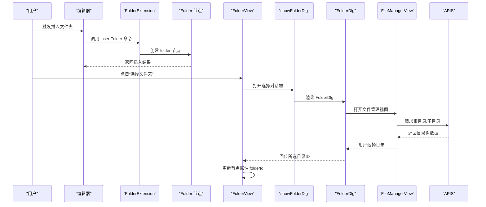
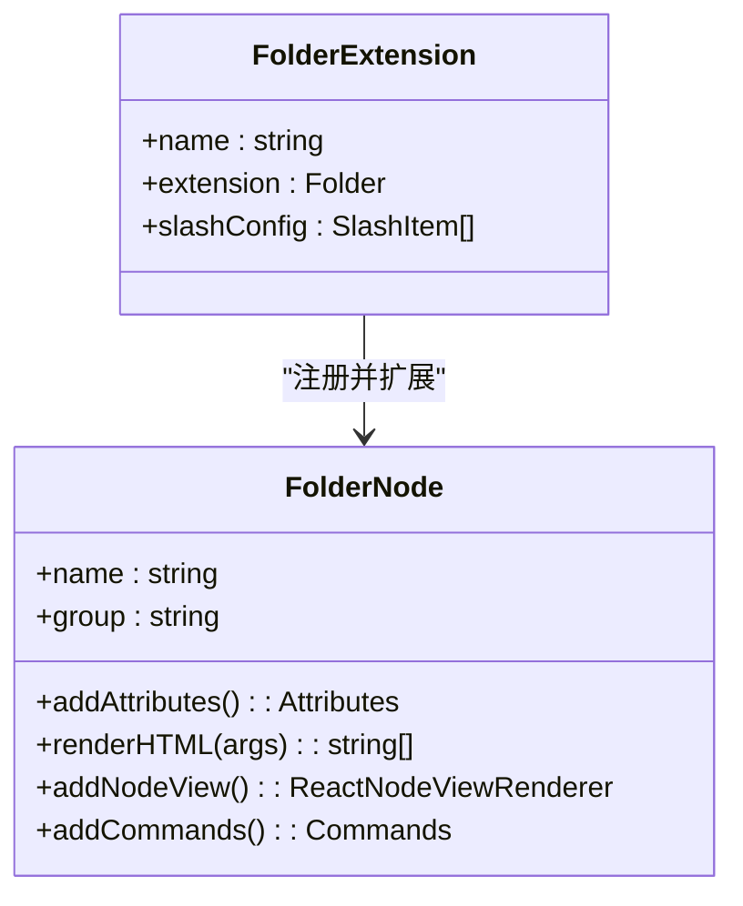
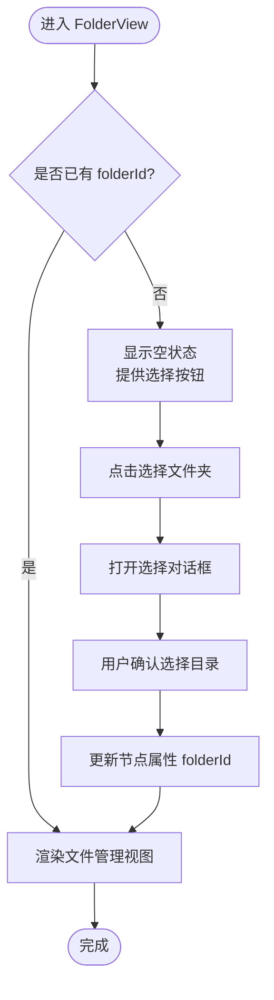
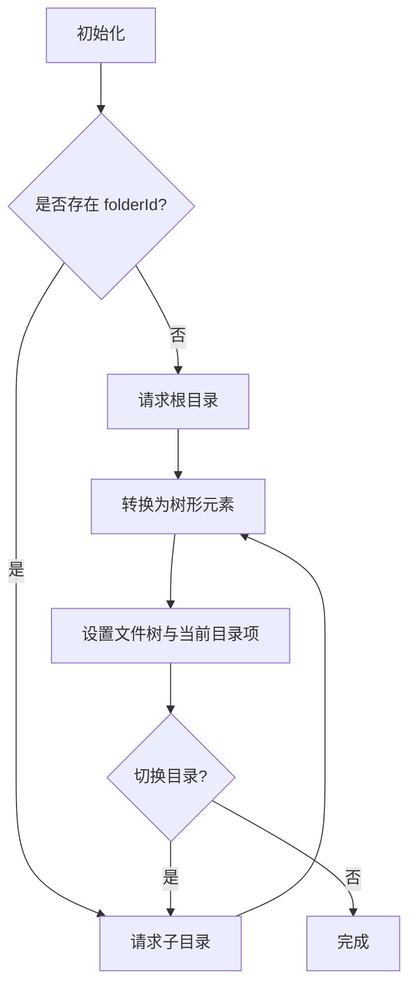
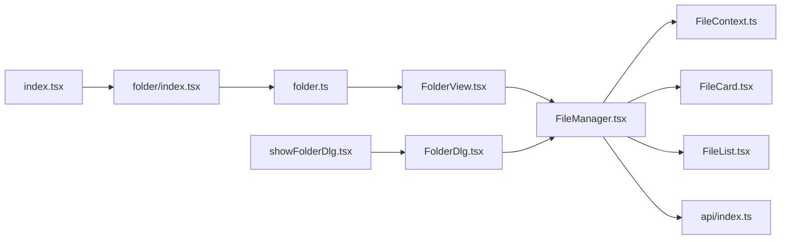

# 文件夹管理

<cite>
**本文引用的文件**
- [packages/plugin-file-manager/src/index.tsx](file://packages/plugin-file-manager/src/index.tsx)
- [packages/plugin-file-manager/src/editor-extensions/folder/index.tsx](file://packages/plugin-file-manager/src/editor-extensions/folder/index.tsx)
- [packages/plugin-file-manager/src/editor-extensions/folder/folder.ts](file://packages/plugin-file-manager/src/editor-extensions/folder/folder.ts)
- [packages/plugin-file-manager/src/editor-extensions/folder/FolderView.tsx](file://packages/plugin-file-manager/src/editor-extensions/folder/FolderView.tsx)
- [packages/plugin-file-manager/src/editor-extensions/utils/showFolderDlg.tsx](file://packages/plugin-file-manager/src/editor-extensions/utils/showFolderDlg.tsx)
- [packages/plugin-file-manager/src/editor-extensions/component/FileManager.tsx](file://packages/plugin-file-manager/src/editor-extensions/component/FileManager.tsx)
- [packages/plugin-file-manager/src/editor-extensions/component/FileContext.ts](file://packages/plugin-file-manager/src/editor-extensions/component/FileContext.ts)
- [packages/plugin-file-manager/src/editor-extensions/component/FileCard.tsx](file://packages/plugin-file-manager/src/editor-extensions/component/FileCard.tsx)
- [packages/plugin-file-manager/src/editor-extensions/component/FileList.tsx](file://packages/plugin-file-manager/src/editor-extensions/component/FileList.tsx)
- [packages/plugin-file-manager/src/editor-extensions/component/FolderDlg.tsx](file://packages/plugin-file-manager/src/editor-extensions/component/FolderDlg.tsx)
- [packages/plugin-file-manager/src/api/index.ts](file://packages/plugin-file-manager/src/api/index.ts)
</cite>

## 目录
1. [简介](#简介)
2. [项目结构](#项目结构)
3. [核心组件](#核心组件)
4. [架构总览](#架构总览)
5. [详细组件分析](#详细组件分析)
6. [依赖关系分析](#依赖关系分析)
7. [性能考虑](#性能考虑)
8. [故障排查指南](#故障排查指南)
9. [结论](#结论)
10. [附录](#附录)

## 简介
本文件围绕“文件夹管理”功能进行系统化技术文档整理，重点覆盖以下方面：
- 文件夹扩展的实现原理：FolderExtension 类的设计思路与 Folder 节点的定义
- FolderView 组件的渲染与交互：如何在编辑器中插入并选择文件夹节点，以及与文件管理视图的联动
- 文件夹 CRUD 操作：创建、删除、重命名、移动（基于现有 API 的使用方式）
- 文件夹树形结构构建：从根目录到子目录的数据加载与树形菜单渲染
- 权限与嵌套处理：当前实现对只读状态的处理与嵌套层级的递归映射
- 编辑器集成示例：如何在编辑器中插入文件夹节点并打开选择对话框
- 搜索、排序、过滤：当前实现中的搜索输入占位与后续可扩展方向
- 后端存储交互：通过统一 API 定义访问后端服务

## 项目结构
文件夹管理功能位于插件包 plugin-file-manager 中，主要由以下层次构成：
- 插件入口与注册：在插件入口中注册文件夹扩展与图片扩展，并挂载路由与菜单
- 编辑器扩展层：定义 Folder 扩展节点、命令与视图渲染
- 文件管理 UI 层：提供文件管理视图、卡片列表、上下文状态、对话框等
- API 层：集中定义与后端交互的接口常量

```mermaid
graph TB
subgraph "插件入口"
P["plugin-file-manager/src/index.tsx"]
end
subgraph "编辑器扩展"
FE["editor-extensions/folder/index.tsx"]
FN["editor-extensions/folder/folder.ts"]
FV["editor-extensions/folder/FolderView.tsx"]
SD["editor-extensions/utils/showFolderDlg.tsx"]
end
subgraph "文件管理UI"
FM["editor-extensions/component/FileManager.tsx"]
FC["editor-extensions/component/FileContext.ts"]
FCL["editor-extensions/component/FileCard.tsx"]
FL["editor-extensions/component/FileList.tsx"]
FD["editor-extensions/component/FolderDlg.tsx"]
end
subgraph "API"
API["api/index.ts"]
end
P --> FE
FE --> FN
FN --> FV
SD --> FD
FV --> FM
FM --> FC
FM --> FCL
FM --> FL
FM --> API
```

**图表来源**
- [packages/plugin-file-manager/src/index.tsx](file://packages/plugin-file-manager/src/index.tsx#L1-L38)
- [packages/plugin-file-manager/src/editor-extensions/folder/index.tsx](file://packages/plugin-file-manager/src/editor-extensions/folder/index.tsx#L1-L28)
- [packages/plugin-file-manager/src/editor-extensions/folder/folder.ts](file://packages/plugin-file-manager/src/editor-extensions/folder/folder.ts#L1-L34)
- [packages/plugin-file-manager/src/editor-extensions/folder/FolderView.tsx](file://packages/plugin-file-manager/src/editor-extensions/folder/FolderView.tsx#L1-L52)
- [packages/plugin-file-manager/src/editor-extensions/utils/showFolderDlg.tsx](file://packages/plugin-file-manager/src/editor-extensions/utils/showFolderDlg.tsx#L1-L22)
- [packages/plugin-file-manager/src/editor-extensions/component/FileManager.tsx](file://packages/plugin-file-manager/src/editor-extensions/component/FileManager.tsx#L1-L327)
- [packages/plugin-file-manager/src/editor-extensions/component/FileContext.ts](file://packages/plugin-file-manager/src/editor-extensions/component/FileContext.ts#L1-L28)
- [packages/plugin-file-manager/src/editor-extensions/component/FileCard.tsx](file://packages/plugin-file-manager/src/editor-extensions/component/FileCard.tsx#L1-L93)
- [packages/plugin-file-manager/src/editor-extensions/component/FileList.tsx](file://packages/plugin-file-manager/src/editor-extensions/component/FileList.tsx#L1-L35)
- [packages/plugin-file-manager/src/editor-extensions/component/FolderDlg.tsx](file://packages/plugin-file-manager/src/editor-extensions/component/FolderDlg.tsx#L1-L23)
- [packages/plugin-file-manager/src/api/index.ts](file://packages/plugin-file-manager/src/api/index.ts#L1-L27)

**章节来源**
- [packages/plugin-file-manager/src/index.tsx](file://packages/plugin-file-manager/src/index.tsx#L1-L38)
- [packages/plugin-file-manager/src/editor-extensions/folder/index.tsx](file://packages/plugin-file-manager/src/editor-extensions/folder/index.tsx#L1-L28)
- [packages/plugin-file-manager/src/editor-extensions/folder/folder.ts](file://packages/plugin-file-manager/src/editor-extensions/folder/folder.ts#L1-L34)
- [packages/plugin-file-manager/src/editor-extensions/folder/FolderView.tsx](file://packages/plugin-file-manager/src/editor-extensions/folder/FolderView.tsx#L1-L52)
- [packages/plugin-file-manager/src/editor-extensions/utils/showFolderDlg.tsx](file://packages/plugin-file-manager/src/editor-extensions/utils/showFolderDlg.tsx#L1-L22)
- [packages/plugin-file-manager/src/editor-extensions/component/FileManager.tsx](file://packages/plugin-file-manager/src/editor-extensions/component/FileManager.tsx#L1-L327)
- [packages/plugin-file-manager/src/editor-extensions/component/FileContext.ts](file://packages/plugin-file-manager/src/editor-extensions/component/FileContext.ts#L1-L28)
- [packages/plugin-file-manager/src/editor-extensions/component/FileCard.tsx](file://packages/plugin-file-manager/src/editor-extensions/component/FileCard.tsx#L1-L93)
- [packages/plugin-file-manager/src/editor-extensions/component/FileList.tsx](file://packages/plugin-file-manager/src/editor-extensions/component/FileList.tsx#L1-L35)
- [packages/plugin-file-manager/src/editor-extensions/component/FolderDlg.tsx](file://packages/plugin-file-manager/src/editor-extensions/component/FolderDlg.tsx#L1-L23)
- [packages/plugin-file-manager/src/api/index.ts](file://packages/plugin-file-manager/src/api/index.ts#L1-L27)

## 核心组件
- 插件入口与注册
  - 在插件入口中注册文件夹扩展与图片扩展，并配置路由与菜单项，使用户可在编辑器中通过菜单或斜杠命令插入文件夹节点。
  - 参考路径：[packages/plugin-file-manager/src/index.tsx](file://packages/plugin-file-manager/src/index.tsx#L1-L38)

- 文件夹扩展（FolderExtension）
  - 定义扩展名称、扩展对象（Folder 节点）以及斜杠菜单项，支持通过“/folder”快速插入文件夹节点。
  - 参考路径：[packages/plugin-file-manager/src/editor-extensions/folder/index.tsx](file://packages/plugin-file-manager/src/editor-extensions/folder/index.tsx#L1-L28)

- Folder 节点定义
  - 定义节点类型为块级元素，声明属性（如 folderId），提供 HTML 渲染与 React 视图渲染器绑定，以及插入命令。
  - 参考路径：[packages/plugin-file-manager/src/editor-extensions/folder/folder.ts](file://packages/plugin-file-manager/src/editor-extensions/folder/folder.ts#L1-L34)

- FolderView 视图组件
  - 当节点未选择文件夹时显示空状态；当已选择时渲染文件管理视图；支持在可编辑状态下弹出选择对话框以设置 folderId。
  - 参考路径：[packages/plugin-file-manager/src/editor-extensions/folder/FolderView.tsx](file://packages/plugin-file-manager/src/editor-extensions/folder/FolderView.tsx#L1-L52)

- 文件管理视图（FileManagerView）
  - 提供导航、上传、删除、下载、列表/网格切换、树形目录浏览、文件卡片展示等功能；通过 API 获取根目录与子目录数据，支持选择确认回调。
  - 参考路径：[packages/plugin-file-manager/src/editor-extensions/component/FileManager.tsx](file://packages/plugin-file-manager/src/editor-extensions/component/FileManager.tsx#L1-L327)

- 上下文与状态（FileManageContext）
  - 定义文件管理所需的状态与方法，包括当前选中文件、当前目录 ID、当前目录项、仓库键、上传与删除操作等。
  - 参考路径：[packages/plugin-file-manager/src/editor-extensions/component/FileContext.ts](file://packages/plugin-file-manager/src/editor-extensions/component/FileContext.ts#L1-L28)

- 文件卡片与列表
  - FileCard 用于展示单个文件/文件夹卡片，支持多选、双击进入目录、右键选择等交互；FileList 用于表格视图。
  - 参考路径：[packages/plugin-file-manager/src/editor-extensions/component/FileCard.tsx](file://packages/plugin-file-manager/src/editor-extensions/component/FileCard.tsx#L1-L93)
  - 参考路径：[packages/plugin-file-manager/src/editor-extensions/component/FileList.tsx](file://packages/plugin-file-manager/src/editor-extensions/component/FileList.tsx#L1-L35)

- 对话框（FolderDlg）
  - 封装文件管理视图的对话框容器，便于在编辑器中以弹窗形式选择文件夹。
  - 参考路径：[packages/plugin-file-manager/src/editor-extensions/component/FolderDlg.tsx](file://packages/plugin-file-manager/src/editor-extensions/component/FolderDlg.tsx#L1-L23)

- API 接口定义
  - 统一定义获取根目录、获取子目录、上传文件、创建文件/文件夹等接口常量，供文件管理视图调用。
  - 参考路径：[packages/plugin-file-manager/src/api/index.ts](file://packages/plugin-file-manager/src/api/index.ts#L1-L27)

**章节来源**
- [packages/plugin-file-manager/src/index.tsx](file://packages/plugin-file-manager/src/index.tsx#L1-L38)
- [packages/plugin-file-manager/src/editor-extensions/folder/index.tsx](file://packages/plugin-file-manager/src/editor-extensions/folder/index.tsx#L1-L28)
- [packages/plugin-file-manager/src/editor-extensions/folder/folder.ts](file://packages/plugin-file-manager/src/editor-extensions/folder/folder.ts#L1-L34)
- [packages/plugin-file-manager/src/editor-extensions/folder/FolderView.tsx](file://packages/plugin-file-manager/src/editor-extensions/folder/FolderView.tsx#L1-L52)
- [packages/plugin-file-manager/src/editor-extensions/component/FileManager.tsx](file://packages/plugin-file-manager/src/editor-extensions/component/FileManager.tsx#L1-L327)
- [packages/plugin-file-manager/src/editor-extensions/component/FileContext.ts](file://packages/plugin-file-manager/src/editor-extensions/component/FileContext.ts#L1-L28)
- [packages/plugin-file-manager/src/editor-extensions/component/FileCard.tsx](file://packages/plugin-file-manager/src/editor-extensions/component/FileCard.tsx#L1-L93)
- [packages/plugin-file-manager/src/editor-extensions/component/FileList.tsx](file://packages/plugin-file-manager/src/editor-extensions/component/FileList.tsx#L1-L35)
- [packages/plugin-file-manager/src/editor-extensions/component/FolderDlg.tsx](file://packages/plugin-file-manager/src/editor-extensions/component/FolderDlg.tsx#L1-L23)
- [packages/plugin-file-manager/src/api/index.ts](file://packages/plugin-file-manager/src/api/index.ts#L1-L27)

## 架构总览
文件夹管理的整体架构由“编辑器扩展 + 文件管理 UI + API 层”组成，编辑器通过扩展节点插入文件夹占位，用户通过 UI 选择具体目录，最终将目录 ID 写入节点属性。



**图表来源**
- [packages/plugin-file-manager/src/editor-extensions/folder/index.tsx](file://packages/plugin-file-manager/src/editor-extensions/folder/index.tsx#L1-L28)
- [packages/plugin-file-manager/src/editor-extensions/folder/folder.ts](file://packages/plugin-file-manager/src/editor-extensions/folder/folder.ts#L1-L34)
- [packages/plugin-file-manager/src/editor-extensions/folder/FolderView.tsx](file://packages/plugin-file-manager/src/editor-extensions/folder/FolderView.tsx#L1-L52)
- [packages/plugin-file-manager/src/editor-extensions/utils/showFolderDlg.tsx](file://packages/plugin-file-manager/src/editor-extensions/utils/showFolderDlg.tsx#L1-L22)
- [packages/plugin-file-manager/src/editor-extensions/component/FolderDlg.tsx](file://packages/plugin-file-manager/src/editor-extensions/component/FolderDlg.tsx#L1-L23)
- [packages/plugin-file-manager/src/editor-extensions/component/FileManager.tsx](file://packages/plugin-file-manager/src/editor-extensions/component/FileManager.tsx#L1-L327)
- [packages/plugin-file-manager/src/api/index.ts](file://packages/plugin-file-manager/src/api/index.ts#L1-L27)

## 详细组件分析

### FolderExtension 设计与 Folder 节点
- 设计要点
  - 扩展名称与扩展对象分离，便于在编辑器中注册与识别
  - 斜杠菜单项提供快捷插入能力，提升编辑效率
  - 节点属性包含 folderId，作为与后端目录关联的标识
- 关键实现位置
  - 扩展注册与斜杠菜单：[packages/plugin-file-manager/src/editor-extensions/folder/index.tsx](file://packages/plugin-file-manager/src/editor-extensions/folder/index.tsx#L1-L28)
  - 节点定义与命令：[packages/plugin-file-manager/src/editor-extensions/folder/folder.ts](file://packages/plugin-file-manager/src/editor-extensions/folder/folder.ts#L1-L34)



**图表来源**
- [packages/plugin-file-manager/src/editor-extensions/folder/index.tsx](file://packages/plugin-file-manager/src/editor-extensions/folder/index.tsx#L1-L28)
- [packages/plugin-file-manager/src/editor-extensions/folder/folder.ts](file://packages/plugin-file-manager/src/editor-extensions/folder/folder.ts#L1-L34)

**章节来源**
- [packages/plugin-file-manager/src/editor-extensions/folder/index.tsx](file://packages/plugin-file-manager/src/editor-extensions/folder/index.tsx#L1-L28)
- [packages/plugin-file-manager/src/editor-extensions/folder/folder.ts](file://packages/plugin-file-manager/src/editor-extensions/folder/folder.ts#L1-L34)

### FolderView 渲染逻辑与交互
- 渲染策略
  - 若未设置 folderId：显示空状态并提供“选择文件夹”按钮
  - 已设置 folderId：渲染文件管理视图，展示该目录下的内容
- 交互流程
  - 可编辑状态下打开模态对话框选择目录，确认后更新节点属性
  - 不可编辑状态下隐藏操作按钮，仅展示内容
- 关键实现位置
  - 视图组件与属性更新：[packages/plugin-file-manager/src/editor-extensions/folder/FolderView.tsx](file://packages/plugin-file-manager/src/editor-extensions/folder/FolderView.tsx#L1-L52)



**图表来源**
- [packages/plugin-file-manager/src/editor-extensions/folder/FolderView.tsx](file://packages/plugin-file-manager/src/editor-extensions/folder/FolderView.tsx#L1-L52)

**章节来源**
- [packages/plugin-file-manager/src/editor-extensions/folder/FolderView.tsx](file://packages/plugin-file-manager/src/editor-extensions/folder/FolderView.tsx#L1-L52)

### 文件夹树形结构构建算法
- 数据来源
  - 首次加载：若未指定 folderId，则请求根目录；否则请求指定目录的子目录
  - 切换目录：点击树节点或卡片双击进入目录时，更新当前目录 ID 并重新拉取子项
- 结构转换
  - 将后端返回的树形数据转换为前端可用的树形元素数组，支持递归映射 children 字段
- 关键实现位置
  - 根目录与子目录加载、树形元素转换：[packages/plugin-file-manager/src/editor-extensions/component/FileManager.tsx](file://packages/plugin-file-manager/src/editor-extensions/component/FileManager.tsx#L1-L327)



**图表来源**
- [packages/plugin-file-manager/src/editor-extensions/component/FileManager.tsx](file://packages/plugin-file-manager/src/editor-extensions/component/FileManager.tsx#L1-L327)

**章节来源**
- [packages/plugin-file-manager/src/editor-extensions/component/FileManager.tsx](file://packages/plugin-file-manager/src/editor-extensions/component/FileManager.tsx#L1-L327)

### 文件夹 CRUD 操作实现机制
- 创建
  - 上传文件：通过上传工具获取临时文件信息，随后调用创建接口创建文件
  - 创建目录：直接调用创建接口创建目录
  - 关键实现位置：[packages/plugin-file-manager/src/editor-extensions/component/FileManager.tsx](file://packages/plugin-file-manager/src/editor-extensions/component/FileManager.tsx#L1-L327)
- 删除
  - 当前实现中删除函数为空，需结合后端接口完善
  - 关键实现位置：[packages/plugin-file-manager/src/editor-extensions/component/FileManager.tsx](file://packages/plugin-file-manager/src/editor-extensions/component/FileManager.tsx#L1-L327)
- 重命名与移动
  - 当前未见对应接口调用，需在 API 层补充并接入 UI

提示：以上操作均通过统一 API 定义进行调用，便于替换与扩展。

**章节来源**
- [packages/plugin-file-manager/src/editor-extensions/component/FileManager.tsx](file://packages/plugin-file-manager/src/editor-extensions/component/FileManager.tsx#L1-L327)
- [packages/plugin-file-manager/src/api/index.ts](file://packages/plugin-file-manager/src/api/index.ts#L1-L27)

### 权限控制与嵌套处理
- 权限控制
  - 通过编辑器只读状态决定是否显示操作按钮；不可编辑时仅展示内容
  - 关键实现位置：[packages/plugin-file-manager/src/editor-extensions/folder/FolderView.tsx](file://packages/plugin-file-manager/src/editor-extensions/folder/FolderView.tsx#L1-L52)
- 嵌套处理
  - 树形元素转换时递归处理 children 字段，支持任意层级嵌套
  - 关键实现位置：[packages/plugin-file-manager/src/editor-extensions/component/FileManager.tsx](file://packages/plugin-file-manager/src/editor-extensions/component/FileManager.tsx#L1-L327)

**章节来源**
- [packages/plugin-file-manager/src/editor-extensions/folder/FolderView.tsx](file://packages/plugin-file-manager/src/editor-extensions/folder/FolderView.tsx#L1-L52)
- [packages/plugin-file-manager/src/editor-extensions/component/FileManager.tsx](file://packages/plugin-file-manager/src/editor-extensions/component/FileManager.tsx#L1-L327)

### 编辑器集成示例
- 在编辑器中插入文件夹节点
  - 通过斜杠菜单触发“/folder”，或在插件入口中注册命令后调用
  - 关键实现位置：[packages/plugin-file-manager/src/editor-extensions/folder/index.tsx](file://packages/plugin-file-manager/src/editor-extensions/folder/index.tsx#L1-L28)
- 打开选择对话框
  - 使用工具函数在编辑器中渲染对话框组件，传入可选参数与回调
  - 关键实现位置：[packages/plugin-file-manager/src/editor-extensions/utils/showFolderDlg.tsx](file://packages/plugin-file-manager/src/editor-extensions/utils/showFolderDlg.tsx#L1-L22)

**章节来源**
- [packages/plugin-file-manager/src/editor-extensions/folder/index.tsx](file://packages/plugin-file-manager/src/editor-extensions/folder/index.tsx#L1-L28)
- [packages/plugin-file-manager/src/editor-extensions/utils/showFolderDlg.tsx](file://packages/plugin-file-manager/src/editor-extensions/utils/showFolderDlg.tsx#L1-L22)

### 搜索、排序与过滤
- 搜索
  - 导航区域包含搜索输入框占位，当前未绑定实际搜索逻辑，可扩展为树形菜单过滤或文件列表过滤
  - 关键实现位置：[packages/plugin-file-manager/src/editor-extensions/component/FileManager.tsx](file://packages/plugin-file-manager/src/editor-extensions/component/FileManager.tsx#L1-L327)
- 排序与过滤
  - 当前未见排序与过滤逻辑，可在数据转换阶段或 UI 层增加相应处理

**章节来源**
- [packages/plugin-file-manager/src/editor-extensions/component/FileManager.tsx](file://packages/plugin-file-manager/src/editor-extensions/component/FileManager.tsx#L1-L327)

### 与后端存储系统的交互
- API 定义
  - 获取根目录、获取子目录、上传文件、创建文件/文件夹
  - 关键实现位置：[packages/plugin-file-manager/src/api/index.ts](file://packages/plugin-file-manager/src/api/index.ts#L1-L27)
- 调用方式
  - 文件管理视图在初始化与目录切换时调用相应 API，将返回数据转换为树形元素
  - 关键实现位置：[packages/plugin-file-manager/src/editor-extensions/component/FileManager.tsx](file://packages/plugin-file-manager/src/editor-extensions/component/FileManager.tsx#L1-L327)

**章节来源**
- [packages/plugin-file-manager/src/api/index.ts](file://packages/plugin-file-manager/src/api/index.ts#L1-L27)
- [packages/plugin-file-manager/src/editor-extensions/component/FileManager.tsx](file://packages/plugin-file-manager/src/editor-extensions/component/FileManager.tsx#L1-L327)

## 依赖关系分析
- 插件入口依赖编辑器扩展与 UI 组件，负责注册扩展与路由
- FolderExtension 依赖 Folder 节点与图标资源
- FolderView 依赖文件管理视图与模态框
- 文件管理视图依赖 API、上下文、卡片组件与树形控件
- API 层提供统一接口常量，被视图层调用



**图表来源**
- [packages/plugin-file-manager/src/index.tsx](file://packages/plugin-file-manager/src/index.tsx#L1-L38)
- [packages/plugin-file-manager/src/editor-extensions/folder/index.tsx](file://packages/plugin-file-manager/src/editor-extensions/folder/index.tsx#L1-L28)
- [packages/plugin-file-manager/src/editor-extensions/folder/folder.ts](file://packages/plugin-file-manager/src/editor-extensions/folder/folder.ts#L1-L34)
- [packages/plugin-file-manager/src/editor-extensions/folder/FolderView.tsx](file://packages/plugin-file-manager/src/editor-extensions/folder/FolderView.tsx#L1-L52)
- [packages/plugin-file-manager/src/editor-extensions/utils/showFolderDlg.tsx](file://packages/plugin-file-manager/src/editor-extensions/utils/showFolderDlg.tsx#L1-L22)
- [packages/plugin-file-manager/src/editor-extensions/component/FolderDlg.tsx](file://packages/plugin-file-manager/src/editor-extensions/component/FolderDlg.tsx#L1-L23)
- [packages/plugin-file-manager/src/editor-extensions/component/FileManager.tsx](file://packages/plugin-file-manager/src/editor-extensions/component/FileManager.tsx#L1-L327)
- [packages/plugin-file-manager/src/editor-extensions/component/FileContext.ts](file://packages/plugin-file-manager/src/editor-extensions/component/FileContext.ts#L1-L28)
- [packages/plugin-file-manager/src/editor-extensions/component/FileCard.tsx](file://packages/plugin-file-manager/src/editor-extensions/component/FileCard.tsx#L1-L93)
- [packages/plugin-file-manager/src/editor-extensions/component/FileList.tsx](file://packages/plugin-file-manager/src/editor-extensions/component/FileList.tsx#L1-L35)
- [packages/plugin-file-manager/src/api/index.ts](file://packages/plugin-file-manager/src/api/index.ts#L1-L27)

**章节来源**
- [packages/plugin-file-manager/src/index.tsx](file://packages/plugin-file-manager/src/index.tsx#L1-L38)
- [packages/plugin-file-manager/src/editor-extensions/folder/index.tsx](file://packages/plugin-file-manager/src/editor-extensions/folder/index.tsx#L1-L28)
- [packages/plugin-file-manager/src/editor-extensions/folder/folder.ts](file://packages/plugin-file-manager/src/editor-extensions/folder/folder.ts#L1-L34)
- [packages/plugin-file-manager/src/editor-extensions/folder/FolderView.tsx](file://packages/plugin-file-manager/src/editor-extensions/folder/FolderView.tsx#L1-L52)
- [packages/plugin-file-manager/src/editor-extensions/utils/showFolderDlg.tsx](file://packages/plugin-file-manager/src/editor-extensions/utils/showFolderDlg.tsx#L1-L22)
- [packages/plugin-file-manager/src/editor-extensions/component/FolderDlg.tsx](file://packages/plugin-file-manager/src/editor-extensions/component/FolderDlg.tsx#L1-L23)
- [packages/plugin-file-manager/src/editor-extensions/component/FileManager.tsx](file://packages/plugin-file-manager/src/editor-extensions/component/FileManager.tsx#L1-L327)
- [packages/plugin-file-manager/src/editor-extensions/component/FileContext.ts](file://packages/plugin-file-manager/src/editor-extensions/component/FileContext.ts#L1-L28)
- [packages/plugin-file-manager/src/editor-extensions/component/FileCard.tsx](file://packages/plugin-file-manager/src/editor-extensions/component/FileCard.tsx#L1-L93)
- [packages/plugin-file-manager/src/editor-extensions/component/FileList.tsx](file://packages/plugin-file-manager/src/editor-extensions/component/FileList.tsx#L1-L35)
- [packages/plugin-file-manager/src/api/index.ts](file://packages/plugin-file-manager/src/api/index.ts#L1-L27)

## 性能考虑
- 数据加载
  - 首次加载根目录与每次切换目录都会发起网络请求，建议在 UI 层加入加载状态与错误提示
- 渲染优化
  - 树形组件与卡片列表应避免不必要的重渲染，可通过稳定 key 与浅比较减少重绘
- 上传与创建
  - 上传流程使用 Promise 包裹，建议在 UI 层提供进度反馈与失败回滚

[本节为通用指导，不直接分析具体文件]

## 故障排查指南
- 插入文件夹无效
  - 检查斜杠菜单是否正确注册，命令是否可执行
  - 参考路径：[packages/plugin-file-manager/src/editor-extensions/folder/index.tsx](file://packages/plugin-file-manager/src/editor-extensions/folder/index.tsx#L1-L28)
- 无法打开选择对话框
  - 确认工具函数已正确渲染并销毁组件
  - 参考路径：[packages/plugin-file-manager/src/editor-extensions/utils/showFolderDlg.tsx](file://packages/plugin-file-manager/src/editor-extensions/utils/showFolderDlg.tsx#L1-L22)
- 选择目录后未更新节点
  - 检查 FolderView 是否正确调用属性更新方法
  - 参考路径：[packages/plugin-file-manager/src/editor-extensions/folder/FolderView.tsx](file://packages/plugin-file-manager/src/editor-extensions/folder/FolderView.tsx#L1-L52)
- 目录树不刷新
  - 确认切换目录后是否重新拉取子目录并更新状态
  - 参考路径：[packages/plugin-file-manager/src/editor-extensions/component/FileManager.tsx](file://packages/plugin-file-manager/src/editor-extensions/component/FileManager.tsx#L1-L327)
- 删除功能不可用
  - handleDelete 函数为空，需补充后端接口调用
  - 参考路径：[packages/plugin-file-manager/src/editor-extensions/component/FileManager.tsx](file://packages/plugin-file-manager/src/editor-extensions/component/FileManager.tsx#L1-L327)

**章节来源**
- [packages/plugin-file-manager/src/editor-extensions/folder/index.tsx](file://packages/plugin-file-manager/src/editor-extensions/folder/index.tsx#L1-L28)
- [packages/plugin-file-manager/src/editor-extensions/utils/showFolderDlg.tsx](file://packages/plugin-file-manager/src/editor-extensions/utils/showFolderDlg.tsx#L1-L22)
- [packages/plugin-file-manager/src/editor-extensions/folder/FolderView.tsx](file://packages/plugin-file-manager/src/editor-extensions/folder/FolderView.tsx#L1-L52)
- [packages/plugin-file-manager/src/editor-extensions/component/FileManager.tsx](file://packages/plugin-file-manager/src/editor-extensions/component/FileManager.tsx#L1-L327)

## 结论
文件夹管理功能通过“编辑器扩展 + 文件管理 UI + API 层”的分层设计实现了目录选择与展示。当前已具备插入文件夹节点、打开选择对话框、加载目录树、展示文件卡片等核心能力；删除、重命名、移动等操作可通过补充 API 调用逐步完善。未来可扩展搜索、排序与过滤功能，并进一步优化渲染与交互体验。

[本节为总结性内容，不直接分析具体文件]

## 附录
- 快速集成步骤
  - 在插件入口注册文件夹扩展与图片扩展
    - 参考路径：[packages/plugin-file-manager/src/index.tsx](file://packages/plugin-file-manager/src/index.tsx#L1-L38)
  - 在编辑器中插入文件夹节点
    - 参考路径：[packages/plugin-file-manager/src/editor-extensions/folder/index.tsx](file://packages/plugin-file-manager/src/editor-extensions/folder/index.tsx#L1-L28)
  - 打开选择对话框选择目录
    - 参考路径：[packages/plugin-file-manager/src/editor-extensions/utils/showFolderDlg.tsx](file://packages/plugin-file-manager/src/editor-extensions/utils/showFolderDlg.tsx#L1-L22)
  - 在页面中使用文件管理视图
    - 参考路径：[packages/plugin-file-manager/src/editor-extensions/component/FileManager.tsx](file://packages/plugin-file-manager/src/editor-extensions/component/FileManager.tsx#L1-L327)

[本节为参考指引，不直接分析具体文件]