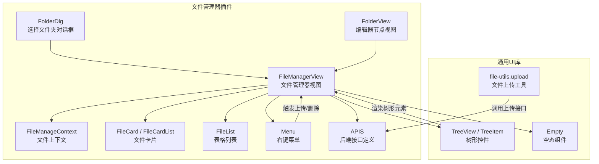
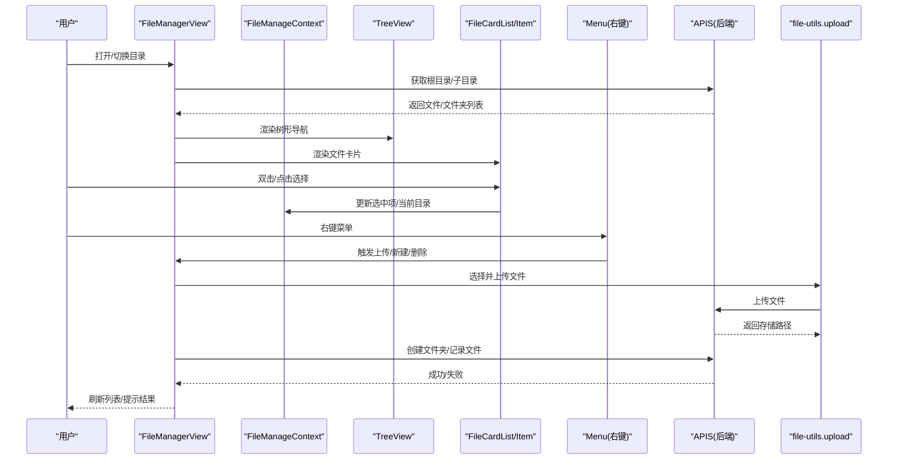
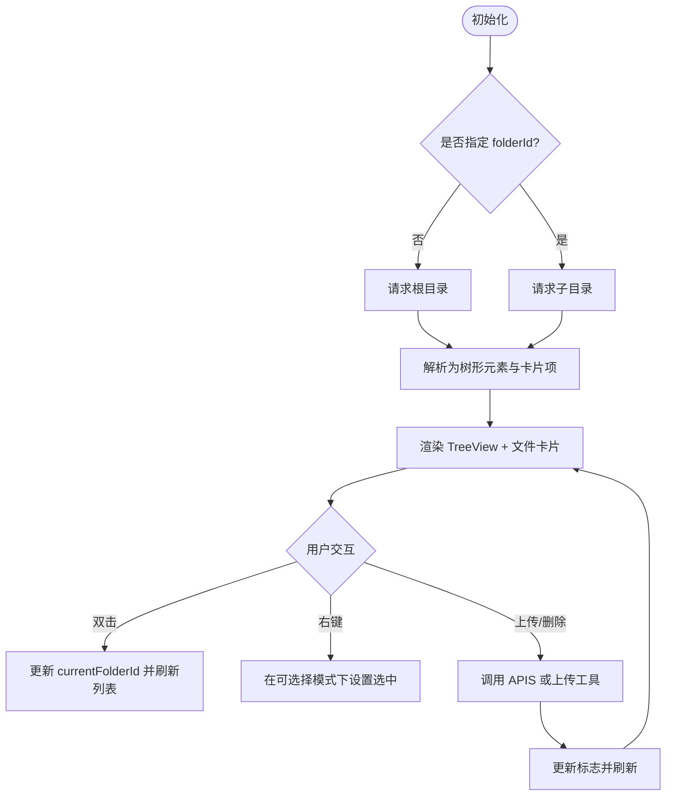
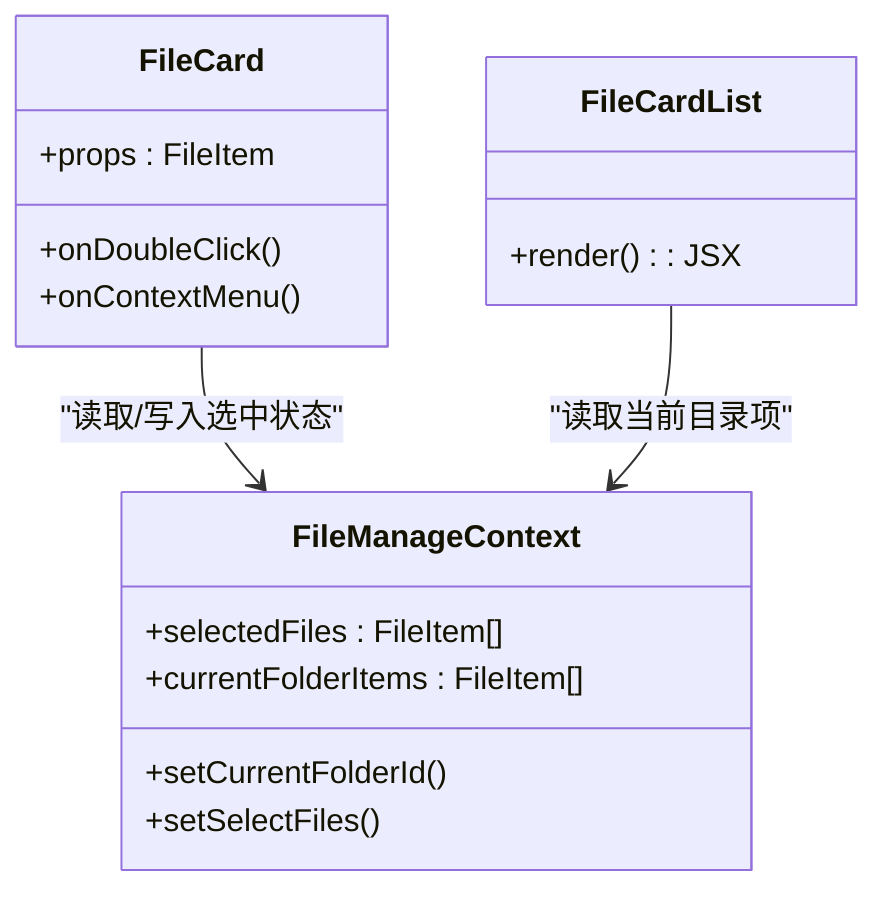
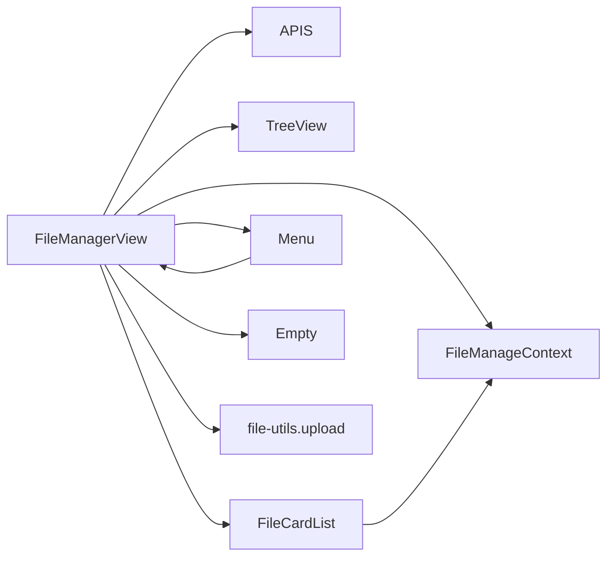

# 文件浏览器界面

<cite>
**本文引用的文件**
- [packages/plugin-file-manager/src/editor-extensions/component/FileManager.tsx](file://packages/plugin-file-manager/src/editor-extensions/component/FileManager.tsx)
- [packages/plugin-file-manager/src/editor-extensions/component/FileContext.ts](file://packages/plugin-file-manager/src/editor-extensions/component/FileContext.ts)
- [packages/plugin-file-manager/src/editor-extensions/component/FileCard.tsx](file://packages/plugin-file-manager/src/editor-extensions/component/FileCard.tsx)
- [packages/plugin-file-manager/src/editor-extensions/component/FileList.tsx](file://packages/plugin-file-manager/src/editor-extensions/component/FileList.tsx)
- [packages/plugin-file-manager/src/editor-extensions/component/Menu.tsx](file://packages/plugin-file-manager/src/editor-extensions/component/Menu.tsx)
- [packages/plugin-file-manager/src/editor-extensions/component/FolderDlg.tsx](file://packages/plugin-file-manager/src/editor-extensions/component/FolderDlg.tsx)
- [packages/plugin-file-manager/src/editor-extensions/folder/FolderView.tsx](file://packages/plugin-file-manager/src/editor-extensions/folder/FolderView.tsx)
- [packages/plugin-file-manager/src/api/index.ts](file://packages/plugin-file-manager/src/api/index.ts)
- [packages/ui/src/components/ui/tree-view.tsx](file://packages/ui/src/components/ui/tree-view.tsx)
- [packages/ui/src/components/ui/tree-view-api.tsx](file://packages/ui/src/components/ui/tree-view-api.tsx)
- [packages/ui/src/components/ui/file-upload.tsx](file://packages/ui/src/components/ui/file-upload.tsx)
- [packages/ui/src/components/ui/empty.tsx](file://packages/ui/src/components/ui/empty.tsx)
- [packages/core/src/utils/file-utils.ts](file://packages/core/src/utils/file-utils.ts)
</cite>

## 目录
1. [简介](#简介)
2. [项目结构](#项目结构)
3. [核心组件](#核心组件)
4. [架构总览](#架构总览)
5. [详细组件分析](#详细组件分析)
6. [依赖关系分析](#依赖关系分析)
7. [性能考量](#性能考量)
8. [故障排查指南](#故障排查指南)
9. [结论](#结论)
10. [附录：使用示例与定制指南](#附录用例与定制指南)

## 简介
本文件面向“文件浏览器界面”的使用者与开发者，系统性梳理 FileManagerView 及其相关 UI 组件的设计与实现，覆盖以下主题：
- 文件列表展示与文件卡片布局
- 右键菜单（上下文菜单）功能机制
- 文件信息显示、图标渲染与状态指示
- 文件筛选、排序与搜索的实现细节
- 与编辑器其他组件的集成方式（如节点视图、对话框）
- 自定义外观与行为的最佳实践

## 项目结构
文件浏览器位于插件包中，围绕 FileManagerView 核心组件构建，配合上下文、树形目录、卡片与列表视图、右键菜单、空态组件以及上传工具等模块协同工作。

图表来源
- [packages/plugin-file-manager/src/editor-extensions/component/FileManager.tsx](file://packages/plugin-file-manager/src/editor-extensions/component/FileManager.tsx#L26-L327)
- [packages/plugin-file-manager/src/editor-extensions/component/Menu.tsx](file://packages/plugin-file-manager/src/editor-extensions/component/Menu.tsx#L1-L42)
- [packages/plugin-file-manager/src/editor-extensions/component/FolderDlg.tsx](file://packages/plugin-file-manager/src/editor-extensions/component/FolderDlg.tsx#L1-L23)
- [packages/plugin-file-manager/src/editor-extensions/folder/FolderView.tsx](file://packages/plugin-file-manager/src/editor-extensions/folder/FolderView.tsx#L1-L52)
- [packages/plugin-file-manager/src/api/index.ts](file://packages/plugin-file-manager/src/api/index.ts#L1-L27)
- [packages/ui/src/components/ui/tree-view.tsx](file://packages/ui/src/components/ui/tree-view.tsx#L1-L92)
- [packages/ui/src/components/ui/tree-view-api.tsx](file://packages/ui/src/components/ui/tree-view-api.tsx#L87-L163)
- [packages/core/src/utils/file-utils.ts](file://packages/core/src/utils/file-utils.ts#L1-L13)

章节来源
- [packages/plugin-file-manager/src/editor-extensions/component/FileManager.tsx](file://packages/plugin-file-manager/src/editor-extensions/component/FileManager.tsx#L26-L327)
- [packages/plugin-file-manager/src/editor-extensions/component/Menu.tsx](file://packages/plugin-file-manager/src/editor-extensions/component/Menu.tsx#L1-L42)
- [packages/plugin-file-manager/src/editor-extensions/component/FolderDlg.tsx](file://packages/plugin-file-manager/src/editor-extensions/component/FolderDlg.tsx#L1-L23)
- [packages/plugin-file-manager/src/editor-extensions/folder/FolderView.tsx](file://packages/plugin-file-manager/src/editor-extensions/folder/FolderView.tsx#L1-L52)
- [packages/plugin-file-manager/src/api/index.ts](file://packages/plugin-file-manager/src/api/index.ts#L1-L27)
- [packages/ui/src/components/ui/tree-view.tsx](file://packages/ui/src/components/ui/tree-view.tsx#L1-L92)
- [packages/ui/src/components/ui/tree-view-api.tsx](file://packages/ui/src/components/ui/tree-view-api.tsx#L87-L163)
- [packages/core/src/utils/file-utils.ts](file://packages/core/src/utils/file-utils.ts#L1-L13)

## 核心组件
- FileManagerView：文件管理器主视图，负责加载根/子目录、渲染树形导航、展示文件卡片、处理上传/删除/下载等操作，并通过上下文暴露状态与动作。
- FileManageContext：全局状态上下文，承载当前选中项、当前目录项、当前目录ID、可选择模式、仓库标识、上传/删除回调等。
- FileCard / FileCardList：文件卡片布局组件，支持多选、双击进入目录、右键菜单触发选择、图标渲染与状态高亮。
- FileList：表格列表组件（占位），用于未来扩展列表视图。
- Menu：右键菜单，提供新建文件夹、上传文件、删除等快捷操作。
- FolderDlg：对话框封装，便于在弹窗中打开文件管理器。
- FolderView：编辑器节点视图，允许在编辑器中选择文件夹并回填属性。
- APIS：统一的后端接口定义，包括获取根目录、获取子目录、上传文件、创建文件夹等。
- TreeView / TreeItem：树形控件，用于展示层级结构与交互。
- Empty：空态组件，用于无数据时的提示与引导。
- file-utils.upload：浏览器文件选择与上传工具，配合上传接口使用。

章节来源
- [packages/plugin-file-manager/src/editor-extensions/component/FileManager.tsx](file://packages/plugin-file-manager/src/editor-extensions/component/FileManager.tsx#L26-L327)
- [packages/plugin-file-manager/src/editor-extensions/component/FileContext.ts](file://packages/plugin-file-manager/src/editor-extensions/component/FileContext.ts#L1-L28)
- [packages/plugin-file-manager/src/editor-extensions/component/FileCard.tsx](file://packages/plugin-file-manager/src/editor-extensions/component/FileCard.tsx#L1-L93)
- [packages/plugin-file-manager/src/editor-extensions/component/FileList.tsx](file://packages/plugin-file-manager/src/editor-extensions/component/FileList.tsx#L1-L35)
- [packages/plugin-file-manager/src/editor-extensions/component/Menu.tsx](file://packages/plugin-file-manager/src/editor-extensions/component/Menu.tsx#L1-L42)
- [packages/plugin-file-manager/src/editor-extensions/component/FolderDlg.tsx](file://packages/plugin-file-manager/src/editor-extensions/component/FolderDlg.tsx#L1-L23)
- [packages/plugin-file-manager/src/editor-extensions/folder/FolderView.tsx](file://packages/plugin-file-manager/src/editor-extensions/folder/FolderView.tsx#L1-L52)
- [packages/plugin-file-manager/src/api/index.ts](file://packages/plugin-file-manager/src/api/index.ts#L1-L27)
- [packages/ui/src/components/ui/tree-view.tsx](file://packages/ui/src/components/ui/tree-view.tsx#L1-L92)
- [packages/ui/src/components/ui/tree-view-api.tsx](file://packages/ui/src/components/ui/tree-view-api.tsx#L87-L163)
- [packages/ui/src/components/ui/empty.tsx](file://packages/ui/src/components/ui/empty.tsx#L1-L28)
- [packages/core/src/utils/file-utils.ts](file://packages/core/src/utils/file-utils.ts#L1-L13)

## 架构总览
下图展示了从用户交互到数据流与外部接口的整体架构：

图表来源
- [packages/plugin-file-manager/src/editor-extensions/component/FileManager.tsx](file://packages/plugin-file-manager/src/editor-extensions/component/FileManager.tsx#L26-L327)
- [packages/plugin-file-manager/src/editor-extensions/component/Menu.tsx](file://packages/plugin-file-manager/src/editor-extensions/component/Menu.tsx#L1-L42)
- [packages/plugin-file-manager/src/api/index.ts](file://packages/plugin-file-manager/src/api/index.ts#L1-L27)
- [packages/core/src/utils/file-utils.ts](file://packages/core/src/utils/file-utils.ts#L1-L13)

## 详细组件分析

### FileManagerView 组件
- 职责
  - 加载根目录或指定目录的子项，解析为树形元素与卡片列表数据
  - 提供顶部工具栏（上传、删除、下载、确认/取消）
  - 提供树形导航（TreeView）与文件卡片展示区域
  - 通过上下文暴露状态与动作，供子组件使用
- 关键流程
  - 初始化：根据是否存在 folderId 决定加载根目录或子目录
  - 解析：将后端返回的数据转换为树形元素与卡片项
  - 交互：双击进入目录、右键菜单触发选择、上传/删除/下载
  - 回调：在可选择模式下支持 onConfirm/onCancel
- 数据结构
  - FileItem：包含 id、name、isFolder、children、type 等字段
  - FileManagerState：包含 selectable、currentFolderItems、selectedFiles、currentFolderId、repoKey、handleUpload、handleDelete 等

图表来源
- [packages/plugin-file-manager/src/editor-extensions/component/FileManager.tsx](file://packages/plugin-file-manager/src/editor-extensions/component/FileManager.tsx#L26-L327)
- [packages/plugin-file-manager/src/api/index.ts](file://packages/plugin-file-manager/src/api/index.ts#L1-L27)

章节来源
- [packages/plugin-file-manager/src/editor-extensions/component/FileManager.tsx](file://packages/plugin-file-manager/src/editor-extensions/component/FileManager.tsx#L26-L327)
- [packages/plugin-file-manager/src/editor-extensions/component/FileContext.ts](file://packages/plugin-file-manager/src/editor-extensions/component/FileContext.ts#L1-L28)

### 文件卡片布局（FileCard / FileCardList）
- 布局与交互
  - 卡片尺寸固定，采用卡片容器与标题区、内容区、页脚区的结构
  - 支持可选择模式下的复选框，选中状态通过上下文同步
  - 右键菜单触发时，在可选择模式下自动勾选当前项
  - 双击卡片进入对应目录（仅当为文件夹）
- 图标与状态
  - 文件夹与文件分别使用不同图标
  - 选中项带有外框高亮，hover 时有阴影变化
- 性能
  - 使用安全状态钩子避免异常更新
  - 列表按当前目录项渲染，减少无关重绘

图表来源
- [packages/plugin-file-manager/src/editor-extensions/component/FileCard.tsx](file://packages/plugin-file-manager/src/editor-extensions/component/FileCard.tsx#L1-L93)
- [packages/plugin-file-manager/src/editor-extensions/component/FileContext.ts](file://packages/plugin-file-manager/src/editor-extensions/component/FileContext.ts#L1-L28)

章节来源
- [packages/plugin-file-manager/src/editor-extensions/component/FileCard.tsx](file://packages/plugin-file-manager/src/editor-extensions/component/FileCard.tsx#L1-L93)

### 右键菜单（Menu）
- 功能
  - 新建文件夹：调用上传回调创建文件夹
  - 上传文件：调用上传回调进行文件上传
  - 删除：预留删除回调（当前未实现具体逻辑）
- 集成
  - 作为文件卡片区域的上下文菜单触发器
  - 通过上下文访问上传回调

章节来源
- [packages/plugin-file-manager/src/editor-extensions/component/Menu.tsx](file://packages/plugin-file-manager/src/editor-extensions/component/Menu.tsx#L1-L42)

### 树形导航（TreeView / TreeViewAPI）
- 功能
  - 展示层级结构，支持展开/折叠、选中态高亮
  - 将文件/文件夹映射为树形元素，点击触发进入目录或更新当前项
- 交互
  - 选中项变更时更新当前目录ID
  - 支持初始选中、全展开等配置

章节来源
- [packages/ui/src/components/ui/tree-view.tsx](file://packages/ui/src/components/ui/tree-view.tsx#L1-L92)
- [packages/ui/src/components/ui/tree-view-api.tsx](file://packages/ui/src/components/ui/tree-view-api.tsx#L87-L163)
- [packages/plugin-file-manager/src/editor-extensions/component/FileManager.tsx](file://packages/plugin-file-manager/src/editor-extensions/component/FileManager.tsx#L288-L294)

### 文件列表（FileList）
- 当前状态
  - 表格头与行占位，列名包含名称、大小、上传时间
  - 复选框占位，未绑定实际数据
- 建议
  - 后续可接入 FileManagerState 的 currentFolderItems，实现列表视图与卡片视图切换

章节来源
- [packages/plugin-file-manager/src/editor-extensions/component/FileList.tsx](file://packages/plugin-file-manager/src/editor-extensions/component/FileList.tsx#L1-L35)

### 对话框与节点视图集成
- FolderDlg
  - 在对话框中嵌入 FileManagerView，适合弹窗选择文件/文件夹
- FolderView
  - 编辑器节点视图，支持打开文件管理器选择文件夹并回填属性
  - 不可编辑状态下隐藏操作按钮，仅展示空态与引导

章节来源
- [packages/plugin-file-manager/src/editor-extensions/component/FolderDlg.tsx](file://packages/plugin-file-manager/src/editor-extensions/component/FolderDlg.tsx#L1-L23)
- [packages/plugin-file-manager/src/editor-extensions/folder/FolderView.tsx](file://packages/plugin-file-manager/src/editor-extensions/folder/FolderView.tsx#L1-L52)

## 依赖关系分析
- 组件耦合
  - FileManagerView 与 FileManageContext 强耦合，通过 Provider 暴露状态与动作
  - FileCard 依赖上下文进行选择与导航
  - Menu 依赖上下文进行上传/删除操作
- 外部依赖
  - APIS 定义后端接口，FileManagerView 通过 useApi 调用
  - file-utils.upload 用于浏览器文件选择与上传
  - UI 库 TreeView/Empty 等组件提供基础能力

图表来源
- [packages/plugin-file-manager/src/editor-extensions/component/FileManager.tsx](file://packages/plugin-file-manager/src/editor-extensions/component/FileManager.tsx#L26-L327)
- [packages/plugin-file-manager/src/editor-extensions/component/Menu.tsx](file://packages/plugin-file-manager/src/editor-extensions/component/Menu.tsx#L1-L42)
- [packages/plugin-file-manager/src/api/index.ts](file://packages/plugin-file-manager/src/api/index.ts#L1-L27)
- [packages/core/src/utils/file-utils.ts](file://packages/core/src/utils/file-utils.ts#L1-L13)

章节来源
- [packages/plugin-file-manager/src/editor-extensions/component/FileManager.tsx](file://packages/plugin-file-manager/src/editor-extensions/component/FileManager.tsx#L26-L327)
- [packages/plugin-file-manager/src/editor-extensions/component/Menu.tsx](file://packages/plugin-file-manager/src/editor-extensions/component/Menu.tsx#L1-L42)
- [packages/plugin-file-manager/src/api/index.ts](file://packages/plugin-file-manager/src/api/index.ts#L1-L27)
- [packages/core/src/utils/file-utils.ts](file://packages/core/src/utils/file-utils.ts#L1-L13)

## 性能考量
- 渲染优化
  - 文件卡片采用固定尺寸与包裹布局，避免大列表时的重排
  - 仅渲染当前目录项，减少无关 DOM
- 状态管理
  - 使用安全状态钩子，避免重复渲染与异常更新
  - 通过更新标志控制刷新，避免频繁请求
- 上传体验
  - 上传过程使用提示与 Promise 包装，提升反馈及时性
- 建议
  - 大量文件时考虑虚拟化或分页
  - 列表视图可引入排序/筛选以降低可视成本

## 故障排查指南
- 无法加载目录
  - 检查 folderId 是否正确传递，确认后端接口可用
  - 查看网络面板与错误提示，定位 APIS 请求失败原因
- 上传失败
  - 确认 file-utils.upload 已正确调用并传入 multipart/form-data
  - 检查后端上传接口返回值与权限
- 右键菜单无效
  - 确认处于可选择模式，且 Menu 正确包裹文件卡片区域
- 选中状态不生效
  - 检查 FileCard 中是否正确读取/更新 selectedFiles
  - 确认上下文 Provider 是否正确提供状态

章节来源
- [packages/plugin-file-manager/src/editor-extensions/component/FileManager.tsx](file://packages/plugin-file-manager/src/editor-extensions/component/FileManager.tsx#L26-L327)
- [packages/plugin-file-manager/src/editor-extensions/component/Menu.tsx](file://packages/plugin-file-manager/src/editor-extensions/component/Menu.tsx#L1-L42)
- [packages/plugin-file-manager/src/api/index.ts](file://packages/plugin-file-manager/src/api/index.ts#L1-L27)
- [packages/core/src/utils/file-utils.ts](file://packages/core/src/utils/file-utils.ts#L1-L13)

## 结论
文件浏览器界面以 FileManagerView 为核心，结合上下文、树形导航、文件卡片与右键菜单，实现了目录浏览、文件选择与上传的基础能力。当前已具备良好的可扩展性，后续可在列表视图、筛选/排序、搜索与删除逻辑等方面进一步完善，以满足更复杂的使用场景。

## 附录：使用示例与定制指南

### 如何在编辑器中插入并选择文件夹
- 使用 FolderView 节点视图，打开文件管理器选择文件夹，成功后将 folderId 回填到节点属性
- 在不可编辑状态下，显示空态并提供引导按钮

章节来源
- [packages/plugin-file-manager/src/editor-extensions/folder/FolderView.tsx](file://packages/plugin-file-manager/src/editor-extensions/folder/FolderView.tsx#L1-L52)

### 如何在对话框中打开文件管理器
- 使用 FolderDlg 打开一个大尺寸对话框，内部嵌套 FileManagerView
- 可设置 selectable 与回调 onConfirm/onCancel 实现选择与确认

章节来源
- [packages/plugin-file-manager/src/editor-extensions/component/FolderDlg.tsx](file://packages/plugin-file-manager/src/editor-extensions/component/FolderDlg.tsx#L1-L23)

### 如何自定义外观与行为
- 外观
  - 通过 FileManagerView 的 className 自定义容器样式
  - 使用 TreeView 的 size、className 等参数调整树形控件风格
  - 文件卡片可通过 Card 的类名与 cn 辅助函数进行样式定制
- 行为
  - selectable 控制是否启用多选与确认/取消回调
  - multiple 控制是否允许多选（当前在确认按钮处使用）
  - target 控制目标类型（文件/文件夹/两者）

章节来源
- [packages/plugin-file-manager/src/editor-extensions/component/FileManager.tsx](file://packages/plugin-file-manager/src/editor-extensions/component/FileManager.tsx#L26-L327)
- [packages/ui/src/components/ui/tree-view.tsx](file://packages/ui/src/components/ui/tree-view.tsx#L1-L92)

### 文件筛选、排序与搜索
- 当前实现
  - 顶部导航包含搜索输入，但事件处理为空（占位）
  - 列表视图（FileList）尚未接入数据与交互
- 建议实现
  - 在 FileManagerView 中维护本地过滤器，基于名称匹配进行筛选
  - 提供排序开关（按名称/大小/时间），并更新 currentFolderItems
  - 在搜索框输入时延迟触发过滤，避免频繁重绘
  - 列表视图中绑定 FileList 的数据与交互，实现与卡片视图的切换

章节来源
- [packages/plugin-file-manager/src/editor-extensions/component/FileManager.tsx](file://packages/plugin-file-manager/src/editor-extensions/component/FileManager.tsx#L40-L81)
- [packages/plugin-file-manager/src/editor-extensions/component/FileList.tsx](file://packages/plugin-file-manager/src/editor-extensions/component/FileList.tsx#L1-L35)

### 与编辑器其他组件的集成
- 上传入口
  - 顶部工具栏上传按钮直接调用上传流程
  - 右键菜单上传项同样走上传流程
- 上传工具
  - file-utils.upload 负责选择文件并调用上传接口
  - UI 层 file-upload 支持拖拽、预览与批量限制，可作为参考

章节来源
- [packages/plugin-file-manager/src/editor-extensions/component/FileManager.tsx](file://packages/plugin-file-manager/src/editor-extensions/component/FileManager.tsx#L214-L246)
- [packages/plugin-file-manager/src/editor-extensions/component/Menu.tsx](file://packages/plugin-file-manager/src/editor-extensions/component/Menu.tsx#L1-L42)
- [packages/core/src/utils/file-utils.ts](file://packages/core/src/utils/file-utils.ts#L1-L13)
- [packages/ui/src/components/ui/file-upload.tsx](file://packages/ui/src/components/ui/file-upload.tsx#L109-L159)