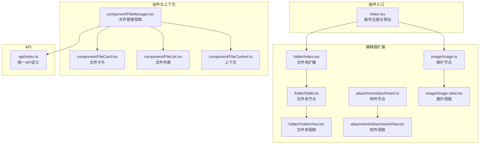
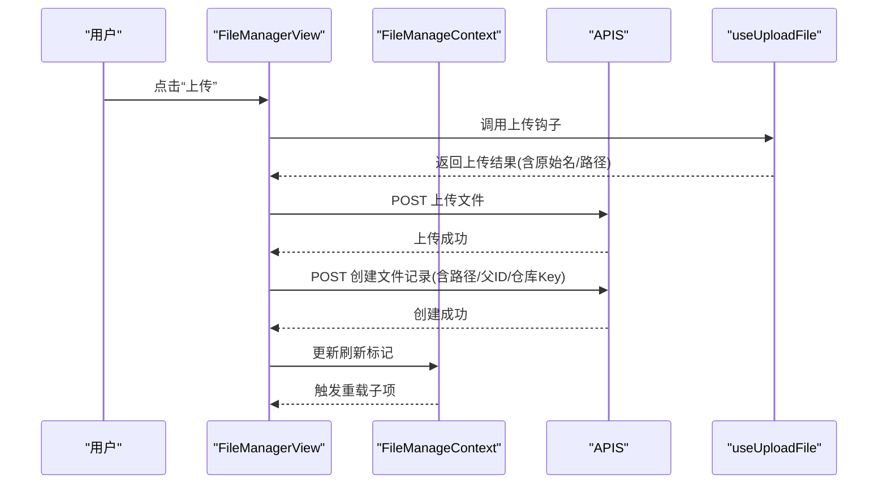
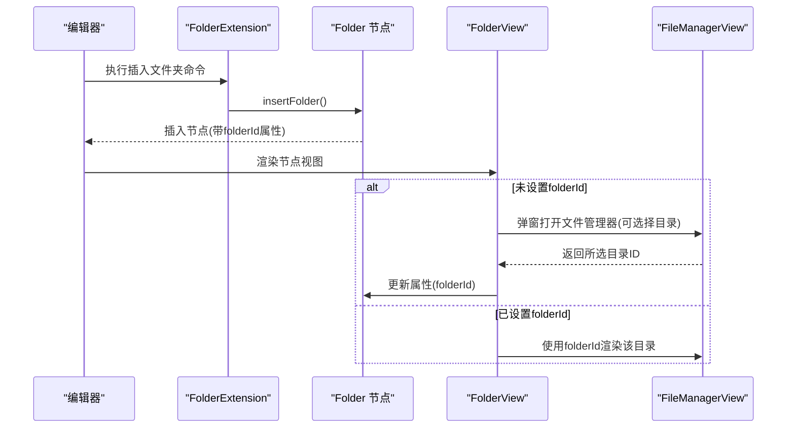
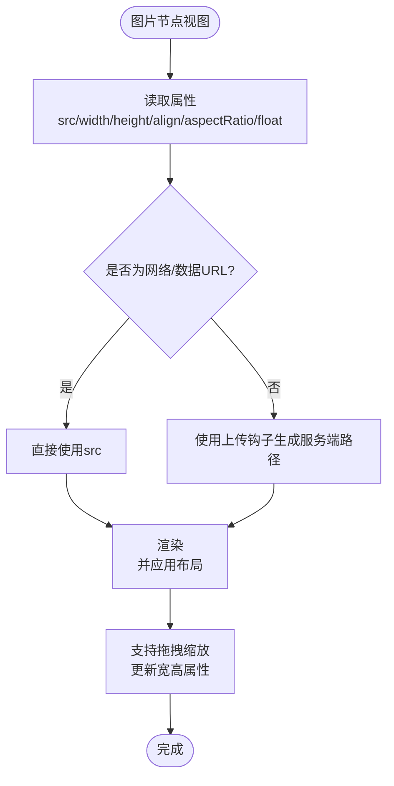
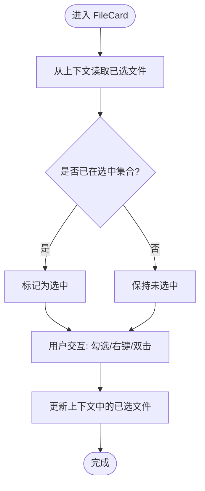
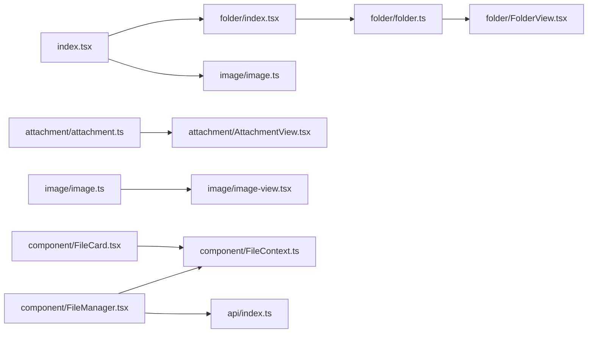

# 文件管理插件

<cite>
**本文引用的文件**
- [packages/plugin-file-manager/src/index.tsx](file://packages/plugin-file-manager/src/index.tsx)
- [packages/plugin-file-manager/src/api/index.ts](file://packages/plugin-file-manager/src/api/index.ts)
- [packages/plugin-file-manager/src/editor-extensions/component/FileManager.tsx](file://packages/plugin-file-manager/src/editor-extensions/component/FileManager.tsx)
- [packages/plugin-file-manager/src/editor-extensions/component/FileCard.tsx](file://packages/plugin-file-manager/src/editor-extensions/component/FileCard.tsx)
- [packages/plugin-file-manager/src/editor-extensions/component/FileList.tsx](file://packages/plugin-file-manager/src/editor-extensions/component/FileList.tsx)
- [packages/plugin-file-manager/src/editor-extensions/component/FileContext.ts](file://packages/plugin-file-manager/src/editor-extensions/component/FileContext.ts)
- [packages/plugin-file-manager/src/editor-extensions/folder/folder.ts](file://packages/plugin-file-manager/src/editor-extensions/folder/folder.ts)
- [packages/plugin-file-manager/src/editor-extensions/folder/FolderView.tsx](file://packages/plugin-file-manager/src/editor-extensions/folder/FolderView.tsx)
- [packages/plugin-file-manager/src/editor-extensions/folder/index.tsx](file://packages/plugin-file-manager/src/editor-extensions/folder/index.tsx)
- [packages/plugin-file-manager/src/editor-extensions/attachment/attachment.ts](file://packages/plugin-file-manager/src/editor-extensions/attachment/attachment.ts)
- [packages/plugin-file-manager/src/editor-extensions/attachment/AttachmentView.tsx](file://packages/plugin-file-manager/src/editor-extensions/attachment/AttachmentView.tsx)
- [packages/plugin-file-manager/src/editor-extensions/image/image.ts](file://packages/plugin-file-manager/src/editor-extensions/image/image.ts)
- [packages/plugin-file-manager/src/editor-extensions/image/image-view.tsx](file://packages/plugin-file-manager/src/editor-extensions/image/image-view.tsx)
- [packages/plugin-file-manager/src/editor-extensions/utils/showFolderDlg.tsx](file://packages/plugin-file-manager/src/editor-extensions/utils/showFolderDlg.tsx)
</cite>

## 目录
1. [简介](#简介)
2. [项目结构](#项目结构)
3. [核心组件](#核心组件)
4. [架构总览](#架构总览)
5. [详细组件分析](#详细组件分析)
6. [依赖关系分析](#依赖关系分析)
7. [性能考虑](#性能考虑)
8. [故障排查指南](#故障排查指南)
9. [结论](#结论)
10. [附录：使用示例与最佳实践](#附录使用示例与最佳实践)

## 简介
本文件管理插件为编辑器提供“文件夹管理、附件上传、图片管理与文件浏览”能力，并通过编辑器扩展将“文件卡片组件、文件列表组件、文件上下文管理”整合到编辑器工作流中。插件以 KPlugin 为基础，注册菜单入口、路由视图以及编辑器扩展（文件夹节点、附件节点、图片节点）。后端接口由统一 API 定义，支持根目录获取、子目录查询、文件上传与文件夹创建等。

## 项目结构
文件管理插件位于 packages/plugin-file-manager，主要分为三部分：
- 插件入口与注册：定义插件类、菜单、路由与编辑器扩展。
- 编辑器扩展：文件夹节点、附件节点、图片节点及其视图。
- 组件与上下文：文件管理界面、文件卡片、文件列表、上下文状态。



图表来源
- [packages/plugin-file-manager/src/index.tsx](file://packages/plugin-file-manager/src/index.tsx#L1-L38)
- [packages/plugin-file-manager/src/editor-extensions/folder/index.tsx](file://packages/plugin-file-manager/src/editor-extensions/folder/index.tsx#L1-L28)
- [packages/plugin-file-manager/src/editor-extensions/folder/folder.ts](file://packages/plugin-file-manager/src/editor-extensions/folder/folder.ts#L1-L34)
- [packages/plugin-file-manager/src/editor-extensions/folder/FolderView.tsx](file://packages/plugin-file-manager/src/editor-extensions/folder/FolderView.tsx#L1-L52)
- [packages/plugin-file-manager/src/editor-extensions/attachment/attachment.ts](file://packages/plugin-file-manager/src/editor-extensions/attachment/attachment.ts#L1-L29)
- [packages/plugin-file-manager/src/editor-extensions/attachment/AttachmentView.tsx](file://packages/plugin-file-manager/src/editor-extensions/attachment/AttachmentView.tsx#L1-L9)
- [packages/plugin-file-manager/src/editor-extensions/image/image.ts](file://packages/plugin-file-manager/src/editor-extensions/image/image.ts#L1-L123)
- [packages/plugin-file-manager/src/editor-extensions/image/image-view.tsx](file://packages/plugin-file-manager/src/editor-extensions/image/image-view.tsx#L1-L64)
- [packages/plugin-file-manager/src/editor-extensions/component/FileManager.tsx](file://packages/plugin-file-manager/src/editor-extensions/component/FileManager.tsx#L1-L327)
- [packages/plugin-file-manager/src/editor-extensions/component/FileCard.tsx](file://packages/plugin-file-manager/src/editor-extensions/component/FileCard.tsx#L1-L93)
- [packages/plugin-file-manager/src/editor-extensions/component/FileList.tsx](file://packages/plugin-file-manager/src/editor-extensions/component/FileList.tsx#L1-L35)
- [packages/plugin-file-manager/src/editor-extensions/component/FileContext.ts](file://packages/plugin-file-manager/src/editor-extensions/component/FileContext.ts#L1-L28)
- [packages/plugin-file-manager/src/api/index.ts](file://packages/plugin-file-manager/src/api/index.ts#L1-L27)

章节来源
- [packages/plugin-file-manager/src/index.tsx](file://packages/plugin-file-manager/src/index.tsx#L1-L38)

## 核心组件
- 插件入口与注册
  - 通过 KPlugin 创建插件实例，注册编辑器扩展（文件夹、图片）、路由视图（文件管理页面）与菜单入口。
- 文件管理视图（FileManagerView）
  - 提供树形导航、文件卡片网格、工具栏、选择模式与确认回调。
  - 内置上传、删除、下载、列表切换等交互。
- 文件卡片与列表
  - FileCard：单个文件/文件夹卡片，支持勾选、双击进入、右键选择、操作按钮。
  - FileList：表格形式的文件列表（占位，当前以卡片为主）。
- 文件上下文（FileManageContext）
  - 暴露当前文件夹、已选文件、选择状态更新、上传/删除处理等方法。
- 编辑器扩展
  - 文件夹节点：插入文件夹块，支持属性（folderId），可弹出文件管理器选择目录。
  - 附件节点：作为块级节点承载附件信息。
  - 图片节点：支持输入规则、命令插入、尺寸调整与对齐布局。

章节来源
- [packages/plugin-file-manager/src/index.tsx](file://packages/plugin-file-manager/src/index.tsx#L1-L38)
- [packages/plugin-file-manager/src/editor-extensions/component/FileManager.tsx](file://packages/plugin-file-manager/src/editor-extensions/component/FileManager.tsx#L1-L327)
- [packages/plugin-file-manager/src/editor-extensions/component/FileCard.tsx](file://packages/plugin-file-manager/src/editor-extensions/component/FileCard.tsx#L1-L93)
- [packages/plugin-file-manager/src/editor-extensions/component/FileList.tsx](file://packages/plugin-file-manager/src/editor-extensions/component/FileList.tsx#L1-L35)
- [packages/plugin-file-manager/src/editor-extensions/component/FileContext.ts](file://packages/plugin-file-manager/src/editor-extensions/component/FileContext.ts#L1-L28)
- [packages/plugin-file-manager/src/editor-extensions/folder/folder.ts](file://packages/plugin-file-manager/src/editor-extensions/folder/folder.ts#L1-L34)
- [packages/plugin-file-manager/src/editor-extensions/attachment/attachment.ts](file://packages/plugin-file-manager/src/editor-extensions/attachment/attachment.ts#L1-L29)
- [packages/plugin-file-manager/src/editor-extensions/image/image.ts](file://packages/plugin-file-manager/src/editor-extensions/image/image.ts#L1-L123)

## 架构总览
文件管理插件采用“编辑器扩展 + 页面视图 + 上下文状态”的分层设计：
- 编辑器扩展层：负责在编辑器中插入/渲染文件夹、附件、图片节点。
- 视图层：文件管理页面提供树形导航与卡片网格浏览；文件夹节点视图提供选择与预览。
- 数据层：通过统一 API 访问后端，实现根目录、子目录、上传与创建等操作。

```mermaid
graph TB
subgraph "编辑器"
FE["文件夹扩展<br/>folder/index.tsx"]
AE["附件扩展<br/>attachment/attachment.ts"]
IE["图片扩展<br/>image/image.ts"]
end
subgraph "视图"
FMV["文件管理视图<br/>FileManager.tsx"]
FV["文件夹视图<br/>FolderView.tsx"]
IV["图片视图<br/>image-view.tsx"]
end
subgraph "上下文"
CTX["文件管理上下文<br/>FileContext.ts"]
end
subgraph "API"
API["统一API<br/>api/index.ts"]
end
FE --> FV
AE --> AE
IE --> IV
FMV --> CTX
FV --> CTX
FMV --> API
CTX --> API
```

图表来源
- [packages/plugin-file-manager/src/editor-extensions/folder/index.tsx](file://packages/plugin-file-manager/src/editor-extensions/folder/index.tsx#L1-L28)
- [packages/plugin-file-manager/src/editor-extensions/attachment/attachment.ts](file://packages/plugin-file-manager/src/editor-extensions/attachment/attachment.ts#L1-L29)
- [packages/plugin-file-manager/src/editor-extensions/image/image.ts](file://packages/plugin-file-manager/src/editor-extensions/image/image.ts#L1-L123)
- [packages/plugin-file-manager/src/editor-extensions/folder/FolderView.tsx](file://packages/plugin-file-manager/src/editor-extensions/folder/FolderView.tsx#L1-L52)
- [packages/plugin-file-manager/src/editor-extensions/image/image-view.tsx](file://packages/plugin-file-manager/src/editor-extensions/image/image-view.tsx#L1-L64)
- [packages/plugin-file-manager/src/editor-extensions/component/FileManager.tsx](file://packages/plugin-file-manager/src/editor-extensions/component/FileManager.tsx#L1-L327)
- [packages/plugin-file-manager/src/editor-extensions/component/FileContext.ts](file://packages/plugin-file-manager/src/editor-extensions/component/FileContext.ts#L1-L28)
- [packages/plugin-file-manager/src/api/index.ts](file://packages/plugin-file-manager/src/api/index.ts#L1-L27)

## 详细组件分析

### 文件管理视图（FileManagerView）
- 功能要点
  - 树形导航：默认菜单包含“首页/最近/收藏/回收站”，支持搜索输入框占位。
  - 文件浏览：根据当前文件夹加载子项，以卡片网格展示；空态时提供上传入口。
  - 工具栏：上传、删除、下载、切换列表、选择确认与取消。
  - 选择模式：支持多选，提供 onConfirm/onCancel 回调。
  - 上传流程：触发上传后调用后端上传接口，再创建文件记录。
- 关键数据流
  - 初始化：若无 folderId，请求根目录；否则请求指定目录子项。
  - 切换目录：更新 currentFolderId 并刷新子项。
  - 上传：调用上传钩子，提交后端创建文件记录并刷新列表。



图表来源
- [packages/plugin-file-manager/src/editor-extensions/component/FileManager.tsx](file://packages/plugin-file-manager/src/editor-extensions/component/FileManager.tsx#L85-L114)
- [packages/plugin-file-manager/src/api/index.ts](file://packages/plugin-file-manager/src/api/index.ts#L1-L27)

章节来源
- [packages/plugin-file-manager/src/editor-extensions/component/FileManager.tsx](file://packages/plugin-file-manager/src/editor-extensions/component/FileManager.tsx#L1-L327)
- [packages/plugin-file-manager/src/api/index.ts](file://packages/plugin-file-manager/src/api/index.ts#L1-L27)

### 文件夹扩展（FolderExtension）
- 功能要点
  - 注册文件夹节点，支持插入命令与 Slash 菜单插入。
  - 节点属性包含 folderId，用于绑定具体目录。
  - 节点视图：未选择目录时显示“选择目录”入口；已选择则渲染对应文件夹内容。
- 集成方式
  - 在编辑器扩展中注册，支持在编辑器内插入“文件夹块”。



图表来源
- [packages/plugin-file-manager/src/editor-extensions/folder/index.tsx](file://packages/plugin-file-manager/src/editor-extensions/folder/index.tsx#L1-L28)
- [packages/plugin-file-manager/src/editor-extensions/folder/folder.ts](file://packages/plugin-file-manager/src/editor-extensions/folder/folder.ts#L1-L34)
- [packages/plugin-file-manager/src/editor-extensions/folder/FolderView.tsx](file://packages/plugin-file-manager/src/editor-extensions/folder/FolderView.tsx#L1-L52)
- [packages/plugin-file-manager/src/editor-extensions/component/FileManager.tsx](file://packages/plugin-file-manager/src/editor-extensions/component/FileManager.tsx#L1-L327)

章节来源
- [packages/plugin-file-manager/src/editor-extensions/folder/index.tsx](file://packages/plugin-file-manager/src/editor-extensions/folder/index.tsx#L1-L28)
- [packages/plugin-file-manager/src/editor-extensions/folder/folder.ts](file://packages/plugin-file-manager/src/editor-extensions/folder/folder.ts#L1-L34)
- [packages/plugin-file-manager/src/editor-extensions/folder/FolderView.tsx](file://packages/plugin-file-manager/src/editor-extensions/folder/FolderView.tsx#L1-L52)

### 附件扩展（AttachmentExtension）
- 功能要点
  - 定义附件节点，作为块级节点承载附件信息。
  - 节点视图为空容器，后续可扩展为附件卡片或下载链接。
- 适用场景
  - 在编辑器中插入附件引用，配合文件管理器选择具体文件。

章节来源
- [packages/plugin-file-manager/src/editor-extensions/attachment/attachment.ts](file://packages/plugin-file-manager/src/editor-extensions/attachment/attachment.ts#L1-L29)
- [packages/plugin-file-manager/src/editor-extensions/attachment/AttachmentView.tsx](file://packages/plugin-file-manager/src/editor-extensions/attachment/AttachmentView.tsx#L1-L9)

### 图片扩展（ImageExtension）
- 功能要点
  - 支持输入规则解析 Markdown 图片语法，自动插入图片节点。
  - 提供 setImage 命令，支持设置 src、宽高、对齐、纵横比等属性。
  - 视图层支持拖拽缩放与对齐布局，自动解析 http/data 协议与服务端路径。
- 与上传集成
  - 图片视图内部使用上传钩子生成服务端路径，便于统一存储策略。



图表来源
- [packages/plugin-file-manager/src/editor-extensions/image/image.ts](file://packages/plugin-file-manager/src/editor-extensions/image/image.ts#L1-L123)
- [packages/plugin-file-manager/src/editor-extensions/image/image-view.tsx](file://packages/plugin-file-manager/src/editor-extensions/image/image-view.tsx#L1-L64)

章节来源
- [packages/plugin-file-manager/src/editor-extensions/image/image.ts](file://packages/plugin-file-manager/src/editor-extensions/image/image.ts#L1-L123)
- [packages/plugin-file-manager/src/editor-extensions/image/image-view.tsx](file://packages/plugin-file-manager/src/editor-extensions/image/image-view.tsx#L1-L64)

### 文件卡片组件（FileCard）
- 功能要点
  - 单个文件/文件夹卡片，支持勾选、双击进入、右键选择与操作按钮。
  - 与上下文联动，维护选择状态并同步到父组件。
- 交互流程



图表来源
- [packages/plugin-file-manager/src/editor-extensions/component/FileCard.tsx](file://packages/plugin-file-manager/src/editor-extensions/component/FileCard.tsx#L1-L93)
- [packages/plugin-file-manager/src/editor-extensions/component/FileContext.ts](file://packages/plugin-file-manager/src/editor-extensions/component/FileContext.ts#L1-L28)

章节来源
- [packages/plugin-file-manager/src/editor-extensions/component/FileCard.tsx](file://packages/plugin-file-manager/src/editor-extensions/component/FileCard.tsx#L1-L93)
- [packages/plugin-file-manager/src/editor-extensions/component/FileContext.ts](file://packages/plugin-file-manager/src/editor-extensions/component/FileContext.ts#L1-L28)

### 文件列表组件（FileList）
- 功能要点
  - 表格形式展示文件列表，包含名称、大小、上传时间等列头。
  - 当前为占位实现，可替换为更丰富的元数据展示与排序筛选。
- 适配场景
  - 在需要以表格形式浏览文件时使用，与卡片视图互补。

章节来源
- [packages/plugin-file-manager/src/editor-extensions/component/FileList.tsx](file://packages/plugin-file-manager/src/editor-extensions/component/FileList.tsx#L1-L35)

### 文件上下文（FileManageContext）
- 功能要点
  - 统一暴露当前文件夹、子项、选择状态、仓库Key、上传/删除处理等。
  - 通过 Provider 向子组件注入状态与方法，避免层层传参。
- 接口定义
  - FileItem：文件/文件夹条目模型。
  - FileManagerState：上下文状态与方法集合。

章节来源
- [packages/plugin-file-manager/src/editor-extensions/component/FileContext.ts](file://packages/plugin-file-manager/src/editor-extensions/component/FileContext.ts#L1-L28)

## 依赖关系分析
- 插件入口依赖
  - 编辑器扩展：文件夹、图片。
  - 路由视图：文件管理页面。
  - 菜单入口：文件管理菜单。
- 视图与上下文
  - FileManagerView 依赖 FileManageContext、useUploadFile、useApi 与 APIS。
  - FileCard 依赖 FileManageContext 与 UI 组件库。
- 编辑器扩展
  - FolderExtension 依赖 Folder 节点与 FolderView。
  - AttachmentExtension 依赖 Attachment 节点与 AttachmentView。
  - ImageExtension 依赖 Image 节点与 ImageView。



图表来源
- [packages/plugin-file-manager/src/index.tsx](file://packages/plugin-file-manager/src/index.tsx#L1-L38)
- [packages/plugin-file-manager/src/editor-extensions/folder/index.tsx](file://packages/plugin-file-manager/src/editor-extensions/folder/index.tsx#L1-L28)
- [packages/plugin-file-manager/src/editor-extensions/folder/folder.ts](file://packages/plugin-file-manager/src/editor-extensions/folder/folder.ts#L1-L34)
- [packages/plugin-file-manager/src/editor-extensions/folder/FolderView.tsx](file://packages/plugin-file-manager/src/editor-extensions/folder/FolderView.tsx#L1-L52)
- [packages/plugin-file-manager/src/editor-extensions/attachment/attachment.ts](file://packages/plugin-file-manager/src/editor-extensions/attachment/attachment.ts#L1-L29)
- [packages/plugin-file-manager/src/editor-extensions/attachment/AttachmentView.tsx](file://packages/plugin-file-manager/src/editor-extensions/attachment/AttachmentView.tsx#L1-L9)
- [packages/plugin-file-manager/src/editor-extensions/image/image.ts](file://packages/plugin-file-manager/src/editor-extensions/image/image.ts#L1-L123)
- [packages/plugin-file-manager/src/editor-extensions/image/image-view.tsx](file://packages/plugin-file-manager/src/editor-extensions/image/image-view.tsx#L1-L64)
- [packages/plugin-file-manager/src/editor-extensions/component/FileManager.tsx](file://packages/plugin-file-manager/src/editor-extensions/component/FileManager.tsx#L1-L327)
- [packages/plugin-file-manager/src/editor-extensions/component/FileCard.tsx](file://packages/plugin-file-manager/src/editor-extensions/component/FileCard.tsx#L1-L93)
- [packages/plugin-file-manager/src/editor-extensions/component/FileContext.ts](file://packages/plugin-file-manager/src/editor-extensions/component/FileContext.ts#L1-L28)
- [packages/plugin-file-manager/src/api/index.ts](file://packages/plugin-file-manager/src/api/index.ts#L1-L27)

章节来源
- [packages/plugin-file-manager/src/index.tsx](file://packages/plugin-file-manager/src/index.tsx#L1-L38)
- [packages/plugin-file-manager/src/api/index.ts](file://packages/plugin-file-manager/src/api/index.ts#L1-L27)

## 性能考虑
- 列表渲染
  - 文件卡片采用虚拟滚动与懒加载策略可进一步优化大目录下的渲染性能（建议在实际实现中引入）。
- 请求与缓存
  - 目录切换与刷新应结合本地缓存，减少重复请求。
- 上传体验
  - 上传进度与失败重试可在 useUploadFile 层面增强，提升大文件上传稳定性。
- 图片渲染
  - 图片视图支持缩放与对齐，建议在大数据量场景下限制一次性渲染数量。

## 故障排查指南
- 无法加载目录
  - 检查 GET_ROOT_FOLDER 与 GET_CHILDREN 的返回结构是否符合预期（需包含 id、name、type、children 等字段）。
  - 确认 currentFolderId 与 folderId 参数传递正确。
- 上传失败
  - 确认 UPLOAD_FILE 与 CREATE_FOLDER 的 URL 与方法配置正确。
  - 检查 useUploadFile 返回的路径与原始名是否可用。
- 文件夹节点不显示内容
  - 确认 folderId 是否已设置；未设置时需通过弹窗选择目录并更新属性。
- 权限与访问
  - 若访问路径异常，检查 usePath 生成的服务端路径是否正确，或是否存在跨域/鉴权问题。

章节来源
- [packages/plugin-file-manager/src/editor-extensions/component/FileManager.tsx](file://packages/plugin-file-manager/src/editor-extensions/component/FileManager.tsx#L150-L187)
- [packages/plugin-file-manager/src/editor-extensions/folder/FolderView.tsx](file://packages/plugin-file-manager/src/editor-extensions/folder/FolderView.tsx#L1-L52)
- [packages/plugin-file-manager/src/editor-extensions/image/image-view.tsx](file://packages/plugin-file-manager/src/editor-extensions/image/image-view.tsx#L1-L64)
- [packages/plugin-file-manager/src/api/index.ts](file://packages/plugin-file-manager/src/api/index.ts#L1-L27)

## 结论
文件管理插件通过清晰的分层设计，将编辑器扩展与页面视图有机结合，提供了完整的文件夹管理、附件上传与图片管理能力。上下文状态与统一 API 使组件解耦、易于扩展。后续可在性能、权限与交互细节上持续优化。

## 附录：使用示例与最佳实践
- 在编辑器中插入文件夹块
  - 通过 Slash 菜单或命令插入文件夹节点，节点视图会弹出文件管理器供选择目录。
  - 参考路径：[文件夹扩展](file://packages/plugin-file-manager/src/editor-extensions/folder/index.tsx#L1-L28)、[文件夹节点](file://packages/plugin-file-manager/src/editor-extensions/folder/folder.ts#L1-L34)、[文件夹视图](file://packages/plugin-file-manager/src/editor-extensions/folder/FolderView.tsx#L1-L52)
- 在编辑器中插入图片
  - 支持 Markdown 语法与命令插入；图片视图支持拖拽缩放与对齐。
  - 参考路径：[图片节点](file://packages/plugin-file-manager/src/editor-extensions/image/image.ts#L1-L123)、[图片视图](file://packages/plugin-file-manager/src/editor-extensions/image/image-view.tsx#L1-L64)
- 在编辑器中插入附件
  - 插入附件节点后，可扩展为附件卡片或下载链接。
  - 参考路径：[附件节点](file://packages/plugin-file-manager/src/editor-extensions/attachment/attachment.ts#L1-L29)、[附件视图](file://packages/plugin-file-manager/src/editor-extensions/attachment/AttachmentView.tsx#L1-L9)
- 在页面中浏览与选择文件
  - 使用文件管理视图进行树形导航与卡片浏览，支持多选与确认回调。
  - 参考路径：[文件管理视图](file://packages/plugin-file-manager/src/editor-extensions/component/FileManager.tsx#L1-L327)、[文件卡片](file://packages/plugin-file-manager/src/editor-extensions/component/FileCard.tsx#L1-L93)、[文件上下文](file://packages/plugin-file-manager/src/editor-extensions/component/FileContext.ts#L1-L28)
- 文件上传与存储策略
  - 上传流程：先上传至服务端，再创建文件记录；路径通过 usePath 生成服务端访问地址。
  - 参考路径：[上传流程](file://packages/plugin-file-manager/src/editor-extensions/component/FileManager.tsx#L85-L114)、[API 定义](file://packages/plugin-file-manager/src/api/index.ts#L1-L27)
- 文件类型支持与批量操作
  - 文件类型：通过 type 字段区分文件/文件夹；建议在后端与前端统一枚举。
  - 批量操作：多选卡片后通过 onConfirm 回调获取选中集合，支持批量下载/移动等后续处理。
  - 参考路径：[文件卡片](file://packages/plugin-file-manager/src/editor-extensions/component/FileCard.tsx#L1-L93)、[文件上下文](file://packages/plugin-file-manager/src/editor-extensions/component/FileContext.ts#L1-L28)
- 文件搜索与导航
  - 树形导航默认包含“首页/最近/收藏/回收站”，搜索输入框为占位；可扩展为实时过滤与高亮。
  - 参考路径：[文件管理视图](file://packages/plugin-file-manager/src/editor-extensions/component/FileManager.tsx#L40-L81)