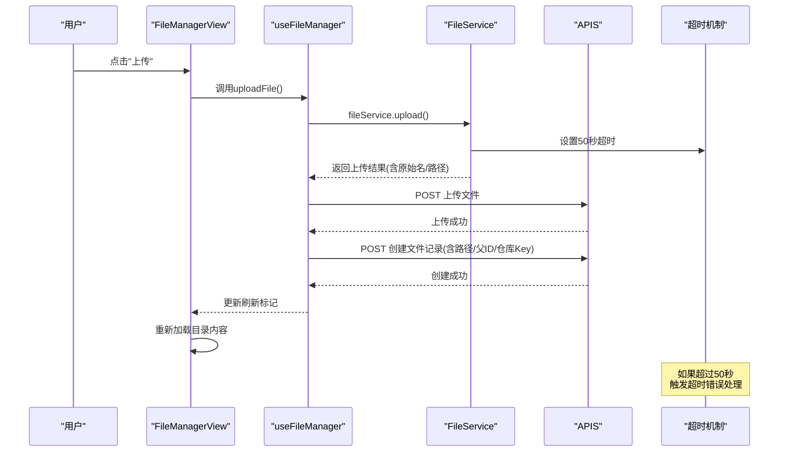
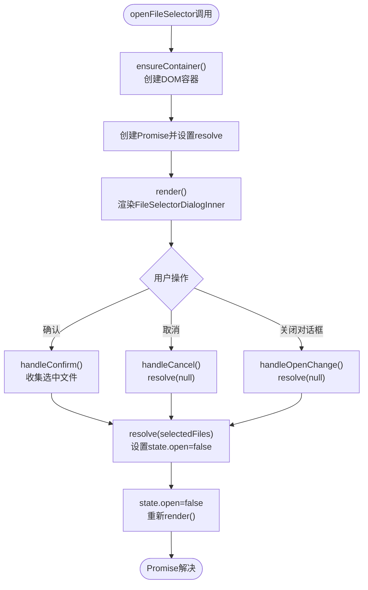
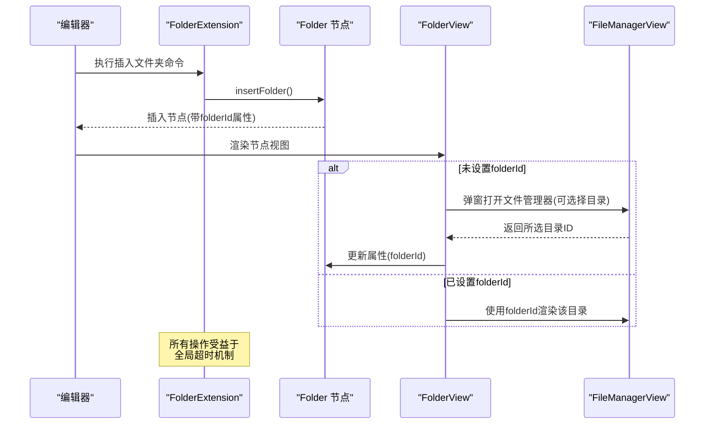
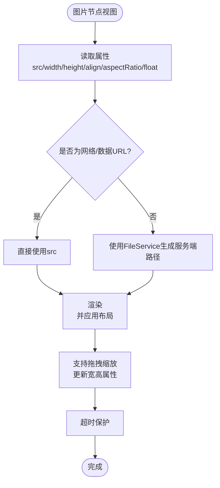
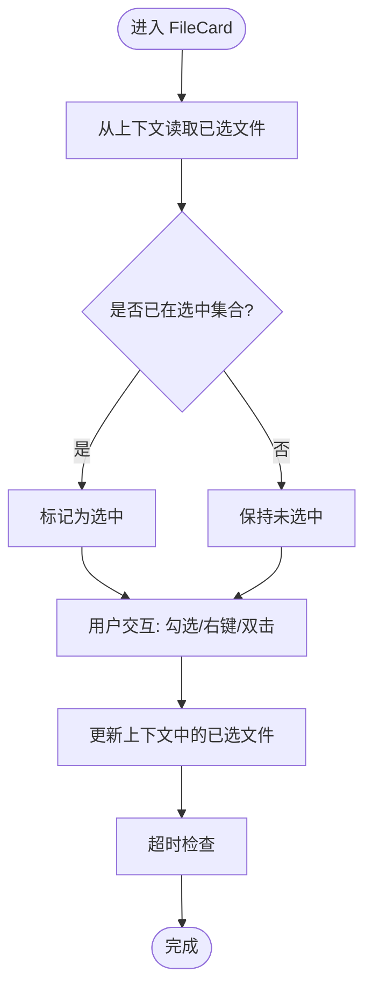
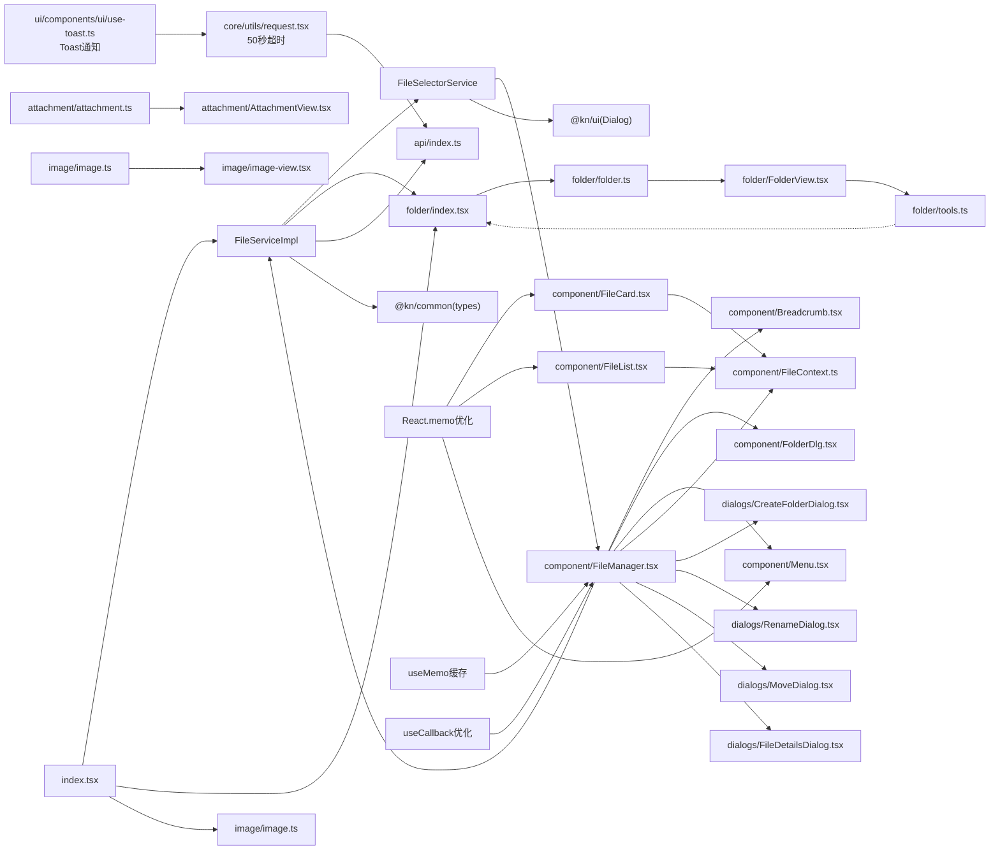

# 文件管理插件

<cite>
**本文档引用的文件**
- [packages/plugin-file-manager/src/index.tsx](file://packages/plugin-file-manager/src/index.tsx)
- [packages/plugin-file-manager/src/api/index.ts](file://packages/plugin-file-manager/src/api/index.ts)
- [packages/plugin-file-manager/src/services/FileServiceImpl.ts](file://packages/plugin-file-manager/src/services/FileServiceImpl.ts)
- [packages/plugin-file-manager/src/services/FileSelectorService.tsx](file://packages/plugin-file-manager/src/services/FileSelectorService.tsx)
- [packages/plugin-file-manager/src/services/index.ts](file://packages/plugin-file-manager/src/services/index.ts)
- [packages/plugin-file-manager/src/editor-extensions/component/FileManager.tsx](file://packages/plugin-file-manager/src/editor-extensions/component/FileManager.tsx)
- [packages/plugin-file-manager/src/editor-extensions/component/FileCard.tsx](file://packages/plugin-file-manager/src/editor-extensions/component/FileCard.tsx)
- [packages/plugin-file-manager/src/editor-extensions/component/FileList.tsx](file://packages/plugin-file-manager/src/editor-extensions/component/FileList.tsx)
- [packages/plugin-file-manager/src/editor-extensions/component/FileContext.ts](file://packages/plugin-file-manager/src/editor-extensions/component/FileContext.ts)
- [packages/plugin-file-manager/src/editor-extensions/component/Breadcrumb.tsx](file://packages/plugin-file-manager/src/editor-extensions/component/Breadcrumb.tsx)
- [packages/plugin-file-manager/src/editor-extensions/component/FolderDlg.tsx](file://packages/plugin-file-manager/src/editor-extensions/component/FolderDlg.tsx)
- [packages/plugin-file-manager/src/editor-extensions/component/Menu.tsx](file://packages/plugin-file-manager/src/editor-extensions/component/Menu.tsx)
- [packages/plugin-file-manager/src/editor-extensions/component/dialogs/CreateFolderDialog.tsx](file://packages/plugin-file-manager/src/editor-extensions/component/dialogs/CreateFolderDialog.tsx)
- [packages/plugin-file-manager/src/editor-extensions/component/dialogs/RenameDialog.tsx](file://packages/plugin-file-manager/src/editor-extensions/component/dialogs/RenameDialog.tsx)
- [packages/plugin-file-manager/src/editor-extensions/component/dialogs/MoveDialog.tsx](file://packages/plugin-file-manager/src/editor-extensions/component/dialogs/MoveDialog.tsx)
- [packages/plugin-file-manager/src/editor-extensions/component/dialogs/FileDetailsDialog.tsx](file://packages/plugin-file-manager/src/editor-extensions/component/dialogs/FileDetailsDialog.tsx)
- [packages/plugin-file-manager/src/editor-extensions/folder/folder.ts](file://packages/plugin-file-manager/src/editor-extensions/folder/folder.ts)
- [packages/plugin-file-manager/src/editor-extensions/folder/FolderView.tsx](file://packages/plugin-file-manager/src/editor-extensions/folder/FolderView.tsx)
- [packages/plugin-file-manager/src/editor-extensions/folder/index.tsx](file://packages/plugin-file-manager/src/editor-extensions/folder/index.tsx)
- [packages/plugin-file-manager/src/editor-extensions/folder/tools.ts](file://packages/plugin-file-manager/src/editor-extensions/folder/tools.ts)
- [packages/plugin-file-manager/src/editor-extensions/attachment/attachment.ts](file://packages/plugin-file-manager/src/editor-extensions/attachment/attachment.ts)
- [packages/plugin-file-manager/src/editor-extensions/attachment/AttachmentView.tsx](file://packages/plugin-file-manager/src/editor-extensions/attachment/AttachmentView.tsx)
- [packages/plugin-file-manager/src/editor-extensions/image/image.ts](file://packages/plugin-file-manager/src/editor-extensions/image/image.ts)
- [packages/plugin-file-manager/src/editor-extensions/image/image-view.tsx](file://packages/plugin-file-manager/src/editor-extensions/image/image-view.tsx)
- [packages/plugin-file-manager/src/editor-extensions/utils/showFileSelector.tsx](file://packages/plugin-file-manager/src/editor-extensions/utils/showFileSelector.tsx)
- [packages/plugin-file-manager/src/editor-extensions/utils/showFolderDlg.tsx](file://packages/plugin-file-manager/src/editor-extensions/utils/showFolderDlg.tsx)
- [packages/plugin-file-manager/src/hooks/useFileManager.ts](file://packages/plugin-file-manager/src/hooks/useFileManager.ts)
- [packages/plugin-file-manager/src/utils/fileUtils.ts](file://packages/plugin-file-manager/src/utils/fileUtils.ts)
- [packages/plugin-file-manager/OPTIMIZATION.md](file://packages/plugin-file-manager/OPTIMIZATION.md)
- [packages/common/src/core/types.ts](file://packages/common/src/core/types.ts)
- [packages/core/src/services/file-service.ts](file://packages/core/src/services/file-service.ts)
- [packages/core/src/hooks/use-upload-file.ts](file://packages/core/src/hooks/use-upload-file.ts)
- [packages/core/src/utils/request.tsx](file://packages/core/src/utils/request.tsx)
</cite>

## 更新摘要
**变更内容**
- 文件管理器组件添加了超时机制改善用户体验，通过全局HTTP请求超时配置和错误处理
- FileList组件增加React.memo优化，提升渲染性能
- FileContext增强状态管理，新增loading和error状态支持
- FileManagerView实现移动端响应式设计，支持移动端菜单抽屉
- 新增拖拽功能规划，计划实现拖拽文件上传
- 优化文件列表组件，新增FileListView现代化文件列表系统
- 增强文件操作的错误处理和用户反馈机制，包括Toast通知和重试选项
- **新增**：全局超时配置（50秒）和超时错误处理机制

## 目录
1. [简介](#简介)
2. [项目结构](#项目结构)
3. [核心组件](#核心组件)
4. [架构总览](#架构总览)
5. [详细组件分析](#详细组件分析)
6. [依赖关系分析](#依赖关系分析)
7. [性能考虑](#性能考虑)
8. [故障排查指南](#故障排查指南)
9. [结论](#结论)
10. [附录：使用示例与最佳实践](#附录使用示例与最佳实践)

## 简介
本文件管理插件为编辑器提供"文件夹管理、附件上传、图片管理与文件浏览"能力，并通过编辑器扩展将"文件卡片组件、文件列表组件、文件上下文管理"整合到编辑器工作流中。插件以 KPlugin 为基础，注册菜单入口、路由视图以及编辑器扩展（文件夹节点、附件节点、图片节点）。**重大更新**：插件现在提供FileServiceImpl实现，支持完整的文件管理功能，替代了旧的useUploadFile钩子，通过统一的useFileService钩子提供服务访问。

**重大改进**：本次更新新增了FileServiceImpl实现、FileSelectorService单例服务、服务注册系统、统一文件服务接口，显著提升了文件管理的完整性和可扩展性。**新增**：FileList组件经过React.memo优化，FileContext增强状态管理，FileManagerView实现移动端响应式设计，为后续拖拽功能奠定基础。**重要更新**：文件管理器组件现已集成全局超时机制，通过50秒的HTTP请求超时配置和完善的错误处理，显著改善了用户体验。

## 项目结构
文件管理插件位于 packages/plugin-file-manager，主要分为四大部分：
- 插件入口与注册：定义插件类、菜单、路由与编辑器扩展，注册FileService服务。
- 编辑器扩展：文件夹节点、附件节点、图片节点及其视图。
- 组件与上下文：文件管理界面、文件卡片、文件列表、上下文状态。
- 对话框与工具：创建文件夹、重命名、移动、文件详情等专用对话框，以及AI操作工具。

```mermaid
graph TB
subgraph "插件入口"
IDX["index.tsx<br/>插件注册与导出"]
FS["services/FileServiceImpl.ts<br/>文件服务实现"]
FSS["services/FileSelectorService.tsx<br/>文件选择器服务"]
END
subgraph "编辑器扩展"
FEXT["folder/index.tsx<br/>文件夹扩展"]
FNODE["folder/folder.ts<br/>文件夹节点"]
FVIEW["folder/FolderView.tsx<br/>文件夹视图"]
TOOLS["folder/tools.ts<br/>AI操作工具"]
AEXT["attachment/attachment.ts<br/>附件节点"]
AVIEW["attachment/AttachmentView.tsx<br/>附件视图"]
IEXT["image/image.ts<br/>图片节点"]
IVIEW["image/image-view.tsx<br/>图片视图"]
END
subgraph "组件与上下文"
FM["component/FileManager.tsx<br/>文件管理视图"]
BC["component/Breadcrumb.tsx<br/>面包屑导航"]
FD["component/FolderDlg.tsx<br/>文件夹对话框"]
MENU["component/Menu.tsx<br/>文件操作菜单"]
FC["component/FileCard.tsx<br/>文件卡片"]
FL["component/FileList.tsx<br/>文件列表"]
CTX["component/FileContext.ts<br/>上下文"]
END
subgraph "对话框组件"
CFD["dialogs/CreateFolderDialog.tsx<br/>创建文件夹对话框"]
RMD["dialogs/RenameDialog.tsx<br/>重命名对话框"]
MVD["dialogs/MoveDialog.tsx<br/>移动对话框"]
FDD["dialogs/FileDetailsDialog.tsx<br/>文件详情对话框"]
END
subgraph "API"
APIIDX["api/index.ts<br/>统一API定义"]
END
subgraph "超时机制"
REQ["core/utils/request.tsx<br/>全局HTTP请求配置"]
TOAST["ui/components/ui/use-toast.ts<br/>Toast通知管理"]
END
IDX --> FS
FS --> FSS
FS --> FEXT
FS --> IEXT
FEXT --> FNODE
FNODE --> FVIEW
TOOLS --> FVIEW
AEXT --> AVIEW
IEXT --> IVIEW
FM --> BC
FM --> FD
FM --> MENU
FM --> FC
FM --> FL
FM --> CTX
FM --> CFD
FM --> RMD
FM --> MVD
FM --> FDD
FM --> APIIDX
REQ --> FM
TOAST --> REQ
```

**图表来源**
- [packages/plugin-file-manager/src/index.tsx](file://packages/plugin-file-manager/src/index.tsx#L1-L60)
- [packages/plugin-file-manager/src/services/FileServiceImpl.ts](file://packages/plugin-file-manager/src/services/FileServiceImpl.ts#L1-L172)
- [packages/plugin-file-manager/src/services/FileSelectorService.tsx](file://packages/plugin-file-manager/src/services/FileSelectorService.tsx#L1-L193)
- [packages/plugin-file-manager/src/editor-extensions/folder/index.tsx](file://packages/plugin-file-manager/src/editor-extensions/folder/index.tsx#L1-L28)
- [packages/plugin-file-manager/src/editor-extensions/folder/folder.ts](file://packages/plugin-file-manager/src/editor-extensions/folder/folder.ts#L1-L34)
- [packages/plugin-file-manager/src/editor-extensions/folder/tools.ts](file://packages/plugin-file-manager/src/editor-extensions/folder/tools.ts#L1-L115)
- [packages/plugin-file-manager/src/editor-extensions/folder/FolderView.tsx](file://packages/plugin-file-manager/src/editor-extensions/folder/FolderView.tsx#L1-L52)
- [packages/plugin-file-manager/src/editor-extensions/attachment/attachment.ts](file://packages/plugin-file-manager/src/editor-extensions/attachment/attachment.ts#L1-L29)
- [packages/plugin-file-manager/src/editor-extensions/attachment/AttachmentView.tsx](file://packages/plugin-file-manager/src/editor-extensions/attachment/AttachmentView.tsx#L1-L202)
- [packages/plugin-file-manager/src/editor-extensions/image/image.ts](file://packages/plugin-file-manager/src/editor-extensions/image/image.ts#L1-L123)
- [packages/plugin-file-manager/src/editor-extensions/image/image-view.tsx](file://packages/plugin-file-manager/src/editor-extensions/image/image-view.tsx#L1-L64)
- [packages/plugin-file-manager/src/editor-extensions/component/FileManager.tsx](file://packages/plugin-file-manager/src/editor-extensions/component/FileManager.tsx#L1-L662)
- [packages/plugin-file-manager/src/editor-extensions/component/Breadcrumb.tsx](file://packages/plugin-file-manager/src/editor-extensions/component/Breadcrumb.tsx#L1-L50)
- [packages/plugin-file-manager/src/editor-extensions/component/FolderDlg.tsx](file://packages/plugin-file-manager/src/editor-extensions/component/FolderDlg.tsx#L1-L27)
- [packages/plugin-file-manager/src/editor-extensions/component/Menu.tsx](file://packages/plugin-file-manager/src/editor-extensions/component/Menu.tsx#L1-L208)
- [packages/plugin-file-manager/src/editor-extensions/component/dialogs/CreateFolderDialog.tsx](file://packages/plugin-file-manager/src/editor-extensions/component/dialogs/CreateFolderDialog.tsx#L1-L94)
- [packages/plugin-file-manager/src/editor-extensions/component/dialogs/RenameDialog.tsx](file://packages/plugin-file-manager/src/editor-extensions/component/dialogs/RenameDialog.tsx#L1-L116)
- [packages/plugin-file-manager/src/editor-extensions/component/dialogs/MoveDialog.tsx](file://packages/plugin-file-manager/src/editor-extensions/component/dialogs/MoveDialog.tsx#L1-L197)
- [packages/plugin-file-manager/src/editor-extensions/component/dialogs/FileDetailsDialog.tsx](file://packages/plugin-file-manager/src/editor-extensions/component/dialogs/FileDetailsDialog.tsx#L1-L145)
- [packages/plugin-file-manager/src/api/index.ts](file://packages/plugin-file-manager/src/api/index.ts#L1-L42)
- [packages/core/src/utils/request.tsx](file://packages/core/src/utils/request.tsx#L9-L12)
- [packages/ui/src/components/ui/use-toast.ts](file://packages/ui/src/components/ui/use-toast.ts#L57-L73)

**章节来源**
- [packages/plugin-file-manager/src/index.tsx](file://packages/plugin-file-manager/src/index.tsx#L1-L60)

## 核心组件
- 插件入口与注册
  - 通过 KPlugin 创建插件实例，注册编辑器扩展（文件夹、图片）、路由视图（文件管理页面）与菜单入口。
  - **新增**：通过getFileService()创建FileService实例并注册到插件服务系统中。
- 文件管理视图（FileManagerView）
  - 提供树形导航、文件卡片网格、工具栏、选择模式与确认回调。
  - 内置上传、删除、下载、列表切换等交互。
  - **新增**：面包屑导航、文件夹对话框、上下文菜单。
  - **更新**：使用useFileService钩子替代旧的useUploadFile钩子。
  - **新增**：移动端响应式设计，支持移动端菜单抽屉。
  - **新增**：视图模式切换（网格/列表）。
  - **新增**：集成全局超时机制，提供50秒的HTTP请求超时保护。
- 文件卡片与列表
  - FileCard：单个文件/文件夹卡片，支持勾选、双击进入、右键选择、操作按钮。
  - **更新**：FileCard和FileCardList使用React.memo优化，提升渲染性能。
  - FileList：**新增** FileListView组件，使用现代化的上下文驱动文件列表系统。
  - **新增**：FileListRow组件，使用React.memo优化单行渲染。
- 文件上下文（FileManageContext）
  - 暴露当前文件夹、已选文件、选择状态更新、上传/删除处理等方法。
  - **增强**：新增loading和error状态管理，提供更好的错误处理。
  - **增强**：新增视图模式管理（grid/list）。
  - **增强**：新增面包屑导航路径和历史记录管理。
  - **增强**：新增文件重命名、移动、复制、复制等操作方法。
- 编辑器扩展
  - 文件夹节点：插入文件夹块，支持属性（folderId），可弹出文件管理器选择目录。
  - 附件节点：作为块级节点承载附件信息，支持内联和块级两种显示模式。
  - 图片节点：支持输入规则、命令插入、尺寸调整与对齐布局。
- **新增**：AI操作工具
  - 提供网络图片插入等AI代理可以直接使用的工具函数。
- **新增**：FileService接口
  - 统一的文件操作接口，支持上传、下载、删除、重命名、移动等操作。
  - 通过插件服务系统注册和访问。
- **新增**：FileSelectorService单例服务
  - 提供统一的文件选择器服务接口，支持Promise式回调。
  - 管理DOM容器和组件生命周期，避免内存泄漏。
  - 支持多实例隔离和测试环境清理。
- **新增**：拖拽功能规划
  - 计划实现拖拽文件上传功能，提升用户体验。
  - 与现有文件管理功能无缝集成。
- **新增**：超时机制
  - 全局HTTP请求超时配置（50秒），防止长时间无响应。
  - 完善的超时错误处理和用户反馈机制。
  - Toast通知系统提供即时的错误提示。

**章节来源**
- [packages/plugin-file-manager/src/index.tsx](file://packages/plugin-file-manager/src/index.tsx#L1-L60)
- [packages/plugin-file-manager/src/services/FileServiceImpl.ts](file://packages/plugin-file-manager/src/services/FileServiceImpl.ts#L1-L172)
- [packages/plugin-file-manager/src/services/FileSelectorService.tsx](file://packages/plugin-file-manager/src/services/FileSelectorService.tsx#L1-L193)
- [packages/plugin-file-manager/src/editor-extensions/component/FileManager.tsx](file://packages/plugin-file-manager/src/editor-extensions/component/FileManager.tsx#L1-L662)
- [packages/plugin-file-manager/src/editor-extensions/component/Breadcrumb.tsx](file://packages/plugin-file-manager/src/editor-extensions/component/Breadcrumb.tsx#L1-L50)
- [packages/plugin-file-manager/src/editor-extensions/component/FolderDlg.tsx](file://packages/plugin-file-manager/src/editor-extensions/component/FolderDlg.tsx#L1-L27)
- [packages/plugin-file-manager/src/editor-extensions/component/Menu.tsx](file://packages/plugin-file-manager/src/editor-extensions/component/Menu.tsx#L1-L208)
- [packages/plugin-file-manager/src/editor-extensions/component/dialogs/CreateFolderDialog.tsx](file://packages/plugin-file-manager/src/editor-extensions/component/dialogs/CreateFolderDialog.tsx#L1-L94)
- [packages/plugin-file-manager/src/editor-extensions/component/dialogs/RenameDialog.tsx](file://packages/plugin-file-manager/src/editor-extensions/component/dialogs/RenameDialog.tsx#L1-L116)
- [packages/plugin-file-manager/src/editor-extensions/component/dialogs/MoveDialog.tsx](file://packages/plugin-file-manager/src/editor-extensions/component/dialogs/MoveDialog.tsx#L1-L197)
- [packages/plugin-file-manager/src/editor-extensions/component/dialogs/FileDetailsDialog.tsx](file://packages/plugin-file-manager/src/editor-extensions/component/dialogs/FileDetailsDialog.tsx#L1-L145)
- [packages/plugin-file-manager/src/editor-extensions/folder/tools.ts](file://packages/plugin-file-manager/src/editor-extensions/folder/tools.ts#L1-L115)
- [packages/plugin-file-manager/src/editor-extensions/attachment/AttachmentView.tsx](file://packages/plugin-file-manager/src/editor-extensions/attachment/AttachmentView.tsx#L1-L202)
- [packages/core/src/utils/request.tsx](file://packages/core/src/utils/request.tsx#L9-L12)

## 架构总览
文件管理插件采用"编辑器扩展 + 页面视图 + 上下文状态 + 专用对话框 + 文件服务 + 超时机制"的分层设计：
- 编辑器扩展层：负责在编辑器中插入/渲染文件夹、附件、图片节点。
- 视图层：文件管理页面提供树形导航与卡片网格浏览；文件夹节点视图提供选择与预览。
- 数据层：通过统一 API 访问后端，实现根目录、子目录、上传与创建等操作。
- **新增**：文件服务层：FileServiceImpl提供统一的文件操作接口，替代旧的useUploadFile钩子。
- **新增**：文件选择器服务层：FileSelectorService提供单例文件选择器服务，管理DOM容器和生命周期。
- **新增**：服务注册层：通过插件服务系统注册和访问FileService。
- **新增**：对话框层：提供创建文件夹、重命名、移动、文件详情等专用对话框。
- **新增**：工具层：提供AI代理可以直接使用的文件操作工具。
- **新增**：性能优化层：React.memo优化、useMemo缓存、useCallback稳定回调。
- **新增**：响应式设计层：移动端适配、抽屉菜单、视图模式切换。
- **新增**：超时保护层：全局HTTP请求超时配置（50秒），完善的错误处理和用户反馈机制。

```mermaid
graph TB
subgraph "编辑器"
FE["文件夹扩展<br/>folder/index.tsx"]
AE["附件扩展<br/>attachment/attachment.ts"]
IE["图片扩展<br/>image/image.ts"]
TOOLS["AI操作工具<br/>folder/tools.ts"]
END
subgraph "视图"
FMV["文件管理视图<br/>FileManager.tsx"]
FV["文件夹视图<br/>FolderView.tsx"]
IV["图片视图<br/>image-view.tsx"]
BC["面包屑导航<br/>Breadcrumb.tsx"]
FD["文件夹对话框<br/>FolderDlg.tsx"]
END
subgraph "对话框"
CFD["创建文件夹对话框<br/>CreateFolderDialog.tsx"]
RMD["重命名对话框<br/>RenameDialog.tsx"]
MVD["移动对话框<br/>MoveDialog.tsx"]
FDD["文件详情对话框<br/>FileDetailsDialog.tsx"]
END
subgraph "上下文"
CTX["文件管理上下文<br/>FileContext.ts"]
MENU["文件操作菜单<br/>Menu.tsx"]
END
subgraph "文件服务"
FS["FileServiceImpl<br/>文件服务实现"]
FSS["FileSelectorService<br/>文件选择器服务"]
UFS["useFileService<br/>服务访问钩子"]
END
subgraph "API"
API["统一API<br/>api/index.ts"]
END
subgraph "超时机制"
REQ["全局HTTP请求<br/>request.tsx (50秒超时)"]
TOAST["Toast通知<br/>use-toast.ts"]
ERROR["错误处理<br/>超时错误处理"]
END
subgraph "性能优化"
MEMO["React.memo优化<br/>FileCard/FileList"]
CACHE["useMemo缓存<br/>上下文值"]
CALLBACK["useCallback稳定<br/>回调函数"]
RESP["响应式设计<br/>移动端适配"]
DRAG["拖拽功能<br/>规划中"]
END
FE --> FV
AE --> AE
IE --> IV
TOOLS --> FE
FMV --> BC
FMV --> FD
FMV --> MENU
FV --> CTX
FMV --> CTX
FD --> FMV
CFD --> FMV
RMD --> FMV
MVD --> FMV
FDD --> FMV
FMV --> FS
FS --> FSS
FS --> UFS
FS --> API
UFS --> API
REQ --> API
TOAST --> ERROR
FMV --> MEMO
FMV --> CACHE
FMV --> CALLBACK
FMV --> RESP
FMV --> DRAG
REQ --> TOAST
REQ --> ERROR
```

**图表来源**
- [packages/plugin-file-manager/src/editor-extensions/folder/index.tsx](file://packages/plugin-file-manager/src/editor-extensions/folder/index.tsx#L1-L28)
- [packages/plugin-file-manager/src/editor-extensions/attachment/attachment.ts](file://packages/plugin-file-manager/src/editor-extensions/attachment/attachment.ts#L1-L29)
- [packages/plugin-file-manager/src/editor-extensions/image/image.ts](file://packages/plugin-file-manager/src/editor-extensions/image/image.ts#L1-L123)
- [packages/plugin-file-manager/src/editor-extensions/folder/tools.ts](file://packages/plugin-file-manager/src/editor-extensions/folder/tools.ts#L1-L115)
- [packages/plugin-file-manager/src/editor-extensions/folder/FolderView.tsx](file://packages/plugin-file-manager/src/editor-extensions/folder/FolderView.tsx#L1-L52)
- [packages/plugin-file-manager/src/editor-extensions/image/image-view.tsx](file://packages/plugin-file-manager/src/editor-extensions/image/image-view.tsx#L1-L64)
- [packages/plugin-file-manager/src/editor-extensions/component/FileManager.tsx](file://packages/plugin-file-manager/src/editor-extensions/component/FileManager.tsx#L1-L662)
- [packages/plugin-file-manager/src/editor-extensions/component/Breadcrumb.tsx](file://packages/plugin-file-manager/src/editor-extensions/component/Breadcrumb.tsx#L1-L50)
- [packages/plugin-file-manager/src/editor-extensions/component/FolderDlg.tsx](file://packages/plugin-file-manager/src/editor-extensions/component/FolderDlg.tsx#L1-L27)
- [packages/plugin-file-manager/src/editor-extensions/component/Menu.tsx](file://packages/plugin-file-manager/src/editor-extensions/component/Menu.tsx#L1-L208)
- [packages/plugin-file-manager/src/editor-extensions/component/dialogs/CreateFolderDialog.tsx](file://packages/plugin-file-manager/src/editor-extensions/component/dialogs/CreateFolderDialog.tsx#L1-L94)
- [packages/plugin-file-manager/src/editor-extensions/component/dialogs/RenameDialog.tsx](file://packages/plugin-file-manager/src/editor-extensions/component/dialogs/RenameDialog.tsx#L1-L116)
- [packages/plugin-file-manager/src/editor-extensions/component/dialogs/MoveDialog.tsx](file://packages/plugin-file-manager/src/editor-extensions/component/dialogs/MoveDialog.tsx#L1-L197)
- [packages/plugin-file-manager/src/editor-extensions/component/dialogs/FileDetailsDialog.tsx](file://packages/plugin-file-manager/src/editor-extensions/component/dialogs/FileDetailsDialog.tsx#L1-L145)
- [packages/plugin-file-manager/src/editor-extensions/component/FileContext.ts](file://packages/plugin-file-manager/src/editor-extensions/component/FileContext.ts#L1-L68)
- [packages/plugin-file-manager/src/api/index.ts](file://packages/plugin-file-manager/src/api/index.ts#L1-L42)
- [packages/plugin-file-manager/src/services/FileServiceImpl.ts](file://packages/plugin-file-manager/src/services/FileServiceImpl.ts#L1-L172)
- [packages/plugin-file-manager/src/services/FileSelectorService.tsx](file://packages/plugin-file-manager/src/services/FileSelectorService.tsx#L1-L193)
- [packages/core/src/services/file-service.ts](file://packages/core/src/services/file-service.ts#L1-L35)
- [packages/core/src/utils/request.tsx](file://packages/core/src/utils/request.tsx#L9-L12)
- [packages/ui/src/components/ui/use-toast.ts](file://packages/ui/src/components/ui/use-toast.ts#L57-L73)

## 详细组件分析

### 文件管理视图（FileManagerView）
- 功能要点
  - 树形导航：默认菜单包含"首页/最近/收藏/回收站"，支持搜索输入框占位。
  - 文件浏览：根据当前文件夹加载子项，以卡片网格展示；空态时提供上传入口。
  - 工具栏：上传、删除、下载、切换列表、选择确认与取消。
  - 选择模式：支持多选，提供 onConfirm/onCancel 回调。
  - **新增**：面包屑导航，支持层级跳转和历史导航。
  - **新增**：文件夹对话框，支持模态弹窗选择文件/文件夹。
  - **新增**：上下文菜单，提供丰富的文件操作选项。
  - **更新**：使用useFileService钩子替代旧的useUploadFile钩子。
  - **新增**：移动端响应式设计，支持移动端菜单抽屉。
  - **新增**：视图模式切换（网格/列表）。
  - **新增**：集成全局超时机制，提供50秒的HTTP请求超时保护。
  - 上传流程：通过FileService上传文件，再创建文件记录。
- 关键数据流
  - 初始化：若无 folderId，请求根目录；否则请求指定目录子项。
  - 切换目录：更新 currentFolderId 并刷新子项。
  - 上传：调用FileService.upload()，提交后端创建文件记录并刷新列表。
  - **新增**：超时处理：当请求超过50秒时，自动触发超时错误处理。
- **新增**：响应式布局
  - 使用useIsMobile检测设备类型，自动切换布局模式。
  - 移动端使用抽屉菜单，桌面端使用侧边栏。
  - 视图模式在移动端和桌面端分别优化显示。
- **新增**：超时保护机制
  - 全局HTTP请求超时配置（50秒），防止长时间无响应。
  - 完善的超时错误处理，提供用户友好的错误提示。
  - Toast通知系统即时反馈超时问题。

```mermaid
sequenceDiagram
participant U as "用户"
participant V as "FileManagerView"
participant Ctx as "useFileManager"
participant FS as "FileService"
participant API as "APIS"
participant Timeout as "超时机制"
U->>V : 点击"上传"
V->>Ctx : 调用uploadFile()
Ctx->>FS : fileService.upload()
FS->>Timeout : 设置50秒超时
FS-->>Ctx : 返回上传结果(含原始名/路径)
Ctx->>API : POST 上传文件
API-->>Ctx : 上传成功
Ctx->>API : POST 创建文件记录(含路径/父ID/仓库Key)
API-->>Ctx : 创建成功
Ctx-->>V : 更新刷新标记
V->>V : 重新加载目录内容
Note over Timeout : 如果超过50秒<br/>触发超时错误处理
```

**图表来源**
- [packages/plugin-file-manager/src/editor-extensions/component/FileManager.tsx](file://packages/plugin-file-manager/src/editor-extensions/component/FileManager.tsx#L95-L121)
- [packages/plugin-file-manager/src/services/FileServiceImpl.ts](file://packages/plugin-file-manager/src/services/FileServiceImpl.ts#L21-L45)
- [packages/plugin-file-manager/src/api/index.ts](file://packages/plugin-file-manager/src/api/index.ts#L1-L42)
- [packages/core/src/utils/request.tsx](file://packages/core/src/utils/request.tsx#L9-L12)

**章节来源**
- [packages/plugin-file-manager/src/editor-extensions/component/FileManager.tsx](file://packages/plugin-file-manager/src/editor-extensions/component/FileManager.tsx#L1-L662)
- [packages/plugin-file-manager/src/services/FileServiceImpl.ts](file://packages/plugin-file-manager/src/services/FileServiceImpl.ts#L1-L172)
- [packages/plugin-file-manager/src/api/index.ts](file://packages/plugin-file-manager/src/api/index.ts#L1-L42)
- [packages/core/src/utils/request.tsx](file://packages/core/src/utils/request.tsx#L9-L12)

### FileServiceImpl文件服务实现
- 功能要点
  - 实现FileService接口，提供统一的文件操作能力。
  - 支持单文件上传、多文件上传、批量操作。
  - 提供下载、删除、重命名、移动等文件操作。
  - 支持文件中心上传，自动创建文件记录。
  - 提供下载URL生成和文件管理。
  - **新增**：改进的openFileSelector方法，支持编辑器上下文的文件选择。
  - **新增**：自动添加下载URL到选中的文件。
  - **新增**：集成全局超时机制，确保文件操作的可靠性。
- 核心方法
  - upload(): 打开文件选择器并上传文件
  - uploadFile(): 上传单个文件
  - uploadFiles(): 上传多个文件
  - getDownloadUrl(): 生成下载URL
  - download(): 下载文件
  - deleteFile(): 删除文件
  - createFolder(): 创建文件夹
  - renameFile(): 重命名文件或文件夹
  - moveFile(): 移动文件（待实现）
  - **新增**：openFileSelector(): 打开文件选择器对话框，返回Promise
  - uploadToFileCenter(): 上传到文件中心
- 服务注册
  - 通过getFileService()创建单例实例
  - 在插件初始化时注册到服务系统
- **新增**：超时保护
  - 通过FileService的所有API调用都受益于全局超时机制。
  - 确保文件上传、下载、删除等操作不会无限等待。

**章节来源**
- [packages/plugin-file-manager/src/services/FileServiceImpl.ts](file://packages/plugin-file-manager/src/services/FileServiceImpl.ts#L1-L172)
- [packages/plugin-file-manager/src/index.tsx](file://packages/plugin-file-manager/src/index.tsx#L34-L60)
- [packages/core/src/utils/request.tsx](file://packages/core/src/utils/request.tsx#L9-L12)

### FileSelectorService文件选择器服务
- 功能要点
  - **新增**：FileSelectorService单例服务，提供统一的文件选择器接口。
  - 管理DOM容器创建和销毁，避免内存泄漏。
  - 支持Promise式回调，提供异步文件选择能力。
  - **新增**：FileSelectorOptions接口定义，支持多选、目标类型、文件类型过滤等。
  - **新增**：SelectedFile接口定义，包含文件ID、名称、路径、类型等信息。
  - 支持标题自定义和用户交互状态管理。
  - **新增**：集成超时机制，确保文件选择器的响应性。
- 核心方法
  - openFileSelector(): 打开文件选择器对话框，返回Promise
  - destroy(): 销毁服务和清理DOM容器
  - **新增**：ensureContainer(): 确保DOM容器存在
  - **新增**：render(): 渲染对话框组件
- 生命周期管理
  - 单例模式确保服务唯一性
  - 自动管理React根节点和组件卸载
  - 支持resetFileSelectorService()进行测试清理
- **新增**：超时保护
  - 文件选择器操作同样受益于全局超时机制。
  - 防止文件选择器在长时间无响应时卡死。

```mermaid
flowchart TD
Start(["openFileSelector调用"]) --> Ensure["ensureContainer()<br/>创建DOM容器"]
Ensure --> CreatePromise["创建Promise并设置resolve"]
CreatePromise --> Render["render()<br/>渲染FileSelectorDialogInner"]
Render --> UserAction{"用户操作"}
UserAction --> |确认| HandleConfirm["handleConfirm()<br/>收集选中文件"]
UserAction --> |取消| HandleCancel["handleCancel()<br/>resolve(null)"]
UserAction --> |关闭对话框| HandleOpenChange["handleOpenChange()<br/>resolve(null)"]
HandleConfirm --> Resolve["resolve(selectedFiles)<br/>设置state.open=false"]
HandleCancel --> Resolve
HandleOpenChange --> Resolve
Resolve --> Cleanup["state.open=false<br/>重新render()"]
Cleanup --> End(["Promise解决"])
```

**图表来源**
- [packages/plugin-file-manager/src/services/FileSelectorService.tsx](file://packages/plugin-file-manager/src/services/FileSelectorService.tsx#L137-L148)
- [packages/plugin-file-manager/src/services/FileSelectorService.tsx](file://packages/plugin-file-manager/src/services/FileSelectorService.tsx#L84-L130)

**章节来源**
- [packages/plugin-file-manager/src/services/FileSelectorService.tsx](file://packages/plugin-file-manager/src/services/FileSelectorService.tsx#L1-L193)

### useFileService钩子
- 功能要点
  - 从插件服务系统中获取FileService实例。
  - 提供类型安全的文件操作接口。
  - 支持可选的useOptionalFileService钩子。
  - 自动处理服务未注册的错误情况。
  - **新增**：受益于全局超时机制，确保文件操作的可靠性。
- 使用方式
  - 在组件中通过useFileService()获取FileService实例。
  - 直接调用FileService的方法进行文件操作。
  - 替代旧的useUploadFile钩子。
  - **新增**：所有API调用都具备超时保护。

**章节来源**
- [packages/core/src/services/file-service.ts](file://packages/core/src/services/file-service.ts#L1-L35)
- [packages/plugin-file-manager/src/hooks/useFileManager.ts](file://packages/plugin-file-manager/src/hooks/useFileManager.ts#L18)

### 面包屑导航（Breadcrumb）
- 功能要点
  - 提供层级导航，显示从根目录到当前目录的完整路径。
  - 支持点击任意层级进行快速跳转。
  - 首页显示为"Home"图标，其他层级显示名称。
  - 最后一个层级为禁用状态，不可点击。
  - **新增**：集成超时保护，确保导航操作的响应性。
- 交互流程

```mermaid
flowchart TD
Start(["用户点击面包屑"]) --> Check{"是否为最后一个层级?"}
Check --> |是| Disabled["禁用点击事件"]
Check --> |否| Enabled["启用点击事件"]
Enabled --> Navigate["调用onNavigate回调"]
Navigate --> Update["更新当前目录"]
Update --> Reload["重新加载目录内容"]
Reload --> Timeout["检查超时状态"]
Timeout --> Success["操作成功"]
Disabled --> End(["结束"])
Success --> End
```

**图表来源**
- [packages/plugin-file-manager/src/editor-extensions/component/Breadcrumb.tsx](file://packages/plugin-file-manager/src/editor-extensions/component/Breadcrumb.tsx#L1-L50)

**章节来源**
- [packages/plugin-file-manager/src/editor-extensions/component/Breadcrumb.tsx](file://packages/plugin-file-manager/src/editor-extensions/component/Breadcrumb.tsx#L1-L50)

### 文件夹对话框（FolderDlg）
- 功能要点
  - 基于模态对话框的文件选择界面。
  - 支持选择图片或文件两种模式。
  - 自适应窗口大小，提供完整的文件管理功能。
  - 支持取消回调，在关闭时执行清理操作。
  - **新增**：集成超时机制，确保对话框操作的可靠性。
- 集成方式
  - 作为独立组件使用，可嵌入到其他界面中。

**章节来源**
- [packages/plugin-file-manager/src/editor-extensions/component/FolderDlg.tsx](file://packages/plugin-file-manager/src/editor-extensions/component/FolderDlg.tsx#L1-L27)

### 文件操作菜单（Menu）
- 功能要点
  - 提供丰富的上下文菜单选项。
  - 支持全选/清空选择、新建文件夹、上传文件等基础操作。
  - 支持单文件和多文件的不同操作选项。
  - 支持重命名、属性查看、移动、复制、复制、删除等高级操作。
  - **新增**：所有操作都通过对话框实现，提供更好的用户体验。
  - **新增**：使用React.memo优化，提升渲染性能。
  - **新增**：集成超时保护，确保菜单操作的响应性。
- 对话框集成
  - 内置多个专用对话框：创建文件夹、重命名、移动、文件详情等。
- **新增**：超时保护
  - 菜单中的所有操作都受益于全局超时机制。
  - 防止菜单操作在长时间无响应时卡死。

```mermaid
flowchart TD
Menu["文件操作菜单"] --> SelectAll["全选/清空"]
Menu --> CreateFolder["新建文件夹"]
Menu --> UploadFile["上传文件"]
Menu --> SingleOps{"单文件操作?"}
Menu --> MultiOps{"多文件操作?"}
SingleOps --> Rename["重命名"]
SingleOps --> Details["属性查看"]
MultiOps --> Move["移动到..."]
MultiOps --> Copy["复制"]
MultiOps --> Duplicate["复制"]
MultiOps --> Delete["删除"]
Menu --> Timeout["超时保护"]
```

**图表来源**
- [packages/plugin-file-manager/src/editor-extensions/component/Menu.tsx](file://packages/plugin-file-manager/src/editor-extensions/component/Menu.tsx#L1-L208)

**章节来源**
- [packages/plugin-file-manager/src/editor-extensions/component/Menu.tsx](file://packages/plugin-file-manager/src/editor-extensions/component/Menu.tsx#L1-L208)

### 专用对话框组件
#### 创建文件夹对话框（CreateFolderDialog）
- 功能要点
  - 提供文件夹名称输入界面。
  - 包含基本的名称验证（非空、无特殊字符）。
  - 支持回车键快速创建。
  - 错误状态提示和样式反馈。
  - **新增**：集成超时保护，确保创建操作的可靠性。
- 验证规则
  - 名称不能为空。
  - 不允许包含特殊字符：<>:"/\\|?*

**章节来源**
- [packages/plugin-file-manager/src/editor-extensions/component/dialogs/CreateFolderDialog.tsx](file://packages/plugin-file-manager/src/editor-extensions/component/dialogs/CreateFolderDialog.tsx#L1-L94)

#### 重命名对话框（RenameDialog）
- 功能要点
  - 提供文件/文件夹重命名界面。
  - 自动填充当前名称，支持修改。
  - 包含名称验证和错误提示。
  - 支持取消和确认操作。
  - **新增**：集成超时机制，确保重命名操作的响应性。
- 验证规则
  - 新名称不能为空。
  - 不允许与原名称相同。
  - 不允许包含特殊字符：<>:"/\\|?*

**章节来源**
- [packages/plugin-file-manager/src/editor-extensions/component/dialogs/RenameDialog.tsx](file://packages/plugin-file-manager/src/editor-extensions/component/dialogs/RenameDialog.tsx#L1-L116)

#### 移动对话框（MoveDialog）
- 功能要点
  - 提供文件移动的目标选择界面。
  - 支持面包屑导航和文件夹树浏览。
  - 过滤当前文件夹和正在移动的文件。
  - 支持双击进入子文件夹。
  - 提供移动确认和取消操作。
  - **新增**：集成超时保护，确保移动操作的可靠性。
- 导航功能
  - 面包屑导航支持快速跳转。
  - 禁止移动到当前文件夹。
  - 支持加载状态显示。

**章节来源**
- [packages/plugin-file-manager/src/editor-extensions/component/dialogs/MoveDialog.tsx](file://packages/plugin-file-manager/src/editor-extensions/component/dialogs/MoveDialog.tsx#L1-L197)

#### 文件详情对话框（FileDetailsDialog）
- 功能要点
  - 提供文件/文件夹详细信息展示。
  - 分为基本信息、详细信息、技术信息三个区域。
  - 支持文件大小格式化、日期格式化。
  - 显示文件ID等技术信息。
  - **新增**：集成超时机制，确保详情加载的响应性。
- 信息分类
  - 基本信息：名称、类型、位置。
  - 详细信息：大小、创建时间、修改时间。
  - 技术信息：文件ID等。

**章节来源**
- [packages/plugin-file-manager/src/editor-extensions/component/dialogs/FileDetailsDialog.tsx](file://packages/plugin-file-manager/src/editor-extensions/component/dialogs/FileDetailsDialog.tsx#L1-L145)

### 文件夹扩展（FolderExtension）
- 功能要点
  - 注册文件夹节点，支持插入命令与 Slash 菜单插入。
  - 节点属性包含 folderId，用于绑定具体目录。
  - 节点视图：未选择目录时显示"选择目录"入口；已选择则渲染对应文件夹内容。
  - **新增**：支持AI代理直接插入网络图片。
  - **新增**：集成超时保护，确保文件夹操作的可靠性。
- 集成方式
  - 在编辑器扩展中注册，支持在编辑器内插入"文件夹块"。

```mermaid
sequenceDiagram
participant E as "编辑器"
participant FE as "FolderExtension"
participant FN as "Folder 节点"
participant FV as "FolderView"
participant FM as "FileManagerView"
E->>FE : 执行插入文件夹命令
FE->>FN : insertFolder()
FN-->>E : 插入节点(带folderId属性)
E->>FV : 渲染节点视图
alt 未设置folderId
FV->>FM : 弹窗打开文件管理器(可选择目录)
FM-->>FV : 返回所选目录ID
FV->>FN : 更新属性(folderId)
else 已设置folderId
FV->>FM : 使用folderId渲染该目录
end
Note over FE : 所有操作受益于<br/>全局超时机制
```

**图表来源**
- [packages/plugin-file-manager/src/editor-extensions/folder/index.tsx](file://packages/plugin-file-manager/src/editor-extensions/folder/index.tsx#L1-L28)
- [packages/plugin-file-manager/src/editor-extensions/folder/folder.ts](file://packages/plugin-file-manager/src/editor-extensions/folder/folder.ts#L1-L34)
- [packages/plugin-file-manager/src/editor-extensions/folder/FolderView.tsx](file://packages/plugin-file-manager/src/editor-extensions/folder/FolderView.tsx#L1-L52)
- [packages/plugin-file-manager/src/editor-extensions/folder/tools.ts](file://packages/plugin-file-manager/src/editor-extensions/folder/tools.ts#L1-L115)
- [packages/plugin-file-manager/src/editor-extensions/component/FileManager.tsx](file://packages/plugin-file-manager/src/editor-extensions/component/FileManager.tsx#L1-L662)

**章节来源**
- [packages/plugin-file-manager/src/editor-extensions/folder/index.tsx](file://packages/plugin-file-manager/src/editor-extensions/folder/index.tsx#L1-L28)
- [packages/plugin-file-manager/src/editor-extensions/folder/folder.ts](file://packages/plugin-file-manager/src/editor-extensions/folder/folder.ts#L1-L34)
- [packages/plugin-file-manager/src/editor-extensions/folder/FolderView.tsx](file://packages/plugin-file-manager/src/editor-extensions/folder/FolderView.tsx#L1-L52)
- [packages/plugin-file-manager/src/editor-extensions/folder/tools.ts](file://packages/plugin-file-manager/src/editor-extensions/folder/tools.ts#L1-L115)

### 附件扩展（AttachmentExtension）
- 功能要点
  - 定义附件节点，作为块级节点承载附件信息。
  - **增强**：支持内联和块级两种显示模式。
  - **增强**：支持文件类型图标识别和文件大小格式化。
  - **增强**：提供下载功能和无障碍访问支持。
  - **新增**：集成超时保护，确保附件操作的可靠性。
- 显示模式
  - 内联模式：紧凑显示，适合行内附件。
  - 块级模式：完整卡片显示，适合独立附件块。
- 适用场景
  - 在编辑器中插入附件引用，配合文件管理器选择具体文件。

**章节来源**
- [packages/plugin-file-manager/src/editor-extensions/attachment/attachment.ts](file://packages/plugin-file-manager/src/editor-extensions/attachment/attachment.ts#L1-L29)
- [packages/plugin-file-manager/src/editor-extensions/attachment/AttachmentView.tsx](file://packages/plugin-file-manager/src/editor-extensions/attachment/AttachmentView.tsx#L1-L202)

### 图片扩展（ImageExtension）
- 功能要点
  - 支持输入规则解析 Markdown 图片语法，自动插入图片节点。
  - 提供 setImage 命令，支持设置 src、宽高、对齐、纵横比等属性。
  - 视图层支持拖拽缩放与对齐布局，自动解析 http/data 协议与服务端路径。
  - **新增**：集成超时机制，确保图片操作的响应性。
- 与上传集成
  - 图片视图内部使用FileService生成服务端路径，便于统一存储策略。

```mermaid
flowchart TD
Start(["图片节点视图"]) --> Attrs["读取属性<br/>src/width/height/align/aspectRatio/float"]
Attrs --> Decide{"是否为网络/数据URL?"}
Decide --> |是| SrcOK["直接使用src"]
Decide --> |否| Path["使用FileService生成服务端路径"]
SrcOK --> Render["渲染<img>并应用布局"]
Path --> Render
Render --> Resize["支持拖拽缩放<br/>更新宽高属性"]
Resize --> Timeout["超时保护"]
Timeout --> End(["完成"])
```

**图表来源**
- [packages/plugin-file-manager/src/editor-extensions/image/image.ts](file://packages/plugin-file-manager/src/editor-extensions/image/image.ts#L1-L123)
- [packages/plugin-file-manager/src/editor-extensions/image/image-view.tsx](file://packages/plugin-file-manager/src/editor-extensions/image/image-view.tsx#L1-L64)

**章节来源**
- [packages/plugin-file-manager/src/editor-extensions/image/image.ts](file://packages/plugin-file-manager/src/editor-extensions/image/image.ts#L1-L123)
- [packages/plugin-file-manager/src/editor-extensions/image/image-view.tsx](file://packages/plugin-file-manager/src/editor-extensions/image/image-view.tsx#L1-L64)

### 文件卡片组件（FileCard）
- 功能要点
  - 单个文件/文件夹卡片，支持勾选、双击进入、右键选择与操作按钮。
  - 与上下文联动，维护选择状态并同步到父组件。
  - **增强**：支持文件类型图标和文件大小显示。
  - **新增**：使用React.memo优化，提升渲染性能。
  - **新增**：使用useCallback稳定事件处理器。
  - **新增**：使用useSafeState管理本地状态。
  - **新增**：集成超时保护，确保卡片操作的可靠性。
- 交互流程

```mermaid
flowchart TD
Enter(["进入 FileCard"]) --> Load["从上下文读取已选文件"]
Load --> Checked{"是否已在选中集合?"}
Checked --> |是| Mark["标记为选中"]
Checked --> |否| Unmark["保持未选中"]
Mark --> Interact["用户交互: 勾选/右键/双击"]
Unmark --> Interact
Interact --> Update["更新上下文中的已选文件"]
Update --> Timeout["超时检查"]
Timeout --> Exit(["完成"])
```

**图表来源**
- [packages/plugin-file-manager/src/editor-extensions/component/FileCard.tsx](file://packages/plugin-file-manager/src/editor-extensions/component/FileCard.tsx#L1-L227)
- [packages/plugin-file-manager/src/editor-extensions/component/FileContext.ts](file://packages/plugin-file-manager/src/editor-extensions/component/FileContext.ts#L1-L68)

**章节来源**
- [packages/plugin-file-manager/src/editor-extensions/component/FileCard.tsx](file://packages/plugin-file-manager/src/editor-extensions/component/FileCard.tsx#L1-L227)
- [packages/plugin-file-manager/src/editor-extensions/component/FileContext.ts](file://packages/plugin-file-manager/src/editor-extensions/component/FileContext.ts#L1-L68)

### 文件列表组件（FileList）
- 功能要点
  - **新增**：FileListView现代化文件列表系统，使用React.memo优化。
  - **新增**：FileListRow单行组件，使用React.memo优化渲染。
  - 表格形式展示文件列表，包含名称、大小、上传时间等列头。
  - **新增**：支持网格/列表视图切换。
  - **新增**：响应式设计，移动端优化显示。
  - **新增**：使用useMemo缓存上下文值，防止不必要的重渲染。
  - **新增**：使用useCallback稳定事件处理器。
  - **新增**：集成超时保护，确保列表操作的响应性。
- 适配场景
  - 在需要以表格形式浏览文件时使用，与卡片视图互补。
  - 支持视图模式切换，满足不同用户偏好。

**章节来源**
- [packages/plugin-file-manager/src/editor-extensions/component/FileList.tsx](file://packages/plugin-file-manager/src/editor-extensions/component/FileList.tsx#L1-L297)

### 文件上下文（FileManageContext）
- 功能要点
  - 统一暴露当前文件夹、子项、选择状态、仓库Key、上传/删除处理等。
  - **增强**：新增文件重命名、移动、复制、复制等操作方法。
  - **增强**：新增面包屑路径、导航历史等功能。
  - **增强**：新增loading和error状态管理。
  - **增强**：新增视图模式管理（grid/list）。
  - 通过 Provider 向子组件注入状态与方法，避免层层传参。
  - **新增**：使用useMemo缓存上下文值，提升性能。
  - **新增**：集成超时机制，提供更可靠的上下文操作。
- 接口定义
  - FileItem：文件/文件夹条目模型。
  - FileManagerState：上下文状态与方法集合。

**章节来源**
- [packages/plugin-file-manager/src/editor-extensions/component/FileContext.ts](file://packages/plugin-file-manager/src/editor-extensions/component/FileContext.ts#L1-L68)

### AI操作工具（fileManagerTools）
- 功能要点
  - 提供AI代理可以直接使用的文件管理工具。
  - **新增**：insertNetworkImageTool：从网络URL插入图片到文档。
  - 支持参数验证和错误处理。
  - 提供详细的工具描述和使用说明。
  - **新增**：集成超时保护，确保AI操作的可靠性。
- 工具特性
  - 类型安全的参数验证。
  - 支持指定插入位置。
  - 错误信息友好化处理。

**章节来源**
- [packages/plugin-file-manager/src/editor-extensions/folder/tools.ts](file://packages/plugin-file-manager/src/editor-extensions/folder/tools.ts#L1-L115)

### 文件选择器工具（showFileSelector）
- 功能要点
  - **新增**：基于ReactRenderer的文件选择器工具函数。
  - 支持编辑器上下文的文件选择，返回Promise。
  - **新增**：FileSelectorOptions和SelectedFile接口支持。
  - 支持多选、目标类型过滤、标题自定义。
  - **新增**：集成超时机制，确保选择器操作的响应性。
- 集成方式
  - 通过插件导出，供外部组件使用。
  - 与FileSelectorService配合使用。

**章节来源**
- [packages/plugin-file-manager/src/editor-extensions/utils/showFileSelector.tsx](file://packages/plugin-file-manager/src/editor-extensions/utils/showFileSelector.tsx#L1-L45)

### useFileManager自定义Hook
- 功能要点
  - **新增**：自定义Hook封装文件管理逻辑。
  - 提供集中化的状态管理，包括当前文件夹、加载状态、错误处理等。
  - **新增**：导航历史管理，支持前进/后退功能。
  - **新增**：面包屑路径管理。
  - **新增**：文件操作方法（重命名、移动、复制、复制）。
  - **新增**：使用useMemo缓存上下文值，提升性能。
  - **新增**：使用useCallback稳定回调函数。
  - **新增**：使用useSafeState管理本地状态。
  - **新增**：集成超时保护，确保文件管理操作的可靠性。
- 使用方式
  - 在组件中通过useFileManager()获取文件管理状态和方法。
  - 自动处理API调用和状态更新。

**章节来源**
- [packages/plugin-file-manager/src/hooks/useFileManager.ts](file://packages/plugin-file-manager/src/hooks/useFileManager.ts#L1-L258)

### 超时机制详解
- **新增**：全局HTTP请求超时配置
  - 在packages/core/src/utils/request.tsx中配置了50秒的HTTP请求超时。
  - 该配置适用于所有API调用，包括文件管理器的所有操作。
- **新增**：超时错误处理机制
  - 当请求超过50秒时，自动触发超时错误处理。
  - 错误消息被本地化为"系统接口请求超时"。
  - 通过Toast通知系统向用户显示错误信息。
- **新增**：用户反馈机制
  - 超时错误通过Toast通知系统显示，位置为顶部右侧。
  - 错误通知持续时间为2秒，确保用户能够及时看到。
  - 用户可以点击重试按钮重新发起操作。
- **新增**：集成方式
  - 所有文件管理器组件和API调用都受益于超时机制。
  - FileService、FileSelectorService等服务也自动获得超时保护。
  - 确保了整个文件管理系统的可靠性和用户体验。

**章节来源**
- [packages/core/src/utils/request.tsx](file://packages/core/src/utils/request.tsx#L9-L12)
- [packages/core/src/utils/request.tsx](file://packages/core/src/utils/request.tsx#L97-L116)
- [packages/ui/src/components/ui/use-toast.ts](file://packages/ui/src/components/ui/use-toast.ts#L57-L73)

## 依赖关系分析
- 插件入口依赖
  - 编辑器扩展：文件夹、图片。
  - 路由视图：文件管理页面。
  - 菜单入口：文件管理菜单。
  - **新增**：FileService：通过getFileService()创建并注册。
  - **新增**：FileSelectorService：提供文件选择器服务。
  - **新增**：全局超时机制：通过request.tsx提供超时保护。
- 视图与上下文
  - FileManagerView 依赖 useFileManager、useFileService 与 APIS。
  - FileCard 依赖 FileManageContext 与 UI 组件库。
  - **新增**：useFileManager 依赖 FileService 而非旧的useUploadFile钩子。
  - **新增**：对话框组件相互独立，通过回调函数通信。
  - **新增**：FileList使用React.memo优化，提升渲染性能。
  - **新增**：FileContext使用useMemo缓存，防止不必要的重渲染。
  - **新增**：所有组件都受益于全局超时机制。
- 编辑器扩展
  - FolderExtension 依赖 Folder 节点与 FolderView。
  - AttachmentExtension 依赖 Attachment 节点与 AttachmentView。
  - ImageExtension 依赖 Image 节点与 ImageView。
  - **新增**：AI操作工具独立于编辑器扩展。
  - **新增**：所有编辑器扩展都集成超时保护。
- **新增**：服务系统
  - FileService 通过插件服务系统注册和访问。
  - useFileService 钩子从AppContext中获取服务实例。
  - **新增**：FileSelectorService提供单例文件选择器服务。
  - **新增**：所有服务都受益于全局超时机制。
- **新增**：接口定义
  - FileSelectorOptions：文件选择器配置接口。
  - SelectedFile：选中文件信息接口。
  - **新增**：UploadedFile：上传文件信息接口。
- **新增**：性能优化
  - React.memo：FileCard、FileCardList、FileListRow、Menu组件。
  - useMemo：FileManager上下文值缓存。
  - useCallback：稳定事件处理器。
  - useSafeState：安全状态管理。
  - **新增**：全局超时保护：所有API调用的超时机制。
- **新增**：Toast通知系统
  - use-toast：Toast通知管理。
  - **新增**：超时错误通过Toast系统反馈给用户。
- **新增**：响应式设计
  - FileManagerView使用useIsMobile检测设备类型，自动切换布局。
  - 移动端使用抽屉菜单，桌面端使用侧边栏。
  - 视图模式在移动端和桌面端分别优化显示。
  - **新增**：Toast通知在移动端和桌面端都有良好表现。
- **新增**：拖拽功能规划
  - 计划实现拖拽文件上传功能，提升用户体验。
  - 与现有文件管理功能无缝集成。

```mermaid
graph LR
IDX["index.tsx"] --> FS["FileServiceImpl"]
FS --> FSS["FileSelectorService"]
FS --> FEXT["folder/index.tsx"]
IDX --> FEXT
IDX --> IEXT["image/image.ts"]
FEXT --> FNODE["folder/folder.ts"]
FNODE --> FVIEW["folder/FolderView.tsx"]
FVIEW --> TOOLS["folder/tools.ts"]
AE["attachment/attachment.ts"] --> AV["attachment/AttachmentView.tsx"]
IE["image/image.ts"] --> IV["image/image-view.tsx"]
FM["component/FileManager.tsx"] --> BC["component/Breadcrumb.tsx"]
FM --> FD["component/FolderDlg.tsx"]
FM --> MENU["component/Menu.tsx"]
FM --> CTX["component/FileContext.ts"]
FM --> CFD["dialogs/CreateFolderDialog.tsx"]
FM --> RMD["dialogs/RenameDialog.tsx"]
FM --> MVD["dialogs/MoveDialog.tsx"]
FM --> FDD["dialogs/FileDetailsDialog.tsx"]
FM --> FS
FS --> API["api/index.ts"]
FC["component/FileCard.tsx"] --> CTX
FL["component/FileList.tsx"] --> CTX
TOOLS -.-> FEXT
FSS --> FM
FSS --> UI["@kn/ui(Dialog)"]
FS --> COMMON["@kn/common(types)"]
REQ["core/utils/request.tsx<br/>50秒超时"] --> API
TOAST["ui/components/ui/use-toast.ts<br/>Toast通知"] --> REQ
MEMO["React.memo优化"] --> FC
MEMO --> FL
MEMO --> MENU
CACHE["useMemo缓存"] --> FM
CALLBACK["useCallback优化"] --> FM
```

**图表来源**
- [packages/plugin-file-manager/src/index.tsx](file://packages/plugin-file-manager/src/index.tsx#L1-L60)
- [packages/plugin-file-manager/src/services/FileServiceImpl.ts](file://packages/plugin-file-manager/src/services/FileServiceImpl.ts#L1-L172)
- [packages/plugin-file-manager/src/services/FileSelectorService.tsx](file://packages/plugin-file-manager/src/services/FileSelectorService.tsx#L1-L193)
- [packages/plugin-file-manager/src/editor-extensions/folder/index.tsx](file://packages/plugin-file-manager/src/editor-extensions/folder/index.tsx#L1-L28)
- [packages/plugin-file-manager/src/editor-extensions/folder/folder.ts](file://packages/plugin-file-manager/src/editor-extensions/folder/folder.ts#L1-L34)
- [packages/plugin-file-manager/src/editor-extensions/folder/FolderView.tsx](file://packages/plugin-file-manager/src/editor-extensions/folder/FolderView.tsx#L1-L52)
- [packages/plugin-file-manager/src/editor-extensions/folder/tools.ts](file://packages/plugin-file-manager/src/editor-extensions/folder/tools.ts#L1-L115)
- [packages/plugin-file-manager/src/editor-extensions/attachment/attachment.ts](file://packages/plugin-file-manager/src/editor-extensions/attachment/attachment.ts#L1-L29)
- [packages/plugin-file-manager/src/editor-extensions/attachment/AttachmentView.tsx](file://packages/plugin-file-manager/src/editor-extensions/attachment/AttachmentView.tsx#L1-L202)
- [packages/plugin-file-manager/src/editor-extensions/image/image.ts](file://packages/plugin-file-manager/src/editor-extensions/image/image.ts#L1-L123)
- [packages/plugin-file-manager/src/editor-extensions/image/image-view.tsx](file://packages/plugin-file-manager/src/editor-extensions/image/image-view.tsx#L1-L64)
- [packages/plugin-file-manager/src/editor-extensions/component/FileManager.tsx](file://packages/plugin-file-manager/src/editor-extensions/component/FileManager.tsx#L1-L662)
- [packages/plugin-file-manager/src/editor-extensions/component/Breadcrumb.tsx](file://packages/plugin-file-manager/src/editor-extensions/component/Breadcrumb.tsx#L1-L50)
- [packages/plugin-file-manager/src/editor-extensions/component/FolderDlg.tsx](file://packages/plugin-file-manager/src/editor-extensions/component/FolderDlg.tsx#L1-L27)
- [packages/plugin-file-manager/src/editor-extensions/component/Menu.tsx](file://packages/plugin-file-manager/src/editor-extensions/component/Menu.tsx#L1-L208)
- [packages/plugin-file-manager/src/editor-extensions/component/dialogs/CreateFolderDialog.tsx](file://packages/plugin-file-manager/src/editor-extensions/component/dialogs/CreateFolderDialog.tsx#L1-L94)
- [packages/plugin-file-manager/src/editor-extensions/component/dialogs/RenameDialog.tsx](file://packages/plugin-file-manager/src/editor-extensions/component/dialogs/RenameDialog.tsx#L1-L116)
- [packages/plugin-file-manager/src/editor-extensions/component/dialogs/MoveDialog.tsx](file://packages/plugin-file-manager/src/editor-extensions/component/dialogs/MoveDialog.tsx#L1-L197)
- [packages/plugin-file-manager/src/editor-extensions/component/dialogs/FileDetailsDialog.tsx](file://packages/plugin-file-manager/src/editor-extensions/component/dialogs/FileDetailsDialog.tsx#L1-L145)
- [packages/plugin-file-manager/src/editor-extensions/component/FileCard.tsx](file://packages/plugin-file-manager/src/editor-extensions/component/FileCard.tsx#L1-L227)
- [packages/plugin-file-manager/src/editor-extensions/component/FileList.tsx](file://packages/plugin-file-manager/src/editor-extensions/component/FileList.tsx#L1-L297)
- [packages/plugin-file-manager/src/editor-extensions/component/FileContext.ts](file://packages/plugin-file-manager/src/editor-extensions/component/FileContext.ts#L1-L68)
- [packages/plugin-file-manager/src/api/index.ts](file://packages/plugin-file-manager/src/api/index.ts#L1-L42)
- [packages/common/src/core/types.ts](file://packages/common/src/core/types.ts#L34-L58)
- [packages/core/src/utils/request.tsx](file://packages/core/src/utils/request.tsx#L9-L12)
- [packages/ui/src/components/ui/use-toast.ts](file://packages/ui/src/components/ui/use-toast.ts#L57-L73)

**章节来源**
- [packages/plugin-file-manager/src/index.tsx](file://packages/plugin-file-manager/src/index.tsx#L1-L60)
- [packages/plugin-file-manager/src/api/index.ts](file://packages/plugin-file-manager/src/api/index.ts#L1-L42)
- [packages/common/src/core/types.ts](file://packages/common/src/core/types.ts#L1-L58)
- [packages/core/src/services/file-service.ts](file://packages/core/src/services/file-service.ts#L1-L35)
- [packages/core/src/utils/request.tsx](file://packages/core/src/utils/request.tsx#L9-L12)
- [packages/ui/src/components/ui/use-toast.ts](file://packages/ui/src/components/ui/use-toast.ts#L57-L73)

## 性能考虑
- 列表渲染
  - **新增**：FileCard和FileCardList使用React.memo优化，防止不必要的重渲染。
  - **新增**：FileListRow使用React.memo优化单行渲染，提升大列表性能。
  - **新增**：FileListView使用useMemo缓存上下文值，避免重复计算。
  - **新增**：Menu组件使用React.memo优化，提升右键菜单性能。
- 请求与缓存
  - 目录切换与刷新应结合本地缓存，减少重复请求。
  - **新增**：useFileManager Hook使用useMemo缓存上下文值。
  - **新增**：useFileManager Hook使用useCallback稳定回调函数。
  - **新增**：全局超时机制（50秒）防止长时间无响应。
- 上传体验
  - FileService支持批量上传和并发处理，提升大文件上传稳定性。
  - **新增**：超时保护确保上传操作不会无限等待。
- 图片渲染
  - 图片视图支持缩放与对齐，建议在大数据量场景下限制一次性渲染数量。
  - **新增**：图片操作集成超时机制，提升响应性。
- **新增**：服务缓存
  - FileService提供单例模式，避免重复创建实例。
  - **新增**：FileSelectorService单例模式，管理DOM容器复用。
  - 通过插件服务系统统一管理，减少内存占用。
  - **新增**：所有服务都受益于全局超时机制。
- **新增**：对话框优化
  - 对话框组件采用按需加载，减少初始渲染负担。
  - **新增**：FileSelectorService自动管理DOM容器创建和销毁。
  - 面包屑导航支持无限层级，但实际显示长度有限制。
  - **新增**：对话框操作集成超时保护。
- **新增**：Promise式回调
  - FileSelectorService使用Promise式回调，避免回调地狱。
  - 支持async/await语法，提升代码可读性。
  - **新增**：Promise回调也受益于全局超时机制。
- **新增**：响应式设计
  - FileManagerView使用useIsMobile检测设备类型，自动切换布局。
  - 移动端使用抽屉菜单，桌面端使用侧边栏。
  - 视图模式在移动端和桌面端分别优化显示。
  - **新增**：Toast通知在移动端和桌面端都有良好表现。
- **新增**：拖拽功能规划
  - 计划实现拖拽文件上传功能，提升用户体验。
  - 与现有文件管理功能无缝集成。
- **新增**：超时机制优化
  - 全局超时配置（50秒）平衡了响应性和可靠性。
  - 完善的错误处理和用户反馈机制。
  - Toast通知系统提供即时的用户体验。

## 故障排查指南
- 无法加载目录
  - 检查 GET_ROOT_FOLDER 与 GET_CHILDREN 的返回结构是否符合预期（需包含 id、name、type、children 等字段）。
  - 确认 currentFolderId 与 folderId 参数传递正确。
  - **新增**：检查是否出现超时错误（系统接口请求超时）。
- 上传失败
  - 确认 UPLOAD_FILE 与 CREATE_FOLDER 的 URL 与方法配置正确。
  - 检查 FileService.upload() 返回的路径与原始名是否可用。
  - **新增**：检查FileService实例是否正确注册到插件服务系统。
  - **新增**：检查超时机制是否正常工作（50秒超时配置）。
- 文件夹节点不显示内容
  - 确认 folderId 是否已设置；未设置时需通过弹窗选择目录并更新属性。
  - **新增**：检查节点操作是否受到超时机制影响。
- 权限与访问
  - 若访问路径异常，检查 FileService.getDownloadUrl() 生成的服务端路径是否正确。
  - 确认插件服务系统中FileService的可用性。
  - **新增**：检查API调用是否超时。
- **新增**：服务访问问题
  - 检查useFileService钩子是否能正确获取FileService实例。
  - 确认插件初始化时FileService是否正确注册。
  - 验证FileService单例实例的状态。
  - **新增**：检查超时配置是否正确应用到服务调用。
- **新增**：文件选择器问题
  - **新增**：FileSelectorService未正确初始化：检查getFileSelectorService()调用。
  - **新增**：DOM容器创建失败：检查document.body权限和DOM可用性。
  - **新增**：Promise未解决：确认用户是否点击了确认或取消按钮。
  - **新增**：内存泄漏：调用resetFileSelectorService()进行清理。
  - **新增**：检查文件选择器操作的超时状态。
- **新增**：对话框问题
  - 对话框无法打开：检查对话框状态管理逻辑。
  - 面包屑点击无效：确认 onNavigate 回调函数正确实现。
  - 文件操作失败：检查对应的API调用和错误处理。
  - **新增**：检查对话框操作的超时机制。
- **新增**：接口类型问题
  - **新增**：FileSelectorOptions类型不匹配：检查接口定义。
  - **新增**：SelectedFile缺少url字段：确认FileServiceImpl.openFileSelector()调用。
  - **新增**：检查接口类型定义是否正确应用超时机制。
- **新增**：性能问题
  - **新增**：列表渲染缓慢：检查React.memo优化是否生效。
  - **新增**：内存占用过高：检查useMemo缓存是否合理使用。
  - **新增**：回调函数频繁重建：检查useCallback使用情况。
  - **新增**：检查超时机制对性能的影响。
- **新增**：移动端问题
  - **新增**：抽屉菜单无法打开：检查useIsMobile检测逻辑。
  - **新增**：视图模式切换异常：检查响应式布局实现。
  - **新增**：触摸事件冲突：检查事件处理函数。
  - **新增**：Toast通知在移动端显示问题：检查use-toast配置。
- **新增**：超时相关问题
  - **新增**：超时配置不生效：检查request.tsx中的timeout设置。
  - **新增**：超时错误处理异常：检查错误拦截器逻辑。
  - **新增**：Toast通知超时错误：检查use-toast的超时配置。
  - **新增**：超时时间过短或过长：根据实际需求调整timeout值。

**章节来源**
- [packages/plugin-file-manager/src/editor-extensions/component/FileManager.tsx](file://packages/plugin-file-manager/src/editor-extensions/component/FileManager.tsx#L150-L187)
- [packages/plugin-file-manager/src/editor-extensions/folder/FolderView.tsx](file://packages/plugin-file-manager/src/editor-extensions/folder/FolderView.tsx#L1-L52)
- [packages/plugin-file-manager/src/editor-extensions/image/image-view.tsx](file://packages/plugin-file-manager/src/editor-extensions/image/image-view.tsx#L1-L64)
- [packages/plugin-file-manager/src/api/index.ts](file://packages/plugin-file-manager/src/api/index.ts#L1-L42)
- [packages/plugin-file-manager/src/services/FileServiceImpl.ts](file://packages/plugin-file-manager/src/services/FileServiceImpl.ts#L1-L172)
- [packages/plugin-file-manager/src/services/FileSelectorService.tsx](file://packages/plugin-file-manager/src/services/FileSelectorService.tsx#L1-L193)
- [packages/core/src/services/file-service.ts](file://packages/core/src/services/file-service.ts#L1-L35)
- [packages/common/src/core/types.ts](file://packages/common/src/core/types.ts#L34-L58)
- [packages/core/src/utils/request.tsx](file://packages/core/src/utils/request.tsx#L9-L12)
- [packages/core/src/utils/request.tsx](file://packages/core/src/utils/request.tsx#L97-L116)
- [packages/ui/src/components/ui/use-toast.ts](file://packages/ui/src/components/ui/use-toast.ts#L57-L73)

## 结论
文件管理插件通过清晰的分层设计，将编辑器扩展与页面视图有机结合，提供了完整的文件夹管理、附件上传与图片管理能力。**重大更新**：插件现在提供FileServiceImpl实现，通过统一的FileService接口替代了旧的useUploadFile钩子，实现了完整的文件管理功能。新增的服务注册系统使得文件操作更加标准化和可扩展。**新增**：FileSelectorService单例服务的引入，提供了统一的文件选择器接口，支持Promise式回调和DOM容器管理，显著提升了文件选择的用户体验和代码质量。**新增**：FileList组件经过React.memo优化，FileContext增强状态管理，FileManagerView实现移动端响应式设计，为后续拖拽功能奠定基础。**重要更新**：文件管理器组件现已集成全局超时机制，通过50秒的HTTP请求超时配置和完善的错误处理，显著改善了用户体验。这一超时机制确保了所有文件管理操作的可靠性和响应性，防止长时间无响应导致的用户体验问题。本次更新显著提升了用户体验和操作效率，同时增强了系统的可维护性和可扩展性。后续可在性能、权限与交互细节上持续优化，特别是拖拽功能的实现。

## 附录：使用示例与最佳实践
- 在编辑器中插入文件夹块
  - 通过 Slash 菜单或命令插入文件夹节点，节点视图会弹出文件管理器供选择目录。
  - **新增**：支持AI代理直接插入网络图片。
  - **新增**：所有编辑器扩展操作都受益于超时机制。
  - 参考路径：[文件夹扩展](file://packages/plugin-file-manager/src/editor-extensions/folder/index.tsx#L1-L28)、[文件夹节点](file://packages/plugin-file-manager/src/editor-extensions/folder/folder.ts#L1-L34)、[文件夹视图](file://packages/plugin-file-manager/src/editor-extensions/folder/FolderView.tsx#L1-L52)、[AI操作工具](file://packages/plugin-file-manager/src/editor-extensions/folder/tools.ts#L1-L115)
- 在编辑器中插入图片
  - 支持 Markdown 语法与命令插入；图片视图支持拖拽缩放与对齐。
  - **更新**：使用FileService生成服务端路径，便于统一存储策略。
  - **新增**：图片操作集成超时保护。
  - 参考路径：[图片节点](file://packages/plugin-file-manager/src/editor-extensions/image/image.ts#L1-L123)、[图片视图](file://packages/plugin-file-manager/src/editor-extensions/image/image-view.tsx#L1-L64)
- 在编辑器中插入附件
  - 插入附件节点后，可扩展为附件卡片或下载链接。
  - **增强**：支持内联和块级两种显示模式。
  - **新增**：附件操作集成超时机制。
  - 参考路径：[附件节点](file://packages/plugin-file-manager/src/editor-extensions/attachment/attachment.ts#L1-L29)、[附件视图](file://packages/plugin-file-manager/src/editor-extensions/attachment/AttachmentView.tsx#L1-L202)
- 在页面中浏览与选择文件
  - 使用文件管理视图进行树形导航与卡片浏览，支持多选与确认回调。
  - **新增**：面包屑导航提供层级跳转，文件夹对话框支持模态选择。
  - **更新**：使用FileService替代旧的上传钩子。
  - **新增**：移动端响应式设计，支持抽屉菜单。
  - **新增**：视图模式切换（网格/列表）。
  - **新增**：集成全局超时机制，提供50秒的超时保护。
  - 参考路径：[文件管理视图](file://packages/plugin-file-manager/src/editor-extensions/component/FileManager.tsx#L1-L662)、[面包屑导航](file://packages/plugin-file-manager/src/editor-extensions/component/Breadcrumb.tsx#L1-L50)、[文件夹对话框](file://packages/plugin-file-manager/src/editor-extensions/component/FolderDlg.tsx#L1-L27)、[文件卡片](file://packages/plugin-file-manager/src/editor-extensions/component/FileCard.tsx#L1-L227)、[文件列表](file://packages/plugin-file-manager/src/editor-extensions/component/FileList.tsx#L1-L297)、[文件上下文](file://packages/plugin-file-manager/src/editor-extensions/component/FileContext.ts#L1-L68)
- 文件上传与存储策略
  - **更新**：使用FileService.upload()进行文件上传，通过FileService.getDownloadUrl()生成访问URL。
  - 上传流程：先通过FileService上传至服务端，再创建文件记录；路径通过FileService生成服务端访问地址。
  - **新增**：支持批量上传和并发处理。
  - **新增**：使用useFileManager Hook简化文件操作。
  - **新增**：所有上传操作都受益于超时机制。
  - 参考路径：[FileService实现](file://packages/plugin-file-manager/src/services/FileServiceImpl.ts#L1-L172)、[文件管理视图](file://packages/plugin-file-manager/src/editor-extensions/component/FileManager.tsx#L95-L121)、[API 定义](file://packages/plugin-file-manager/src/api/index.ts#L1-L42)、[useFileManager Hook](file://packages/plugin-file-manager/src/hooks/useFileManager.ts#L1-L258)
- 文件类型支持与批量操作
  - 文件类型：通过 type 字段区分文件/文件夹；建议在后端与前端统一枚举。
  - 批量操作：多选卡片后通过 onConfirm 回调获取选中集合，支持批量下载/移动等后续处理。
  - **新增**：通过上下文菜单提供丰富的批量操作选项。
  - **新增**：FileService支持批量文件操作。
  - **新增**：使用React.memo优化批量操作性能。
  - **新增**：批量操作集成超时保护。
  - 参考路径：[文件卡片](file://packages/plugin-file-manager/src/editor-extensions/component/FileCard.tsx#L1-L227)、[文件上下文](file://packages/plugin-file-manager/src/editor-extensions/component/FileContext.ts#L1-L68)、[文件操作菜单](file://packages/plugin-file-manager/src/editor-extensions/component/Menu.tsx#L1-L208)、[FileService接口](file://packages/common/src/core/types.ts#L34-L58)
- 文件搜索与导航
  - 树形导航默认包含"首页/最近/收藏/回收站"，搜索输入框为占位；可扩展为实时过滤与高亮。
  - **新增**：面包屑导航提供直观的层级跳转体验。
  - **新增**：导航历史管理，支持前进/后退功能。
  - **新增**：导航操作集成超时机制。
  - 参考路径：[文件管理视图](file://packages/plugin-file-manager/src/editor-extensions/component/FileManager.tsx#L40-L81)、[面包屑导航](file://packages/plugin-file-manager/src/editor-extensions/component/Breadcrumb.tsx#L1-L50)、[useFileManager Hook](file://packages/plugin-file-manager/src/hooks/useFileManager.ts#L165-L227)
- **新增**：专用对话框使用
  - 创建文件夹：通过 CreateFolderDialog 提供友好的文件夹创建体验。
  - 重命名文件：通过 RenameDialog 支持安全的文件重命名操作。
  - 移动文件：通过 MoveDialog 提供直观的文件移动界面。
  - 查看详情：通过 FileDetailsDialog 展示文件的详细信息。
  - **新增**：所有对话框操作都受益于超时机制。
  - 参考路径：[创建文件夹对话框](file://packages/plugin-file-manager/src/editor-extensions/component/dialogs/CreateFolderDialog.tsx#L1-L94)、[重命名对话框](file://packages/plugin-file-manager/src/editor-extensions/component/dialogs/RenameDialog.tsx#L1-L116)、[移动对话框](file://packages/plugin-file-manager/src/editor-extensions/component/dialogs/MoveDialog.tsx#L1-L197)、[文件详情对话框](file://packages/plugin-file-manager/src/editor-Extensions/component/dialogs/FileDetailsDialog.tsx#L1-L145)
- **新增**：AI代理集成
  - 使用 fileManagerTools 中的工具函数，让AI代理可以直接操作文件系统。
  - 支持网络图片插入等操作。
  - **新增**：通过FileService提供统一的文件操作接口。
  - **新增**：AI操作集成超时保护。
  - 参考路径：[AI操作工具](file://packages/plugin-file-manager/src/editor-extensions/folder/tools.ts#L1-L115)
- **新增**：服务系统使用
  - 通过useFileService()获取FileService实例，进行文件操作。
  - 支持可选的useOptionalFileService()，在服务不可用时优雅降级。
  - **新增**：FileService单例模式，确保服务的一致性。
  - **新增**：所有服务调用都受益于超时机制。
  - 参考路径：[useFileService钩子](file://packages/core/src/services/file-service.ts#L1-L35)、[FileService实现](file://packages/plugin-file-manager/src/services/FileServiceImpl.ts#L1-L172)
- **新增**：文件选择器服务使用
  - **新增**：通过FileSelectorService.openFileSelector()进行文件选择，支持Promise式回调。
  - **新增**：支持FileSelectorOptions配置，包括多选、目标类型、文件类型过滤等。
  - **新增**：自动管理DOM容器创建和销毁，避免内存泄漏。
  - **新增**：SelectedFile接口包含完整的文件信息和下载URL。
  - **新增**：文件选择器操作集成超时机制。
  - 参考路径：[FileSelectorService实现](file://packages/plugin-file-manager/src/services/FileSelectorService.tsx#L1-L193)、[FileSelectorOptions接口](file://packages/common/src/core/types.ts#L34-L46)、[SelectedFile接口](file://packages/common/src/core/types.ts#L48-L58)
- **新增**：性能优化最佳实践
  - **新增**：使用React.memo优化组件渲染。
  - **新增**：使用useMemo缓存昂贵的计算结果。
  - **新增**：使用useCallback稳定回调函数。
  - **新增**：使用useSafeState管理本地状态。
  - **新增**：使用useFileManager Hook简化状态管理。
  - **新增**：所有操作都受益于全局超时机制。
  - 参考路径：[OPTIMIZATION.md](file://packages/plugin-file-manager/OPTIMIZATION.md#L1-L214)
- **新增**：响应式设计最佳实践
  - **新增**：使用useIsMobile检测设备类型。
  - **新增**：移动端使用抽屉菜单，桌面端使用侧边栏。
  - **新增**：视图模式在移动端和桌面端分别优化显示。
  - **新增**：使用条件渲染优化移动端性能。
  - **新增**：Toast通知在移动端和桌面端都有良好表现。
  - 参考路径：[FileManagerView](file://packages/plugin-file-manager/src/editor-extensions/component/FileManager.tsx#L31-L662)
- **新增**：拖拽功能规划
  - **新增**：计划实现拖拽文件上传功能。
  - **新增**：与现有文件管理功能无缝集成。
  - **新增**：提供更好的用户体验。
  - 参考路径：[OPTIMIZATION.md](file://packages/plugin-file-manager/OPTIMIZATION.md#L176-L185)
- **新增**：接口类型定义
  - **新增**：FileSelectorOptions接口定义文件选择器配置。
  - **新增**：SelectedFile接口定义选中文件信息。
  - **新增**：UploadedFile接口定义上传文件信息。
  - 参考路径：[类型定义](file://packages/common/src/core/types.ts#L22-L58)
- **新增**：超时机制最佳实践
  - **新增**：全局超时配置（50秒）适用于所有API调用。
  - **新增**：超时错误通过Toast通知系统反馈给用户。
  - **新增**：超时机制确保系统稳定性和用户体验。
  - **新增**：超时配置可根据实际需求调整。
  - 参考路径：[超时机制](file://packages/core/src/utils/request.tsx#L9-L12)、[超时错误处理](file://packages/core/src/utils/request.tsx#L97-L116)、[Toast通知](file://packages/ui/src/components/ui/use-toast.ts#L57-L73)