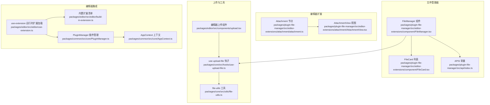
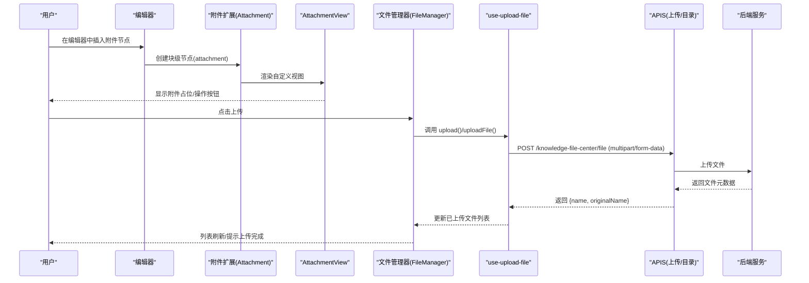
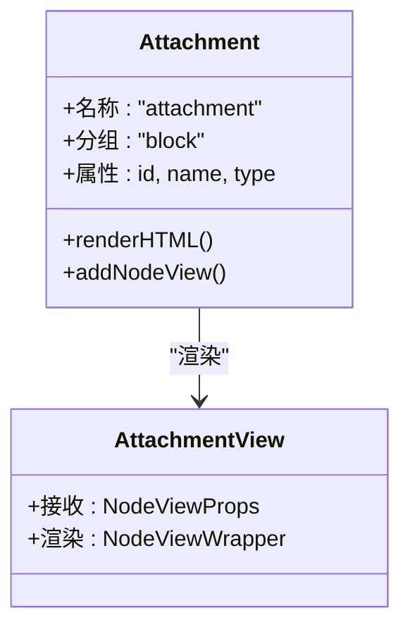
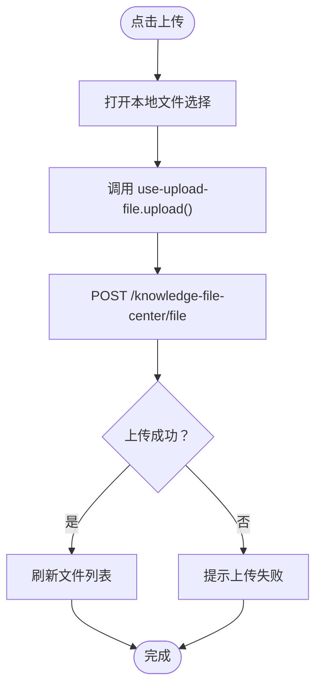
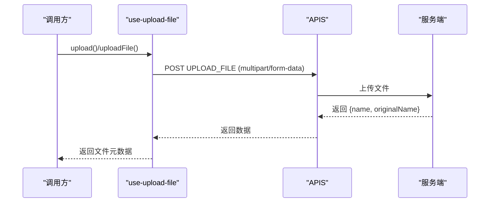
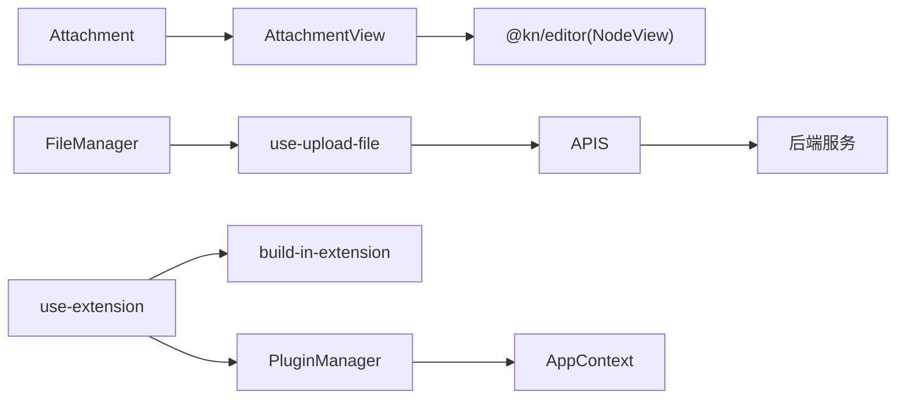

# 附件处理

<cite>
**本文引用的文件**
- [packages/plugin-file-manager/src/editor-extensions/attachment/AttachmentView.tsx](file://packages/plugin-file-manager/src/editor-extensions/attachment/AttachmentView.tsx)
- [packages/plugin-file-manager/src/editor-extensions/attachment/attachment.ts](file://packages/plugin-file-manager/src/editor-extensions/attachment/attachment.ts)
- [packages/plugin-file-manager/src/editor-extensions/component/FileManager.tsx](file://packages/plugin-file-manager/src/editor-extensions/component/FileManager.tsx)
- [packages/plugin-file-manager/src/editor-extensions/component/FileCard.tsx](file://packages/plugin-file-manager/src/editor-extensions/component/FileCard.tsx)
- [packages/plugin-file-manager/src/api/index.ts](file://packages/plugin-file-manager/src/api/index.ts)
- [packages/core/src/hooks/use-upload-file.ts](file://packages/core/src/hooks/use-upload-file.ts)
- [packages/core/src/utils/file-utils.ts](file://packages/core/src/utils/file-utils.ts)
- [packages/editor/src/components/upload.tsx](file://packages/editor/src/components/upload.tsx)
- [packages/editor/src/editor/use-extension.ts](file://packages/editor/src/editor/use-extension.ts)
- [packages/editor/src/editor/build-in-extension.ts](file://packages/editor/src/editor/build-in-extension.ts)
- [packages/common/src/core/PluginManager.ts](file://packages/common/src/core/PluginManager.ts)
- [packages/common/src/core/AppContext.ts](file://packages/common/src/core/AppContext.ts)
</cite>

## 目录
1. [简介](#简介)
2. [项目结构](#项目结构)
3. [核心组件](#核心组件)
4. [架构总览](#架构总览)
5. [组件详解](#组件详解)
6. [依赖关系分析](#依赖关系分析)
7. [性能与可用性建议](#性能与可用性建议)
8. [故障排查指南](#故障排查指南)
9. [结论](#结论)
10. [附录：使用示例与最佳实践](#附录使用示例与最佳实践)

## 简介
本文件围绕“附件处理”能力进行系统化文档化，覆盖编辑器中的附件节点定义、渲染视图、文件管理器、上传流程、下载与删除、类型识别与安全校验、批量与拖拽上传、进度反馈、存储与缓存策略等。重点解析附件扩展的实现（AttachmentView 组件与 attachment.ts 扩展），并给出在编辑器中插入与管理附件的具体使用步骤与注意事项。

## 项目结构
附件处理相关代码主要分布在以下模块：
- 编辑器扩展层：定义附件节点与视图，负责在编辑器中以块级节点呈现附件。
- 文件管理器组件层：提供文件选择、上传、列表展示、下载、删除等交互。
- 工具与钩子层：封装浏览器文件选择、上传 API 调用、路径拼接与状态管理。
- 插件与上下文层：通过插件管理器动态加载扩展，编辑器运行时整合内置与插件扩展。

图表来源
- [packages/plugin-file-manager/src/editor-extensions/attachment/attachment.ts](file://packages/plugin-file-manager/src/editor-extensions/attachment/attachment.ts#L1-L29)
- [packages/plugin-file-manager/src/editor-extensions/attachment/AttachmentView.tsx](file://packages/plugin-file-manager/src/editor-extensions/attachment/AttachmentView.tsx#L1-L9)
- [packages/plugin-file-manager/src/editor-extensions/component/FileManager.tsx](file://packages/plugin-file-manager/src/editor-extensions/component/FileManager.tsx#L1-L327)
- [packages/plugin-file-manager/src/editor-extensions/component/FileCard.tsx](file://packages/plugin-file-manager/src/editor-extensions/component/FileCard.tsx#L1-L93)
- [packages/plugin-file-manager/src/api/index.ts](file://packages/plugin-file-manager/src/api/index.ts#L1-L27)
- [packages/core/src/hooks/use-upload-file.ts](file://packages/core/src/hooks/use-upload-file.ts#L1-L59)
- [packages/core/src/utils/file-utils.ts](file://packages/core/src/utils/file-utils.ts#L1-L13)
- [packages/editor/src/components/upload.tsx](file://packages/editor/src/components/upload.tsx#L1-L30)
- [packages/editor/src/editor/use-extension.ts](file://packages/editor/src/editor/use-extension.ts#L1-L63)
- [packages/editor/src/editor/build-in-extension.ts](file://packages/editor/src/editor/build-in-extension.ts#L1-L56)
- [packages/common/src/core/PluginManager.ts](file://packages/common/src/core/PluginManager.ts#L76-L144)
- [packages/common/src/core/AppContext.ts](file://packages/common/src/core/AppContext.ts#L1-L13)

章节来源
- [packages/plugin-file-manager/src/editor-extensions/attachment/attachment.ts](file://packages/plugin-file-manager/src/editor-extensions/attachment/attachment.ts#L1-L29)
- [packages/plugin-file-manager/src/editor-extensions/attachment/AttachmentView.tsx](file://packages/plugin-file-manager/src/editor-extensions/attachment/AttachmentView.tsx#L1-L9)
- [packages/plugin-file-manager/src/editor-extensions/component/FileManager.tsx](file://packages/plugin-file-manager/src/editor-extensions/component/FileManager.tsx#L1-L327)
- [packages/plugin-file-manager/src/editor-extensions/component/FileCard.tsx](file://packages/plugin-file-manager/src/editor-extensions/component/FileCard.tsx#L1-L93)
- [packages/plugin-file-manager/src/api/index.ts](file://packages/plugin-file-manager/src/api/index.ts#L1-L27)
- [packages/core/src/hooks/use-upload-file.ts](file://packages/core/src/hooks/use-upload-file.ts#L1-L59)
- [packages/core/src/utils/file-utils.ts](file://packages/core/src/utils/file-utils.ts#L1-L13)
- [packages/editor/src/components/upload.tsx](file://packages/editor/src/components/upload.tsx#L1-L30)
- [packages/editor/src/editor/use-extension.ts](file://packages/editor/src/editor/use-extension.ts#L1-L63)
- [packages/editor/src/editor/build-in-extension.ts](file://packages/editor/src/editor/build-in-extension.ts#L1-L56)
- [packages/common/src/core/PluginManager.ts](file://packages/common/src/core/PluginManager.ts#L76-L144)
- [packages/common/src/core/AppContext.ts](file://packages/common/src/core/AppContext.ts#L1-L13)

## 核心组件
- 附件节点与视图
  - 附件节点：在编辑器中以块级节点形式存在，具备 id、name、type 等属性，并通过 ReactNodeViewRenderer 渲染自定义视图。
  - 附件视图：当前为空白容器，用于承载附件的 UI 展示与交互占位。
- 文件管理器
  - 提供树形导航、文件卡片列表、上传、下载、删除、选择确认等能力；支持根目录与子目录浏览。
- 上传工具与钩子
  - use-upload-file：封装浏览器文件选择、multipart/form-data 上传、返回服务器侧文件元数据、路径拼接与移除。
  - file-utils：提供通用上传入口，复用 use-upload-file 的 API 调用。
- 编辑器集成
  - use-extension：统一加载内置扩展与插件扩展，支持按需过滤与唯一 ID 配置。
  - PluginManager/AppContext：插件生命周期管理与全局上下文注入。

章节来源
- [packages/plugin-file-manager/src/editor-extensions/attachment/attachment.ts](file://packages/plugin-file-manager/src/editor-extensions/attachment/attachment.ts#L1-L29)
- [packages/plugin-file-manager/src/editor-extensions/attachment/AttachmentView.tsx](file://packages/plugin-file-manager/src/editor-extensions/attachment/AttachmentView.tsx#L1-L9)
- [packages/plugin-file-manager/src/editor-extensions/component/FileManager.tsx](file://packages/plugin-file-manager/src/editor-extensions/component/FileManager.tsx#L1-L327)
- [packages/plugin-file-manager/src/editor-extensions/component/FileCard.tsx](file://packages/plugin-file-manager/src/editor-extensions/component/FileCard.tsx#L1-L93)
- [packages/core/src/hooks/use-upload-file.ts](file://packages/core/src/hooks/use-upload-file.ts#L1-L59)
- [packages/core/src/utils/file-utils.ts](file://packages/core/src/utils/file-utils.ts#L1-L13)
- [packages/editor/src/editor/use-extension.ts](file://packages/editor/src/editor/use-extension.ts#L1-L63)
- [packages/common/src/core/PluginManager.ts](file://packages/common/src/core/PluginManager.ts#L76-L144)
- [packages/common/src/core/AppContext.ts](file://packages/common/src/core/AppContext.ts#L1-L13)

## 架构总览
附件处理从“编辑器节点定义”到“文件管理器上传”，再到“服务端 API”的完整链路如下：

图表来源
- [packages/plugin-file-manager/src/editor-extensions/attachment/attachment.ts](file://packages/plugin-file-manager/src/editor-extensions/attachment/attachment.ts#L1-L29)
- [packages/plugin-file-manager/src/editor-extensions/attachment/AttachmentView.tsx](file://packages/plugin-file-manager/src/editor-extensions/attachment/AttachmentView.tsx#L1-L9)
- [packages/plugin-file-manager/src/editor-extensions/component/FileManager.tsx](file://packages/plugin-file-manager/src/editor-extensions/component/FileManager.tsx#L85-L116)
- [packages/core/src/hooks/use-upload-file.ts](file://packages/core/src/hooks/use-upload-file.ts#L20-L59)
- [packages/plugin-file-manager/src/api/index.ts](file://packages/plugin-file-manager/src/api/index.ts#L1-L27)

## 组件详解

### 附件节点与视图（AttachmentView 与 attachment.ts）
- 节点定义
  - 名称：attachment
  - 分组：block
  - 属性：id、name、type（默认值为 null）
  - HTML 渲染：包裹一个带类名的 div 容器
  - 节点视图：通过 ReactNodeViewRenderer 渲染 AttachmentView
- 视图实现
  - 当前为最小化包装器，后续可在此处扩展预览、下载、删除等交互

图表来源
- [packages/plugin-file-manager/src/editor-extensions/attachment/attachment.ts](file://packages/plugin-file-manager/src/editor-extensions/attachment/attachment.ts#L1-L29)
- [packages/plugin-file-manager/src/editor-extensions/attachment/AttachmentView.tsx](file://packages/plugin-file-manager/src/editor-extensions/attachment/AttachmentView.tsx#L1-L9)

章节来源
- [packages/plugin-file-manager/src/editor-extensions/attachment/attachment.ts](file://packages/plugin-file-manager/src/editor-extensions/attachment/attachment.ts#L1-L29)
- [packages/plugin-file-manager/src/editor-extensions/attachment/AttachmentView.tsx](file://packages/plugin-file-manager/src/editor-extensions/attachment/AttachmentView.tsx#L1-L9)

### 文件管理器（FileManager）与文件卡片（FileCard）
- 功能概览
  - 导航菜单：首页、最近、收藏、回收站等
  - 目录树：根目录与子目录切换
  - 文件卡片：双击进入目录、右键多选、工具栏操作（上传、删除、下载、确认）
  - 上传流程：调用 use-upload-file，提交 multipart/form-data，成功后刷新列表
- 关键交互
  - 上传：createFile('FILE') -> use-upload-file.upload() -> API.UPLOAD_FILE -> 刷新列表
  - 删除：预留 handleDelete 回调（当前未实现具体逻辑）
  - 下载：FileCard 中提供下载图标按钮（当前未绑定具体下载逻辑）

图表来源
- [packages/plugin-file-manager/src/editor-extensions/component/FileManager.tsx](file://packages/plugin-file-manager/src/editor-extensions/component/FileManager.tsx#L85-L116)
- [packages/core/src/hooks/use-upload-file.ts](file://packages/core/src/hooks/use-upload-file.ts#L20-L59)
- [packages/plugin-file-manager/src/api/index.ts](file://packages/plugin-file-manager/src/api/index.ts#L1-L27)

章节来源
- [packages/plugin-file-manager/src/editor-extensions/component/FileManager.tsx](file://packages/plugin-file-manager/src/editor-extensions/component/FileManager.tsx#L1-L327)
- [packages/plugin-file-manager/src/editor-extensions/component/FileCard.tsx](file://packages/plugin-file-manager/src/editor-extensions/component/FileCard.tsx#L1-L93)

### 上传工具与 API（use-upload-file 与 APIS）
- use-upload-file
  - upload(type[]): 通过浏览器文件选择器选择文件，构造 multipart/form-data 并上传
  - uploadFile(file: File): 直接上传指定 File 对象
  - remove(path: string): 从已上传列表移除
  - usePath(fileName: string): 拼接下载路径
- APIS
  - UPLOAD_FILE: POST /knowledge-file-center/file
  - GET_ROOT_FOLDER / GET_CHILDREN: 获取目录与子项
  - CREATE_FOLDER: POST /knowledge-file-center/file（用于创建文件记录）

图表来源
- [packages/core/src/hooks/use-upload-file.ts](file://packages/core/src/hooks/use-upload-file.ts#L1-L59)
- [packages/plugin-file-manager/src/api/index.ts](file://packages/plugin-file-manager/src/api/index.ts#L1-L27)

章节来源
- [packages/core/src/hooks/use-upload-file.ts](file://packages/core/src/hooks/use-upload-file.ts#L1-L59)
- [packages/plugin-file-manager/src/api/index.ts](file://packages/plugin-file-manager/src/api/index.ts#L1-L27)

### 编辑器集成与扩展加载
- use-extension
  - 统一加载内置扩展与插件扩展，支持过滤特定扩展与唯一 ID 配置
- build-in-extension
  - 内置扩展清单，作为编辑器基础能力集合
- PluginManager/AppContext
  - 插件安装/卸载、远程脚本加载、事件刷新与全局上下文提供

章节来源
- [packages/editor/src/editor/use-extension.ts](file://packages/editor/src/editor/use-extension.ts#L1-L63)
- [packages/editor/src/editor/build-in-extension.ts](file://packages/editor/src/editor/build-in-extension.ts#L1-L56)
- [packages/common/src/core/PluginManager.ts](file://packages/common/src/core/PluginManager.ts#L76-L144)
- [packages/common/src/core/AppContext.ts](file://packages/common/src/core/AppContext.ts#L1-L13)

## 依赖关系分析
- 低耦合高内聚
  - 附件扩展仅依赖编辑器提供的 NodeView 渲染接口，不直接依赖文件管理器，便于复用与替换。
  - 文件管理器通过 use-upload-file 与 APIS 解耦业务与传输层。
- 外部依赖
  - 浏览器文件选择器 browser-fs-access
  - 编辑器框架（@kn/editor、@tiptap/core）
  - UI 组件库（@kn/ui、@kn/icon）

图表来源
- [packages/plugin-file-manager/src/editor-extensions/attachment/AttachmentView.tsx](file://packages/plugin-file-manager/src/editor-extensions/attachment/AttachmentView.tsx#L1-L9)
- [packages/plugin-file-manager/src/editor-extensions/attachment/attachment.ts](file://packages/plugin-file-manager/src/editor-extensions/attachment/attachment.ts#L1-L29)
- [packages/plugin-file-manager/src/editor-extensions/component/FileManager.tsx](file://packages/plugin-file-manager/src/editor-extensions/component/FileManager.tsx#L1-L327)
- [packages/core/src/hooks/use-upload-file.ts](file://packages/core/src/hooks/use-upload-file.ts#L1-L59)
- [packages/plugin-file-manager/src/api/index.ts](file://packages/plugin-file-manager/src/api/index.ts#L1-L27)
- [packages/editor/src/editor/use-extension.ts](file://packages/editor/src/editor/use-extension.ts#L1-L63)
- [packages/editor/src/editor/build-in-extension.ts](file://packages/editor/src/editor/build-in-extension.ts#L1-L56)
- [packages/common/src/core/PluginManager.ts](file://packages/common/src/core/PluginManager.ts#L76-L144)
- [packages/common/src/core/AppContext.ts](file://packages/common/src/core/AppContext.ts#L1-L13)

## 性能与可用性建议
- 上传性能
  - 使用浏览器原生文件选择器，避免在前端对大文件做重复读写。
  - 合理设置 Content-Type 为 multipart/form-data，确保服务端正确解析。
- UI 反馈
  - 在 FileManager 中增加上传进度条与取消上传能力（当前 UI 未展示进度）。
  - 对于大量文件，采用虚拟滚动或分页加载减少 DOM 压力。
- 存储与缓存
  - use-upload-file.usePath 提供统一下载路径拼接，建议结合 CDN 与缓存头优化访问速度。
  - 附件视图可引入懒加载与缩略图缓存，降低首屏渲染成本。
- 错误处理
  - 上传失败时提供重试与错误提示，避免静默失败。
  - 对空文件、超限文件与非法类型进行前端拦截与提示。

[本节为通用建议，无需列出章节来源]

## 故障排查指南
- 无法选择文件
  - 检查浏览器是否支持 browser-fs-access，确认 MIME 类型过滤是否过严。
- 上传失败
  - 查看 APIS 上传接口返回与网络状态；确认服务端允许的文件大小与类型。
- 附件节点不显示内容
  - 确认 AttachmentView 是否被正确渲染；检查编辑器扩展是否已加载。
- 文件列表不刷新
  - 确认 FileManager 的 updateFlag 是否更新；检查 use-upload-file 返回的数据结构与 API 响应一致。

章节来源
- [packages/core/src/hooks/use-upload-file.ts](file://packages/core/src/hooks/use-upload-file.ts#L1-L59)
- [packages/plugin-file-manager/src/api/index.ts](file://packages/plugin-file-manager/src/api/index.ts#L1-L27)
- [packages/plugin-file-manager/src/editor-extensions/attachment/AttachmentView.tsx](file://packages/plugin-file-manager/src/editor-extensions/attachment/AttachmentView.tsx#L1-L9)
- [packages/plugin-file-manager/src/editor-extensions/component/FileManager.tsx](file://packages/plugin-file-manager/src/editor-extensions/component/FileManager.tsx#L1-L327)

## 结论
附件处理在当前代码库中实现了“编辑器节点 + 文件管理器 + 上传钩子 + API 接口”的闭环。附件节点提供统一的块级容器，文件管理器负责上传与列表管理，use-upload-file 抽象了浏览器文件选择与 multipart 上传，APIS 定义了与服务端的契约。后续可在附件视图中完善预览、下载、删除等交互，并在 FileManager 中补充进度反馈与批量操作能力。

[本节为总结，无需列出章节来源]

## 附录：使用示例与最佳实践

### 在编辑器中插入附件
- 步骤
  - 通过编辑器扩展加载机制（use-extension）确保附件扩展已注册。
  - 在编辑器中触发插入逻辑，创建名为 attachment 的块级节点。
  - 附件视图将作为该节点的渲染容器，后续可在此处添加下载、删除、预览等操作。
- 参考路径
  - [packages/plugin-file-manager/src/editor-extensions/attachment/attachment.ts](file://packages/plugin-file-manager/src/editor-extensions/attachment/attachment.ts#L1-L29)
  - [packages/plugin-file-manager/src/editor-extensions/attachment/AttachmentView.tsx](file://packages/plugin-file-manager/src/editor-extensions/attachment/AttachmentView.tsx#L1-L9)
  - [packages/editor/src/editor/use-extension.ts](file://packages/editor/src/editor/use-extension.ts#L1-L63)

章节来源
- [packages/plugin-file-manager/src/editor-extensions/attachment/attachment.ts](file://packages/plugin-file-manager/src/editor-extensions/attachment/attachment.ts#L1-L29)
- [packages/plugin-file-manager/src/editor-extensions/attachment/AttachmentView.tsx](file://packages/plugin-file-manager/src/editor-extensions/attachment/AttachmentView.tsx#L1-L9)
- [packages/editor/src/editor/use-extension.ts](file://packages/editor/src/editor/use-extension.ts#L1-L63)

### 上传、下载、删除与预览
- 上传
  - 通过 FileManager 的上传按钮触发 use-upload-file.upload()，提交 multipart/form-data。
  - 成功后刷新列表并提示“上传完成”。
- 下载
  - 使用 use-upload-file.usePath 拼接下载地址，或在 FileManager 的 FileCard 中绑定下载图标事件。
- 删除
  - FileManager 提供 handleDelete 回调（当前未实现），可扩展为调用删除 API 并刷新列表。
- 预览
  - 在 AttachmentView 中根据文件类型与后缀进行预览渲染（当前为空白容器，可扩展）。

章节来源
- [packages/plugin-file-manager/src/editor-extensions/component/FileManager.tsx](file://packages/plugin-file-manager/src/editor-extensions/component/FileManager.tsx#L85-L116)
- [packages/core/src/hooks/use-upload-file.ts](file://packages/core/src/hooks/use-upload-file.ts#L20-L59)
- [packages/plugin-file-manager/src/editor-extensions/component/FileCard.tsx](file://packages/plugin-file-manager/src/editor-extensions/component/FileCard.tsx#L1-L93)

### 类型识别、大小限制与安全验证
- 类型识别
  - 通过浏览器文件选择器的 mimeTypes 参数进行类型过滤；在 FileManager 中可扩展为根据后缀或 MIME 进行二次判断。
- 大小限制
  - 建议在前端对文件大小进行校验并在上传前提示；服务端也应配置相应限制。
- 安全验证
  - 服务端应对文件类型、大小、病毒扫描与访问权限进行严格校验；客户端仅作友好提示。

[本节为通用指导，无需列出章节来源]

### 批量上传、拖拽上传与进度显示
- 批量上传
  - 在 FileManager 中支持多选与批量上传，结合 use-upload-file.upload() 循环处理。
- 拖拽上传
  - 可在 FileManager 区域监听拖拽事件，将文件列表转换为 use-upload-file.uploadFile() 调用。
- 进度显示
  - 建议在 UI 中增加进度条组件与取消上传能力，提升用户体验。

[本节为通用指导，无需列出章节来源]

### 附件存储与缓存策略
- 存储
  - 通过 use-upload-file.usePath 拼接统一下载地址，结合 CDN 与缓存头优化访问。
- 缓存
  - 附件视图可引入缩略图缓存与懒加载，减少首屏渲染压力；对常用文件建立本地缓存策略。

[本节为通用指导，无需列出章节来源]