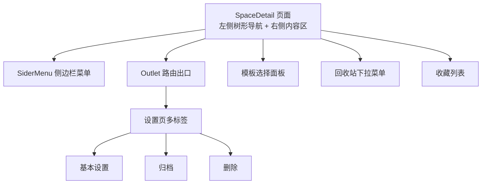
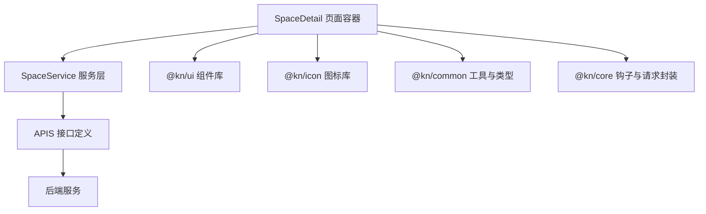
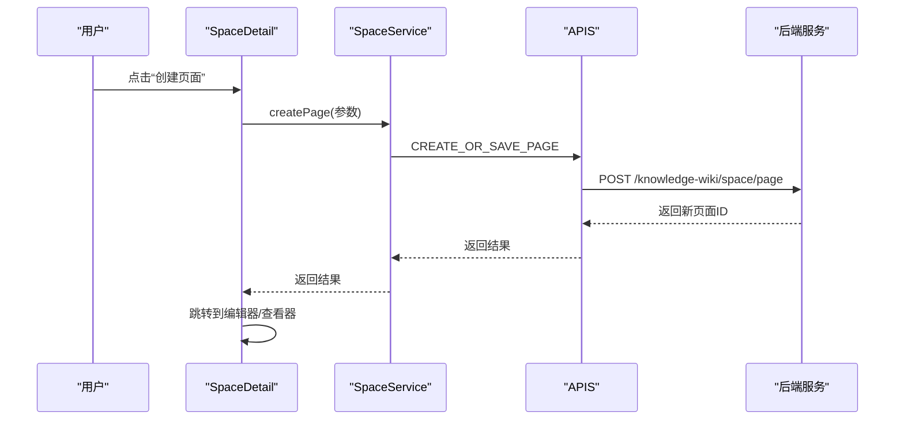
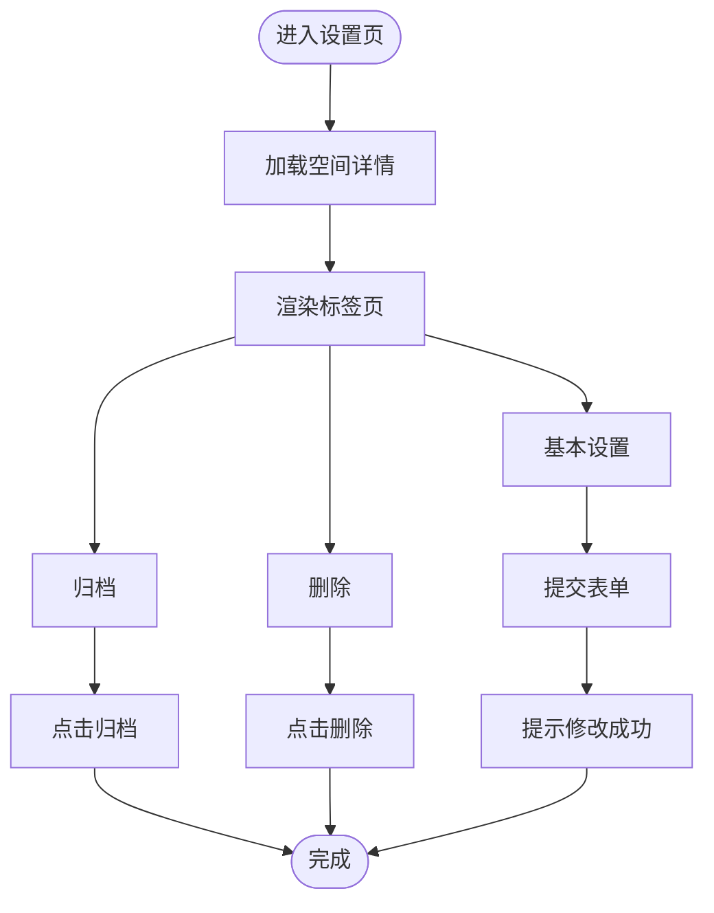
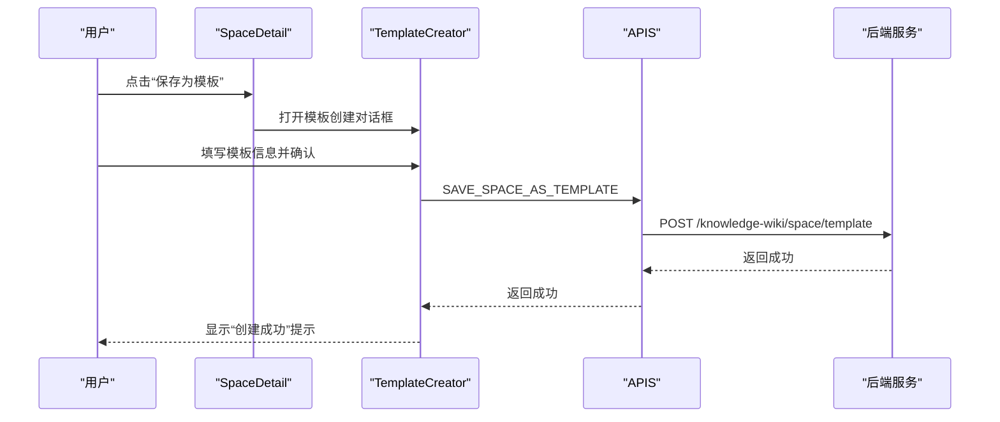
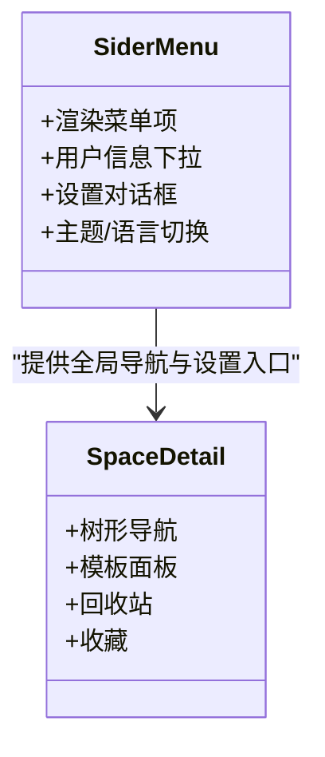
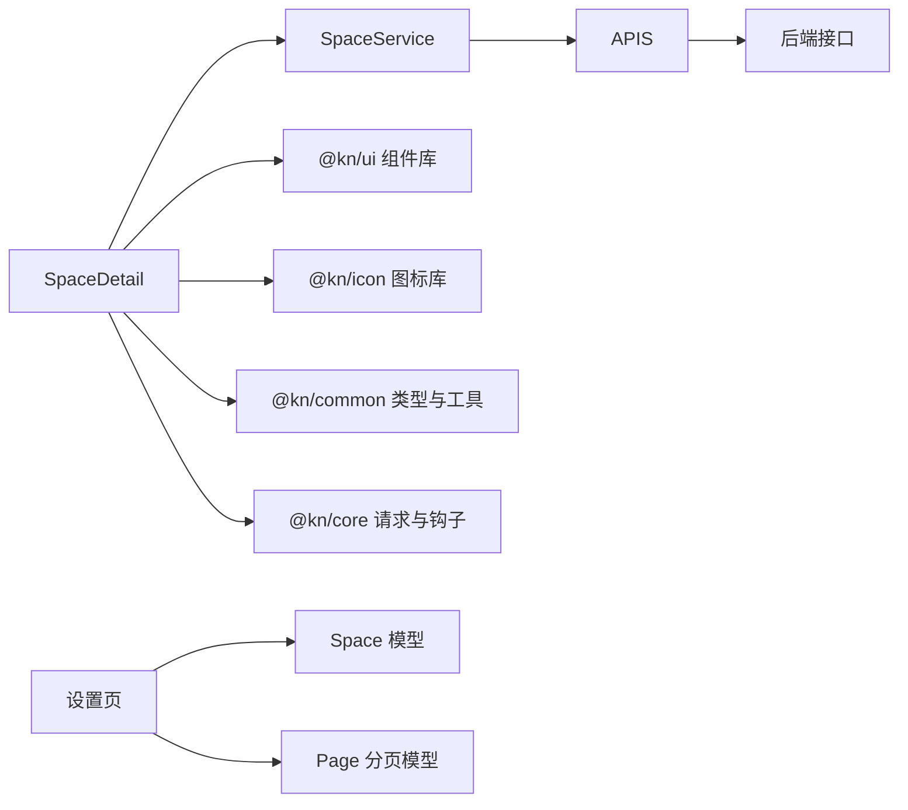

# 内容组织

<cite>
**本文引用的文件**
- [packages/plugin-main/src/pages/SpaceDetail/index.tsx](file://packages/plugin-main/src/pages/SpaceDetail/index.tsx)
- [packages/plugin-main/src/pages/SpaceDetail/Settings/index.tsx](file://packages/plugin-main/src/pages/SpaceDetail/Settings/index.tsx)
- [packages/plugin-main/src/pages/SpaceDetail/Settings/Basic/index.tsx](file://packages/plugin-main/src/pages/SpaceDetail/Settings/Basic/index.tsx)
- [packages/plugin-main/src/pages/SpaceDetail/Settings/Archive/index.tsx](file://packages/plugin-main/src/pages/SpaceDetail/Settings/Archive/index.tsx)
- [packages/plugin-main/src/pages/SpaceDetail/Settings/Delete/index.tsx](file://packages/plugin-main/src/pages/SpaceDetail/Settings/Delete/index.tsx)
- [packages/plugin-main/src/pages/SpaceDetail/TemplateCreator/index.tsx](file://packages/plugin-main/src/pages/SpaceDetail/TemplateCreator/index.tsx)
- [packages/plugin-main/src/service/space-service.ts](file://packages/plugin-main/src/service/space-service.ts)
- [packages/plugin-main/src/api/index.ts](file://packages/plugin-main/src/api/index.ts)
- [packages/common/src/entity/Page.ts](file://packages/common/src/entity/Page.ts)
- [packages/plugin-main/src/model/Space.ts](file://packages/plugin-main/src/model/Space.ts)
- [packages/core/src/components/SiderMenu.tsx](file://packages/core/src/components/SiderMenu.tsx)
</cite>

## 目录
1. [引言](#引言)
2. [项目结构](#项目结构)
3. [核心组件](#核心组件)
4. [架构总览](#架构总览)
5. [详细组件分析](#详细组件分析)
6. [依赖关系分析](#依赖关系分析)
7. [性能考量](#性能考量)
8. [故障排查指南](#故障排查指南)
9. [结论](#结论)
10. [附录](#附录)

## 引言
本文件围绕“知识库的内容组织”主题，聚焦于“空间详情页面”的结构与功能，涵盖页面导航、侧边栏菜单、设置选项、内容结构管理（页面分类、标签系统、搜索）、权限控制、备份与恢复、以及数据迁移等实现方案。文档以空间详情页为中心，串联设置页、模板机制、收藏与回收站等功能模块，帮助读者快速理解并实践空间的组织与治理。

## 项目结构
空间详情页面由“左侧树形导航 + 右侧内容区”构成，右侧通过路由出口承载具体页面（如页面编辑器、页面查看器、设置页等）。设置页采用多标签页组织“基本设置、页面设置、人员设置、归档、删除”等子模块。模板创建器支持将空间保存为模板，便于复用。

图表来源
- [packages/plugin-main/src/pages/SpaceDetail/index.tsx](file://packages/plugin-main/src/pages/SpaceDetail/index.tsx#L396-L476)
- [packages/core/src/components/SiderMenu.tsx](file://packages/core/src/components/SiderMenu.tsx#L152-L171)
- [packages/plugin-main/src/pages/SpaceDetail/Settings/index.tsx](file://packages/plugin-main/src/pages/SpaceDetail/Settings/index.tsx#L15-L63)

章节来源
- [packages/plugin-main/src/pages/SpaceDetail/index.tsx](file://packages/plugin-main/src/pages/SpaceDetail/index.tsx#L396-L476)
- [packages/plugin-main/src/pages/SpaceDetail/Settings/index.tsx](file://packages/plugin-main/src/pages/SpaceDetail/Settings/index.tsx#L15-L63)

## 核心组件
- 空间详情页（SpaceDetail）
  - 负责加载空间信息、构建树形导航、处理页面创建/模板创建、收藏、回收站、搜索等交互。
  - 关键职责：获取空间详情、渲染侧边栏菜单、树形页面浏览、模板选择、回收站操作、收藏管理。
- 设置页（SpaceSettings）
  - 提供多标签页设置入口，上下文传递当前空间对象，子页负责具体配置项。
- 基本设置（Basic）
  - 支持空间图标、封面、名称、描述的编辑与提交。
- 归档设置（Archive）
  - 提供空间归档提示与按钮。
- 删除设置（Delete）
  - 提供空间删除提示与按钮。
- 模板创建器（TemplateCreator）
  - 将当前空间保存为模板，支持封面上传、描述填写等。

章节来源
- [packages/plugin-main/src/pages/SpaceDetail/index.tsx](file://packages/plugin-main/src/pages/SpaceDetail/index.tsx#L24-L180)
- [packages/plugin-main/src/pages/SpaceDetail/Settings/index.tsx](file://packages/plugin-main/src/pages/SpaceDetail/Settings/index.tsx#L15-L63)
- [packages/plugin-main/src/pages/SpaceDetail/Settings/Basic/index.tsx](file://packages/plugin-main/src/pages/SpaceDetail/Settings/Basic/index.tsx#L17-L113)
- [packages/plugin-main/src/pages/SpaceDetail/Settings/Archive/index.tsx](file://packages/plugin-main/src/pages/SpaceDetail/Settings/Archive/index.tsx#L1-L17)
- [packages/plugin-main/src/pages/SpaceDetail/Settings/Delete/index.tsx](file://packages/plugin-main/src/pages/SpaceDetail/Settings/Delete/index.tsx#L1-L17)
- [packages/plugin-main/src/pages/SpaceDetail/TemplateCreator/index.tsx](file://packages/plugin-main/src/pages/SpaceDetail/TemplateCreator/index.tsx#L1-L128)

## 架构总览
空间详情页面的前端架构以“页面容器 + 服务层 + API 定义 + UI 组件库”分层组织。页面容器负责状态与交互，服务层封装空间与页面相关接口，API 定义集中管理后端接口，UI 组件库提供通用控件与布局。

图表来源
- [packages/plugin-main/src/pages/SpaceDetail/index.tsx](file://packages/plugin-main/src/pages/SpaceDetail/index.tsx#L1-L60)
- [packages/plugin-main/src/service/space-service.ts](file://packages/plugin-main/src/service/space-service.ts#L1-L59)
- [packages/plugin-main/src/api/index.ts](file://packages/plugin-main/src/api/index.ts#L1-L120)

## 详细组件分析

### 空间详情页面（SpaceDetail）
- 导航与布局
  - 左侧树形导航：包含“概览、搜索输入、收藏、页面树、模板、设置、回收站、保存为模板”等节点。
  - 右侧通过 Outlet 承载子页面（如页面编辑器、查看器、设置页）。
- 数据与状态
  - 加载空间详情、页面树、收藏列表、回收站条目；支持按关键字搜索页面。
  - 使用事件总线刷新页面树与收藏列表。
- 功能点
  - 创建页面（支持从模板创建或直接新建）。
  - 移动到回收站、恢复页面。
  - 收藏/取消收藏空间。
  - 模板选择与保存为模板。
  - 快捷命令面板（创建页面、跳转个人空间）。

图表来源
- [packages/plugin-main/src/pages/SpaceDetail/index.tsx](file://packages/plugin-main/src/pages/SpaceDetail/index.tsx#L107-L138)
- [packages/plugin-main/src/service/space-service.ts](file://packages/plugin-main/src/service/space-service.ts#L39-L42)
- [packages/plugin-main/src/api/index.ts](file://packages/plugin-main/src/api/index.ts#L44-L47)

章节来源
- [packages/plugin-main/src/pages/SpaceDetail/index.tsx](file://packages/plugin-main/src/pages/SpaceDetail/index.tsx#L24-L180)
- [packages/plugin-main/src/service/space-service.ts](file://packages/plugin-main/src/service/space-service.ts#L1-L59)
- [packages/plugin-main/src/api/index.ts](file://packages/plugin-main/src/api/index.ts#L1-L120)

### 设置页（SpaceSettings）
- 结构
  - 多标签页：基本设置、页面设置、人员设置、归档、删除。
  - 通过上下文向子组件传递当前空间对象。
- 基本设置（Basic）
  - 表单字段：图标、封面、名称、描述。
  - 提交时调用创建空间接口（实际可能为更新）。
- 归档设置（Archive）
  - 提示归档的作用与后续恢复能力。
- 删除设置（Delete）
  - 提示删除风险与管理员恢复能力，提供删除按钮。

图表来源
- [packages/plugin-main/src/pages/SpaceDetail/Settings/index.tsx](file://packages/plugin-main/src/pages/SpaceDetail/Settings/index.tsx#L15-L63)
- [packages/plugin-main/src/pages/SpaceDetail/Settings/Basic/index.tsx](file://packages/plugin-main/src/pages/SpaceDetail/Settings/Basic/index.tsx#L17-L113)
- [packages/plugin-main/src/pages/SpaceDetail/Settings/Archive/index.tsx](file://packages/plugin-main/src/pages/SpaceDetail/Settings/Archive/index.tsx#L1-L17)
- [packages/plugin-main/src/pages/SpaceDetail/Settings/Delete/index.tsx](file://packages/plugin-main/src/pages/SpaceDetail/Settings/Delete/index.tsx#L1-L17)

章节来源
- [packages/plugin-main/src/pages/SpaceDetail/Settings/index.tsx](file://packages/plugin-main/src/pages/SpaceDetail/Settings/index.tsx#L15-L63)
- [packages/plugin-main/src/pages/SpaceDetail/Settings/Basic/index.tsx](file://packages/plugin-main/src/pages/SpaceDetail/Settings/Basic/index.tsx#L17-L113)
- [packages/plugin-main/src/pages/SpaceDetail/Settings/Archive/index.tsx](file://packages/plugin-main/src/pages/SpaceDetail/Settings/Archive/index.tsx#L1-L17)
- [packages/plugin-main/src/pages/SpaceDetail/Settings/Delete/index.tsx](file://packages/plugin-main/src/pages/SpaceDetail/Settings/Delete/index.tsx#L1-L17)

### 模板机制（模板选择与保存）
- 模板选择
  - 点击“模板”打开模板面板，支持搜索与筛选，选择后基于模板创建页面。
- 保存为模板
  - “保存为模板”入口弹出对话框，填写模板名称、描述、封面等，提交后创建模板。

图表来源
- [packages/plugin-main/src/pages/SpaceDetail/index.tsx](file://packages/plugin-main/src/pages/SpaceDetail/index.tsx#L385-L394)
- [packages/plugin-main/src/pages/SpaceDetail/TemplateCreator/index.tsx](file://packages/plugin-main/src/pages/SpaceDetail/TemplateCreator/index.tsx#L1-L128)
- [packages/plugin-main/src/api/index.ts](file://packages/plugin-main/src/api/index.ts#L112-L115)

章节来源
- [packages/plugin-main/src/pages/SpaceDetail/index.tsx](file://packages/plugin-main/src/pages/SpaceDetail/index.tsx#L385-L394)
- [packages/plugin-main/src/pages/SpaceDetail/TemplateCreator/index.tsx](file://packages/plugin-main/src/pages/SpaceDetail/TemplateCreator/index.tsx#L1-L128)
- [packages/plugin-main/src/api/index.ts](file://packages/plugin-main/src/api/index.ts#L112-L115)

### 侧边栏菜单与全局导航
- 侧边栏菜单（SiderMenu）
  - 提供插件中心、消息盒子、设置、用户信息等入口。
  - 用户信息下拉菜单支持个人空间跳转、设置、注销等。
- 全局设置对话框
  - 设置对话框内集成主题切换与语言切换等。

图表来源
- [packages/core/src/components/SiderMenu.tsx](file://packages/core/src/components/SiderMenu.tsx#L1-L171)
- [packages/plugin-main/src/pages/SpaceDetail/index.tsx](file://packages/plugin-main/src/pages/SpaceDetail/index.tsx#L396-L476)

章节来源
- [packages/core/src/components/SiderMenu.tsx](file://packages/core/src/components/SiderMenu.tsx#L1-L171)
- [packages/plugin-main/src/pages/SpaceDetail/index.tsx](file://packages/plugin-main/src/pages/SpaceDetail/index.tsx#L396-L476)

## 依赖关系分析
- 组件耦合
  - SpaceDetail 依赖 SpaceService 与 APIS，用于获取空间信息、页面树、收藏、回收站等。
  - 设置页通过上下文传递空间对象，子组件仅关注自身配置项。
- 数据模型
  - Space：空间基本信息（id、name、homePageId、icon、cover、description）。
  - Page：分页返回结构（records、current、pageSize、total）。
- 外部依赖
  - @kn/ui、@kn/icon、@kn/common、@kn/core 提供 UI 组件、图标、工具与请求封装。

图表来源
- [packages/plugin-main/src/pages/SpaceDetail/index.tsx](file://packages/plugin-main/src/pages/SpaceDetail/index.tsx#L1-L60)
- [packages/plugin-main/src/service/space-service.ts](file://packages/plugin-main/src/service/space-service.ts#L1-L59)
- [packages/plugin-main/src/api/index.ts](file://packages/plugin-main/src/api/index.ts#L1-L120)
- [packages/plugin-main/src/model/Space.ts](file://packages/plugin-main/src/model/Space.ts#L1-L8)
- [packages/common/src/entity/Page.ts](file://packages/common/src/entity/Page.ts#L1-L8)

章节来源
- [packages/plugin-main/src/model/Space.ts](file://packages/plugin-main/src/model/Space.ts#L1-L8)
- [packages/common/src/entity/Page.ts](file://packages/common/src/entity/Page.ts#L1-L8)
- [packages/plugin-main/src/service/space-service.ts](file://packages/plugin-main/src/service/space-service.ts#L1-L59)
- [packages/plugin-main/src/api/index.ts](file://packages/plugin-main/src/api/index.ts#L1-L120)

## 性能考量
- 列表懒加载与分页
  - 页面树与收藏列表采用分页查询，避免一次性加载大量数据。
- 搜索与过滤
  - 支持按关键字搜索页面树，减少无效渲染。
- 按需渲染
  - 模板面板与设置页按需打开，降低初始渲染压力。
- 缓存与事件驱动
  - 通过事件总线触发刷新，避免重复请求与冗余状态更新。

## 故障排查指南
- 页面无法加载或空白
  - 检查空间 ID 参数是否正确，确认 SpaceService 的 getSpaceInfo 是否返回数据。
  - 关注网络请求状态与错误提示。
- 页面树不更新
  - 确认事件总线 ON_PAGE_REFRESH 是否触发，检查 setFlag 递增逻辑。
- 回收站无数据
  - 确认 QUERY_PAGE 接口返回 status=TRASH 的记录，检查分页参数与后端过滤条件。
- 模板创建失败
  - 检查 SAVE_SPACE_AS_TEMPLATE 接口返回，确认封面上传与表单校验是否通过。
- 设置提交无效
  - 检查 Basic 子页表单校验与提交流程，确认 CREATE_SPACE 或对应更新接口是否被调用。

章节来源
- [packages/plugin-main/src/pages/SpaceDetail/index.tsx](file://packages/plugin-main/src/pages/SpaceDetail/index.tsx#L43-L97)
- [packages/plugin-main/src/service/space-service.ts](file://packages/plugin-main/src/service/space-service.ts#L31-L59)
- [packages/plugin-main/src/api/index.ts](file://packages/plugin-main/src/api/index.ts#L84-L115)
- [packages/plugin-main/src/pages/SpaceDetail/Settings/Basic/index.tsx](file://packages/plugin-main/src/pages/SpaceDetail/Settings/Basic/index.tsx#L37-L42)

## 结论
空间详情页面通过清晰的导航与设置体系，实现了内容组织的核心能力：页面树浏览、模板复用、收藏与回收站管理、空间基础信息维护。结合设置页的多标签组织与模板机制，用户可以高效地建立、维护与治理知识空间。建议在生产环境中进一步完善权限控制、标签系统与搜索索引，以满足更复杂的组织需求。

## 附录

### 权限控制、备份恢复与数据迁移方案
- 权限控制
  - 在设置页的“人员设置”标签中，应提供成员角色与权限分配界面，限制对空间的编辑、删除与模板创建权限。
- 备份与恢复
  - 归档页提供空间归档能力，便于隐藏旧内容；删除页提供删除入口，配合管理员恢复策略实现“软删除+恢复”。
- 数据迁移
  - 建议在“页面设置”中增加导出/导入功能，支持将页面内容与结构迁移到其他空间或平台。

[本节为概念性说明，未直接分析具体源码文件，故不附加章节来源]