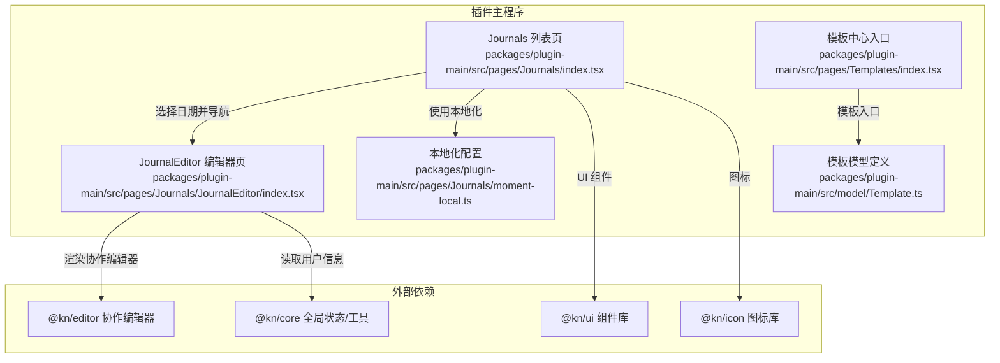
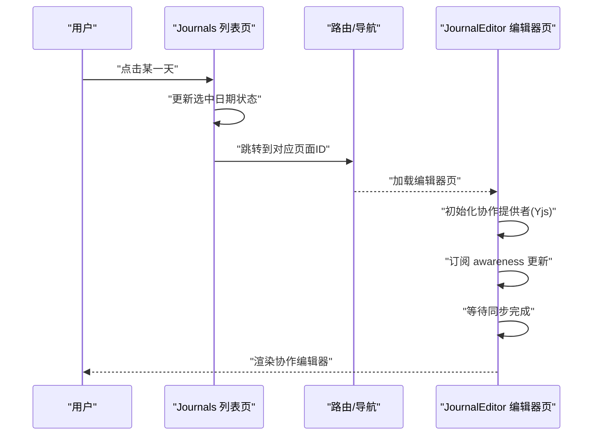
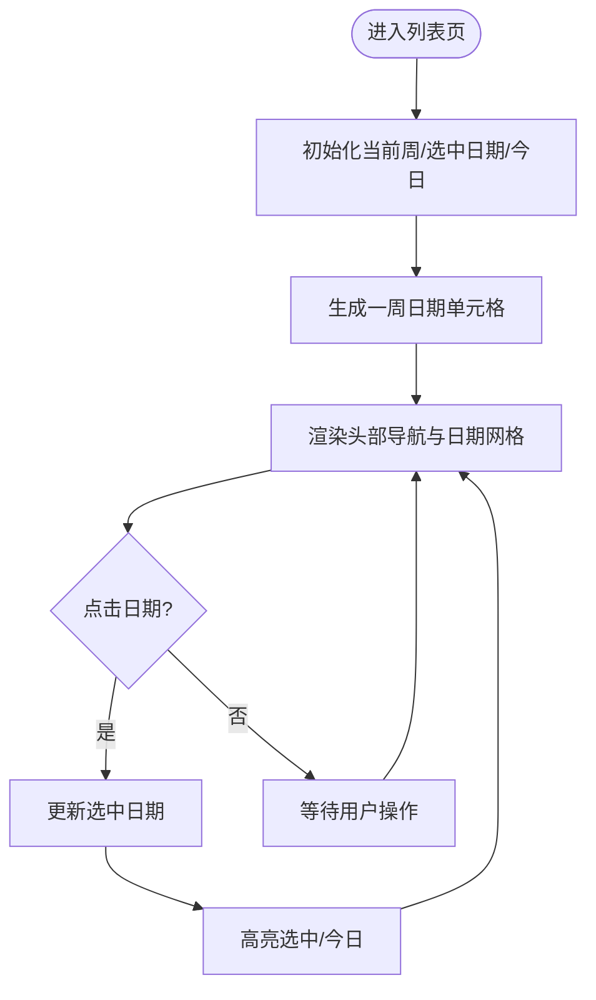
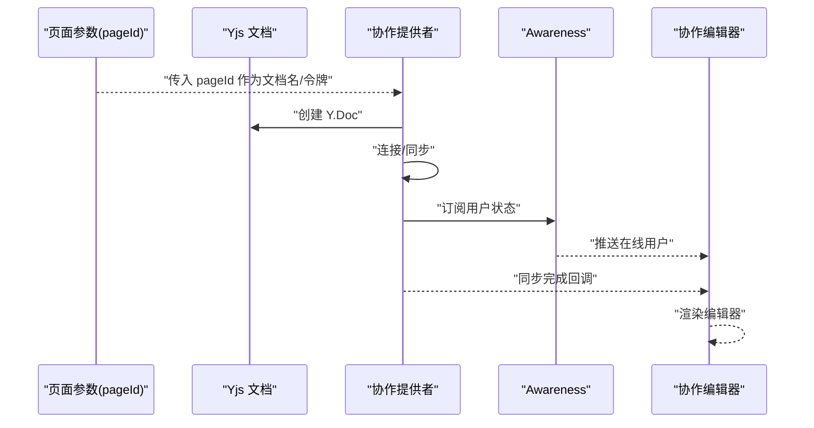
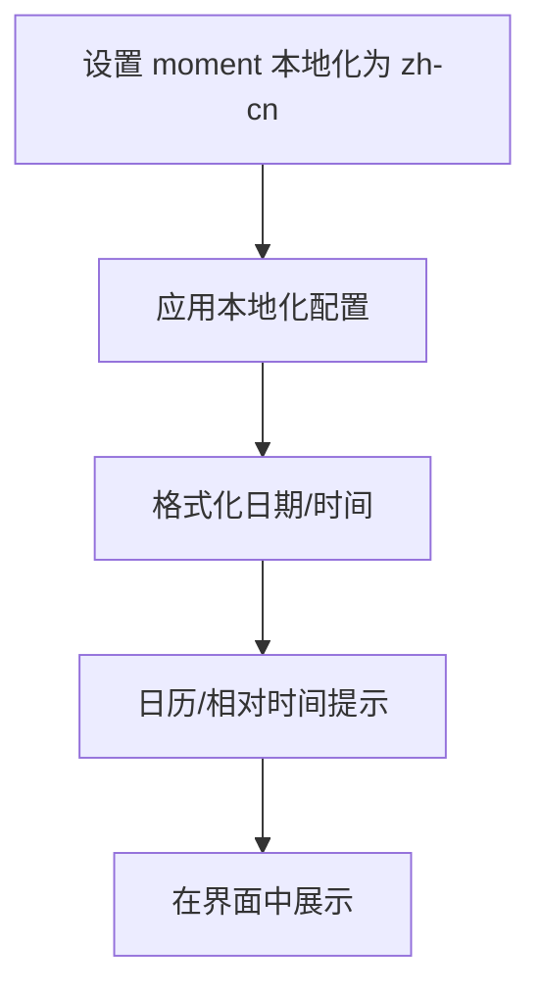
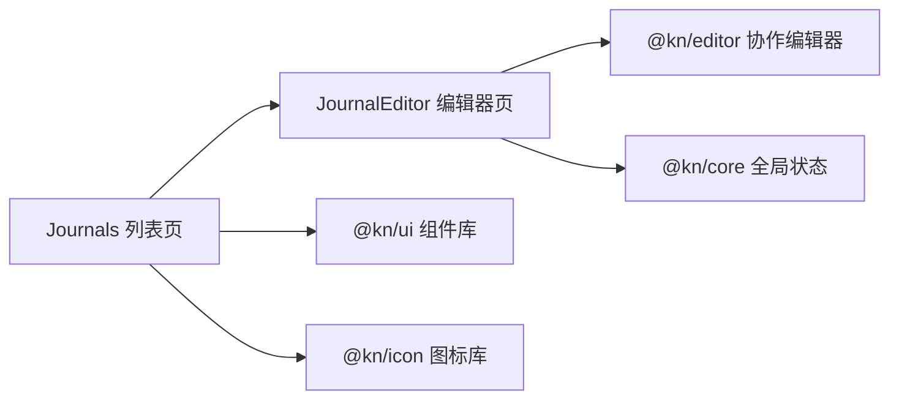

# 日记系统

<cite>
**本文引用的文件**
- [packages/plugin-main/src/pages/Journals/index.tsx](file://packages/plugin-main/src/pages/Journals/index.tsx)
- [packages/plugin-main/src/pages/Journals/JournalEditor/index.tsx](file://packages/plugin-main/src/pages/Journals/JournalEditor/index.tsx)
- [packages/plugin-main/src/pages/Journals/moment-local.ts](file://packages/plugin-main/src/pages/Journals/moment-local.ts)
- [packages/plugin-main/src/model/Template.ts](file://packages/plugin-main/src/model/Template.ts)
- [packages/plugin-main/src/pages/Templates/index.tsx](file://packages/plugin-main/src/pages/Templates/index.tsx)
</cite>

## 目录
1. [引言](#引言)
2. [项目结构](#项目结构)
3. [核心组件](#核心组件)
4. [架构总览](#架构总览)
5. [组件详解](#组件详解)
6. [依赖关系分析](#依赖关系分析)
7. [性能考量](#性能考量)
8. [故障排查指南](#故障排查指南)
9. [结论](#结论)
10. [附录](#附录)

## 引言
本文件面向知识库中的“日记系统”功能，围绕日记页面的设计与实现进行系统化说明。重点覆盖以下方面：
- 日记列表（周视图）的展示与交互
- 日记编辑器的协作能力与集成方式
- 时间轴管理、内容组织与搜索能力的现状与扩展建议
- 编辑器的特殊功能：时间戳标记、快速记录、模板使用
- 本地化支持、日期格式化与时间显示的实现细节
- 使用示例：创建、编辑与管理日记条目的流程

## 项目结构
日记系统由两个主要页面组成：
- 日记列表页：提供周视图的日历选择与日期高亮，用于导航到指定日期的日记
- 日记编辑器页：基于协作编辑器提供多人实时编辑能力

图表来源
- [packages/plugin-main/src/pages/Journals/index.tsx](file://packages/plugin-main/src/pages/Journals/index.tsx#L1-L72)
- [packages/plugin-main/src/pages/Journals/JournalEditor/index.tsx](file://packages/plugin-main/src/pages/Journals/JournalEditor/index.tsx#L1-L54)
- [packages/plugin-main/src/pages/Journals/moment-local.ts](file://packages/plugin-main/src/pages/Journals/moment-local.ts#L1-L111)
- [packages/plugin-main/src/model/Template.ts](file://packages/plugin-main/src/model/Template.ts#L1-L2)
- [packages/plugin-main/src/pages/Templates/index.tsx](file://packages/plugin-main/src/pages/Templates/index.tsx#L1-L9)

章节来源
- [packages/plugin-main/src/pages/Journals/index.tsx](file://packages/plugin-main/src/pages/Journals/index.tsx#L1-L72)
- [packages/plugin-main/src/pages/Journals/JournalEditor/index.tsx](file://packages/plugin-main/src/pages/Journals/JournalEditor/index.tsx#L1-L54)
- [packages/plugin-main/src/pages/Journals/moment-local.ts](file://packages/plugin-main/src/pages/Journals/moment-local.ts#L1-L111)
- [packages/plugin-main/src/model/Template.ts](file://packages/plugin-main/src/model/Template.ts#L1-L2)
- [packages/plugin-main/src/pages/Templates/index.tsx](file://packages/plugin-main/src/pages/Templates/index.tsx#L1-L9)

## 核心组件
- 日记列表（周视图）
  - 状态管理：当前周、选中日期、今日高亮
  - 渲染逻辑：生成一周内的日期单元格，点击切换选中日期
  - 导航控制：左右切换周、回到今天
  - 本地化：通过本地化配置设置中文显示
- 日记编辑器（协作）
  - 协作提供者：基于 Yjs 的协同编辑提供者
  - 用户感知：通过 awareness 实时更新在线用户
  - 同步状态：根据同步状态决定是否渲染编辑器
  - 身份信息：从全局状态读取当前用户信息

章节来源
- [packages/plugin-main/src/pages/Journals/index.tsx](file://packages/plugin-main/src/pages/Journals/index.tsx#L1-L72)
- [packages/plugin-main/src/pages/Journals/JournalEditor/index.tsx](file://packages/plugin-main/src/pages/Journals/JournalEditor/index.tsx#L1-L54)

## 架构总览
下面以序列图展示从“选择日期”到“进入编辑器”的典型流程。

图表来源
- [packages/plugin-main/src/pages/Journals/index.tsx](file://packages/plugin-main/src/pages/Journals/index.tsx#L1-L72)
- [packages/plugin-main/src/pages/Journals/JournalEditor/index.tsx](file://packages/plugin-main/src/pages/Journals/JournalEditor/index.tsx#L1-L54)

## 组件详解

### 日记列表（周视图）
- 功能要点
  - 周视图渲染：按周起止计算并渲染连续日期单元格
  - 交互行为：点击日期更新选中状态；顶部提供左右切换与“回到今天”
  - 视觉反馈：选中日期高亮、当日日期强调色
  - 本地化：通过本地化配置设置月份、星期、日期格式与相对时间
- 数据与状态
  - 当前周、选中日期、今日日期均以时间对象维护
  - 日期格式化采用本地化规则，确保中文显示
- 可扩展点
  - 搜索：可基于选中日期范围与关键词过滤条目
  - 快速记录：在选中日期下提供快捷按钮直达编辑器
  - 模板：在编辑器侧结合模板中心进行模板插入

图表来源
- [packages/plugin-main/src/pages/Journals/index.tsx](file://packages/plugin-main/src/pages/Journals/index.tsx#L1-L72)

章节来源
- [packages/plugin-main/src/pages/Journals/index.tsx](file://packages/plugin-main/src/pages/Journals/index.tsx#L1-L72)

### 日记编辑器（协作）
- 功能要点
  - 协作编辑：基于 Yjs 的实时协同，支持多用户同时编辑
  - 在线用户：通过 awareness 实时感知并展示在线用户
  - 同步状态：仅在同步完成后渲染编辑器，避免未就绪状态
  - 用户身份：从全局状态读取当前用户信息，作为协作标识
- 集成方式
  - 提供者：创建 Y.Doc 并注入协作提供者
  - 参数：使用页面ID作为文档名与令牌，便于唯一识别
- 可扩展点
  - 时间戳标记：可在编辑器扩展中添加“插入时间戳”命令
  - 快速记录：在编辑器菜单或气泡菜单中增加“快速记录”入口
  - 模板使用：结合模板中心，提供“插入模板”命令

图表来源
- [packages/plugin-main/src/pages/Journals/JournalEditor/index.tsx](file://packages/plugin-main/src/pages/Journals/JournalEditor/index.tsx#L1-L54)

章节来源
- [packages/plugin-main/src/pages/Journals/JournalEditor/index.tsx](file://packages/plugin-main/src/pages/Journals/JournalEditor/index.tsx#L1-L54)

### 本地化与日期格式化
- 本地化配置
  - 语言与地区：设置为中文简体
  - 月份/星期/短名称：中文全称与缩写
  - 日期格式：包含长/短等多种格式
  - 相对时间：如“几秒前”、“1 分钟前”等
  - 上午/下午：自定义时段划分与转换
  - 日历提示：同日/次日/上周/下周等人性化提示
- 使用方式
  - 在列表页初始化时应用本地化配置
  - 日期格式化统一使用本地化规则，保证一致的中文显示体验

图表来源
- [packages/plugin-main/src/pages/Journals/index.tsx](file://packages/plugin-main/src/pages/Journals/index.tsx#L1-L10)
- [packages/plugin-main/src/pages/Journals/moment-local.ts](file://packages/plugin-main/src/pages/Journals/moment-local.ts#L1-L111)

章节来源
- [packages/plugin-main/src/pages/Journals/index.tsx](file://packages/plugin-main/src/pages/Journals/index.tsx#L1-L10)
- [packages/plugin-main/src/pages/Journals/moment-local.ts](file://packages/plugin-main/src/pages/Journals/moment-local.ts#L1-L111)

### 模板与内容组织
- 模型定义
  - 模板接口目前为空，可用于后续扩展字段（如标题、内容、分类等）
- 模板中心
  - 模板中心入口存在，可作为模板浏览与选择的统一入口
- 与编辑器的结合
  - 编辑器侧可新增“插入模板”命令，将模板内容注入当前文档
  - 支持模板分类与搜索，提升内容组织效率

章节来源
- [packages/plugin-main/src/model/Template.ts](file://packages/plugin-main/src/model/Template.ts#L1-L2)
- [packages/plugin-main/src/pages/Templates/index.tsx](file://packages/plugin-main/src/pages/Templates/index.tsx#L1-L9)

## 依赖关系分析
- 组件耦合
  - 列表页与编辑器页通过页面ID建立弱耦合关联（导航跳转）
  - 编辑器页依赖协作编辑器与全局状态（用户信息）
- 外部依赖
  - @kn/editor：提供协作编辑能力
  - @kn/core：提供全局状态与工具方法
  - @kn/ui、@kn/icon：提供 UI 组件与图标
- 潜在风险
  - 协作提供者的连接与同步状态需严格处理，避免未就绪渲染
  - awareness 更新可能频繁，需注意去重与性能

图表来源
- [packages/plugin-main/src/pages/Journals/index.tsx](file://packages/plugin-main/src/pages/Journals/index.tsx#L1-L72)
- [packages/plugin-main/src/pages/Journals/JournalEditor/index.tsx](file://packages/plugin-main/src/pages/Journals/JournalEditor/index.tsx#L1-L54)

章节来源
- [packages/plugin-main/src/pages/Journals/index.tsx](file://packages/plugin-main/src/pages/Journals/index.tsx#L1-L72)
- [packages/plugin-main/src/pages/Journals/JournalEditor/index.tsx](file://packages/plugin-main/src/pages/Journals/JournalEditor/index.tsx#L1-L54)

## 性能考量
- 协作渲染时机
  - 仅在同步完成后渲染编辑器，避免空白或异常状态
- awareness 去重
  - 对用户列表变化进行去重判断，减少不必要的重渲染
- 日期计算
  - 周视图的日期生成与格式化应尽量复用与缓存，降低重复计算

## 故障排查指南
- 编辑器未渲染
  - 检查同步状态回调是否触发
  - 确认提供者连接参数（文档名/令牌）正确
- 在线用户不更新
  - 检查 awareness 更新回调是否被调用
  - 确认用户信息与客户端ID映射正确
- 日期显示异常
  - 检查本地化配置是否已应用
  - 确认格式化规则与期望一致

章节来源
- [packages/plugin-main/src/pages/Journals/JournalEditor/index.tsx](file://packages/plugin-main/src/pages/Journals/JournalEditor/index.tsx#L1-L54)
- [packages/plugin-main/src/pages/Journals/index.tsx](file://packages/plugin-main/src/pages/Journals/index.tsx#L1-L72)
- [packages/plugin-main/src/pages/Journals/moment-local.ts](file://packages/plugin-main/src/pages/Journals/moment-local.ts#L1-L111)

## 结论
日记系统以“周视图导航 + 协作编辑器”为核心，实现了简洁高效的日记管理体验。通过本地化配置与日期格式化，确保中文用户的友好体验；通过协作提供者与 awareness，实现多人实时编辑与在线状态可视化。未来可在搜索、时间戳标记、快速记录与模板使用等方面进一步增强，以满足更丰富的日记组织需求。

## 附录

### 使用示例（基于现有实现）
- 创建新日记
  - 在周视图中选择目标日期，导航到对应页面ID的编辑器
  - 进入编辑器后，即可开始撰写内容
- 编辑现有日记
  - 通过周视图选择同一日期，进入相同页面ID的编辑器
  - 多人可同时编辑，awareness 实时显示在线用户
- 管理与组织
  - 使用“回到今天”快速定位当前日期
  - 使用“上一周/下一周”在日历间移动
  - 后续可通过模板中心选择模板，提升写作效率

章节来源
- [packages/plugin-main/src/pages/Journals/index.tsx](file://packages/plugin-main/src/pages/Journals/index.tsx#L1-L72)
- [packages/plugin-main/src/pages/Journals/JournalEditor/index.tsx](file://packages/plugin-main/src/pages/Journals/JournalEditor/index.tsx#L1-L54)