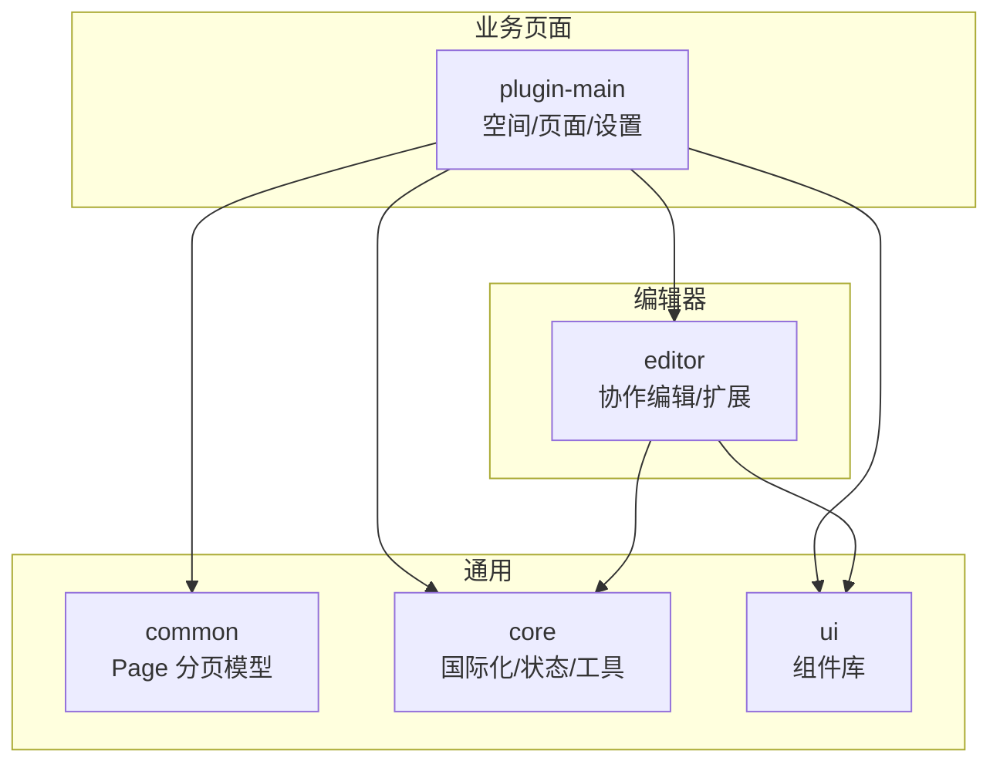
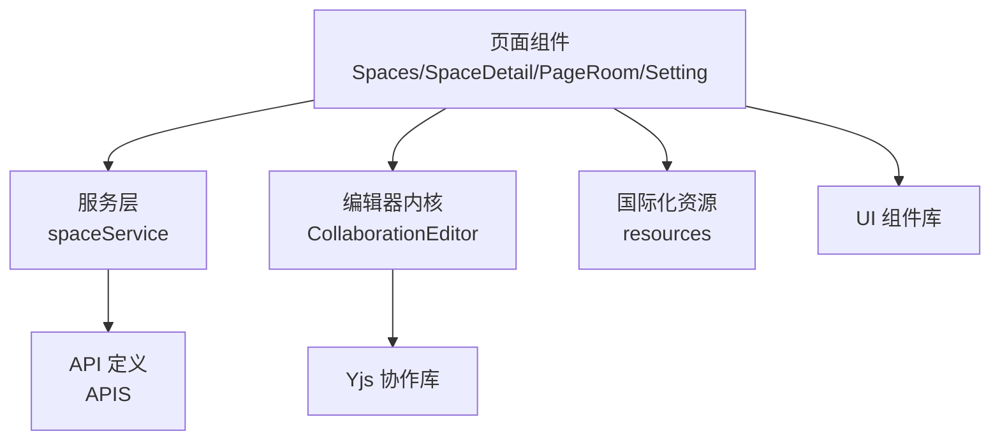
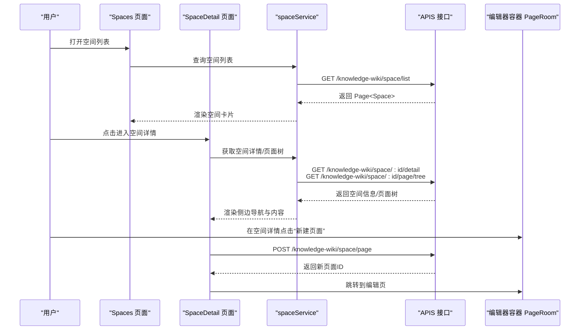
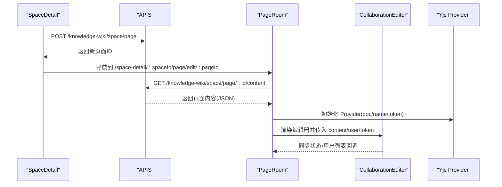
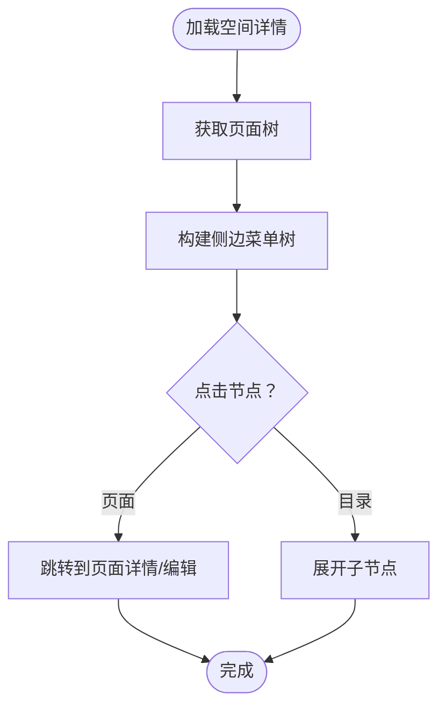
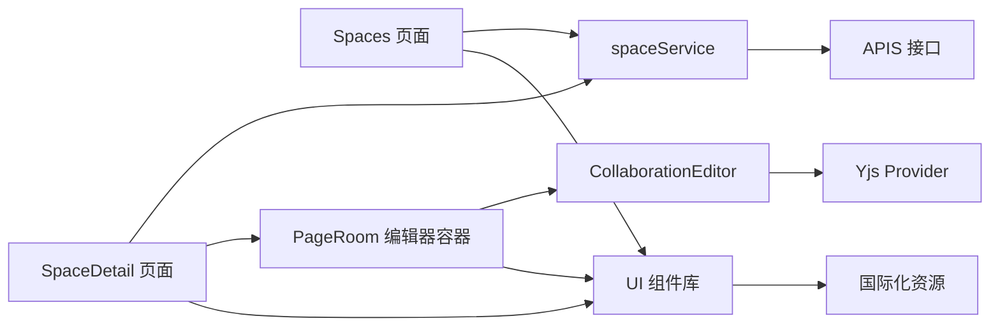

# 知识库管理

<cite>
**本文引用的文件**
- [packages/plugin-main/src/model/Space.ts](file://packages/plugin-main/src/model/Space.ts)
- [packages/plugin-main/src/service/space-service.ts](file://packages/plugin-main/src/service/space-service.ts)
- [packages/plugin-main/src/pages/Spaces/index.tsx](file://packages/plugin-main/src/pages/Spaces/index.tsx)
- [packages/plugin-main/src/pages/SpaceDetail/index.tsx](file://packages/plugin-main/src/pages/SpaceDetail/index.tsx)
- [packages/plugin-main/src/pages/SpaceHub/index.tsx](file://packages/plugin-main/src/pages/SpaceHub/index.tsx)
- [packages/plugin-main/src/pages/PageRoom/index.tsx](file://packages/plugin-main/src/pages/PageRoom/index.tsx)
- [packages/plugin-main/src/pages/Setting/index.tsx](file://packages/plugin-main/src/pages/Setting/index.tsx)
- [packages/common/src/entity/Page.ts](file://packages/common/src/entity/Page.ts)
- [packages/plugin-main/src/api/index.ts](file://packages/plugin-main/src/api/index.ts)
- [packages/editor/src/editor/index.tsx](file://packages/editor/src/editor/index.tsx)
- [packages/editor/src/components/editor-wrapper.tsx](file://packages/editor/src/components/editor-wrapper.tsx)
- [packages/core/src/locales/resources.ts](file://packages/core/src/locales/resources.ts)
</cite>

## 目录
1. [引言](#引言)
2. [项目结构](#项目结构)
3. [核心组件](#核心组件)
4. [架构总览](#架构总览)
5. [详细组件分析](#详细组件分析)
6. [依赖关系分析](#依赖关系分析)
7. [性能考量](#性能考量)
8. [故障排查指南](#故障排查指南)
9. [结论](#结论)
10. [附录](#附录)

## 引言
本文件围绕知识库管理系统的“空间管理”与“页面编辑器”两大核心能力，系统化梳理从空间创建、空间列表、空间详情到空间设置的完整流程；同时深入解析页面编辑器的创建、编辑、预览与发布路径，以及内容组织（导航树、目录生成、内容结构）的设计与实现。文档还提供国际化支持、服务层设计与状态管理的最佳实践建议，并以图示形式呈现关键流程与数据流。

## 项目结构
该仓库采用多包工作区（monorepo）组织，知识库相关能力主要分布在以下包中：
- packages/plugin-main：业务页面与服务层（空间、页面、设置等）
- packages/editor：编辑器内核与协作编辑能力
- packages/common：通用实体与工具（如分页 Page）
- packages/core：核心能力（国际化资源、hooks、store 等）
- packages/ui：UI 组件库（用于页面交互）

**图表来源**
- [packages/plugin-main/src/pages/Spaces/index.tsx](file://packages/plugin-main/src/pages/Spaces/index.tsx#L1-L118)
- [packages/plugin-main/src/pages/SpaceDetail/index.tsx](file://packages/plugin-main/src/pages/SpaceDetail/index.tsx#L1-L476)
- [packages/plugin-main/src/pages/PageRoom/index.tsx](file://packages/plugin-main/src/pages/PageRoom/index.tsx#L1-L120)
- [packages/editor/src/editor/index.tsx](file://packages/editor/src/editor/index.tsx#L1-L7)
- [packages/common/src/entity/Page.ts](file://packages/common/src/entity/Page.ts#L1-L8)
- [packages/core/src/locales/resources.ts](file://packages/core/src/locales/resources.ts#L1-L26)

**章节来源**
- [packages/plugin-main/src/pages/Spaces/index.tsx](file://packages/plugin-main/src/pages/Spaces/index.tsx#L1-L118)
- [packages/plugin-main/src/pages/SpaceDetail/index.tsx](file://packages/plugin-main/src/pages/SpaceDetail/index.tsx#L1-L476)
- [packages/plugin-main/src/pages/PageRoom/index.tsx](file://packages/plugin-main/src/pages/PageRoom/index.tsx#L1-L120)
- [packages/editor/src/editor/index.tsx](file://packages/editor/src/editor/index.tsx#L1-L7)
- [packages/common/src/entity/Page.ts](file://packages/common/src/entity/Page.ts#L1-L8)
- [packages/core/src/locales/resources.ts](file://packages/core/src/locales/resources.ts#L1-L26)

## 核心组件
- 空间模型 Space：描述空间的基本属性（标识、名称、主页、图标、封面、描述等），作为前后端交互的基础数据结构。
- 分页模型 Page：统一承载后端返回的分页数据结构（记录集、当前页、页大小、总数），便于在空间列表与页面列表中复用。
- API 定义 APIS：集中管理知识库系统的所有后端接口，涵盖空间查询、页面树、页面内容、收藏、模板、回收站等。
- 服务层 spaceService：封装对 APIS 的调用，提供空间信息、空间列表、页面树、页面 CRUD、块查询等方法，屏蔽具体请求细节。
- 页面组件：Spaces（空间列表）、SpaceDetail（空间详情与导航）、PageRoom（页面编辑器）、SpaceHub（空间入口面板）、Setting（空间设置占位）。

**章节来源**
- [packages/plugin-main/src/model/Space.ts](file://packages/plugin-main/src/model/Space.ts#L1-L8)
- [packages/common/src/entity/Page.ts](file://packages/common/src/entity/Page.ts#L1-L8)
- [packages/plugin-main/src/api/index.ts](file://packages/plugin-main/src/api/index.ts#L1-L120)
- [packages/plugin-main/src/service/space-service.ts](file://packages/plugin-main/src/service/space-service.ts#L1-L59)

## 架构总览
整体采用“页面组件 + 服务层 + 编辑器内核”的分层设计：
- 页面组件负责路由与视图编排，触发服务层调用后端 API。
- 服务层 spaceService 将业务参数转换为 API 请求，处理响应数据。
- 编辑器内核提供协作编辑能力，PageRoom 作为编辑器容器，承载协同状态与用户列表。
- 国际化资源由 core 包提供，页面组件通过 hooks 使用翻译。

**图表来源**
- [packages/plugin-main/src/pages/Spaces/index.tsx](file://packages/plugin-main/src/pages/Spaces/index.tsx#L1-L118)
- [packages/plugin-main/src/pages/SpaceDetail/index.tsx](file://packages/plugin-main/src/pages/SpaceDetail/index.tsx#L1-L476)
- [packages/plugin-main/src/pages/PageRoom/index.tsx](file://packages/plugin-main/src/pages/PageRoom/index.tsx#L1-L120)
- [packages/plugin-main/src/service/space-service.ts](file://packages/plugin-main/src/service/space-service.ts#L1-L59)
- [packages/plugin-main/src/api/index.ts](file://packages/plugin-main/src/api/index.ts#L1-L120)
- [packages/editor/src/editor/index.tsx](file://packages/editor/src/editor/index.tsx#L1-L7)
- [packages/core/src/locales/resources.ts](file://packages/core/src/locales/resources.ts#L1-L26)

## 详细组件分析

### 空间管理功能
- 空间创建：通过 SpaceDetail 中的“新建页面”或“使用模板”入口，调用创建接口，随后跳转至编辑页。
- 空间列表展示：Spaces 页面拉取空间列表并以卡片/列表形式展示，支持搜索与分类筛选。
- 空间详情页面：SpaceDetail 展示空间概览、收藏、页面树、模板、回收站等，提供导航与操作入口。
- 空间设置：Setting 页面预留设置区域，当前为空白占位，后续可接入空间配置项。

**图表来源**
- [packages/plugin-main/src/pages/Spaces/index.tsx](file://packages/plugin-main/src/pages/Spaces/index.tsx#L1-L118)
- [packages/plugin-main/src/pages/SpaceDetail/index.tsx](file://packages/plugin-main/src/pages/SpaceDetail/index.tsx#L1-L476)
- [packages/plugin-main/src/service/space-service.ts](file://packages/plugin-main/src/service/space-service.ts#L1-L59)
- [packages/plugin-main/src/api/index.ts](file://packages/plugin-main/src/api/index.ts#L1-L120)
- [packages/plugin-main/src/pages/PageRoom/index.tsx](file://packages/plugin-main/src/pages/PageRoom/index.tsx#L1-L120)

**章节来源**
- [packages/plugin-main/src/pages/Spaces/index.tsx](file://packages/plugin-main/src/pages/Spaces/index.tsx#L1-L118)
- [packages/plugin-main/src/pages/SpaceDetail/index.tsx](file://packages/plugin-main/src/pages/SpaceDetail/index.tsx#L1-L476)
- [packages/plugin-main/src/service/space-service.ts](file://packages/plugin-main/src/service/space-service.ts#L1-L59)
- [packages/plugin-main/src/api/index.ts](file://packages/plugin-main/src/api/index.ts#L1-L120)

### 页面编辑器实现
- 创建与跳转：SpaceDetail 提供“新建页面”，构造默认内容结构并调用创建接口，成功后跳转至编辑页。
- 编辑与协作：PageRoom 作为编辑器容器，基于协作编辑 Provider 连接 Yjs，渲染 CollaborationEditor 并传递用户信息与同步状态。
- 预览与发布：编辑器内部通过扩展与菜单实现内容渲染与导出；发布通常对应保存/提交流程，此处以编辑态呈现。

**图表来源**
- [packages/plugin-main/src/pages/SpaceDetail/index.tsx](file://packages/plugin-main/src/pages/SpaceDetail/index.tsx#L1-L476)
- [packages/plugin-main/src/pages/PageRoom/index.tsx](file://packages/plugin-main/src/pages/PageRoom/index.tsx#L1-L120)
- [packages/plugin-main/src/api/index.ts](file://packages/plugin-main/src/api/index.ts#L1-L120)
- [packages/editor/src/editor/index.tsx](file://packages/editor/src/editor/index.tsx#L1-L7)

**章节来源**
- [packages/plugin-main/src/pages/SpaceDetail/index.tsx](file://packages/plugin-main/src/pages/SpaceDetail/index.tsx#L1-L476)
- [packages/plugin-main/src/pages/PageRoom/index.tsx](file://packages/plugin-main/src/pages/PageRoom/index.tsx#L1-L120)
- [packages/editor/src/components/editor-wrapper.tsx](file://packages/editor/src/components/editor-wrapper.tsx#L1-L18)
- [packages/editor/src/editor/index.tsx](file://packages/editor/src/editor/index.tsx#L1-L7)

### 内容组织与导航
- 页面导航树：SpaceDetail 通过服务层获取页面树并映射为侧边 TreeView，支持展开、点击跳转、搜索与批量操作。
- 目录生成：编辑器内核提供目录（ToC）能力，可在编辑器上下文中生成与更新文档目录。
- 内容结构管理：页面内容以 JSON 结构存储，编辑器负责渲染与协作编辑；SpaceDetail 提供收藏、回收站、模板等功能辅助内容治理。

**图表来源**
- [packages/plugin-main/src/pages/SpaceDetail/index.tsx](file://packages/plugin-main/src/pages/SpaceDetail/index.tsx#L1-L476)
- [packages/editor/src/editor/index.tsx](file://packages/editor/src/editor/index.tsx#L1-L7)

**章节来源**
- [packages/plugin-main/src/pages/SpaceDetail/index.tsx](file://packages/plugin-main/src/pages/SpaceDetail/index.tsx#L1-L476)
- [packages/editor/src/editor/index.tsx](file://packages/editor/src/editor/index.tsx#L1-L7)

### 国际化支持
- 资源文件：core 包提供多语言资源（zh/en），页面可通过翻译钩子使用 t 函数进行文案渲染。
- 应用场景：SpaceHub 等组件已集成 useTranslation，便于在空间列表、对话框等界面中切换语言。

**章节来源**
- [packages/core/src/locales/resources.ts](file://packages/core/src/locales/resources.ts#L1-L26)
- [packages/plugin-main/src/pages/SpaceHub/index.tsx](file://packages/plugin-main/src/pages/SpaceHub/index.tsx#L1-L131)

### 服务层设计与状态管理最佳实践
- 服务层设计：
  - spaceService 将业务方法抽象为 getSpaceInfo、querySpaces、getPageTree、createPage、getPage、queryBlocks、getBlockInfo、saveAsTemplate 等，职责单一、易于测试与复用。
  - API 调用集中在 APIS，便于统一维护与替换。
- 状态管理：
  - 页面组件使用安全状态与导航器钩子管理 UI 状态与路由跳转。
  - 编辑器容器 PageRoom 使用全局状态与本地状态结合，通过 Provider 管理协作状态与用户列表。
  - 建议：将共享状态收敛到全局 store，避免跨组件重复 fetch；对高频请求使用防抖与缓存策略。

**章节来源**
- [packages/plugin-main/src/service/space-service.ts](file://packages/plugin-main/src/service/space-service.ts#L1-L59)
- [packages/plugin-main/src/api/index.ts](file://packages/plugin-main/src/api/index.ts#L1-L120)
- [packages/plugin-main/src/pages/PageRoom/index.tsx](file://packages/plugin-main/src/pages/PageRoom/index.tsx#L1-L120)

## 依赖关系分析
- 页面组件依赖服务层与 API 定义，服务层依赖 useApi 与 APIS。
- 编辑器容器依赖编辑器内核与协作 Provider，同时与全局状态与路由交互。
- 国际化资源由 core 包提供，页面组件按需引入。

**图表来源**
- [packages/plugin-main/src/pages/Spaces/index.tsx](file://packages/plugin-main/src/pages/Spaces/index.tsx#L1-L118)
- [packages/plugin-main/src/pages/SpaceDetail/index.tsx](file://packages/plugin-main/src/pages/SpaceDetail/index.tsx#L1-L476)
- [packages/plugin-main/src/pages/PageRoom/index.tsx](file://packages/plugin-main/src/pages/PageRoom/index.tsx#L1-L120)
- [packages/plugin-main/src/service/space-service.ts](file://packages/plugin-main/src/service/space-service.ts#L1-L59)
- [packages/plugin-main/src/api/index.ts](file://packages/plugin-main/src/api/index.ts#L1-L120)
- [packages/editor/src/editor/index.tsx](file://packages/editor/src/editor/index.tsx#L1-L7)
- [packages/core/src/locales/resources.ts](file://packages/core/src/locales/resources.ts#L1-L26)

**章节来源**
- [packages/plugin-main/src/pages/Spaces/index.tsx](file://packages/plugin-main/src/pages/Spaces/index.tsx#L1-L118)
- [packages/plugin-main/src/pages/SpaceDetail/index.tsx](file://packages/plugin-main/src/pages/SpaceDetail/index.tsx#L1-L476)
- [packages/plugin-main/src/pages/PageRoom/index.tsx](file://packages/plugin-main/src/pages/PageRoom/index.tsx#L1-L120)
- [packages/plugin-main/src/service/space-service.ts](file://packages/plugin-main/src/service/space-service.ts#L1-L59)
- [packages/plugin-main/src/api/index.ts](file://packages/plugin-main/src/api/index.ts#L1-L120)
- [packages/editor/src/editor/index.tsx](file://packages/editor/src/editor/index.tsx#L1-L7)
- [packages/core/src/locales/resources.ts](file://packages/core/src/locales/resources.ts#L1-L26)

## 性能考量
- 请求去抖：SpaceHub 对搜索输入使用防抖，降低频繁查询带来的压力。
- 懒加载与条件渲染：SpaceDetail 在可见性变化时才加载模板与回收站数据，减少初始负载。
- 协作同步：PageRoom 仅在同步完成后渲染编辑器，避免未就绪状态下的重绘。
- 图片与媒体：编辑器封面等资源通过上传路径拼装，建议开启缓存与懒加载策略。

**章节来源**
- [packages/plugin-main/src/pages/SpaceHub/index.tsx](file://packages/plugin-main/src/pages/SpaceHub/index.tsx#L1-L131)
- [packages/plugin-main/src/pages/SpaceDetail/index.tsx](file://packages/plugin-main/src/pages/SpaceDetail/index.tsx#L1-L476)
- [packages/plugin-main/src/pages/PageRoom/index.tsx](file://packages/plugin-main/src/pages/PageRoom/index.tsx#L1-L120)

## 故障排查指南
- 空间详情空白：检查 params.id 是否存在，确认服务层调用是否成功返回空间信息。
- 页面树不刷新：确认事件监听与标志位更新逻辑，确保在收藏变更或页面刷新事件后重新拉取页面树。
- 编辑器未渲染：检查同步状态回调与 Provider 初始化，确认 token 与文档名一致。
- 国际化文案未生效：确认 useTranslation 已正确引入资源，且命名空间与键值匹配。

**章节来源**
- [packages/plugin-main/src/pages/SpaceDetail/index.tsx](file://packages/plugin-main/src/pages/SpaceDetail/index.tsx#L1-L476)
- [packages/plugin-main/src/pages/PageRoom/index.tsx](file://packages/plugin-main/src/pages/PageRoom/index.tsx#L1-L120)
- [packages/core/src/locales/resources.ts](file://packages/core/src/locales/resources.ts#L1-L26)

## 结论
知识库管理系统以清晰的分层设计实现了空间管理与页面编辑器两大核心能力。通过统一的服务层与 API 定义，页面组件能够稳定地完成空间创建、列表展示、详情导航与设置入口；编辑器容器则提供了可靠的协作编辑体验。配合国际化与状态管理的最佳实践，系统具备良好的可维护性与扩展性。

## 附录
- 使用示例（路径指引）
  - 空间列表：[packages/plugin-main/src/pages/Spaces/index.tsx](file://packages/plugin-main/src/pages/Spaces/index.tsx#L1-L118)
  - 空间详情与导航：[packages/plugin-main/src/pages/SpaceDetail/index.tsx](file://packages/plugin-main/src/pages/SpaceDetail/index.tsx#L1-L476)
  - 页面编辑器容器：[packages/plugin-main/src/pages/PageRoom/index.tsx](file://packages/plugin-main/src/pages/PageRoom/index.tsx#L1-L120)
  - 服务层与 API：[packages/plugin-main/src/service/space-service.ts](file://packages/plugin-main/src/service/space-service.ts#L1-L59)，[packages/plugin-main/src/api/index.ts](file://packages/plugin-main/src/api/index.ts#L1-L120)
  - 编辑器内核导出：[packages/editor/src/editor/index.tsx](file://packages/editor/src/editor/index.tsx#L1-L7)
  - 编辑器包装器：[packages/editor/src/components/editor-wrapper.tsx](file://packages/editor/src/components/editor-wrapper.tsx#L1-L18)
  - 国际化资源：[packages/core/src/locales/resources.ts](file://packages/core/src/locales/resources.ts#L1-L26)