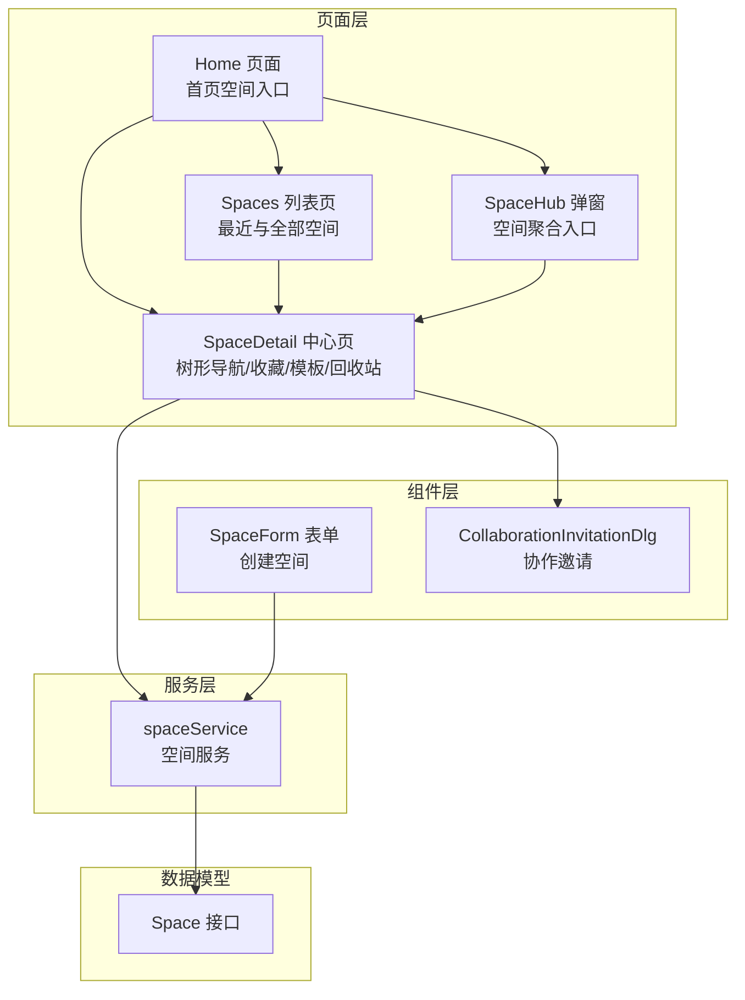
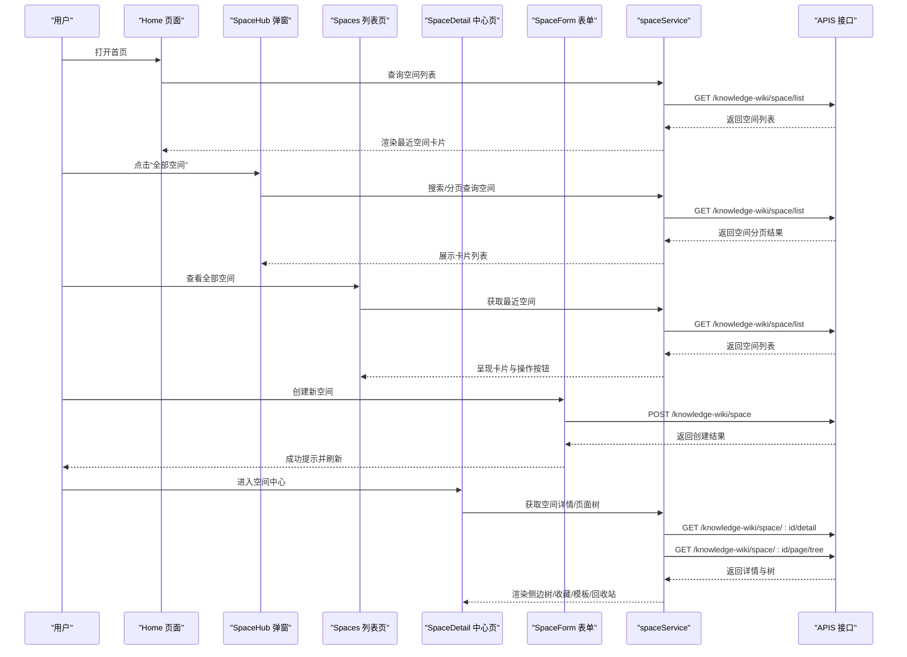
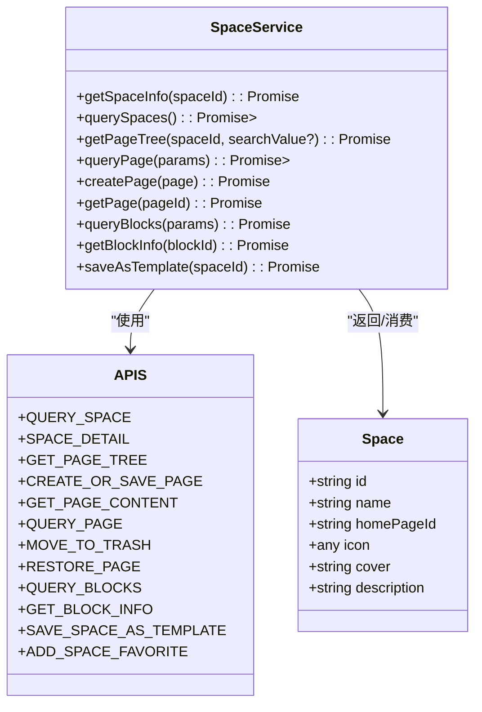
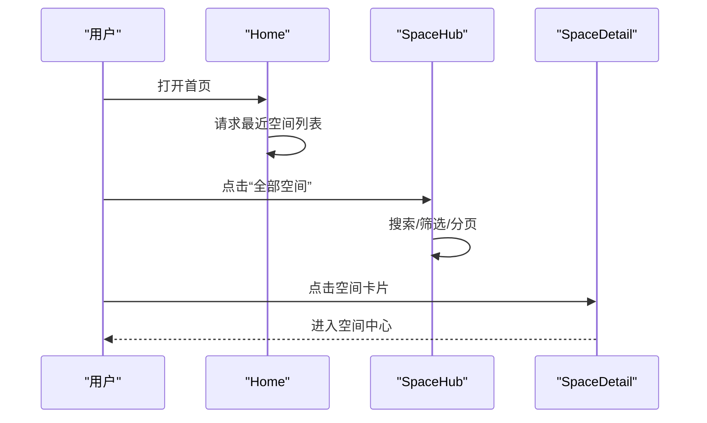
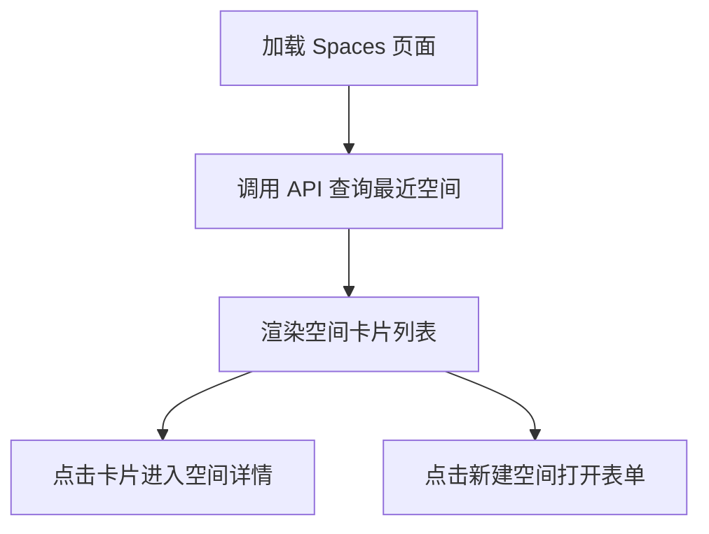
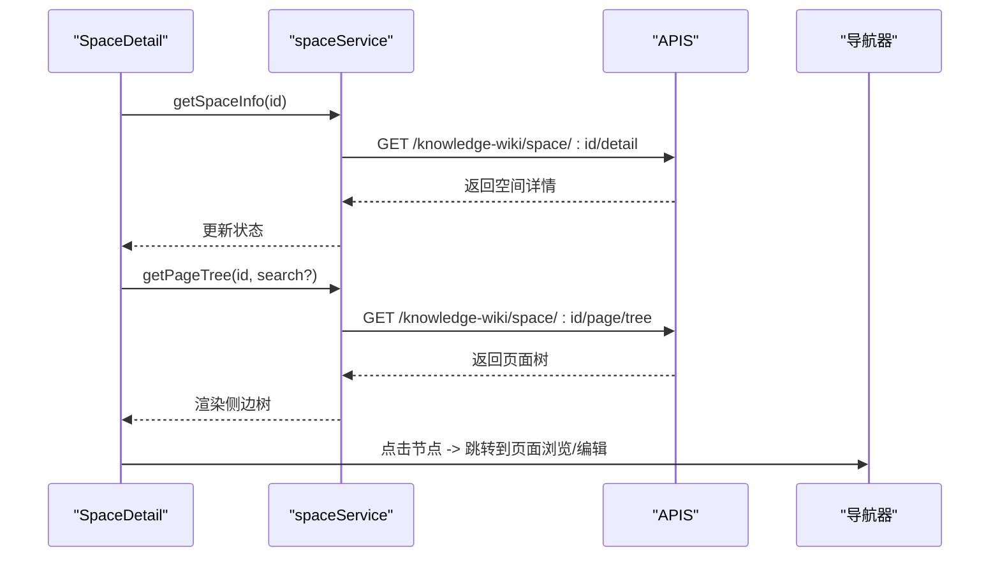
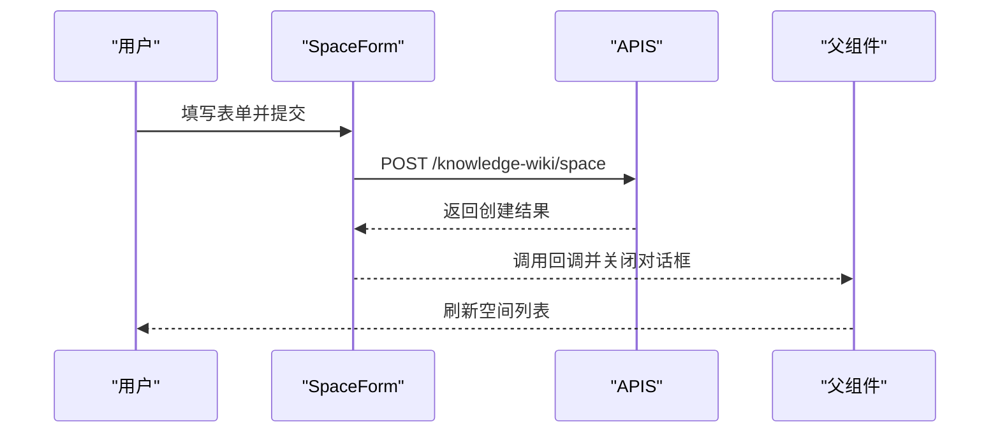
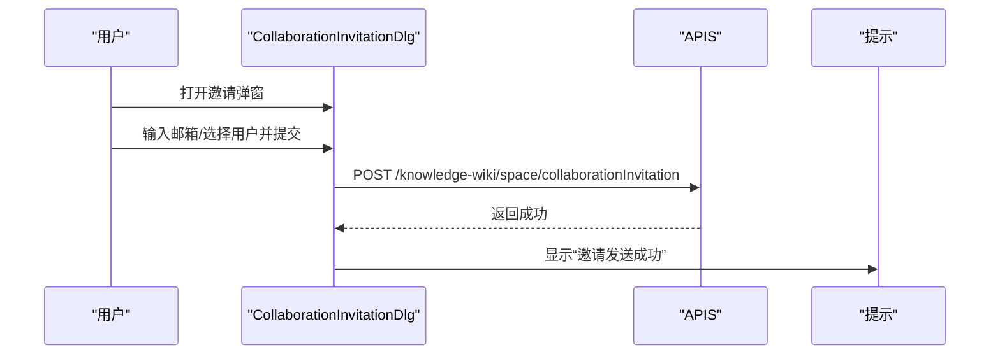
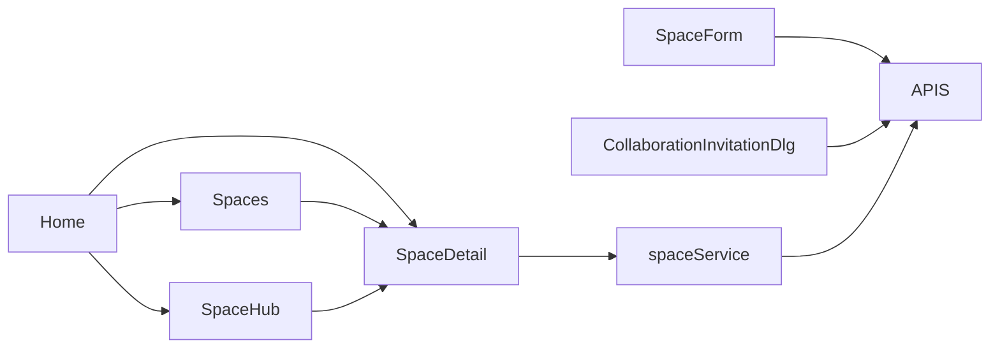

# 空间管理

<cite>
**本文引用的文件**
- [packages/plugin-main/src/service/space-service.ts](file://packages/plugin-main/src/service/space-service.ts)
- [packages/plugin-main/src/model/Space.ts](file://packages/plugin-main/src/model/Space.ts)
- [packages/plugin-main/src/api/index.ts](file://packages/plugin-main/src/api/index.ts)
- [packages/plugin-main/src/pages/Home/index.tsx](file://packages/plugin-main/src/pages/Home/index.tsx)
- [packages/plugin-main/src/pages/Spaces/index.tsx](file://packages/plugin-main/src/pages/Spaces/index.tsx)
- [packages/plugin-main/src/pages/SpaceHub/index.tsx](file://packages/plugin-main/src/pages/SpaceHub/index.tsx)
- [packages/plugin-main/src/pages/SpaceDetail/index.tsx](file://packages/plugin-main/src/pages/SpaceDetail/index.tsx)
- [packages/plugin-main/src/pages/components/SpaceForm.tsx](file://packages/plugin-main/src/pages/components/SpaceForm.tsx)
- [packages/plugin-main/src/pages/components/CollaborationInvitationDlg.tsx](file://packages/plugin-main/src/pages/components/CollaborationInvitationDlg.tsx)
- [packages/plugin-main/src/pages/SpaceDetail/Settings/index.tsx](file://packages/plugin-main/src/pages/SpaceDetail/Settings/index.tsx)
- [packages/plugin-main/src/index.tsx](file://packages/plugin-main/src/index.tsx)
- [packages/common/src/locales/supported-language.ts](file://packages/common/src/locales/supported-language.ts)
</cite>

## 目录
1. [简介](#简介)
2. [项目结构](#项目结构)
3. [核心组件](#核心组件)
4. [架构总览](#架构总览)
5. [详细组件分析](#详细组件分析)
6. [依赖关系分析](#依赖关系分析)
7. [性能考虑](#性能考虑)
8. [故障排查指南](#故障排查指南)
9. [结论](#结论)
10. [附录](#附录)

## 简介
本文件系统性梳理知识库“空间管理”能力，覆盖首页空间入口、空间列表页面与空间中心（空间详情）的完整功能链路；深入解析空间服务的设计与实现，包括数据模型、CRUD 与状态管理；解释权限控制、成员协作机制；并提供通过服务层 API 进行空间操作的实践路径与最佳实践（国际化与错误处理）。

## 项目结构
围绕“空间管理”的前端实现主要位于插件包 plugin-main 中，采用按页面与功能模块分层组织的方式：
- 服务层：封装空间相关 API 调用与业务逻辑，统一暴露 spaceService。
- 页面层：Home、Spaces、SpaceHub、SpaceDetail 及其子页面（设置、编辑器、查看器）。
- 组件层：SpaceForm（创建空间表单）、CollaborationInvitationDlg（协作邀请）等。
- 数据模型：Space 接口定义空间字段。
- 国际化：插件内提供中英文翻译资源，支持语言切换。

图表来源
- [packages/plugin-main/src/pages/Home/index.tsx](file://packages/plugin-main/src/pages/Home/index.tsx#L1-L132)
- [packages/plugin-main/src/pages/Spaces/index.tsx](file://packages/plugin-main/src/pages/Spaces/index.tsx#L1-L118)
- [packages/plugin-main/src/pages/SpaceHub/index.tsx](file://packages/plugin-main/src/pages/SpaceHub/index.tsx#L1-L131)
- [packages/plugin-main/src/pages/SpaceDetail/index.tsx](file://packages/plugin-main/src/pages/SpaceDetail/index.tsx#L1-L476)
- [packages/plugin-main/src/pages/components/SpaceForm.tsx](file://packages/plugin-main/src/pages/components/SpaceForm.tsx#L1-L186)
- [packages/plugin-main/src/pages/components/CollaborationInvitationDlg.tsx](file://packages/plugin-main/src/pages/components/CollaborationInvitationDlg.tsx#L1-L115)
- [packages/plugin-main/src/service/space-service.ts](file://packages/plugin-main/src/service/space-service.ts#L1-L59)
- [packages/plugin-main/src/model/Space.ts](file://packages/plugin-main/src/model/Space.ts#L1-L8)

章节来源
- [packages/plugin-main/src/index.tsx](file://packages/plugin-main/src/index.tsx#L1-L118)

## 核心组件
- 空间数据模型 Space：定义空间标识、名称、主页页签 ID、图标、封面、描述等字段。
- 空间服务 SpaceService：统一封装空间查询、详情、页面树、页面 CRUD、块查询、保存为模板等能力。
- API 定义 APIS：集中声明后端接口地址、方法与参数占位符，便于调用与维护。
- 页面与组件：Home/Spaces/SpaceHub/SpaceDetail 提供入口与交互；SpaceForm 负责创建；CollaborationInvitationDlg 支持协作邀请。

章节来源
- [packages/plugin-main/src/model/Space.ts](file://packages/plugin-main/src/model/Space.ts#L1-L8)
- [packages/plugin-main/src/service/space-service.ts](file://packages/plugin-main/src/service/space-service.ts#L1-L59)
- [packages/plugin-main/src/api/index.ts](file://packages/plugin-main/src/api/index.ts#L1-L120)

## 架构总览
空间管理从前端路由到服务层再到 API 的整体流程如下：

图表来源
- [packages/plugin-main/src/pages/Home/index.tsx](file://packages/plugin-main/src/pages/Home/index.tsx#L1-L132)
- [packages/plugin-main/src/pages/SpaceHub/index.tsx](file://packages/plugin-main/src/pages/SpaceHub/index.tsx#L1-L131)
- [packages/plugin-main/src/pages/Spaces/index.tsx](file://packages/plugin-main/src/pages/Spaces/index.tsx#L1-L118)
- [packages/plugin-main/src/pages/SpaceDetail/index.tsx](file://packages/plugin-main/src/pages/SpaceDetail/index.tsx#L1-L476)
- [packages/plugin-main/src/pages/components/SpaceForm.tsx](file://packages/plugin-main/src/pages/components/SpaceForm.tsx#L1-L186)
- [packages/plugin-main/src/service/space-service.ts](file://packages/plugin-main/src/service/space-service.ts#L1-L59)
- [packages/plugin-main/src/api/index.ts](file://packages/plugin-main/src/api/index.ts#L1-L120)

## 详细组件分析

### 空间服务设计与实现
- 设计要点
  - 以接口约束对外暴露能力，避免直接耦合具体 API 实现。
  - 使用统一的 useApi 与 APIS 常量，集中管理请求配置与参数占位符。
  - 将空间详情、页面树、页面 CRUD、块查询、模板保存等能力收敛在服务层，便于复用与测试。
- 关键能力
  - 获取空间详情：根据 spaceId 查询空间信息。
  - 查询空间列表：支持分页与筛选（如模板过滤、收藏标记、搜索值）。
  - 获取页面树：支持按空间与可选搜索值返回树形结构。
  - 页面 CRUD：创建/保存页面、获取页面内容、查询页面列表、移动至回收站、恢复页面。
  - 块查询与信息：按条件查询块、获取块详情。
  - 保存为模板：将空间或页面保存为模板。
- 错误处理建议
  - 在调用处对 useApi 返回值进行判空与异常分支处理。
  - 对于需要用户感知的错误，结合 toast 或全局错误弹窗统一提示。
  - 对于幂等性操作（如收藏/取消收藏、添加模板），建议在 UI 上做防抖与状态反馈。

图表来源
- [packages/plugin-main/src/service/space-service.ts](file://packages/plugin-main/src/service/space-service.ts#L1-L59)
- [packages/plugin-main/src/model/Space.ts](file://packages/plugin-main/src/model/Space.ts#L1-L8)
- [packages/plugin-main/src/api/index.ts](file://packages/plugin-main/src/api/index.ts#L1-L120)

章节来源
- [packages/plugin-main/src/service/space-service.ts](file://packages/plugin-main/src/service/space-service.ts#L1-L59)
- [packages/plugin-main/src/api/index.ts](file://packages/plugin-main/src/api/index.ts#L1-L120)
- [packages/plugin-main/src/model/Space.ts](file://packages/plugin-main/src/model/Space.ts#L1-L8)

### 首页空间入口与空间聚合
- 首页 Home
  - 展示最近空间卡片与最近页面卡片，支持进入空间详情与页面。
  - 提供“创建空间”入口与“全部空间”跳转。
- SpaceHub 弹窗
  - 支持收藏空间与最近空间的聚合展示，提供搜索与分类筛选。
  - 点击卡片进入对应空间详情。

图表来源
- [packages/plugin-main/src/pages/Home/index.tsx](file://packages/plugin-main/src/pages/Home/index.tsx#L1-L132)
- [packages/plugin-main/src/pages/SpaceHub/index.tsx](file://packages/plugin-main/src/pages/SpaceHub/index.tsx#L1-L131)
- [packages/plugin-main/src/pages/SpaceDetail/index.tsx](file://packages/plugin-main/src/pages/SpaceDetail/index.tsx#L1-L476)

章节来源
- [packages/plugin-main/src/pages/Home/index.tsx](file://packages/plugin-main/src/pages/Home/index.tsx#L1-L132)
- [packages/plugin-main/src/pages/SpaceHub/index.tsx](file://packages/plugin-main/src/pages/SpaceHub/index.tsx#L1-L131)

### 空间列表页面
- Spaces 页面
  - 展示最近编辑的空间卡片，支持新建空间。
  - 提供“所有空间”区域，包含搜索与筛选输入框（当前示例为空实现，预留扩展）。
  - 分页组件已引入，便于后续接入分页数据。

图表来源
- [packages/plugin-main/src/pages/Spaces/index.tsx](file://packages/plugin-main/src/pages/Spaces/index.tsx#L1-L118)
- [packages/plugin-main/src/api/index.ts](file://packages/plugin-main/src/api/index.ts#L1-L120)

章节来源
- [packages/plugin-main/src/pages/Spaces/index.tsx](file://packages/plugin-main/src/pages/Spaces/index.tsx#L1-L118)

### 空间中心（空间详情）
- 功能概览
  - 空间信息：名称、图标、主页页签 ID、描述等。
  - 页面树：支持搜索与展开，点击节点进入页面浏览或编辑。
  - 收藏夹：展示空间内收藏的页面。
  - 模板：支持从模板创建页面，或保存为模板。
  - 回收站：查看与恢复被删除的页面。
  - 设置：基础信息、归档、删除等。
- 关键交互
  - 侧边树渲染：将服务层返回的树结构转换为可点击菜单项。
  - 快捷命令：支持快速创建页面、跳转个人空间等。
  - 事件驱动：收藏变更与页面刷新事件触发局部重载。

图表来源
- [packages/plugin-main/src/pages/SpaceDetail/index.tsx](file://packages/plugin-main/src/pages/SpaceDetail/index.tsx#L1-L476)
- [packages/plugin-main/src/service/space-service.ts](file://packages/plugin-main/src/service/space-service.ts#L1-L59)
- [packages/plugin-main/src/api/index.ts](file://packages/plugin-main/src/api/index.ts#L1-L120)

章节来源
- [packages/plugin-main/src/pages/SpaceDetail/index.tsx](file://packages/plugin-main/src/pages/SpaceDetail/index.tsx#L1-L476)

### 创建空间（表单与服务调用）
- 表单组件 SpaceForm
  - 支持选择图标（emoji 或上传图片）、封面选择与上传、输入名称与描述。
  - 提交时调用创建空间 API，并在回调中刷新父组件状态与关闭对话框。
- 服务层对接
  - spaceService 本身不直接暴露创建空间方法，通常由页面组件直接调用 APIS.CREATE_SPACE 完成创建。

图表来源
- [packages/plugin-main/src/pages/components/SpaceForm.tsx](file://packages/plugin-main/src/pages/components/SpaceForm.tsx#L1-L186)
- [packages/plugin-main/src/api/index.ts](file://packages/plugin-main/src/api/index.ts#L1-L120)

章节来源
- [packages/plugin-main/src/pages/components/SpaceForm.tsx](file://packages/plugin-main/src/pages/components/SpaceForm.tsx#L1-L186)

### 权限控制与成员协作
- 协作邀请
  - 提供基于内部用户与邮箱的协作邀请弹窗，支持选择权限（示例为 READ/WRITE）。
  - 调用创建邀请 API 并提示成功消息。
- 权限与可见性
  - 当前仓库未提供权限校验与角色判定的具体实现，建议在页面与服务层增加权限守卫与细粒度权限判断（如仅空间拥有者可删除、编辑者可创建页面等）。

图表来源
- [packages/plugin-main/src/pages/components/CollaborationInvitationDlg.tsx](file://packages/plugin-main/src/pages/components/CollaborationInvitationDlg.tsx#L1-L115)
- [packages/plugin-main/src/api/index.ts](file://packages/plugin-main/src/api/index.ts#L1-L120)

章节来源
- [packages/plugin-main/src/pages/components/CollaborationInvitationDlg.tsx](file://packages/plugin-main/src/pages/components/CollaborationInvitationDlg.tsx#L1-L115)

### 国际化与本地化
- 插件内提供中英文翻译资源，覆盖首页标题、创建空间、空间聚合、表单字段等文案。
- 支持语言切换，当前支持语言列表来自公共包的 supportedLngs。

章节来源
- [packages/plugin-main/src/index.tsx](file://packages/plugin-main/src/index.tsx#L63-L117)
- [packages/common/src/locales/supported-language.ts](file://packages/common/src/locales/supported-language.ts#L2-L2)

## 依赖关系分析
- 组件与服务
  - SpaceDetail、Home、Spaces、SpaceHub 等页面均通过 useService("spaceService") 获取服务实例。
  - SpaceForm 与 CollaborationInvitationDlg 直接使用 useApi 与 APIS 常量发起请求。
- 服务与 API
  - spaceService 内部统一使用 useApi 与 APIS 常量，集中管理 URL、方法与参数。
- 路由与菜单
  - 插件注册了首页、空间列表、空间详情及其子路由与菜单项，形成完整的空间管理入口链路。

图表来源
- [packages/plugin-main/src/index.tsx](file://packages/plugin-main/src/index.tsx#L1-L118)
- [packages/plugin-main/src/pages/SpaceDetail/index.tsx](file://packages/plugin-main/src/pages/SpaceDetail/index.tsx#L1-L476)
- [packages/plugin-main/src/pages/Home/index.tsx](file://packages/plugin-main/src/pages/Home/index.tsx#L1-L132)
- [packages/plugin-main/src/pages/Spaces/index.tsx](file://packages/plugin-main/src/pages/Spaces/index.tsx#L1-L118)
- [packages/plugin-main/src/pages/SpaceHub/index.tsx](file://packages/plugin-main/src/pages/SpaceHub/index.tsx#L1-L131)
- [packages/plugin-main/src/pages/components/SpaceForm.tsx](file://packages/plugin-main/src/pages/components/SpaceForm.tsx#L1-L186)
- [packages/plugin-main/src/pages/components/CollaborationInvitationDlg.tsx](file://packages/plugin-main/src/pages/components/CollaborationInvitationDlg.tsx#L1-L115)
- [packages/plugin-main/src/service/space-service.ts](file://packages/plugin-main/src/service/space-service.ts#L1-L59)
- [packages/plugin-main/src/api/index.ts](file://packages/plugin-main/src/api/index.ts#L1-L120)

章节来源
- [packages/plugin-main/src/index.tsx](file://packages/plugin-main/src/index.tsx#L1-L118)

## 性能考虑
- 列表与树渲染
  - 使用虚拟滚动或分页加载大量空间/页面，避免一次性渲染过多节点。
  - 对搜索输入进行去抖（SpaceHub 已使用去抖 hook），减少频繁请求。
- 图片与封面
  - 使用 CDN/缓存链接与懒加载策略，降低首屏压力。
- 事件与状态
  - 合理使用事件订阅与解绑，避免重复监听导致的内存泄漏。
  - 对频繁刷新的状态（如收藏/刷新标志）进行最小化更新，减少重渲染。

## 故障排查指南
- 常见问题
  - 空间详情为空：确认 params.id 是否存在，检查 getSpaceInfo 与 getPageTree 的返回值。
  - 页面树不显示：检查服务层返回的数据结构是否符合侧边树期望。
  - 创建空间失败：核对 SpaceForm 的表单校验与提交参数，确保必填字段完整。
  - 邀请失败：检查邮箱格式与权限数组，确认 API 返回状态码与提示。
- 建议
  - 在 useApi 调用处增加 try/catch 与错误分支处理，统一提示。
  - 对收藏/模板/回收站等高频操作增加本地状态反馈与重试机制。
  - 对于权限不足场景，提供明确的引导与降级 UI。

章节来源
- [packages/plugin-main/src/pages/SpaceDetail/index.tsx](file://packages/plugin-main/src/pages/SpaceDetail/index.tsx#L1-L476)
- [packages/plugin-main/src/pages/components/SpaceForm.tsx](file://packages/plugin-main/src/pages/components/SpaceForm.tsx#L1-L186)
- [packages/plugin-main/src/pages/components/CollaborationInvitationDlg.tsx](file://packages/plugin-main/src/pages/components/CollaborationInvitationDlg.tsx#L1-L115)

## 结论
本方案以清晰的服务层抽象为核心，结合页面与组件实现，完成了从首页入口到空间中心的全链路空间管理能力。通过统一的 API 常量与服务接口，既保证了可维护性，也为后续扩展（权限、模板、协作）提供了良好基座。建议在权限控制与错误处理方面进一步完善，以提升稳定性与用户体验。

## 附录

### API 一览（与空间相关）
- 查询空间列表：GET /knowledge-wiki/space/list
- 获取空间详情：GET /knowledge-wiki/space/:id/detail
- 获取页面树：GET /knowledge-wiki/space/:id/page/tree
- 获取页面内容：GET /knowledge-wiki/space/page/:id/content
- 创建/保存页面：POST /knowledge-wiki/space/page
- 查询页面列表：GET /knowledge-wiki/space/page/list
- 移动页面至回收站：DELETE /knowledge-wiki/space/page/:id/trash
- 恢复页面：PUT /knowledge-wiki/space/page/:id/restore
- 查询块列表：GET /knowledge-wiki/space/page/blocks
- 获取块详情：GET /knowledge-wiki/space/page/block
- 保存空间为模板：POST /knowledge-wiki/space/template
- 添加空间收藏：POST /knowledge-wiki/space/:id/favorite
- 创建协作邀请：POST /knowledge-wiki/space/collaborationInvitation

章节来源
- [packages/plugin-main/src/api/index.ts](file://packages/plugin-main/src/api/index.ts#L1-L120)