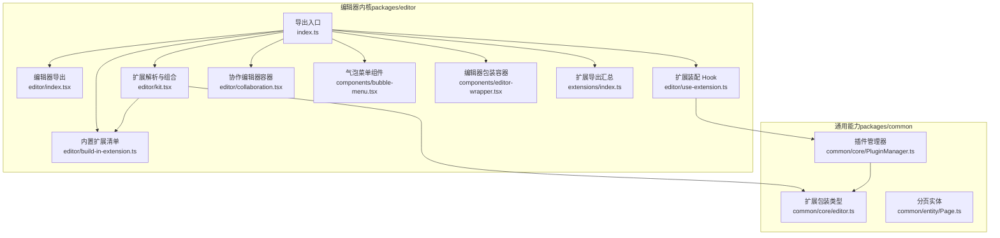
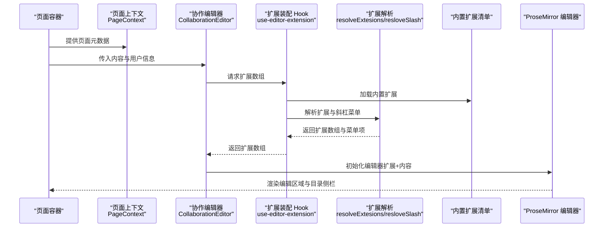
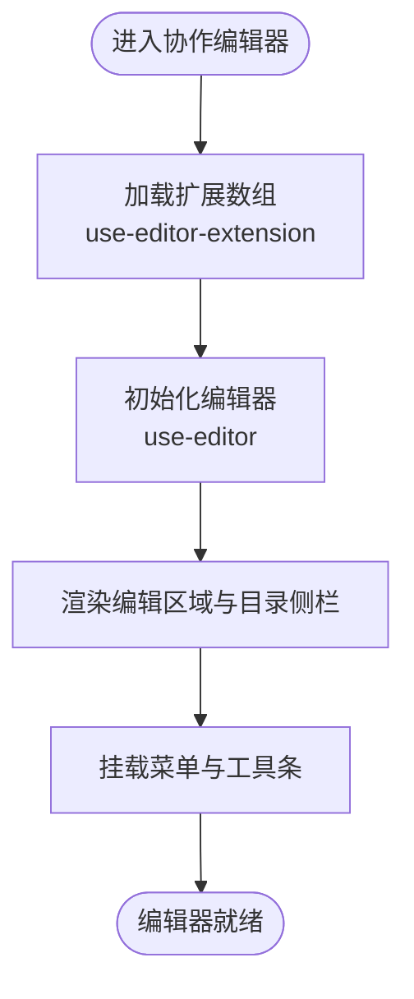
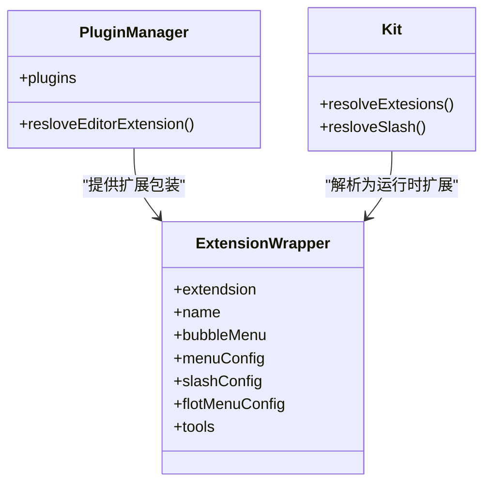
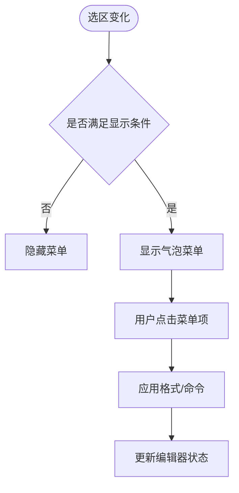
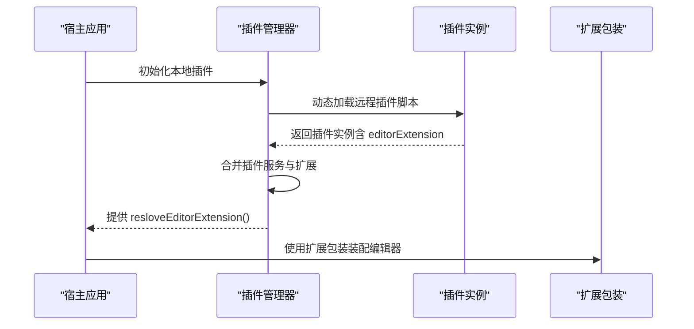
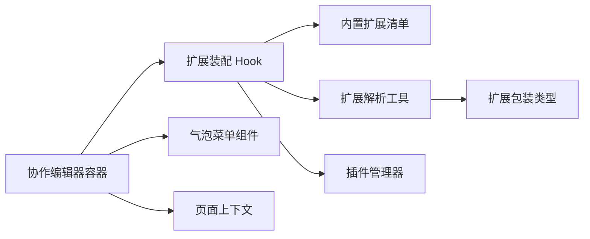

# 页面编辑

<cite>
**本文引用的文件**
- [packages/editor/src/index.ts](file://packages/editor/src/index.ts)
- [packages/editor/src/components/index.tsx](file://packages/editor/src/components/index.tsx)
- [packages/editor/src/editor/index.tsx](file://packages/editor/src/editor/index.tsx)
- [packages/editor/src/editor/kit.tsx](file://packages/editor/src/editor/kit.tsx)
- [packages/editor/src/editor/use-extension.ts](file://packages/editor/src/editor/use-extension.ts)
- [packages/editor/src/editor/context.tsx](file://packages/editor/src/editor/context.tsx)
- [packages/editor/src/editor/collaboration.tsx](file://packages/editor/src/editor/collaboration.tsx)
- [packages/editor/src/components/bubble-menu.tsx](file://packages/editor/src/components/bubble-menu.tsx)
- [packages/editor/src/components/editor-wrapper.tsx](file://packages/editor/src/components/editor-wrapper.tsx)
- [packages/editor/src/extensions/index.ts](file://packages/editor/src/extensions/index.ts)
- [packages/editor/src/editor/build-in-extension.ts](file://packages/editor/src/editor/build-in-extension.ts)
- [packages/common/src/core/PluginManager.ts](file://packages/common/src/core/PluginManager.ts)
- [packages/common/src/core/editor.ts](file://packages/common/src/core/editor.ts)
- [packages/common/src/entity/Page.ts](file://packages/common/src/entity/Page.ts)
</cite>

## 目录
1. [引言](#引言)
2. [项目结构](#项目结构)
3. [核心组件](#核心组件)
4. [架构总览](#架构总览)
5. [详细组件分析](#详细组件分析)
6. [依赖分析](#依赖分析)
7. [性能考虑](#性能考虑)
8. [故障排查指南](#故障排查指南)
9. [结论](#结论)
10. [附录](#附录)

## 引言
本文件面向知识库“页面编辑”能力，系统性梳理页面编辑器与页面查看器的实现，覆盖编辑模式与预览模式的切换机制、页面内容的创建/编辑/保存/发布流程、编辑器扩展机制与插件集成方式，并给出可操作的使用示例与最佳实践。读者无需深入前端技术背景，即可理解并使用编辑器进行内容创作与协作。

## 项目结构
编辑相关能力主要集中在 packages/editor 与 packages/common 两个包中：
- packages/editor：提供编辑器内核（基于 Tiptap/ProseMirror）、内置扩展集合、协作与上下文、菜单与气泡工具条等。
- packages/common：提供通用类型、插件管理器与页面实体等基础能力，支撑编辑器扩展与插件生态。

图表来源
- [packages/editor/src/index.ts](file://packages/editor/src/index.ts#L1-L23)
- [packages/editor/src/editor/index.tsx](file://packages/editor/src/editor/index.tsx#L1-L7)
- [packages/editor/src/editor/kit.tsx](file://packages/editor/src/editor/kit.tsx#L1-L87)
- [packages/editor/src/editor/use-extension.ts](file://packages/editor/src/editor/use-extension.ts#L1-L63)
- [packages/editor/src/editor/collaboration.tsx](file://packages/editor/src/editor/collaboration.tsx#L1-L142)
- [packages/editor/src/components/bubble-menu.tsx](file://packages/editor/src/components/bubble-menu.tsx#L1-L84)
- [packages/editor/src/components/editor-wrapper.tsx](file://packages/editor/src/components/editor-wrapper.tsx#L1-L18)
- [packages/editor/src/extensions/index.ts](file://packages/editor/src/extensions/index.ts#L1-L64)
- [packages/editor/src/editor/build-in-extension.ts](file://packages/editor/src/editor/build-in-extension.ts#L1-L56)
- [packages/common/src/core/PluginManager.ts](file://packages/common/src/core/PluginManager.ts#L1-L170)
- [packages/common/src/core/editor.ts](file://packages/common/src/core/editor.ts#L1-L31)
- [packages/common/src/entity/Page.ts](file://packages/common/src/entity/Page.ts#L1-L8)

章节来源
- [packages/editor/src/index.ts](file://packages/editor/src/index.ts#L1-L23)
- [packages/editor/src/editor/index.tsx](file://packages/editor/src/editor/index.tsx#L1-L7)

## 核心组件
- 编辑器容器与协作渲染
  - 协作编辑器容器负责装配扩展、注入菜单、渲染编辑区域与目录侧栏，并通过上下文传递页面元数据。
  - 参考路径：[协作编辑器组件](file://packages/editor/src/editor/collaboration.tsx#L1-L142)
- 扩展解析与装配
  - 解析外部传入与内置扩展，生成运行时扩展数组；同时解析“斜杠菜单”配置。
  - 参考路径：[扩展解析与组合](file://packages/editor/src/editor/kit.tsx#L1-L87)、[扩展装配 Hook](file://packages/editor/src/editor/use-extension.ts#L1-L63)
- 气泡菜单与工具条
  - 提供节点级与段落级的悬浮菜单，支持自定义定位与显示策略。
  - 参考路径：[气泡菜单组件](file://packages/editor/src/components/bubble-menu.tsx#L1-L84)
- 编辑器包装容器
  - 为编辑器提供统一布局与背景等外层容器。
  - 参考路径：[编辑器包装容器](file://packages/editor/src/components/editor-wrapper.tsx#L1-L18)
- 内置扩展集合
  - 聚合标题、加粗、斜体、表格、列表、颜色、公式、数据库视图、评论、任务清单等丰富扩展。
  - 参考路径：[扩展导出汇总](file://packages/editor/src/extensions/index.ts#L1-L64)、[内置扩展清单](file://packages/editor/src/editor/build-in-extension.ts#L1-L56)
- 插件管理与扩展注入
  - 插件管理器加载本地与远程插件，聚合其扩展配置，注入到编辑器运行时。
  - 参考路径：[插件管理器](file://packages/common/src/core/PluginManager.ts#L1-L170)、[扩展包装类型](file://packages/common/src/core/editor.ts#L1-L31)

章节来源
- [packages/editor/src/editor/collaboration.tsx](file://packages/editor/src/editor/collaboration.tsx#L1-L142)
- [packages/editor/src/editor/kit.tsx](file://packages/editor/src/editor/kit.tsx#L1-L87)
- [packages/editor/src/editor/use-extension.ts](file://packages/editor/src/editor/use-extension.ts#L1-L63)
- [packages/editor/src/components/bubble-menu.tsx](file://packages/editor/src/components/bubble-menu.tsx#L1-L84)
- [packages/editor/src/components/editor-wrapper.tsx](file://packages/editor/src/components/editor-wrapper.tsx#L1-L18)
- [packages/editor/src/extensions/index.ts](file://packages/editor/src/extensions/index.ts#L1-L64)
- [packages/editor/src/editor/build-in-extension.ts](file://packages/editor/src/editor/build-in-extension.ts#L1-L56)
- [packages/common/src/core/PluginManager.ts](file://packages/common/src/core/PluginManager.ts#L1-L170)
- [packages/common/src/core/editor.ts](file://packages/common/src/core/editor.ts#L1-L31)

## 架构总览
下图展示了从“页面上下文”到“编辑器渲染”的端到端流程，以及扩展与插件的注入路径。

图表来源
- [packages/editor/src/editor/collaboration.tsx](file://packages/editor/src/editor/collaboration.tsx#L1-L142)
- [packages/editor/src/editor/use-extension.ts](file://packages/editor/src/editor/use-extension.ts#L1-L63)
- [packages/editor/src/editor/kit.tsx](file://packages/editor/src/editor/kit.tsx#L1-L87)
- [packages/editor/src/editor/build-in-extension.ts](file://packages/editor/src/editor/build-in-extension.ts#L1-L56)
- [packages/editor/src/editor/context.tsx](file://packages/editor/src/editor/context.tsx#L1-L14)

## 详细组件分析

### 协作编辑器容器（编辑模式）
- 职责
  - 装配扩展、渲染菜单、挂载编辑区域与目录侧栏、维护编辑状态回调。
  - 通过上下文传递页面元数据，便于扩展与业务逻辑读取。
- 关键点
  - 使用 Hook 获取扩展数组与扩展包装，注入编辑器初始化。
  - 支持目录更新回调，动态刷新目录树。
  - 提供容器样式与宽度控制，适配侧栏布局。
- 参考路径
  - [协作编辑器组件](file://packages/editor/src/editor/collaboration.tsx#L1-L142)
  - [页面上下文定义](file://packages/editor/src/editor/context.tsx#L1-L14)

图表来源
- [packages/editor/src/editor/collaboration.tsx](file://packages/editor/src/editor/collaboration.tsx#L1-L142)
- [packages/editor/src/editor/use-extension.ts](file://packages/editor/src/editor/use-extension.ts#L1-L63)

章节来源
- [packages/editor/src/editor/collaboration.tsx](file://packages/editor/src/editor/collaboration.tsx#L1-L142)
- [packages/editor/src/editor/context.tsx](file://packages/editor/src/editor/context.tsx#L1-L14)

### 扩展解析与装配（扩展机制）
- 职责
  - 将插件提供的扩展包装转换为运行时扩展数组；解析斜杠菜单配置；合并内置扩展与外部扩展。
- 关键点
  - 扩展包装类型包含扩展对象、名称、气泡菜单、菜单配置、斜杠菜单、浮动菜单、工具等字段。
  - 解析函数支持数组与单个扩展对象两种形态。
  - 斜杠菜单通过统一字符与插槽聚合，形成可交互的命令面板。
- 参考路径
  - [扩展解析与组合](file://packages/editor/src/editor/kit.tsx#L1-L87)
  - [扩展装配 Hook](file://packages/editor/src/editor/use-extension.ts#L1-L63)
  - [扩展包装类型](file://packages/common/src/core/editor.ts#L1-L31)

图表来源
- [packages/common/src/core/editor.ts](file://packages/common/src/core/editor.ts#L1-L31)
- [packages/common/src/core/PluginManager.ts](file://packages/common/src/core/PluginManager.ts#L1-L170)
- [packages/editor/src/editor/kit.tsx](file://packages/editor/src/editor/kit.tsx#L1-L87)

章节来源
- [packages/editor/src/editor/kit.tsx](file://packages/editor/src/editor/kit.tsx#L1-L87)
- [packages/editor/src/editor/use-extension.ts](file://packages/editor/src/editor/use-extension.ts#L1-L63)
- [packages/common/src/core/editor.ts](file://packages/common/src/core/editor.ts#L1-L31)
- [packages/common/src/core/PluginManager.ts](file://packages/common/src/core/PluginManager.ts#L1-L170)

### 气泡菜单与工具条（交互体验）
- 职责
  - 在选区变化时显示节点级或段落级的悬浮菜单，支持自定义定位与显示条件。
- 关键点
  - 默认定位策略与主题样式可配置；支持节点级菜单以适配复杂节点（如表格单元格）。
- 参考路径
  - [气泡菜单组件](file://packages/editor/src/components/bubble-menu.tsx#L1-L84)

图表来源
- [packages/editor/src/components/bubble-menu.tsx](file://packages/editor/src/components/bubble-menu.tsx#L1-L84)

章节来源
- [packages/editor/src/components/bubble-menu.tsx](file://packages/editor/src/components/bubble-menu.tsx#L1-L84)

### 编辑器包装容器（布局与外观）
- 职责
  - 提供编辑器外层容器，承载背景与布局，保证编辑区域占满可用空间。
- 参考路径
  - [编辑器包装容器](file://packages/editor/src/components/editor-wrapper.tsx#L1-L18)

章节来源
- [packages/editor/src/components/editor-wrapper.tsx](file://packages/editor/src/components/editor-wrapper.tsx#L1-L18)

### 内置扩展集合（功能基座）
- 职责
  - 提供标题、加粗、斜体、删除线、上/下标、引用块、代码与代码块、表格、对齐、水平分割线、有序/无序列表、颜色、链接、日期、表情、数学公式、背景色、加载、任务清单、页面内容块、Markdown、缩进、行高、注释、画笔、目录、事件、选择、未知节点、高亮、详情等扩展。
- 参考路径
  - [扩展导出汇总](file://packages/editor/src/extensions/index.ts#L1-L64)
  - [内置扩展清单](file://packages/editor/src/editor/build-in-extension.ts#L1-L56)

章节来源
- [packages/editor/src/extensions/index.ts](file://packages/editor/src/extensions/index.ts#L1-L64)
- [packages/editor/src/editor/build-in-extension.ts](file://packages/editor/src/editor/build-in-extension.ts#L1-L56)

### 插件管理与扩展注入（插件生态）
- 职责
  - 动态加载本地与远程插件，聚合插件提供的扩展配置，注入到编辑器运行时。
- 关键点
  - 插件可通过 editorExtension 字段提供扩展包装；支持卸载与安装插件，触发界面刷新事件。
  - 插件服务与路由、菜单、国际化等也可由插件统一注入。
- 参考路径
  - [插件管理器](file://packages/common/src/core/PluginManager.ts#L1-L170)

图表来源
- [packages/common/src/core/PluginManager.ts](file://packages/common/src/core/PluginManager.ts#L1-L170)
- [packages/common/src/core/editor.ts](file://packages/common/src/core/editor.ts#L1-L31)

章节来源
- [packages/common/src/core/PluginManager.ts](file://packages/common/src/core/PluginManager.ts#L1-L170)
- [packages/common/src/core/editor.ts](file://packages/common/src/core/editor.ts#L1-L31)

## 依赖分析
- 组件耦合
  - 协作编辑器容器强依赖扩展装配 Hook 与扩展解析工具；扩展装配 Hook 依赖插件管理器与内置扩展清单。
  - 气泡菜单组件独立于编辑器核心，仅依赖编辑器状态与定位策略。
- 外部依赖
  - 基于 Tiptap/ProseMirror 的编辑内核，提供扩展体系与渲染能力。
  - 基于 Hocuspocus 的协作提供者（当前示例中处于可选启用状态），用于多人协作场景。
- 循环依赖
  - 当前结构清晰，未见循环依赖迹象；扩展包装类型位于公共包，避免跨包循环。

图表来源
- [packages/editor/src/editor/collaboration.tsx](file://packages/editor/src/editor/collaboration.tsx#L1-L142)
- [packages/editor/src/editor/use-extension.ts](file://packages/editor/src/editor/use-extension.ts#L1-L63)
- [packages/editor/src/editor/kit.tsx](file://packages/editor/src/editor/kit.tsx#L1-L87)
- [packages/editor/src/editor/build-in-extension.ts](file://packages/editor/src/editor/build-in-extension.ts#L1-L56)
- [packages/editor/src/components/bubble-menu.tsx](file://packages/editor/src/components/bubble-menu.tsx#L1-L84)
- [packages/editor/src/editor/context.tsx](file://packages/editor/src/editor/context.tsx#L1-L14)
- [packages/common/src/core/PluginManager.ts](file://packages/common/src/core/PluginManager.ts#L1-L170)
- [packages/common/src/core/editor.ts](file://packages/common/src/core/editor.ts#L1-L31)

章节来源
- [packages/editor/src/editor/collaboration.tsx](file://packages/editor/src/editor/collaboration.tsx#L1-L142)
- [packages/editor/src/editor/use-extension.ts](file://packages/editor/src/editor/use-extension.ts#L1-L63)
- [packages/editor/src/editor/kit.tsx](file://packages/editor/src/editor/kit.tsx#L1-L87)
- [packages/editor/src/editor/build-in-extension.ts](file://packages/editor/src/editor/build-in-extension.ts#L1-L56)
- [packages/editor/src/components/bubble-menu.tsx](file://packages/editor/src/components/bubble-menu.tsx#L1-L84)
- [packages/editor/src/editor/context.tsx](file://packages/editor/src/editor/context.tsx#L1-L14)
- [packages/common/src/core/PluginManager.ts](file://packages/common/src/core/PluginManager.ts#L1-L170)
- [packages/common/src/core/editor.ts](file://packages/common/src/core/editor.ts#L1-L31)

## 性能考虑
- 渲染与事务
  - 编辑器初始化时关闭“事务重渲染”，减少不必要的重绘；通过目录更新回调按需刷新目录树。
- 扩展数量
  - 合理裁剪扩展数量，避免一次性注入过多扩展导致初始化耗时增加。
- 选择性启用协作
  - 协作提供者可按需启用，避免在无需协作的场景引入额外开销。
- 气泡菜单
  - 通过“显示条件”与定位策略优化菜单出现频率与性能表现。

[本节为通用指导，不直接分析具体文件]

## 故障排查指南
- 编辑器空白或无法渲染
  - 检查扩展数组是否正确解析；确认扩展包装中的扩展对象有效。
  - 参考路径：[扩展解析与组合](file://packages/editor/src/editor/kit.tsx#L1-L87)
- 斜杠菜单未出现
  - 确认插件扩展包装中已提供斜杠菜单配置；检查解析函数是否正确聚合。
  - 参考路径：[扩展装配 Hook](file://packages/editor/src/editor/use-extension.ts#L1-L63)
- 气泡菜单不显示
  - 检查显示条件函数与定位回调；确保编辑器选区变化能触发显示逻辑。
  - 参考路径：[气泡菜单组件](file://packages/editor/src/components/bubble-menu.tsx#L1-L84)
- 协作连接异常
  - 若启用协作提供者，检查连接生命周期与销毁逻辑，避免重复连接或资源泄漏。
  - 参考路径：[协作编辑器容器](file://packages/editor/src/editor/collaboration.tsx#L1-L142)

章节来源
- [packages/editor/src/editor/kit.tsx](file://packages/editor/src/editor/kit.tsx#L1-L87)
- [packages/editor/src/editor/use-extension.ts](file://packages/editor/src/editor/use-extension.ts#L1-L63)
- [packages/editor/src/components/bubble-menu.tsx](file://packages/editor/src/components/bubble-menu.tsx#L1-L84)
- [packages/editor/src/editor/collaboration.tsx](file://packages/editor/src/editor/collaboration.tsx#L1-L142)

## 结论
本方案以 Tiptap/ProseMirror 为核心，结合插件化扩展与内置扩展集，构建了可扩展、可协作、可定制的页面编辑能力。通过“扩展包装类型 + 插件管理器 + 扩展解析工具”的三层抽象，既保证了编辑器的灵活性，也降低了插件接入成本。配合气泡菜单与目录侧栏，提供了良好的编辑体验。后续可在协作提供者、版本管理与草稿持久化等方面进一步增强。

[本节为总结性内容，不直接分析具体文件]

## 附录

### 使用示例（操作指引）
- 在编辑器中添加与管理内容元素
  - 文本编辑与格式设置：使用内置扩展中的加粗、斜体、下划线、删除线、上/下标、颜色、背景色、对齐、行高等能力。
  - 列表与标题：使用有序/无序列表、标题扩展，快速组织内容层级。
  - 表格与多栏：使用表格与多栏扩展，构建复杂布局。
  - 链接与日期：使用链接与日期扩展，插入超链接与时间信息。
  - 数学公式与表情：使用数学与表情扩展，提升表达力。
  - 参考与注释：使用块引用、注释扩展，支持引用与批注。
  - 任务清单与高亮：使用任务清单与高亮扩展，辅助任务跟踪与重点标注。
  - 参考路径：[扩展导出汇总](file://packages/editor/src/extensions/index.ts#L1-L64)
- 插件集成与扩展注入
  - 定义插件的 editorExtension 字段，提供扩展包装；通过插件管理器加载插件，自动注入扩展。
  - 参考路径：[插件管理器](file://packages/common/src/core/PluginManager.ts#L1-L170)、[扩展包装类型](file://packages/common/src/core/editor.ts#L1-L31)
- 编辑模式与预览模式切换
  - 编辑模式：通过协作编辑器容器渲染编辑区域与菜单。
  - 预览模式：可基于编辑器内容生成只读视图（建议在业务层实现），或复用编辑器的只读渲染能力。
  - 参考路径：[协作编辑器容器](file://packages/editor/src/editor/collaboration.tsx#L1-L142)
- 页面内容的创建、编辑、保存与发布
  - 创建：初始化编辑器并传入空内容或默认模板。
  - 编辑：在编辑器中实时修改内容，利用扩展与菜单完成格式与结构调整。
  - 保存：将编辑器 JSONContent 序列化后提交至后端存储。
  - 发布：在业务层将已保存内容标记为发布状态，并渲染到页面查看器。
  - 参考路径：[协作编辑器容器](file://packages/editor/src/editor/collaboration.tsx#L1-L142)
- 页面版本管理、草稿保存与协作编辑
  - 版本管理：在业务层维护页面历史版本，编辑器仅负责内容渲染与扩展执行。
  - 草稿保存：定期序列化编辑器内容并持久化，支持断点续编。
  - 协作编辑：可启用协作提供者，实现多人实时编辑与光标同步（当前示例中为可选启用）。
  - 参考路径：[协作编辑器容器](file://packages/editor/src/editor/collaboration.tsx#L1-L142)
- 分页与列表数据结构参考
  - 分页实体用于列表分页场景，便于在页面查看器中展示大量页面。
  - 参考路径：[分页实体](file://packages/common/src/entity/Page.ts#L1-L8)

章节来源
- [packages/editor/src/extensions/index.ts](file://packages/editor/src/extensions/index.ts#L1-L64)
- [packages/common/src/core/PluginManager.ts](file://packages/common/src/core/PluginManager.ts#L1-L170)
- [packages/common/src/core/editor.ts](file://packages/common/src/core/editor.ts#L1-L31)
- [packages/editor/src/editor/collaboration.tsx](file://packages/editor/src/editor/collaboration.tsx#L1-L142)
- [packages/common/src/entity/Page.ts](file://packages/common/src/entity/Page.ts#L1-L8)