# 页面编辑

<cite>
**本文引用的文件**
- [packages/editor/src/index.ts](file://packages/editor/src/index.ts)
- [packages/editor/src/components/index.tsx](file://packages/editor/src/components/index.tsx)
- [packages/editor/src/editor/index.tsx](file://packages/editor/src/editor/index.tsx)
- [packages/editor/src/editor/kit.tsx](file://packages/editor/src/editor/kit.tsx)
- [packages/editor/src/editor/use-extension.ts](file://packages/editor/src/editor/use-extension.ts)
- [packages/editor/src/editor/context.tsx](file://packages/editor/src/editor/context.tsx)
- [packages/editor/src/editor/collaboration.tsx](file://packages/editor/src/editor/collaboration.tsx)
- [packages/editor/src/components/bubble-menu.tsx](file://packages/editor/src/components/bubble-menu.tsx)
- [packages/editor/src/components/editor-wrapper.tsx](file://packages/editor/src/components/editor-wrapper.tsx)
- [packages/editor/src/extensions/index.ts](file://packages/editor/src/extensions/index.ts)
- [packages/editor/src/editor/build-in-extension.ts](file://packages/editor/src/editor/build-in-extension.ts)
- [packages/common/src/core/PluginManager.ts](file://packages/common/src/core/PluginManager.ts)
- [packages/common/src/core/editor.ts](file://packages/common/src/core/editor.ts)
- [packages/common/src/entity/Page.ts](file://packages/common/src/entity/Page.ts)
- [packages/plugin-main/src/pages/SpaceDetail/PageEditor/index.tsx](file://packages/plugin-main/src/pages/SpaceDetail/PageEditor/index.tsx)
- [packages/plugin-main/src/pages/InviteCollaboration/index.tsx](file://packages/plugin-main/src/pages/InviteCollaboration/index.tsx)
- [packages/plugin-main/src/pages/components/CollaborationInvitationDlg.tsx](file://packages/plugin-main/src/pages/components/CollaborationInvitationDlg.tsx)
- [packages/plugin-main/src/api/index.ts](file://packages/plugin-main/src/api/index.ts)
- [packages/core/src/components/MessageBox/index.tsx](file://packages/core/src/components/MessageBox/index.tsx)
- [packages/plugin-main/docs/COLLABORATION_API.md](file://packages/plugin-main/docs/COLLABORATION_API.md)
- [packages/editor/src/extensions/sync-block/SyncBlock.tsx](file://packages/editor/src/extensions/sync-block/SyncBlock.tsx)
- [packages/editor/src/hooks/use-auto-save.tsx](file://packages/editor/src/hooks/use-auto-save.tsx)
- [packages/plugin-main/src/components/PageBreadcrumb.tsx](file://packages/plugin-main/src/components/PageBreadcrumb.tsx)
- [packages/plugin-main/src/utils/page-breadcrumb.ts](file://packages/plugin-main/src/utils/page-breadcrumb.ts)
</cite>

## 更新摘要
**所做更改**
- 新增PageBreadcrumb组件集成章节，详细介绍页面导航体验的改进
- 更新PageEditor组件的导航架构，集成直观的面包屑导航
- 新增页面导航工具函数和面包屑构建逻辑
- 扩展页面管理功能，支持更友好的页面层级导航
- 增强页面编辑器的用户体验，提供清晰的页面位置指示

## 目录
1. [引言](#引言)
2. [项目结构](#项目结构)
3. [核心组件](#核心组件)
4. [架构总览](#架构总览)
5. [详细组件分析](#详细组件分析)
6. [PageBreadcrumb组件集成](#pagebreadcrumb组件集成)
7. [协作邀请API集成](#协作邀请api集成)
8. [协作编辑集成](#协作编辑集成)
9. [同步状态管理](#同步状态管理)
10. [清理机制](#清理机制)
11. [依赖分析](#依赖分析)
12. [性能考虑](#性能考虑)
13. [故障排查指南](#故障排查指南)
14. [结论](#结论)
15. [附录](#附录)

## 引言
本文件面向知识库"页面编辑"能力，系统性梳理页面编辑器与页面查看器的实现，覆盖编辑模式与预览模式的切换机制、页面内容的创建/编辑/保存/发布流程、编辑器扩展机制与插件集成方式，并给出可操作的使用示例与最佳实践。特别关注页面编辑功能的重大增强，包括PageEditor组件的协作编辑集成、PageBreadcrumb组件的导航体验改进、协作邀请API的完整实现、同步状态管理和清理机制。

## 项目结构
编辑相关能力主要集中在 packages/editor 与 packages/common 两个包中，新增了协作邀请API、页面管理功能和PageBreadcrumb导航组件：
- packages/editor：提供编辑器内核（基于 Tiptap/ProseMirror）、内置扩展集合、协作与上下文、菜单与气泡工具条等。
- packages/common：提供通用类型、插件管理器与页面实体等基础能力，支撑编辑器扩展与插件生态。
- packages/plugin-main：提供页面编辑器的完整实现，包括协作编辑、状态管理和清理机制，以及协作邀请对话框和PageBreadcrumb导航组件。
- packages/core：提供消息中心组件，支持协作通知的实时展示。

```mermaid
graph TB
subgraph "编辑器内核packages/editor"
E_Index["导出入口<br/>index.ts"]
E_Editor["编辑器导出<br/>editor/index.tsx"]
E_Kit["扩展解析与组合<br/>editor/kit.tsx"]
E_UseExt["扩展装配 Hook<br/>editor/use-extension.ts"]
E_Collab["协作编辑器容器<br/>editor/collaboration.tsx"]
E_Bubble["气泡菜单组件<br/>components/bubble-menu.tsx"]
E_Wrapper["编辑器包装容器<br/>components/editor-wrapper.tsx"]
E_Exports["扩展导出汇总<br/>extensions/index.ts"]
E_BuildIn["内置扩展清单<br/>editor/build-in-extension.ts"]
E_SyncBlock["同步块组件<br/>extensions/sync-block/SyncBlock.tsx"]
E_AutoSave["自动保存Hook<br/>hooks/use-auto-save.tsx"]
end
subgraph "通用能力packages/common"
C_PluginMgr["插件管理器<br/>common/core/PluginManager.ts"]
C_EditorType["扩展包装类型<br/>common/core/editor.ts"]
C_PageEntity["分页实体<br/>common/entity/Page.ts"]
end
subgraph "页面实现packages/plugin-main"
P_PageEditor["页面编辑器<br/>pages/SpaceDetail/PageEditor/index.tsx"]
P_Invite["邀请协作<br/>pages/InviteCollaboration/index.tsx"]
P_InviteDlg["协作邀请对话框<br/>pages/components/CollaborationInvitationDlg.tsx"]
P_API["协作API定义<br/>api/index.ts"]
P_PageBreadcrumb["页面面包屑组件<br/>components/PageBreadcrumb.tsx"]
P_PageBreadcrumbUtils["面包屑工具函数<br/>utils/page-breadcrumb.ts"]
end
subgraph "消息中心packages/core"
M_MessageBox["消息中心组件<br/>core/components/MessageBox/index.tsx"]
end
E_Index --> E_Editor
E_Index --> E_Kit
E_Index --> E_UseExt
E_Index --> E_Collab
E_Index --> E_Bubble
E_Index --> E_Wrapper
E_Index --> E_Exports
E_Index --> E_BuildIn
E_Index --> E_SyncBlock
E_Index --> E_AutoSave
E_UseExt --> C_PluginMgr
E_Kit --> E_BuildIn
E_Kit --> C_EditorType
C_PluginMgr --> C_EditorType
P_PageEditor --> E_Collab
P_PageEditor --> E_AutoSave
P_PageEditor --> P_InviteDlg
P_PageEditor --> P_PageBreadcrumb
P_Invite --> E_Collab
P_Invite --> P_API
P_InviteDlg --> P_API
P_PageBreadcrumb --> P_PageBreadcrumbUtils
M_MessageBox --> P_API
```

**图表来源**
- [packages/editor/src/index.ts](file://packages/editor/src/index.ts#L1-L23)
- [packages/editor/src/editor/index.tsx](file://packages/editor/src/editor/index.tsx#L1-L7)
- [packages/editor/src/editor/collaboration.tsx](file://packages/editor/src/editor/collaboration.tsx#L1-L162)
- [packages/editor/src/extensions/sync-block/SyncBlock.tsx](file://packages/editor/src/extensions/sync-block/SyncBlock.tsx#L1-L87)
- [packages/editor/src/hooks/use-auto-save.tsx](file://packages/editor/src/hooks/use-auto-save.tsx#L1-L183)
- [packages/plugin-main/src/pages/SpaceDetail/PageEditor/index.tsx](file://packages/plugin-main/src/pages/SpaceDetail/PageEditor/index.tsx#L1-L556)
- [packages/plugin-main/src/pages/InviteCollaboration/index.tsx](file://packages/plugin-main/src/pages/InviteCollaboration/index.tsx#L1-L495)
- [packages/plugin-main/src/pages/components/CollaborationInvitationDlg.tsx](file://packages/plugin-main/src/pages/components/CollaborationInvitationDlg.tsx#L1-L561)
- [packages/plugin-main/src/api/index.ts](file://packages/plugin-main/src/api/index.ts#L1-L171)
- [packages/core/src/components/MessageBox/index.tsx](file://packages/core/src/components/MessageBox/index.tsx#L1-L487)
- [packages/plugin-main/src/components/PageBreadcrumb.tsx](file://packages/plugin-main/src/components/PageBreadcrumb.tsx#L1-L96)
- [packages/plugin-main/src/utils/page-breadcrumb.ts](file://packages/plugin-main/src/utils/page-breadcrumb.ts#L1-L20)

**章节来源**
- [packages/editor/src/index.ts](file://packages/editor/src/index.ts#L1-L23)
- [packages/editor/src/editor/index.tsx](file://packages/editor/src/editor/index.tsx#L1-L7)

## 核心组件
- 编辑器容器与协作渲染
  - 协作编辑器容器负责装配扩展、注入菜单、渲染编辑区域与目录侧栏，并通过上下文传递页面元数据。
  - 支持协作扩展的动态注入和用户光标同步。
  - 参考路径：[协作编辑器组件](file://packages/editor/src/editor/collaboration.tsx#L1-L162)
- 扩展解析与装配
  - 解析外部传入与内置扩展，生成运行时扩展数组；同时解析"斜杠菜单"配置。
  - 支持协作编辑的唯一ID过滤和变更来源检测。
  - 参考路径：[扩展解析与组合](file://packages/editor/src/editor/kit.tsx#L1-L87)、[扩展装配 Hook](file://packages/editor/src/editor/use-extension.ts#L1-L62)
- 气泡菜单与工具条
  - 提供节点级与段落级的悬浮菜单，支持自定义定位与显示策略。
  - 参考路径：[气泡菜单组件](file://packages/editor/src/components/bubble-menu.tsx#L1-L84)
- 编辑器包装容器
  - 为编辑器提供统一布局与背景等外层容器。
  - 参考路径：[编辑器包装容器](file://packages/editor/src/components/editor-wrapper.tsx#L1-L18)
- 内置扩展集合
  - 聚合标题、加粗、斜体、表格、列表、颜色、公式、数据库视图、评论、任务清单等丰富扩展。
  - 参考路径：[扩展导出汇总](file://packages/editor/src/extensions/index.ts#L1-L64)、[内置扩展清单](file://packages/editor/src/editor/build-in-extension.ts#L1-L56)
- 插件管理与扩展注入
  - 插件管理器加载本地与远程插件，聚合其扩展配置，注入到编辑器运行时。
  - 支持外部插件扩展的动态加载，确保协作编辑的一致性。
  - 参考路径：[插件管理器](file://packages/common/src/core/PluginManager.ts#L430-L489)、[扩展包装类型](file://packages/common/src/core/editor.ts#L1-L31)
- 同步块组件
  - 支持嵌套文档的协作编辑，实现块级别的同步状态管理。
  - 参考路径：[同步块组件](file://packages/editor/src/extensions/sync-block/SyncBlock.tsx#L1-L87)
- 自动保存Hook
  - 提供智能的自动保存机制，支持手动保存和状态管理。
  - 参考路径：[自动保存Hook](file://packages/editor/src/hooks/use-auto-save.tsx#L1-L183)
- 协作邀请对话框
  - 提供完整的协作邀请功能，包括用户搜索、权限设置、邮件邀请和协作管理。
  - 参考路径：[协作邀请对话框](file://packages/plugin-main/src/pages/components/CollaborationInvitationDlg.tsx#L1-L561)
- 协作邀请页面
  - 处理邀请链接的验证、接受和协作编辑体验。
  - 参考路径：[协作邀请页面](file://packages/plugin-main/src/pages/InviteCollaboration/index.tsx#L1-L495)
- 消息中心组件
  - 支持协作通知的实时展示和导航。
  - 参考路径：[消息中心组件](file://packages/core/src/components/MessageBox/index.tsx#L1-L487)
- **PageBreadcrumb组件**
  - **提供直观的页面导航体验，显示页面的层级结构和当前位置。**
  - **支持首页导航、面包屑路径显示和当前页面高亮。**
  - **参考路径：[PageBreadcrumb组件](file://packages/plugin-main/src/components/PageBreadcrumb.tsx#L1-L96)**

**章节来源**
- [packages/editor/src/editor/collaboration.tsx](file://packages/editor/src/editor/collaboration.tsx#L1-L162)
- [packages/editor/src/editor/kit.tsx](file://packages/editor/src/editor/kit.tsx#L1-L87)
- [packages/editor/src/editor/use-extension.ts](file://packages/editor/src/editor/use-extension.ts#L1-L62)
- [packages/editor/src/components/bubble-menu.tsx](file://packages/editor/src/components/bubble-menu.tsx#L1-L84)
- [packages/editor/src/components/editor-wrapper.tsx](file://packages/editor/src/components/editor-wrapper.tsx#L1-L18)
- [packages/editor/src/extensions/index.ts](file://packages/editor/src/extensions/index.ts#L1-L64)
- [packages/editor/src/editor/build-in-extension.ts](file://packages/editor/src/editor/build-in-extension.ts#L1-L56)
- [packages/common/src/core/PluginManager.ts](file://packages/common/src/core/PluginManager.ts#L430-L489)
- [packages/common/src/core/editor.ts](file://packages/common/src/core/editor.ts#L1-L31)
- [packages/editor/src/extensions/sync-block/SyncBlock.tsx](file://packages/editor/src/extensions/sync-block/SyncBlock.tsx#L1-L87)
- [packages/editor/src/hooks/use-auto-save.tsx](file://packages/editor/src/hooks/use-auto-save.tsx#L1-L183)
- [packages/plugin-main/src/pages/components/CollaborationInvitationDlg.tsx](file://packages/plugin-main/src/pages/components/CollaborationInvitationDlg.tsx#L1-L561)
- [packages/plugin-main/src/pages/InviteCollaboration/index.tsx](file://packages/plugin-main/src/pages/InviteCollaboration/index.tsx#L1-L495)
- [packages/core/src/components/MessageBox/index.tsx](file://packages/core/src/components/MessageBox/index.tsx#L1-L487)
- [packages/plugin-main/src/components/PageBreadcrumb.tsx](file://packages/plugin-main/src/components/PageBreadcrumb.tsx#L1-L96)

## 架构总览
下图展示了从"页面上下文"到"编辑器渲染"的端到端流程，以及扩展与插件的注入路径，特别强调了协作编辑、邀请系统和PageBreadcrumb导航组件的集成。

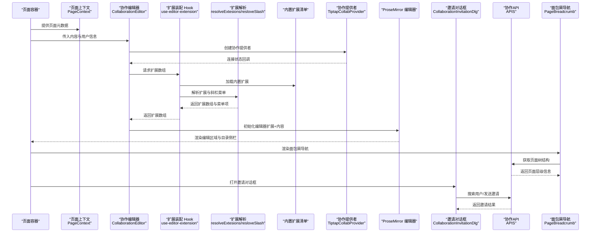
```mermaid
sequenceDiagram
participant UI as "页面容器"
participant Ctx as "页面上下文<br/>PageContext"
participant Collab as "协作编辑器<br/>CollaborationEditor"
participant ExtHook as "扩展装配 Hook<br/>use-editor-extension"
participant Kit as "扩展解析<br/>resolveExtesions/resloveSlash"
participant BuildIn as "内置扩展清单"
participant Provider as "协作提供者<br/>TiptapCollabProvider"
participant PM as "ProseMirror 编辑器"
participant InviteDlg as "邀请对话框<br/>CollaborationInvitationDlg"
participant API as "协作API<br/>APIS"
participant Breadcrumb as "面包屑导航<br/>PageBreadcrumb"
UI->>Ctx : 提供页面元数据
UI->>Collab : 传入内容与用户信息
Collab->>Provider : 创建协作提供者
Provider-->>Collab : 连接状态回调
Collab->>ExtHook : 请求扩展数组
ExtHook->>BuildIn : 加载内置扩展
ExtHook->>Kit : 解析扩展与斜杠菜单
Kit-->>ExtHook : 返回扩展数组与菜单项
ExtHook-->>Collab : 返回扩展数组
Collab->>PM : 初始化编辑器扩展+内容
PM-->>UI : 渲染编辑区域与目录侧栏
UI->>Breadcrumb : 渲染面包屑导航
Breadcrumb->>API : 获取页面树结构
API-->>Breadcrumb : 返回页面层级信息
UI->>InviteDlg : 打开邀请对话框
InviteDlg->>API : 搜索用户/发送邀请
API-->>InviteDlg : 返回邀请结果
```

**图表来源**
- [packages/editor/src/editor/collaboration.tsx](file://packages/editor/src/editor/collaboration.tsx#L1-L162)
- [packages/editor/src/editor/use-extension.ts](file://packages/editor/src/editor/use-extension.ts#L1-L62)
- [packages/editor/src/editor/kit.tsx](file://packages/editor/src/editor/kit.tsx#L1-L87)
- [packages/editor/src/editor/build-in-extension.ts](file://packages/editor/src/editor/build-in-extension.ts#L1-L56)
- [packages/plugin-main/src/pages/components/CollaborationInvitationDlg.tsx](file://packages/plugin-main/src/pages/components/CollaborationInvitationDlg.tsx#L1-L561)
- [packages/plugin-main/src/api/index.ts](file://packages/plugin-main/src/api/index.ts#L100-L171)
- [packages/plugin-main/src/components/PageBreadcrumb.tsx](file://packages/plugin-main/src/components/PageBreadcrumb.tsx#L1-L96)

## 详细组件分析

### 协作编辑器容器（编辑模式）
- 职责
  - 装配扩展、渲染菜单、挂载编辑区域与目录侧栏、维护编辑状态回调。
  - 通过上下文传递页面元数据，便于扩展与业务逻辑读取。
  - 动态注入协作扩展和用户光标同步。
- 关键点
  - 使用 Hook 获取扩展数组与扩展包装，注入编辑器初始化。
  - 支持目录更新回调，动态刷新目录树。
  - 提供容器样式与宽度控制，适配侧栏布局。
  - 实现协作提供者的清理机制，防止内存泄漏。
- 参考路径
  - [协作编辑器组件](file://packages/editor/src/editor/collaboration.tsx#L1-L162)
  - [页面上下文定义](file://packages/editor/src/editor/context.tsx#L1-L14)

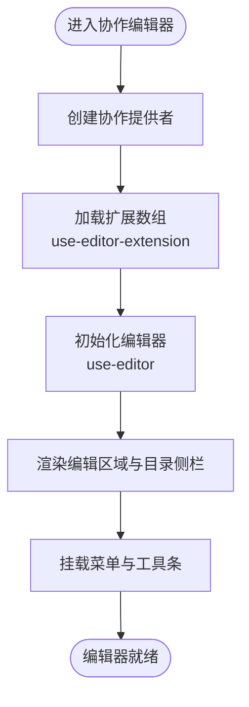
```mermaid
flowchart TD
Start(["进入协作编辑器"]) --> CreateProvider["创建协作提供者"]
CreateProvider --> LoadExt["加载扩展数组<br/>use-editor-extension"]
LoadExt --> InitEditor["初始化编辑器<br/>use-editor"]
InitEditor --> Render["渲染编辑区域与目录侧栏"]
Render --> Menu["挂载菜单与工具条"]
Menu --> Ready(["编辑器就绪"])
```

**图表来源**
- [packages/editor/src/editor/collaboration.tsx](file://packages/editor/src/editor/collaboration.tsx#L1-L162)
- [packages/editor/src/editor/use-extension.ts](file://packages/editor/src/editor/use-extension.ts#L1-L62)

**章节来源**
- [packages/editor/src/editor/collaboration.tsx](file://packages/editor/src/editor/collaboration.tsx#L1-L162)
- [packages/editor/src/editor/context.tsx](file://packages/editor/src/editor/context.tsx#L1-L14)

### 扩展解析与装配（扩展机制）
- 职责
  - 将插件提供的扩展包装转换为运行时扩展数组；解析斜杠菜单配置；合并内置扩展与外部扩展。
  - 支持协作编辑的唯一ID过滤和变更来源检测。
- 关键点
  - 扩展包装类型包含扩展对象、名称、气泡菜单、菜单配置、斜杠菜单、浮动菜单、工具等字段。
  - 解析函数支持数组与单个扩展对象两种形态。
  - 斜杠菜单通过统一字符与插槽聚合，形成可交互的命令面板。
  - 使用 `isChangeOrigin` 过滤协作变更，避免循环更新。
- 参考路径
  - [扩展解析与组合](file://packages/editor/src/editor/kit.tsx#L1-L87)
  - [扩展装配 Hook](file://packages/editor/src/editor/use-extension.ts#L1-L62)
  - [扩展包装类型](file://packages/common/src/core/editor.ts#L1-L31)

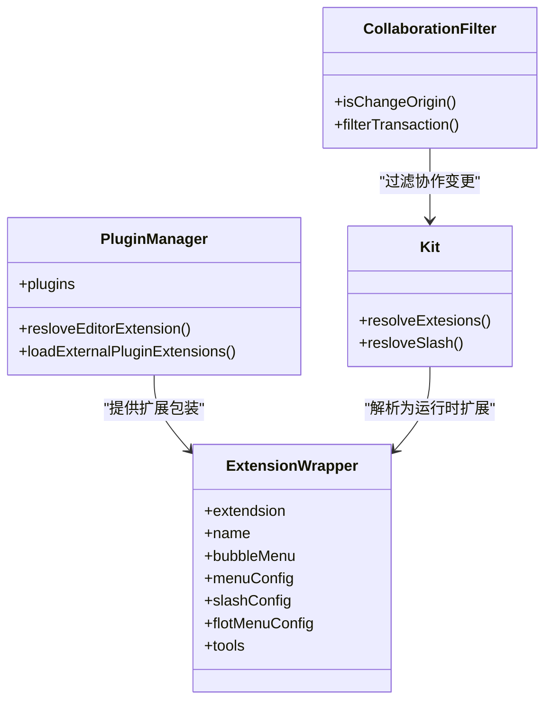
```mermaid
classDiagram
class ExtensionWrapper {
+extendsion
+name
+bubbleMenu
+menuConfig
+slashConfig
+flotMenuConfig
+tools
}
class PluginManager {
+plugins
+resloveEditorExtension()
+loadExternalPluginExtensions()
}
class Kit {
+resolveExtesions()
+resloveSlash()
}
class CollaborationFilter {
+isChangeOrigin()
+filterTransaction()
}
PluginManager --> ExtensionWrapper : "提供扩展包装"
Kit --> ExtensionWrapper : "解析为运行时扩展"
CollaborationFilter --> Kit : "过滤协作变更"
```

**图表来源**
- [packages/common/src/core/editor.ts](file://packages/common/src/core/editor.ts#L1-L31)
- [packages/common/src/core/PluginManager.ts](file://packages/common/src/core/PluginManager.ts#L430-L489)
- [packages/editor/src/editor/kit.tsx](file://packages/editor/src/editor/kit.tsx#L1-L87)
- [packages/editor/src/editor/use-extension.ts](file://packages/editor/src/editor/use-extension.ts#L1-L62)

**章节来源**
- [packages/editor/src/editor/kit.tsx](file://packages/editor/src/editor/kit.tsx#L1-L87)
- [packages/editor/src/editor/use-extension.ts](file://packages/editor/src/editor/use-extension.ts#L1-L62)
- [packages/common/src/core/editor.ts](file://packages/common/src/core/editor.ts#L1-L31)
- [packages/common/src/core/PluginManager.ts](file://packages/common/src/core/PluginManager.ts#L430-L489)

### 气泡菜单与工具条（交互体验）
- 职责
  - 在选区变化时显示节点级或段落级的悬浮菜单，支持自定义定位与显示条件。
- 关键点
  - 默认定位策略与主题样式可配置；支持节点级菜单以适配复杂节点（如表格单元格）。
- 参考路径
  - [气泡菜单组件](file://packages/editor/src/components/bubble-menu.tsx#L1-L84)

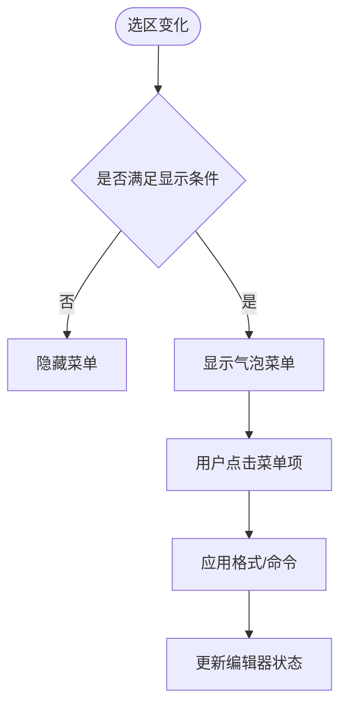
```mermaid
flowchart TD
Sel(["选区变化"]) --> ShouldShow{"是否满足显示条件"}
ShouldShow -- 否 --> Hide["隐藏菜单"]
ShouldShow -- 是 --> Show["显示气泡菜单"]
Show --> Interact["用户点击菜单项"]
Interact --> Apply["应用格式/命令"]
Apply --> Update["更新编辑器状态"]
```

**图表来源**
- [packages/editor/src/components/bubble-menu.tsx](file://packages/editor/src/components/bubble-menu.tsx#L1-L84)

**章节来源**
- [packages/editor/src/components/bubble-menu.tsx](file://packages/editor/src/components/bubble-menu.tsx#L1-L84)

### 编辑器包装容器（布局与外观）
- 职责
  - 提供编辑器外层容器，承载背景与布局，保证编辑区域占满可用空间。
- 参考路径
  - [编辑器包装容器](file://packages/editor/src/components/editor-wrapper.tsx#L1-L18)

**章节来源**
- [packages/editor/src/components/editor-wrapper.tsx](file://packages/editor/src/components/editor-wrapper.tsx#L1-L18)

### 内置扩展集合（功能基座）
- 职责
  - 提供标题、加粗、斜体、删除线、上/下标、引用块、代码与代码块、表格、对齐、水平分割线、有序/无序列表、颜色、链接、日期、表情、数学公式、背景色、加载、任务清单、页面内容块、Markdown、缩进、行高、注释、画笔、目录、事件、选择、未知节点、高亮、详情等扩展。
- 参考路径
  - [扩展导出汇总](file://packages/editor/src/extensions/index.ts#L1-L64)
  - [内置扩展清单](file://packages/editor/src/editor/build-in-extension.ts#L1-L56)

**章节来源**
- [packages/editor/src/extensions/index.ts](file://packages/editor/src/extensions/index.ts#L1-L64)
- [packages/editor/src/editor/build-in-extension.ts](file://packages/editor/src/editor/build-in-extension.ts#L1-L56)

### 插件管理与扩展注入（插件生态）
- 职责
  - 动态加载本地与远程插件，聚合插件提供的扩展配置，注入到编辑器运行时。
  - 支持外部插件扩展的动态加载，确保协作编辑的一致性。
- 关键点
  - 插件可通过 editorExtension 字段提供扩展包装；支持卸载与安装插件，触发界面刷新事件。
  - 插件服务与路由、菜单、国际化等也可由插件统一注入。
  - 外部插件扩展加载支持错误处理和降级机制。
- 参考路径
  - [插件管理器](file://packages/common/src/core/PluginManager.ts#L430-L489)

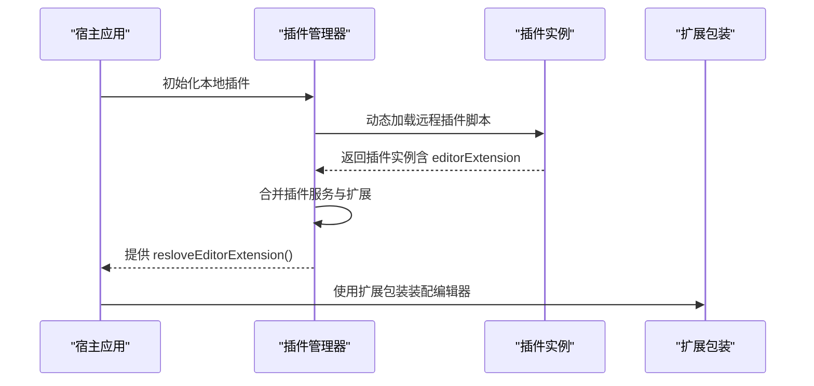
```mermaid
sequenceDiagram
participant Host as "宿主应用"
participant PMgr as "插件管理器"
participant P as "插件实例"
participant Ext as "扩展包装"
Host->>PMgr : 初始化本地插件
PMgr->>P : 动态加载远程插件脚本
P-->>PMgr : 返回插件实例含 editorExtension
PMgr->>PMgr : 合并插件服务与扩展
PMgr-->>Host : 提供 resloveEditorExtension()
Host->>Ext : 使用扩展包装装配编辑器
```

**图表来源**
- [packages/common/src/core/PluginManager.ts](file://packages/common/src/core/PluginManager.ts#L430-L489)
- [packages/common/src/core/editor.ts](file://packages/common/src/core/editor.ts#L1-L31)

**章节来源**
- [packages/common/src/core/PluginManager.ts](file://packages/common/src/core/PluginManager.ts#L430-L489)
- [packages/common/src/core/editor.ts](file://packages/common/src/core/editor.ts#L1-L31)

## PageBreadcrumb组件集成

### PageBreadcrumb组件概述
PageBreadcrumb组件是本次更新的重要新特性，为页面编辑器提供了直观的页面导航体验。该组件专门设计用于显示页面的层级结构和当前位置，帮助用户理解当前页面在整个知识库中的位置。

- **职责**
  - 显示页面的面包屑导航路径
  - 提供首页快捷访问
  - 支持点击导航到任意层级页面
  - 高亮显示当前页面
- **关键特性**
  - 响应式设计，适应不同屏幕尺寸
  - 支持页面树结构的动态构建
  - 点击交互，支持页面间导航
  - 当前页面状态的视觉反馈

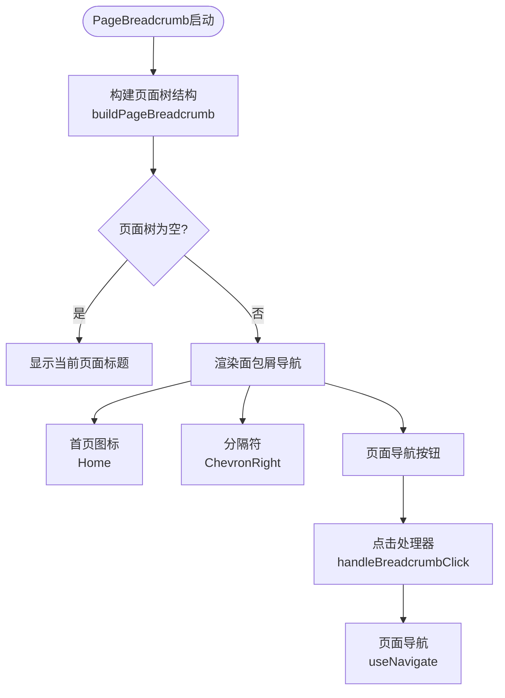
```mermaid
flowchart TD
Start(["PageBreadcrumb启动"]) --> BuildTree["构建页面树结构<br/>buildPageBreadcrumb"]
BuildTree --> CheckEmpty{"页面树为空?"}
CheckEmpty -- 是 --> ShowTitle["显示当前页面标题"]
CheckEmpty -- 否 --> RenderBreadcrumbs["渲染面包屑导航"]
RenderBreadcrumbs --> HomeIcon["首页图标<br/>Home"]
RenderBreadcrumbs --> ChevronRight["分隔符<br/>ChevronRight"]
RenderBreadcrumbs --> PageButtons["页面导航按钮"]
PageButtons --> ClickHandler["点击处理器<br/>handleBreadcrumbClick"]
ClickHandler --> Navigate["页面导航<br/>useNavigate"]
```

**图表来源**
- [packages/plugin-main/src/components/PageBreadcrumb.tsx](file://packages/plugin-main/src/components/PageBreadcrumb.tsx#L1-L96)
- [packages/plugin-main/src/utils/page-breadcrumb.ts](file://packages/plugin-main/src/utils/page-breadcrumb.ts#L1-L20)

**章节来源**
- [packages/plugin-main/src/components/PageBreadcrumb.tsx](file://packages/plugin-main/src/components/PageBreadcrumb.tsx#L1-L96)
- [packages/plugin-main/src/utils/page-breadcrumb.ts](file://packages/plugin-main/src/utils/page-breadcrumb.ts#L1-L20)

### PageBreadcrumb组件实现细节
PageBreadcrumb组件的实现采用了简洁而高效的架构设计：

- **组件结构**
  - 接收currentPageId、pageTree、spaceId和currentTitle四个核心参数
  - 使用buildPageBreadcrumb工具函数构建面包屑路径
  - 通过useNavigate Hook实现页面导航
- **导航逻辑**
  - 首页图标点击导航到空间根目录
  - 面包屑项点击导航到对应页面
  - 当前页面项禁用点击交互
- **样式设计**
  - 使用ChevronRight图标作为分隔符
  - 当前页面使用加粗字体和前景色
  - 非当前页面使用悬停效果
- **边界情况处理**
  - 页面树为空时显示当前页面标题
  - 当前页面标题与最后一个面包屑项不同时显示额外标题

**章节来源**
- [packages/plugin-main/src/components/PageBreadcrumb.tsx](file://packages/plugin-main/src/components/PageBreadcrumb.tsx#L1-L96)

### PageBreadcrumb工具函数
buildPageBreadcrumb工具函数提供了页面树到面包屑路径的转换逻辑：

- **输入参数**
  - currentPageId：当前页面ID
  - pageTree：页面树结构数组
- **输出结果**
  - PageBreadcrumbItem数组，包含id、title和parentId
- **实现逻辑**
  - 参数验证：检查currentPageId和pageTree的有效性
  - 数据映射：将原始页面树节点映射为标准化的面包屑项
  - 结构构建：返回完整的面包屑路径数组

**章节来源**
- [packages/plugin-main/src/utils/page-breadcrumb.ts](file://packages/plugin-main/src/utils/page-breadcrumb.ts#L1-L20)

### PageEditor中的集成方式
PageBreadcrumb组件在PageEditor中的集成体现了现代前端开发的最佳实践：

- **导入与使用**
  - 在第30行导入PageBreadcrumb组件
  - 在第296-301行的位置渲染面包屑导航
- **参数传递**
  - currentPageId：从URL参数获取的页面ID
  - pageTree：从页面数据中获取的父级页面树
  - spaceId：从URL参数获取的空间ID
  - currentTitle：当前页面的标题
- **布局集成**
  - 位于编辑器头部左侧区域
  - 与协作状态显示并排布局
  - 响应式设计，适应不同屏幕尺寸

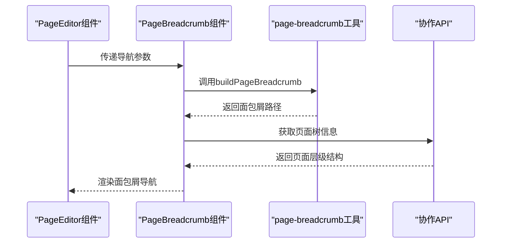
```mermaid
sequenceDiagram
participant PageEditor as "PageEditor组件"
participant PageBreadcrumb as "PageBreadcrumb组件"
participant Utils as "page-breadcrumb工具"
participant API as "协作API"
PageEditor->>PageBreadcrumb : 传递导航参数
PageBreadcrumb->>Utils : 调用buildPageBreadcrumb
Utils-->>PageBreadcrumb : 返回面包屑路径
PageBreadcrumb->>API : 获取页面树信息
API-->>PageBreadcrumb : 返回页面层级结构
PageBreadcrumb-->>PageEditor : 渲染面包屑导航
```

**图表来源**
- [packages/plugin-main/src/pages/SpaceDetail/PageEditor/index.tsx](file://packages/plugin-main/src/pages/SpaceDetail/PageEditor/index.tsx#L296-L301)
- [packages/plugin-main/src/components/PageBreadcrumb.tsx](file://packages/plugin-main/src/components/PageBreadcrumb.tsx#L1-L96)
- [packages/plugin-main/src/utils/page-breadcrumb.ts](file://packages/plugin-main/src/utils/page-breadcrumb.ts#L1-L20)

**章节来源**
- [packages/plugin-main/src/pages/SpaceDetail/PageEditor/index.tsx](file://packages/plugin-main/src/pages/SpaceDetail/PageEditor/index.tsx#L296-L301)
- [packages/plugin-main/src/components/PageBreadcrumb.tsx](file://packages/plugin-main/src/components/PageBreadcrumb.tsx#L1-L96)
- [packages/plugin-main/src/utils/page-breadcrumb.ts](file://packages/plugin-main/src/utils/page-breadcrumb.ts#L1-L20)

## 协作邀请API集成

### 完整邀请流程架构
协作邀请系统提供了端到端的协作邀请解决方案，包括用户搜索、权限管理、邮件邀请和实时通知：

- **邀请发起流程**
  - 用户通过协作邀请对话框发起邀请
  - 支持用户搜索和邮箱邀请两种方式
  - 设置协作权限级别（只读、可编辑、完全访问）
- **邀请验证与接受**
  - 邀请链接验证和状态检查
  - 用户接受邀请后的页面加载
  - 插件一致性保障机制
- **实时协作体验**
  - WebSocket通知系统
  - 实时用户状态同步
  - 协作编辑器集成

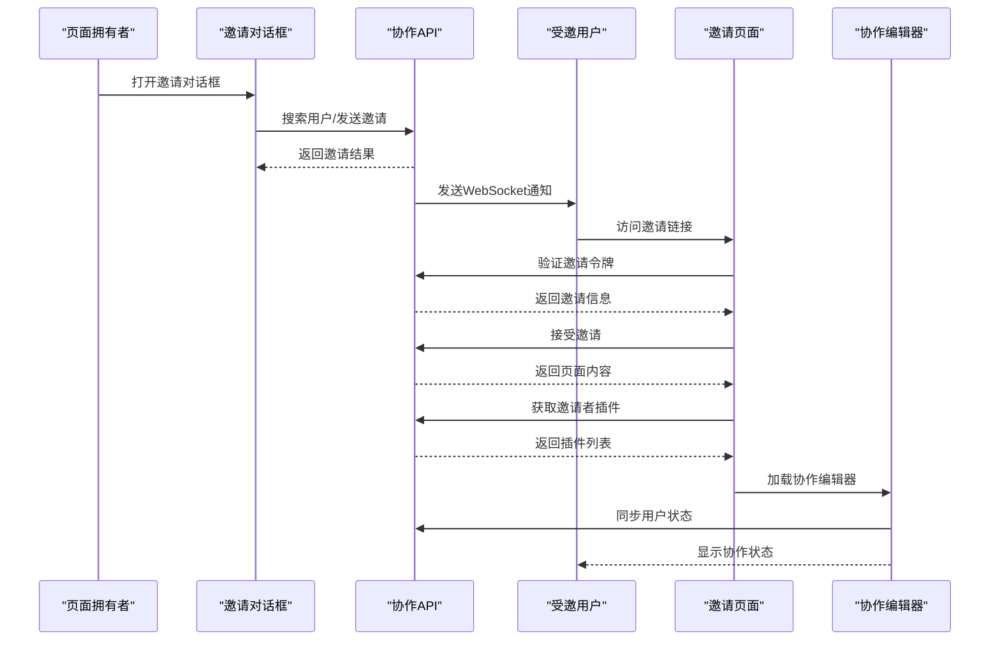
```mermaid
sequenceDiagram
participant Owner as "页面拥有者"
participant InviteDlg as "邀请对话框"
participant API as "协作API"
participant User as "受邀用户"
participant InvitePage as "邀请页面"
participant Editor as "协作编辑器"
Owner->>InviteDlg : 打开邀请对话框
InviteDlg->>API : 搜索用户/发送邀请
API-->>InviteDlg : 返回邀请结果
API->>User : 发送WebSocket通知
User->>InvitePage : 访问邀请链接
InvitePage->>API : 验证邀请令牌
API-->>InvitePage : 返回邀请信息
InvitePage->>API : 接受邀请
API-->>InvitePage : 返回页面内容
InvitePage->>API : 获取邀请者插件
API-->>InvitePage : 返回插件列表
InvitePage->>Editor : 加载协作编辑器
Editor->>API : 同步用户状态
Editor-->>User : 显示协作状态
```

**图表来源**
- [packages/plugin-main/src/pages/components/CollaborationInvitationDlg.tsx](file://packages/plugin-main/src/pages/components/CollaborationInvitationDlg.tsx#L1-L561)
- [packages/plugin-main/src/pages/InviteCollaboration/index.tsx](file://packages/plugin-main/src/pages/InviteCollaboration/index.tsx#L1-L495)
- [packages/plugin-main/src/api/index.ts](file://packages/plugin-main/src/api/index.ts#L100-L171)
- [packages/plugin-main/docs/COLLABORATION_API.md](file://packages/plugin-main/docs/COLLABORATION_API.md#L16-L61)

**章节来源**
- [packages/plugin-main/src/pages/components/CollaborationInvitationDlg.tsx](file://packages/plugin-main/src/pages/components/CollaborationInvitationDlg.tsx#L1-L561)
- [packages/plugin-main/src/pages/InviteCollaboration/index.tsx](file://packages/plugin-main/src/pages/InviteCollaboration/index.tsx#L1-L495)
- [packages/plugin-main/src/api/index.ts](file://packages/plugin-main/src/api/index.ts#L100-L171)
- [packages/plugin-main/docs/COLLABORATION_API.md](file://packages/plugin-main/docs/COLLABORATION_API.md#L1-L806)

### 协作邀请对话框功能
协作邀请对话框提供了完整的协作邀请管理界面：

- **用户搜索与选择**
  - 支持按姓名或邮箱搜索用户
  - 多选用户功能，支持批量邀请
  - 用户头像和基本信息展示
- **权限管理**
  - 权限级别：只读、可编辑、完全访问
  - 权限描述和影响说明
  - 即时权限设置
- **邮件邀请**
  - 邮件地址输入和验证
  - 批量邮件邀请功能
  - 邮件模板和内容
- **协作管理**
  - 当前协作者列表展示
  - 权限修改和移除功能
  - 共享链接生成功能
- **状态反馈**
  - 加载状态指示器
  - 成功和错误消息提示
  - 实时操作反馈

**章节来源**
- [packages/plugin-main/src/pages/components/CollaborationInvitationDlg.tsx](file://packages/plugin-main/src/pages/components/CollaborationInvitationDlg.tsx#L1-L561)

### 协作API定义与实现
协作API提供了完整的后端接口支持：

- **用户搜索API**
  - 搜索现有用户进行邀请
  - 支持关键字搜索和分页
  - 返回用户基本信息
- **协作邀请API**
  - 创建协作邀请记录
  - 支持用户ID和邮箱邀请
  - 权限级别设置
- **协作管理API**
  - 获取当前协作者列表
  - 更新协作者权限
  - 移除协作者
- **共享链接API**
  - 生成页面共享链接
  - 公开/私有权限设置
  - 链接有效期管理
- **邀请处理API**
  - 邀请令牌验证
  - 邀请接受处理
  - 邀请页面内容获取
  - 邀请者插件获取

**章节来源**
- [packages/plugin-main/src/api/index.ts](file://packages/plugin-main/src/api/index.ts#L100-L171)
- [packages/plugin-main/docs/COLLABORATION_API.md](file://packages/plugin-main/docs/COLLABORATION_API.md#L65-L441)

### 消息中心协作通知
消息中心组件支持协作通知的实时展示：

- **通知类型识别**
  - 自动识别协作邀请通知
  - 支持多种通知内容格式
  - 导航链接提取和处理
- **标签分类**
  - 系统通知、协作通知、提及通知
  - 不同类型的视觉标识
  - 未读状态统计
- **实时连接状态**
  - WebSocket连接状态显示
  - 连接异常提示
  - 自动重连机制
- **交互功能**
  - 点击通知直接跳转
  - 标记为已读功能
  - 删除通知功能

**章节来源**
- [packages/core/src/components/MessageBox/index.tsx](file://packages/core/src/components/MessageBox/index.tsx#L1-L487)

## 协作编辑集成

### PageEditor组件的协作编辑实现
PageEditor组件是协作编辑功能的核心实现，提供了完整的页面编辑体验：

- **协作提供者创建**
  - 使用Y.Doc创建独立的协作文档
  - 配置TiptapCollabProvider实现实时协作
  - 支持连接状态监控和用户同步
- **用户状态管理**
  - 生成稳定的用户颜色映射
  - 实时更新协作用户列表
  - 显示连接状态指示器
- **同步状态控制**
  - 等待协作文档同步完成后才渲染编辑器
  - 提供连接状态的视觉反馈
  - 支持离线状态处理
- **邀请按钮集成**
  - 集成协作邀请对话框
  - 权限控制和功能开关
  - 实时协作状态显示

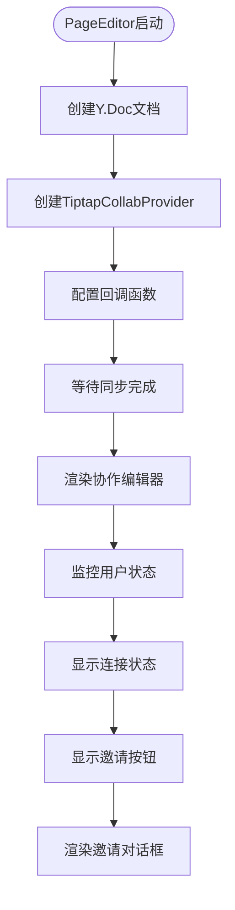
```mermaid
flowchart TD
Start(["PageEditor启动"]) --> CreateDoc["创建Y.Doc文档"]
CreateDoc --> CreateProvider["创建TiptapCollabProvider"]
CreateProvider --> SetupCallbacks["配置回调函数"]
SetupCallbacks --> WaitSync["等待同步完成"]
WaitSync --> RenderEditor["渲染协作编辑器"]
RenderEditor --> MonitorUsers["监控用户状态"]
MonitorUsers --> ShowStatus["显示连接状态"]
ShowStatus --> InviteBtn["显示邀请按钮"]
InviteBtn --> RenderInviteDlg["渲染邀请对话框"]
```

**图表来源**
- [packages/plugin-main/src/pages/SpaceDetail/PageEditor/index.tsx](file://packages/plugin-main/src/pages/SpaceDetail/PageEditor/index.tsx#L87-L126)
- [packages/plugin-main/src/pages/SpaceDetail/PageEditor/index.tsx](file://packages/plugin-main/src/pages/SpaceDetail/PageEditor/index.tsx#L343-L348)

**章节来源**
- [packages/plugin-main/src/pages/SpaceDetail/PageEditor/index.tsx](file://packages/plugin-main/src/pages/SpaceDetail/PageEditor/index.tsx#L1-L556)

### 协作编辑器的扩展注入
协作编辑器通过动态扩展注入实现协作功能：

- **协作扩展配置**
  - Collaboration扩展：同步文档状态
  - CollaborationCursor扩展：同步用户光标位置
  - 用户信息：姓名、颜色、客户端ID
- **扩展依赖关系**
  - 仅在提供者存在时注入协作扩展
  - 使用userRef确保用户信息更新
  - 保持扩展数组的稳定性
- **外部扩展支持**
  - 支持外部插件扩展的动态加载
  - 确保协作编辑的一致性体验
  - 插件加载失败的降级处理

**章节来源**
- [packages/editor/src/editor/collaboration.tsx](file://packages/editor/src/editor/collaboration.tsx#L74-L88)
- [packages/plugin-main/src/pages/InviteCollaboration/index.tsx](file://packages/plugin-main/src/pages/InviteCollaboration/index.tsx#L216-L232)

### 同步块组件的协作实现
SyncBlock组件实现了块级别的协作编辑：

- **独立文档管理**
  - 为每个同步块创建独立的Y.Doc
  - 使用格式化的文档名称空间
  - 支持块级别的同步状态管理
- **嵌套协作编辑**
  - 在同步块内部创建独立的编辑器实例
  - 实现块级别的协作提供者
  - 支持块内内容的实时同步

**章节来源**
- [packages/editor/src/extensions/sync-block/SyncBlock.tsx](file://packages/editor/src/extensions/sync-block/SyncBlock.tsx#L1-L87)

## 同步状态管理

### 连接状态监控
协作编辑系统提供了多层次的连接状态监控：

- **连接状态类型**
  - connecting：正在连接中
  - connected：已连接
  - disconnected：已断开
- **状态指示器**
  - 圆点颜色：绿色=已连接，琥珀色=连接中，红色=断开
  - 动画效果：连接中状态的脉冲动画
  - 文字提示：同步状态的文字描述
- **用户同步机制**
  - awareness更新回调
  - 用户列表去重和排序
  - 实时用户状态更新

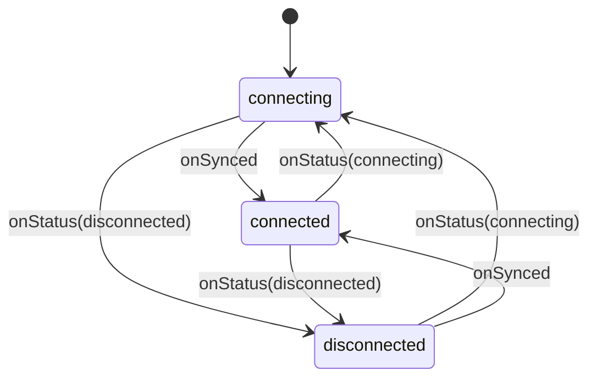
```mermaid
stateDiagram-v2
[*] --> connecting
connecting --> connected : onSynced
connecting --> disconnected : onStatus(disconnected)
connected --> connecting : onStatus(connecting)
connected --> disconnected : onStatus(disconnected)
disconnected --> connecting : onStatus(connecting)
disconnected --> connected : onSynced
```

**图表来源**
- [packages/plugin-main/src/pages/SpaceDetail/PageEditor/index.tsx](file://packages/plugin-main/src/pages/SpaceDetail/PageEditor/index.tsx#L114-L122)
- [packages/plugin-main/src/pages/InviteCollaboration/index.tsx](file://packages/plugin-main/src/pages/InviteCollaboration/index.tsx#L150-L158)

### 用户状态管理
系统实现了完整的用户状态管理机制：

- **用户信息结构**
  - clientId：客户端ID
  - user：用户信息（姓名、颜色、ID）
- **状态更新策略**
  - 使用deepEqual比较避免不必要的更新
  - 最大化用户头像显示数量
  - 实时更新协作用户列表
- **视觉反馈**
  - 用户头像组：重叠显示多个用户
  - 在线状态指示：底部绿色圆点
  - 用户名首字母：作为头像文字

**章节来源**
- [packages/plugin-main/src/pages/SpaceDetail/PageEditor/index.tsx](file://packages/plugin-main/src/pages/SpaceDetail/PageEditor/index.tsx#L97-L108)
- [packages/plugin-main/src/pages/SpaceDetail/PageEditor/index.tsx](file://packages/plugin-main/src/pages/SpaceDetail/PageEditor/index.tsx#L317-L340)

### 协作提供者配置
协作提供者提供了灵活的配置选项：

- **基础配置**
  - baseUrl：协作服务器地址
  - name：文档名称（page:id格式）
  - token：访问令牌
  - document：Y.Doc实例
- **回调函数**
  - onAwarenessUpdate：感知状态更新
  - onSynced：同步完成回调
  - onStatus：连接状态变化
- **清理策略**
  - awareness销毁
  - 连接断开
  - 提供者销毁

**章节来源**
- [packages/plugin-main/src/pages/SpaceDetail/PageEditor/index.tsx](file://packages/plugin-main/src/pages/SpaceDetail/PageEditor/index.tsx#L88-L126)
- [packages/plugin-main/src/pages/InviteCollaboration/index.tsx](file://packages/plugin-main/src/pages/InviteCollaboration/index.tsx#L124-L162)

## 清理机制

### 协作提供者销毁
系统实现了完善的协作提供者清理机制：

- **销毁顺序**
  1. 先销毁awareness（感知状态）
  2. 断开连接
  3. 销毁提供者
- **清理时机**
  - 组件卸载时自动清理
  - 避免内存泄漏和资源占用
  - 确保所有事件监听器被移除
- **错误处理**
  - 提供者可能为空时的安全检查
  - 异常情况下的清理尝试

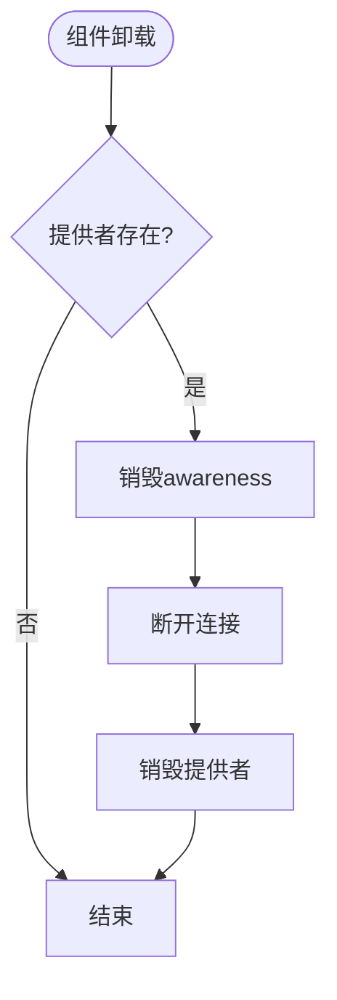
```mermaid
flowchart TD
Unmount(["组件卸载"]) --> CheckProvider{"提供者存在?"}
CheckProvider -- 否 --> End["结束"]
CheckProvider -- 是 --> DestroyAwareness["销毁awareness"]
DestroyAwareness --> Disconnect["断开连接"]
Disconnect --> DestroyProvider["销毁提供者"]
DestroyProvider --> End
```

**图表来源**
- [packages/plugin-main/src/pages/SpaceDetail/PageEditor/index.tsx](file://packages/plugin-main/src/pages/SpaceDetail/PageEditor/index.tsx#L128-L138)
- [packages/plugin-main/src/pages/InviteCollaboration/index.tsx](file://packages/plugin-main/src/pages/InviteCollaboration/index.tsx#L164-L173)

### 编辑器清理
协作编辑器也实现了相应的清理机制：

- **提供者清理**
  - 使用useUnmount Hook确保清理
  - 断开协作提供者的连接
- **状态清理**
  - 清理编辑器状态
  - 移除事件监听器
  - 释放内存资源

**章节来源**
- [packages/editor/src/editor/collaboration.tsx](file://packages/editor/src/editor/collaboration.tsx#L124-L129)

### 自动保存清理
自动保存机制也包含了清理逻辑：

- **清理时机**
  - 组件卸载时取消防抖
  - 避免内存泄漏
- **状态管理**
  - 清理保存状态
  - 重置脏状态标志

**章节来源**
- [packages/editor/src/hooks/use-auto-save.tsx](file://packages/editor/src/hooks/use-auto-save.tsx#L167-L172)

## 依赖分析
- 组件耦合
  - 协作编辑器容器强依赖扩展装配 Hook 与扩展解析工具；扩展装配 Hook 依赖插件管理器与内置扩展清单。
  - 气泡菜单组件独立于编辑器核心，仅依赖编辑器状态与定位策略。
  - PageEditor组件依赖协作提供者、状态管理Hook、PageBreadcrumb组件和协作邀请对话框。
  - 协作邀请对话框依赖API接口和插件管理器。
  - PageBreadcrumb组件依赖导航Hook和页面面包屑工具函数。
- 外部依赖
  - 基于 Tiptap/ProseMirror 的编辑内核，提供扩展体系与渲染能力。
  - 基于 @hocuspocus/provider 的协作提供者，用于多人协作场景。
  - 基于 Yjs 的协同数据结构，支持实时协作。
  - 基于 WebSocket 的消息通知系统。
- 循环依赖
  - 当前结构清晰，未见循环依赖迹象；扩展包装类型位于公共包，避免跨包循环。

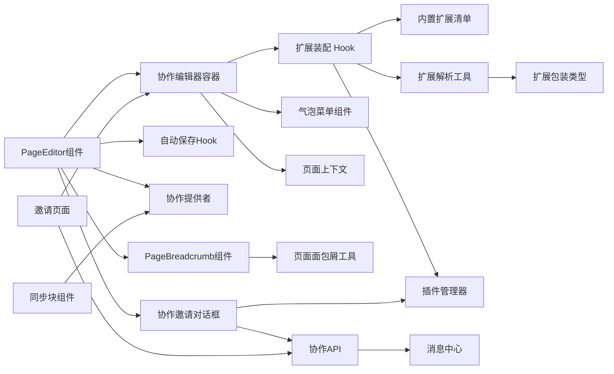
```mermaid
graph LR
Collab["协作编辑器容器"] --> UseExt["扩展装配 Hook"]
UseExt --> BuildIn["内置扩展清单"]
UseExt --> Kit["扩展解析工具"]
Kit --> Types["扩展包装类型"]
Collab --> Bubble["气泡菜单组件"]
Collab --> Ctx["页面上下文"]
UseExt --> PMgr["插件管理器"]
PageEditor["PageEditor组件"] --> Collab
PageEditor --> AutoSave["自动保存Hook"]
PageEditor --> Provider["协作提供者"]
PageEditor --> InviteDlg["协作邀请对话框"]
PageEditor --> PageBreadcrumb["PageBreadcrumb组件"]
PageBreadcrumb --> Utils["页面面包屑工具"]
InviteDlg --> API["协作API"]
InviteDlg --> PMgr
InvitePage["邀请页面"] --> Collab
InvitePage --> API
API --> MessageBox["消息中心"]
SyncBlock["同步块组件"] --> Provider
```

**图表来源**
- [packages/editor/src/editor/collaboration.tsx](file://packages/editor/src/editor/collaboration.tsx#L1-L162)
- [packages/editor/src/editor/use-extension.ts](file://packages/editor/src/editor/use-extension.ts#L1-L62)
- [packages/editor/src/editor/kit.tsx](file://packages/editor/src/editor/kit.tsx#L1-L87)
- [packages/editor/src/editor/build-in-extension.ts](file://packages/editor/src/editor/build-in-extension.ts#L1-L56)
- [packages/editor/src/components/bubble-menu.tsx](file://packages/editor/src/components/bubble-menu.tsx#L1-L84)
- [packages/editor/src/editor/context.tsx](file://packages/editor/src/editor/context.tsx#L1-L14)
- [packages/common/src/core/PluginManager.ts](file://packages/common/src/core/PluginManager.ts#L430-L489)
- [packages/common/src/core/editor.ts](file://packages/common/src/core/editor.ts#L1-L31)
- [packages/plugin-main/src/pages/SpaceDetail/PageEditor/index.tsx](file://packages/plugin-main/src/pages/SpaceDetail/PageEditor/index.tsx#L1-L556)
- [packages/plugin-main/src/pages/InviteCollaboration/index.tsx](file://packages/plugin-main/src/pages/InviteCollaboration/index.tsx#L1-L495)
- [packages/plugin-main/src/pages/components/CollaborationInvitationDlg.tsx](file://packages/plugin-main/src/pages/components/CollaborationInvitationDlg.tsx#L1-L561)
- [packages/plugin-main/src/api/index.ts](file://packages/plugin-main/src/api/index.ts#L100-L171)
- [packages/core/src/components/MessageBox/index.tsx](file://packages/core/src/components/MessageBox/index.tsx#L1-L487)
- [packages/editor/src/hooks/use-auto-save.tsx](file://packages/editor/src/hooks/use-auto-save.tsx#L1-L183)
- [packages/editor/src/extensions/sync-block/SyncBlock.tsx](file://packages/editor/src/extensions/sync-block/SyncBlock.tsx#L1-L87)
- [packages/plugin-main/src/components/PageBreadcrumb.tsx](file://packages/plugin-main/src/components/PageBreadcrumb.tsx#L1-L96)
- [packages/plugin-main/src/utils/page-breadcrumb.ts](file://packages/plugin-main/src/utils/page-breadcrumb.ts#L1-L20)

**章节来源**
- [packages/editor/src/editor/collaboration.tsx](file://packages/editor/src/editor/collaboration.tsx#L1-L162)
- [packages/editor/src/editor/use-extension.ts](file://packages/editor/src/editor/use-extension.ts#L1-L62)
- [packages/editor/src/editor/kit.tsx](file://packages/editor/src/editor/kit.tsx#L1-L87)
- [packages/editor/src/editor/build-in-extension.ts](file://packages/editor/src/editor/build-in-extension.ts#L1-L56)
- [packages/editor/src/components/bubble-menu.tsx](file://packages/editor/src/components/bubble-menu.tsx#L1-L84)
- [packages/editor/src/editor/context.tsx](file://packages/editor/src/editor/context.tsx#L1-L14)
- [packages/common/src/core/PluginManager.ts](file://packages/common/src/core/PluginManager.ts#L430-L489)
- [packages/common/src/core/editor.ts](file://packages/common/src/core/editor.ts#L1-L31)
- [packages/plugin-main/src/pages/SpaceDetail/PageEditor/index.tsx](file://packages/plugin-main/src/pages/SpaceDetail/PageEditor/index.tsx#L1-L556)
- [packages/plugin-main/src/pages/InviteCollaboration/index.tsx](file://packages/plugin-main/src/pages/InviteCollaboration/index.tsx#L1-L495)
- [packages/plugin-main/src/pages/components/CollaborationInvitationDlg.tsx](file://packages/plugin-main/src/pages/components/CollaborationInvitationDlg.tsx#L1-L561)
- [packages/plugin-main/src/api/index.ts](file://packages/plugin-main/src/api/index.ts#L100-L171)
- [packages/core/src/components/MessageBox/index.tsx](file://packages/core/src/components/MessageBox/index.tsx#L1-L487)
- [packages/editor/src/hooks/use-auto-save.tsx](file://packages/editor/src/hooks/use-auto-save.tsx#L1-L183)
- [packages/editor/src/extensions/sync-block/SyncBlock.tsx](file://packages/editor/src/extensions/sync-block/SyncBlock.tsx#L1-L87)
- [packages/plugin-main/src/components/PageBreadcrumb.tsx](file://packages/plugin-main/src/components/PageBreadcrumb.tsx#L1-L96)
- [packages/plugin-main/src/utils/page-breadcrumb.ts](file://packages/plugin-main/src/utils/page-breadcrumb.ts#L1-L20)

## 性能考虑
- 渲染与事务
  - 编辑器初始化时关闭"事务重渲染"，减少不必要的重绘；通过目录更新回调按需刷新目录树。
  - 协作编辑器使用useMemo稳定扩展数组，避免不必要的重新渲染。
- 扩展数量
  - 合理裁剪扩展数量，避免一次性注入过多扩展导致初始化耗时增加。
  - 协作扩展仅在提供者存在时注入，减少非协作场景的开销。
- 选择性启用协作
  - 协作提供者可按需启用，避免在无需协作的场景引入额外开销。
  - 使用userRef避免因用户信息变化导致的扩展重新创建。
- 气泡菜单
  - 通过"显示条件"与定位策略优化菜单出现频率与性能表现。
- 协作性能优化
  - 使用awareness更新回调的深度比较，避免不必要的状态更新。
  - 合理的清理机制防止内存泄漏和资源占用。
  - 同步块组件的独立文档管理减少全局同步压力。
- 外部插件加载
  - 并行加载多个外部插件，提高加载效率。
  - 插件加载失败的降级处理，确保用户体验。
  - 插件缓存机制，避免重复加载。
- **PageBreadcrumb性能优化**
  - **面包屑路径构建采用一次性映射，避免重复计算**
  - **当前页面状态使用useMemo缓存，减少不必要的重新渲染**
  - **导航点击事件使用useCallback优化，避免事件处理器重新创建**

## 故障排查指南
- 编辑器空白或无法渲染
  - 检查扩展数组是否正确解析；确认扩展包装中的扩展对象有效。
  - 确认协作提供者是否正确创建和连接。
  - 参考路径：[扩展解析与组合](file://packages/editor/src/editor/kit.tsx#L1-L87)
- 斜杠菜单未出现
  - 确认插件扩展包装中已提供斜杠菜单配置；检查解析函数是否正确聚合。
  - 参考路径：[扩展装配 Hook](file://packages/editor/src/editor/use-extension.ts#L1-L62)
- 气泡菜单不显示
  - 检查显示条件函数与定位回调；确保编辑器选区变化能触发显示逻辑。
  - 参考路径：[气泡菜单组件](file://packages/editor/src/components/bubble-menu.tsx#L1-L84)
- 协作连接异常
  - 若启用协作提供者，检查连接生命周期与销毁逻辑，避免重复连接或资源泄漏。
  - 检查baseUrl配置是否正确，网络连接是否正常。
  - 确认token验证是否通过，用户权限是否正确。
  - 参考路径：[协作编辑器容器](file://packages/editor/src/editor/collaboration.tsx#L1-L162)
- 同步状态不更新
  - 检查onAwarenessUpdate回调是否正确实现
  - 确认用户列表比较逻辑是否使用deepEqual
  - 验证连接状态回调是否正确处理各种状态
  - 参考路径：[PageEditor组件](file://packages/plugin-main/src/pages/SpaceDetail/PageEditor/index.tsx#L97-L122)
- 自动保存问题
  - 检查useAutoSave Hook的配置参数
  - 确认编辑器实例是否正确传递
  - 验证保存回调函数的实现
  - 参考路径：[自动保存Hook](file://packages/editor/src/hooks/use-auto-save.tsx#L1-L183)
- 协作邀请失败
  - 检查API请求参数和权限验证
  - 确认WebSocket连接状态和通知发送
  - 验证邀请令牌生成和验证逻辑
  - 参考路径：[协作API定义](file://packages/plugin-main/src/api/index.ts#L100-L171)
- 外部插件加载失败
  - 检查插件URL和pluginKey配置
  - 确认插件资源路径可访问
  - 验证插件格式和editorExtensions配置
  - 参考路径：[插件管理器](file://packages/common/src/core/PluginManager.ts#L430-L489)
- **PageBreadcrumb导航问题**
  - **检查currentPageId和pageTree参数是否正确传递**
  - **确认页面树结构格式符合预期**
  - **验证导航路径是否正确构建**
  - **检查useNavigate Hook的路由配置**
  - **参考路径：[PageBreadcrumb组件](file://packages/plugin-main/src/components/PageBreadcrumb.tsx#L1-L96)**

**章节来源**
- [packages/editor/src/editor/kit.tsx](file://packages/editor/src/editor/kit.tsx#L1-L87)
- [packages/editor/src/editor/use-extension.ts](file://packages/editor/src/editor/use-extension.ts#L1-L62)
- [packages/editor/src/components/bubble-menu.tsx](file://packages/editor/src/components/bubble-menu.tsx#L1-L84)
- [packages/editor/src/editor/collaboration.tsx](file://packages/editor/src/editor/collaboration.tsx#L1-L162)
- [packages/plugin-main/src/pages/SpaceDetail/PageEditor/index.tsx](file://packages/plugin-main/src/pages/SpaceDetail/PageEditor/index.tsx#L1-L556)
- [packages/editor/src/hooks/use-auto-save.tsx](file://packages/editor/src/hooks/use-auto-save.tsx#L1-L183)
- [packages/plugin-main/src/api/index.ts](file://packages/plugin-main/src/api/index.ts#L100-L171)
- [packages/common/src/core/PluginManager.ts](file://packages/common/src/core/PluginManager.ts#L430-L489)
- [packages/plugin-main/src/components/PageBreadcrumb.tsx](file://packages/plugin-main/src/components/PageBreadcrumb.tsx#L1-L96)

## 结论
本方案以 Tiptap/ProseMirror 为核心，结合插件化扩展与内置扩展集，构建了可扩展、可协作、可定制的页面编辑能力。通过"扩展包装类型 + 插件管理器 + 扩展解析工具"的三层抽象，既保证了编辑器的灵活性，也降低了插件接入成本。配合气泡菜单与目录侧栏，提供了良好的编辑体验。

**重大增强包括：**
- PageEditor组件的完整协作编辑实现
- **PageBreadcrumb组件的集成，提供直观的页面导航体验**
- 多层次的同步状态管理机制
- 完善的清理机制防止资源泄漏
- 智能的自动保存和状态管理
- 块级别的协作编辑支持
- 完整的协作邀请API集成
- 协作邀请对话框的用户友好界面
- 消息中心的实时协作通知支持
- 外部插件扩展的一致性保障机制
- **PageBreadcrumb工具函数的高效实现**

**后续可在协作提供者优化、版本管理与草稿持久化、用户权限控制、插件生态系统建设、导航体验优化等方面进一步增强。**

## 附录

### 使用示例（操作指引）
- 在编辑器中添加与管理内容元素
  - 文本编辑与格式设置：使用内置扩展中的加粗、斜体、下划线、删除线、上/下标、颜色、背景色、对齐、行高等能力。
  - 列表与标题：使用有序/无序列表、标题扩展，快速组织内容层级。
  - 表格与多栏：使用表格与多栏扩展，构建复杂布局。
  - 链接与日期：使用链接与日期扩展，插入超链接与时间信息。
  - 数学公式与表情：使用数学与表情扩展，提升表达力。
  - 参考与注释：使用块引用、注释扩展，支持引用与批注。
  - 任务清单与高亮：使用任务清单与高亮扩展，辅助任务跟踪与重点标注。
  - 参考路径：[扩展导出汇总](file://packages/editor/src/extensions/index.ts#L1-L64)
- 插件集成与扩展注入
  - 定义插件的 editorExtension 字段，提供扩展包装；通过插件管理器加载插件，自动注入扩展。
  - 支持外部插件扩展的动态加载，确保协作编辑的一致性体验。
  - 参考路径：[插件管理器](file://packages/common/src/core/PluginManager.ts#L430-L489)、[扩展包装类型](file://packages/common/src/core/editor.ts#L1-L31)
- 编辑模式与预览模式切换
  - 编辑模式：通过协作编辑器容器渲染编辑区域与菜单。
  - 预览模式：可基于编辑器内容生成只读视图（建议在业务层实现），或复用编辑器的只读渲染能力。
  - 参考路径：[协作编辑器容器](file://packages/editor/src/editor/collaboration.tsx#L1-L162)
- 页面内容的创建、编辑、保存与发布
  - 创建：初始化编辑器并传入空内容或默认模板。
  - 编辑：在编辑器中实时修改内容，利用扩展与菜单完成格式与结构调整。
  - 保存：将编辑器 JSONContent 序列化后提交至后端存储。
  - 发布：在业务层将已保存内容标记为发布状态，并渲染到页面查看器。
  - 参考路径：[协作编辑器容器](file://packages/editor/src/editor/collaboration.tsx#L1-L162)
- 页面版本管理、草稿保存与协作编辑
  - 版本管理：在业务层维护页面历史版本，编辑器仅负责内容渲染与扩展执行。
  - 草稿保存：使用useAutoSave Hook定期序列化编辑器内容并持久化，支持断点续编。
  - 协作编辑：通过PageEditor组件启用协作提供者，实现多人实时编辑与光标同步。
  - 同步状态：监控连接状态和用户同步，提供实时的协作反馈。
  - 清理机制：确保协作提供者正确销毁，防止内存泄漏。
  - 协作邀请：通过协作邀请对话框管理协作者，设置权限级别和共享链接。
  - 实时通知：通过消息中心接收协作邀请通知，支持直接导航到协作页面。
  - **页面导航：通过PageBreadcrumb组件提供直观的页面层级导航，支持首页快捷访问和页面间跳转。**
  - 参考路径：[PageEditor组件](file://packages/plugin-main/src/pages/SpaceDetail/PageEditor/index.tsx#L1-L556)、[自动保存Hook](file://packages/editor/src/hooks/use-auto-save.tsx#L1-L183)、[协作邀请对话框](file://packages/plugin-main/src/pages/components/CollaborationInvitationDlg.tsx#L1-L561)、[PageBreadcrumb组件](file://packages/plugin-main/src/components/PageBreadcrumb.tsx#L1-L96)
- 分页与列表数据结构参考
  - 分页实体用于列表分页场景，便于在页面查看器中展示大量页面。
  - 参考路径：[分页实体](file://packages/common/src/entity/Page.ts#L1-L8)
- **PageBreadcrumb使用示例**
  - **参数传递：currentPageId、pageTree、spaceId、currentTitle**
  - **导航实现：点击面包屑项跳转到对应页面**
  - **状态反馈：当前页面高亮显示，非当前页面可点击**
  - **边界处理：页面树为空时显示当前页面标题**
  - **参考路径：[PageBreadcrumb组件](file://packages/plugin-main/src/components/PageBreadcrumb.tsx#L1-L96)**

**章节来源**
- [packages/editor/src/extensions/index.ts](file://packages/editor/src/extensions/index.ts#L1-L64)
- [packages/common/src/core/PluginManager.ts](file://packages/common/src/core/PluginManager.ts#L430-L489)
- [packages/common/src/core/editor.ts](file://packages/common/src/core/editor.ts#L1-L31)
- [packages/editor/src/editor/collaboration.tsx](file://packages/editor/src/editor/collaboration.tsx#L1-L162)
- [packages/plugin-main/src/pages/SpaceDetail/PageEditor/index.tsx](file://packages/plugin-main/src/pages/SpaceDetail/PageEditor/index.tsx#L1-L556)
- [packages/editor/src/hooks/use-auto-save.tsx](file://packages/editor/src/hooks/use-auto-save.tsx#L1-L183)
- [packages/plugin-main/src/pages/components/CollaborationInvitationDlg.tsx](file://packages/plugin-main/src/pages/components/CollaborationInvitationDlg.tsx#L1-L561)
- [packages/common/src/entity/Page.ts](file://packages/common/src/entity/Page.ts#L1-L8)
- [packages/plugin-main/src/components/PageBreadcrumb.tsx](file://packages/plugin-main/src/components/PageBreadcrumb.tsx#L1-L96)
- [packages/plugin-main/src/utils/page-breadcrumb.ts](file://packages/plugin-main/src/utils/page-breadcrumb.ts#L1-L20)