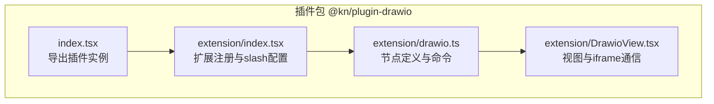
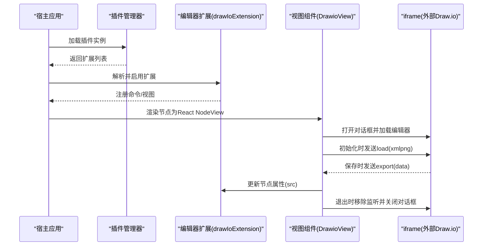
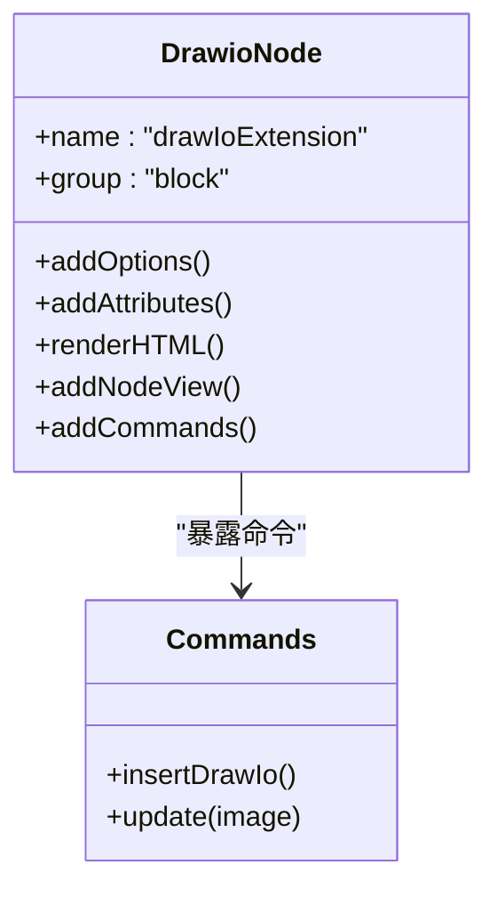
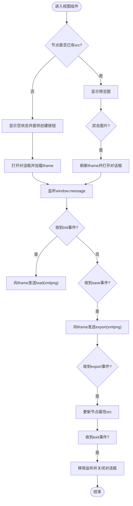
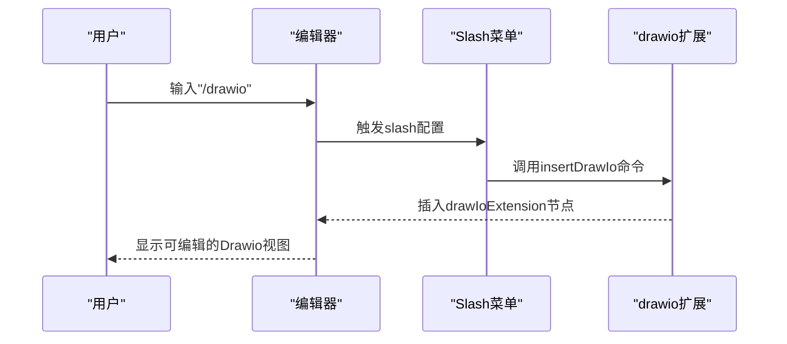
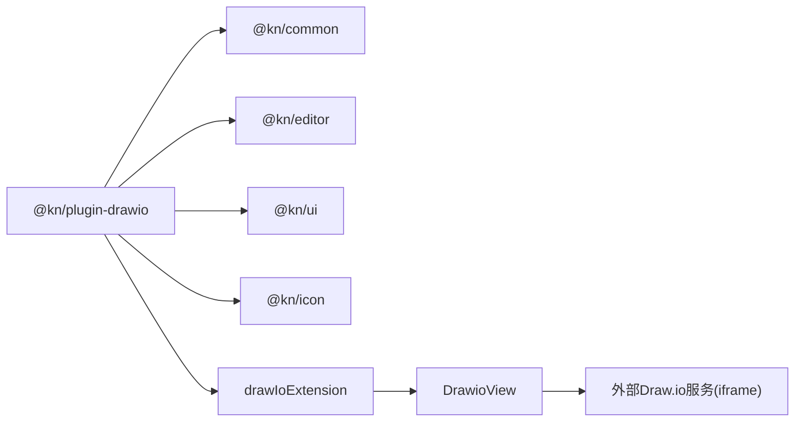
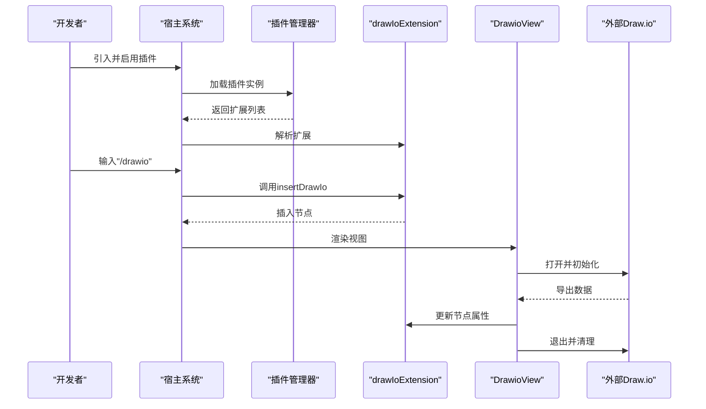

# Draw.io集成插件

<cite>
**本文引用的文件**
- [packages/plugin-drawio/src/index.tsx](file://packages/plugin-drawio/src/index.tsx)
- [packages/plugin-drawio/src/extension/drawio.ts](file://packages/plugin-drawio/src/extension/drawio.ts)
- [packages/plugin-drawio/src/extension/DrawioView.tsx](file://packages/plugin-drawio/src/extension/DrawioView.tsx)
- [packages/plugin-drawio/src/extension/index.tsx](file://packages/plugin-drawio/src/extension/index.tsx)
- [packages/common/src/core/PluginManager.ts](file://packages/common/src/core/PluginManager.ts)
- [packages/editor/src/editor/use-extension.ts](file://packages/editor/src/editor/use-extension.ts)
- [packages/plugin-drawio/package.json](file://packages/plugin-drawio/package.json)
</cite>

## 目录
1. [简介](#简介)
2. [项目结构](#项目结构)
3. [核心组件](#核心组件)
4. [架构总览](#架构总览)
5. [详细组件分析](#详细组件分析)
6. [依赖分析](#依赖分析)
7. [性能考虑](#性能考虑)
8. [故障排除指南](#故障排除指南)
9. [结论](#结论)
10. [附录：使用示例与流程](#附录使用示例与流程)

## 简介
本文件面向需要在编辑器中集成 Draw.io 在线图表工具的开发者，系统性阐述 Draw.io 集成插件的设计与实现。内容涵盖插件配置、扩展注册、视图渲染机制、交互与数据绑定策略，以及与外部 Draw.io 服务的通信协议、数据格式转换与错误处理建议。文末提供从插件安装到图表创建的完整使用示例流程。

## 项目结构
Draw.io 插件位于独立包中，采用“插件入口 + 编辑器扩展 + 视图组件”的分层组织方式：
- 插件入口负责声明插件名称、状态与编辑器扩展列表，并导出可被宿主系统加载的插件实例。
- 编辑器扩展定义节点类型、默认属性、命令与视图渲染器。
- 视图组件负责在编辑器中呈现并承载嵌入的 Draw.io 编辑器（通过 iframe），处理初始化、保存、导出与退出等消息事件。

**图表来源**
- [packages/plugin-drawio/src/index.tsx](file://packages/plugin-drawio/src/index.tsx#L1-L14)
- [packages/plugin-drawio/src/extension/index.tsx](file://packages/plugin-drawio/src/extension/index.tsx#L1-L31)
- [packages/plugin-drawio/src/extension/drawio.ts](file://packages/plugin-drawio/src/extension/drawio.ts#L1-L79)
- [packages/plugin-drawio/src/extension/DrawioView.tsx](file://packages/plugin-drawio/src/extension/DrawioView.tsx#L1-L90)

**章节来源**
- [packages/plugin-drawio/src/index.tsx](file://packages/plugin-drawio/src/index.tsx#L1-L14)
- [packages/plugin-drawio/src/extension/index.tsx](file://packages/plugin-drawio/src/extension/index.tsx#L1-L31)

## 核心组件
- 插件实例：在插件入口中创建插件实例，声明名称与编辑器扩展列表，供宿主系统加载。
- 编辑器扩展：定义节点类型 drawIoExtension，提供默认选项、属性、HTML 渲染与 NodeView 渲染器；同时暴露插入与更新命令。
- 视图组件：基于 NodeViewWrapper 包裹，内部维护对话框与 iframe，监听窗口消息完成初始化、保存、导出与退出流程；支持双击或按钮触发打开编辑器。

关键职责与行为：
- 节点属性：包含 src 字段用于存储最终导出的图片数据。
- 打开编辑器：根据主题选择不同的 UI 参数注入 iframe 地址；首次打开时向 iframe 发送 load 消息以载入已有数据。
- 保存与导出：在收到导出事件后，将返回的数据写回节点属性，从而持久化到编辑器内容中。
- 退出：关闭对话框并移除消息监听，避免内存泄漏。

**章节来源**
- [packages/plugin-drawio/src/extension/drawio.ts](file://packages/plugin-drawio/src/extension/drawio.ts#L1-L79)
- [packages/plugin-drawio/src/extension/DrawioView.tsx](file://packages/plugin-drawio/src/extension/DrawioView.tsx#L1-L90)

## 架构总览
下图展示了插件在编辑器中的装配与运行路径：插件实例注册扩展，扩展在编辑器启动时被解析并加入编辑器扩展集合；节点渲染时由 ReactNodeViewRenderer 渲染为 DrawioView；DrawioView 内部通过 iframe 嵌入 Draw.io，在浏览器环境中进行双向消息通信。

**图表来源**
- [packages/plugin-drawio/src/index.tsx](file://packages/plugin-drawio/src/index.tsx#L1-L14)
- [packages/plugin-drawio/src/extension/index.tsx](file://packages/plugin-drawio/src/extension/index.tsx#L1-L31)
- [packages/plugin-drawio/src/extension/drawio.ts](file://packages/plugin-drawio/src/extension/drawio.ts#L1-L79)
- [packages/plugin-drawio/src/extension/DrawioView.tsx](file://packages/plugin-drawio/src/extension/DrawioView.tsx#L1-L90)

## 详细组件分析

### 组件A：Drawio 节点与命令
- 节点类型：drawIoExtension，作为块级节点存在，具备默认属性 src。
- 默认选项：包含 drawIoLink（嵌入链接）、baseImage（初始占位图）、宽度高度、打开对话框方式等。
- 属性：src 为空表示尚未生成图表，非空则显示导出的图片。
- 命令：
  - insertDrawIo：插入一个带 baseImage 的节点，便于用户直接进入编辑。
  - update：更新当前节点的 src，用于写回导出结果。

**图表来源**
- [packages/plugin-drawio/src/extension/drawio.ts](file://packages/plugin-drawio/src/extension/drawio.ts#L1-L79)

**章节来源**
- [packages/plugin-drawio/src/extension/drawio.ts](file://packages/plugin-drawio/src/extension/drawio.ts#L1-L79)

### 组件B：DrawioView 视图与消息协议
- 对话框与 iframe：使用对话框组件承载 iframe，根据主题动态拼接 UI 参数。
- 事件监听：监听窗口消息，按事件类型执行不同动作：
  - init：向 iframe 发送 load 消息，携带节点的 src 作为初始数据。
  - save：请求导出，指定格式为 xmlpng，并设置 spinKey 标识保存中。
  - export：接收导出数据，调用 updateAttributes 将数据写回节点。
  - exit：移除监听并关闭对话框。
- 双击打开：若节点无数据，提供“创建图表”操作，双击图片也可重新打开编辑器。

**图表来源**
- [packages/plugin-drawio/src/extension/DrawioView.tsx](file://packages/plugin-drawio/src/extension/DrawioView.tsx#L1-L90)

**章节来源**
- [packages/plugin-drawio/src/extension/DrawioView.tsx](file://packages/plugin-drawio/src/extension/DrawioView.tsx#L1-L90)

### 组件C：扩展注册与 Slash 集成
- 扩展包装：通过 ExtensionWrapper 暴露扩展名称、扩展实例与 Slash 配置。
- Slash 行为：在编辑器中输入 “/drawio” 时，自动插入一个 Draw.io 节点，提升可用性。

**图表来源**
- [packages/plugin-drawio/src/extension/index.tsx](file://packages/plugin-drawio/src/extension/index.tsx#L1-L31)

**章节来源**
- [packages/plugin-drawio/src/extension/index.tsx](file://packages/plugin-drawio/src/extension/index.tsx#L1-L31)

## 依赖分析
- 插件装配链路：
  - 插件入口将扩展列表注入插件实例。
  - 宿主系统通过插件管理器收集所有插件的编辑器扩展。
  - 编辑器在启动时解析扩展并合并内置扩展与插件扩展，形成最终扩展集合。
- 外部依赖：
  - @kn/editor：提供 Node、ReactNodeViewRenderer、命令系统等能力。
  - @kn/common：提供插件基类与扩展包装接口。
  - @kn/ui：提供对话框、空态等 UI 组件。
  - @kn/icon：提供图标资源。
  - 外部 Draw.io 服务：通过 iframe 嵌入并使用其提供的消息协议。

**图表来源**
- [packages/plugin-drawio/package.json](file://packages/plugin-drawio/package.json#L1-L32)
- [packages/plugin-drawio/src/extension/drawio.ts](file://packages/plugin-drawio/src/extension/drawio.ts#L1-L79)
- [packages/plugin-drawio/src/extension/DrawioView.tsx](file://packages/plugin-drawio/src/extension/DrawioView.tsx#L1-L90)

**章节来源**
- [packages/common/src/core/PluginManager.ts](file://packages/common/src/core/PluginManager.ts#L1-L170)
- [packages/editor/src/editor/use-extension.ts](file://packages/editor/src/editor/use-extension.ts#L1-L63)
- [packages/plugin-drawio/package.json](file://packages/plugin-drawio/package.json#L1-L32)

## 性能考虑
- iframe 生命周期管理：确保在退出时移除消息监听与卸载 DOM，避免内存泄漏与事件累积。
- 主题切换：根据当前主题动态注入 UI 参数，减少不必要的重绘与样式冲突。
- 初始数据：仅在初始化阶段发送一次 load 请求，避免重复加载导致的性能损耗。
- 导出时机：仅在收到保存事件后再请求导出，降低网络与计算开销。

## 故障排除指南
- 无法打开编辑器
  - 检查 drawIoLink 是否正确，确认网络可达且未被跨域策略阻断。
  - 确认对话框已打开且 iframe 已加载。
- 无法保存或导出
  - 确认收到 export 事件后再更新节点属性；检查消息通道是否被提前移除。
  - 若编辑器未返回导出数据，请确认外部服务端支持所选格式。
- 双击无效
  - 确认 openDialog 配置为双击；检查图片元素是否正确绑定事件。
- 主题不一致
  - 确认主题变量传递给 iframe 的 UI 参数生效；必要时手动刷新页面。

## 结论
该插件通过清晰的三层结构实现了 Draw.io 的无缝集成：插件入口负责装配，扩展定义节点与命令，视图组件承载 iframe 并处理消息协议。整体设计具备良好的可扩展性与易用性，适合在多插件生态中稳定运行。

## 附录：使用示例与流程
- 安装与启用
  - 在宿主系统中引入插件实例，确保插件管理器能够解析并启用编辑器扩展。
  - 启动编辑器后，扩展将被解析并加入扩展集合。
- 创建图表
  - 在编辑器中输入 “/drawio”，触发插入命令，插入一个带初始占位图的节点。
  - 双击预览图或点击“创建图表”按钮，打开对话框并加载 Draw.io 编辑器。
- 编辑与保存
  - 在 Draw.io 中完成编辑后，点击保存；插件会请求导出并接收数据。
  - 数据写回节点属性，预览图随之更新。
- 退出与清理
  - 关闭对话框时，插件移除消息监听并释放资源。

**图表来源**
- [packages/plugin-drawio/src/index.tsx](file://packages/plugin-drawio/src/index.tsx#L1-L14)
- [packages/plugin-drawio/src/extension/index.tsx](file://packages/plugin-drawio/src/extension/index.tsx#L1-L31)
- [packages/plugin-drawio/src/extension/drawio.ts](file://packages/plugin-drawio/src/extension/drawio.ts#L1-L79)
- [packages/plugin-drawio/src/extension/DrawioView.tsx](file://packages/plugin-drawio/src/extension/DrawioView.tsx#L1-L90)