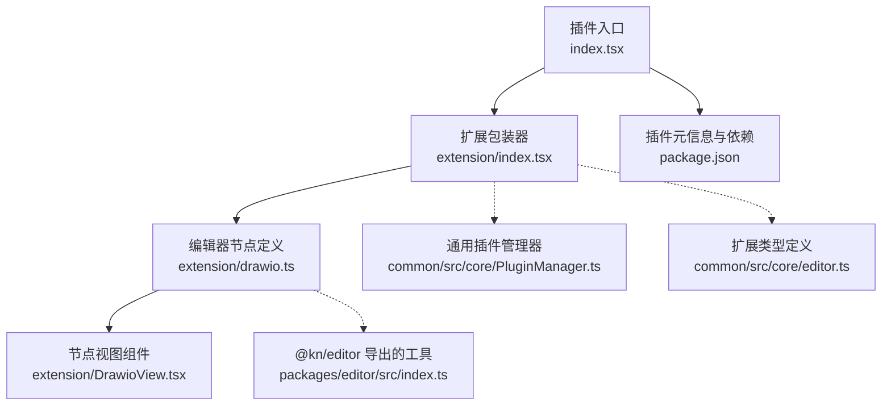
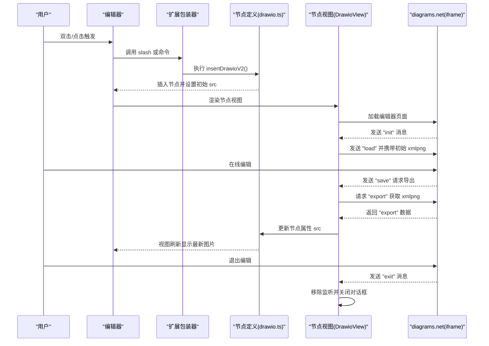
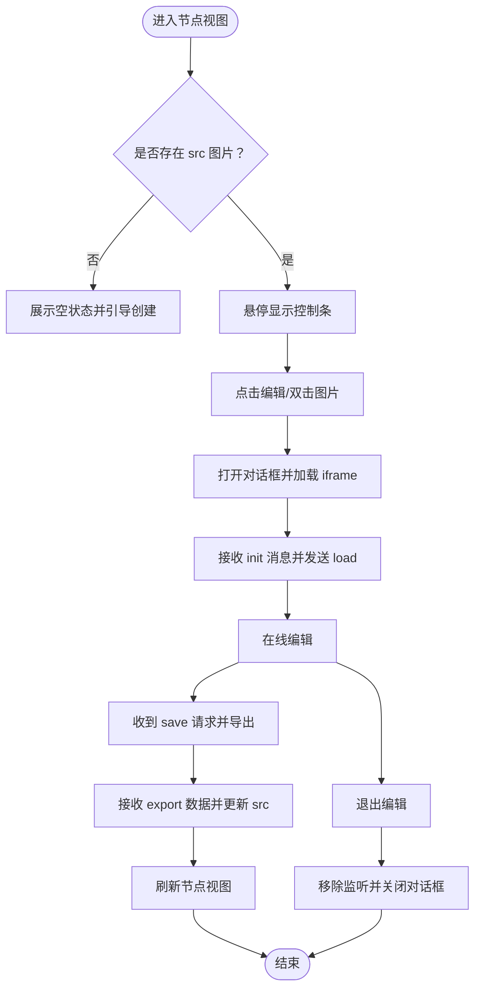
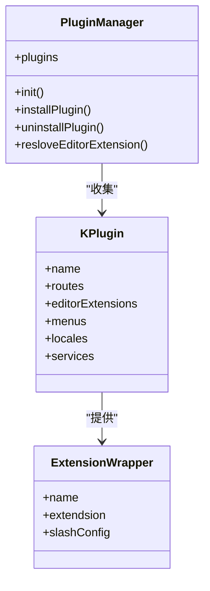
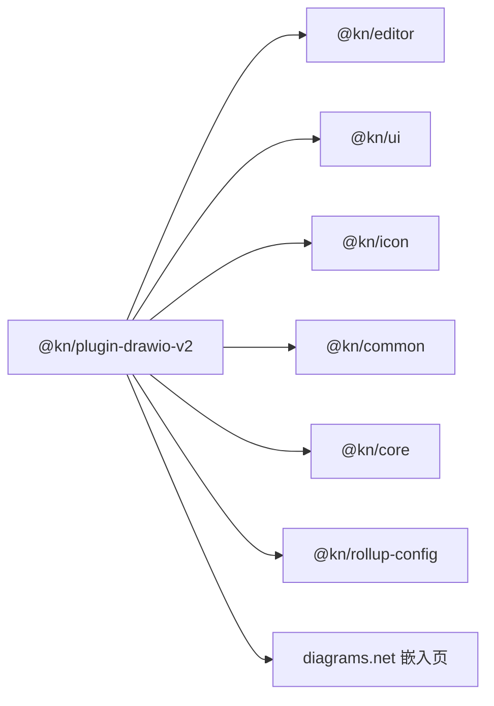

# DrawIO v2集成插件

<cite>
**本文引用的文件**
- [packages/plugin-drawio-v2/src/index.tsx](file://packages/plugin-drawio-v2/src/index.tsx)
- [packages/plugin-drawio-v2/src/extension/index.tsx](file://packages/plugin-drawio-v2/src/extension/index.tsx)
- [packages/plugin-drawio-v2/src/extension/drawio.ts](file://packages/plugin-drawio-v2/src/extension/drawio.ts)
- [packages/plugin-drawio-v2/src/extension/DrawioView.tsx](file://packages/plugin-drawio-v2/src/extension/DrawioView.tsx)
- [packages/plugin-drawio-v2/package.json](file://packages/plugin-drawio-v2/package.json)
- [packages/common/src/core/PluginManager.ts](file://packages/common/src/core/PluginManager.ts)
- [packages/common/src/core/editor.ts](file://packages/common/src/core/editor.ts)
- [packages/editor/src/index.ts](file://packages/editor/src/index.ts)
- [packages/plugin-drawio/src/extension/drawio.ts](file://packages/plugin-drawio/src/extension/drawio.ts)
</cite>

## 目录
1. [简介](#简介)
2. [项目结构](#项目结构)
3. [核心组件](#核心组件)
4. [架构总览](#架构总览)
5. [详细组件分析](#详细组件分析)
6. [依赖关系分析](#依赖关系分析)
7. [性能考虑](#性能考虑)
8. [故障排查指南](#故障排查指南)
9. [结论](#结论)
10. [附录](#附录)

## 简介
本文件面向“DrawIO v2 集成插件”的使用者与维护者，系统化梳理该插件在知识仓库编辑器中的架构、数据流与交互机制。插件通过在编辑器中注入一个可渲染的节点视图，提供基于 diagrams.net 的在线绘图能力，支持双击或命令触发打开编辑器、保存后回写图像数据等完整工作流。

## 项目结构
该插件位于 monorepo 的 packages/plugin-drawio-v2 目录下，采用标准的插件目录组织方式：入口导出插件实例，扩展模块负责编辑器节点与视图，UI 层使用统一的 @kn/ui 组件库与 @kn/icon 图标库。

图表来源
- [packages/plugin-drawio-v2/src/index.tsx](file://packages/plugin-drawio-v2/src/index.tsx#L1-L16)
- [packages/plugin-drawio-v2/src/extension/index.tsx](file://packages/plugin-drawio-v2/src/extension/index.tsx#L1-L39)
- [packages/plugin-drawio-v2/src/extension/drawio.ts](file://packages/plugin-drawio-v2/src/extension/drawio.ts#L1-L81)
- [packages/plugin-drawio-v2/src/extension/DrawioView.tsx](file://packages/plugin-drawio-v2/src/extension/DrawioView.tsx#L1-L147)
- [packages/plugin-drawio-v2/package.json](file://packages/plugin-drawio-v2/package.json#L1-L32)
- [packages/common/src/core/PluginManager.ts](file://packages/common/src/core/PluginManager.ts#L1-L177)
- [packages/common/src/core/editor.ts](file://packages/common/src/core/editor.ts#L1-L32)
- [packages/editor/src/index.ts](file://packages/editor/src/index.ts#L1-L24)

章节来源
- [packages/plugin-drawio-v2/src/index.tsx](file://packages/plugin-drawio-v2/src/index.tsx#L1-L16)
- [packages/plugin-drawio-v2/src/extension/index.tsx](file://packages/plugin-drawio-v2/src/extension/index.tsx#L1-L39)
- [packages/plugin-drawio-v2/src/extension/drawio.ts](file://packages/plugin-drawio-v2/src/extension/drawio.ts#L1-L81)
- [packages/plugin-drawio-v2/src/extension/DrawioView.tsx](file://packages/plugin-drawio-v2/src/extension/DrawioView.tsx#L1-L147)
- [packages/plugin-drawio-v2/package.json](file://packages/plugin-drawio-v2/package.json#L1-L32)

## 核心组件
- 插件实例：通过 KPlugin 包装，注册编辑器扩展，暴露名称、状态与扩展列表。
- 扩展包装器：声明扩展名称、扩展对象、以及“/”快捷菜单配置（中英文两条）。
- 编辑器节点：定义节点属性、默认选项、HTML 渲染、节点视图绑定与命令。
- 节点视图：封装 iframe 嵌入 diagrams.net，处理初始化、保存、导出、退出消息事件，支持全屏与删除操作。

章节来源
- [packages/plugin-drawio-v2/src/index.tsx](file://packages/plugin-drawio-v2/src/index.tsx#L1-L16)
- [packages/plugin-drawio-v2/src/extension/index.tsx](file://packages/plugin-drawio-v2/src/extension/index.tsx#L1-L39)
- [packages/plugin-drawio-v2/src/extension/drawio.ts](file://packages/plugin-drawio-v2/src/extension/drawio.ts#L1-L81)
- [packages/plugin-drawio-v2/src/extension/DrawioView.tsx](file://packages/plugin-drawio-v2/src/extension/DrawioView.tsx#L1-L147)

## 架构总览
插件通过通用的插件管理器加载，将扩展注入到编辑器中；节点视图以 iframe 形式承载外部编辑器，利用 postMessage 实现双向通信，完成初始化、保存导出与退出关闭。

图表来源
- [packages/plugin-drawio-v2/src/extension/index.tsx](file://packages/plugin-drawio-v2/src/extension/index.tsx#L1-L39)
- [packages/plugin-drawio-v2/src/extension/drawio.ts](file://packages/plugin-drawio-v2/src/extension/drawio.ts#L1-L81)
- [packages/plugin-drawio-v2/src/extension/DrawioView.tsx](file://packages/plugin-drawio-v2/src/extension/DrawioView.tsx#L1-L147)

## 详细组件分析

### 插件实例与注册
- 插件类继承自通用 KPlugin，提供 name、status、editorExtension 等字段。
- 通过导出单例实例，供上层编辑器或应用加载。

章节来源
- [packages/plugin-drawio-v2/src/index.tsx](file://packages/plugin-drawio-v2/src/index.tsx#L1-L16)
- [packages/common/src/core/PluginManager.ts](file://packages/common/src/core/PluginManager.ts#L1-L177)

### 扩展包装器与快捷菜单
- 定义扩展名称与扩展对象，并声明两个“/”菜单项：英文与中文，均调用插入命令。
- 使用图标组件作为菜单项图标，提升可发现性。

章节来源
- [packages/plugin-drawio-v2/src/extension/index.tsx](file://packages/plugin-drawio-v2/src/extension/index.tsx#L1-L39)

### 编辑器节点定义
- 节点组为 block，具备默认选项（如宽高、打开对话框方式、基础图片、链接等）。
- 提供两个命令：
  - insertDrawioV2：插入节点并设置初始 src。
  - updateDrawioV2：更新节点属性 src。
- 绑定 ReactNodeViewRenderer，将节点渲染为 DrawioView。

章节来源
- [packages/plugin-drawio-v2/src/extension/drawio.ts](file://packages/plugin-drawio-v2/src/extension/drawio.ts#L1-L81)

### 节点视图组件
- 使用 NodeViewWrapper 包裹，内部包含 Popover 控制条与 Dialog 容器。
- 通过 iframe 加载 diagrams.net，根据主题切换 ui 参数。
- 事件处理：
  - 初始化：向 iframe 发送 load 消息并传入当前 src。
  - 保存：请求导出 xmlpng 并更新节点属性。
  - 退出：移除窗口消息监听并关闭对话框。
- 支持全屏、编辑、删除等操作按钮。

图表来源
- [packages/plugin-drawio-v2/src/extension/DrawioView.tsx](file://packages/plugin-drawio-v2/src/extension/DrawioView.tsx#L1-L147)

章节来源
- [packages/plugin-drawio-v2/src/extension/DrawioView.tsx](file://packages/plugin-drawio-v2/src/extension/DrawioView.tsx#L1-L147)

### 与通用插件系统的集成
- 插件通过 ExtensionWrapper 注入编辑器扩展，包含扩展对象、名称、slash 菜单配置等。
- 插件管理器负责收集所有插件的 editorExtensions 并注入编辑器。

图表来源
- [packages/common/src/core/PluginManager.ts](file://packages/common/src/core/PluginManager.ts#L1-L177)
- [packages/common/src/core/editor.ts](file://packages/common/src/core/editor.ts#L1-L32)

章节来源
- [packages/common/src/core/PluginManager.ts](file://packages/common/src/core/PluginManager.ts#L1-L177)
- [packages/common/src/core/editor.ts](file://packages/common/src/core/editor.ts#L1-L32)

### 与旧版 DrawIO 插件对比
- 新版与旧版在节点命令命名与默认打开方式上存在差异（例如默认打开方式），但整体架构一致：节点定义 + 节点视图 + iframe 通信。
- 新版在命令与菜单项中明确区分了“v2”标识，便于区分版本。

章节来源
- [packages/plugin-drawio/src/extension/drawio.ts](file://packages/plugin-drawio/src/extension/drawio.ts#L1-L79)
- [packages/plugin-drawio-v2/src/extension/drawio.ts](file://packages/plugin-drawio-v2/src/extension/drawio.ts#L1-L81)

## 依赖关系分析
- 运行时依赖
  - @kn/editor：提供节点、视图渲染、命令、工具函数等。
  - @kn/ui、@kn/icon：统一 UI 组件与图标。
  - @kn/common、@kn/core：通用插件框架与核心能力。
- 构建依赖
  - @kn/rollup-config：打包配置。
- 外部资源
  - diagrams.net 嵌入链接，支持主题切换参数。

图表来源
- [packages/plugin-drawio-v2/package.json](file://packages/plugin-drawio-v2/package.json#L1-L32)

章节来源
- [packages/plugin-drawio-v2/package.json](file://packages/plugin-drawio-v2/package.json#L1-L32)

## 性能考虑
- iframe 渲染与通信
  - 首次加载 diagrams.net 会引入额外资源，建议在需要时再打开对话框，避免无谓的网络开销。
  - 仅在收到导出事件时更新节点属性，减少不必要的重渲染。
- 主题切换
  - 根据当前主题动态选择 ui 参数，避免重复切换导致的重新加载。
- 事件监听
  - 在组件卸载时及时移除 window 消息监听，防止内存泄漏与重复回调。

[本节为通用指导，不直接分析具体文件]

## 故障排查指南
- 无法打开编辑器
  - 检查 diagrams.net 嵌入链接是否可用，确认网络环境与跨域策略。
  - 确认节点视图已正确渲染并触发对话框打开。
- 保存后未更新图片
  - 确认 postMessage 通道正常，检查导出事件是否返回数据。
  - 查看节点属性 src 是否被更新。
- 双击无效
  - 确认扩展默认打开方式与用户交互一致（如默认为双击）。
- 主题不生效
  - 检查主题状态传递逻辑，确认 ui 参数随主题变化而切换。

[本节为通用指导，不直接分析具体文件]

## 结论
DrawIO v2 集成插件以清晰的分层设计实现了编辑器内嵌 diagrams.net 的完整流程：插件注册、节点定义、视图渲染与 iframe 通信。其架构复用通用插件框架，易于扩展与维护；同时通过命令与快捷菜单提升了用户体验。建议在生产环境中关注网络与事件监听的健壮性，确保最佳的交互与性能表现。

[本节为总结性内容，不直接分析具体文件]

## 附录
- 关键实现路径参考
  - 插件入口与导出：[packages/plugin-drawio-v2/src/index.tsx](file://packages/plugin-drawio-v2/src/index.tsx#L1-L16)
  - 扩展包装器与菜单：[packages/plugin-drawio-v2/src/extension/index.tsx](file://packages/plugin-drawio-v2/src/extension/index.tsx#L1-L39)
  - 节点定义与命令：[packages/plugin-drawio-v2/src/extension/drawio.ts](file://packages/plugin-drawio-v2/src/extension/drawio.ts#L1-L81)
  - 节点视图与通信：[packages/plugin-drawio-v2/src/extension/DrawioView.tsx](file://packages/plugin-drawio-v2/src/extension/DrawioView.tsx#L1-L147)
  - 插件管理与扩展类型：[packages/common/src/core/PluginManager.ts](file://packages/common/src/core/PluginManager.ts#L1-L177), [packages/common/src/core/editor.ts](file://packages/common/src/core/editor.ts#L1-L32)
  - 编辑器工具导出：[packages/editor/src/index.ts](file://packages/editor/src/index.ts#L1-L24)
  - 旧版对比参考：[packages/plugin-drawio/src/extension/drawio.ts](file://packages/plugin-drawio/src/extension/drawio.ts#L1-L79)