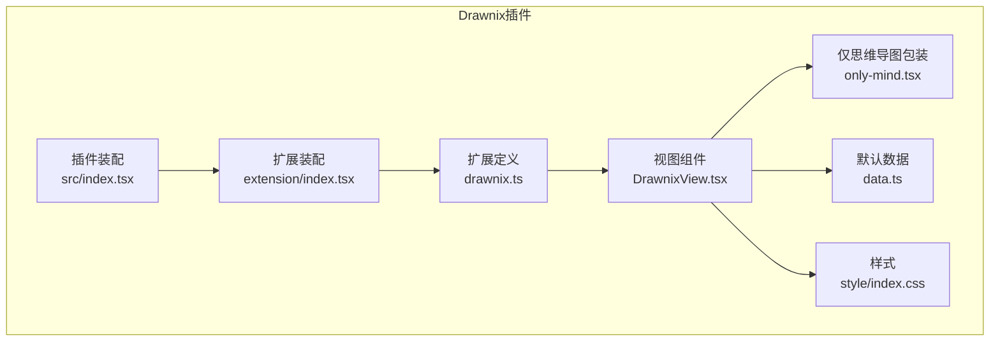
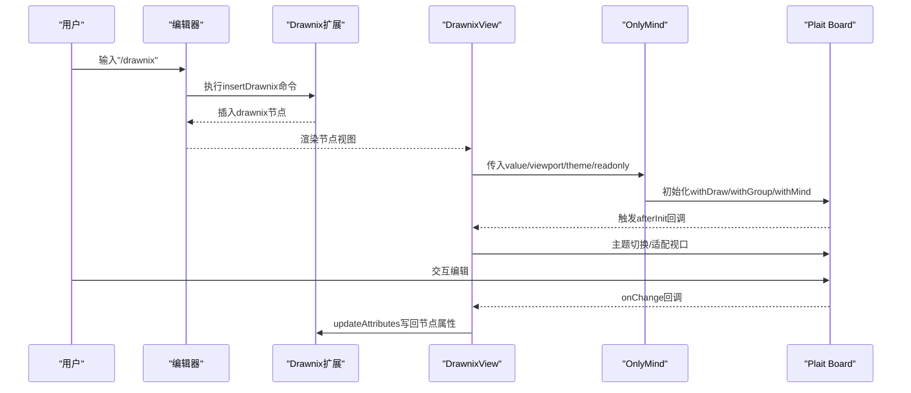
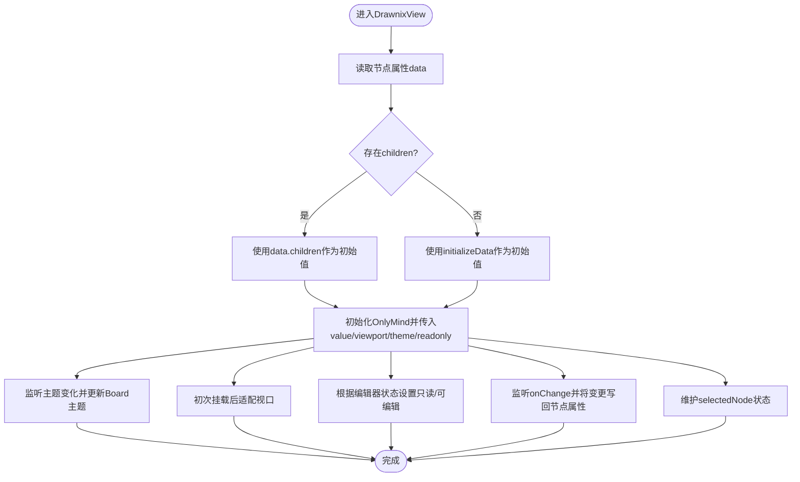
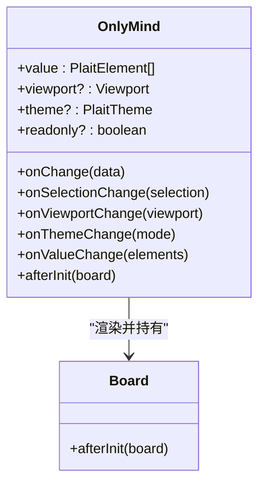
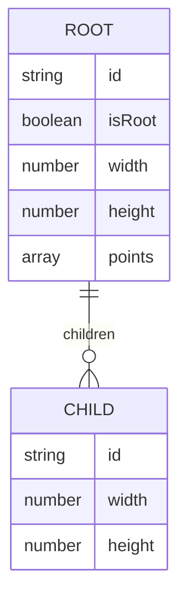
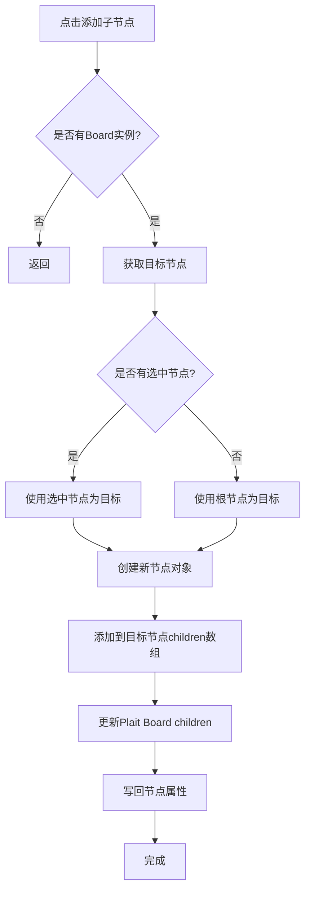
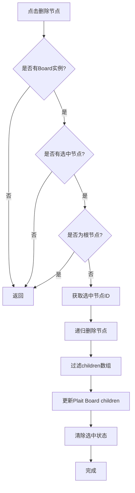
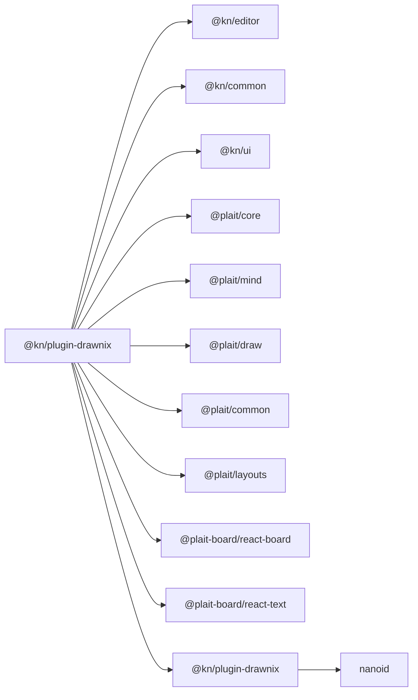

# Drawnix思维导图插件

<cite>
**本文引用的文件**
- [DrawnixView.tsx](file://packages/plugin-drawnix/src/extension/DrawnixView.tsx)
- [drawnix.ts](file://packages/plugin-drawnix/src/extension/drawnix.ts)
- [data.ts](file://packages/plugin-drawnix/src/extension/data.ts)
- [index.tsx（扩展入口）](file://packages/plugin-drawnix/src/extension/index.tsx)
- [only-mind.tsx](file://packages/plugin-drawnix/src/extension/only-mind.tsx)
- [index.css（样式）](file://packages/plugin-drawnix/src/extension/style/index.css)
- [package.json（插件包）](file://packages/plugin-drawnix/package.json)
- [index.tsx（插件装配）](file://packages/plugin-drawnix/src/index.tsx)
- [mindmap-canvas.tsx](file://packages/plugin-mindmap-canvas/src/nodes/mindmap-canvas.tsx)
- [MindmapCanvasView.tsx](file://packages/plugin-mindmap-canvas/src/views/MindmapCanvasView.tsx)
- [default-data.ts](file://packages/plugin-mindmap-canvas/src/nodes/default-data.ts)
</cite>

## 更新摘要
**变更内容**
- 新增子节点添加功能，支持在选中节点下创建新的子节点
- 新增递归删除功能，支持删除选中节点及其所有子节点
- 增强了节点编辑交互能力，提供更完整的思维导图编辑体验
- 优化了节点选择状态管理，支持选中节点的可视化反馈

## 目录
1. [简介](#简介)
2. [项目结构](#项目结构)
3. [核心组件](#核心组件)
4. [架构总览](#架构总览)
5. [组件详解](#组件详解)
6. [新增功能详解](#新增功能详解)
7. [依赖关系分析](#依赖关系分析)
8. [性能与可扩展性](#性能与可扩展性)
9. [使用示例](#使用示例)
10. [故障排查](#故障排查)
11. [结论](#结论)

## 简介
本文件面向Drawnix思维导图插件的使用者与维护者，系统化阐述该插件在知识仓库编辑器中的集成方式与实现细节。内容涵盖：
- 思维导图视图组件的职责与渲染机制
- 数据结构设计与节点关系管理
- 交互逻辑与布局适配
- 样式定制与主题切换
- **新增功能**：子节点添加与递归删除能力
- 使用示例：创建、编辑、导出
- 协作编辑能力与数据导入导出格式建议
- 性能优化策略与最佳实践

## 项目结构
Drawnix插件位于packages/plugin-drawnix目录下，采用"扩展+视图+数据初始化"的分层组织方式：
- 扩展定义：负责节点类型、命令注册与HTML渲染钩子
- 视图组件：封装Plait Board与React桥接，提供只画思维导图能力
- 数据初始化：提供默认思维导图树结构，便于首次渲染
- 插件装配：将扩展注册到编辑器插件体系中，并暴露slash命令

**图表来源**
- [drawnix.ts](file://packages/plugin-drawnix/src/extension/drawnix.ts#L1-L43)
- [DrawnixView.tsx](file://packages/plugin-drawnix/src/extension/DrawnixView.tsx#L1-L137)
- [only-mind.tsx](file://packages/plugin-drawnix/src/extension/only-mind.tsx#L1-L67)
- [data.ts](file://packages/plugin-drawnix/src/extension/data.ts#L1-L212)
- [index.tsx（扩展入口）](file://packages/plugin-drawnix/src/extension/index.tsx#L1-L20)
- [index.tsx（插件装配）](file://packages/plugin-drawnix/src/index.tsx#L2-L14)

**章节来源**
- [drawnix.ts](file://packages/plugin-drawnix/src/extension/drawnix.ts#L1-L43)
- [DrawnixView.tsx](file://packages/plugin-drawnix/src/extension/DrawnixView.tsx#L1-L137)
- [only-mind.tsx](file://packages/plugin-drawnix/src/extension/only-mind.tsx#L1-L67)
- [data.ts](file://packages/plugin-drawnix/src/extension/data.ts#L1-L212)
- [index.tsx（扩展入口）](file://packages/plugin-drawnix/src/extension/index.tsx#L1-L20)
- [index.tsx（插件装配）](file://packages/plugin-drawnix/src/index.tsx#L2-L14)

## 核心组件
- 节点扩展（Drawnix）
  - 定义节点名为"drawnix"，作为块级原子节点
  - 提供插入命令insertDrawnix，用于在编辑器中插入该节点
  - 将节点属性data默认值设为null，实际初始值由视图组件注入
  - 渲染HTML时附加特定类名，便于统一样式控制
- 视图组件（DrawnixView）
  - 基于NodeViewWrapper包裹，承载React组件
  - 读取节点属性data，结合initializeData作为默认值
  - 通过OnlyMind桥接到Plait Board，启用思维导图渲染与交互
  - 监听主题变化并动态更新画板主题；初次挂载后自动适配视口
  - 暴露onChange回调，将变更写回节点属性，实现双向绑定
  - **新增**：支持子节点添加和递归删除功能
- 仅思维导图包装（OnlyMind）
  - 组合withDraw、withGroup、withMind等插件，聚焦思维导图能力
  - 支持只读模式、主题颜色、视口参数、选择与值变更回调
  - 提供afterInit回调，允许外部获取PlaitBoard实例以执行高级操作
- 默认数据（initializeData）
  - 提供一棵完整的思维导图树，包含根节点与若干分支节点
  - 包含topic文本、几何尺寸、坐标点等字段，便于快速演示
- 扩展装配（extension/index.tsx）
  - 将Drawnix扩展注册为编辑器扩展
  - 提供slash命令"/drawnix"，一键插入思维导图节点
- 插件装配（src/index.tsx）
  - 将DrawnixExtension注册为插件，供上层应用加载

**章节来源**
- [drawnix.ts](file://packages/plugin-drawnix/src/extension/drawnix.ts#L1-L43)
- [DrawnixView.tsx](file://packages/plugin-drawnix/src/extension/DrawnixView.tsx#L1-L137)
- [only-mind.tsx](file://packages/plugin-drawnix/src/extension/only-mind.tsx#L1-L67)
- [data.ts](file://packages/plugin-drawnix/src/extension/data.ts#L1-L212)
- [index.tsx（扩展入口）](file://packages/plugin-drawnix/src/extension/index.tsx#L1-L20)
- [index.tsx（插件装配）](file://packages/plugin-drawnix/src/index.tsx#L2-L14)

## 架构总览
Drawnix插件的运行链路如下：
- 编辑器通过slash命令触发插入节点
- 节点扩展创建drawnix节点并渲染视图
- 视图组件加载OnlyMind，传入初始数据与主题
- Plait Board渲染思维导图，支持交互编辑
- 变更通过onChange回写至节点属性，保持数据一致性

**图表来源**
- [index.tsx（扩展入口）](file://packages/plugin-drawnix/src/extension/index.tsx#L1-L20)
- [drawnix.ts](file://packages/plugin-drawnix/src/extension/drawnix.ts#L1-L43)
- [DrawnixView.tsx](file://packages/plugin-drawnix/src/extension/DrawnixView.tsx#L1-L137)
- [only-mind.tsx](file://packages/plugin-drawnix/src/extension/only-mind.tsx#L1-L67)

## 组件详解

### DrawnixView：渲染机制与交互
- 渲染容器
  - 使用NodeViewWrapper包裹，确保与编辑器节点生命周期一致
  - 设置固定高度与阴影，保证在编辑器中具备良好的视觉边界
- 数据绑定
  - 从节点属性读取data.children作为初始值，若为空则回退到initializeData
  - 通过onChange回调将Plait Board的变更写回节点属性，形成双向数据流
- 主题与视口
  - 监听useTheme返回的主题状态，动态切换Plait Board主题色模式
  - 初次获得board实例后调用fitViewport，自动适配内容视图
- 只读模式
  - 根据编辑器是否可编辑设置readonly，避免非编辑态下的交互
- **新增功能**：节点选择与状态管理
  - 维护selectedNode状态，跟踪当前选中的思维导图节点
  - 通过onSelectionChange回调处理节点选择变化

**图表来源**
- [DrawnixView.tsx](file://packages/plugin-drawnix/src/extension/DrawnixView.tsx#L1-L137)
- [data.ts](file://packages/plugin-drawnix/src/extension/data.ts#L1-L212)

**章节来源**
- [DrawnixView.tsx](file://packages/plugin-drawnix/src/extension/DrawnixView.tsx#L1-L137)
- [data.ts](file://packages/plugin-drawnix/src/extension/data.ts#L1-L212)

### OnlyMind：思维导图渲染与插件组合
- 插件组合
  - withDraw：绘制能力
  - withGroup：分组与选择
  - withMind：思维导图专用布局与渲染
- 配置项
  - readonly：是否禁用交互
  - hideScrollbar/disabledScrollOnNonFocus：滚动行为控制
  - themeColors：Mind主题色板
  - 回调：onChange/onSelectionChange/onViewportChange/onThemeChange/onValueChange/afterInit
- 生命周期
  - afterInit回调提供PlaitBoard实例，可用于后续高级操作（如主题切换、视口控制）

**图表来源**
- [only-mind.tsx](file://packages/plugin-drawnix/src/extension/only-mind.tsx#L1-L67)

**章节来源**
- [only-mind.tsx](file://packages/plugin-drawnix/src/extension/only-mind.tsx#L1-L67)

### 数据模型与节点关系
- 数据结构
  - initializeData提供一棵完整的思维导图树，包含根节点与多分支节点
  - 每个节点包含topic文本、几何尺寸(width/height)、坐标(points)、父子关系(children)
- 关系管理
  - 通过children数组表达层级关系
  - isRoot标记根节点，便于布局与渲染识别
- 与编辑器的衔接
  - 视图组件将Plait Board的变更写回节点属性data，保持与编辑器内容同步

**图表来源**
- [data.ts](file://packages/plugin-drawnix/src/extension/data.ts#L1-L212)

**章节来源**
- [data.ts](file://packages/plugin-drawnix/src/extension/data.ts#L1-L212)

### 样式与主题定制
- 样式引入
  - 引入@plait/mind与@plait-board的样式资源，确保渲染一致性
  - 自定义样式覆盖viewport容器尺寸，保证全屏渲染体验
- 主题切换
  - 通过useTheme获取当前主题，动态更新Plait Board主题色模式
  - 支持暗色/彩色两种模式，满足不同阅读偏好

**章节来源**
- [DrawnixView.tsx](file://packages/plugin-drawnix/src/extension/DrawnixView.tsx#L1-L137)
- [index.css（样式）](file://packages/plugin-drawnix/src/extension/style/index.css#L1-L4)

### 与Canvas版本对比（MindmapCanvas）
为便于理解差异，补充Canvas版本的MindmapCanvas组件，帮助评估迁移或对比：
- 数据模型：以节点列表形式存储，包含id、label、parentId、x/y等
- 交互：基于Canvas点击选中、增删节点、重置布局
- 适用场景：对节点数量较大、需要自定义布局的场景更友好

**章节来源**
- [mindmap-canvas.tsx](file://packages/plugin-mindmap-canvas/src/nodes/mindmap-canvas.tsx#L1-L51)
- [MindmapCanvasView.tsx](file://packages/plugin-mindmap-canvas/src/views/MindmapCanvasView.tsx#L1-L207)
- [default-data.ts](file://packages/plugin-mindmap-canvas/src/nodes/default-data.ts#L1-L41)

## 新增功能详解

### 子节点添加功能
DrawnixView组件新增了addChildNode函数，提供在思维导图中添加子节点的能力：

- **功能描述**
  - 在当前选中的节点下添加新的子节点
  - 如果没有选中节点，则默认添加到根节点
  - 自动生成唯一ID和基础节点结构
- **实现机制**
  - 获取当前选中节点或根节点作为目标
  - 创建新的节点对象，包含基本的topic文本和尺寸信息
  - 将新节点添加到目标节点的children数组中
  - 更新Plait Board的children并回写到节点属性
- **安全限制**
  - 使用nanoid生成唯一ID，避免冲突
  - 支持递归添加，新节点可以继续添加子节点

**图表来源**
- [DrawnixView.tsx](file://packages/plugin-drawnix/src/extension/DrawnixView.tsx#L45-L76)

**章节来源**
- [DrawnixView.tsx](file://packages/plugin-drawnix/src/extension/DrawnixView.tsx#L45-L76)

### 递归删除功能
新增的deleteNode函数提供了删除节点及其所有子节点的能力：

- **功能描述**
  - 删除当前选中的节点及其所有后代节点
  - 保护根节点不被删除，防止思维导图结构被破坏
  - 支持递归删除，清理整个子树
- **实现机制**
  - 检查目标节点是否为根节点，如果是则拒绝删除
  - 使用递归算法遍历并删除指定ID的节点及其所有子节点
  - 更新Plait Board的children并回写到节点属性
  - 清除选中状态，避免悬挂引用
- **递归算法**
  - 通过removeNodeById函数递归遍历节点树
  - 过滤掉匹配ID的节点，同时递归处理其子节点
  - 返回清理后的节点数组

**图表来源**
- [DrawnixView.tsx](file://packages/plugin-drawnix/src/extension/DrawnixView.tsx#L82-L112)

**章节来源**
- [DrawnixView.tsx](file://packages/plugin-drawnix/src/extension/DrawnixView.tsx#L82-L112)

## 依赖关系分析
- 外部依赖
  - @plait/*系列：核心画板、思维导图、绘制、公共能力与布局
  - @plait-board/react-*：React桥接与文本渲染
  - @kn/*：编辑器内核、通用工具与UI组件
  - **新增**：nanoid：用于生成唯一ID
- 内部依赖
  - 扩展定义依赖视图组件
  - 视图组件依赖OnlyMind与默认数据
  - 插件装配依赖扩展入口

**图表来源**
- [package.json（插件包）](file://packages/plugin-drawnix/package.json#L1-L46)

**章节来源**
- [package.json（插件包）](file://packages/plugin-drawnix/package.json#L1-L46)

## 性能与可扩展性
- 性能特性
  - 仅在主题变化或初次挂载时进行视口适配与主题切换，减少不必要重绘
  - 通过回调驱动数据回写，避免频繁DOM操作
  - **新增**：子节点添加和删除操作采用直接数组操作，性能开销较小
- 可扩展性
  - OnlyMind通过插件组合扩展能力，便于按需启用/替换插件
  - afterInit回调提供对PlaitBoard的直接访问，支持二次开发（如自定义布局、快捷键、导出等）
  - **新增**：节点操作函数可扩展为更多编辑功能
- 优化建议
  - 对大型思维导图，建议在交互空闲时再触发fitViewport
  - 若需协作编辑，可在onChange中加入节流或去抖，降低写回频率
  - 主题切换时可缓存当前模式，避免重复切换导致的闪烁
  - **新增**：对于大量节点的操作，可考虑批量更新以提升性能

## 使用示例
以下示例均以路径引用代替代码片段：

- 创建思维导图
  - 在编辑器中输入"/drawnix"并回车，触发插入命令
  - 参考路径：[扩展装配](file://packages/plugin-drawnix/src/extension/index.tsx#L1-L20)，[节点扩展](file://packages/plugin-drawnix/src/extension/drawnix.ts#L1-L43)

- 编辑思维导图
  - 在思维导图区域内进行节点增删改查、拖拽、缩放等操作
  - **新增功能**：选中节点后可添加子节点或删除节点
  - 变更通过onChange回写至节点属性，参考路径：[视图组件](file://packages/plugin-drawnix/src/extension/DrawnixView.tsx#L1-L137)

- **新增功能使用示例**
  - 添加子节点：选中目标节点，使用addChildNode函数为其添加新的子节点
  - 删除节点：选中目标节点，使用deleteNode函数删除该节点及其所有子节点
  - 根节点保护：删除操作会自动保护根节点不被删除

- 导出思维导图
  - 当前实现未内置导出功能。建议通过Plait Board提供的导出接口或截图方案实现导出
  - 参考路径：[OnlyMind回调](file://packages/plugin-drawnix/src/extension/only-mind.tsx#L1-L67)

- 导入数据
  - 可将外部思维导图数据转换为initializeData格式，或在afterInit中调用Board API批量写入元素
  - 参考路径：[默认数据结构](file://packages/plugin-drawnix/src/extension/data.ts#L1-L212)，[OnlyMind回调](file://packages/plugin-drawnix/src/extension/only-mind.tsx#L1-L67)

- 协作编辑
  - 插件未内置协同库。可结合编辑器的协作扩展，在onChange中进行增量同步
  - 参考路径：[节点扩展命令](file://packages/plugin-drawnix/src/extension/drawnix.ts#L1-L43)，[视图组件写回](file://packages/plugin-drawnix/src/extension/DrawnixView.tsx#L1-L137)

## 故障排查
- 插件未生效
  - 确认插件已正确装配并注册到编辑器扩展体系
  - 参考路径：[插件装配](file://packages/plugin-drawnix/src/index.tsx#L2-L14)，[扩展装配](file://packages/plugin-drawnix/src/extension/index.tsx#L1-L20)

- 无法渲染或样式异常
  - 检查样式资源是否正确引入，确认viewport容器尺寸覆盖
  - 参考路径：[样式引入](file://packages/plugin-drawnix/src/extension/DrawnixView.tsx#L1-L137)，[样式覆盖](file://packages/plugin-drawnix/src/extension/style/index.css#L1-L4)

- 主题切换无效
  - 确保useTheme返回值与主题切换逻辑一致，并在afterInit后更新Board主题
  - 参考路径：[主题切换](file://packages/plugin-drawnix/src/extension/DrawnixView.tsx#L1-L137)

- 交互无响应
  - 检查readonly状态与编辑器可编辑状态是否冲突
  - 参考路径：[只读控制](file://packages/plugin-drawnix/src/extension/DrawnixView.tsx#L1-L137)，[OnlyMind配置](file://packages/plugin-drawnix/src/extension/only-mind.tsx#L1-L67)

- **新增功能问题排查**
  - 子节点添加失败：检查Board实例是否存在，确认选中节点状态正常
  - 删除功能无效：确认不是在删除根节点，检查节点ID是否正确
  - 递归删除不完整：检查节点树结构，确认所有子节点都被正确过滤

## 结论
Drawnix思维导图插件通过清晰的分层设计与Plait生态的深度集成，实现了在编辑器内的所见即所得思维导图编辑体验。其核心优势在于：
- 以节点扩展+React视图的方式，平滑接入编辑器
- 以OnlyMind聚焦思维导图能力，提供丰富的交互与主题支持
- 通过默认数据与回调机制，实现数据的稳定回写与扩展空间
- **新增功能**：完善的节点编辑能力，支持子节点添加和递归删除，提供更完整的思维导图编辑体验

未来可进一步完善：
- 增加导出与导入能力（如Markdown/Mermaid互转）
- 引入协作编辑与增量同步
- 提供更多布局与样式定制选项
- **新增**：支持批量节点操作和撤销重做功能
- **新增**：提供节点复制粘贴和拖拽重组功能