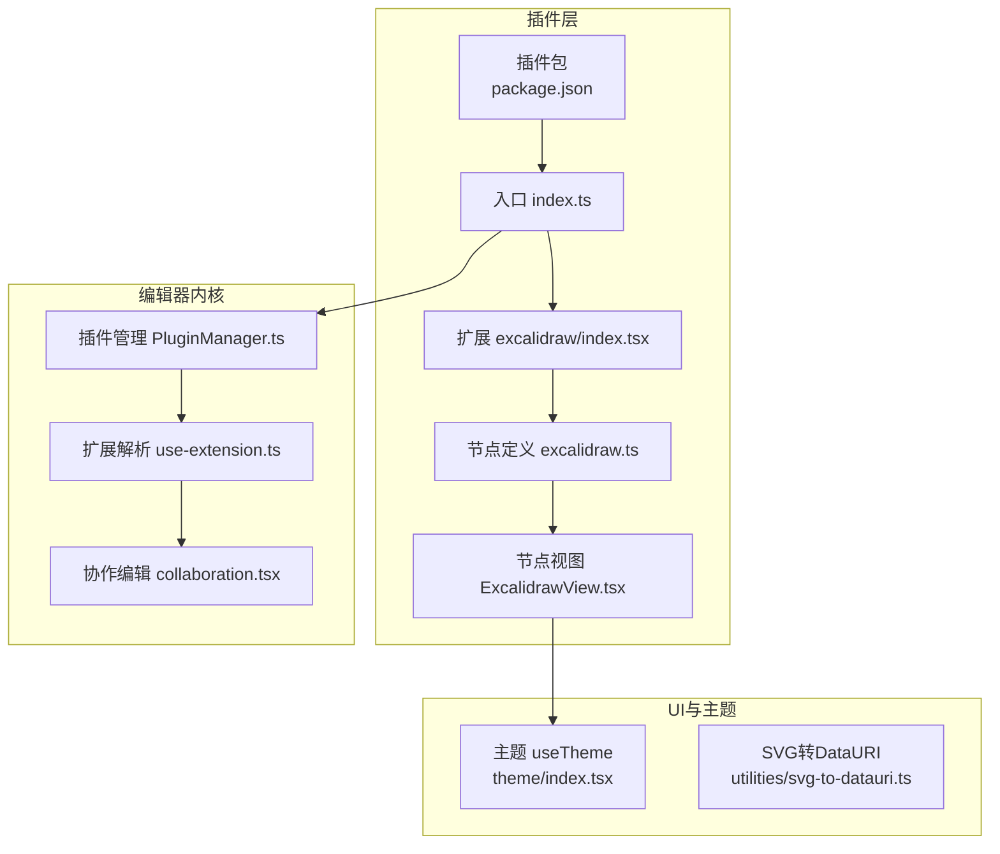
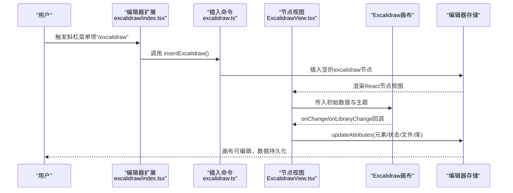
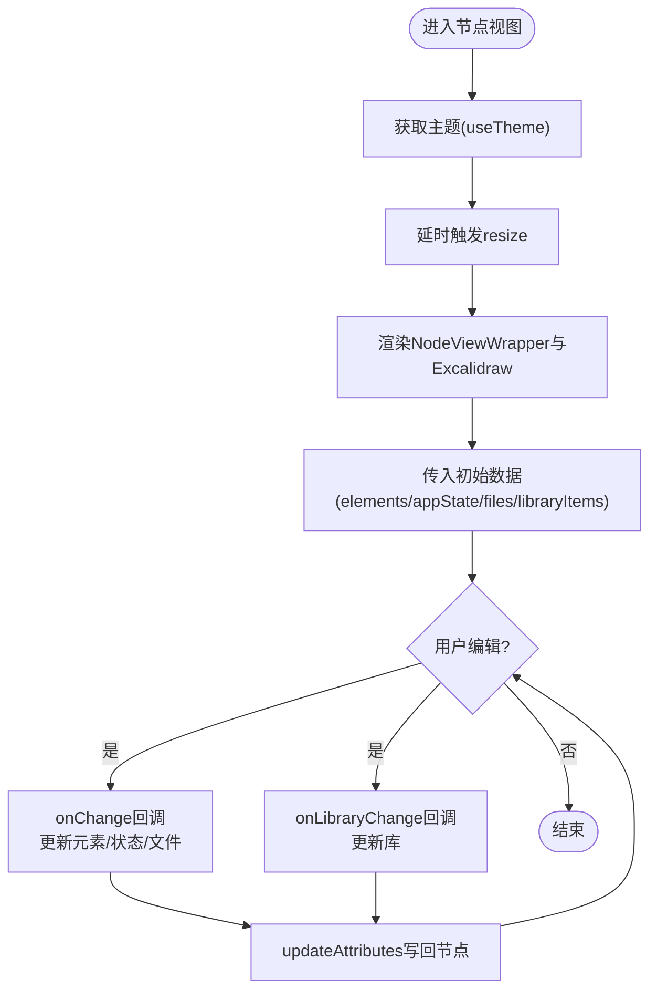
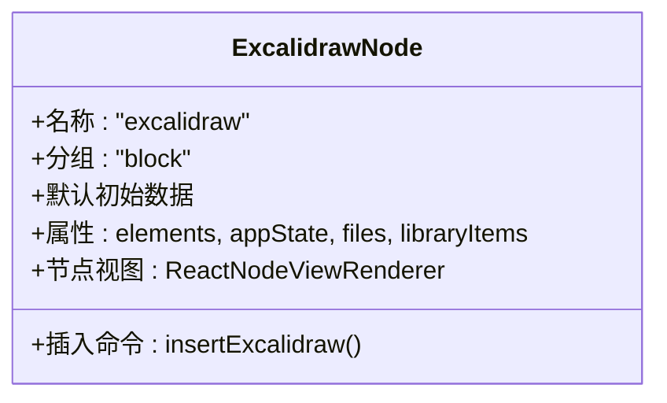
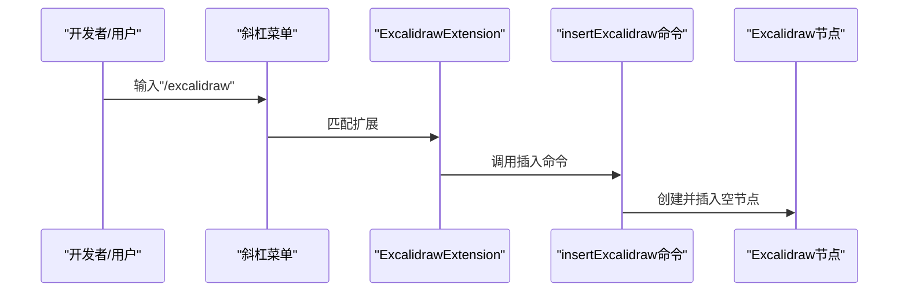
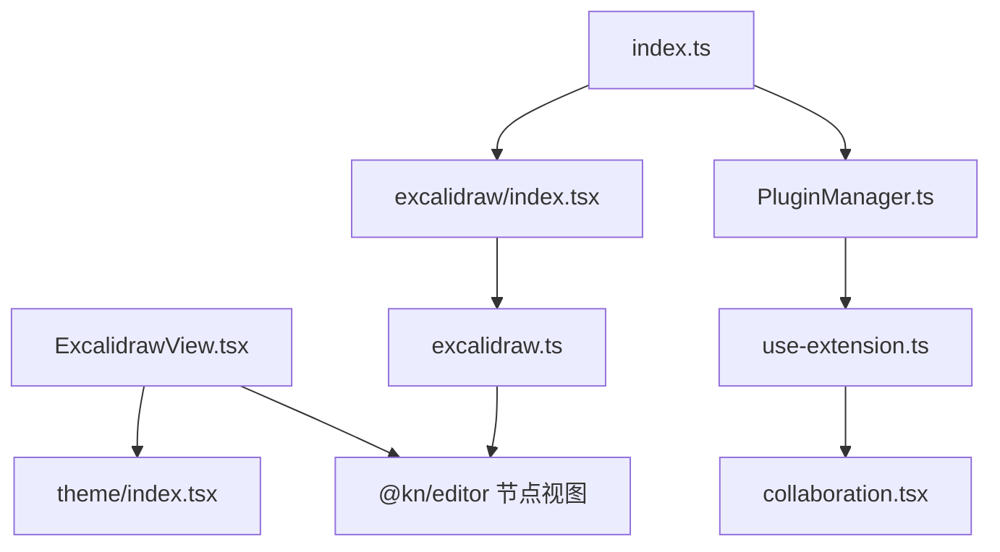

# Excalidraw手绘图表插件

<cite>
**本文引用的文件**
- [packages/plugin-excalidraw/src/index.ts](file://packages/plugin-excalidraw/src/index.ts)
- [packages/plugin-excalidraw/src/excalidraw/index.tsx](file://packages/plugin-excalidraw/src/excalidraw/index.tsx)
- [packages/plugin-excalidraw/src/excalidraw/excalidraw.ts](file://packages/plugin-excalidraw/src/excalidraw/excalidraw.ts)
- [packages/plugin-excalidraw/src/excalidraw/ExcalidrawView.tsx](file://packages/plugin-excalidraw/src/excalidraw/ExcalidrawView.tsx)
- [packages/plugin-excalidraw/package.json](file://packages/plugin-excalidraw/package.json)
- [packages/plugin-excalidraw/tsconfig.json](file://packages/plugin-excalidraw/tsconfig.json)
- [packages/common/src/core/PluginManager.ts](file://packages/common/src/core/PluginManager.ts)
- [packages/editor/src/editor/collaboration.tsx](file://packages/editor/src/editor/collaboration.tsx)
- [packages/editor/src/editor/use-extension.ts](file://packages/editor/src/editor/use-extension.ts)
- [packages/ui/src/components/theme/index.tsx](file://packages/ui/src/components/theme/index.tsx)
- [packages/editor/src/utilities/svg-to-datauri.ts](file://packages/editor/src/utilities/svg-to-datauri.ts)
</cite>

## 目录
1. [简介](#简介)
2. [项目结构](#项目结构)
3. [核心组件](#核心组件)
4. [架构总览](#架构总览)
5. [组件详解](#组件详解)
6. [依赖关系分析](#依赖关系分析)
7. [性能与可用性考量](#性能与可用性考量)
8. [故障排查指南](#故障排查指南)
9. [结论](#结论)
10. [附录：使用示例与最佳实践](#附录使用示例与最佳实践)

## 简介
本文件面向“Excalidraw手绘图表插件”的技术文档，系统阐述该插件在知识型编辑器中的集成方式与实现原理。内容覆盖：
- 手绘视图组件与绘图节点的定义与渲染
- 插入命令与菜单/斜杠菜单接入
- 数据结构（元素、应用状态、文件与库）与持久化策略
- 主题适配与界面渲染
- 协作编辑能力现状与扩展建议
- 导出与跨平台兼容性思路
- 实际使用示例与排障建议

## 项目结构
Excalidraw插件位于独立包中，通过编辑器扩展机制被加载到主应用。其关键文件组织如下：
- 插件入口与注册：负责将编辑器扩展注入到编辑器生命周期
- 编辑器扩展：定义节点类型、插入命令、菜单/斜杠菜单接入
- 节点视图：将Excalidraw可编辑画布嵌入到编辑器节点中
- 依赖与构建：声明对编辑器内核、UI与Excalidraw库的依赖

**图表来源**
- [packages/plugin-excalidraw/src/index.ts](file://packages/plugin-excalidraw/src/index.ts#L1-L19)
- [packages/plugin-excalidraw/src/excalidraw/index.tsx](file://packages/plugin-excalidraw/src/excalidraw/index.tsx#L1-L20)
- [packages/plugin-excalidraw/src/excalidraw/excalidraw.ts](file://packages/plugin-excalidraw/src/excalidraw/excalidraw.ts#L1-L67)
- [packages/plugin-excalidraw/src/excalidraw/ExcalidrawView.tsx](file://packages/plugin-excalidraw/src/excalidraw/ExcalidrawView.tsx#L1-L53)
- [packages/editor/src/editor/collaboration.tsx](file://packages/editor/src/editor/collaboration.tsx#L1-L142)
- [packages/editor/src/editor/use-extension.ts](file://packages/editor/src/editor/use-extension.ts#L47-L63)
- [packages/common/src/core/PluginManager.ts](file://packages/common/src/core/PluginManager.ts#L1-L55)
- [packages/ui/src/components/theme/index.tsx](file://packages/ui/src/components/theme/index.tsx#L1-L75)
- [packages/editor/src/utilities/svg-to-datauri.ts](file://packages/editor/src/utilities/svg-to-datauri.ts#L1-L30)

**章节来源**
- [packages/plugin-excalidraw/src/index.ts](file://packages/plugin-excalidraw/src/index.ts#L1-L19)
- [packages/plugin-excalidraw/src/excalidraw/index.tsx](file://packages/plugin-excalidraw/src/excalidraw/index.tsx#L1-L20)
- [packages/plugin-excalidraw/src/excalidraw/excalidraw.ts](file://packages/plugin-excalidraw/src/excalidraw/excalidraw.ts#L1-L67)
- [packages/plugin-excalidraw/src/excalidraw/ExcalidrawView.tsx](file://packages/plugin-excalidraw/src/excalidraw/ExcalidrawView.tsx#L1-L53)
- [packages/plugin-excalidraw/package.json](file://packages/plugin-excalidraw/package.json#L1-L30)
- [packages/plugin-excalidraw/tsconfig.json](file://packages/plugin-excalidraw/tsconfig.json#L1-L23)

## 核心组件
- 插件入口与注册
  - 入口文件通过插件基类注册编辑器扩展，并将扩展列表暴露给编辑器加载流程
  - 参考路径：[packages/plugin-excalidraw/src/index.ts](file://packages/plugin-excalidraw/src/index.ts#L1-L19)
- 编辑器扩展
  - 定义斜杠菜单项“/excalidraw”，点击后调用插入命令
  - 参考路径：[packages/plugin-excalidraw/src/excalidraw/index.tsx](file://packages/plugin-excalidraw/src/excalidraw/index.tsx#L1-L20)
- 绘图画布节点
  - 定义节点名称、属性、默认值、插入命令与React节点视图渲染器
  - 参考路径：[packages/plugin-excalidraw/src/excalidraw/excalidraw.ts](file://packages/plugin-excalidraw/src/excalidraw/excalidraw.ts#L1-L67)
- 节点视图组件
  - 将Excalidraw画布嵌入编辑器节点，传递初始数据、主题、只读模式等，并监听变更写回节点属性
  - 参考路径：[packages/plugin-excalidraw/src/excalidraw/ExcalidrawView.tsx](file://packages/plugin-excalidraw/src/excalidraw/ExcalidrawView.tsx#L1-L53)

**章节来源**
- [packages/plugin-excalidraw/src/index.ts](file://packages/plugin-excalidraw/src/index.ts#L1-L19)
- [packages/plugin-excalidraw/src/excalidraw/index.tsx](file://packages/plugin-excalidraw/src/excalidraw/index.tsx#L1-L20)
- [packages/plugin-excalidraw/src/excalidraw/excalidraw.ts](file://packages/plugin-excalidraw/src/excalidraw/excalidraw.ts#L1-L67)
- [packages/plugin-excalidraw/src/excalidraw/ExcalidrawView.tsx](file://packages/plugin-excalidraw/src/excalidraw/ExcalidrawView.tsx#L1-L53)

## 架构总览
下图展示了从用户触发到画布渲染、再到数据回写的整体流程。

**图表来源**
- [packages/plugin-excalidraw/src/excalidraw/index.tsx](file://packages/plugin-excalidraw/src/excalidraw/index.tsx#L1-L20)
- [packages/plugin-excalidraw/src/excalidraw/excalidraw.ts](file://packages/plugin-excalidraw/src/excalidraw/excalidraw.ts#L1-L67)
- [packages/plugin-excalidraw/src/excalidraw/ExcalidrawView.tsx](file://packages/plugin-excalidraw/src/excalidraw/ExcalidrawView.tsx#L1-L53)

## 组件详解

### 组件A：ExcalidrawView（手绘视图）
- 功能要点
  - 使用编辑器提供的节点包装器进行渲染
  - 通过主题Hook获取当前主题并传递给Excalidraw
  - 初始渲染时延迟触发一次窗口resize以确保画布正确布局
  - 传入初始数据：元素数组、应用状态（含只读模式与占位协作者集合）、文件与库
  - 监听画布变更，将元素、应用状态与文件写回节点属性；监听库变更同步库列表
- 关键行为
  - 只读模式：当编辑器不可编辑时，应用状态启用“视图模式”
  - 协作开关：当前版本固定为非协作模式
  - 尺寸控制：容器高度固定，便于在编辑器中稳定显示
- 复杂度与性能
  - 渲染开销主要来自外部画布组件，内部仅做属性透传与事件回调
  - 延迟渲染避免首帧闪烁，提升初次体验

**图表来源**
- [packages/plugin-excalidraw/src/excalidraw/ExcalidrawView.tsx](file://packages/plugin-excalidraw/src/excalidraw/ExcalidrawView.tsx#L1-L53)
- [packages/ui/src/components/theme/index.tsx](file://packages/ui/src/components/theme/index.tsx#L1-L75)

**章节来源**
- [packages/plugin-excalidraw/src/excalidraw/ExcalidrawView.tsx](file://packages/plugin-excalidraw/src/excalidraw/ExcalidrawView.tsx#L1-L53)
- [packages/ui/src/components/theme/index.tsx](file://packages/ui/src/components/theme/index.tsx#L1-L75)

### 组件B：Excalidraw（编辑器节点）
- 功能要点
  - 定义节点名称、分组、默认初始数据
  - 声明节点属性：元素数组、应用状态、文件对象、库列表
  - 提供插入命令：向编辑器插入一个空的excalidraw节点
  - 注册React节点视图渲染器，拦截事件以保证编辑器交互顺畅
- 数据结构
  - elements：矢量图形元素数组
  - appState：应用状态（含加载标志、视图模式、协作者占位等）
  - files：文件映射或空
  - libraryItems：库条目数组
- 复杂度与性能
  - 属性默认值减少初始化成本
  - React节点视图按需渲染，避免全局重绘

**图表来源**
- [packages/plugin-excalidraw/src/excalidraw/excalidraw.ts](file://packages/plugin-excalidraw/src/excalidraw/excalidraw.ts#L1-L67)

**章节来源**
- [packages/plugin-excalidraw/src/excalidraw/excalidraw.ts](file://packages/plugin-excalidraw/src/excalidraw/excalidraw.ts#L1-L67)

### 组件C：ExcalidrawExtension（编辑器扩展）
- 功能要点
  - 暴露斜杠菜单项“/excalidraw”，点击后执行插入命令
  - 将Excalidraw节点作为扩展注入编辑器
- 集成方式
  - 通过插件基类统一注册editorExtension，由编辑器在启动时解析并挂载

**图表来源**
- [packages/plugin-excalidraw/src/excalidraw/index.tsx](file://packages/plugin-excalidraw/src/excalidraw/index.tsx#L1-L20)
- [packages/plugin-excalidraw/src/excalidraw/excalidraw.ts](file://packages/plugin-excalidraw/src/excalidraw/excalidraw.ts#L1-L67)

**章节来源**
- [packages/plugin-excalidraw/src/excalidraw/index.tsx](file://packages/plugin-excalidraw/src/excalidraw/index.tsx#L1-L20)
- [packages/plugin-excalidraw/src/excalidraw/excalidraw.ts](file://packages/plugin-excalidraw/src/excalidraw/excalidraw.ts#L1-L67)

### 组件D：插件注册与加载（插件入口）
- 功能要点
  - 继承插件基类，提供插件元信息与编辑器扩展列表
  - 将Excalidraw扩展注入编辑器生命周期
- 加载链路
  - 插件管理器读取插件配置，解析编辑器扩展
  - 解析器将扩展合并内置扩展与插件扩展，生成最终扩展集
  - 协作编辑组件基于扩展集初始化编辑器实例

**图表来源**
- [packages/plugin-excalidraw/src/index.ts](file://packages/plugin-excalidraw/src/index.ts#L1-L19)
- [packages/common/src/core/PluginManager.ts](file://packages/common/src/core/PluginManager.ts#L1-L55)
- [packages/editor/src/editor/use-extension.ts](file://packages/editor/src/editor/use-extension.ts#L47-L63)
- [packages/editor/src/editor/collaboration.tsx](file://packages/editor/src/editor/collaboration.tsx#L1-L142)

**章节来源**
- [packages/plugin-excalidraw/src/index.ts](file://packages/plugin-excalidraw/src/index.ts#L1-L19)
- [packages/common/src/core/PluginManager.ts](file://packages/common/src/core/PluginManager.ts#L1-L55)
- [packages/editor/src/editor/use-extension.ts](file://packages/editor/src/editor/use-extension.ts#L47-L63)
- [packages/editor/src/editor/collaboration.tsx](file://packages/editor/src/editor/collaboration.tsx#L1-L142)

## 依赖关系分析
- 对外依赖
  - @excalidraw/excalidraw：手绘画布核心
  - @kn/editor：编辑器内核与节点视图渲染
  - @kn/ui：主题与通用UI能力
  - @kn/common：插件框架与扩展机制
- 内部耦合
  - 插件入口依赖插件管理器与扩展解析
  - 节点视图依赖主题Hook与编辑器节点上下文
  - 协作编辑器依赖扩展解析结果与Provider（当前未启用）

**图表来源**
- [packages/plugin-excalidraw/src/excalidraw/ExcalidrawView.tsx](file://packages/plugin-excalidraw/src/excalidraw/ExcalidrawView.tsx#L1-L53)
- [packages/ui/src/components/theme/index.tsx](file://packages/ui/src/components/theme/index.tsx#L1-L75)
- [packages/plugin-excalidraw/src/excalidraw/excalidraw.ts](file://packages/plugin-excalidraw/src/excalidraw/excalidraw.ts#L1-L67)
- [packages/plugin-excalidraw/src/excalidraw/index.tsx](file://packages/plugin-excalidraw/src/excalidraw/index.tsx#L1-L20)
- [packages/plugin-excalidraw/src/index.ts](file://packages/plugin-excalidraw/src/index.ts#L1-L19)
- [packages/common/src/core/PluginManager.ts](file://packages/common/src/core/PluginManager.ts#L1-L55)
- [packages/editor/src/editor/use-extension.ts](file://packages/editor/src/editor/use-extension.ts#L47-L63)
- [packages/editor/src/editor/collaboration.tsx](file://packages/editor/src/editor/collaboration.tsx#L1-L142)

**章节来源**
- [packages/plugin-excalidraw/package.json](file://packages/plugin-excalidraw/package.json#L1-L30)
- [packages/plugin-excalidraw/src/excalidraw/ExcalidrawView.tsx](file://packages/plugin-excalidraw/src/excalidraw/ExcalidrawView.tsx#L1-L53)
- [packages/plugin-excalidraw/src/excalidraw/excalidraw.ts](file://packages/plugin-excalidraw/src/excalidraw/excalidraw.ts#L1-L67)
- [packages/plugin-excalidraw/src/excalidraw/index.tsx](file://packages/plugin-excalidraw/src/excalidraw/index.tsx#L1-L20)
- [packages/plugin-excalidraw/src/index.ts](file://packages/plugin-excalidraw/src/index.ts#L1-L19)
- [packages/common/src/core/PluginManager.ts](file://packages/common/src/core/PluginManager.ts#L1-L55)
- [packages/editor/src/editor/use-extension.ts](file://packages/editor/src/editor/use-extension.ts#L47-L63)
- [packages/editor/src/editor/collaboration.tsx](file://packages/editor/src/editor/collaboration.tsx#L1-L142)

## 性能与可用性考量
- 渲染与布局
  - 节点视图在挂载后延时触发resize，有助于外部画布组件完成布局计算
  - 固定高度容器便于在滚动编辑器中保持画布可视性
- 主题一致性
  - 通过主题Hook将编辑器主题传递给画布，避免视觉割裂
- 数据写回
  - onChange与onLibraryChange回调均会写回节点属性，应避免在高频事件中重复写入
- 协作编辑
  - 当前isCollaborating为false，协作游标与冲突解决未启用；如需启用，应在Provider与扩展中补充相应配置

[本节为通用指导，无需列出具体文件来源]

## 故障排查指南
- 画布不显示或尺寸异常
  - 检查节点视图是否已渲染（存在延时），确认容器高度设置
  - 参考路径：[packages/plugin-excalidraw/src/excalidraw/ExcalidrawView.tsx](file://packages/plugin-excalidraw/src/excalidraw/ExcalidrawView.tsx#L1-L53)
- 主题不匹配
  - 确认useTheme返回的主题值与编辑器主题一致
  - 参考路径：[packages/ui/src/components/theme/index.tsx](file://packages/ui/src/components/theme/index.tsx#L1-L75)
- 插入命令无效
  - 确认斜杠菜单已注册且命令存在
  - 参考路径：[packages/plugin-excalidraw/src/excalidraw/index.tsx](file://packages/plugin-excalidraw/src/excalidraw/index.tsx#L1-L20)、[packages/plugin-excalidraw/src/excalidraw/excalidraw.ts](file://packages/plugin-excalidraw/src/excalidraw/excalidraw.ts#L1-L67)
- 数据未持久化
  - 确认onChange回调已触发并调用updateAttributes
  - 参考路径：[packages/plugin-excalidraw/src/excalidraw/ExcalidrawView.tsx](file://packages/plugin-excalidraw/src/excalidraw/ExcalidrawView.tsx#L1-L53)
- 协作编辑未生效
  - 当前协作相关配置未启用；如需启用，请检查Provider与扩展配置
  - 参考路径：[packages/editor/src/editor/collaboration.tsx](file://packages/editor/src/editor/collaboration.tsx#L1-L142)

**章节来源**
- [packages/plugin-excalidraw/src/excalidraw/ExcalidrawView.tsx](file://packages/plugin-excalidraw/src/excalidraw/ExcalidrawView.tsx#L1-L53)
- [packages/ui/src/components/theme/index.tsx](file://packages/ui/src/components/theme/index.tsx#L1-L75)
- [packages/plugin-excalidraw/src/excalidraw/index.tsx](file://packages/plugin-excalidraw/src/excalidraw/index.tsx#L1-L20)
- [packages/plugin-excalidraw/src/excalidraw/excalidraw.ts](file://packages/plugin-excalidraw/src/excalidraw/excalidraw.ts#L1-L67)
- [packages/editor/src/editor/collaboration.tsx](file://packages/editor/src/editor/collaboration.tsx#L1-L142)

## 结论
本插件通过标准的编辑器扩展机制，将Excalidraw画布无缝集成到编辑器中。其实现简洁、职责清晰：节点定义负责数据结构与插入命令，节点视图负责渲染与数据回写，扩展入口负责菜单接入与插件注册。当前版本聚焦于本地编辑与数据持久化，协作编辑能力预留了扩展点，可在后续版本中按需启用。

[本节为总结性内容，无需列出具体文件来源]

## 附录：使用示例与最佳实践
- 在编辑器中插入手绘图表
  - 在编辑器中输入斜杠菜单项“/excalidraw”，即可插入一个空白手绘画布节点
  - 参考路径：[packages/plugin-excalidraw/src/excalidraw/index.tsx](file://packages/plugin-excalidraw/src/excalidraw/index.tsx#L1-L20)、[packages/plugin-excalidraw/src/excalidraw/excalidraw.ts](file://packages/plugin-excalidraw/src/excalidraw/excalidraw.ts#L1-L67)
- 在只读场景中查看手绘图表
  - 当编辑器处于不可编辑状态时，应用状态会启用“视图模式”，适合预览与分享
  - 参考路径：[packages/plugin-excalidraw/src/excalidraw/ExcalidrawView.tsx](file://packages/plugin-excalidraw/src/excalidraw/ExcalidrawView.tsx#L1-L53)
- 数据结构与持久化
  - 元素、应用状态、文件与库均通过节点属性持久化；修改时由onChange/onLibraryChange回调写回
  - 参考路径：[packages/plugin-excalidraw/src/excalidraw/excalidraw.ts](file://packages/plugin-excalidraw/src/excalidraw/excalidraw.ts#L1-L67)、[packages/plugin-excalidraw/src/excalidraw/ExcalidrawView.tsx](file://packages/plugin-excalidraw/src/excalidraw/ExcalidrawView.tsx#L1-L53)
- 主题适配
  - 通过useTheme自动适配浅色/深色/系统主题，确保与编辑器风格一致
  - 参考路径：[packages/ui/src/components/theme/index.tsx](file://packages/ui/src/components/theme/index.tsx#L1-L75)
- 协作编辑与导出
  - 协作编辑当前未启用，如需启用请参考协作编辑组件的Provider配置
  - 导出方面，可结合编辑器通用导出能力与SVG转DataURI工具进行二次处理
  - 参考路径：[packages/editor/src/editor/collaboration.tsx](file://packages/editor/src/editor/collaboration.tsx#L1-L142)、[packages/editor/src/utilities/svg-to-datauri.ts](file://packages/editor/src/utilities/svg-to-datauri.ts#L1-L30)

**章节来源**
- [packages/plugin-excalidraw/src/excalidraw/index.tsx](file://packages/plugin-excalidraw/src/excalidraw/index.tsx#L1-L20)
- [packages/plugin-excalidraw/src/excalidraw/excalidraw.ts](file://packages/plugin-excalidraw/src/excalidraw/excalidraw.ts#L1-L67)
- [packages/plugin-excalidraw/src/excalidraw/ExcalidrawView.tsx](file://packages/plugin-excalidraw/src/excalidraw/ExcalidrawView.tsx#L1-L53)
- [packages/ui/src/components/theme/index.tsx](file://packages/ui/src/components/theme/index.tsx#L1-L75)
- [packages/editor/src/editor/collaboration.tsx](file://packages/editor/src/editor/collaboration.tsx#L1-L142)
- [packages/editor/src/utilities/svg-to-datauri.ts](file://packages/editor/src/utilities/svg-to-datauri.ts#L1-L30)