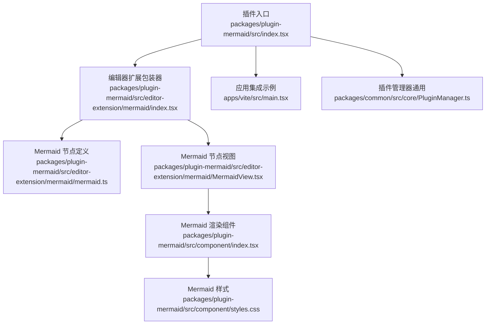
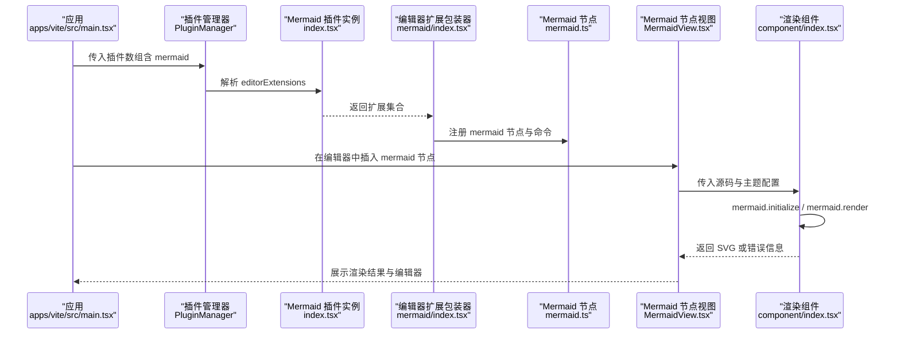
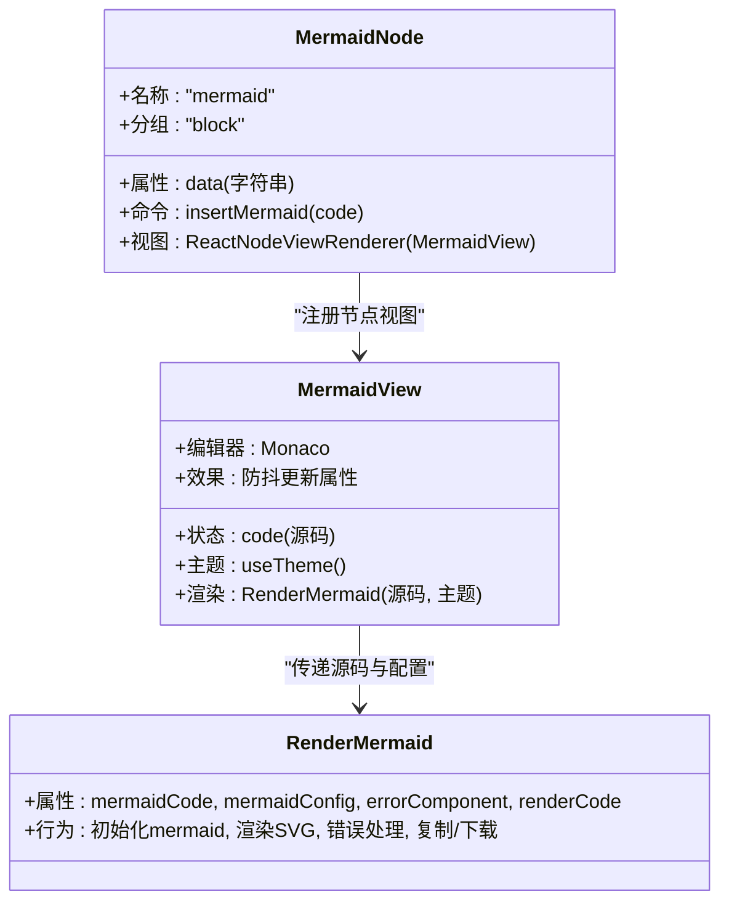
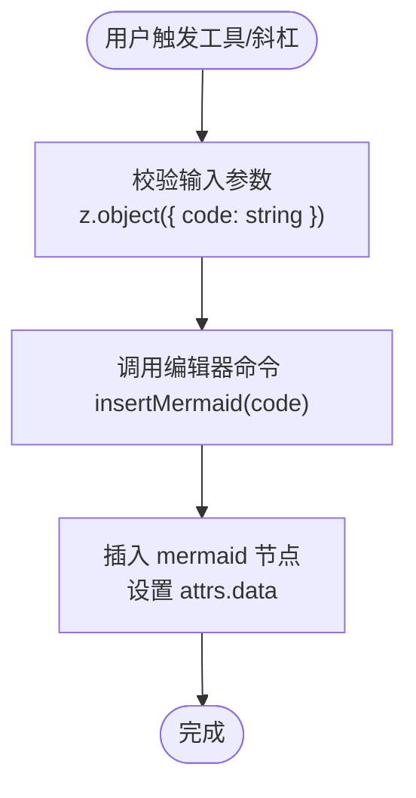
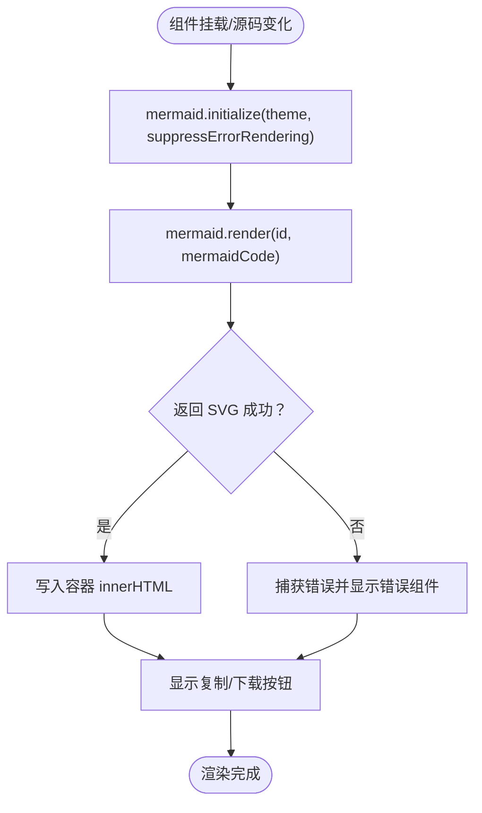
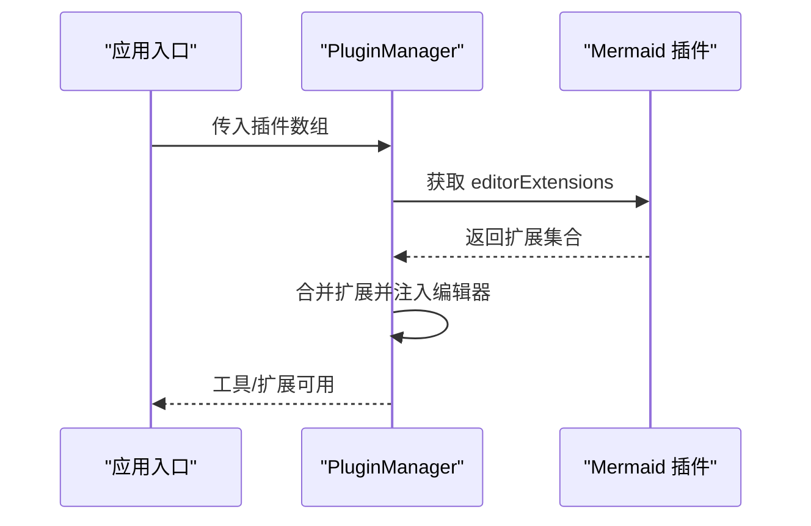
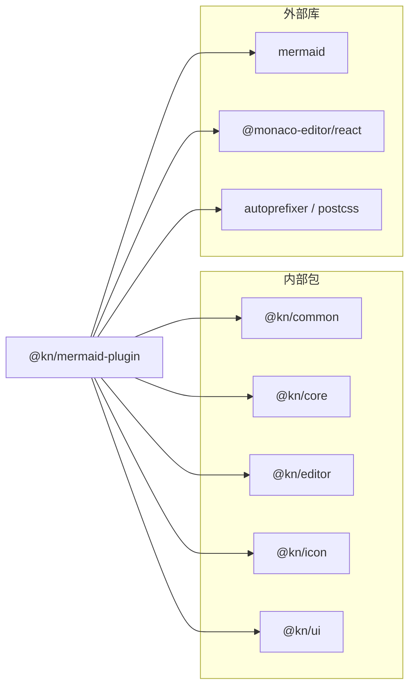

# Mermaid图表插件

<cite>
**本文引用的文件**
- [packages/plugin-mermaid/src/index.tsx](file://packages/plugin-mermaid/src/index.tsx)
- [packages/plugin-mermaid/src/editor-extension/mermaid/index.tsx](file://packages/plugin-mermaid/src/editor-extension/mermaid/index.tsx)
- [packages/plugin-mermaid/src/editor-extension/mermaid/mermaid.ts](file://packages/plugin-mermaid/src/editor-extension/mermaid/mermaid.ts)
- [packages/plugin-mermaid/src/editor-extension/mermaid/MermaidView.tsx](file://packages/plugin-mermaid/src/editor-extension/mermaid/MermaidView.tsx)
- [packages/plugin-mermaid/src/component/index.tsx](file://packages/plugin-mermaid/src/component/index.tsx)
- [packages/plugin-mermaid/src/component/styles.css](file://packages/plugin-mermaid/src/component/styles.css)
- [packages/plugin-mermaid/package.json](file://packages/plugin-mermaid/package.json)
- [apps/vite/src/main.tsx](file://apps/vite/src/main.tsx)
- [packages/common/src/core/PluginManager.ts](file://packages/common/src/core/PluginManager.ts)
</cite>

## 目录
1. [简介](#简介)
2. [项目结构](#项目结构)
3. [核心组件](#核心组件)
4. [架构总览](#架构总览)
5. [详细组件分析](#详细组件分析)
6. [依赖分析](#依赖分析)
7. [性能考虑](#性能考虑)
8. [故障排查指南](#故障排查指南)
9. [结论](#结论)
10. [附录](#附录)

## 简介
本插件为知识库编辑器提供 Mermaid 图表的内嵌渲染与编辑能力，支持在编辑器中通过“/mermaid”快捷指令或工具面板插入 Mermaid 节点，并在节点视图中以 Monaco 编辑器进行实时源码编辑，同时使用 mermaid 库即时渲染为 SVG。插件还提供复制与下载 SVG 的便捷操作，并允许通过主题切换自动适配深色/浅色模式。

## 项目结构
该插件位于 packages/plugin-mermaid，主要由以下部分组成：
- 插件入口与注册：导出一个继承自通用插件基类的实例，声明编辑器扩展为 Mermaid 扩展集合。
- 编辑器扩展：定义 Mermaid 节点、节点视图以及编辑器工具与斜杠菜单项。
- 渲染组件：提供独立的 React 组件用于在任意页面渲染 Mermaid 源码为 SVG，并支持错误处理、复制与下载等交互。
- 样式：Tailwind CSS 与基础样式，确保渲染容器、动作按钮与响应式布局一致。

**图示来源**
- [packages/plugin-mermaid/src/index.tsx](file://packages/plugin-mermaid/src/index.tsx#L1-L17)
- [packages/plugin-mermaid/src/editor-extension/mermaid/index.tsx](file://packages/plugin-mermaid/src/editor-extension/mermaid/index.tsx#L1-L33)
- [packages/plugin-mermaid/src/editor-extension/mermaid/mermaid.ts](file://packages/plugin-mermaid/src/editor-extension/mermaid/mermaid.ts#L1-L46)
- [packages/plugin-mermaid/src/editor-extension/mermaid/MermaidView.tsx](file://packages/plugin-mermaid/src/editor-extension/mermaid/MermaidView.tsx#L1-L71)
- [packages/plugin-mermaid/src/component/index.tsx](file://packages/plugin-mermaid/src/component/index.tsx#L1-L198)
- [packages/plugin-mermaid/src/component/styles.css](file://packages/plugin-mermaid/src/component/styles.css#L1-L103)
- [apps/vite/src/main.tsx](file://apps/vite/src/main.tsx#L1-L23)
- [packages/common/src/core/PluginManager.ts](file://packages/common/src/core/PluginManager.ts#L1-L177)

**章节来源**
- [packages/plugin-mermaid/src/index.tsx](file://packages/plugin-mermaid/src/index.tsx#L1-L17)
- [packages/plugin-mermaid/src/editor-extension/mermaid/index.tsx](file://packages/plugin-mermaid/src/editor-extension/mermaid/index.tsx#L1-L33)
- [packages/plugin-mermaid/src/editor-extension/mermaid/mermaid.ts](file://packages/plugin-mermaid/src/editor-extension/mermaid/mermaid.ts#L1-L46)
- [packages/plugin-mermaid/src/editor-extension/mermaid/MermaidView.tsx](file://packages/plugin-mermaid/src/editor-extension/mermaid/MermaidView.tsx#L1-L71)
- [packages/plugin-mermaid/src/component/index.tsx](file://packages/plugin-mermaid/src/component/index.tsx#L1-L198)
- [packages/plugin-mermaid/src/component/styles.css](file://packages/plugin-mermaid/src/component/styles.css#L1-L103)
- [apps/vite/src/main.tsx](file://apps/vite/src/main.tsx#L1-L23)
- [packages/common/src/core/PluginManager.ts](file://packages/common/src/core/PluginManager.ts#L1-L177)

## 核心组件
- 插件实例与注册
  - 通过继承通用插件基类创建实例，声明编辑器扩展数组包含 Mermaid 扩展，供应用在启动时统一加载。
- Mermaid 节点与命令
  - 定义名为 mermaid 的块级节点，提供插入命令，支持传入初始代码片段。
  - 节点视图使用 React 渲染器挂载 MermaidView。
- Mermaid 节点视图
  - 使用 Monaco 编辑器作为源码编辑器，支持主题联动（深色/浅色）。
  - 实时防抖更新节点属性中的数据字段，避免频繁重渲染。
  - 将源码交给渲染组件进行 Mermaid 渲染，空代码时显示占位提示。
- 渲染组件
  - 对外暴露 RenderMermaid 组件，负责 mermaid.initialize 与 mermaid.render 的调用。
  - 支持自定义错误组件、复制与下载按钮、Mermaid 配置覆盖、原始代码展示组件等。
  - 提供卸载清理逻辑，防止内存泄漏与重复更新。
- 样式
  - 提供渲染容器、动作按钮、错误状态与响应式样式的默认实现，便于快速集成。

**章节来源**
- [packages/plugin-mermaid/src/index.tsx](file://packages/plugin-mermaid/src/index.tsx#L1-L17)
- [packages/plugin-mermaid/src/editor-extension/mermaid/mermaid.ts](file://packages/plugin-mermaid/src/editor-extension/mermaid/mermaid.ts#L1-L46)
- [packages/plugin-mermaid/src/editor-extension/mermaid/MermaidView.tsx](file://packages/plugin-mermaid/src/editor-extension/mermaid/MermaidView.tsx#L1-L71)
- [packages/plugin-mermaid/src/component/index.tsx](file://packages/plugin-mermaid/src/component/index.tsx#L1-L198)
- [packages/plugin-mermaid/src/component/styles.css](file://packages/plugin-mermaid/src/component/styles.css#L1-L103)

## 架构总览
下图展示了从应用启动到编辑器中插入与渲染 Mermaid 图表的整体流程，包括插件注册、编辑器扩展解析、节点视图渲染与实时编辑。

**图示来源**
- [apps/vite/src/main.tsx](file://apps/vite/src/main.tsx#L1-L23)
- [packages/common/src/core/PluginManager.ts](file://packages/common/src/core/PluginManager.ts#L120-L162)
- [packages/plugin-mermaid/src/index.tsx](file://packages/plugin-mermaid/src/index.tsx#L1-L17)
- [packages/plugin-mermaid/src/editor-extension/mermaid/index.tsx](file://packages/plugin-mermaid/src/editor-extension/mermaid/index.tsx#L1-L33)
- [packages/plugin-mermaid/src/editor-extension/mermaid/mermaid.ts](file://packages/plugin-mermaid/src/editor-extension/mermaid/mermaid.ts#L1-L46)
- [packages/plugin-mermaid/src/editor-extension/mermaid/MermaidView.tsx](file://packages/plugin-mermaid/src/editor-extension/mermaid/MermaidView.tsx#L1-L71)
- [packages/plugin-mermaid/src/component/index.tsx](file://packages/plugin-mermaid/src/component/index.tsx#L1-L198)

## 详细组件分析

### 组件 A：Mermaid 节点与命令
- 节点特性
  - 名称为 mermaid，分组为块级元素，HTML 渲染包裹器用于承载节点内容。
  - 提供 attributes：data 字段存储源码字符串。
  - 提供 insertMermaid 命令，向编辑器插入该节点并设置初始数据。
- 视图渲染
  - 使用 ReactNodeViewRenderer 渲染 MermaidView，阻止事件冒泡以避免冲突。

**图示来源**
- [packages/plugin-mermaid/src/editor-extension/mermaid/mermaid.ts](file://packages/plugin-mermaid/src/editor-extension/mermaid/mermaid.ts#L1-L46)
- [packages/plugin-mermaid/src/editor-extension/mermaid/MermaidView.tsx](file://packages/plugin-mermaid/src/editor-extension/mermaid/MermaidView.tsx#L1-L71)
- [packages/plugin-mermaid/src/component/index.tsx](file://packages/plugin-mermaid/src/component/index.tsx#L1-L198)

**章节来源**
- [packages/plugin-mermaid/src/editor-extension/mermaid/mermaid.ts](file://packages/plugin-mermaid/src/editor-extension/mermaid/mermaid.ts#L1-L46)
- [packages/plugin-mermaid/src/editor-extension/mermaid/MermaidView.tsx](file://packages/plugin-mermaid/src/editor-extension/mermaid/MermaidView.tsx#L1-L71)

### 组件 B：编辑器扩展包装器与工具
- 扩展包装器
  - name 与 extendsion 字段声明扩展名与实现列表。
  - slashConfig 提供“/mermaid”快捷指令，触发插入 Mermaid 节点命令。
  - tools 提供工具面板入口，接收参数对象（包含 code 字段），执行插入命令。
- 输入校验
  - 使用 zod schema 对工具输入进行约束，确保传入的 code 为字符串。

**图示来源**
- [packages/plugin-mermaid/src/editor-extension/mermaid/index.tsx](file://packages/plugin-mermaid/src/editor-extension/mermaid/index.tsx#L1-L33)
- [packages/plugin-mermaid/src/editor-extension/mermaid/mermaid.ts](file://packages/plugin-mermaid/src/editor-extension/mermaid/mermaid.ts#L33-L46)

**章节来源**
- [packages/plugin-mermaid/src/editor-extension/mermaid/index.tsx](file://packages/plugin-mermaid/src/editor-extension/mermaid/index.tsx#L1-L33)

### 组件 C：渲染组件与下载/复制功能
- 渲染流程
  - 在 useEffect 中初始化 mermaid（禁用自动加载、抑制错误渲染、设置主题），随后调用 render 生成 SVG 并写入容器。
  - 卸载时清空容器，防止重复更新与内存泄漏。
- 交互能力
  - 复制：将当前源码写入剪贴板。
  - 下载：序列化 SVG 元素为 Blob 并触发下载链接。
  - 自定义：支持替换错误组件、下载/复制按钮组件、原始代码渲染组件；支持传入 mermaidConfig 覆盖默认配置。

**图示来源**
- [packages/plugin-mermaid/src/component/index.tsx](file://packages/plugin-mermaid/src/component/index.tsx#L70-L120)
- [packages/plugin-mermaid/src/component/index.tsx](file://packages/plugin-mermaid/src/component/index.tsx#L121-L178)

**章节来源**
- [packages/plugin-mermaid/src/component/index.tsx](file://packages/plugin-mermaid/src/component/index.tsx#L1-L198)

### 组件 D：应用集成与插件管理
- 应用集成
  - 在应用入口导入插件实例并将其加入插件数组，从而在编辑器中启用 Mermaid 功能。
- 插件管理器
  - PluginManager 负责解析插件的 editorExtensions，并将扩展合并后注入编辑器。
  - 提供工具解析方法，将各插件的工具项聚合为可执行映射。

**图示来源**
- [apps/vite/src/main.tsx](file://apps/vite/src/main.tsx#L1-L23)
- [packages/common/src/core/PluginManager.ts](file://packages/common/src/core/PluginManager.ts#L120-L162)
- [packages/plugin-mermaid/src/index.tsx](file://packages/plugin-mermaid/src/index.tsx#L1-L17)

**章节来源**
- [apps/vite/src/main.tsx](file://apps/vite/src/main.tsx#L1-L23)
- [packages/common/src/core/PluginManager.ts](file://packages/common/src/core/PluginManager.ts#L1-L177)
- [packages/plugin-mermaid/src/index.tsx](file://packages/plugin-mermaid/src/index.tsx#L1-L17)

## 依赖分析
- 内部依赖
  - @kn/common：通用插件基类与类型定义。
  - @kn/core：核心工具与异步效果钩子（如 useAsyncEffect、useDebounce）。
  - @kn/editor：编辑器节点与命令扩展、NodeView 包装器。
  - @kn/icon：图标资源。
  - @kn/ui：UI 组件（如按钮、主题、空状态）。
- 外部依赖
  - mermaid：Mermaid 图表渲染库。
  - @monaco-editor/react：源码编辑器。
  - autoprefixer/postcss：构建期样式处理。

**图示来源**
- [packages/plugin-mermaid/package.json](file://packages/plugin-mermaid/package.json#L1-L34)

**章节来源**
- [packages/plugin-mermaid/package.json](file://packages/plugin-mermaid/package.json#L1-L34)

## 性能考虑
- 渲染去抖
  - 节点视图对源码变更采用防抖策略，减少频繁渲染带来的性能压力。
- 渲染清理
  - 组件卸载时清空容器，避免残留 DOM 引发的内存问题。
- 主题切换
  - 渲染组件根据主题动态选择 mermaid 主题，避免不必要的重渲染。
- 按需初始化
  - 仅在需要时初始化 mermaid，避免全局初始化开销。

[本节为通用建议，无需具体文件分析]

## 故障排查指南
- 插件未生效
  - 确认应用入口已将插件实例加入插件数组。
  - 检查插件管理器是否正确解析 editorExtensions。
- 编辑器中无法插入 Mermaid
  - 斜杠菜单或工具面板是否可见；确认工具输入 schema 正确传入 code。
  - 检查编辑器命令 insertMermaid 是否被正确注册。
- 图表不显示或报错
  - 检查源码是否为空或仅包含空白字符；空源码会被清空容器。
  - 查看错误组件是否正常渲染；必要时提供自定义错误组件。
  - 确认 mermaid.initialize 的配置未被意外覆盖。
- 下载/复制无效
  - 确认 SVG 容器存在且非空；下载前先渲染成功。
  - 复制按钮需在浏览器允许剪贴板权限的情况下使用。

**章节来源**
- [apps/vite/src/main.tsx](file://apps/vite/src/main.tsx#L1-L23)
- [packages/common/src/core/PluginManager.ts](file://packages/common/src/core/PluginManager.ts#L120-L162)
- [packages/plugin-mermaid/src/editor-extension/mermaid/index.tsx](file://packages/plugin-mermaid/src/editor-extension/mermaid/index.tsx#L1-L33)
- [packages/plugin-mermaid/src/editor-extension/mermaid/mermaid.ts](file://packages/plugin-mermaid/src/editor-extension/mermaid/mermaid.ts#L33-L46)
- [packages/plugin-mermaid/src/component/index.tsx](file://packages/plugin-mermaid/src/component/index.tsx#L121-L178)

## 结论
该 Mermaid 图表插件通过清晰的模块划分与标准的编辑器扩展机制，实现了从“插入节点—实时编辑—渲染展示—交互操作”的完整闭环。其设计兼顾了易用性与可扩展性，既可在编辑器中直接使用，也可作为独立组件在其他场景渲染 Mermaid 图表。配合插件管理器的统一解析与注入，能够平滑地集成到现有系统中。

[本节为总结性内容，无需具体文件分析]

## 附录
- 使用建议
  - 在生产环境建议提供自定义错误组件与原始代码渲染组件，提升可观测性与可维护性。
  - 对于长图表，建议开启滚动容器与响应式样式，保证在小屏设备上的可读性。
- 可能的优化方向
  - 对 mermaid.render 增加缓存策略，避免相同源码重复渲染。
  - 对编辑器宽度与高度进行更灵活的自适应控制。

[本节为补充说明，无需具体文件分析]