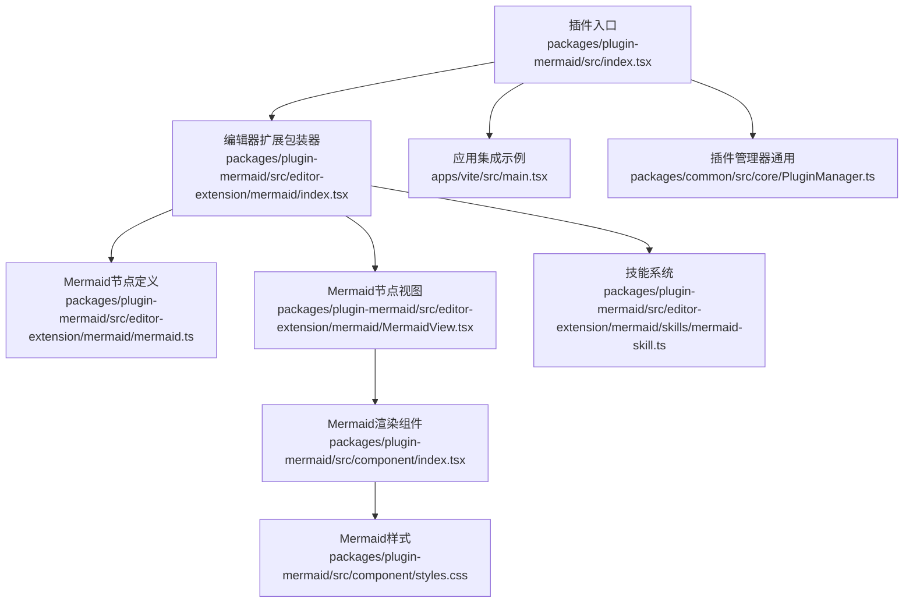
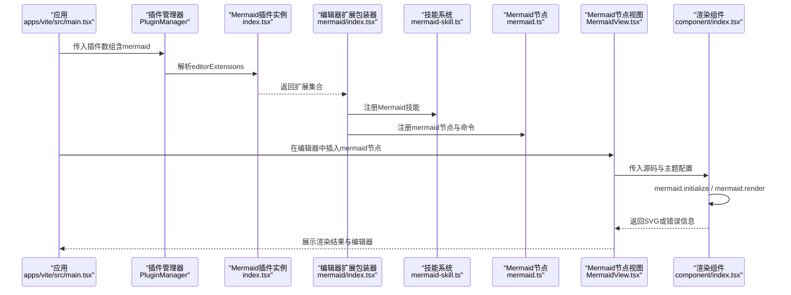
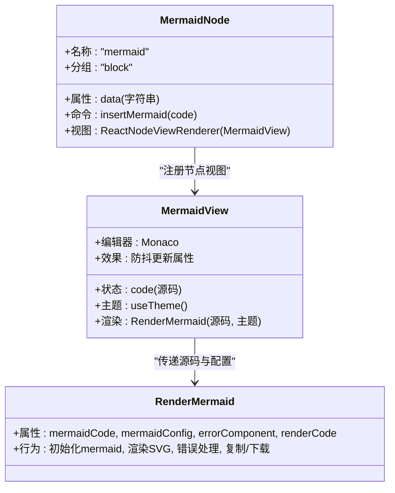
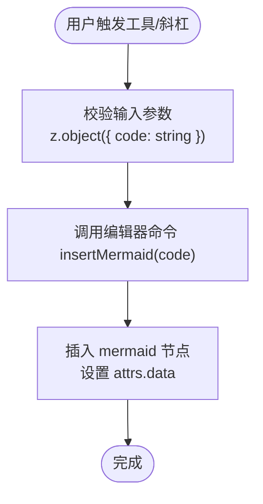
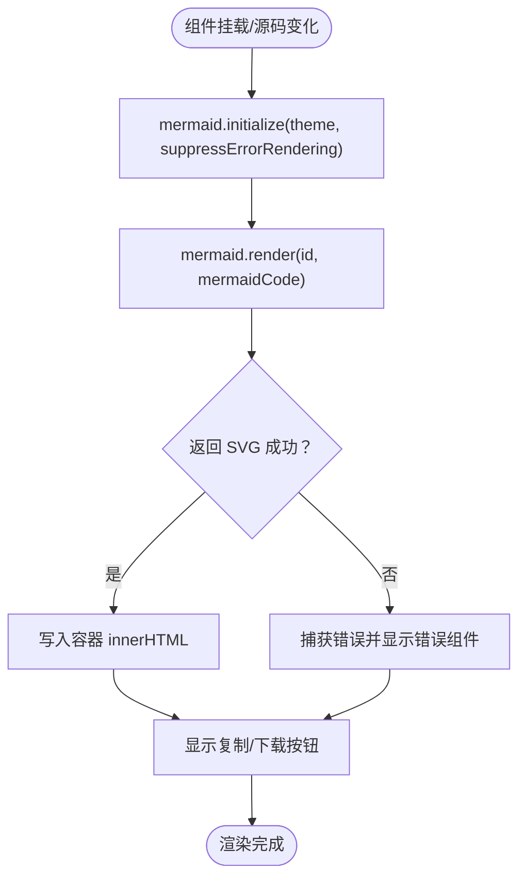
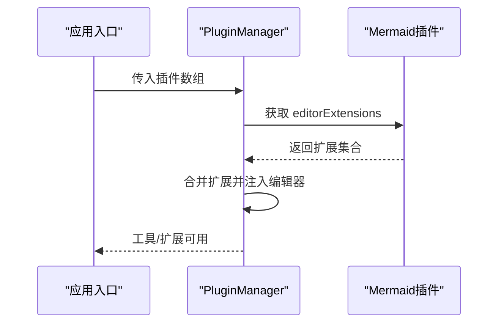
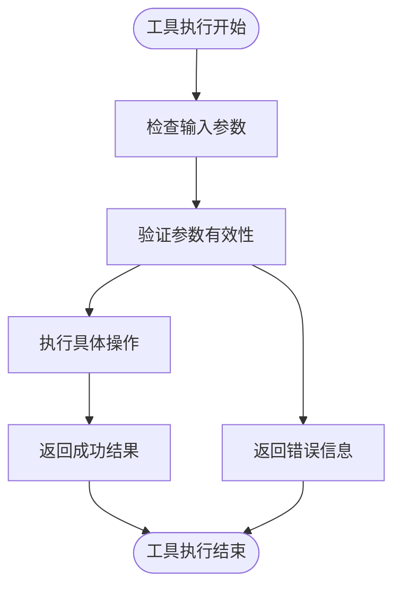
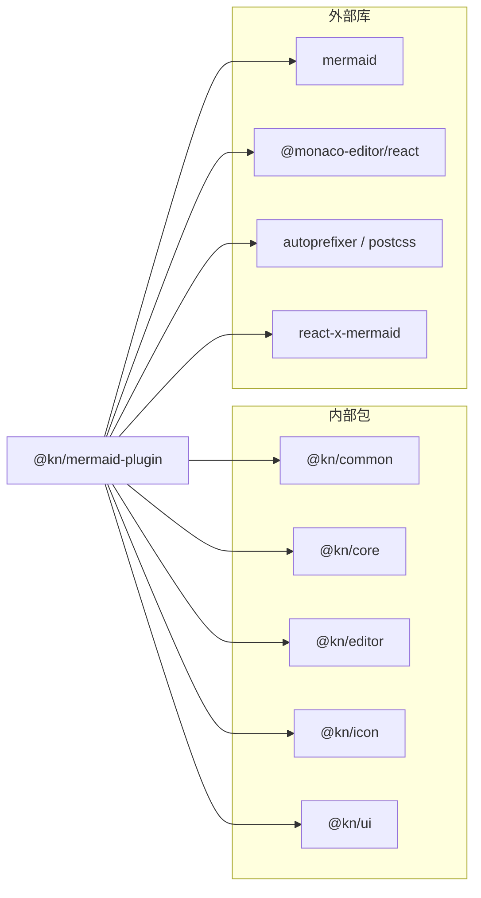

# Mermaid图表插件

<cite>
**本文引用的文件**
- [packages/plugin-mermaid/src/index.tsx](file://packages/plugin-mermaid/src/index.tsx)
- [packages/plugin-mermaid/src/editor-extension/mermaid/index.tsx](file://packages/plugin-mermaid/src/editor-extension/mermaid/index.tsx)
- [packages/plugin-mermaid/src/editor-extension/mermaid/mermaid.ts](file://packages/plugin-mermaid/src/editor-extension/mermaid/mermaid.ts)
- [packages/plugin-mermaid/src/editor-extension/mermaid/MermaidView.tsx](file://packages/plugin-mermaid/src/editor-extension/mermaid/MermaidView.tsx)
- [packages/plugin-mermaid/src/editor-extension/mermaid/skills/mermaid-skill.ts](file://packages/plugin-mermaid/src/editor-extension/mermaid/skills/mermaid-skill.ts)
- [packages/plugin-mermaid/src/component/index.tsx](file://packages/plugin-mermaid/src/component/index.tsx)
- [packages/plugin-mermaid/src/component/styles.css](file://packages/plugin-mermaid/src/component/styles.css)
- [packages/plugin-mermaid/package.json](file://packages/plugin-mermaid/package.json)
- [apps/vite/src/main.tsx](file://apps/vite/src/main.tsx)
- [packages/common/src/core/PluginManager.ts](file://packages/common/src/core/PluginManager.ts)
</cite>

## 更新摘要
**变更内容**
- 新增Mermaid图表技能系统，支持AI代理自动创建和管理图表
- 扩展工具集，包含图表插入、列表、更新、删除和模板获取功能
- 新增10种图表类型的完整模板支持
- 增强编辑器扩展，提供智能图表类型检测和管理能力

## 目录
1. [简介](#简介)
2. [项目结构](#项目结构)
3. [核心组件](#核心组件)
4. [架构总览](#架构总览)
5. [详细组件分析](#详细组件分析)
6. [Mermaid图表技能系统](#mermaid图表技能系统)
7. [图表类型与模板](#图表类型与模板)
8. [工具集详解](#工具集详解)
9. [依赖分析](#依赖分析)
10. [性能考虑](#性能考虑)
11. [故障排查指南](#故障排查指南)
12. [结论](#结论)
13. [附录](#附录)

## 简介
本插件为知识库编辑器提供全面的Mermaid图表解决方案，不仅支持在编辑器中通过"/mermaid"快捷指令或工具面板插入Mermaid节点，还新增了强大的技能系统，支持AI代理自动创建和管理各种类型的图表。插件支持10种图表类型（流程图、时序图、类图、状态图、ER图、甘特图、饼图、思维导图、时间线、Git分支图），提供完整的图表生命周期管理能力，包括创建、编辑、更新、删除和模板获取等功能。

## 项目结构
该插件位于packages/plugin-mermaid，主要由以下部分组成：
- 插件入口与注册：导出一个继承自通用插件基类的实例，声明编辑器扩展为Mermaid扩展集合。
- 编辑器扩展：定义Mermaid节点、节点视图以及丰富的工具集和技能系统。
- 技能系统：提供AI代理专用的Mermaid图表技能，支持多种图表类型的自动创建和管理。
- 渲染组件：提供独立的React组件用于在任意页面渲染Mermaid源码为SVG，并支持错误处理、复制与下载等交互。
- 样式：Tailwind CSS与基础样式，确保渲染容器、动作按钮与响应式布局一致。

```mermaid
graph TB
A["插件入口<br/>packages/plugin-mermaid/src/index.tsx"] --> B["编辑器扩展包装器<br/>packages/plugin-mermaid/src/editor-extension/mermaid/index.tsx"]
B --> C["Mermaid节点定义<br/>packages/plugin-mermaid/src/editor-extension/mermaid/mermaid.ts"]
B --> D["Mermaid节点视图<br/>packages/plugin-mermaid/src/editor-extension/mermaid/MermaidView.tsx"]
B --> E["技能系统<br/>packages/plugin-mermaid/src/editor-extension/mermaid/skills/mermaid-skill.ts"]
D --> F["Mermaid渲染组件<br/>packages/plugin-mermaid/src/component/index.tsx"]
F --> G["Mermaid样式<br/>packages/plugin-mermaid/src/component/styles.css"]
A --> H["应用集成示例<br/>apps/vite/src/main.tsx"]
A --> I["插件管理器通用<br/>packages/common/src/core/PluginManager.ts"]
```

**图示来源**
- [packages/plugin-mermaid/src/index.tsx:1-17](file://packages/plugin-mermaid/src/index.tsx#L1-L17)
- [packages/plugin-mermaid/src/editor-extension/mermaid/index.tsx:1-408](file://packages/plugin-mermaid/src/editor-extension/mermaid/index.tsx#L1-L408)
- [packages/plugin-mermaid/src/editor-extension/mermaid/mermaid.ts:1-46](file://packages/plugin-mermaid/src/editor-extension/mermaid/mermaid.ts#L1-L46)
- [packages/plugin-mermaid/src/editor-extension/mermaid/MermaidView.tsx:1-99](file://packages/plugin-mermaid/src/editor-extension/mermaid/MermaidView.tsx#L1-L99)
- [packages/plugin-mermaid/src/editor-extension/mermaid/skills/mermaid-skill.ts:1-40](file://packages/plugin-mermaid/src/editor-extension/mermaid/skills/mermaid-skill.ts#L1-L40)
- [packages/plugin-mermaid/src/component/index.tsx:1-197](file://packages/plugin-mermaid/src/component/index.tsx#L1-L197)
- [packages/plugin-mermaid/src/component/styles.css:1-83](file://packages/plugin-mermaid/src/component/styles.css#L1-L83)
- [apps/vite/src/main.tsx:1-23](file://apps/vite/src/main.tsx#L1-L23)
- [packages/common/src/core/PluginManager.ts:1-177](file://packages/common/src/core/PluginManager.ts#L1-L177)

## 核心组件
- 插件实例与注册
  - 通过继承通用插件基类创建实例，声明编辑器扩展数组包含Mermaid扩展，供应用在启动时统一加载。
- Mermaid节点与命令
  - 定义名为mermaid的块级节点，提供插入命令，支持传入初始代码片段。
  - 节点视图使用React渲染器挂载MermaidView。
- Mermaid节点视图
  - 使用Monaco编辑器作为源码编辑器，支持主题联动（深色/浅色）。
  - 实时防抖更新节点属性中的数据字段，避免频繁重渲染。
  - 将源码交给渲染组件进行Mermaid渲染，空代码时显示占位提示。
- 渲染组件
  - 对外暴露RenderMermaid组件，负责mermaid.initialize与mermaid.render的调用。
  - 支持自定义错误组件、复制与下载按钮、Mermaid配置覆盖、原始代码展示组件等。
  - 提供卸载清理逻辑，防止内存泄漏与重复更新。
- 样式
  - 提供渲染容器、动作按钮、错误状态与响应式样式的默认实现，便于快速集成。

**章节来源**
- [packages/plugin-mermaid/src/index.tsx:1-17](file://packages/plugin-mermaid/src/index.tsx#L1-L17)
- [packages/plugin-mermaid/src/editor-extension/mermaid/mermaid.ts:1-46](file://packages/plugin-mermaid/src/editor-extension/mermaid/mermaid.ts#L1-L46)
- [packages/plugin-mermaid/src/editor-extension/mermaid/MermaidView.tsx:1-99](file://packages/plugin-mermaid/src/editor-extension/mermaid/MermaidView.tsx#L1-L99)
- [packages/plugin-mermaid/src/component/index.tsx:1-197](file://packages/plugin-mermaid/src/component/index.tsx#L1-L197)
- [packages/plugin-mermaid/src/component/styles.css:1-83](file://packages/plugin-mermaid/src/component/styles.css#L1-L83)

## 架构总览
下图展示了从应用启动到编辑器中插入与渲染Mermaid图表的整体流程，包括插件注册、编辑器扩展解析、节点视图渲染与实时编辑，以及新增的技能系统集成。

```mermaid
sequenceDiagram
participant App as "应用<br/>apps/vite/src/main.tsx"
participant PM as "插件管理器<br/>PluginManager"
participant Plugin as "Mermaid插件实例<br/>index.tsx"
participant Ext as "编辑器扩展包装器<br/>mermaid/index.tsx"
participant Skill as "技能系统<br/>mermaid-skill.ts"
participant Node as "Mermaid节点<br/>mermaid.ts"
participant View as "Mermaid节点视图<br/>MermaidView.tsx"
participant Render as "渲染组件<br/>component/index.tsx"
App->>PM : 传入插件数组含mermaid
PM->>Plugin : 解析editorExtensions
Plugin-->>Ext : 返回扩展集合
Ext->>Skill : 注册Mermaid技能
Ext->>Node : 注册mermaid节点与命令
App->>View : 在编辑器中插入mermaid节点
View->>Render : 传入源码与主题配置
Render->>Render : mermaid.initialize / mermaid.render
Render-->>View : 返回SVG或错误信息
View-->>App : 展示渲染结果与编辑器
```

**图示来源**
- [apps/vite/src/main.tsx:1-23](file://apps/vite/src/main.tsx#L1-L23)
- [packages/common/src/core/PluginManager.ts:120-162](file://packages/common/src/core/PluginManager.ts#L120-L162)
- [packages/plugin-mermaid/src/index.tsx:1-17](file://packages/plugin-mermaid/src/index.tsx#L1-L17)
- [packages/plugin-mermaid/src/editor-extension/mermaid/index.tsx:1-408](file://packages/plugin-mermaid/src/editor-extension/mermaid/index.tsx#L1-L408)
- [packages/plugin-mermaid/src/editor-extension/mermaid/skills/mermaid-skill.ts:1-40](file://packages/plugin-mermaid/src/editor-extension/mermaid/skills/mermaid-skill.ts#L1-L40)
- [packages/plugin-mermaid/src/editor-extension/mermaid/mermaid.ts:1-46](file://packages/plugin-mermaid/src/editor-extension/mermaid/mermaid.ts#L1-L46)
- [packages/plugin-mermaid/src/editor-extension/mermaid/MermaidView.tsx:1-99](file://packages/plugin-mermaid/src/editor-extension/mermaid/MermaidView.tsx#L1-L99)
- [packages/plugin-mermaid/src/component/index.tsx:1-197](file://packages/plugin-mermaid/src/component/index.tsx#L1-L197)

## 详细组件分析

### 组件A：Mermaid节点与命令
- 节点特性
  - 名称为mermaid，分组为块级元素，HTML渲染包裹器用于承载节点内容。
  - 提供attributes：data字段存储源码字符串。
  - 提供insertMermaid命令，向编辑器插入该节点并设置初始数据。
- 视图渲染
  - 使用ReactNodeViewRenderer渲染MermaidView，阻止事件冒泡以避免冲突。

```mermaid
classDiagram
class MermaidNode {
+名称 : "mermaid"
+分组 : "block"
+属性 : data(字符串)
+命令 : insertMermaid(code)
+视图 : ReactNodeViewRenderer(MermaidView)
}
class MermaidView {
+状态 : code(源码)
+编辑器 : Monaco
+主题 : useTheme()
+效果 : 防抖更新属性
+渲染 : RenderMermaid(源码, 主题)
}
class RenderMermaid {
+属性 : mermaidCode, mermaidConfig, errorComponent, renderCode
+行为 : 初始化mermaid, 渲染SVG, 错误处理, 复制/下载
}
MermaidNode --> MermaidView : "注册节点视图"
MermaidView --> RenderMermaid : "传递源码与配置"
```

**图示来源**
- [packages/plugin-mermaid/src/editor-extension/mermaid/mermaid.ts:1-46](file://packages/plugin-mermaid/src/editor-extension/mermaid/mermaid.ts#L1-L46)
- [packages/plugin-mermaid/src/editor-extension/mermaid/MermaidView.tsx:1-99](file://packages/plugin-mermaid/src/editor-extension/mermaid/MermaidView.tsx#L1-L99)
- [packages/plugin-mermaid/src/component/index.tsx:1-197](file://packages/plugin-mermaid/src/component/index.tsx#L1-L197)

**章节来源**
- [packages/plugin-mermaid/src/editor-extension/mermaid/mermaid.ts:1-46](file://packages/plugin-mermaid/src/editor-extension/mermaid/mermaid.ts#L1-L46)
- [packages/plugin-mermaid/src/editor-extension/mermaid/MermaidView.tsx:1-99](file://packages/plugin-mermaid/src/editor-extension/mermaid/MermaidView.tsx#L1-L99)

### 组件B：编辑器扩展包装器与工具
- 扩展包装器
  - name与extendsion字段声明扩展名与实现列表。
  - slashConfig提供"/mermaid"快捷指令，触发插入Mermaid节点命令。
  - tools提供工具面板入口，接收参数对象（包含code字段），执行插入命令。
- 输入校验
  - 使用zod schema对工具输入进行约束，确保传入的code为字符串。
- 技能系统
  - 新增skills字段，注册Mermaid技能，为AI代理提供图表创建和管理能力。

```mermaid
flowchart TD
Start(["用户触发工具/斜杠"]) --> Validate["校验输入参数<br/>z.object({ code: string })"]
Validate --> Insert["调用编辑器命令 insertMermaid(code)"]
Insert --> NodeInsert["插入 mermaid 节点<br/>设置 attrs.data"]
NodeInsert --> End(["完成"])
```

**图示来源**
- [packages/plugin-mermaid/src/editor-extension/mermaid/index.tsx:1-408](file://packages/plugin-mermaid/src/editor-extension/mermaid/index.tsx#L1-L408)
- [packages/plugin-mermaid/src/editor-extension/mermaid/mermaid.ts:33-46](file://packages/plugin-mermaid/src/editor-extension/mermaid/mermaid.ts#L33-L46)

**章节来源**
- [packages/plugin-mermaid/src/editor-extension/mermaid/index.tsx:1-408](file://packages/plugin-mermaid/src/editor-extension/mermaid/index.tsx#L1-L408)

### 组件C：渲染组件与下载/复制功能
- 渲染流程
  - 在useEffect中初始化mermaid（禁用自动加载、抑制错误渲染、设置主题），随后调用render生成SVG并写入容器。
  - 卸载时清空容器，防止重复更新与内存泄漏。
- 交互能力
  - 复制：将当前源码写入剪贴板。
  - 下载：序列化SVG元素为Blob并触发下载链接。
  - 自定义：支持替换错误组件、下载/复制按钮组件、原始代码渲染组件；支持传入mermaidConfig覆盖默认配置。

```mermaid
flowchart TD
Enter(["组件挂载/源码变化"]) --> Init["mermaid.initialize(theme, suppressErrorRendering)"]
Init --> Render["mermaid.render(id, mermaidCode)"]
Render --> HasSVG{"返回 SVG 成功？"}
HasSVG --> |是| SetDOM["写入容器 innerHTML"]
HasSVG --> |否| ShowError["捕获错误并显示错误组件"]
SetDOM --> Actions["显示复制/下载按钮"]
ShowError --> Actions
Actions --> Exit(["渲染完成"])
```

**图示来源**
- [packages/plugin-mermaid/src/component/index.tsx:67-109](file://packages/plugin-mermaid/src/component/index.tsx#L67-L109)
- [packages/plugin-mermaid/src/component/index.tsx:111-177](file://packages/plugin-mermaid/src/component/index.tsx#L111-L177)

**章节来源**
- [packages/plugin-mermaid/src/component/index.tsx:1-197](file://packages/plugin-mermaid/src/component/index.tsx#L1-L197)

### 组件D：应用集成与插件管理
- 应用集成
  - 在应用入口导入插件实例并将其加入插件数组，从而在编辑器中启用Mermaid功能。
- 插件管理器
  - PluginManager负责解析插件的editorExtensions，并将扩展合并后注入编辑器。
  - 提供工具解析方法，将各插件的工具项聚合为可执行映射。

```mermaid
sequenceDiagram
participant App as "应用入口"
participant PM as "PluginManager"
participant Plugin as "Mermaid插件"
App->>PM : 传入插件数组
PM->>Plugin : 获取 editorExtensions
Plugin-->>PM : 返回扩展集合
PM->>PM : 合并扩展并注入编辑器
PM-->>App : 工具/扩展可用
```

**图示来源**
- [apps/vite/src/main.tsx:1-23](file://apps/vite/src/main.tsx#L1-L23)
- [packages/common/src/core/PluginManager.ts:120-162](file://packages/common/src/core/PluginManager.ts#L120-L162)
- [packages/plugin-mermaid/src/index.tsx:1-17](file://packages/plugin-mermaid/src/index.tsx#L1-L17)

**章节来源**
- [apps/vite/src/main.tsx:1-23](file://apps/vite/src/main.tsx#L1-L23)
- [packages/common/src/core/PluginManager.ts:1-177](file://packages/common/src/core/PluginManager.ts#L1-L177)
- [packages/plugin-mermaid/src/index.tsx:1-17](file://packages/plugin-mermaid/src/index.tsx#L1-L17)

## Mermaid图表技能系统

### 技能概述
新增的Mermaid技能系统为AI代理提供了完整的图表创建和管理能力，支持多种图表类型的自动识别和生成。

### 技能特性
- **多图表类型支持**：支持flowchart、sequence、classDiagram、stateDiagram、erDiagram、gantt、pie、mindmap、timeline、gitGraph等10种图表类型
- **智能图表识别**：能够根据用户需求自动选择合适的图表类型
- **完整工具链**：提供图表创建、查询、更新、删除的完整生命周期管理
- **模板系统**：内置丰富的图表模板，支持快速生成标准图表

### 技能配置
- **必需工具**：insertMermaidDiagram、listMermaidDiagrams
- **可选工具**：updateMermaidDiagram、deleteMermaidDiagram、getMermaidTemplates
- **系统提示**：详细的图表创建指导和最佳实践

**章节来源**
- [packages/plugin-mermaid/src/editor-extension/mermaid/skills/mermaid-skill.ts:1-40](file://packages/plugin-mermaid/src/editor-extension/mermaid/skills/mermaid-skill.ts#L1-L40)

## 图表类型与模板

### 支持的图表类型
插件内置了10种图表类型的完整模板，每种都有专门的语法和用途：

1. **Flowchart（流程图）**：用于展示流程、决策树和算法逻辑
2. **Sequence（时序图）**：用于展示系统交互、API调用流程和消息传递
3. **ClassDiagram（类图）**：用于展示代码结构、类关系和面向对象设计
4. **StateDiagram（状态图）**：用于展示状态转换、有限状态机和工作流
5. **ErDiagram（ER图）**：用于展示数据库实体关系和表结构
6. **Gantt（甘特图）**：用于项目时间规划、任务调度和进度跟踪
7. **Pie（饼图）**：用于展示数据分布比例和统计信息
8. **Mindmap（思维导图）**：用于展示层级结构、想法组织和知识管理
9. **Timeline（时间线）**：用于展示历史事件、发展过程和里程碑
10. **GitGraph（Git分支图）**：用于展示版本控制流程、分支管理和提交历史

### 模板特点
- **语法完整**：每种图表类型都提供标准的Mermaid语法模板
- **易于修改**：模板结构清晰，便于用户根据需求进行定制
- **最佳实践**：模板遵循各图表类型的最佳实践和推荐格式
- **实时预览**：插入模板后可立即看到图表效果

**章节来源**
- [packages/plugin-mermaid/src/editor-extension/mermaid/index.tsx:12-89](file://packages/plugin-mermaid/src/editor-extension/mermaid/index.tsx#L12-L89)

## 工具集详解

### 工具集概览
插件提供了5个核心工具，形成完整的Mermaid图表生命周期管理体系：

#### 工具1：insertMermaidDiagram（插入图表）
- **功能**：插入Mermaid图表，支持多种图表类型和自定义代码
- **参数**：
  - `code`：Mermaid图表代码（可选）
  - `chartType`：图表类型枚举（可选）
  - `position`：插入位置（可选）
- **行为**：根据chartType生成对应模板，或使用提供的code；支持指定插入位置

#### 工具2：listMermaidDiagrams（列出图表）
- **功能**：列出文档中所有Mermaid图表，返回每个图表的详细信息
- **输出**：图表索引、位置、节点大小、图表类型、代码预览和完整代码
- **用途**：在更新或删除图表前了解文档中已有的图表

#### 工具3：updateMermaidDiagram（更新图表）
- **功能**：更新文档中指定位置的Mermaid图表代码
- **参数**：
  - `position`：要更新的图表位置（必须）
  - `newCode`：新的Mermaid图表代码（必须）
- **行为**：通过位置定位目标图表，替换为新代码

#### 工具4：deleteMermaidDiagram（删除图表）
- **功能**：删除文档中指定位置的Mermaid图表
- **参数**：`position`：要删除的图表位置
- **行为**：安全删除指定位置的图表节点

#### 工具5：getMermaidTemplates（获取模板）
- **功能**：获取所有可用的Mermaid图表类型模板
- **参数**：`chartType`：要获取的图表类型（可选，默认'all'）
- **输出**：模板字典、可用类型列表和模板详情

### 工具执行流程

```mermaid
flowchart TD
Start(["工具执行开始"]) --> CheckParams["检查输入参数"]
CheckParams --> Validate["验证参数有效性"]
Validate --> Execute["执行具体操作"]
Execute --> Success["返回成功结果"]
Validate --> Error["返回错误信息"]
Success --> End(["工具执行结束"])
Error --> End
```

**图示来源**
- [packages/plugin-mermaid/src/editor-extension/mermaid/index.tsx:146-195](file://packages/plugin-mermaid/src/editor-extension/mermaid/index.tsx#L146-L195)
- [packages/plugin-mermaid/src/editor-extension/mermaid/index.tsx:203-264](file://packages/plugin-mermaid/src/editor-extension/mermaid/index.tsx#L203-L264)
- [packages/plugin-mermaid/src/editor-extension/mermaid/index.tsx:275-320](file://packages/plugin-mermaid/src/editor-extension/mermaid/index.tsx#L275-L320)
- [packages/plugin-mermaid/src/editor-extension/mermaid/index.tsx:330-364](file://packages/plugin-mermaid/src/editor-extension/mermaid/index.tsx#L330-L364)
- [packages/plugin-mermaid/src/editor-extension/mermaid/index.tsx:377-404](file://packages/plugin-mermaid/src/editor-extension/mermaid/index.tsx#L377-L404)

**章节来源**
- [packages/plugin-mermaid/src/editor-extension/mermaid/index.tsx:121-405](file://packages/plugin-mermaid/src/editor-extension/mermaid/index.tsx#L121-L405)

## 依赖分析
- 内部依赖
  - @kn/common：通用插件基类与类型定义。
  - @kn/core：核心工具与异步效果钩子（如useAsyncEffect、useDebounce）。
  - @kn/editor：编辑器节点与命令扩展、NodeView包装器。
  - @kn/icon：图标资源。
  - @kn/ui：UI组件（如按钮、主题、空状态）。
- 外部依赖
  - mermaid：Mermaid图表渲染库。
  - @monaco-editor/react：源码编辑器。
  - autoprefixer/postcss：构建期样式处理。
  - react-x-mermaid：额外的Mermaid React组件支持。

```mermaid
graph LR
subgraph "内部包"
Common["@kn/common"]
Core["@kn/core"]
Editor["@kn/editor"]
Icon["@kn/icon"]
UI["@kn/ui"]
end
subgraph "外部库"
MermaidLib["mermaid"]
Monaco["@monaco-editor/react"]
PostCSS["autoprefixer / postcss"]
ReactXM["react-x-mermaid"]
end
Plugin["@kn/mermaid-plugin"] --> Common
Plugin --> Core
Plugin --> Editor
Plugin --> Icon
Plugin --> UI
Plugin --> MermaidLib
Plugin --> Monaco
Plugin --> PostCSS
Plugin --> ReactXM
```

**图示来源**
- [packages/plugin-mermaid/package.json:15-26](file://packages/plugin-mermaid/package.json#L15-L26)

**章节来源**
- [packages/plugin-mermaid/package.json:1-34](file://packages/plugin-mermaid/package.json#L1-L34)

## 性能考虑
- 渲染去抖
  - 节点视图对源码变更采用防抖策略，减少频繁渲染带来的性能压力。
- 渲染清理
  - 组件卸载时清空容器，避免残留DOM引发的内存问题。
- 主题切换
  - 渲染组件根据主题动态选择mermaid主题，避免不必要的重渲染。
- 按需初始化
  - 仅在需要时初始化mermaid，避免全局初始化开销。
- 工具执行优化
  - 图表查找和更新操作使用高效的文档遍历算法。
  - 支持指定位置插入，避免全文档扫描。

## 故障排查指南
- 插件未生效
  - 确认应用入口已将插件实例加入插件数组。
  - 检查插件管理器是否正确解析editorExtensions。
- 编辑器中无法插入Mermaid
  - 斜杠菜单或工具面板是否可见；确认工具输入schema正确传入code。
  - 检查编辑器命令insertMermaid是否被正确注册。
- 图表不显示或报错
  - 检查源码是否为空或仅包含空白字符；空源码会被清空容器。
  - 查看错误组件是否正常渲染；必要时提供自定义错误组件。
  - 确认mermaid.initialize的配置未被意外覆盖。
- 下载/复制无效
  - 确认SVG容器存在且非空；下载前先渲染成功。
  - 复制按钮需在浏览器允许剪贴板权限的情况下使用。
- 工具执行失败
  - 检查图表位置参数是否有效；使用listMermaidDiagrams获取准确位置。
  - 确认图表类型参数是否在支持的枚举范围内。
  - 查看工具返回的错误信息，按提示修正参数。
- 技能系统问题
  - 确认AI代理已正确加载Mermaid技能。
  - 检查技能所需的工具是否已注册。
  - 验证系统提示是否正确传递给AI代理。

**章节来源**
- [apps/vite/src/main.tsx:1-23](file://apps/vite/src/main.tsx#L1-L23)
- [packages/common/src/core/PluginManager.ts:120-162](file://packages/common/src/core/PluginManager.ts#L120-L162)
- [packages/plugin-mermaid/src/editor-extension/mermaid/index.tsx:1-408](file://packages/plugin-mermaid/src/editor-extension/mermaid/index.tsx#L1-L408)
- [packages/plugin-mermaid/src/editor-extension/mermaid/mermaid.ts:33-46](file://packages/plugin-mermaid/src/editor-extension/mermaid/mermaid.ts#L33-L46)
- [packages/plugin-mermaid/src/component/index.tsx:111-177](file://packages/plugin-mermaid/src/component/index.tsx#L111-L177)

## 结论
该Mermaid图表插件通过清晰的模块划分与标准的编辑器扩展机制，实现了从"插入节点—实时编辑—渲染展示—交互操作"的完整闭环。新增的技能系统进一步增强了插件的能力，为AI代理提供了完整的图表创建和管理能力。插件支持10种图表类型，提供完整的工具集，既可在编辑器中直接使用，也可作为独立组件在其他场景渲染Mermaid图表。配合插件管理器的统一解析与注入，以及AI技能系统的集成，能够平滑地集成到现有系统中，为用户提供智能化的图表创建体验。

## 附录
- 使用建议
  - 在生产环境建议提供自定义错误组件与原始代码渲染组件，提升可观测性与可维护性。
  - 对于长图表，建议开启滚动容器与响应式样式，保证在小屏设备上的可读性。
  - 利用技能系统，让AI代理自动识别用户需求并创建合适的图表。
  - 使用工具集进行图表的批量管理和维护。
- 可能的优化方向
  - 对mermaid.render增加缓存策略，避免相同源码重复渲染。
  - 对编辑器宽度与高度进行更灵活的自适应控制。
  - 增加图表类型检测的准确性，支持更多图表变体。
  - 优化工具执行性能，支持大规模文档的图表管理。