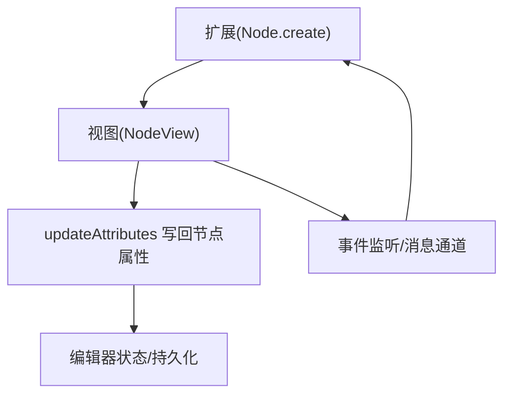
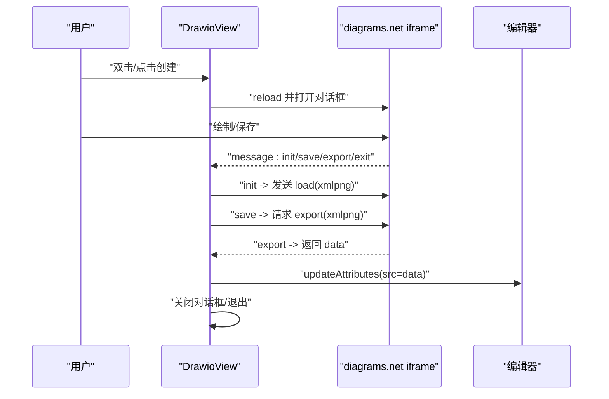
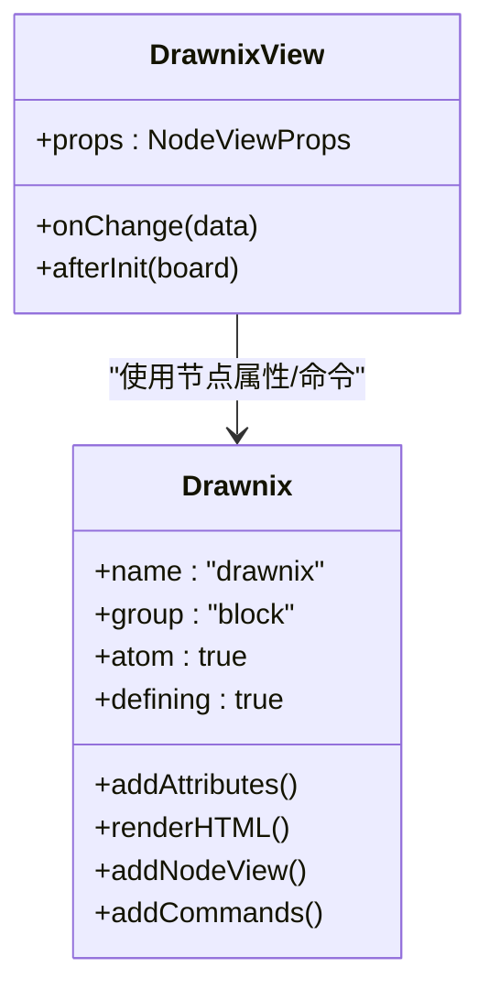
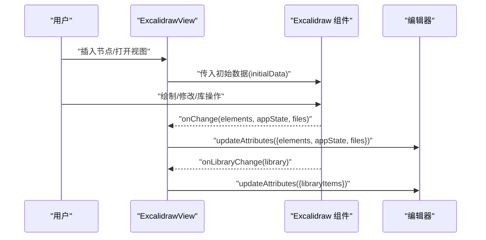
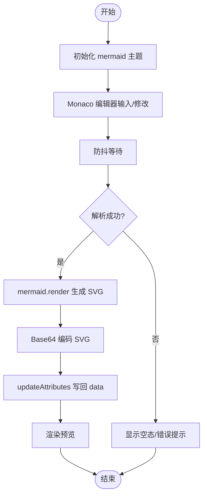
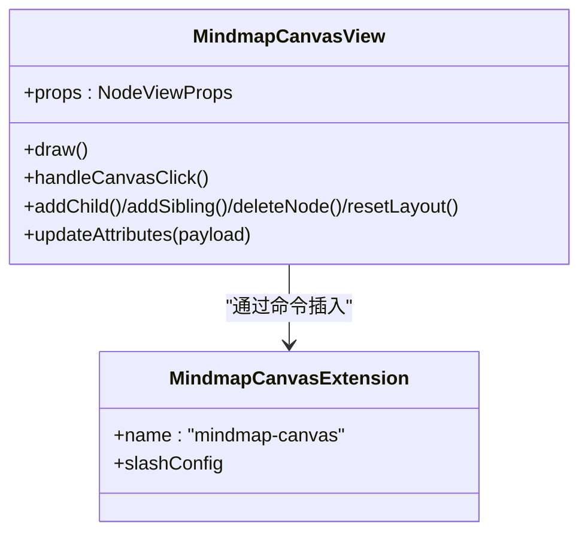
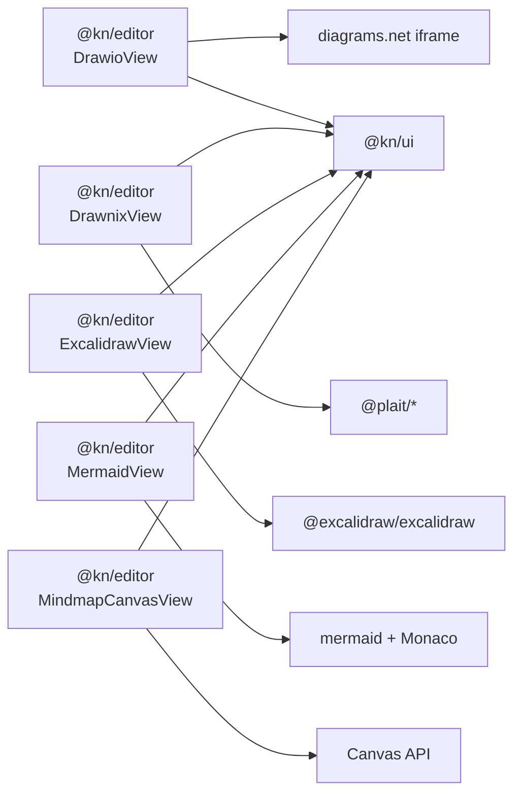

# 绘图插件

<cite>
**本文引用的文件**
- [packages/plugin-drawio/src/index.tsx](file://packages/plugin-drawio/src/index.tsx)
- [packages/plugin-drawio/src/extension/drawio.ts](file://packages/plugin-drawio/src/extension/drawio.ts)
- [packages/plugin-drawio/src/extension/DrawioView.tsx](file://packages/plugin-drawio/src/extension/DrawioView.tsx)
- [packages/plugin-drawnix/src/index.tsx](file://packages/plugin-drawnix/src/index.tsx)
- [packages/plugin-drawnix/src/extension/drawnix.ts](file://packages/plugin-drawnix/src/extension/drawnix.ts)
- [packages/plugin-drawnix/src/extension/DrawnixView.tsx](file://packages/plugin-drawnix/src/extension/DrawnixView.tsx)
- [packages/plugin-excalidraw/src/index.ts](file://packages/plugin-excalidraw/src/index.ts)
- [packages/plugin-excalidraw/src/excalidraw/excalidraw.ts](file://packages/plugin-excalidraw/src/excalidraw/excalidraw.ts)
- [packages/plugin-excalidraw/src/excalidraw/ExcalidrawView.tsx](file://packages/plugin-excalidraw/src/excalidraw/ExcalidrawView.tsx)
- [packages/plugin-mermaid/src/index.tsx](file://packages/plugin-mermaid/src/index.tsx)
- [packages/plugin-mermaid/src/editor-extension/mermaid/mermaid.ts](file://packages/plugin-mermaid/src/editor-extension/mermaid/mermaid.ts)
- [packages/plugin-mermaid/src/editor-extension/mermaid/MermaidView.tsx](file://packages/plugin-mermaid/src/editor-extension/mermaid/MermaidView.tsx)
- [packages/plugin-mindmap-canvas/src/index.tsx](file://packages/plugin-mindmap-canvas/src/index.tsx)
- [packages/plugin-mindmap-canvas/src/mindmap-extension.tsx](file://packages/plugin-mindmap-canvas/src/mindmap-extension.tsx)
- [packages/plugin-mindmap-canvas/src/views/MindmapCanvasView.tsx](file://packages/plugin-mindmap-canvas/src/views/MindmapCanvasView.tsx)
</cite>

## 目录
1. [引言](#引言)
2. [项目结构](#项目结构)
3. [核心组件](#核心组件)
4. [架构总览](#架构总览)
5. [详细组件分析](#详细组件分析)
6. [依赖关系分析](#依赖关系分析)
7. [性能考量](#性能考量)
8. [故障排查指南](#故障排查指南)
9. [结论](#结论)
10. [附录](#附录)

## 引言
本文件系统性梳理仓库中的绘图插件体系，覆盖以下能力：
- Draw.io 集成：通过嵌入 diagrams.net 的 iframe 实现在线绘制与双向数据同步（XML PNG 导出回写）。
- Drawnix 思维导图：基于 Plait 的手绘风格思维导图，支持主题切换与本地数据持久化。
- Excalidraw 手绘图表：内嵌 Excalidraw 组件，支持元素与库数据的实时更新与只读协作模式。
- Mermaid 图表：内嵌 Monaco 编辑器与 mermaid 渲染，提供所见即所得的草图体验。
- Mindmap Canvas 思维导图：纯 Canvas 实现的交互式思维导图，支持节点增删改与自动布局。

文档从架构、组件、数据流、交互与存储策略等维度进行深入解析，并给出最佳实践与排障建议。

## 项目结构
绘图插件以“包”为单位组织，每个插件均包含：
- 插件入口 index.tsx：注册 KPlugin 并注入 editorExtension 列表。
- 扩展定义 extension/*.ts：定义 ProseMirror Node/Extension，声明属性、命令与 NodeView。
- 视图组件 extension/*View.tsx：负责渲染与交互，绑定编辑器上下文与数据更新。

```mermaid
graph TB
subgraph "Draw.io 插件"
DIndex["plugin-drawio/src/index.tsx"]
DExt["plugin-drawio/src/extension/drawio.ts"]
DView["plugin-drawio/src/extension/DrawioView.tsx"]
end
subgraph "Drawnix 插件"
NIndex["plugin-drawnix/src/index.tsx"]
NExt["plugin-drawnix/src/extension/drawnix.ts"]
NView["plugin-drawnix/src/extension/DrawnixView.tsx"]
end
subgraph "Excalidraw 插件"
EIndex["plugin-excalidraw/src/index.ts"]
EExt["plugin-excalidraw/src/excalidraw/excalidraw.ts"]
EView["plugin-excalidraw/src/excalidraw/ExcalidrawView.tsx"]
end
subgraph "Mermaid 插件"
MIndex["plugin-mermaid/src/index.tsx"]
MExt["plugin-mermaid/src/editor-extension/mermaid/mermaid.ts"]
MView["plugin-mermaid/src/editor-extension/mermaid/MermaidView.tsx"]
end
subgraph "Mindmap Canvas 插件"
CIndex["plugin-mindmap-canvas/src/index.tsx"]
CExt["plugin-mindmap-canvas/src/mindmap-extension.tsx"]
CView["plugin-mindmap-canvas/src/views/MindmapCanvasView.tsx"]
end
DIndex --> DExt --> DView
NIndex --> NExt --> NView
EIndex --> EExt --> EView
MIndex --> MExt --> MView
CIndex --> CExt --> CView
```

**图表来源**
- [packages/plugin-drawio/src/index.tsx](file://packages/plugin-drawio/src/index.tsx#L1-L14)
- [packages/plugin-drawnix/src/index.tsx](file://packages/plugin-drawnix/src/index.tsx#L1-L14)
- [packages/plugin-excalidraw/src/index.ts](file://packages/plugin-excalidraw/src/index.ts#L1-L19)
- [packages/plugin-mermaid/src/index.tsx](file://packages/plugin-mermaid/src/index.tsx#L1-L17)
- [packages/plugin-mindmap-canvas/src/index.tsx](file://packages/plugin-mindmap-canvas/src/index.tsx#L1-L13)

**章节来源**
- [packages/plugin-drawio/src/index.tsx](file://packages/plugin-drawio/src/index.tsx#L1-L14)
- [packages/plugin-drawnix/src/index.tsx](file://packages/plugin-drawnix/src/index.tsx#L1-L14)
- [packages/plugin-excalidraw/src/index.ts](file://packages/plugin-excalidraw/src/index.ts#L1-L19)
- [packages/plugin-mermaid/src/index.tsx](file://packages/plugin-mermaid/src/index.tsx#L1-L17)
- [packages/plugin-mindmap-canvas/src/index.tsx](file://packages/plugin-mindmap-canvas/src/index.tsx#L1-L13)

## 核心组件
- 插件注册与扩展注入
  - 每个插件通过 KPlugin 注册，将 editorExtension 数组注入到编辑器扩展体系，从而在菜单或快捷键中可调用。
  - 参考路径：
    - [packages/plugin-drawio/src/index.tsx](file://packages/plugin-drawio/src/index.tsx#L1-L14)
    - [packages/plugin-drawnix/src/index.tsx](file://packages/plugin-drawnix/src/index.tsx#L1-L14)
    - [packages/plugin-excalidraw/src/index.ts](file://packages/plugin-excalidraw/src/index.ts#L1-L19)
    - [packages/plugin-mermaid/src/index.tsx](file://packages/plugin-mermaid/src/index.tsx#L1-L17)
    - [packages/plugin-mindmap-canvas/src/index.tsx](file://packages/plugin-mindmap-canvas/src/index.tsx#L1-L13)

- 节点与命令
  - 各插件扩展均通过 Node.create 定义节点类型、属性、渲染与 NodeView，并提供 insert* 命令用于插入对应节点。
  - 参考路径：
    - [packages/plugin-drawio/src/extension/drawio.ts](file://packages/plugin-drawio/src/extension/drawio.ts#L22-L79)
    - [packages/plugin-drawnix/src/extension/drawnix.ts](file://packages/plugin-drawnix/src/extension/drawnix.ts#L12-L43)
    - [packages/plugin-excalidraw/src/excalidraw/excalidraw.ts](file://packages/plugin-excalidraw/src/excalidraw/excalidraw.ts#L14-L67)
    - [packages/plugin-mermaid/src/editor-extension/mermaid/mermaid.ts](file://packages/plugin-mermaid/src/editor-extension/mermaid/mermaid.ts#L13-L43)
    - [packages/plugin-mindmap-canvas/src/mindmap-extension.tsx](file://packages/plugin-mindmap-canvas/src/mindmap-extension.tsx#L1-L18)

- 视图渲染与交互
  - NodeViewWrapper 包裹视图，统一容器样式与交互；各视图组件负责具体渲染、事件处理与数据回写。
  - 参考路径：
    - [packages/plugin-drawio/src/extension/DrawioView.tsx](file://packages/plugin-drawio/src/extension/DrawioView.tsx#L1-L90)
    - [packages/plugin-drawnix/src/extension/DrawnixView.tsx](file://packages/plugin-drawnix/src/extension/DrawnixView.tsx#L1-L56)
    - [packages/plugin-excalidraw/src/excalidraw/ExcalidrawView.tsx](file://packages/plugin-excalidraw/src/excalidraw/ExcalidrawView.tsx#L1-L53)
    - [packages/plugin-mermaid/src/editor-extension/mermaid/MermaidView.tsx](file://packages/plugin-mermaid/src/editor-extension/mermaid/MermaidView.tsx#L1-L75)
    - [packages/plugin-mindmap-canvas/src/views/MindmapCanvasView.tsx](file://packages/plugin-mindmap-canvas/src/views/MindmapCanvasView.tsx#L1-L249)

**章节来源**
- [packages/plugin-drawio/src/index.tsx](file://packages/plugin-drawio/src/index.tsx#L1-L14)
- [packages/plugin-drawnix/src/index.tsx](file://packages/plugin-drawnix/src/index.tsx#L1-L14)
- [packages/plugin-excalidraw/src/index.ts](file://packages/plugin-excalidraw/src/index.ts#L1-L19)
- [packages/plugin-mermaid/src/index.tsx](file://packages/plugin-mermaid/src/index.tsx#L1-L17)
- [packages/plugin-mindmap-canvas/src/index.tsx](file://packages/plugin-mindmap-canvas/src/index.tsx#L1-L13)
- [packages/plugin-drawio/src/extension/drawio.ts](file://packages/plugin-drawio/src/extension/drawio.ts#L22-L79)
- [packages/plugin-drawnix/src/extension/drawnix.ts](file://packages/plugin-drawnix/src/extension/drawnix.ts#L12-L43)
- [packages/plugin-excalidraw/src/excalidraw/excalidraw.ts](file://packages/plugin-excalidraw/src/excalidraw/excalidraw.ts#L14-L67)
- [packages/plugin-mermaid/src/editor-extension/mermaid/mermaid.ts](file://packages/plugin-mermaid/src/editor-extension/mermaid/mermaid.ts#L13-L43)
- [packages/plugin-mindmap-canvas/src/mindmap-extension.tsx](file://packages/plugin-mindmap-canvas/src/mindmap-extension.tsx#L1-L18)

## 架构总览
绘图插件采用“扩展 + 视图”的分层架构：
- 扩展层：定义节点、属性、命令与 NodeView，作为编辑器的静态扩展。
- 视图层：在 NodeViewWrapper 内部渲染具体可视化组件，处理用户交互与数据更新。
- 数据层：通过 updateAttributes 将变更写回 ProseMirror 节点属性，实现持久化与协作。

**图表来源**
- [packages/plugin-drawio/src/extension/drawio.ts](file://packages/plugin-drawio/src/extension/drawio.ts#L22-L79)
- [packages/plugin-drawnix/src/extension/drawnix.ts](file://packages/plugin-drawnix/src/extension/drawnix.ts#L12-L43)
- [packages/plugin-excalidraw/src/excalidraw/excalidraw.ts](file://packages/plugin-excalidraw/src/excalidraw/excalidraw.ts#L14-L67)
- [packages/plugin-mermaid/src/editor-extension/mermaid/mermaid.ts](file://packages/plugin-mermaid/src/editor-extension/mermaid/mermaid.ts#L13-L43)
- [packages/plugin-mindmap-canvas/src/mindmap-extension.tsx](file://packages/plugin-mindmap-canvas/src/mindmap-extension.tsx#L1-L18)

## 详细组件分析

### Draw.io 集成
- 实现特点
  - 使用 iframe 嵌入 diagrams.net，在初始化时向其发送 load 命令加载初始 XML PNG；保存时触发 export 并将结果回写至节点属性。
  - 支持双击打开对话框、主题切换（明暗主题映射到 ui 参数）、空态提示与创建按钮。
- 适用场景
  - 需要专业流程图/架构图/时序图等，且希望与外部平台无缝协作。
- 集成方式
  - 在编辑器中通过命令插入 drawIoExtension 节点，随后在视图中打开对话框进行绘制。
- 数据存储策略
  - 节点属性包含 src（XML PNG），保存时由外部导出回写，确保数据持久化。
- 关键流程（序列图）

**图表来源**
- [packages/plugin-drawio/src/extension/DrawioView.tsx](file://packages/plugin-drawio/src/extension/DrawioView.tsx#L1-L90)
- [packages/plugin-drawio/src/extension/drawio.ts](file://packages/plugin-drawio/src/extension/drawio.ts#L22-L79)

**章节来源**
- [packages/plugin-drawio/src/extension/drawio.ts](file://packages/plugin-drawio/src/extension/drawio.ts#L22-L79)
- [packages/plugin-drawio/src/extension/DrawioView.tsx](file://packages/plugin-drawio/src/extension/DrawioView.tsx#L1-L90)
- [packages/plugin-drawio/src/index.tsx](file://packages/plugin-drawio/src/index.tsx#L1-L14)

### Drawnix 思维导图
- 实现特点
  - 基于 Plait 的 OnlyMind 组件，支持深色/彩色主题切换、只读模式、视口适配与数据变更回调。
  - 节点属性 data 存储完整思维导图数据，支持持久化与主题联动。
- 适用场景
  - 快速手绘风格思维导图，强调易用与即时反馈。
- 集成方式
  - 通过 insertDrawnix 命令插入节点，视图组件负责渲染与交互。
- 数据存储策略
  - 通过 updateAttributes 将变更后的 data 写回节点，实现本地持久化。
- 关键流程（类图）

**图表来源**
- [packages/plugin-drawnix/src/extension/drawnix.ts](file://packages/plugin-drawnix/src/extension/drawnix.ts#L12-L43)
- [packages/plugin-drawnix/src/extension/DrawnixView.tsx](file://packages/plugin-drawnix/src/extension/DrawnixView.tsx#L1-L56)

**章节来源**
- [packages/plugin-drawnix/src/extension/drawnix.ts](file://packages/plugin-drawnix/src/extension/drawnix.ts#L12-L43)
- [packages/plugin-drawnix/src/extension/DrawnixView.tsx](file://packages/plugin-drawnix/src/extension/DrawnixView.tsx#L1-L56)
- [packages/plugin-drawnix/src/index.tsx](file://packages/plugin-drawnix/src/index.tsx#L1-L14)

### Excalidraw 手绘图表
- 实现特点
  - 直接内嵌 @excalidraw/excalidraw 组件，支持主题切换、只读协作模式、初始数据注入与库变更回调。
  - 元素、应用状态、文件与库项均写回节点属性，保证数据一致性。
- 适用场景
  - 手绘草图、简单矢量图、多人协作但不启用实时协同时。
- 雜合方式
  - 通过 insertExcalidraw 命令插入节点，视图根据编辑器可编辑状态切换视图模式。
- 数据存储策略
  - 通过 onChange/onLibraryChange 回调更新 elements/appState/files/libraryItems。
- 关键流程（序列图）

**图表来源**
- [packages/plugin-excalidraw/src/excalidraw/ExcalidrawView.tsx](file://packages/plugin-excalidraw/src/excalidraw/ExcalidrawView.tsx#L1-L53)
- [packages/plugin-excalidraw/src/excalidraw/excalidraw.ts](file://packages/plugin-excalidraw/src/excalidraw/excalidraw.ts#L14-L67)

**章节来源**
- [packages/plugin-excalidraw/src/excalidraw/excalidraw.ts](file://packages/plugin-excalidraw/src/excalidraw/excalidraw.ts#L14-L67)
- [packages/plugin-excalidraw/src/excalidraw/ExcalidrawView.tsx](file://packages/plugin-excalidraw/src/excalidraw/ExcalidrawView.tsx#L1-L53)
- [packages/plugin-excalidraw/src/index.ts](file://packages/plugin-excalidraw/src/index.ts#L1-L19)

### Mermaid 图表
- 实现特点
  - 内嵌 Monaco 编辑器与 mermaid 渲染，支持主题切换、防抖解析与 SVG 基64 显示。
  - 提供空态引导与外部链接帮助。
- 适用场景
  - 流程图、时序图、甘特图等文本驱动的图表创作。
- 集成方式
  - 通过 insertMermaid 命令插入节点，视图组件负责编辑与渲染。
- 数据存储策略
  - 将用户输入的 mermaid 文本与渲染结果写回节点属性，便于持久化与预览。
- 关键流程（流程图）

**图表来源**
- [packages/plugin-mermaid/src/editor-extension/mermaid/MermaidView.tsx](file://packages/plugin-mermaid/src/editor-extension/mermaid/MermaidView.tsx#L1-L75)
- [packages/plugin-mermaid/src/editor-extension/mermaid/mermaid.ts](file://packages/plugin-mermaid/src/editor-extension/mermaid/mermaid.ts#L13-L43)

**章节来源**
- [packages/plugin-mermaid/src/editor-extension/mermaid/mermaid.ts](file://packages/plugin-mermaid/src/editor-extension/mermaid/mermaid.ts#L13-L43)
- [packages/plugin-mermaid/src/editor-extension/mermaid/MermaidView.tsx](file://packages/plugin-mermaid/src/editor-extension/mermaid/MermaidView.tsx#L1-L75)
- [packages/plugin-mermaid/src/index.tsx](file://packages/plugin-mermaid/src/index.tsx#L1-L17)

### Mindmap Canvas 思维导图
- 实现特点
  - 纯 Canvas 实现，支持节点选择、增删改、自动布局与响应式尺寸。
  - 通过 updateAttributes 将 payload 写回节点，保持数据一致性。
- 适用场景
  - 轻量级思维导图，强调交互与即时反馈。
- 集成方式
  - 通过 MindmapCanvasExtension 注入 Slash 命令，输入 /mindmap 即可插入节点。
- 数据存储策略
  - 节点属性 data 中保存完整的思维导图数据，随编辑器状态持久化。
- 关键流程（类图）

**图表来源**
- [packages/plugin-mindmap-canvas/src/mindmap-extension.tsx](file://packages/plugin-mindmap-canvas/src/mindmap-extension.tsx#L1-L18)
- [packages/plugin-mindmap-canvas/src/views/MindmapCanvasView.tsx](file://packages/plugin-mindmap-canvas/src/views/MindmapCanvasView.tsx#L1-L249)

**章节来源**
- [packages/plugin-mindmap-canvas/src/mindmap-extension.tsx](file://packages/plugin-mindmap-canvas/src/mindmap-extension.tsx#L1-L18)
- [packages/plugin-mindmap-canvas/src/views/MindmapCanvasView.tsx](file://packages/plugin-mindmap-canvas/src/views/MindmapCanvasView.tsx#L1-L249)
- [packages/plugin-mindmap-canvas/src/index.tsx](file://packages/plugin-mindmap-canvas/src/index.tsx#L1-L13)

## 依赖关系分析
- 外部依赖
  - Draw.io：iframe 嵌入 diagrams.net，通过 postMessage 通信。
  - Drawnix：@plait/* 生态组件，依赖主题与视口适配。
  - Excalidraw：@excalidraw/excalidraw，支持主题与库管理。
  - Mermaid：mermaid + @monaco-editor/react，依赖解析与渲染。
  - Mindmap Canvas：原生 Canvas API，无额外外部依赖。
- 内部依赖
  - 所有插件均依赖 @kn/editor 的 Node/NodeView 能力与 KPlugin 注册机制。
  - 视图组件依赖 @kn/ui 的主题与通用组件（如 EmptyState、Dialog）。

**图表来源**
- [packages/plugin-drawio/src/extension/DrawioView.tsx](file://packages/plugin-drawio/src/extension/DrawioView.tsx#L1-L90)
- [packages/plugin-drawnix/src/extension/DrawnixView.tsx](file://packages/plugin-drawnix/src/extension/DrawnixView.tsx#L1-L56)
- [packages/plugin-excalidraw/src/excalidraw/ExcalidrawView.tsx](file://packages/plugin-excalidraw/src/excalidraw/ExcalidrawView.tsx#L1-L53)
- [packages/plugin-mermaid/src/editor-extension/mermaid/MermaidView.tsx](file://packages/plugin-mermaid/src/editor-extension/mermaid/MermaidView.tsx#L1-L75)
- [packages/plugin-mindmap-canvas/src/views/MindmapCanvasView.tsx](file://packages/plugin-mindmap-canvas/src/views/MindmapCanvasView.tsx#L1-L249)

**章节来源**
- [packages/plugin-drawio/src/extension/DrawioView.tsx](file://packages/plugin-drawio/src/extension/DrawioView.tsx#L1-L90)
- [packages/plugin-drawnix/src/extension/DrawnixView.tsx](file://packages/plugin-drawnix/src/extension/DrawnixView.tsx#L1-L56)
- [packages/plugin-excalidraw/src/excalidraw/ExcalidrawView.tsx](file://packages/plugin-excalidraw/src/excalidraw/ExcalidrawView.tsx#L1-L53)
- [packages/plugin-mermaid/src/editor-extension/mermaid/MermaidView.tsx](file://packages/plugin-mermaid/src/editor-extension/mermaid/MermaidView.tsx#L1-L75)
- [packages/plugin-mindmap-canvas/src/views/MindmapCanvasView.tsx](file://packages/plugin-mindmap-canvas/src/views/MindmapCanvasView.tsx#L1-L249)

## 性能考量
- Draw.io
  - iframe 初始化与通信开销较大，建议按需打开对话框，避免频繁 reload。
  - 仅在需要保存时触发 export，减少不必要的数据传输。
- Drawnix
  - 主题切换与视口适配在每次编辑器主题变化时触发，注意避免重复设置。
- Excalidraw
  - 初始渲染后延迟触发 resize 以稳定布局，避免首屏闪烁。
  - 只读模式下禁用协作，降低运行时开销。
- Mermaid
  - 防抖控制解析频率，避免高频输入导致的卡顿。
  - Base64 编码 SVG 会增加内存占用，建议在大图场景谨慎使用。
- Mindmap Canvas
  - Canvas 绘制在帧循环外进行，尽量减少重绘范围；节点数量增长时建议优化查找算法。

[本节为通用指导，无需特定文件引用]

## 故障排查指南
- Draw.io
  - 现象：无法接收保存事件或未回写数据
  - 排查：确认 postMessage 通道是否建立、消息格式是否正确、iframe URL 参数是否包含 ui 与主题映射。
  - 参考路径：
    - [packages/plugin-drawio/src/extension/DrawioView.tsx](file://packages/plugin-drawio/src/extension/DrawioView.tsx#L1-L90)
- Drawnix
  - 现象：主题切换无效或视口不自适应
  - 排查：检查 theme 变更逻辑与 afterInit 回调，确认 board 实例已就绪。
  - 参考路径：
    - [packages/plugin-drawnix/src/extension/DrawnixView.tsx](file://packages/plugin-drawnix/src/extension/DrawnixView.tsx#L1-L56)
- Excalidraw
  - 现象：渲染异常或库变更未生效
  - 排查：确认 initialData 结构与主题映射，检查 onChange/onLibraryChange 回调链路。
  - 参考路径：
    - [packages/plugin-excalidraw/src/excalidraw/ExcalidrawView.tsx](file://packages/plugin-excalidraw/src/excalidraw/ExcalidrawView.tsx#L1-L53)
- Mermaid
  - 现象：解析失败或预览空白
  - 排查：检查 mermaid.initialize 主题配置、parse 是否返回成功、SVG 渲染是否产生。
  - 参考路径：
    - [packages/plugin-mermaid/src/editor-extension/mermaid/MermaidView.tsx](file://packages/plugin-mermaid/src/editor-extension/mermaid/MermaidView.tsx#L1-L75)
- Mindmap Canvas
  - 现象：节点点击不响应或布局错乱
  - 排查：确认设备像素比缩放、节点半径与点击命中区域计算、节点列表克隆与更新策略。
  - 参考路径：
    - [packages/plugin-mindmap-canvas/src/views/MindmapCanvasView.tsx](file://packages/plugin-mindmap-canvas/src/views/MindmapCanvasView.tsx#L1-L249)

**章节来源**
- [packages/plugin-drawio/src/extension/DrawioView.tsx](file://packages/plugin-drawio/src/extension/DrawioView.tsx#L1-L90)
- [packages/plugin-drawnix/src/extension/DrawnixView.tsx](file://packages/plugin-drawnix/src/extension/DrawnixView.tsx#L1-L56)
- [packages/plugin-excalidraw/src/excalidraw/ExcalidrawView.tsx](file://packages/plugin-excalidraw/src/excalidraw/ExcalidrawView.tsx#L1-L53)
- [packages/plugin-mermaid/src/editor-extension/mermaid/MermaidView.tsx](file://packages/plugin-mermaid/src/editor-extension/mermaid/MermaidView.tsx#L1-L75)
- [packages/plugin-mindmap-canvas/src/views/MindmapCanvasView.tsx](file://packages/plugin-mindmap-canvas/src/views/MindmapCanvasView.tsx#L1-L249)

## 结论
本插件体系以扩展与视图为分离的设计，兼顾了专业性与易用性：
- Draw.io 适合复杂图表与外部协作；
- Drawnix 与 Mindmap Canvas 适合快速手绘与交互式思维导图；
- Excalidraw 适合轻量手绘与团队草图；
- Mermaid 适合文本驱动的图表创作。

通过统一的 NodeViewWrapper 与 updateAttributes 机制，所有绘图数据均可持久化并融入编辑器生态。

[本节为总结，无需特定文件引用]

## 附录
- 使用示例与集成步骤（以 Mermaid 为例）
  - 在编辑器中调用 insertMermaid 命令插入节点。
  - 在视图中编辑 mermaid 文本，等待解析与渲染。
  - 数据自动写回节点属性，可在其他页面或服务端读取。
  - 参考路径：
    - [packages/plugin-mermaid/src/editor-extension/mermaid/mermaid.ts](file://packages/plugin-mermaid/src/editor-extension/mermaid/mermaid.ts#L13-L43)
    - [packages/plugin-mermaid/src/editor-extension/mermaid/MermaidView.tsx](file://packages/plugin-mermaid/src/editor-extension/mermaid/MermaidView.tsx#L1-L75)
- 数据导入导出最佳实践
  - Draw.io：通过 export 返回的 XML PNG 进行导入/导出；在服务端可转换为图片或 SVG。
  - Drawnix/Excalidraw/Mermaid/Mindmap Canvas：直接读取节点属性 data/elements/appState/files/libraryItems 进行持久化或迁移。
- 协作编辑建议
  - 对于需要实时协作的场景，优先考虑 Excalidraw 的协作能力；对于只读展示，可将其置于只读模式。
  - Mermaid 与 Mindmap Canvas 更适合本地编辑与离线使用。

[本节为通用指导，无需特定文件引用]