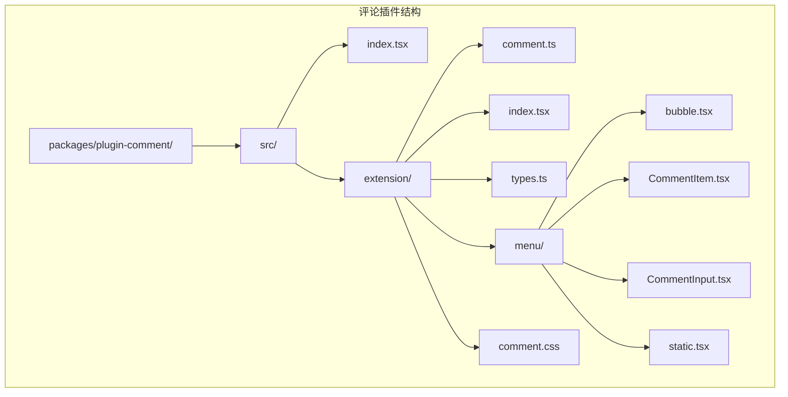
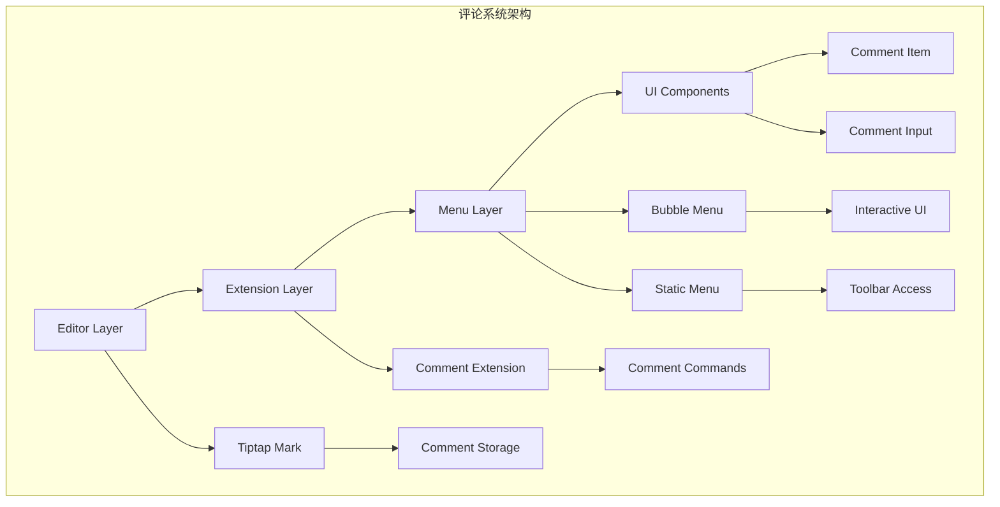
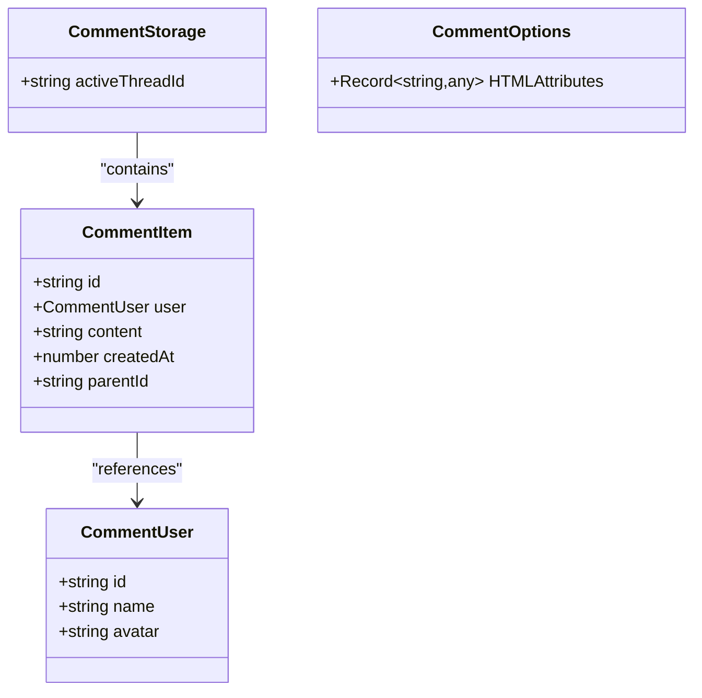
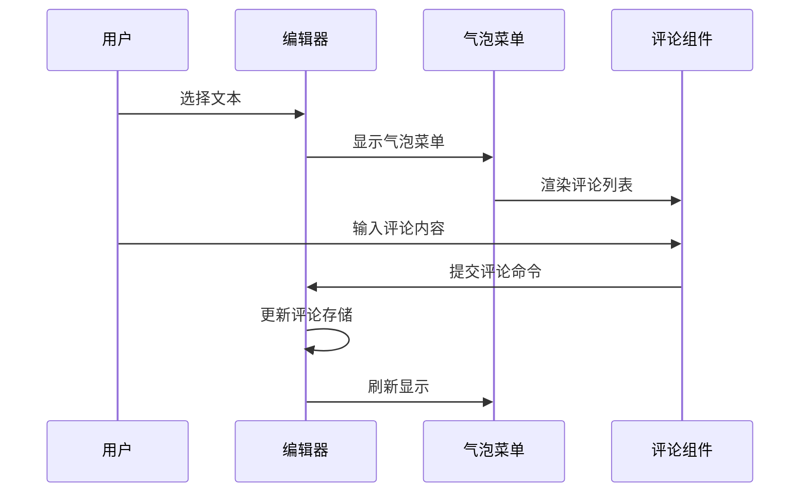
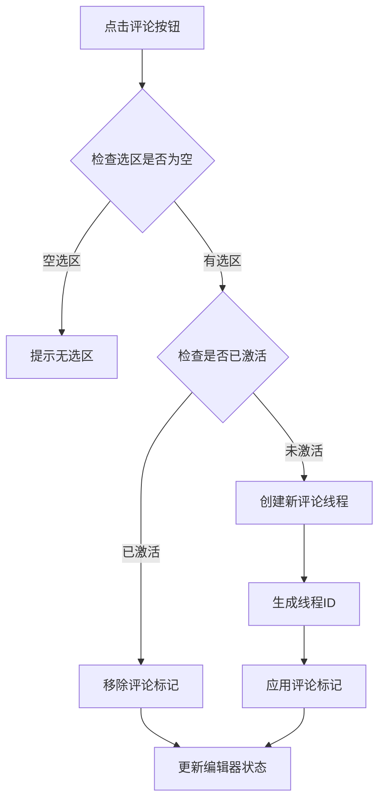

# 增强评论系统

<cite>
**本文档引用的文件**
- [README.md](file://README.md)
- [package.json](file://packages/plugin-comment/package.json)
- [index.tsx](file://packages/plugin-comment/src/index.tsx)
- [extension/index.tsx](file://packages/plugin-comment/src/extension/index.tsx)
- [types.ts](file://packages/plugin-comment/src/extension/types.ts)
- [comment.ts](file://packages/plugin-comment/src/extension/comment.ts)
- [bubble.tsx](file://packages/plugin-comment/src/extension/menu/bubble.tsx)
- [CommentItem.tsx](file://packages/plugin-comment/src/extension/menu/CommentItem.tsx)
- [CommentInput.tsx](file://packages/plugin-comment/src/extension/menu/CommentInput.tsx)
- [static.tsx](file://packages/plugin-comment/src/extension/menu/static.tsx)
- [comment.css](file://packages/plugin-comment/src/extension/comment.css)
</cite>

## 目录
1. [简介](#简介)
2. [项目结构](#项目结构)
3. [核心组件](#核心组件)
4. [架构概览](#架构概览)
5. [详细组件分析](#详细组件分析)
6. [依赖关系分析](#依赖关系分析)
7. [性能考虑](#性能考虑)
8. [故障排除指南](#故障排除指南)
9. [结论](#结论)

## 管理系统

本项目是一个强大的协作知识管理平台，具有富文本编辑、实时协作、AI集成和丰富的插件生态系统。评论系统作为其中的一个重要功能模块，为用户提供了在文档中添加、管理和回复评论的能力。

## 项目结构

评论系统位于 `packages/plugin-comment` 目录下，采用标准的插件架构设计：



**图表来源**
- [package.json](file://packages/plugin-comment/package.json#L1-L31)
- [index.tsx](file://packages/plugin-comment/src/index.tsx#L1-L13)

**章节来源**
- [README.md](file://README.md#L66-L97)
- [package.json](file://packages/plugin-comment/package.json#L1-L31)

## 核心组件

评论系统由以下核心组件构成：

### 主要数据结构

评论系统定义了三个核心接口：
- **CommentUser**: 用户信息接口，包含用户ID、名称和头像
- **CommentItem**: 评论项接口，包含评论ID、用户、内容、创建时间和父评论ID
- **CommentOptions**: 评论配置选项，包含HTML属性设置

### 扩展架构

评论系统通过Tiptap扩展机制实现，主要包含：
- **CommentExtension**: 主扩展类，整合所有评论功能
- **CommentBubbleView**: 气泡菜单组件，提供实时评论交互
- **CommentStaticMenu**: 静态菜单组件，支持工具栏操作
- **CommentItem**: 单个评论项渲染组件
- **CommentInput**: 评论输入组件

**章节来源**
- [types.ts](file://packages/plugin-comment/src/extension/types.ts#L1-L34)
- [extension/index.tsx](file://packages/plugin-comment/src/extension/index.tsx#L1-L12)

## 架构概览

评论系统采用分层架构设计，实现了从底层编辑器扩展到上层UI组件的完整功能链：



**图表来源**
- [comment.ts](file://packages/plugin-comment/src/extension/comment.ts#L81-L340)
- [bubble.tsx](file://packages/plugin-comment/src/extension/menu/bubble.tsx#L11-L161)

## 详细组件分析

### 评论扩展核心

评论扩展是整个系统的核心，基于Tiptap的Mark扩展实现：

#### 数据存储结构



**图表来源**
- [types.ts](file://packages/plugin-comment/src/extension/types.ts#L1-L34)

#### 命令系统

评论扩展提供了完整的命令系统，包括：
- `addComment`: 添加新评论
- `setFirstComment`: 设置第一个评论
- `replyComment`: 回复评论
- `deleteComment`: 删除评论
- `resolveThread`: 解决评论线程

**章节来源**
- [comment.ts](file://packages/plugin-comment/src/extension/comment.ts#L114-L227)

### 气泡菜单组件

气泡菜单提供了最直观的评论交互体验：



**图表来源**
- [bubble.tsx](file://packages/plugin-comment/src/extension/menu/bubble.tsx#L56-L87)

#### 交互逻辑

气泡菜单根据编辑器状态动态调整显示：
- 在可编辑模式下显示完整的评论界面
- 在只读模式下仅显示现有评论
- 支持新线程和回复评论的不同处理

**章节来源**
- [bubble.tsx](file://packages/plugin-comment/src/extension/menu/bubble.tsx#L16-L82)

### 评论项组件

单个评论项组件负责渲染具体的评论内容：

#### 时间格式化逻辑

```mermaid
flowchart TD
A[获取当前时间] --> B[计算时间差]
B --> C{时间差计算}
C --> |小于1分钟| D[显示 "just now"]
C --> |小于60分钟| E[显示 X分钟前]
C --> |小于24小时| F[显示 X小时前]
C --> |小于30天| G[显示 X天前]
C --> |大于等于30天| H[显示日期格式]
D --> I[返回结果]
E --> I
F --> I
G --> I
H --> I
```

**图表来源**
- [CommentItem.tsx](file://packages/plugin-comment/src/extension/menu/CommentItem.tsx#L26-L43)

#### 用户头像生成

系统使用用户名的ASCII码值生成一致的颜色方案：
- 支持6种不同的颜色主题
- 基于用户名首字母生成颜色索引
- 提供深色和浅色模式支持

**章节来源**
- [CommentItem.tsx](file://packages/plugin-comment/src/extension/menu/CommentItem.tsx#L64-L74)

### 静态菜单组件

静态菜单提供工具栏形式的评论入口：

#### 菜单切换逻辑



**图表来源**
- [static.tsx](file://packages/plugin-comment/src/extension/menu/static.tsx#L12-L28)

**章节来源**
- [static.tsx](file://packages/plugin-comment/src/extension/menu/static.tsx#L1-L50)

## 依赖关系分析

评论系统采用模块化设计，各组件间依赖关系清晰：

```mermaid
graph LR
subgraph "外部依赖"
A[@kn/editor] --> D[扩展基础]
B[@kn/ui] --> E[UI组件库]
C[@kn/icon] --> F[图标库]
G[@tiptap/core] --> H[Tiptap核心]
I[uuid] --> J[唯一标识符]
end
subgraph "内部依赖"
K[@kn/common] --> L[通用工具]
M[@kn/core] --> N[状态管理]
end
subgraph "评论系统"
O[comment.ts] --> A
O --> K
O --> M
P[bubble.tsx] --> O
P --> B
P --> C
Q[CommentItem.tsx] --> B
Q --> C
R[CommentInput.tsx] --> B
R --> C
end
```

**图表来源**
- [package.json](file://packages/plugin-comment/package.json#L15-L26)

**章节来源**
- [package.json](file://packages/plugin-comment/package.json#L1-L31)

## 性能考虑

### 内存优化

- 使用UUID生成器确保评论ID的唯一性
- 采用JSON序列化存储评论数据，便于持久化
- 实现智能的DOM事件处理，避免不必要的重渲染

### 渲染优化

- 气泡菜单采用条件渲染，仅在需要时显示
- 评论列表使用虚拟滚动，支持大量评论的高效渲染
- 头像颜色计算使用缓存策略，减少重复计算

### 交互优化

- 实现防抖机制，避免频繁的状态更新
- 使用useMemo优化复杂的时间格式化计算
- 支持键盘快捷键，提升用户体验

## 故障排除指南

### 常见问题及解决方案

#### 评论无法显示

1. **检查编辑器状态**: 确保编辑器处于正确的可编辑状态
2. **验证用户信息**: 检查用户状态是否正确加载
3. **确认权限设置**: 验证用户是否有评论权限

#### 气泡菜单不响应

1. **检查选区状态**: 确保文本选区有效且非空
2. **验证扩展注册**: 确认评论扩展已正确注册到编辑器
3. **检查CSS样式**: 验证评论高亮样式是否正确应用

#### 评论提交失败

1. **验证输入内容**: 确保评论内容非空且符合长度限制
2. **检查网络连接**: 验证服务器连接状态
3. **查看控制台错误**: 检查JavaScript错误日志

**章节来源**
- [comment.ts](file://packages/plugin-comment/src/extension/comment.ts#L13-L24)
- [bubble.tsx](file://packages/plugin-comment/src/extension/menu/bubble.tsx#L16-L31)

## 结论

评论系统作为知识管理平台的重要组成部分，通过精心设计的架构实现了以下目标：

### 技术优势

- **模块化设计**: 清晰的组件分离和依赖管理
- **扩展性强**: 基于Tiptap扩展机制，易于功能扩展
- **用户体验**: 直观的气泡菜单和工具栏操作
- **性能优化**: 智能的渲染和内存管理策略

### 功能特性

- 支持多级评论回复
- 实时协作编辑中的评论同步
- 灵活的权限控制机制
- 完整的评论生命周期管理

该评论系统为知识管理平台提供了强大的协作能力，用户可以在文档中进行高效的讨论和知识分享。