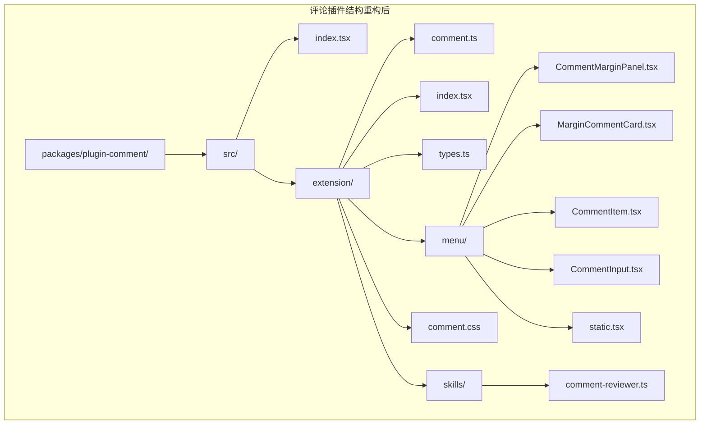
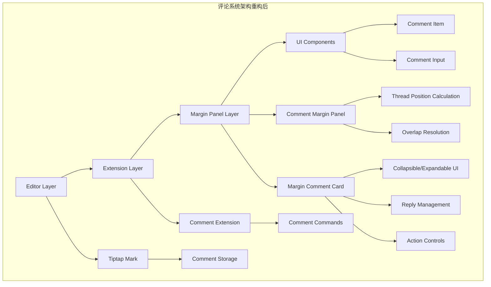
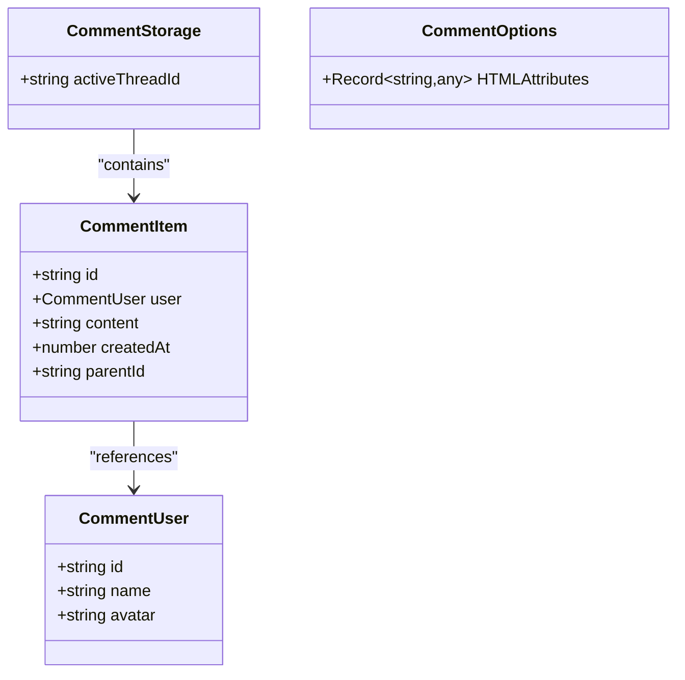
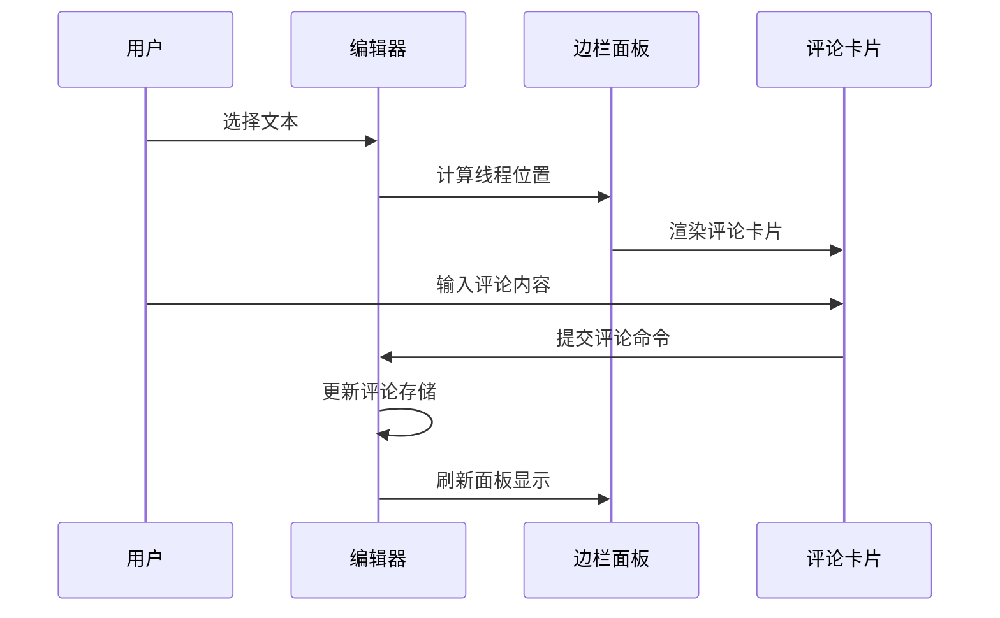
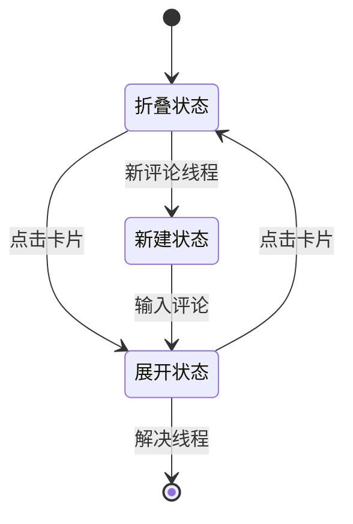
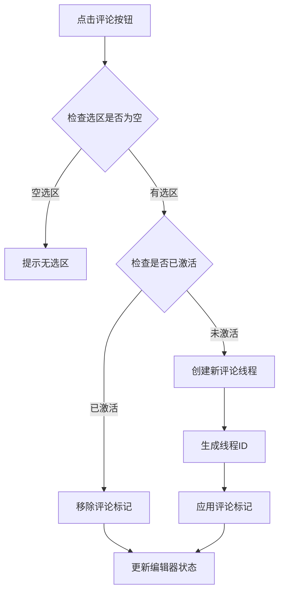
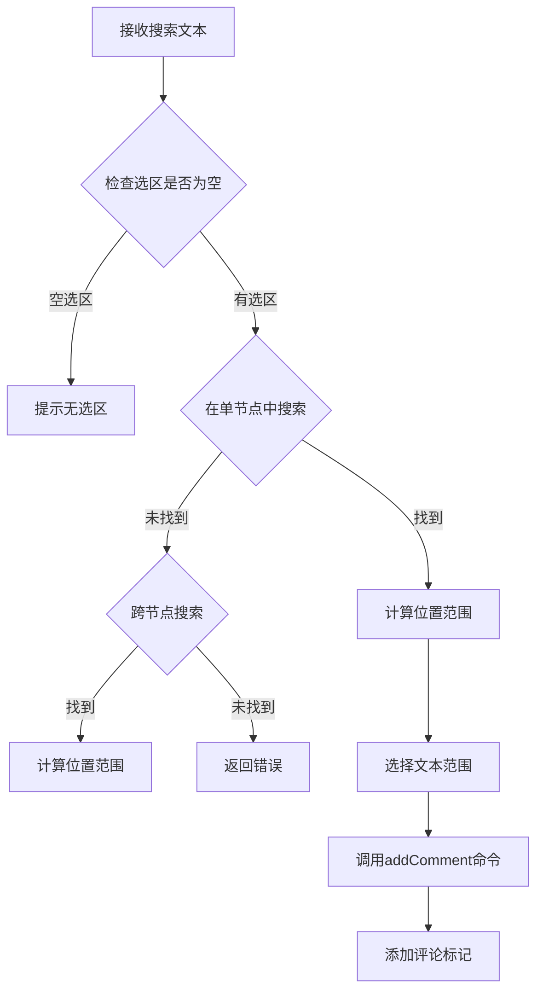
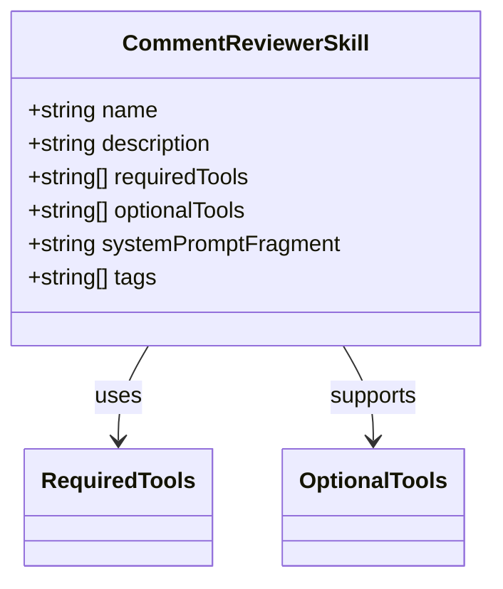

# 增强评论系统

<cite>
**本文档引用的文件**
- [README.md](file://README.md)
- [package.json](file://packages/plugin-comment/package.json)
- [index.tsx](file://packages/plugin-comment/src/index.tsx)
- [extension/index.tsx](file://packages/plugin-comment/src/extension/index.tsx)
- [types.ts](file://packages/plugin-comment/src/extension/types.ts)
- [comment.ts](file://packages/plugin-comment/src/extension/comment.ts)
- [CommentMarginPanel.tsx](file://packages/plugin-comment/src/extension/menu/CommentMarginPanel.tsx)
- [MarginCommentCard.tsx](file://packages/plugin-comment/src/extension/menu/MarginCommentCard.tsx)
- [CommentItem.tsx](file://packages/plugin-comment/src/extension/menu/CommentItem.tsx)
- [CommentInput.tsx](file://packages/plugin-comment/src/extension/menu/CommentInput.tsx)
- [static.tsx](file://packages/plugin-comment/src/extension/menu/static.tsx)
- [comment.css](file://packages/plugin-comment/src/extension/comment.css)
- [comment-reviewer.ts](file://packages/plugin-comment/src/extension/skills/comment-reviewer.ts)
</cite>

## 更新摘要
**变更内容**
- 重大架构重构：从气泡菜单系统迁移到margin面板系统
- 新增CommentMarginPanel和MarginCommentCard组件
- 增强addComment工具功能
- 新增comment-reviewer技能
- 移除了旧的bubble菜单系统组件

## 目录
1. [简介](#简介)
2. [项目结构](#项目结构)
3. [核心组件](#核心组件)
4. [架构概览](#架构概览)
5. [详细组件分析](#详细组件分析)
6. [依赖关系分析](#依赖关系分析)
7. [性能考虑](#性能考虑)
8. [故障排除指南](#故障排除指南)
9. [结论](#结论)

## 管理系统

本项目是一个强大的协作知识管理平台，具有富文本编辑、实时协作、AI集成和丰富的插件生态系统。评论系统作为其中的一个重要功能模块，为用户提供了在文档中添加、管理和回复评论的能力。

## 项目结构

评论系统位于 `packages/plugin-comment` 目录下，采用标准的插件架构设计，现已完全迁移到margin面板系统：



**图表来源**
- [package.json:1-29](file://packages/plugin-comment/package.json#L1-L29)
- [index.tsx:1-105](file://packages/plugin-comment/src/index.tsx#L1-L105)

**章节来源**
- [README.md:66-97](file://README.md#L66-L97)
- [package.json:1-29](file://packages/plugin-comment/package.json#L1-L29)

## 核心组件

评论系统由以下核心组件构成，现已完全采用margin面板架构：

### 主要数据结构

评论系统定义了三个核心接口：
- **CommentUser**: 用户信息接口，包含用户ID、名称和头像
- **CommentItem**: 评论项接口，包含评论ID、用户、内容、创建时间和父评论ID
- **CommentOptions**: 评论配置选项，包含HTML属性设置

### 扩展架构

评论系统通过Tiptap扩展机制实现，主要包含：
- **CommentExtension**: 主扩展类，整合所有评论功能
- **CommentMarginPanel**: 边栏面板组件，提供margin区域的评论展示
- **MarginCommentCard**: 边栏评论卡片组件，渲染具体的评论内容
- **CommentStaticMenu**: 静态菜单组件，支持工具栏操作
- **CommentItem**: 单个评论项渲染组件
- **CommentInput**: 评论输入组件

**章节来源**
- [types.ts:1-34](file://packages/plugin-comment/src/extension/types.ts#L1-L34)
- [extension/index.tsx:1-105](file://packages/plugin-comment/src/extension/index.tsx#L1-L105)

## 架构概览

评论系统采用分层架构设计，实现了从底层编辑器扩展到上层UI组件的完整功能链，现已完全迁移到margin面板系统：



**图表来源**
- [comment.ts:81-340](file://packages/plugin-comment/src/extension/comment.ts#L81-L340)
- [CommentMarginPanel.tsx:55-81](file://packages/plugin-comment/src/extension/menu/CommentMarginPanel.tsx#L55-L81)
- [MarginCommentCard.tsx:50-291](file://packages/plugin-comment/src/extension/menu/MarginCommentCard.tsx#L50-L291)

## 详细组件分析

### 评论扩展核心

评论扩展是整个系统的核心，基于Tiptap的Mark扩展实现：

#### 数据存储结构



**图表来源**
- [types.ts:1-34](file://packages/plugin-comment/src/extension/types.ts#L1-L34)

#### 命令系统

评论扩展提供了完整的命令系统，包括：
- `addComment`: 添加新评论
- `setFirstComment`: 设置第一个评论
- `replyComment`: 回复评论
- `deleteComment`: 删除评论
- `resolveThread`: 解决评论线程

**章节来源**
- [comment.ts:114-227](file://packages/plugin-comment/src/extension/comment.ts#L114-L227)

### 边栏面板组件

边栏面板提供了全新的评论交互体验，完全替代了原有的气泡菜单系统：



**图表来源**
- [CommentMarginPanel.tsx:83-134](file://packages/plugin-comment/src/extension/menu/CommentMarginPanel.tsx#L83-L134)
- [MarginCommentCard.tsx:50-139](file://packages/plugin-comment/src/extension/menu/MarginCommentCard.tsx#L50-L139)

#### 位置计算与重叠解决

边栏面板实现了智能的位置计算和重叠解决机制：
- **线程位置计算**: 基于编辑器坐标系统计算每个评论线程的垂直位置
- **重叠检测**: 自动检测多个评论线程的垂直重叠
- **自动调整**: 将重叠的线程向下推移，确保可见性

**章节来源**
- [CommentMarginPanel.tsx:55-81](file://packages/plugin-comment/src/extension/menu/CommentMarginPanel.tsx#L55-L81)

### 评论卡片组件

评论卡片组件负责渲染具体的评论内容，支持折叠和展开两种模式：

#### 卡片状态管理



**图表来源**
- [MarginCommentCard.tsx:50-182](file://packages/plugin-comment/src/extension/menu/MarginCommentCard.tsx#L50-L182)

#### 用户头像生成

系统使用用户名的ASCII码值生成一致的颜色方案：
- 支持6种不同的颜色主题
- 基于用户名首字母生成颜色索引
- 提供深色和浅色模式支持

**章节来源**
- [MarginCommentCard.tsx:30-33](file://packages/plugin-comment/src/extension/menu/MarginCommentCard.tsx#L30-L33)

### 静态菜单组件

静态菜单提供工具栏形式的评论入口：

#### 菜单切换逻辑



**图表来源**
- [static.tsx:12-28](file://packages/plugin-comment/src/extension/menu/static.tsx#L12-L28)

**章节来源**
- [static.tsx:1-49](file://packages/plugin-comment/src/extension/menu/static.tsx#L1-L49)

### 增强的addComment工具

新增的addComment工具提供了更强大的文本定位和评论功能：

#### 文本定位算法



**图表来源**
- [extension/index.tsx:22-98](file://packages/plugin-comment/src/extension/index.tsx#L22-L98)

**章节来源**
- [extension/index.tsx:14-105](file://packages/plugin-comment/src/extension/index.tsx#L14-L105)

### 新增comment-reviewer技能

新增的文档审阅技能提供了AI辅助的评论功能：

#### 技能配置



**图表来源**
- [comment-reviewer.ts:1-32](file://packages/plugin-comment/src/extension/skills/comment-reviewer.ts#L1-L32)

**章节来源**
- [comment-reviewer.ts:1-32](file://packages/plugin-comment/src/extension/skills/comment-reviewer.ts#L1-L32)

## 依赖关系分析

评论系统采用模块化设计，各组件间依赖关系清晰，现已完全适配margin面板架构：

```mermaid
graph LR
subgraph "外部依赖"
A[@kn/editor] --> D[扩展基础]
B[@kn/ui] --> E[UI组件库]
C[@kn/icon] --> F[图标库]
G[@tiptap/core] --> H[Tiptap核心]
I[uuid] --> J[唯一标识符]
end
subgraph "内部依赖"
K[@kn/common] --> L[通用工具]
M[@kn/core] --> N[状态管理]
end
subgraph "评论系统重构后"
O[comment.ts] --> A
O --> K
O --> M
P[CommentMarginPanel.tsx] --> O
P --> B
P --> C
Q[MarginCommentCard.tsx] --> B
Q --> C
R[CommentItem.tsx] --> B
R --> C
S[CommentInput.tsx] --> B
S --> C
T[comment-reviewer.ts] --> O
end
```

**图表来源**
- [package.json:15-21](file://packages/plugin-comment/package.json#L15-L21)

**章节来源**
- [package.json:1-29](file://packages/plugin-comment/package.json#L1-L29)

## 性能考虑

### 内存优化

- 使用UUID生成器确保评论ID的唯一性
- 采用JSON序列化存储评论数据，便于持久化
- 实现智能的DOM事件处理，避免不必要的重渲染

### 渲染优化

- 边栏面板采用条件渲染，仅在需要时显示
- 评论列表使用虚拟滚动，支持大量评论的高效渲染
- 头像颜色计算使用缓存策略，减少重复计算
- 卡片组件支持折叠模式，减少DOM节点数量

### 交互优化

- 实现防抖机制，避免频繁的状态更新
- 使用useMemo优化复杂的时间格式化计算
- 支持键盘快捷键，提升用户体验
- 自动位置计算和重叠解决，提升可用性

## 故障排除指南

### 常见问题及解决方案

#### 评论无法显示

1. **检查编辑器状态**: 确保编辑器处于正确的可编辑状态
2. **验证用户信息**: 检查用户状态是否正确加载
3. **确认权限设置**: 验证用户是否有评论权限
4. **检查边栏面板**: 确认CommentMarginPanel是否正确渲染

#### 边栏面板不响应

1. **检查选区状态**: 确保文本选区有效且非空
2. **验证扩展注册**: 确认评论扩展已正确注册到编辑器
3. **检查CSS样式**: 验证评论高亮样式是否正确应用
4. **确认面板位置**: 检查边栏面板的left和top位置计算

#### 评论提交失败

1. **验证输入内容**: 确保评论内容非空且符合长度限制
2. **检查网络连接**: 验证服务器连接状态
3. **查看控制台错误**: 检查JavaScript错误日志
4. **确认工具函数**: 验证addComment工具是否正确执行

**章节来源**
- [comment.ts:13-24](file://packages/plugin-comment/src/extension/comment.ts#L13-L24)
- [CommentMarginPanel.tsx:111-134](file://packages/plugin-comment/src/extension/menu/CommentMarginPanel.tsx#L111-L134)

## 结论

评论系统作为知识管理平台的重要组成部分，通过精心设计的架构重构实现了以下目标：

### 技术优势

- **模块化设计**: 清晰的组件分离和依赖管理
- **扩展性强**: 基于Tiptap扩展机制，易于功能扩展
- **用户体验**: 直观的边栏面板和工具栏操作
- **性能优化**: 智能的渲染和内存管理策略
- **AI集成**: 新增的comment-reviewer技能提供智能评论功能

### 功能特性

- 支持多级评论回复
- 实时协作编辑中的评论同步
- 灵活的权限控制机制
- 完整的评论生命周期管理
- 智能的文本定位和评论添加
- AI辅助的文档审阅功能

### 架构改进

- **从气泡菜单迁移到边栏面板**: 提供更好的空间利用和用户体验
- **智能位置计算**: 自动处理多个评论线程的重叠问题
- **支持折叠模式**: 减少界面拥挤，提升可读性
- **增强的交互设计**: 更直观的评论操作和管理

该评论系统为知识管理平台提供了强大的协作能力，用户可以在文档中进行高效的讨论和知识分享。新的margin面板架构不仅提升了用户体验，还为未来的功能扩展奠定了坚实的基础。