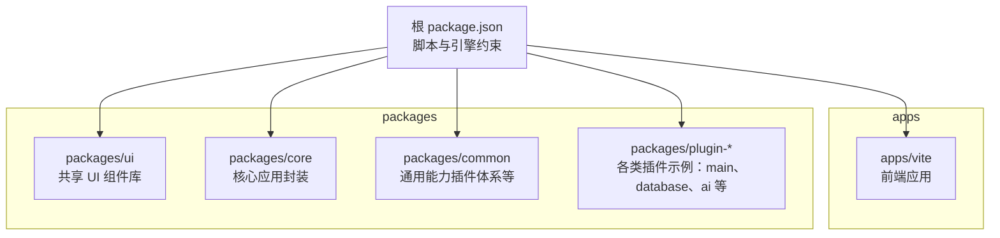
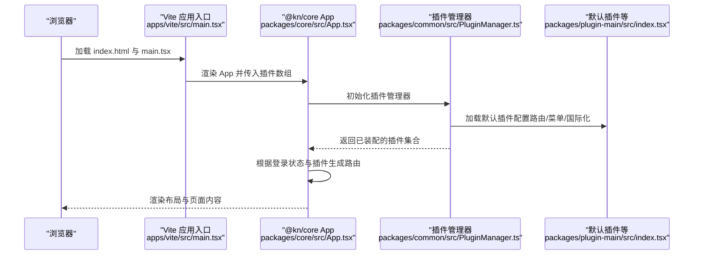
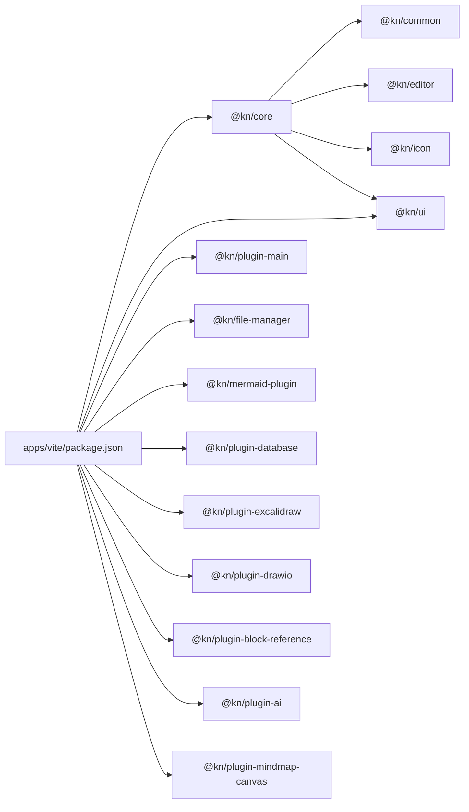

# 快速开始

<cite>
**本文引用的文件**
- [package.json](file://package.json)
- [pnpm-workspace.yaml](file://pnpm-workspace.yaml)
- [turbo.json](file://turbo.json)
- [README.md](file://README.md)
- [apps/vite/package.json](file://apps/vite/package.json)
- [apps/vite/vite.config.ts](file://apps/vite/vite.config.ts)
- [apps/vite/src/main.tsx](file://apps/vite/src/main.tsx)
- [packages/core/src/App.tsx](file://packages/core/src/App.tsx)
- [packages/common/src/core/PluginManager.ts](file://packages/common/src/core/PluginManager.ts)
- [packages/plugin-main/src/index.tsx](file://packages/plugin-main/src/index.tsx)
- [packages/ui/tailwind.config.js](file://packages/ui/tailwind.config.js)
- [packages/ui/components.json](file://packages/ui/components.json)
</cite>

## 目录
1. [简介](#简介)
2. [项目结构](#项目结构)
3. [核心组件](#核心组件)
4. [架构总览](#架构总览)
5. [详细组件分析](#详细组件分析)
6. [依赖关系分析](#依赖关系分析)
7. [性能考虑](#性能考虑)
8. [故障排除指南](#故障排除指南)
9. [结论](#结论)
10. [附录](#附录)

## 简介
本指南面向首次接触知识库管理系统的新用户，目标是在最短时间内完成开发环境准备、依赖安装、构建与本地开发服务器启动，并快速体验核心功能（如登录、插件中心、空间与页面浏览/编辑）。文档同时解释项目目录结构与关键配置文件的作用，帮助你高效上手。

## 项目结构
该项目采用多包工作区（monorepo）组织方式，使用 pnpm 工作区与 Turbo 并行流水线加速构建。根目录提供统一脚本与引擎约束；应用位于 apps 下（例如 Vite 应用），共享组件与工具位于 packages 下（如 @kn/ui、@kn/core、@kn/common 等）。

图示来源
- [package.json](file://package.json#L1-L103)
- [pnpm-workspace.yaml](file://pnpm-workspace.yaml#L1-L4)

章节来源
- [package.json](file://package.json#L1-L103)
- [pnpm-workspace.yaml](file://pnpm-workspace.yaml#L1-L4)

## 核心组件
- 应用入口与插件装配
  - Vite 应用入口通过引入 @kn/core 的 App 并注入多个插件实例，形成可扩展的页面路由与编辑器扩展集合。
  - 参考路径：[apps/vite/src/main.tsx](file://apps/vite/src/main.tsx#L1-L21)
- 核心应用容器
  - @kn/core 的 App 负责根据登录状态与插件初始化结果动态生成路由、主题、国际化资源与全局布局。
  - 参考路径：[packages/core/src/App.tsx](file://packages/core/src/App.tsx#L1-L187)
- 插件管理器
  - @kn/common 的 PluginManager 提供插件加载、卸载、路由/菜单/编辑器扩展解析与服务合并能力。
  - 参考路径：[packages/common/src/core/PluginManager.ts](file://packages/common/src/core/PluginManager.ts#L1-L170)
- 默认插件（主应用）
  - packages/plugin-main 定义默认路由（首页、空间列表、空间详情、页面浏览/编辑、设置）与侧边菜单、国际化词条与服务。
  - 参考路径：[packages/plugin-main/src/index.tsx](file://packages/plugin-main/src/index.tsx#L1-L118)

章节来源
- [apps/vite/src/main.tsx](file://apps/vite/src/main.tsx#L1-L21)
- [packages/core/src/App.tsx](file://packages/core/src/App.tsx#L1-L187)
- [packages/common/src/core/PluginManager.ts](file://packages/common/src/core/PluginManager.ts#L1-L170)
- [packages/plugin-main/src/index.tsx](file://packages/plugin-main/src/index.tsx#L1-L118)

## 架构总览
下图展示了从浏览器访问到应用渲染、插件初始化与路由生成的关键流程。

图示来源
- [apps/vite/src/main.tsx](file://apps/vite/src/main.tsx#L1-L21)
- [packages/core/src/App.tsx](file://packages/core/src/App.tsx#L1-L187)
- [packages/common/src/core/PluginManager.ts](file://packages/common/src/core/PluginManager.ts#L1-L170)
- [packages/plugin-main/src/index.tsx](file://packages/plugin-main/src/index.tsx#L1-L118)

## 详细组件分析

### 开发环境准备与版本要求
- Node.js 版本要求
  - 根 package.json 中 engines 指定最低 Node 版本为 18；同时 Volta 字段固定 Node 版本为 22.2.0，建议按此版本安装以避免兼容性问题。
  - 参考路径：[package.json](file://package.json#L90-L101)
- pnpm 版本要求
  - README 明确要求 pnpm 9 或更高版本；根 package.json 的 packageManager 字段也声明了 pnpm@9.1.4。
  - 参考路径：[README.md](file://README.md#L15-L21)、[package.json](file://package.json#L90-L101)

章节来源
- [README.md](file://README.md#L15-L21)
- [package.json](file://package.json#L90-L101)

### 安装与启动步骤
- 步骤 1：克隆仓库
  - 使用 Git 克隆后进入项目目录。
  - 参考路径：[README.md](file://README.md#L22-L36)
- 步骤 2：安装依赖
  - 使用 pnpm 安装工作区依赖（自动处理多包依赖与链接）。
  - 参考路径：[README.md](file://README.md#L31-L36)、[pnpm-workspace.yaml](file://pnpm-workspace.yaml#L1-L4)
- 步骤 3：构建
  - 执行 pnpm build，Turbo 将并行构建所有包。
  - 参考路径：[package.json](file://package.json#L9-L18)、[turbo.json](file://turbo.json#L1-L27)
- 步骤 4：开发模式
  - 执行 pnpm dev 启动 Turbo 开发流水线，随后在浏览器访问应用。
  - 参考路径：[README.md](file://README.md#L43-L48)、[package.json](file://package.json#L27-L28)
- 步骤 5：添加 UI 组件（可选）
  - 使用 pnpm ui:add 在 @kn/ui 中新增组件。
  - 参考路径：[README.md](file://README.md#L49-L54)、[package.json](file://package.json#L31-L31)

章节来源
- [README.md](file://README.md#L15-L56)
- [pnpm-workspace.yaml](file://pnpm-workspace.yaml#L1-L4)
- [package.json](file://package.json#L9-L33)
- [turbo.json](file://turbo.json#L1-L27)

### 关键配置文件说明
- 根 package.json
  - 统一脚本（build、dev、lint、format 等）、依赖与引擎约束；包含 Volta 与 packageManager 字段用于锁定 Node 与 pnpm 版本。
  - 参考路径：[package.json](file://package.json#L1-L103)
- pnpm-workspace.yaml
  - 声明工作区范围为 apps/* 与 packages/*，使 pnpm 能正确识别多包结构。
  - 参考路径：[pnpm-workspace.yaml](file://pnpm-workspace.yaml#L1-L4)
- turbo.json
  - 配置构建依赖链与缓存策略；dev 任务持久化与不缓存以提升开发体验。
  - 参考路径：[turbo.json](file://turbo.json#L1-L27)
- apps/vite/vite.config.ts
  - Vite 配置包含 React 插件、TS 路径映射与代理规则（示例：/api 代理到 https://kotion.top:888/api）。
  - 参考路径：[apps/vite/vite.config.ts](file://apps/vite/vite.config.ts#L1-L21)
- packages/ui/tailwind.config.js 与 packages/ui/components.json
  - Tailwind 配置与 shadcn/ui 别名、样式变量与组件别名，确保 UI 组件库正确扫描与生成。
  - 参考路径：[packages/ui/tailwind.config.js](file://packages/ui/tailwind.config.js#L1-L145)、[packages/ui/components.json](file://packages/ui/components.json#L1-L22)

章节来源
- [package.json](file://package.json#L1-L103)
- [pnpm-workspace.yaml](file://pnpm-workspace.yaml#L1-L4)
- [turbo.json](file://turbo.json#L1-L27)
- [apps/vite/vite.config.ts](file://apps/vite/vite.config.ts#L1-L21)
- [packages/ui/tailwind.config.js](file://packages/ui/tailwind.config.js#L1-L145)
- [packages/ui/components.json](file://packages/ui/components.json#L1-L22)

### 基本使用示例
- 登录与路由
  - 若未登录，应用会重定向至登录页；登录后根据插件生成路由（如首页、空间列表、空间详情、页面浏览/编辑、插件商店等）。
  - 参考路径：[packages/core/src/App.tsx](file://packages/core/src/App.tsx#L81-L127)
- 插件装配
  - 在入口中将默认插件与其他插件（文件管理、Mermaid、数据库、Excalidraw、Drawio、块引用、AI、思维导图画布等）注入 App。
  - 参考路径：[apps/vite/src/main.tsx](file://apps/vite/src/main.tsx#L1-L21)
- 默认插件路由与菜单
  - 默认插件提供首页、空间与页面相关路由及侧边菜单项。
  - 参考路径：[packages/plugin-main/src/index.tsx](file://packages/plugin-main/src/index.tsx#L1-L118)

章节来源
- [packages/core/src/App.tsx](file://packages/core/src/App.tsx#L81-L127)
- [apps/vite/src/main.tsx](file://apps/vite/src/main.tsx#L1-L21)
- [packages/plugin-main/src/index.tsx](file://packages/plugin-main/src/index.tsx#L1-L118)

## 依赖关系分析
- 包依赖与工作区
  - apps/vite 依赖 @kn/ui、@kn/core 与多个 @kn/plugin-* 插件；这些包在 packages 下以 workspace:* 形式被链接。
  - 参考路径：[apps/vite/package.json](file://apps/vite/package.json#L1-L46)
- 插件装配流程
  - App 初始化时由 PluginManager 合并各插件的服务、路由、菜单与国际化资源，最终生成路由树。
  - 参考路径：[packages/common/src/core/PluginManager.ts](file://packages/common/src/core/PluginManager.ts#L118-L170)、[packages/core/src/App.tsx](file://packages/core/src/App.tsx#L145-L170)

图示来源
- [apps/vite/package.json](file://apps/vite/package.json#L1-L46)
- [packages/core/src/App.tsx](file://packages/core/src/App.tsx#L1-L187)

章节来源
- [apps/vite/package.json](file://apps/vite/package.json#L1-L46)
- [packages/common/src/core/PluginManager.ts](file://packages/common/src/core/PluginManager.ts#L1-L170)
- [packages/core/src/App.tsx](file://packages/core/src/App.tsx#L1-L187)

## 性能考虑
- 构建与开发
  - 使用 Turbo 并行构建所有包，减少等待时间；开发模式下 dev 任务不缓存以获得最新变更。
  - 参考路径：[turbo.json](file://turbo.json#L1-L27)、[package.json](file://package.json#L9-L18)
- Vite 与内存
  - Vite 开发脚本设置了较大的堆内存参数，有助于大型项目热更新稳定性。
  - 参考路径：[apps/vite/package.json](file://apps/vite/package.json#L1-L20)
- UI 构建
  - @kn/ui 使用 Rollup 构建，Tailwind 仅扫描 src 与 node_modules/@kn 目录，避免无关文件扫描开销。
  - 参考路径：[packages/ui/tailwind.config.js](file://packages/ui/tailwind.config.js#L1-L20)

章节来源
- [turbo.json](file://turbo.json#L1-L27)
- [package.json](file://package.json#L9-L18)
- [apps/vite/package.json](file://apps/vite/package.json#L1-L20)
- [packages/ui/tailwind.config.js](file://packages/ui/tailwind.config.js#L1-L20)

## 故障排除指南
- Node 与 pnpm 版本不匹配
  - 症状：安装或构建时报错，提示 Node 版本过低或 pnpm 版本不兼容。
  - 解决：按 README 与根 package.json 的要求安装 Node 18+ 与 pnpm 9+；若使用 Volta，请确保 Node 版本为 22.2.0。
  - 参考路径：[README.md](file://README.md#L15-L21)、[package.json](file://package.json#L90-L101)
- 代理请求失败（开发时）
  - 症状：访问 /api 接口返回跨域或证书错误。
  - 解决：检查 apps/vite/vite.config.ts 中的代理配置是否指向正确的后端地址与端口；如需自定义，请修改 target、changeOrigin 与 secure 参数。
  - 参考路径：[apps/vite/vite.config.ts](file://apps/vite/vite.config.ts#L1-L21)
- 依赖安装卡住或失败
  - 症状：pnpm install 长时间无响应或报错。
  - 解决：确认网络可达 pnpm registry；清理缓存后重试；确保 pnpm 与 Node 版本满足要求。
  - 参考路径：[README.md](file://README.md#L31-L36)、[package.json](file://package.json#L90-L101)
- 构建产物缺失或缓存导致异常
  - 症状：构建后页面空白或路由异常。
  - 解决：执行 pnpm clean:packages 清理 dist 目录，重新构建；必要时禁用缓存后重试。
  - 参考路径：[package.json](file://package.json#L25-L27)、[turbo.json](file://turbo.json#L1-L27)

章节来源
- [README.md](file://README.md#L15-L36)
- [package.json](file://package.json#L25-L27)
- [apps/vite/vite.config.ts](file://apps/vite/vite.config.ts#L1-L21)
- [turbo.json](file://turbo.json#L1-L27)

## 结论
通过遵循本指南，你可以快速完成环境准备、安装依赖、构建与启动开发服务器，并体验核心功能。建议在开发过程中关注代理配置、Node/pnpm 版本与 Turbo 构建策略，以获得稳定高效的开发体验。

## 附录

### 目录结构速览
- apps
  - vite：基于 Vite 的前端应用入口与配置
  - landing-page / landing-page-vite：其他前端应用（可选）
- packages
  - ui：共享 UI 组件库（基于 shadcn/ui）
  - core：应用容器与通用逻辑
  - common：插件体系、事件系统、类型定义等
  - plugin-*：各类功能插件（示例：main、database、ai、mindmap-canvas 等）

章节来源
- [pnpm-workspace.yaml](file://pnpm-workspace.yaml#L1-L4)