# Bilibili视频集成插件

<cite>
**本文档引用的文件**
- [packages/plugin-bilibili/src/index.tsx](file://packages/plugin-bilibili/src/index.tsx)
- [packages/plugin-bilibili/src/extension/index.tsx](file://packages/plugin-bilibili/src/extension/index.tsx)
- [packages/plugin-bilibili/src/extension/BilibiliNodeView.tsx](file://packages/plugin-bilibili/src/extension/BilibiliNodeView.tsx)
- [packages/plugin-bilibili/src/extension/tools.ts](file://packages/plugin-bilibili/src/extension/tools.ts)
- [packages/plugin-bilibili/src/extension/skills/bilibili-skill.ts](file://packages/plugin-bilibili/src/extension/skills/bilibili-skill.ts)
- [packages/plugin-bilibili/package.json](file://packages/plugin-bilibili/package.json)
- [packages/plugin-bilibili/tsconfig.json](file://packages/plugin-bilibili/tsconfig.json)
- [packages/common/src/core/PluginManager.ts](file://packages/common/src/core/PluginManager.ts)
- [packages/common/src/core/types.ts](file://packages/common/src/core/types.ts)
- [packages/common/src/utils/import-util.ts](file://packages/common/src/utils/import-util.ts)
- [packages/editor/src/index.ts](file://packages/editor/src/index.ts)
- [packages/editor/src/editor/use-extension.ts](file://packages/editor/src/editor/use-extension.ts)
- [packages/editor/src/editor/EditorMenu.tsx](file://packages/editor/src/editor/EditorMenu.tsx)
- [apps/vite/src/main.tsx](file://apps/vite/src/main.tsx)
- [packages/core/src/App.tsx](file://packages/core/src/App.tsx)
- [packages/core/src/Layout.tsx](file://packages/core/src/Layout.tsx)
- [packages/core/src/components/Shop/Marketplace/index.tsx](file://packages/core/src/components/Shop/Marketplace/index.tsx)
- [packages/core/src/components/Shop/index.tsx](file://packages/core/src/components/Shop/index.tsx)
- [apps/desktop/src/main/db/index.ts](file://apps/desktop/src/main/db/index.ts)
</cite>

## 更新摘要
**所做更改**
- 新增"AI技能集成"章节，介绍新增的Bilibili视频技能功能
- 更新"核心组件"章节，添加技能定义和AI工具集成说明
- 更新"详细组件分析"章节，包含技能系统的完整分析
- 新增"技能系统架构"图表，展示AI技能与插件的集成关系
- 更新"安装和使用"章节，添加技能相关的使用说明
- 新增"技能配置选项"，介绍技能的工具依赖和标签系统

## 目录
1. [简介](#简介)
2. [当前状态](#当前状态)
3. [项目结构](#项目结构)
4. [核心组件](#核心组件)
5. [架构概览](#架构概览)
6. [详细组件分析](#详细组件分析)
7. [AI技能集成](#ai技能集成)
8. [安装和使用](#安装和使用)
9. [依赖关系分析](#依赖关系分析)
10. [性能考虑](#性能考虑)
11. [故障排除指南](#故障排除指南)
12. [结论](#结论)

## 简介

Bilibili视频集成插件是一个基于Tiptap编辑器的富文本插件，允许用户在知识库文档中嵌入和管理Bilibili视频内容。该插件提供了直观的用户界面，支持通过BV号或完整的Bilibili视频URL进行视频嵌入，并集成了AI代理交互功能。

**重要更新**：该插件现已从应用的默认插件列表中移除，需要用户通过插件商店手动安装后才能使用。同时，插件现在集成了AI技能系统，支持通过自然语言指令进行视频管理。

该插件采用模块化设计，包含四个主要部分：
- **节点视图组件**：负责视频嵌入的可视化展示和用户交互
- **编辑器扩展**：定义视频节点的结构和行为
- **AI工具集**：提供与AI代理的交互接口，支持自动化视频管理
- **AI技能系统**：定义智能技能，使AI代理能够理解并执行B站视频相关任务

## 当前状态

### 插件状态变更

**重要通知**：Bilibili插件已从应用的默认安装列表中移除，目前处于"可选安装"状态。

#### 变更详情
- **默认安装**：插件不再作为应用的内置功能自动安装
- **手动安装**：用户需要通过插件商店主动安装才能使用
- **插件管理**：通过统一的插件管理系统进行安装、更新和卸载
- **权限控制**：只有已安装的插件才会在编辑器中显示相应功能
- **AI技能**：插件现在包含完整的AI技能系统，支持智能视频管理

#### 影响范围
- 应用启动时不会自动加载Bilibili插件
- 编辑器菜单中不再直接显示Bilibili相关选项
- 需要通过插件商店或设置面板进行安装
- 已安装的用户不受影响，仍可正常使用
- AI代理现在可以通过技能系统与插件交互

### 默认插件配置

根据数据库初始化代码，Bilibili插件已不再包含在默认插件列表中：

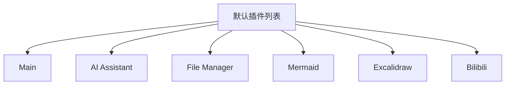

**图表来源**
- [apps/desktop/src/main/db/index.ts:283-289](file://apps/desktop/src/main/db/index.ts#L283-L289)

**章节来源**
- [apps/desktop/src/main/db/index.ts:283-289](file://apps/desktop/src/main/db/index.ts#L283-L289)

### 插件商店集成

插件现在通过统一的插件商店进行分发和管理：

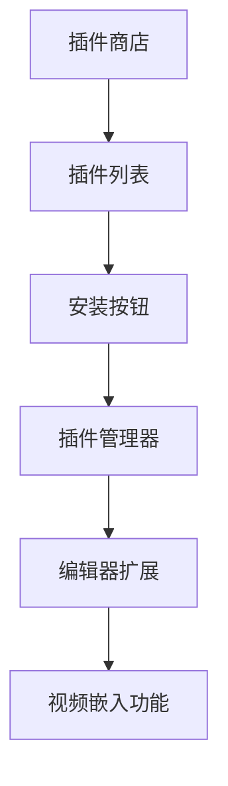

**图表来源**
- [packages/core/src/components/Shop/Marketplace/index.tsx:62-74](file://packages/core/src/components/Shop/Marketplace/index.tsx#L62-L74)
- [packages/core/src/components/Shop/index.tsx:116-131](file://packages/core/src/components/Shop/index.tsx#L116-L131)

## 项目结构

Bilibili插件位于`packages/plugin-bilibili/`目录下，采用标准的包结构：

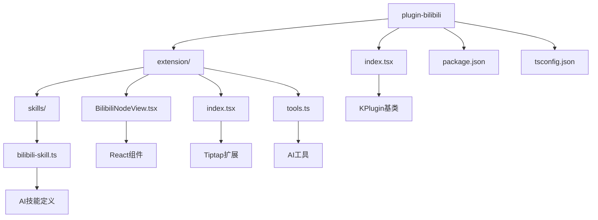

**图表来源**
- [packages/plugin-bilibili/src/index.tsx:1-35](file://packages/plugin-bilibili/src/index.tsx#L1-L35)
- [packages/plugin-bilibili/src/extension/index.tsx:1-87](file://packages/plugin-bilibili/src/extension/index.tsx#L1-L87)

**章节来源**
- [packages/plugin-bilibili/src/index.tsx:1-35](file://packages/plugin-bilibili/src/index.tsx#L1-L35)
- [packages/plugin-bilibili/package.json:1-38](file://packages/plugin-bilibili/package.json#L1-L38)

## 核心组件

### 插件主类 (BilibiliPlugin)

插件的核心是继承自`KPlugin`基类的`BilibiliPlugin`类，它定义了插件的基本配置和行为：

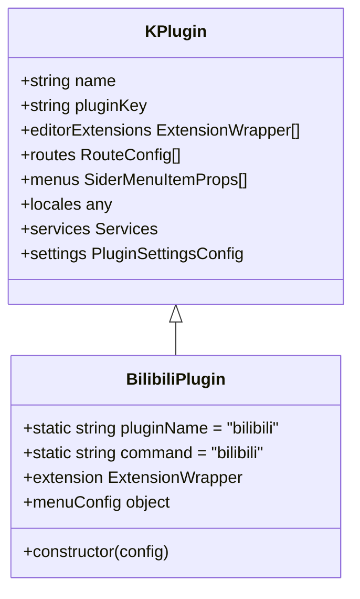

**图表来源**
- [packages/plugin-bilibili/src/index.tsx:6-26](file://packages/plugin-bilibili/src/index.tsx#L6-L26)
- [packages/common/src/core/PluginManager.ts:51-97](file://packages/common/src/core/PluginManager.ts#L51-L97)

### 编辑器扩展 (BilibiliExtension)

编辑器扩展定义了视频节点的结构和行为，包括属性定义、命令处理和节点视图渲染：

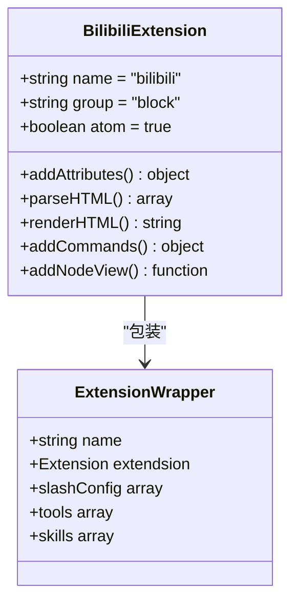

**图表来源**
- [packages/plugin-bilibili/src/extension/index.tsx:17-69](file://packages/plugin-bilibili/src/extension/index.tsx#L17-L69)
- [packages/plugin-bilibili/src/extension/index.tsx:72-87](file://packages/plugin-bilibili/src/extension/index.tsx#L72-L87)

**章节来源**
- [packages/plugin-bilibili/src/index.tsx:6-35](file://packages/plugin-bilibili/src/index.tsx#L6-L35)
- [packages/plugin-bilibili/src/extension/index.tsx:17-87](file://packages/plugin-bilibili/src/extension/index.tsx#L17-L87)

## 架构概览

插件采用分层架构设计，实现了清晰的关注点分离：

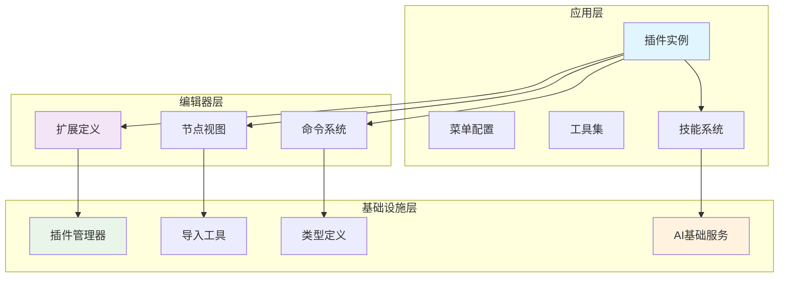

**图表来源**
- [packages/plugin-bilibili/src/index.tsx:29-35](file://packages/plugin-bilibili/src/index.tsx#L29-L35)
- [packages/common/src/core/PluginManager.ts:100-200](file://packages/common/src/core/PluginManager.ts#L100-L200)
- [packages/common/src/utils/import-util.ts:12-39](file://packages/common/src/utils/import-util.ts#L12-L39)

### 数据流架构

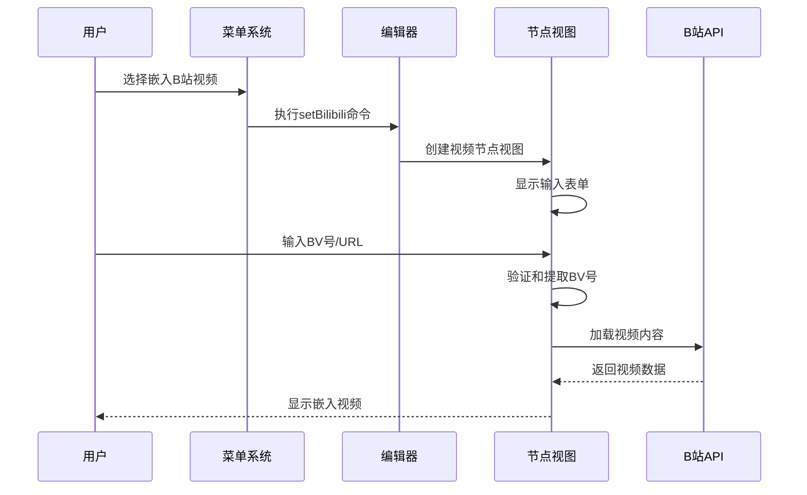

**图表来源**
- [packages/plugin-bilibili/src/extension/index.tsx:55-64](file://packages/plugin-bilibili/src/extension/index.tsx#L55-L64)
- [packages/plugin-bilibili/src/extension/BilibiliNodeView.tsx:54-82](file://packages/plugin-bilibili/src/extension/BilibiliNodeView.tsx#L54-L82)

## 详细组件分析

### 节点视图组件 (BilibiliNodeView)

节点视图组件是插件的核心UI组件，负责视频嵌入的可视化展示：

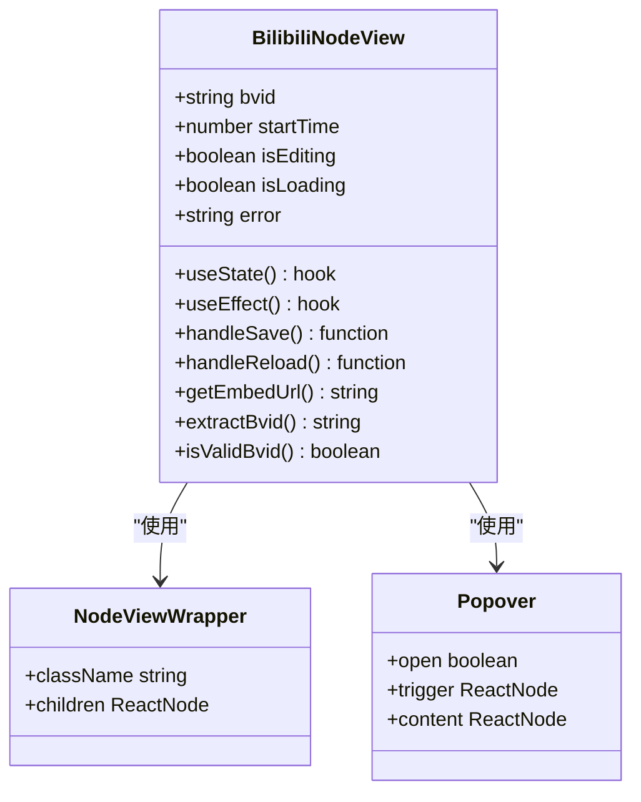

**图表来源**
- [packages/plugin-bilibili/src/extension/BilibiliNodeView.tsx:35-277](file://packages/plugin-bilibili/src/extension/BilibiliNodeView.tsx#L35-L277)

#### 视频验证和解析逻辑

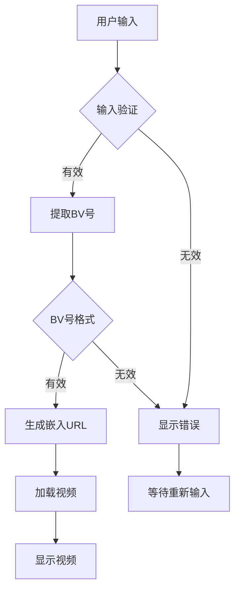

**图表来源**
- [packages/plugin-bilibili/src/extension/BilibiliNodeView.tsx:8-33](file://packages/plugin-bilibili/src/extension/BilibiliNodeView.tsx#L8-L33)

**章节来源**
- [packages/plugin-bilibili/src/extension/BilibiliNodeView.tsx:35-277](file://packages/plugin-bilibili/src/extension/BilibiliNodeView.tsx#L35-L277)

### AI工具集

插件提供了三个专门的AI工具，用于与AI代理交互：

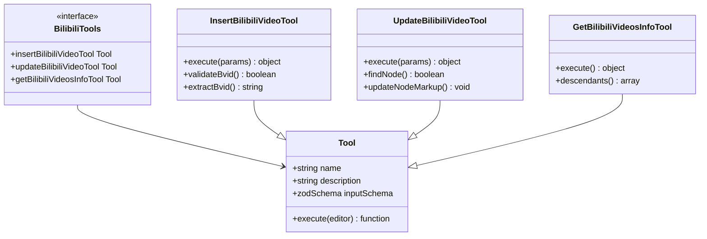

**图表来源**
- [packages/plugin-bilibili/src/extension/tools.ts:42-102](file://packages/plugin-bilibili/src/extension/tools.ts#L42-L102)
- [packages/plugin-bilibili/src/extension/tools.ts:107-158](file://packages/plugin-bilibili/src/extension/tools.ts#L107-L158)
- [packages/plugin-bilibili/src/extension/tools.ts:163-196](file://packages/plugin-bilibili/src/extension/tools.ts#L163-L196)

#### 工具执行流程

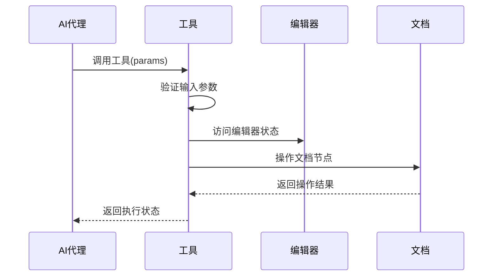

**图表来源**
- [packages/plugin-bilibili/src/extension/tools.ts:50-101](file://packages/plugin-bilibili/src/extension/tools.ts#L50-L101)

**章节来源**
- [packages/plugin-bilibili/src/extension/tools.ts:1-205](file://packages/plugin-bilibili/src/extension/tools.ts#L1-L205)

## AI技能集成

### 技能系统概述

插件现在集成了完整的AI技能系统，使AI代理能够理解和执行B站视频相关的任务。技能系统基于插件的工具集，为AI代理提供了自然语言接口。

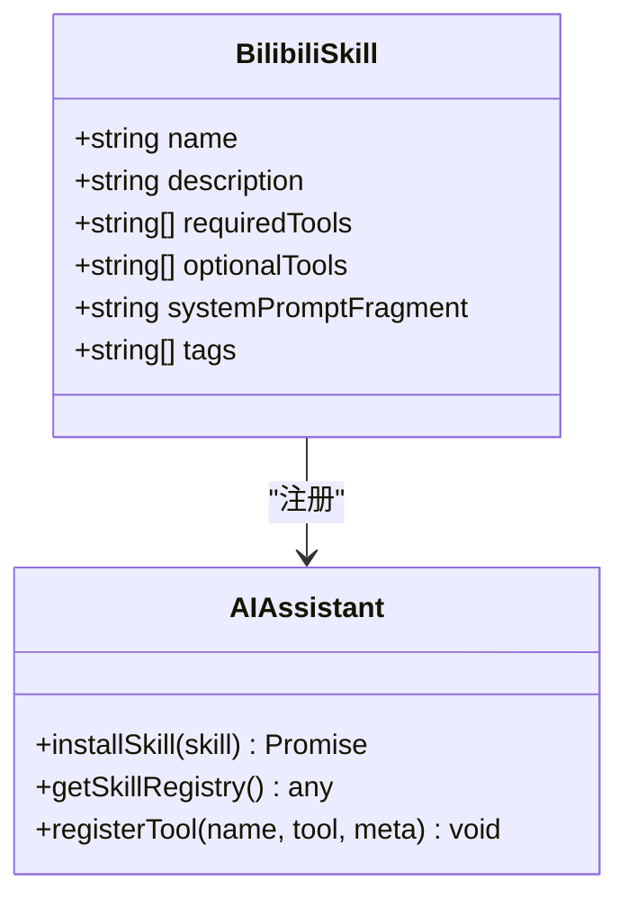

**图表来源**
- [packages/plugin-bilibili/src/extension/skills/bilibili-skill.ts:1-22](file://packages/plugin-bilibili/src/extension/skills/bilibili-skill.ts#L1-L22)

### 技能定义分析

Bilibili技能定义包含了完整的技能元数据和工具依赖：

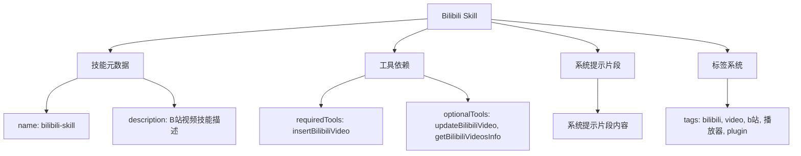

**图表来源**
- [packages/plugin-bilibili/src/extension/skills/bilibili-skill.ts:1-22](file://packages/plugin-bilibili/src/extension/skills/bilibili-skill.ts#L1-L22)

### 技能系统架构

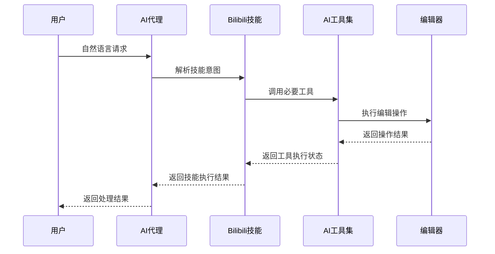

**图表来源**
- [packages/plugin-bilibili/src/extension/skills/bilibili-skill.ts:11-19](file://packages/plugin-bilibili/src/extension/skills/bilibili-skill.ts#L11-L19)

**章节来源**
- [packages/plugin-bilibili/src/extension/skills/bilibili-skill.ts:1-22](file://packages/plugin-bilibili/src/extension/skills/bilibili-skill.ts#L1-L22)

## 安装和使用

### 安装方式

由于Bilibili插件已从默认安装中移除，现在需要通过以下方式安装：

#### 方法一：通过插件商店安装
1. 登录到应用后台
2. 进入"插件商店"页面
3. 搜索"Bilibili视频集成插件"
4. 点击"安装"按钮
5. 等待安装完成并刷新页面

#### 方法二：通过设置面板安装
1. 打开应用设置
2. 导航到"插件管理"页面
3. 查找Bilibili插件
4. 点击"安装"按钮

### 使用步骤

1. **安装完成后**，重启编辑器或刷新页面
2. 在编辑器中输入"/bilibili"触发命令
3. 输入B站视频的BV号或完整URL
4. 点击确认按钮嵌入视频
5. 视频将显示在文档中，支持播放和编辑

### AI技能使用

AI代理现在可以通过技能系统与插件交互：

1. **技能安装**：AI代理会自动安装Bilibili技能
2. **自然语言交互**：用户可以直接对AI代理说"插入一个B站视频"
3. **工具调用**：AI代理会自动调用相应的工具执行操作
4. **上下文理解**：AI代理理解AV号、BV号和URL的不同格式

### 配置选项

插件支持以下配置选项：
- **BV号验证**：自动验证输入的BV号格式
- **起始时间**：可设置视频播放的起始时间
- **视频尺寸**：可调整嵌入视频的显示尺寸
- **自动加载**：可配置视频的加载策略
- **AI技能标签**：支持多语言标签系统

**章节来源**
- [packages/core/src/components/Shop/Marketplace/index.tsx:62-74](file://packages/core/src/components/Shop/Marketplace/index.tsx#L62-L74)
- [packages/core/src/components/Shop/index.tsx:116-131](file://packages/core/src/components/Shop/index.tsx#L116-L131)
- [packages/plugin-bilibili/src/extension/index.tsx:72-87](file://packages/plugin-bilibili/src/extension/index.tsx#L72-L87)

## 依赖关系分析

### 外部依赖

插件依赖于多个核心包和框架：

```mermaid
graph LR
subgraph "核心依赖"
A[@kn/common] --> B[KPlugin基类]
C[@kn/editor] --> D[Tiptap集成]
E[@kn/ui] --> F[UI组件]
G[@kn/icon] --> H[图标库]
I[@kn/core] --> J[核心服务]
end
subgraph "编辑器框架"
K[@tiptap/core] --> L[ProseMirror]
M[@tiptap/react] --> N[React集成]
end
subgraph "工具库"
O[zod] --> P[类型验证]
Q[lodash] --> R[工具函数]
end
A --> C
C --> E
C --> G
C --> I
D --> K
D --> M
```

**图表来源**
- [packages/plugin-bilibili/package.json:24-30](file://packages/plugin-bilibili/package.json#L24-L30)

### 内部依赖关系

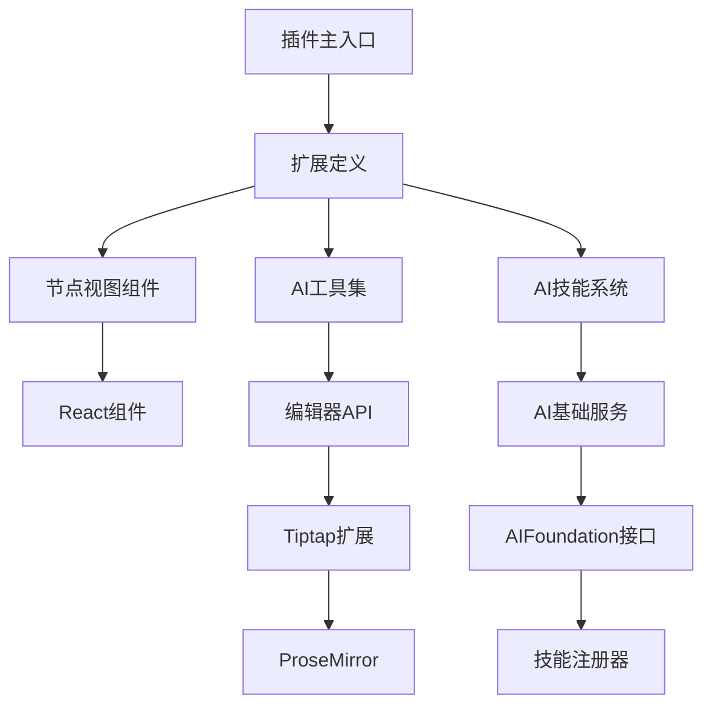

**图表来源**
- [packages/plugin-bilibili/src/index.tsx:1-3](file://packages/plugin-bilibili/src/index.tsx#L1-L3)
- [packages/plugin-bilibili/src/extension/index.tsx:1-7](file://packages/plugin-bilibili/src/extension/index.tsx#L1-L7)

**章节来源**
- [packages/plugin-bilibili/package.json:24-38](file://packages/plugin-bilibili/package.json#L24-L38)

## 性能考虑

### 加载优化策略

插件采用了多种性能优化措施：

1. **懒加载机制**：通过插件管理器的动态导入功能实现按需加载
2. **缓存策略**：使用脚本缓存避免重复加载
3. **条件渲染**：仅在需要时渲染复杂的UI组件
4. **异步处理**：视频加载采用异步方式，不影响编辑器响应性
5. **技能缓存**：AI技能注册后进行缓存，避免重复注册

### 内存管理

- **组件卸载**：正确清理事件监听器和定时器
- **状态管理**：使用React hooks进行高效的状态更新
- **资源释放**：及时释放iframe资源和DOM引用
- **工具清理**：AI工具在不需要时自动清理

## 故障排除指南

### 常见问题及解决方案

#### 插件未显示在菜单中

**症状**：在编辑器中输入"/bilibili"没有出现插件选项

**可能原因**：
- 插件尚未安装
- 插件安装失败
- 浏览器缓存问题

**解决步骤**：
1. 检查插件是否已安装（在插件管理页面查看）
2. 重新安装插件并刷新页面
3. 清除浏览器缓存后重试
4. 检查网络连接是否正常

#### 视频加载失败

**症状**：嵌入的视频无法正常显示，出现错误提示

**可能原因**：
- BV号格式不正确
- 网络连接问题
- B站API限制

**解决步骤**：
1. 验证BV号格式（必须为12位字符，以BV开头）
2. 检查网络连接状态
3. 尝试刷新页面重新加载
4. 检查B站视频是否可访问

#### AI工具执行失败

**症状**：AI代理调用工具时返回错误

**排查方法**：
1. 检查输入参数格式
2. 验证目标视频是否存在
3. 查看控制台错误日志
4. 确认插件版本兼容性

#### 技能系统问题

**症状**：AI代理无法识别B站视频技能

**解决步骤**：
1. 检查技能是否已正确安装
2. 验证工具依赖是否满足
3. 查看技能注册日志
4. 重新安装插件

#### 插件商店相关问题

**症状**：无法在插件商店中找到Bilibili插件

**解决步骤**：
1. 检查插件商店的网络连接
2. 刷新插件商店页面
3. 搜索插件名称进行查找
4. 联系技术支持获取帮助

**章节来源**
- [packages/plugin-bilibili/src/extension/BilibiliNodeView.tsx:79-82](file://packages/plugin-bilibili/src/extension/BilibiliNodeView.tsx#L79-L82)
- [packages/plugin-bilibili/src/extension/tools.ts:95-100](file://packages/plugin-bilibili/src/extension/tools.ts#L95-L100)
- [packages/core/src/components/Shop/Marketplace/index.tsx:35-50](file://packages/core/src/components/Shop/Marketplace/index.tsx#L35-L50)

## 结论

Bilibili视频集成插件经过重构后，现在采用更加灵活的插件管理模式，并集成了先进的AI技能系统：

**当前优势**：
- **模块化设计**：清晰的组件分离和职责划分
- **按需安装**：用户可根据需要选择安装插件
- **统一管理**：通过插件商店集中管理和更新
- **用户体验友好**：直观的嵌入流程和编辑界面
- **扩展性强**：支持AI代理集成和自定义工具开发
- **智能交互**：通过技能系统实现自然语言视频管理
- **性能优化**：采用多种优化策略确保流畅体验
- **多语言支持**：技能标签系统支持国际化

**应用场景**：
- 在知识库文档中嵌入教学视频
- 创建多媒体学习材料
- 集成AI驱动的内容管理
- 支持协作编辑环境
- 自然语言视频操作

**未来发展方向**：
- 继续完善插件商店功能
- 增强插件间的协同工作能力
- 优化插件安装和更新流程
- 提供更多插件开发模板和示例
- 扩展AI技能的自然语言理解能力

该插件为知识管理系统提供了强大的视频内容管理能力，虽然从默认安装中移除，但通过插件商店的集中管理，用户可以更加灵活地选择和使用所需功能。新增的AI技能系统进一步提升了插件的智能化水平，为用户提供了更加便捷的视频管理体验。