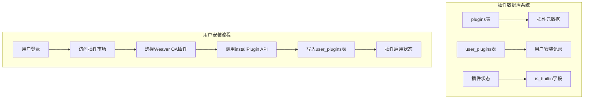
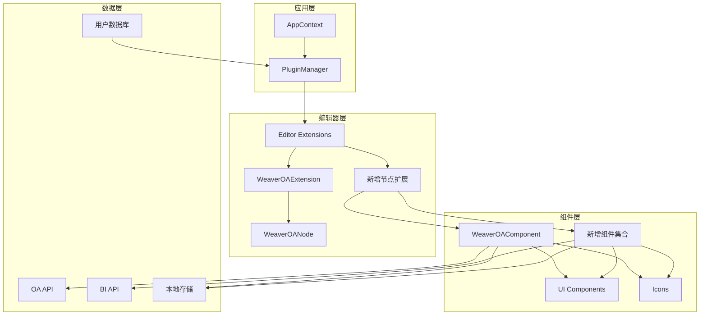
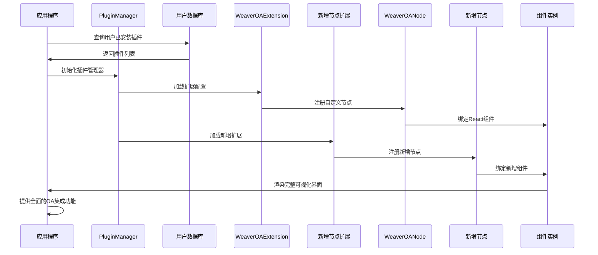
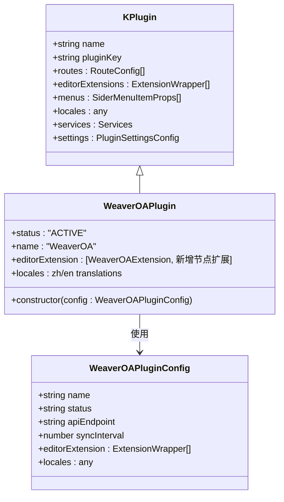
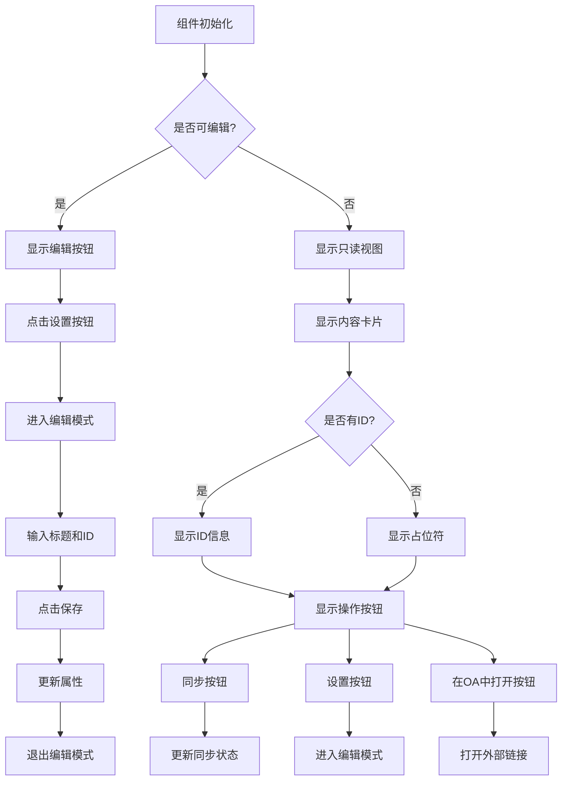
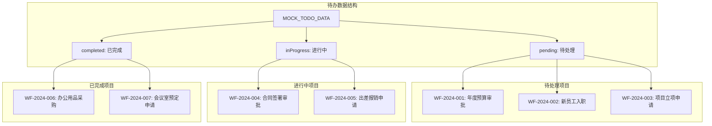
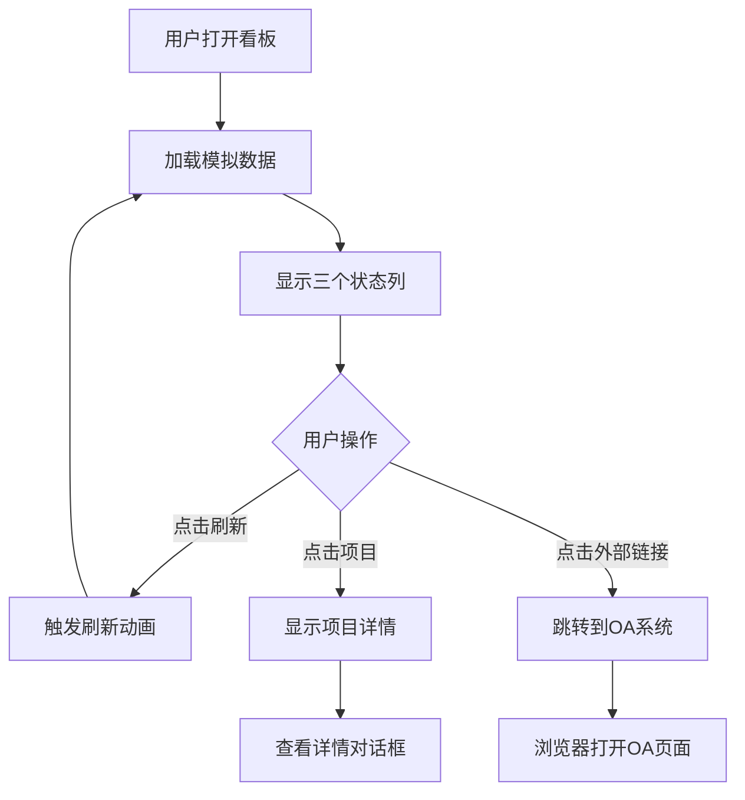
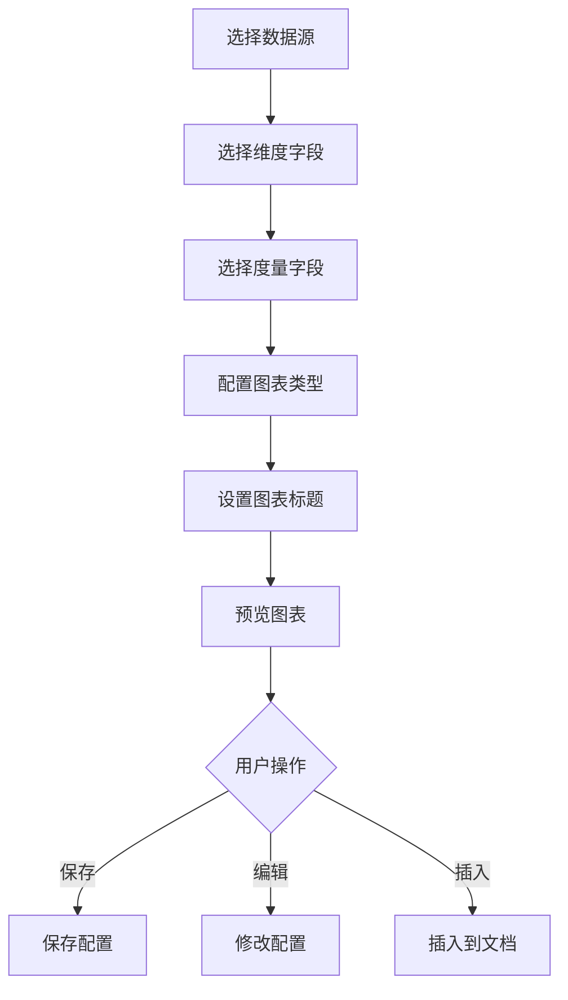
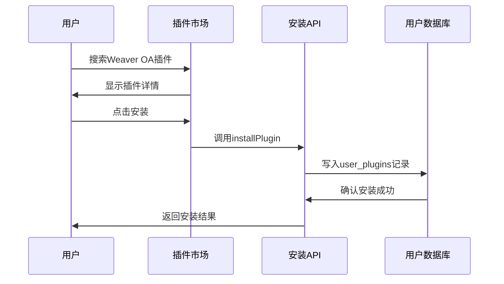
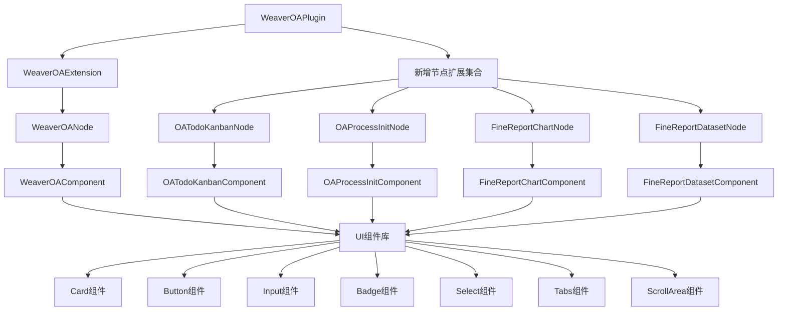

# Weaver OA企业集成插件

<cite>
**本文档引用的文件**
- [packages/plugin-weaver-oa/src/index.tsx](file://packages/plugin-weaver-oa/src/index.tsx)
- [packages/plugin-weaver-oa/src/components/WeaverOAComponent.tsx](file://packages/plugin-weaver-oa/src/components/WeaverOAComponent.tsx)
- [packages/plugin-weaver-oa/src/components/OATodoKanbanComponent.tsx](file://packages/plugin-weaver-oa/src/components/OATodoKanbanComponent.tsx)
- [packages/plugin-weaver-oa/src/components/OAProcessInitComponent.tsx](file://packages/plugin-weaver-oa/src/components/OAProcessInitComponent.tsx)
- [packages/plugin-weaver-oa/src/components/FineReportChartComponent.tsx](file://packages/plugin-weaver-oa/src/components/FineReportChartComponent.tsx)
- [packages/plugin-weaver-oa/src/components/FineReportDatasetComponent.tsx](file://packages/plugin-weaver-oa/src/components/FineReportDatasetComponent.tsx)
- [packages/plugin-weaver-oa/src/extension/weaver-oa-node.tsx](file://packages/plugin-weaver-oa/src/extension/weaver-oa-node.tsx)
- [packages/plugin-weaver-oa/src/extension/oa-todo-kanban-node.tsx](file://packages/plugin-weaver-oa/src/extension/oa-todo-kanban-node.tsx)
- [packages/plugin-weaver-oa/src/extension/oa-process-init-node.tsx](file://packages/plugin-weaver-oa/src/extension/oa-process-init-node.tsx)
- [packages/plugin-weaver-oa/src/extension/finereport-chart-node.tsx](file://packages/plugin-weaver-oa/src/extension/finereport-chart-node.tsx)
- [packages/plugin-weaver-oa/src/extension/finereport-dataset-node.tsx](file://packages/plugin-weaver-oa/src/extension/finereport-dataset-node.tsx)
- [packages/plugin-weaver-oa/src/extension/index.tsx](file://packages/plugin-weaver-oa/src/extension/index.tsx)
- [packages/plugin-weaver-oa/package.json](file://packages/plugin-weaver-oa/package.json)
- [packages/plugin-weaver-oa/README.md](file://packages/plugin-weaver-oa/README.md)
- [packages/common/src/core/PluginManager.ts](file://packages/common/src/core/PluginManager.ts)
- [packages/common/src/core/AppContext.ts](file://packages/common/src/core/AppContext.ts)
- [packages/editor/src/editor/use-extension.ts](file://packages/editor/src/editor/use-extension.ts)
- [packages/editor/src/editor/EditorMenu.tsx](file://packages/editor/src/editor/EditorMenu.tsx)
- [packages/ui/src/components/ui/card.tsx](file://packages/ui/src/components/ui/card.tsx)
- [packages/icon/src/icons/icon.tsx](file://packages/icon/src/icons/icon.tsx)
- [apps/desktop/src/main/db/index.ts](file://apps/desktop/src/main/db/index.ts)
- [apps/desktop/src/main/services/plugin.service.ts](file://apps/desktop/src/main/services/plugin.service.ts)
- [packages/core/src/components/Shop/Marketplace/index.tsx](file://packages/core/src/components/Shop/Marketplace/index.tsx)
</cite>

## 更新摘要
**所做更改**
- 更新插件状态：Weaver OA插件已从默认插件配置中移除
- 新增插件安装说明：通过插件市场手动安装
- 更新插件管理机制：基于用户数据库的插件安装/卸载系统
- 扩展了四个核心组件：OATodoKanbanComponent、OAProcessInitComponent、FineReportChartComponent、FineReportDatasetComponent
- 新增对应的节点类型扩展：OATodoKanbanNode、OAProcessInitNode、FineReportChartNode、FineReportDatasetNode

## 目录
1. [简介](#简介)
2. [插件状态变更](#插件状态变更)
3. [项目结构](#项目结构)
4. [核心组件](#核心组件)
5. [架构概览](#架构概览)
6. [详细组件分析](#详细组件分析)
7. [新增组件详解](#新增组件详解)
8. [插件安装与管理](#插件安装与管理)
9. [依赖关系分析](#依赖关系分析)
10. [性能考虑](#性能考虑)
11. [故障排除指南](#故障排除指南)
12. [结论](#结论)

## 简介

Weaver OA企业集成插件是一个专为知识管理系统设计的泛微OA系统集成解决方案。该插件提供了无缝的文档管理、工作流自动化和协作功能，使用户能够在编辑器中直接嵌入和管理泛微OA系统中的各种内容。

**重要更新** 该插件现已从默认插件配置中移除，需要用户通过插件市场手动安装。插件支持四种主要类型的OA内容：文档、工作流、表单、审批流程，以及新增的OA待办看板、流程发起面板、帆软图表配置和数据集浏览功能。

## 插件状态变更

### 默认配置移除

**更新** Weaver OA插件已从应用程序的默认插件配置中移除，这意味着：

- 新安装的应用程序不会自动包含Weaver OA插件
- 用户需要手动从插件市场安装该插件
- 插件管理采用基于用户数据库的安装系统

### 插件管理机制

插件采用基于Electron桌面应用的数据库管理系统：



**图表来源**
- [apps/desktop/src/main/db/index.ts](file://apps/desktop/src/main/db/index.ts#L105-L134)
- [apps/desktop/src/main/services/plugin.service.ts](file://apps/desktop/src/main/services/plugin.service.ts#L83-L102)

**章节来源**
- [apps/desktop/src/main/db/index.ts](file://apps/desktop/src/main/db/index.ts#L282-L303)
- [apps/desktop/src/main/services/plugin.service.ts](file://apps/desktop/src/main/services/plugin.service.ts#L83-L102)

## 项目结构

Weaver OA插件采用模块化架构设计，主要包含以下核心目录结构：

```mermaid
graph TB
subgraph "插件根目录"
A[src/] --> B[index.tsx]
A --> C[components/]
A --> D[extension/]
C --> E[WeaverOAComponent.tsx]
C --> F[OATodoKanbanComponent.tsx]
C --> G[OAProcessInitComponent.tsx]
C --> H[FineReportChartComponent.tsx]
C --> I[FineReportDatasetComponent.tsx]
D --> J[weaver-oa-node.tsx]
D --> K[oa-todo-kanban-node.tsx]
D --> L[oa-process-init-node.tsx]
D --> M[finereport-chart-node.tsx]
D --> N[finereport-dataset-node.tsx]
D --> O[index.tsx]
end
subgraph "配置文件"
P[package.json]
Q[README.md]
end
subgraph "依赖包"
R[@kn/common]
S[@kn/editor]
T[@kn/ui]
U[@kn/icon]
end
A --> R
A --> S
A --> T
A --> U
```

**图表来源**
- [packages/plugin-weaver-oa/src/index.tsx](file://packages/plugin-weaver-oa/src/index.tsx#L1-L64)
- [packages/plugin-weaver-oa/src/components/WeaverOAComponent.tsx](file://packages/plugin-weaver-oa/src/components/WeaverOAComponent.tsx#L1-L236)
- [packages/plugin-weaver-oa/src/components/OATodoKanbanComponent.tsx](file://packages/plugin-weaver-oa/src/components/OATodoKanbanComponent.tsx#L1-L311)
- [packages/plugin-weaver-oa/src/components/OAProcessInitComponent.tsx](file://packages/plugin-weaver-oa/src/components/OAProcessInitComponent.tsx#L1-L354)
- [packages/plugin-weaver-oa/src/components/FineReportChartComponent.tsx](file://packages/plugin-weaver-oa/src/components/FineReportChartComponent.tsx#L1-L468)
- [packages/plugin-weaver-oa/src/components/FineReportDatasetComponent.tsx](file://packages/plugin-weaver-oa/src/components/FineReportDatasetComponent.tsx#L1-L396)

**章节来源**
- [packages/plugin-weaver-oa/src/index.tsx](file://packages/plugin-weaver-oa/src/index.tsx#L1-L64)
- [packages/plugin-weaver-oa/package.json](file://packages/plugin-weaver-oa/package.json#L1-L40)

## 核心组件

### 插件主类 (WeaverOAPlugin)

插件的核心是继承自KPlugin的基础类，提供了完整的插件生命周期管理和配置支持。

### 扩展节点 (WeaverOANode)

自定义的ProseMirror节点类型，支持四种不同的OA内容类型：
- 文档 (document)
- 工作流 (workflow)  
- 表单 (form)
- 审批 (approval)

### React组件 (WeaverOAComponent)

提供可视化的OA内容展示和交互功能，包括：
- 内容类型图标显示
- 实时同步状态指示
- 编辑模式切换
- 外部链接跳转

### 新增组件集合

**更新** 插件现已包含五个核心组件，提供完整的OA集成功能：

#### OA待办看板组件 (OATodoKanbanComponent)
- 展示OA工作流程的待办、进行中、已完成状态
- 支持紧急程度标识和进度跟踪
- 提供刷新和外部链接功能

#### OA流程发起组件 (OAProcessInitComponent)
- 提供OA工作流程的分类浏览和快速发起
- 支持搜索和热门流程推荐
- 包含最近使用历史功能

#### 帆软图表组件 (FineReportChartComponent)
- 配置和预览BI图表
- 支持多种图表类型（柱状图、折线图、饼图）
- 集成数据源选择和字段映射

#### 帆软数据集组件 (FineReportDatasetComponent)
- 浏览和预览BI数据集
- 支持分类筛选和搜索
- 提供图表创建和数据导出功能

**章节来源**
- [packages/plugin-weaver-oa/src/index.tsx](file://packages/plugin-weaver-oa/src/index.tsx#L10-L21)
- [packages/plugin-weaver-oa/src/extension/weaver-oa-node.tsx](file://packages/plugin-weaver-oa/src/extension/weaver-oa-node.tsx#L11-L113)
- [packages/plugin-weaver-oa/src/components/WeaverOAComponent.tsx](file://packages/plugin-weaver-oa/src/components/WeaverOAComponent.tsx#L24-L32)
- [packages/plugin-weaver-oa/src/components/OATodoKanbanComponent.tsx](file://packages/plugin-weaver-oa/src/components/OATodoKanbanComponent.tsx#L218-L311)
- [packages/plugin-weaver-oa/src/components/OAProcessInitComponent.tsx](file://packages/plugin-weaver-oa/src/components/OAProcessInitComponent.tsx#L203-L354)
- [packages/plugin-weaver-oa/src/components/FineReportChartComponent.tsx](file://packages/plugin-weaver-oa/src/components/FineReportChartComponent.tsx#L229-L468)
- [packages/plugin-weaver-oa/src/components/FineReportDatasetComponent.tsx](file://packages/plugin-weaver-oa/src/components/FineReportDatasetComponent.tsx#L244-L396)

## 架构概览

插件采用分层架构设计，实现了清晰的关注点分离：



**图表来源**
- [packages/common/src/core/AppContext.ts](file://packages/common/src/core/AppContext.ts#L1-L13)
- [packages/common/src/core/PluginManager.ts](file://packages/common/src/core/PluginManager.ts#L99-L435)
- [packages/plugin-weaver-oa/src/extension/index.tsx](file://packages/plugin-weaver-oa/src/extension/index.tsx#L15-L85)
- [packages/plugin-weaver-oa/src/extension/oa-todo-kanban-node.tsx](file://packages/plugin-weaver-oa/src/extension/oa-todo-kanban-node.tsx#L1-L76)
- [packages/plugin-weaver-oa/src/extension/oa-process-init-node.tsx](file://packages/plugin-weaver-oa/src/extension/oa-process-init-node.tsx#L1-L76)
- [packages/plugin-weaver-oa/src/extension/finereport-chart-node.tsx](file://packages/plugin-weaver-oa/src/extension/finereport-chart-node.tsx#L1-L85)
- [packages/plugin-weaver-oa/src/extension/finereport-dataset-node.tsx](file://packages/plugin-weaver-oa/src/extension/finereport-dataset-node.tsx#L1-L67)

### 插件初始化流程



**图表来源**
- [packages/common/src/core/PluginManager.ts](file://packages/common/src/core/PluginManager.ts#L150-L218)
- [packages/plugin-weaver-oa/src/extension/index.tsx](file://packages/plugin-weaver-oa/src/extension/index.tsx#L15-L85)
- [packages/plugin-weaver-oa/src/extension/weaver-oa-node.tsx](file://packages/plugin-weaver-oa/src/extension/weaver-oa-node.tsx#L109-L112)
- [packages/plugin-weaver-oa/src/extension/oa-todo-kanban-node.tsx](file://packages/plugin-weaver-oa/src/extension/oa-todo-kanban-node.tsx#L72-L75)
- [packages/plugin-weaver-oa/src/extension/oa-process-init-node.tsx](file://packages/plugin-weaver-oa/src/extension/oa-process-init-node.tsx#L72-L75)
- [packages/plugin-weaver-oa/src/extension/finereport-chart-node.tsx](file://packages/plugin-weaver-oa/src/extension/finereport-chart-node.tsx#L81-L84)
- [packages/plugin-weaver-oa/src/extension/finereport-dataset-node.tsx](file://packages/plugin-weaver-oa/src/extension/finereport-dataset-node.tsx#L63-L66)

## 详细组件分析

### WeaverOAPlugin 类分析



**图表来源**
- [packages/common/src/core/PluginManager.ts](file://packages/common/src/core/PluginManager.ts#L50-L97)
- [packages/plugin-weaver-oa/src/index.tsx](file://packages/plugin-weaver-oa/src/index.tsx#L10-L21)

### WeaverOAComponent 组件分析

组件提供了丰富的用户交互功能：



**图表来源**
- [packages/plugin-weaver-oa/src/components/WeaverOAComponent.tsx](file://packages/plugin-weaver-oa/src/components/WeaverOAComponent.tsx#L71-L113)

**章节来源**
- [packages/plugin-weaver-oa/src/components/WeaverOAComponent.tsx](file://packages/plugin-weaver-oa/src/components/WeaverOAComponent.tsx#L33-L236)

### WeaverOANode 节点分析

节点定义了四种支持的内容类型及其属性：

| 属性名 | 类型 | 默认值 | 用途 |
|--------|------|--------|------|
| type | string | "document" | 内容类型标识 |
| documentId | string | "" | OA文档ID |
| workflowId | string | "" | 工作流ID |
| formId | string | "" | 表单ID |
| approvalId | string | "" | 审批ID |
| title | string | "Weaver OA Content" | 显示标题 |
| url | string | "" | 外部链接URL |
| syncStatus | string | "idle" | 同步状态 |

**章节来源**
- [packages/plugin-weaver-oa/src/extension/weaver-oa-node.tsx](file://packages/plugin-weaver-oa/src/extension/weaver-oa-node.tsx#L20-L95)

### WeaverOAExtension 扩展分析

扩展提供了编辑器集成功能：

```mermaid
graph LR
subgraph "扩展配置"
A[名称: weaverOA]
B[扩展数组: [WeaverOANode, 新增节点扩展]]
end
subgraph "Slash命令"
C[/weaver-doc]
D[/weaver-workflow]
E[/weaver-form]
F[/weaver-approval]
G[/oa-todo-kanban]
H[/oa-process-init]
I[/finereport-chart]
J[/finereport-dataset]
end
subgraph "图标映射"
K[FileText]
L[Workflow]
M[FileSpreadsheet]
N[CheckCircle2]
O[Clock]
P[Play]
Q[BarChart3]
R[Database]
end
A --> C
A --> D
A --> E
A --> F
C --> K
D --> L
E --> M
F --> N
G --> O
H --> P
I --> Q
J --> R
```

**图表来源**
- [packages/plugin-weaver-oa/src/extension/index.tsx](file://packages/plugin-weaver-oa/src/extension/index.tsx#L15-L85)

**章节来源**
- [packages/plugin-weaver-oa/src/extension/index.tsx](file://packages/plugin-weaver-oa/src/extension/index.tsx#L15-L85)

## 新增组件详解

### OA待办看板组件 (OATodoKanbanComponent)

**更新** 新增的OA待办看板组件提供了完整的工作流程跟踪功能：

#### 核心功能特性
- **看板布局**：支持待处理、进行中、已完成三个状态列
- **紧急程度标识**：通过颜色编码区分高、中、低优先级
- **进度跟踪**：显示进行中任务的完成进度条
- **实时刷新**：支持手动刷新待办数据
- **外部链接**：一键跳转到OA系统查看详细信息

#### 数据结构设计
组件使用模拟数据结构来展示OA待办流程：



**图表来源**
- [packages/plugin-weaver-oa/src/components/OATodoKanbanComponent.tsx](file://packages/plugin-weaver-oa/src/components/OATodoKanbanComponent.tsx#L26-L105)

#### 用户交互流程


**图表来源**
- [packages/plugin-weaver-oa/src/components/OATodoKanbanComponent.tsx](file://packages/plugin-weaver-oa/src/components/OATodoKanbanComponent.tsx#L229-L310)

**章节来源**
- [packages/plugin-weaver-oa/src/components/OATodoKanbanComponent.tsx](file://packages/plugin-weaver-oa/src/components/OATodoKanbanComponent.tsx#L218-L311)
- [packages/plugin-weaver-oa/src/extension/oa-todo-kanban-node.tsx](file://packages/plugin-weaver-oa/src/extension/oa-todo-kanban-node.tsx#L10-L76)

### OA流程发起组件 (OAProcessInitComponent)

**更新** OA流程发起组件提供了完整的OA工作流程启动功能：

#### 功能架构
- **分类导航**：按业务类型组织工作流程模板
- **搜索功能**：支持按名称和描述搜索流程模板
- **快捷入口**：显示最近使用和热门流程
- **展开折叠**：支持分类的展开和收起操作

#### 数据组织结构
组件包含五个主要的业务分类：

| 分类 | 图标 | 主要流程 | 特色功能 |
|------|------|----------|----------|
| 财务审批 | DollarSign | 费用报销、借款申请、预算申请、付款申请 | 支持平均处理时间显示 |
| 人事流程 | Users | 请假申请、加班申请、出差申请、离职申请、转正申请 | 热门流程标记 |
| 项目管理 | Briefcase | 项目立项、项目变更、项目结项 | 详细的流程描述 |
| 采购流程 | ShoppingCart | 采购申请、供应商入库、合同审批 | 预计耗时统计 |
| 行政事务 | Building | 会议室预定、车辆使用、办公用品申请、印章使用 | 即时处理流程 |

**章节来源**
- [packages/plugin-weaver-oa/src/components/OAProcessInitComponent.tsx](file://packages/plugin-weaver-oa/src/components/OAProcessInitComponent.tsx#L203-L354)
- [packages/plugin-weaver-oa/src/extension/oa-process-init-node.tsx](file://packages/plugin-weaver-oa/src/extension/oa-process-init-node.tsx#L10-L76)

### 帆软图表组件 (FineReportChartComponent)

**更新** 帆软图表组件提供了BI图表的配置和预览功能：

#### 图表类型支持
组件支持四种主要的图表类型：

| 图表类型 | 图标 | 适用场景 | 数据特点 |
|----------|------|----------|----------|
| 柱状图 | BarChart3 | 对比分析、排名展示 | 分类数据对比 |
| 折线图 | LineChart | 趋势分析、时间序列 | 连续数据变化 |
| 饼图 | PieChart | 构成分析、比例展示 | 部分与整体关系 |
| 面积图 | TrendingUp | 累积分析、流量变化 | 时间累积效果 |

#### 数据配置流程


**图表来源**
- [packages/plugin-weaver-oa/src/components/FineReportChartComponent.tsx](file://packages/plugin-weaver-oa/src/components/FineReportChartComponent.tsx#L234-L468)

#### 已保存图表管理
组件提供已保存图表的集中管理功能：

- **图表列表**：显示所有已保存的图表配置
- **快速编辑**：支持对现有图表进行修改
- **一键插入**：将配置好的图表直接插入到文档中
- **版本控制**：显示最后修改时间和数据源信息

**章节来源**
- [packages/plugin-weaver-oa/src/components/FineReportChartComponent.tsx](file://packages/plugin-weaver-oa/src/components/FineReportChartComponent.tsx#L229-L468)
- [packages/plugin-weaver-oa/src/extension/finereport-chart-node.tsx](file://packages/plugin-weaver-oa/src/extension/finereport-chart-node.tsx#L10-L85)

### 帆软数据集组件 (FineReportDatasetComponent)

**更新** 帆软数据集组件提供了BI数据集的浏览和预览功能：

#### 数据集分类体系
组件支持四个主要的数据集分类：

| 分类 | 数量 | 特征 | 典型数据源 |
|------|------|------|------------|
| 销售分析 | 1个 | 15,680行×12列 | 销售交易数据 |
| 人力资源 | 1个 | 2,340行×15列 | 员工绩效数据 |
| 财务分析 | 1个 | 8,920行×18列 | 财务报表数据 |
| 供应链 | 1个 | 4,560行×10列 | 库存动态数据 |

#### 数据预览功能
组件提供详细的数据预览能力：

- **表格预览**：以表格形式展示数据集的前几行记录
- **类型标识**：通过图标显示字段的数据类型（数字、日期、文本）
- **统计信息**：显示数据集的基本统计信息（行数、列数、更新时间）
- **状态标识**：通过颜色区分数据集的健康状态（正常、预警）

#### 搜索和筛选
- **关键词搜索**：支持按名称和描述搜索数据集
- **分类筛选**：按业务分类筛选数据集
- **组合过滤**：支持同时使用搜索和分类筛选

**章节来源**
- [packages/plugin-weaver-oa/src/components/FineReportDatasetComponent.tsx](file://packages/plugin-weaver-oa/src/components/FineReportDatasetComponent.tsx#L244-L396)
- [packages/plugin-weaver-oa/src/extension/finereport-dataset-node.tsx](file://packages/plugin-weaver-oa/src/extension/finereport-dataset-node.tsx#L10-L67)

## 插件安装与管理

### 插件市场安装流程

**更新** 由于Weaver OA插件已从默认配置中移除，用户需要通过插件市场手动安装：

#### 安装步骤
1. **访问插件市场**：在应用中导航到插件市场页面
2. **搜索插件**：在搜索框中输入"Weaver OA"或"泛微OA"
3. **选择插件**：找到Weaver OA插件后点击"安装"
4. **等待安装**：插件会自动下载并安装到用户账户下
5. **启用插件**：安装完成后插件会自动启用

#### 数据库管理



**图表来源**
- [packages/core/src/components/Shop/Marketplace/index.tsx](file://packages/core/src/components/Shop/Marketplace/index.tsx#L62-L74)
- [apps/desktop/src/main/services/plugin.service.ts](file://apps/desktop/src/main/services/plugin.service.ts#L83-L102)

### 插件管理接口

插件管理采用RESTful API设计：

| 接口 | 方法 | 描述 | 参数 |
|------|------|------|------|
| GET /plugins | GET | 获取所有可用插件 | - |
| POST /plugins | POST | 创建新插件 | 插件数据 |
| GET /plugins/{id} | GET | 获取指定插件 | 插件ID |
| POST /plugins/{id}/install | POST | 安装插件 | 用户ID |
| POST /plugins/{id}/uninstall | POST | 卸载插件 | 用户ID |
| PUT /plugins/{id} | PUT | 更新插件 | 插件数据 |
| POST /plugins/{id}/toggle | POST | 启用/禁用插件 | 启用状态 |

**章节来源**
- [apps/desktop/src/main/services/plugin.service.ts](file://apps/desktop/src/main/services/plugin.service.ts#L39-L211)

## 依赖关系分析

### 外部依赖关系

```mermaid
graph TB
subgraph "插件内部依赖"
A[@kn/common]
B[@kn/editor]
C[@kn/ui]
D[@kn/icon]
end
subgraph "第三方依赖"
E[react ^18.2.0]
F[react-dom ^18.2.0]
G[axios ^1.6.0]
end
subgraph "插件"
H[WeaverOAPlugin]
I[新增组件集合]
end
A --> H
B --> H
C --> H
D --> H
E --> H
F --> H
G --> H
C --> I
D --> I
```

**图表来源**
- [packages/plugin-weaver-oa/package.json](file://packages/plugin-weaver-oa/package.json#L15-L24)

### 内部模块依赖



**图表来源**
- [packages/plugin-weaver-oa/src/index.tsx](file://packages/plugin-weaver-oa/src/index.tsx#L1-L4)
- [packages/plugin-weaver-oa/src/extension/index.tsx](file://packages/plugin-weaver-oa/src/extension/index.tsx#L1-L4)
- [packages/plugin-weaver-oa/src/extension/oa-todo-kanban-node.tsx](file://packages/plugin-weaver-oa/src/extension/oa-todo-kanban-node.tsx#L1-L4)
- [packages/plugin-weaver-oa/src/extension/oa-process-init-node.tsx](file://packages/plugin-weaver-oa/src/extension/oa-process-init-node.tsx#L1-L4)
- [packages/plugin-weaver-oa/src/extension/finereport-chart-node.tsx](file://packages/plugin-weaver-oa/src/extension/finereport-chart-node.tsx#L1-L4)
- [packages/plugin-weaver-oa/src/extension/finereport-dataset-node.tsx](file://packages/plugin-weaver-oa/src/extension/finereport-dataset-node.tsx#L1-L4)

**章节来源**
- [packages/plugin-weaver-oa/package.json](file://packages/plugin-weaver-oa/package.json#L15-L24)

## 性能考虑

### 缓存策略

插件管理器实现了多级缓存机制来优化性能：

1. **路由缓存**: 缓存解析后的路由配置
2. **菜单缓存**: 缓存合并后的侧边栏菜单
3. **扩展缓存**: 缓存解析后的编辑器扩展
4. **语言包缓存**: 缓存合并后的国际化资源
5. **组件缓存**: 缓存已渲染的组件实例

### 异步加载

插件支持异步加载机制，通过动态导入脚本实现按需加载，减少初始启动时间。

### 内存管理

- 使用WeakMap避免内存泄漏
- 及时清理事件监听器
- 合理的组件卸载处理
- **更新** 新增组件的懒加载支持，减少不必要的内存占用

### 数据优化

- **更新** 组件间的数据共享机制，避免重复加载相同数据
- **更新** 模拟数据的延迟加载，仅在需要时生成
- **更新** 图表预览的虚拟滚动，优化大数据集的显示性能

## 故障排除指南

### 常见问题及解决方案

| 问题类型 | 症状 | 解决方案 |
|----------|------|----------|
| 插件未加载 | 控制台报错"Plugin validation failed" | 检查插件名称唯一性，确保插件结构有效 |
| 编辑器不响应 | Slash命令无效 | 验证ExtensionWrapper配置正确性 |
| 同步失败 | 同步状态保持"同步中" | 检查网络连接和API端点配置 |
| UI显示异常 | 组件渲染错误 | 确认依赖包版本兼容性 |
| **更新** 插件未显示 | 插件市场无Weaver OA选项 | 检查插件是否已安装到用户账户 |
| **更新** 安装失败 | 安装API返回错误 | 验证用户登录状态和数据库连接 |
| **更新** 新增组件失效 | 组件不显示或报错 | 检查新增节点扩展的注册和导入 |
| **更新** 数据加载缓慢 | 组件响应慢 | 优化数据源配置和缓存策略 |
| **更新** 图表渲染异常 | 图表显示错误 | 检查数据格式和字段映射 |

### 调试技巧

1. **启用详细日志**: 在开发环境中查看详细的插件加载日志
2. **检查依赖**: 确保所有必需依赖都已正确安装
3. **验证配置**: 检查插件配置对象的完整性
4. **测试环境**: 在隔离环境中测试插件功能
5. ****更新** 插件市场调试**: 使用浏览器开发者工具检查插件安装流程**
6. ****更新** 数据库查询**: 验证user_plugins表中的安装记录**

**章节来源**
- [packages/common/src/core/PluginManager.ts](file://packages/common/src/core/PluginManager.ts#L134-L148)
- [packages/common/src/core/PluginManager.ts](file://packages/common/src/core/PluginManager.ts#L250-L290)

## 结论

Weaver OA企业集成插件经过重大升级，现已发展为一个功能完整的OA工作流管理和BI数据分析集成平台。该插件的主要优势包括：

### 技术优势
- **模块化设计**: 清晰的分层架构便于维护和扩展
- **类型安全**: 全面的TypeScript支持确保代码质量
- **性能优化**: 多级缓存和异步加载机制提升用户体验
- **国际化支持**: 完整的中英文双语界面
- ****更新** 扩展性增强**: 新增组件的模块化设计便于功能扩展**
- ****更新** 插件管理现代化**: 基于用户数据库的安装系统**

### 功能特色
- **多类型支持**: 文档、工作流、表单、审批流程全覆盖
- **实时同步**: 支持与OA系统的数据同步
- **用户友好**: 直观的界面设计和交互体验
- ****更新** 完整工作流**: 从流程发起到执行监控的全流程支持**
- ****更新** BI集成**: 帆软图表和数据集的深度集成**
- ****更新** 看板管理**: 可视化的工作流程跟踪和管理**
- ****更新** 市场化部署**: 通过插件市场实现灵活的安装管理**

### 应用价值
该插件为企业知识管理提供了强大的OA系统集成功能，显著提升了文档管理和工作流协作效率，是现代企业数字化转型的重要工具。新增的OA待办看板、流程发起面板、帆软图表配置和数据集浏览功能，进一步增强了插件在企业级应用场景中的实用性和价值。

**重要更新** 由于插件已从默认配置中移除，用户需要通过插件市场手动安装。这种变化使得插件管理更加灵活，用户可以根据实际需求选择安装特定的插件，减少了不必要的资源消耗。新的安装机制基于用户数据库，提供了更好的用户体验和更精确的权限控制。

通过本次更新，Weaver OA插件不仅保持了原有的核心功能，更重要的是扩展了其在企业工作流管理和商业智能分析领域的应用能力，为企业提供了更加完整和高效的OA集成解决方案。