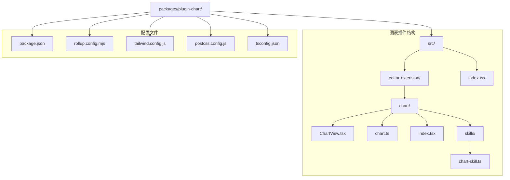
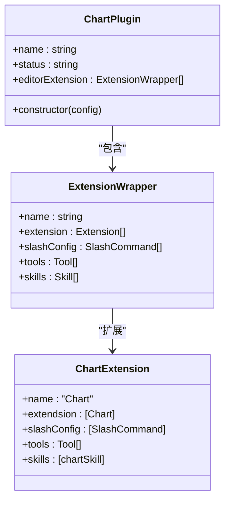
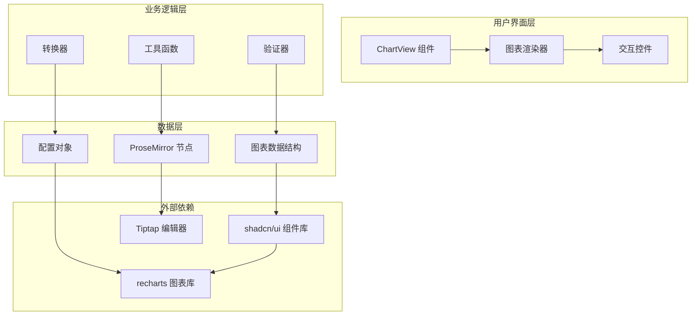
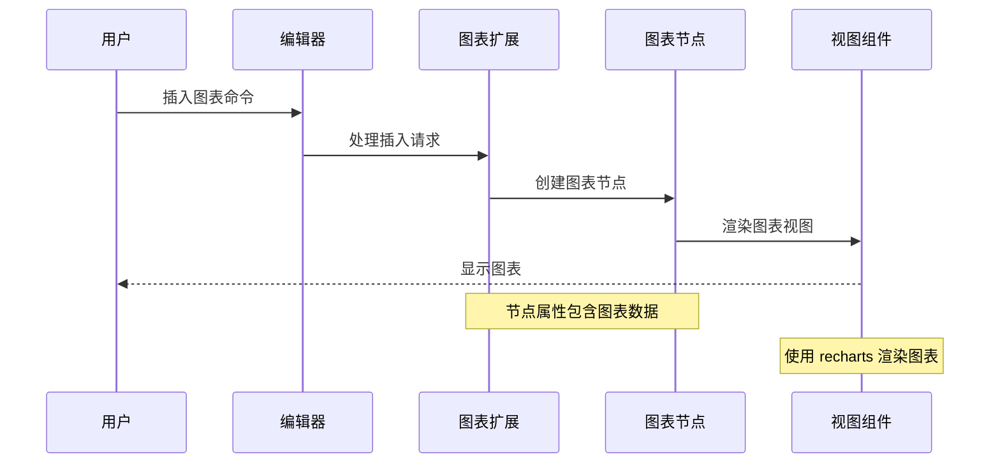
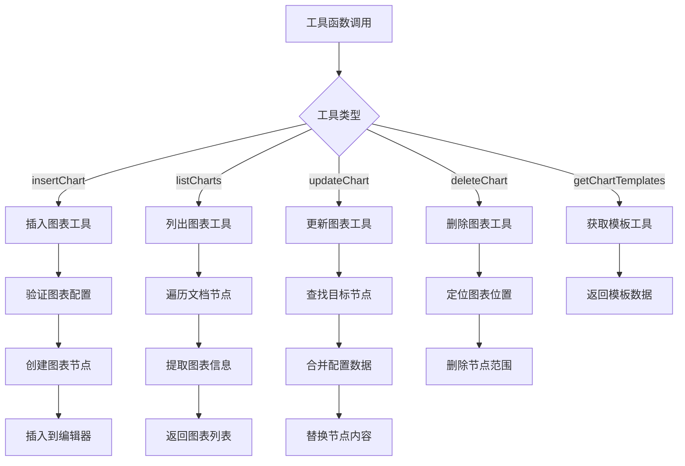
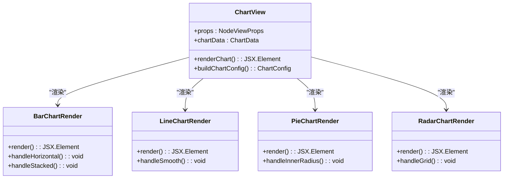
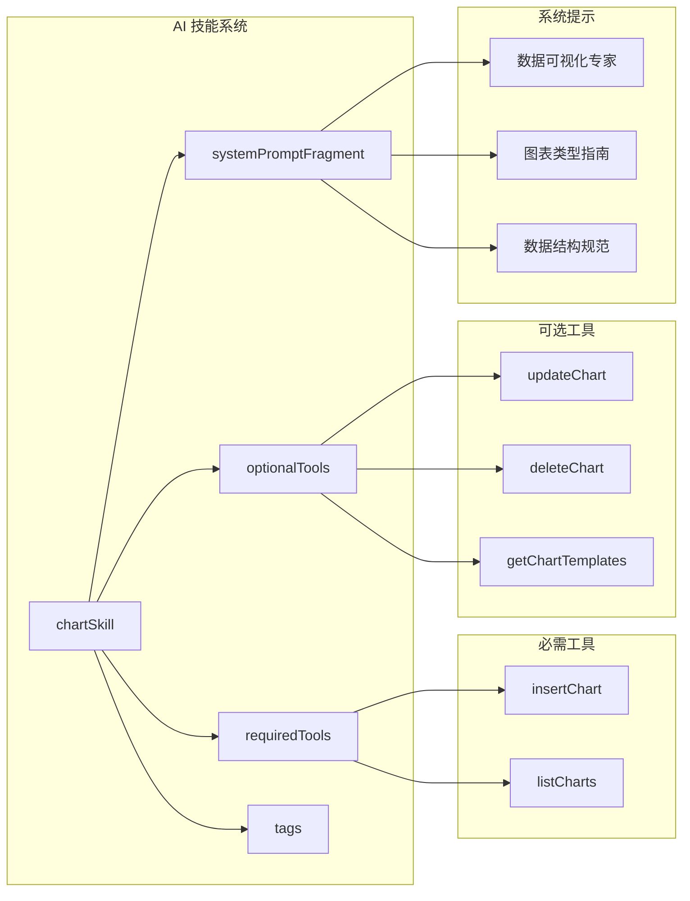

# 图表插件

<cite>
**本文档引用的文件**
- [README.md](file://README.md)
- [package.json](file://packages/plugin-chart/package.json)
- [index.tsx](file://packages/plugin-chart/src/index.tsx)
- [index.tsx](file://packages/plugin-chart/src/editor-extension/chart/index.tsx)
- [chart.ts](file://packages/plugin-chart/src/editor-extension/chart/chart.ts)
- [ChartView.tsx](file://packages/plugin-chart/src/editor-extension/chart/ChartView.tsx)
- [chart-skill.ts](file://packages/plugin-chart/src/editor-extension/chart/skills/chart-skill.ts)
- [rollup.config.mjs](file://packages/plugin-chart/rollup.config.mjs)
- [tailwind.config.js](file://packages/plugin-chart/tailwind.config.js)
- [postcss.config.js](file://packages/plugin-chart/postcss.config.js)
- [tsconfig.json](file://packages/plugin-chart/tsconfig.json)
- [package.json](file://packages/ui/package.json)
</cite>

## 目录
1. [简介](#简介)
2. [项目结构](#项目结构)
3. [核心组件](#核心组件)
4. [架构概览](#架构概览)
5. [详细组件分析](#详细组件分析)
6. [依赖关系分析](#依赖关系分析)
7. [性能考虑](#性能考虑)
8. [故障排除指南](#故障排除指南)
9. [结论](#结论)

## 简介

图表插件是 Knowledge Repo 知识管理平台中的一个核心可视化组件，专门用于在富文本编辑器中创建、编辑和展示各种类型的图表。该插件基于 Tiptap 编辑器框架，使用 shadcn/ui 组件库和 recharts 图表库来实现强大的数据可视化功能。

### 主要特性

- **多图表类型支持**：支持柱状图、折线图、面积图、饼图、雷达图、径向柱图和散点图
- **智能数据绑定**：通过结构化数据自动渲染图表
- **交互式编辑**：支持图表的动态更新和实时预览
- **模板系统**：内置多种图表模板和示例数据
- **AI 驱动**：集成智能图表生成和数据分析能力

## 项目结构

图表插件采用模块化的组织方式，主要包含以下核心目录结构：



**图表来源**
- [package.json:1-31](file://packages/plugin-chart/package.json#L1-L31)
- [index.tsx:1-17](file://packages/plugin-chart/src/index.tsx#L1-L17)

**章节来源**
- [package.json:1-31](file://packages/plugin-chart/package.json#L1-L31)
- [README.md:66-97](file://README.md#L66-L97)

## 核心组件

图表插件由多个相互协作的核心组件构成，每个组件都有特定的功能和职责。

### 插件入口组件

插件入口组件负责初始化和注册图表插件的所有功能：



**图表来源**
- [index.tsx:9-16](file://packages/plugin-chart/src/index.tsx#L9-L16)
- [index.tsx:158-170](file://packages/plugin-chart/src/editor-extension/chart/index.tsx#L158-L170)

### 图表数据模型

图表插件定义了完整的数据结构来描述各种图表类型：

| 属性名称 | 类型 | 必需 | 描述 |
|---------|------|------|------|
| type | string | 是 | 图表类型（bar、line、area、pie、radar、radialBar、scatter） |
| title | string | 否 | 图表标题 |
| description | string | 否 | 图表描述 |
| data | Record<string, any>[] | 是 | 数据数组，每个元素代表一个数据点 |
| dataKeys | string[] | 是 | 数据系列键名数组 |
| categoryKey | string | 否 | 分类键名（对应 x 轴/标签） |
| colors | Record<string, string> | 否 | 颜色映射，key 为 dataKey，value 为 CSS 颜色值 |
| showLegend | boolean | 否 | 是否显示图例 |
| showGrid | boolean | 否 | 是否显示网格线 |
| showDataLabels | boolean | 否 | 是否显示数据标签 |
| smoothLine | boolean | 否 | 折线/面积图是否使用平滑曲线 |
| stacked | boolean | 否 | 是否堆叠显示 |
| horizontal | boolean | 否 | 是否水平显示（仅柱状图） |
| height | number | 否 | 图表高度（像素） |
| innerRadius | number | 否 | 饼图内半径（用于环形图） |

**章节来源**
- [chart.ts:8-34](file://packages/plugin-chart/src/editor-extension/chart/chart.ts#L8-L34)

## 架构概览

图表插件采用分层架构设计，从底层的数据存储到上层的用户界面渲染都经过精心设计。



**图表来源**
- [ChartView.tsx:321-390](file://packages/plugin-chart/src/editor-extension/chart/ChartView.tsx#L321-L390)
- [chart.ts:44-80](file://packages/plugin-chart/src/editor-extension/chart/chart.ts#L44-L80)

## 详细组件分析

### 图表节点扩展

图表节点扩展是插件的核心，它定义了如何在 Tiptap 编辑器中创建和处理图表节点。



**图表来源**
- [chart.ts:68-79](file://packages/plugin-chart/src/editor-extension/chart/chart.ts#L68-L79)
- [ChartView.tsx:321-390](file://packages/plugin-chart/src/editor-extension/chart/ChartView.tsx#L321-L390)

### 工具函数系统

插件提供了完整的工具函数系统，支持图表的创建、查询、更新和删除操作。



**图表来源**
- [index.tsx:205-255](file://packages/plugin-chart/src/editor-extension/chart/index.tsx#L205-L255)
- [index.tsx:263-299](file://packages/plugin-chart/src/editor-extension/chart/index.tsx#L263-L299)

### 图表渲染器

图表渲染器负责将数据结构转换为可视化的图表组件。



**图表来源**
- [ChartView.tsx:340-364](file://packages/plugin-chart/src/editor-extension/chart/ChartView.tsx#L340-L364)
- [ChartView.tsx:88-133](file://packages/plugin-chart/src/editor-extension/chart/ChartView.tsx#L88-L133)

**章节来源**
- [ChartView.tsx:1-391](file://packages/plugin-chart/src/editor-extension/chart/ChartView.tsx#L1-L391)
- [index.tsx:1-453](file://packages/plugin-chart/src/editor-extension/chart/index.tsx#L1-L453)

### AI 驱动技能

图表插件集成了专门的 AI 技能，能够智能地创建和优化图表。



**图表来源**
- [chart-skill.ts:1-50](file://packages/plugin-chart/src/editor-extension/chart/skills/chart-skill.ts#L1-L50)

**章节来源**
- [chart-skill.ts:1-50](file://packages/plugin-chart/src/editor-extension/chart/skills/chart-skill.ts#L1-L50)

## 依赖关系分析

图表插件的依赖关系相对简洁，主要依赖于核心编辑器框架和 UI 组件库。

```mermaid
graph TB
subgraph "图表插件依赖"
A[@kn/chart-plugin] --> B[@kn/common]
A --> C[@kn/editor]
A --> D[@kn/icon]
A --> E[@kn/ui]
A --> F[recharts]
end
subgraph "UI 组件库"
E --> G[shadcn/ui]
E --> H[recharts]
E --> I[Radix UI]
end
subgraph "编辑器框架"
C --> J[Tiptap]
C --> K[ProseMirror]
end
subgraph "构建工具"
L[rollup] --> M[baseConfig]
N[tailwind] --> O[@kn/ui/tailwind.config]
P[postcss] --> Q[@kn/ui/postcss.config]
end
A --> L
A --> N
A --> P
```

**图表来源**
- [package.json:15-29](file://packages/plugin-chart/package.json#L15-L29)
- [package.json:23-90](file://packages/ui/package.json#L23-L90)

**章节来源**
- [package.json:1-31](file://packages/plugin-chart/package.json#L1-L31)
- [package.json:1-91](file://packages/ui/package.json#L1-L91)

## 性能考虑

图表插件在设计时充分考虑了性能优化，特别是在大数据集和复杂图表渲染场景下的表现。

### 渲染优化策略

1. **懒加载机制**：图表组件只在需要时才进行渲染
2. **数据缓存**：使用 useMemo 进行数据计算结果缓存
3. **虚拟化支持**：对于大量数据的图表，支持虚拟化渲染
4. **增量更新**：只更新发生变化的部分，而非整个图表

### 内存管理

- 及时清理图表事件监听器
- 合理管理图表实例生命周期
- 避免内存泄漏的资源释放

## 故障排除指南

### 常见问题及解决方案

| 问题类型 | 症状 | 可能原因 | 解决方案 |
|---------|------|---------|---------|
| 图表不显示 | 空白区域或错误状态 | 数据格式错误或缺失 | 验证 ChartData 结构，检查数据完整性 |
| 图表渲染异常 | 图表变形或重叠 | 配置参数错误 | 检查高度、宽度和布局设置 |
| 性能问题 | 页面卡顿或延迟 | 数据量过大 | 实施数据分页或采样策略 |
| 交互失效 | 点击无响应 | 事件绑定问题 | 检查节点视图的事件处理 |

### 调试技巧

1. **启用开发模式**：使用调试版本获取更详细的错误信息
2. **检查控制台**：关注 JavaScript 错误和警告
3. **验证数据结构**：确保图表数据符合预期格式
4. **测试边界条件**：验证空数据、单点数据等特殊情况

**章节来源**
- [ChartView.tsx:379-385](file://packages/plugin-chart/src/editor-extension/chart/ChartView.tsx#L379-L385)
- [index.tsx:209-254](file://packages/plugin-chart/src/editor-extension/chart/index.tsx#L209-L254)

## 结论

图表插件是 Knowledge Repo 平台中一个功能强大且设计精良的可视化组件。它成功地将复杂的数据可视化需求与易用的编辑器体验相结合，为用户提供了直观、高效的图表创建和编辑能力。

### 主要优势

1. **全面的图表支持**：覆盖了现代数据可视化的主要需求
2. **智能集成**：与 AI 系统无缝集成，提供智能化的图表生成功能
3. **良好的扩展性**：模块化设计便于功能扩展和定制
4. **优秀的用户体验**：直观的界面和流畅的交互体验

### 发展方向

未来可以考虑的功能增强包括：
- 支持更多图表类型和自定义选项
- 增强 AI 驱动的图表分析能力
- 优化大数据集的渲染性能
- 扩展移动端适配和支持

图表插件为 Knowledge Repo 平台的数据可视化能力奠定了坚实的基础，是构建现代化知识管理系统的必备组件。