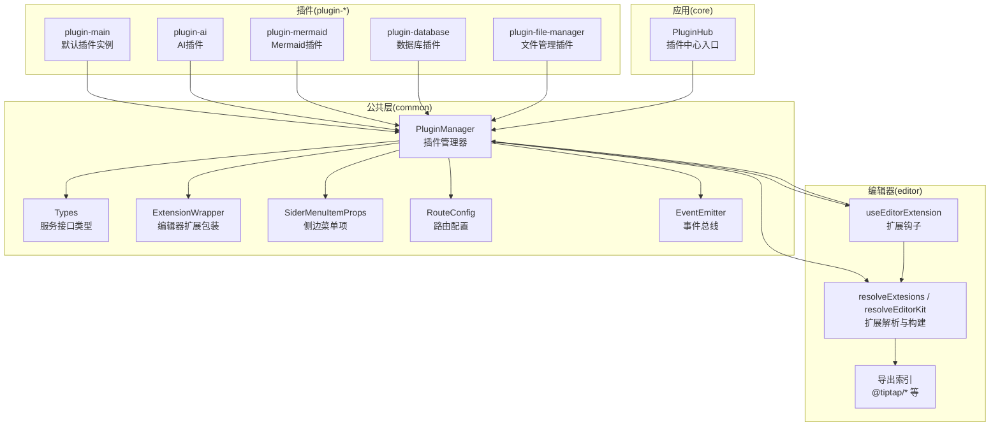
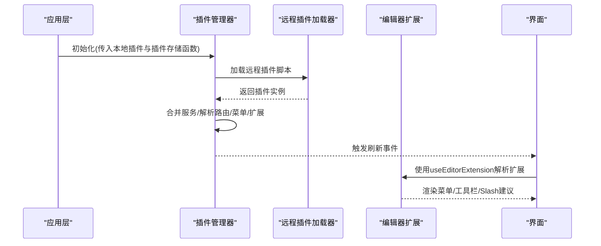
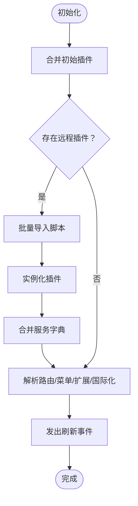
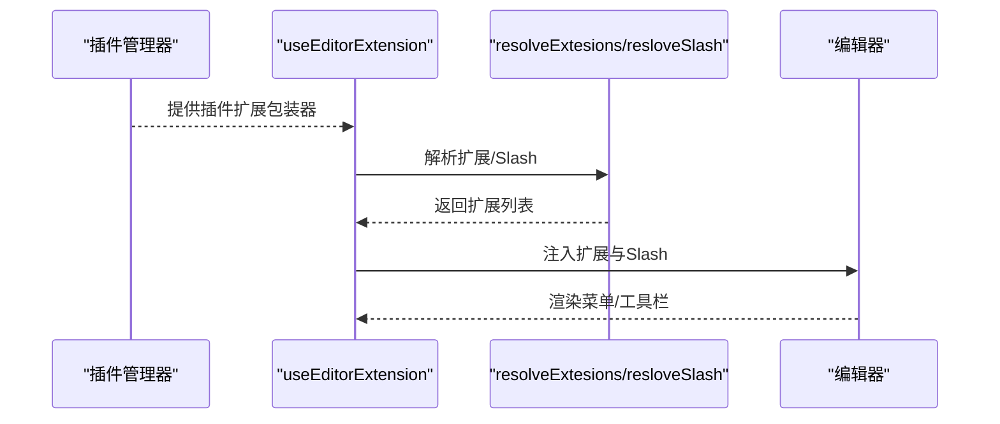
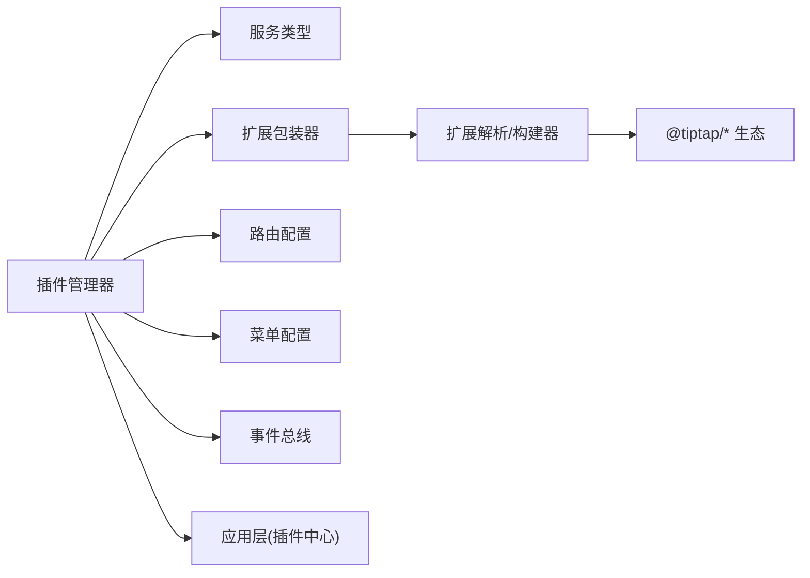

# 插件开发

<cite>
**本文引用的文件**
- [packages/common/src/core/PluginManager.ts](file://packages/common/src/core/PluginManager.ts)
- [packages/common/src/core/types.ts](file://packages/common/src/core/types.ts)
- [packages/common/src/core/editor.ts](file://packages/common/src/core/editor.ts)
- [packages/common/src/core/menu.ts](file://packages/common/src/core/menu.ts)
- [packages/common/src/core/route.ts](file://packages/common/src/core/route.ts)
- [packages/common/src/event/event.ts](file://packages/common/src/event/event.ts)
- [packages/editor/src/index.ts](file://packages/editor/src/index.ts)
- [packages/editor/src/editor/kit.tsx](file://packages/editor/src/editor/kit.tsx)
- [packages/editor/src/editor/use-extension.ts](file://packages/editor/src/editor/use-extension.ts)
- [packages/plugin-main/src/index.tsx](file://packages/plugin-main/src/index.tsx)
- [packages/plugin-ai/src/index.tsx](file://packages/plugin-ai/src/index.tsx)
- [packages/plugin-mermaid/src/index.tsx](file://packages/plugin-mermaid/src/index.tsx)
- [packages/plugin-database/src/index.tsx](file://packages/plugin-database/src/index.tsx)
- [packages/plugin-file-manager/src/index.tsx](file://packages/plugin-file-manager/src/index.tsx)
- [packages/core/src/components/PluginHub/index.tsx](file://packages/core/src/components/PluginHub/index.tsx)
</cite>

## 目录
1. [引言](#引言)
2. [项目结构](#项目结构)
3. [核心组件](#核心组件)
4. [架构总览](#架构总览)
5. [详细组件分析](#详细组件分析)
6. [依赖关系分析](#依赖关系分析)
7. [性能考虑](#性能考虑)
8. [故障排查指南](#故障排查指南)
9. [结论](#结论)
10. [附录：开发流程与最佳实践](#附录开发流程与最佳实践)

## 引言
本指南面向知识库管理系统中的插件开发者，系统性阐述插件开发的基础概念、接口规范、生命周期管理、配置系统与与核心系统的集成方式（事件系统、服务注入、状态管理）。文档同时提供编辑器扩展（Tiptap）集成、菜单与工具栏定制、以及插件打包与发布的完整流程建议，并给出可直接参考的示例与模板路径，帮助快速上手并高质量交付插件。

## 项目结构
该仓库采用多包工作区组织，插件开发主要涉及以下模块：
- common：插件通用能力与类型定义（插件管理器、编辑器包装器、菜单与路由配置、事件总线等）
- editor：编辑器内核与扩展集合（Tiptap 集成、构建器、工具栏、气泡菜单、Slash 建议等）
- plugin-*：各类插件示例（如主插件、AI、Mermaid、数据库、文件管理等）
- core：应用层组件（如插件中心入口）

图表来源
- [packages/common/src/core/PluginManager.ts](file://packages/common/src/core/PluginManager.ts#L1-L170)
- [packages/common/src/core/types.ts](file://packages/common/src/core/types.ts#L1-L4)
- [packages/common/src/core/editor.ts](file://packages/common/src/core/editor.ts#L1-L31)
- [packages/common/src/core/menu.ts](file://packages/common/src/core/menu.ts#L1-L25)
- [packages/common/src/core/route.ts](file://packages/common/src/core/route.ts#L1-L8)
- [packages/common/src/event/event.ts](file://packages/common/src/event/event.ts#L1-L44)
- [packages/editor/src/editor/kit.tsx](file://packages/editor/src/editor/kit.tsx#L1-L87)
- [packages/editor/src/editor/use-extension.ts](file://packages/editor/src/editor/use-extension.ts#L1-L63)
- [packages/editor/src/index.ts](file://packages/editor/src/index.ts#L1-L23)
- [packages/plugin-main/src/index.tsx](file://packages/plugin-main/src/index.tsx#L1-L118)
- [packages/plugin-ai/src/index.tsx](file://packages/plugin-ai/src/index.tsx#L1-L35)
- [packages/plugin-mermaid/src/index.tsx](file://packages/plugin-mermaid/src/index.tsx#L1-L17)
- [packages/plugin-database/src/index.tsx](file://packages/plugin-database/src/index.tsx#L1-L17)
- [packages/plugin-file-manager/src/index.tsx](file://packages/plugin-file-manager/src/index.tsx#L1-L38)
- [packages/core/src/components/PluginHub/index.tsx](file://packages/core/src/components/PluginHub/index.tsx#L1-L6)

章节来源
- [packages/common/src/core/PluginManager.ts](file://packages/common/src/core/PluginManager.ts#L1-L170)
- [packages/editor/src/editor/kit.tsx](file://packages/editor/src/editor/kit.tsx#L1-L87)
- [packages/editor/src/editor/use-extension.ts](file://packages/editor/src/editor/use-extension.ts#L1-L63)
- [packages/plugin-main/src/index.tsx](file://packages/plugin-main/src/index.tsx#L1-L118)

## 核心组件
本节聚焦插件开发的关键构件与职责边界，帮助开发者建立统一的插件开发范式。

- 插件配置与实例化
  - 插件配置接口：用于声明插件名称、状态、路由、全局路由、菜单、编辑器扩展、国际化资源与服务等。
  - 插件实例：通过继承通用基类完成实例化，暴露只读访问器以供运行时读取。
  - 参考路径：[插件配置与KPlugin类](file://packages/common/src/core/PluginManager.ts#L9-L61)

- 插件管理器
  - 职责：加载本地与远程插件、合并服务、解析路由/菜单/编辑器扩展、触发刷新事件、卸载与安装插件。
  - 生命周期：初始化、安装、卸载、服务合并、扩展解析。
  - 参考路径：[插件管理器实现](file://packages/common/src/core/PluginManager.ts#L63-L170)

- 编辑器扩展包装器
  - 作用：统一承载 Tiptap 扩展及其配套的菜单、Slash 建议、浮动菜单、工具面板等。
  - 结构要点：扩展对象、分组、菜单渲染组件、Slash 条目、工具执行函数等。
  - 参考路径：[扩展包装器类型](file://packages/common/src/core/editor.ts#L1-L31)

- 路由与菜单配置
  - 路由配置：支持嵌套路由与元素渲染。
  - 菜单配置：支持图标、分组、点击回调、动作按钮等。
  - 参考路径：
    - [路由配置接口](file://packages/common/src/core/route.ts#L1-L8)
    - [菜单配置接口](file://packages/common/src/core/menu.ts#L1-L25)

- 事件系统
  - 事件总线：提供订阅、广播、取消订阅与销毁能力。
  - 应用场景：插件安装/卸载后通知界面刷新。
  - 参考路径：[事件总线实现](file://packages/common/src/event/event.ts#L1-L44)

- 编辑器集成钩子
  - 扩展解析：将包装器数组转换为 Tiptap 扩展列表。
  - Slash 建议：聚合各插件的 Slash 条目，生成统一建议菜单。
  - 使用上下文：在编辑器中注入插件提供的扩展与 Slash。
  - 参考路径：
    - [扩展解析与构建器](file://packages/editor/src/editor/kit.tsx#L1-L87)
    - [扩展钩子](file://packages/editor/src/editor/use-extension.ts#L1-L63)

章节来源
- [packages/common/src/core/PluginManager.ts](file://packages/common/src/core/PluginManager.ts#L1-L170)
- [packages/common/src/core/editor.ts](file://packages/common/src/core/editor.ts#L1-L31)
- [packages/common/src/core/route.ts](file://packages/common/src/core/route.ts#L1-L8)
- [packages/common/src/core/menu.ts](file://packages/common/src/core/menu.ts#L1-L25)
- [packages/common/src/event/event.ts](file://packages/common/src/event/event.ts#L1-L44)
- [packages/editor/src/editor/kit.tsx](file://packages/editor/src/editor/kit.tsx#L1-L87)
- [packages/editor/src/editor/use-extension.ts](file://packages/editor/src/editor/use-extension.ts#L1-L63)

## 架构总览
下图展示了插件系统与编辑器内核、事件系统及应用层的交互关系，体现“插件注册—扩展解析—编辑器集成—界面刷新”的闭环。

图表来源
- [packages/common/src/core/PluginManager.ts](file://packages/common/src/core/PluginManager.ts#L78-L112)
- [packages/editor/src/editor/use-extension.ts](file://packages/editor/src/editor/use-extension.ts#L20-L63)
- [packages/common/src/event/event.ts](file://packages/common/src/event/event.ts#L1-L44)

## 详细组件分析

### 插件管理器与生命周期
- 初始化
  - 合并初始插件与远程插件，构建插件服务字典，标记初始化完成。
  - 参考路径：[初始化流程](file://packages/common/src/core/PluginManager.ts#L78-L97)

- 安装/卸载
  - 安装：动态加载脚本，实例化插件并合并服务，发出刷新事件。
  - 卸载：移除插件并发出刷新事件。
  - 参考路径：
    - [安装插件](file://packages/common/src/core/PluginManager.ts#L105-L112)
    - [卸载插件](file://packages/common/src/core/PluginManager.ts#L99-L104)

- 解析与聚合
  - 路由解析：收集所有插件的路由配置。
  - 菜单解析：收集所有插件的菜单配置。
  - 编辑器扩展解析：收集所有插件的扩展包装器并转换为 Tiptap 扩展。
  - 国际化合并：按语言维度合并插件翻译资源。
  - 参考路径：
    - [解析路由](file://packages/common/src/core/PluginManager.ts#L122-L129)
    - [解析菜单](file://packages/common/src/core/PluginManager.ts#L157-L165)
    - [解析编辑器扩展](file://packages/common/src/core/PluginManager.ts#L146-L155)
    - [解析国际化](file://packages/common/src/core/PluginManager.ts#L136-L144)

图表来源
- [packages/common/src/core/PluginManager.ts](file://packages/common/src/core/PluginManager.ts#L78-L145)
- [packages/common/src/event/event.ts](file://packages/common/src/event/event.ts#L1-L44)

章节来源
- [packages/common/src/core/PluginManager.ts](file://packages/common/src/core/PluginManager.ts#L63-L170)
- [packages/common/src/event/event.ts](file://packages/common/src/event/event.ts#L1-L44)

### 编辑器扩展集成（Tiptap）
- 扩展解析
  - 将插件提供的扩展包装器数组转换为 Tiptap 扩展列表，支持数组与单个扩展。
  - 参考路径：[扩展解析](file://packages/editor/src/editor/kit.tsx#L23-L34)

- Slash 建议
  - 聚合各插件的 Slash 条目，生成统一建议菜单。
  - 参考路径：[Slash聚合](file://packages/editor/src/editor/kit.tsx#L36-L49)

- 编辑器钩子
  - 在编辑器中注入内置扩展与插件扩展，生成最终扩展集合并处理唯一 ID 配置。
  - 参考路径：[扩展钩子](file://packages/editor/src/editor/use-extension.ts#L20-L63)

图表来源
- [packages/editor/src/editor/use-extension.ts](file://packages/editor/src/editor/use-extension.ts#L20-L63)
- [packages/editor/src/editor/kit.tsx](file://packages/editor/src/editor/kit.tsx#L23-L49)
- [packages/common/src/core/PluginManager.ts](file://packages/common/src/core/PluginManager.ts#L146-L155)

章节来源
- [packages/editor/src/editor/kit.tsx](file://packages/editor/src/editor/kit.tsx#L1-L87)
- [packages/editor/src/editor/use-extension.ts](file://packages/editor/src/editor/use-extension.ts#L1-L63)
- [packages/common/src/core/PluginManager.ts](file://packages/common/src/core/PluginManager.ts#L122-L155)

### 插件与应用层集成
- 插件中心入口
  - 应用层提供插件中心组件占位，插件管理器负责加载与刷新。
  - 参考路径：[插件中心入口](file://packages/core/src/components/PluginHub/index.tsx#L1-L6)

- 服务注入
  - 插件可声明服务，插件管理器在初始化时合并为全局服务字典，供应用层使用。
  - 参考路径：
    - [服务类型定义](file://packages/common/src/core/types.ts#L1-L4)
    - [服务合并](file://packages/common/src/core/PluginManager.ts#L82-L93)

- 菜单与路由
  - 插件可注册侧边菜单与页面路由，插件管理器统一解析并注入应用路由表。
  - 参考路径：
    - [菜单配置接口](file://packages/common/src/core/menu.ts#L1-L25)
    - [路由配置接口](file://packages/common/src/core/route.ts#L1-L8)
    - [路由解析](file://packages/common/src/core/PluginManager.ts#L122-L129)
    - [菜单解析](file://packages/common/src/core/PluginManager.ts#L157-L165)

章节来源
- [packages/core/src/components/PluginHub/index.tsx](file://packages/core/src/components/PluginHub/index.tsx#L1-L6)
- [packages/common/src/core/types.ts](file://packages/common/src/core/types.ts#L1-L4)
- [packages/common/src/core/PluginManager.ts](file://packages/common/src/core/PluginManager.ts#L82-L93)
- [packages/common/src/core/menu.ts](file://packages/common/src/core/menu.ts#L1-L25)
- [packages/common/src/core/route.ts](file://packages/common/src/core/route.ts#L1-L8)

### 典型插件示例与模板
- 默认插件（主插件）
  - 功能：提供首页、空间列表、空间详情、页面查看/编辑、设置等路由与菜单；声明服务与国际化。
  - 参考路径：[默认插件实例](file://packages/plugin-main/src/index.tsx#L1-L118)

- AI 插件
  - 功能：注册编辑器扩展与国际化资源。
  - 参考路径：[AI插件实例](file://packages/plugin-ai/src/index.tsx#L1-L35)

- Mermaid 插件
  - 功能：注册 Mermaid 编辑器扩展。
  - 参考路径：[Mermaid插件实例](file://packages/plugin-mermaid/src/index.tsx#L1-L17)

- 数据库插件
  - 功能：注册数据库编辑器扩展。
  - 参考路径：[数据库插件实例](file://packages/plugin-database/src/index.tsx#L1-L17)

- 文件管理插件
  - 功能：注册文件夹与图片编辑器扩展，提供页面路由与菜单。
  - 参考路径：[文件管理插件实例](file://packages/plugin-file-manager/src/index.tsx#L1-L38)

章节来源
- [packages/plugin-main/src/index.tsx](file://packages/plugin-main/src/index.tsx#L1-L118)
- [packages/plugin-ai/src/index.tsx](file://packages/plugin-ai/src/index.tsx#L1-L35)
- [packages/plugin-mermaid/src/index.tsx](file://packages/plugin-mermaid/src/index.tsx#L1-L17)
- [packages/plugin-database/src/index.tsx](file://packages/plugin-database/src/index.tsx#L1-L17)
- [packages/plugin-file-manager/src/index.tsx](file://packages/plugin-file-manager/src/index.tsx#L1-L38)

## 依赖关系分析
- 组件耦合
  - 插件管理器与编辑器扩展解析紧密耦合，通过扩展包装器桥接插件与 Tiptap。
  - 事件总线作为跨模块通信机制，避免直接依赖导致的环状依赖。
- 外部依赖
  - 编辑器内核基于 Tiptap 与 ProseMirror，扩展解析与钩子围绕其生态展开。
- 接口契约
  - 插件需遵循统一的配置接口与扩展包装器格式，确保解析与渲染一致性。

图表来源
- [packages/common/src/core/PluginManager.ts](file://packages/common/src/core/PluginManager.ts#L1-L170)
- [packages/editor/src/editor/kit.tsx](file://packages/editor/src/editor/kit.tsx#L1-L87)
- [packages/common/src/event/event.ts](file://packages/common/src/event/event.ts#L1-L44)

章节来源
- [packages/common/src/core/PluginManager.ts](file://packages/common/src/core/PluginManager.ts#L1-L170)
- [packages/editor/src/editor/kit.tsx](file://packages/editor/src/editor/kit.tsx#L1-L87)
- [packages/common/src/event/event.ts](file://packages/common/src/event/event.ts#L1-L44)

## 性能考虑
- 远程插件加载
  - 使用并发加载策略，减少等待时间；对缓存参数进行控制以平衡更新与性能。
  - 参考路径：[远程插件加载](file://packages/common/src/core/PluginManager.ts#L88-L91)

- 扩展解析
  - 避免重复解析相同扩展；在编辑器钩子中仅在必要时重建扩展列表。
  - 参考路径：[扩展解析与钩子](file://packages/editor/src/editor/kit.tsx#L23-L34)

- 事件广播
  - 控制事件粒度，避免频繁触发导致的重绘风暴；必要时引入节流/去抖。
  - 参考路径：[事件总线](file://packages/common/src/event/event.ts#L1-L44)

- 国际化合并
  - 按需合并语言资源，避免一次性加载过多翻译造成内存压力。
  - 参考路径：[国际化合并](file://packages/common/src/core/PluginManager.ts#L136-L144)

章节来源
- [packages/common/src/core/PluginManager.ts](file://packages/common/src/core/PluginManager.ts#L88-L91)
- [packages/editor/src/editor/kit.tsx](file://packages/editor/src/editor/kit.tsx#L23-L34)
- [packages/common/src/event/event.ts](file://packages/common/src/event/event.ts#L1-L44)
- [packages/common/src/core/PluginManager.ts](file://packages/common/src/core/PluginManager.ts#L136-L144)

## 故障排查指南
- 插件未生效
  - 检查插件是否正确注册到插件管理器；确认初始化流程已完成。
  - 参考路径：[初始化与插件合并](file://packages/common/src/core/PluginManager.ts#L78-L97)

- 编辑器扩展不显示
  - 确认扩展包装器已正确提供；检查扩展解析与钩子调用链。
  - 参考路径：
    - [扩展包装器](file://packages/common/src/core/editor.ts#L1-L31)
    - [扩展解析与钩子](file://packages/editor/src/editor/kit.tsx#L23-L34)
    - [扩展钩子](file://packages/editor/src/editor/use-extension.ts#L20-L63)

- 菜单或路由缺失
  - 核对插件返回的菜单/路由配置是否被解析与注入。
  - 参考路径：
    - [菜单解析](file://packages/common/src/core/PluginManager.ts#L157-L165)
    - [路由解析](file://packages/common/src/core/PluginManager.ts#L122-L129)

- 事件未触发界面刷新
  - 检查事件广播与订阅是否正确；确认事件键一致。
  - 参考路径：[事件总线](file://packages/common/src/event/event.ts#L1-L44)

章节来源
- [packages/common/src/core/PluginManager.ts](file://packages/common/src/core/PluginManager.ts#L78-L165)
- [packages/common/src/core/editor.ts](file://packages/common/src/core/editor.ts#L1-L31)
- [packages/editor/src/editor/kit.tsx](file://packages/editor/src/editor/kit.tsx#L23-L34)
- [packages/editor/src/editor/use-extension.ts](file://packages/editor/src/editor/use-extension.ts#L20-L63)
- [packages/common/src/event/event.ts](file://packages/common/src/event/event.ts#L1-L44)

## 结论
本指南从架构与接口层面梳理了知识库插件体系的设计思想与实现路径，明确了插件的生命周期、配置规范与与编辑器内核的集成方式。通过统一的扩展包装器、事件总线与解析器，插件得以以最小成本接入路由、菜单、国际化与编辑器功能。建议在实际开发中严格遵循接口契约，合理拆分扩展与菜单，充分利用钩子与解析器，确保插件的可维护性与性能表现。

## 附录：开发流程与最佳实践
- 开发流程
  - 项目初始化：创建独立插件包，依赖 common 与 editor。
  - 编写插件配置：定义 name/status/routes/menus/editorExtension/services/locales。
  - 实现编辑器扩展：提供 Tiptap 扩展与配套菜单/Slash/工具面板。
  - 注册与测试：在应用中注册插件，验证路由、菜单与编辑器功能。
  - 打包与发布：遵循工作区打包策略，提供远程加载入口与缓存参数。
  - 参考路径：
    - [插件配置接口](file://packages/common/src/core/PluginManager.ts#L9-L18)
    - [扩展包装器](file://packages/common/src/core/editor.ts#L1-L31)
    - [默认插件示例](file://packages/plugin-main/src/index.tsx#L1-L118)

- 最佳实践
  - 明确职责边界：插件专注功能扩展，应用层负责路由与菜单编排。
  - 事件驱动：通过事件总线解耦插件安装/卸载与界面刷新。
  - 性能优先：延迟加载远程插件，避免一次性解析大量扩展。
  - 国际化规范：按语言维度组织翻译，避免重复与冲突。
  - 参考路径：
    - [事件总线](file://packages/common/src/event/event.ts#L1-L44)
    - [国际化合并](file://packages/common/src/core/PluginManager.ts#L136-L144)

章节来源
- [packages/common/src/core/PluginManager.ts](file://packages/common/src/core/PluginManager.ts#L9-L18)
- [packages/common/src/core/editor.ts](file://packages/common/src/core/editor.ts#L1-L31)
- [packages/plugin-main/src/index.tsx](file://packages/plugin-main/src/index.tsx#L1-L118)
- [packages/common/src/event/event.ts](file://packages/common/src/event/event.ts#L1-L44)
- [packages/common/src/core/PluginManager.ts](file://packages/common/src/core/PluginManager.ts#L136-L144)