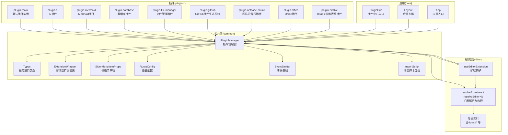
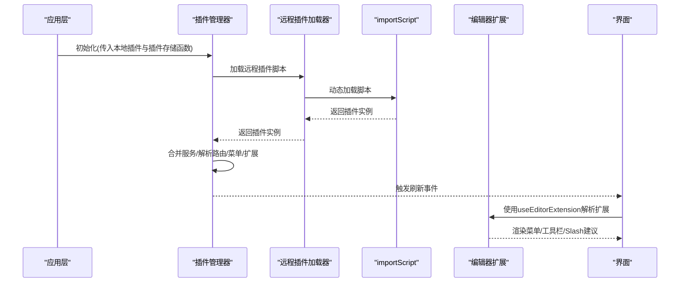
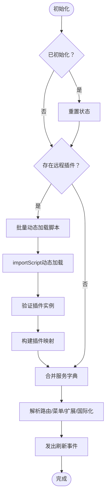
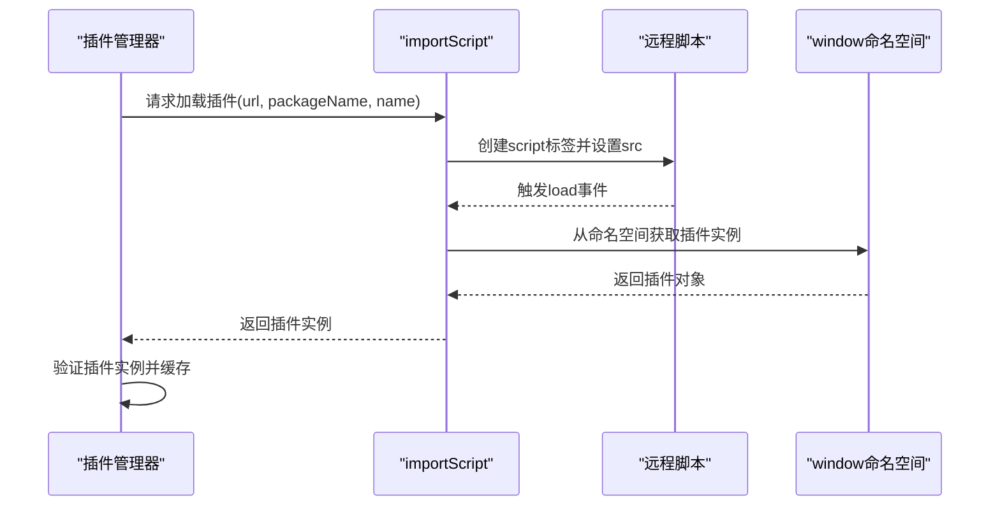
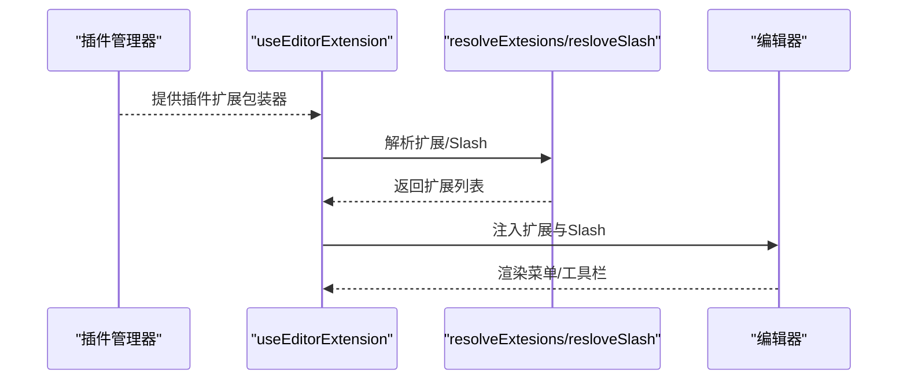
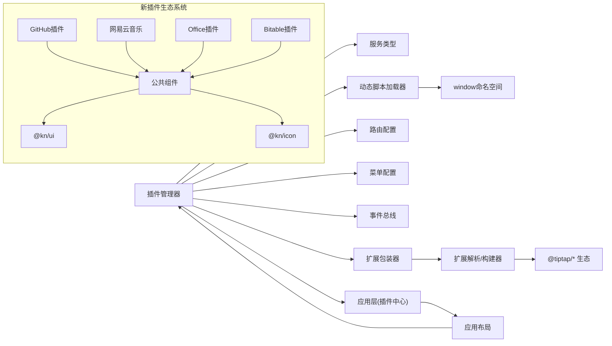

# 插件开发

<cite>
**本文引用的文件**
- [packages/common/src/core/PluginManager.ts](file://packages/common/src/core/PluginManager.ts)
- [packages/common/src/core/types.ts](file://packages/common/src/core/types.ts)
- [packages/common/src/core/editor.ts](file://packages/common/src/core/editor.ts)
- [packages/common/src/core/menu.ts](file://packages/common/src/core/menu.ts)
- [packages/common/src/core/route.ts](file://packages/common/src/core/route.ts)
- [packages/common/src/event/event.ts](file://packages/common/src/event/event.ts)
- [packages/common/src/utils/import-util.ts](file://packages/common/src/utils/import-util.ts)
- [packages/editor/src/index.ts](file://packages/editor/src/index.ts)
- [packages/editor/src/editor/kit.tsx](file://packages/editor/src/editor/kit.tsx)
- [packages/editor/src/editor/use-extension.ts](file://packages/editor/src/editor/use-extension.ts)
- [packages/plugin-main/src/index.tsx](file://packages/plugin-main/src/index.tsx)
- [packages/plugin-ai/src/index.tsx](file://packages/plugin-ai/src/index.tsx)
- [packages/plugin-mermaid/src/index.tsx](file://packages/plugin-mermaid/src/index.tsx)
- [packages/plugin-database/src/index.tsx](file://packages/plugin-database/src/index.tsx)
- [packages/plugin-file-manager/src/index.tsx](file://packages/plugin-file-manager/src/index.tsx)
- [packages/plugin-github/src/index.tsx](file://packages/plugin-github/src/index.tsx)
- [packages/plugin-github/src/extension/index.tsx](file://packages/plugin-github/src/extension/index.tsx)
- [packages/plugin-netease-music/src/index.tsx](file://packages/plugin-netease-music/src/index.tsx)
- [packages/plugin-netease-music/src/extension/index.tsx](file://packages/plugin-netease-music/src/extension/index.tsx)
- [packages/plugin-office/src/index.tsx](file://packages/plugin-office/src/index.tsx)
- [packages/plugin-office/src/spreadsheet/index.tsx](file://packages/plugin-office/src/spreadsheet/index.tsx)
- [packages/plugin-bitable/src/index.tsx](file://packages/plugin-bitable/src/index.tsx)
- [packages/plugin-bitable/src/bitable/index.tsx](file://packages/plugin-bitable/src/bitable/index.tsx)
- [packages/plugin-bitable/src/bitable/components/FilterPanel.tsx](file://packages/plugin-bitable/src/bitable/components/FilterPanel.tsx)
- [packages/plugin-bitable/src/bitable/components/RecordDetailSheet.tsx](file://packages/plugin-bitable/src/bitable/components/RecordDetailSheet.tsx)
- [packages/plugin-bitable/src/bitable/components/SortPanel.tsx](file://packages/plugin-bitable/src/bitable/components/SortPanel.tsx)
- [packages/core/src/components/PluginHub/index.tsx](file://packages/core/src/components/PluginHub/index.tsx)
- [packages/core/src/Layout.tsx](file://packages/core/src/Layout.tsx)
- [packages/core/src/App.tsx](file://packages/core/src/App.tsx)
</cite>

## 更新摘要
**所做更改**
- 新增三大插件生态系统：GitHub插件、网易云音乐插件、Office插件
- 新增Bitable插件重大功能增强：FilterPanel、RecordDetailSheet、SortPanel等新组件
- 更新插件架构以支持更多样化的插件生态系统
- 增强编辑器扩展集成能力，支持更丰富的节点类型和工具集

## 目录
1. [引言](#引言)
2. [项目结构](#项目结构)
3. [核心组件](#核心组件)
4. [架构总览](#架构总览)
5. [详细组件分析](#详细组件分析)
6. [插件生态系统](#插件生态系统)
7. [Bitable插件深度分析](#bitable插件深度分析)
8. [依赖关系分析](#依赖关系分析)
9. [性能考虑](#性能考虑)
10. [故障排查指南](#故障排查指南)
11. [结论](#结论)
12. [附录：开发流程与最佳实践](#附录开发流程与最佳实践)

## 引言
本指南面向知识库管理系统中的插件开发者，系统性阐述插件开发的基础概念、接口规范、生命周期管理、配置系统与与核心系统的集成方式（事件系统、服务注入、状态管理）。文档同时提供编辑器扩展（Tiptap）集成、菜单与工具栏定制、以及插件打包与发布的完整流程建议，并给出可直接参考的示例与模板路径，帮助快速上手并高质量交付插件。

**重要更新**：随着插件系统的发展，现已支持三大插件生态系统（GitHub、网易云音乐、Office），以及Bitable插件的重大功能增强。插件包的导出机制已从公开导出转向内部实现，DefaultPluginInstance不再是主要入口点，插件开发现在更加注重动态加载机制和新的插件管理API。开发者应关注远程插件加载、协作场景下的外部插件扩展加载等功能，以及现代插件开发模式的最佳实践。

## 项目结构
该仓库采用多包工作区组织，插件开发主要涉及以下模块：
- common：插件通用能力与类型定义（插件管理器、编辑器包装器、菜单与路由配置、事件总线等）
- editor：编辑器内核与扩展集合（Tiptap 集成、构建器、工具栏、气泡菜单、Slash 建议等）
- plugin-*：各类插件示例（如主插件、AI、Mermaid、数据库、文件管理、GitHub、网易云音乐、Office等）
- core：应用层组件（如插件中心入口）

```mermaid
graph TB
subgraph "公共层(common)"
PM["PluginManager<br/>插件管理器"]
Types["Types<br/>服务接口类型"]
EditorWrap["ExtensionWrapper<br/>编辑器扩展包装"]
MenuCfg["SiderMenuItemProps<br/>侧边菜单项"]
RouteCfg["RouteConfig<br/>路由配置"]
Event["EventEmitter<br/>事件总线"]
ImportUtil["importScript<br/>动态脚本加载"]
end
subgraph "编辑器(editor)"
Kit["resolveExtesions / resolveEditorKit<br/>扩展解析与构建"]
UseExt["useEditorExtension<br/>扩展钩子"]
ExportIndex["导出索引<br/>@tiptap/* 等"]
end
subgraph "插件(plugin-*)"
Main["plugin-main<br/>默认插件实例"]
AI["plugin-ai<br/>AI插件"]
Mermaid["plugin-mermaid<br/>Mermaid插件"]
DB["plugin-database<br/>数据库插件"]
FM["plugin-file-manager<br/>文件管理插件"]
GitHub["plugin-github<br/>GitHub插件生态系统"]
NetEase["plugin-netease-music<br/>网易云音乐插件"]
Office["plugin-office<br/>Office插件"]
Bitable["plugin-bitable<br/>Bitable多维表格插件"]
end
subgraph "应用(core)"
Hub["PluginHub<br/>插件中心入口"]
Layout["Layout<br/>应用布局"]
App["App<br/>应用入口"]
end
PM --> Kit
PM --> UseExt
PM --> Event
PM --> Types
PM --> EditorWrap
PM --> MenuCfg
PM --> RouteCfg
PM --> ImportUtil
Kit --> ExportIndex
UseExt --> Kit
UseExt --> PM
Main --> PM
AI --> PM
Mermaid --> PM
DB --> PM
FM --> PM
GitHub --> PM
NetEase --> PM
Office --> PM
Bitable --> PM
Hub --> PM
Layout --> PM
App --> PM
```

**图表来源**
- [packages/common/src/core/PluginManager.ts](file://packages/common/src/core/PluginManager.ts#L1-L490)
- [packages/common/src/utils/import-util.ts](file://packages/common/src/utils/import-util.ts#L1-L39)
- [packages/editor/src/editor/kit.tsx](file://packages/editor/src/editor/kit.tsx#L1-L87)
- [packages/editor/src/editor/use-extension.ts](file://packages/editor/src/editor/use-extension.ts#L1-L64)
- [packages/plugin-main/src/index.tsx](file://packages/plugin-main/src/index.tsx#L1-L320)
- [packages/plugin-github/src/index.tsx](file://packages/plugin-github/src/index.tsx#L1-L51)
- [packages/plugin-netease-music/src/index.tsx](file://packages/plugin-netease-music/src/index.tsx#L1-L42)
- [packages/plugin-office/src/index.tsx](file://packages/plugin-office/src/index.tsx#L1-L16)
- [packages/plugin-bitable/src/index.tsx](file://packages/plugin-bitable/src/index.tsx#L1-L699)
- [packages/core/src/Layout.tsx](file://packages/core/src/Layout.tsx#L131-L161)
- [packages/core/src/App.tsx](file://packages/core/src/App.tsx#L55-L75)

**章节来源**
- [packages/common/src/core/PluginManager.ts](file://packages/common/src/core/PluginManager.ts#L1-L490)
- [packages/common/src/utils/import-util.ts](file://packages/common/src/utils/import-util.ts#L1-L39)
- [packages/editor/src/editor/kit.tsx](file://packages/editor/src/editor/kit.tsx#L1-L87)
- [packages/editor/src/editor/use-extension.ts](file://packages/editor/src/editor/use-extension.ts#L1-L64)
- [packages/plugin-main/src/index.tsx](file://packages/plugin-main/src/index.tsx#L1-L320)

## 核心组件
本节聚焦插件开发的关键构件与职责边界，帮助开发者建立统一的插件开发范式。

- 插件配置与实例化
  - 插件配置接口：用于声明插件名称、状态、路由、全局路由、菜单、编辑器扩展、国际化资源与服务等。
  - 插件实例：通过继承通用基类完成实例化，暴露只读访问器以供运行时读取。
  - **更新**：现代插件开发更注重内部实现而非公开导出，插件实例通常在插件包内部创建和管理。
  - 参考路径：[插件配置与KPlugin类](file://packages/common/src/core/PluginManager.ts#L50-L97)

- 插件管理器
  - 职责：加载本地与远程插件、合并服务、解析路由/菜单/编辑器扩展、触发刷新事件、卸载与安装插件。
  - 生命周期：初始化、安装、卸载、服务合并、扩展解析。
  - **新增功能**：支持外部插件扩展加载，用于协作场景。
  - 参考路径：[插件管理器实现](file://packages/common/src/core/PluginManager.ts#L99-L490)

- 动态脚本加载器
  - 职责：通过动态创建script标签加载远程插件，支持缓存机制。
  - 特性：命名空间隔离、错误处理、缓存优化。
  - 参考路径：[动态脚本加载](file://packages/common/src/utils/import-util.ts#L12-L39)

- 编辑器扩展包装器
  - 作用：统一承载 Tiptap 扩展及其配套的菜单、Slash 建议、浮动菜单、工具面板等。
  - 结构要点：扩展对象、分组、菜单渲染组件、Slash 条目、工具执行函数等。
  - 参考路径：[扩展包装器类型](file://packages/common/src/core/editor.ts#L1-L31)

- 路由与菜单配置
  - 路由配置：支持嵌套路由与元素渲染。
  - 菜单配置：支持图标、分组、点击回调、动作按钮等。
  - 参考路径：
    - [路由配置接口](file://packages/common/src/core/route.ts#L1-L8)
    - [菜单配置接口](file://packages/common/src/core/menu.ts#L1-L25)

- 事件系统
  - 事件总线：提供订阅、广播、取消订阅与销毁能力。
  - 应用场景：插件安装/卸载后通知界面刷新。
  - 参考路径：[事件总线实现](file://packages/common/src/event/event.ts#L1-L44)

- 编辑器集成钩子
  - 扩展解析：将包装器数组转换为 Tiptap 扩展列表。
  - Slash 建议：聚合各插件的 Slash 条目，生成统一建议菜单。
  - 使用上下文：在编辑器中注入插件提供的扩展与 Slash。
  - 参考路径：
    - [扩展解析与构建器](file://packages/editor/src/editor/kit.tsx#L1-L87)
    - [扩展钩子](file://packages/editor/src/editor/use-extension.ts#L1-L64)

**章节来源**
- [packages/common/src/core/PluginManager.ts](file://packages/common/src/core/PluginManager.ts#L50-L490)
- [packages/common/src/utils/import-util.ts](file://packages/common/src/utils/import-util.ts#L12-L39)
- [packages/common/src/core/editor.ts](file://packages/common/src/core/editor.ts#L1-L31)
- [packages/common/src/core/route.ts](file://packages/common/src/core/route.ts#L1-L8)
- [packages/common/src/core/menu.ts](file://packages/common/src/core/menu.ts#L1-L25)
- [packages/common/src/event/event.ts](file://packages/common/src/event/event.ts#L1-L44)
- [packages/editor/src/editor/kit.tsx](file://packages/editor/src/editor/kit.tsx#L1-L87)
- [packages/editor/src/editor/use-extension.ts](file://packages/editor/src/editor/use-extension.ts#L1-L64)

## 架构总览
下图展示了插件系统与编辑器内核、事件系统及应用层的交互关系，体现"插件注册—扩展解析—编辑器集成—界面刷新"的闭环。

```mermaid
sequenceDiagram
participant App as "应用层"
participant PM as "插件管理器"
participant Loader as "远程插件加载器"
participant ImportUtil as "importScript"
participant Ext as "编辑器扩展"
participant UI as "界面"
App->>PM : 初始化(传入本地插件与插件存储函数)
PM->>Loader : 加载远程插件脚本
Loader->>ImportUtil : 动态加载脚本
ImportUtil-->>Loader : 返回插件实例
Loader-->>PM : 返回插件实例
PM->>PM : 合并服务/解析路由/菜单/扩展
PM-->>UI : 触发刷新事件
UI->>Ext : 使用useEditorExtension解析扩展
Ext-->>UI : 渲染菜单/工具栏/Slash建议
```

**图表来源**
- [packages/common/src/core/PluginManager.ts](file://packages/common/src/core/PluginManager.ts#L150-L218)
- [packages/common/src/utils/import-util.ts](file://packages/common/src/utils/import-util.ts#L15-L32)
- [packages/editor/src/editor/use-extension.ts](file://packages/editor/src/editor/use-extension.ts#L20-L64)
- [packages/common/src/event/event.ts](file://packages/common/src/event/event.ts#L1-L44)

## 详细组件分析

### 插件管理器与生命周期
- 初始化
  - 合并初始插件与远程插件，构建插件服务字典，标记初始化完成。
  - 支持重新初始化时的状态重置。
  - 参考路径：[初始化流程](file://packages/common/src/core/PluginManager.ts#L150-L218)

- 安装/卸载
  - 安装：动态加载脚本，实例化插件并合并服务，发出刷新事件。
  - 卸载：移除插件并发出刷新事件。
  - 参考路径：
    - [安装插件](file://packages/common/src/core/PluginManager.ts#L251-L291)
    - [卸载插件](file://packages/common/src/core/PluginManager.ts#L231-L249)

- 解析与聚合
  - 路由解析：收集所有插件的路由配置。
  - 菜单解析：收集所有插件的菜单配置。
  - 编辑器扩展解析：收集所有插件的扩展包装器并转换为 Tiptap 扩展。
  - 国际化合并：按语言维度合并插件翻译资源。
  - 参考路径：
    - [解析路由](file://packages/common/src/core/PluginManager.ts#L320-L334)
    - [解析菜单](file://packages/common/src/core/PluginManager.ts#L400-L414)
    - [解析编辑器扩展](file://packages/common/src/core/PluginManager.ts#L384-L398)
    - [解析国际化](file://packages/common/src/core/PluginManager.ts#L368-L382)

- **新增功能**：外部插件扩展加载
  - 用于协作场景，允许加载其他用户的插件扩展而不影响当前用户插件列表。
  - 参考路径：[外部插件扩展加载](file://packages/common/src/core/PluginManager.ts#L441-L485)

```mermaid
flowchart TD
Start(["初始化"]) --> ResetState{"已初始化？"}
ResetState --> |是| Reset["重置状态"]
ResetState --> |否| CheckRemote{"存在远程插件？"}
Reset --> CheckRemote
CheckRemote --> |是| LoadRemote["批量动态加载脚本"]
LoadRemote --> ImportScript["importScript动态加载"]
ImportScript --> ValidatePlugins["验证插件实例"]
ValidatePlugins --> BuildMap["构建插件映射"]
BuildMap --> MergeServices["合并服务字典"]
MergeServices --> ResolveAll["解析路由/菜单/扩展/国际化"]
ResolveAll --> EmitRefresh["发出刷新事件"]
EmitRefresh --> End(["完成"])
CheckRemote --> |否| MergeServices
```

**图表来源**
- [packages/common/src/core/PluginManager.ts](file://packages/common/src/core/PluginManager.ts#L150-L218)
- [packages/common/src/utils/import-util.ts](file://packages/common/src/utils/import-util.ts#L15-L32)
- [packages/common/src/event/event.ts](file://packages/common/src/event/event.ts#L1-L44)

**章节来源**
- [packages/common/src/core/PluginManager.ts](file://packages/common/src/core/PluginManager.ts#L99-L490)
- [packages/common/src/utils/import-util.ts](file://packages/common/src/utils/import-util.ts#L12-L39)
- [packages/common/src/event/event.ts](file://packages/common/src/event/event.ts#L1-L44)

### 动态脚本加载机制
- 脚本加载策略
  - 动态创建script标签，支持缓存机制避免重复加载。
  - 通过window命名空间隔离插件实例。
  - 错误处理：监听load和error事件。
  - 参考路径：[动态脚本加载实现](file://packages/common/src/utils/import-util.ts#L12-L39)

- 插件实例提取
  - 从window命名空间获取插件实例。
  - 支持缓存优化，提高重复加载性能。
  - 参考路径：[插件实例提取](file://packages/common/src/utils/import-util.ts#L23-L32)

```mermaid
sequenceDiagram
participant PM as "插件管理器"
participant ImportUtil as "importScript"
participant Script as "远程脚本"
participant Window as "window命名空间"
PM->>ImportUtil : 请求加载插件(url, packageName, name)
ImportUtil->>Script : 创建script标签并设置src
Script-->>ImportUtil : 触发load事件
ImportUtil->>Window : 从命名空间获取插件实例
Window-->>ImportUtil : 返回插件对象
ImportUtil-->>PM : 返回插件实例
PM->>PM : 验证插件实例并缓存
```

**图表来源**
- [packages/common/src/utils/import-util.ts](file://packages/common/src/utils/import-util.ts#L15-L32)
- [packages/common/src/core/PluginManager.ts](file://packages/common/src/core/PluginManager.ts#L177-L186)

**章节来源**
- [packages/common/src/utils/import-util.ts](file://packages/common/src/utils/import-util.ts#L12-L39)
- [packages/common/src/core/PluginManager.ts](file://packages/common/src/core/PluginManager.ts#L177-L186)

### 编辑器扩展集成（Tiptap）
- 扩展解析
  - 将插件提供的扩展包装器数组转换为 Tiptap 扩展列表，支持数组与单个扩展。
  - 参考路径：[扩展解析](file://packages/editor/src/editor/kit.tsx#L23-L34)

- Slash 建议
  - 聚合各插件的 Slash 条目，生成统一建议菜单。
  - 参考路径：[Slash聚合](file://packages/editor/src/editor/kit.tsx#L36-L49)

- 编辑器钩子
  - 在编辑器中注入内置扩展与插件扩展，生成最终扩展集合并处理唯一 ID 配置。
  - 支持外部扩展参数，用于协作场景。
  - 参考路径：[扩展钩子](file://packages/editor/src/editor/use-extension.ts#L20-L64)

```mermaid
sequenceDiagram
participant PM as "插件管理器"
participant Hook as "useEditorExtension"
participant Kit as "resolveExtesions/resloveSlash"
participant Editor as "编辑器"
PM-->>Hook : 提供插件扩展包装器
Hook->>Kit : 解析扩展/Slash
Kit-->>Hook : 返回扩展列表
Hook->>Editor : 注入扩展与Slash
Editor-->>Hook : 渲染菜单/工具栏
```

**图表来源**
- [packages/editor/src/editor/use-extension.ts](file://packages/editor/src/editor/use-extension.ts#L20-L64)
- [packages/editor/src/editor/kit.tsx](file://packages/editor/src/editor/kit.tsx#L23-L49)
- [packages/common/src/core/PluginManager.ts](file://packages/common/src/core/PluginManager.ts#L384-L398)

**章节来源**
- [packages/editor/src/editor/kit.tsx](file://packages/editor/src/editor/kit.tsx#L1-L87)
- [packages/editor/src/editor/use-extension.ts](file://packages/editor/src/editor/use-extension.ts#L1-L64)
- [packages/common/src/core/PluginManager.ts](file://packages/common/src/core/PluginManager.ts#L384-L398)

### 插件与应用层集成
- 插件中心入口
  - 应用层提供插件中心组件占位，插件管理器负责加载与刷新。
  - 参考路径：[插件中心入口](file://packages/core/src/components/PluginHub/index.tsx#L1-L6)

- 服务注入
  - 插件可声明服务，插件管理器在初始化时合并为全局服务字典，供应用层使用。
  - 参考路径：
    - [服务类型定义](file://packages/common/src/core/types.ts#L1-L4)
    - [服务合并](file://packages/common/src/core/PluginManager.ts#L221-L229)

- 菜单与路由
  - 插件可注册侧边菜单与页面路由，插件管理器统一解析并注入应用路由表。
  - 参考路径：
    - [菜单配置接口](file://packages/common/src/core/menu.ts#L1-L25)
    - [路由配置接口](file://packages/common/src/core/route.ts#L1-L8)
    - [路由解析](file://packages/common/src/core/PluginManager.ts#L320-L334)
    - [菜单解析](file://packages/common/src/core/PluginManager.ts#L400-L414)

- **应用层初始化流程**
  - 应用启动时创建插件管理器，加载已安装插件。
  - 支持无认证状态下的降级处理。
  - 参考路径：[应用层初始化](file://packages/core/src/Layout.tsx#L131-L161)

**章节来源**
- [packages/core/src/components/PluginHub/index.tsx](file://packages/core/src/components/PluginHub/index.tsx#L1-L6)
- [packages/common/src/core/types.ts](file://packages/common/src/core/types.ts#L1-L4)
- [packages/common/src/core/PluginManager.ts](file://packages/common/src/core/PluginManager.ts#L221-L229)
- [packages/common/src/core/menu.ts](file://packages/common/src/core/menu.ts#L1-L25)
- [packages/common/src/core/route.ts](file://packages/common/src/core/route.ts#L1-L8)
- [packages/core/src/Layout.tsx](file://packages/core/src/Layout.tsx#L131-L161)

### 典型插件示例与模板
- 默认插件（主插件）
  - 功能：提供首页、空间列表、空间详情、页面查看/编辑、设置等路由与菜单；声明服务与国际化。
  - **更新**：虽然仍存在插件实例，但现在更推荐使用现代插件开发模式，注重内部实现而非公开导出。
  - 参考路径：[默认插件实例](file://packages/plugin-main/src/index.tsx#L24-L320)

- AI 插件
  - 功能：注册编辑器扩展与国际化资源，支持设置面板。
  - 参考路径：[AI插件实例](file://packages/plugin-ai/src/index.tsx#L23-L81)

- Mermaid 插件
  - 功能：注册 Mermaid 编辑器扩展。
  - 参考路径：[Mermaid插件实例](file://packages/plugin-mermaid/src/index.tsx#L13-L17)

- 数据库插件
  - 功能：注册数据库编辑器扩展。
  - 参考路径：[数据库插件实例](file://packages/plugin-database/src/index.tsx#L10-L17)

- 文件管理插件
  - 功能：注册文件夹与图片编辑器扩展，提供页面路由与菜单。
  - 参考路径：[文件管理插件实例](file://packages/plugin-file-manager/src/index.tsx#L25-L51)

**章节来源**
- [packages/plugin-main/src/index.tsx](file://packages/plugin-main/src/index.tsx#L24-L320)
- [packages/plugin-ai/src/index.tsx](file://packages/plugin-ai/src/index.tsx#L23-L81)
- [packages/plugin-mermaid/src/index.tsx](file://packages/plugin-mermaid/src/index.tsx#L13-L17)
- [packages/plugin-database/src/index.tsx](file://packages/plugin-database/src/index.tsx#L10-L17)
- [packages/plugin-file-manager/src/index.tsx](file://packages/plugin-file-manager/src/index.tsx#L25-L51)

## 插件生态系统

### GitHub插件生态系统
GitHub插件提供了完整的GitHub集成解决方案，支持Issue、Pull Request、仓库和代码片段的嵌入与管理。

- 核心特性
  - GitHub Issue卡片嵌入
  - Pull Request卡片展示
  - 仓库信息展示
  - 代码片段插入与高亮
  - GitHub项目管理技能
  - GitHub代码审查技能

- 技术架构
  - 扩展包装器：统一管理GitHub相关的编辑器扩展
  - Slash命令：提供快速插入GitHub内容的快捷方式
  - 工具集：包含Issue、PR、仓库、代码和搜索工具
  - 设置面板：配置GitHub访问令牌、默认仓库等

- 关键组件
  - GitHubExtension：核心扩展包装器
  - GitHubIssueNode、GitHubPRNode、GitHubRepoNode、GitHubCodeNode：四种节点类型
  - GitHubSettings：配置界面组件
  - 各种服务：GitHub客户端、缓存、数据服务等

**章节来源**
- [packages/plugin-github/src/index.tsx](file://packages/plugin-github/src/index.tsx#L1-L51)
- [packages/plugin-github/src/extension/index.tsx](file://packages/plugin-github/src/extension/index.tsx#L1-L81)

### 网易云音乐插件
网易云音乐插件为知识库系统提供了音乐内容嵌入能力，支持歌曲、歌单和专辑的展示。

- 核心特性
  - 音乐内容嵌入：支持歌曲、歌单、专辑三种类型
  - 交互式播放器：提供音乐预览功能
  - 配置管理：支持网易云音乐账号和API服务配置
  - Slash命令：快速插入音乐内容

- 技术实现
  - 自定义节点：NeteaseMusicNode实现音乐内容的渲染
  - 节点视图：NeteaseMusicNodeView提供交互式UI
  - 工具集：音乐相关操作工具
  - 设置组件：网易云音乐配置界面

- 编辑器集成
  - 命令扩展：setNeteaseMusic命令支持动态插入音乐内容
  - 属性系统：支持音乐ID、类型、标题、艺术家、封面URL等属性
  - Slash集成：/music命令快速插入音乐

**章节来源**
- [packages/plugin-netease-music/src/index.tsx](file://packages/plugin-netease-music/src/index.tsx#L1-L42)
- [packages/plugin-netease-music/src/extension/index.tsx](file://packages/plugin-netease-music/src/extension/index.tsx#L1-L118)

### Office插件生态系统
Office插件专注于电子表格和办公文档的集成，提供Excel文件导入和Univer表格支持。

- 核心功能
  - Excel文件导入：支持.xlsx、.xls、.csv格式
  - Univer表格集成：基于Univer的电子表格引擎
  - 电子表格节点：支持表格内容的嵌入和编辑
  - 工具集：Excel导入、表格操作等工具
  - 技能：电子表格专家技能

- 技术特色
  - Excel解析：parseExcelToUniverData实现Excel到Univer数据的转换
  - 文件导入：triggerExcelFileImport提供文件选择和导入功能
  - Slash命令：支持/spreadsheet、/excel、/电子表格等命令
  - 多语言支持：中英文双语界面

- 集成架构
  - SpreadsheetExtension：核心扩展包装器
  - SpreadsheetNode：电子表格节点实现
  - Excel转换：专门的Excel到Univer数据转换器
  - 技能系统：电子表格专家智能助手

**章节来源**
- [packages/plugin-office/src/index.tsx](file://packages/plugin-office/src/index.tsx#L1-L16)
- [packages/plugin-office/src/spreadsheet/index.tsx](file://packages/plugin-office/src/spreadsheet/index.tsx#L1-L60)

## Bitable插件深度分析

### Bitable插件概述
Bitable插件是知识库系统中的多维表格插件，提供了强大的数据管理和可视化功能。本次更新重点增强了过滤、排序和记录详情等核心功能。

### 核心组件架构

#### FilterPanel（过滤面板）
过滤面板提供了强大的数据筛选功能，支持多种字段类型和操作符组合。

- 功能特性
  - 多字段过滤：支持按任意非ID字段进行过滤
  - 类型感知操作符：根据字段类型自动提供合适的操作符
  - 动态配置：支持添加、删除和修改过滤条件
  - 实时反馈：过滤条件数量的视觉指示

- 支持的操作符
  - 数字字段：等于、不等于、大于、小于、大于等于、小于等于、为空、不为空
  - 布尔字段：等于、不等于
  - 选择字段：等于、不等于、为空、不为空
  - 文本字段：包含、不包含、等于、不等于、为空、不为空

- 用户界面
  - 下拉选择：字段选择和操作符选择
  - 输入框：数值和文本输入
  - 删除按钮：移除不需要的过滤条件
  - 添加按钮：添加新的过滤条件

**章节来源**
- [packages/plugin-bitable/src/bitable/components/FilterPanel.tsx](file://packages/plugin-bitable/src/bitable/components/FilterPanel.tsx#L1-L169)

#### RecordDetailSheet（记录详情面板）
记录详情面板提供了完整的记录查看和编辑功能，支持所有字段类型的可视化编辑。

- 核心功能
  - 详情展示：完整显示记录的所有字段信息
  - 内联编辑：支持直接在面板中编辑字段值
  - 字段类型适配：针对不同字段类型提供专用编辑器
  - 只读保护：自动识别并保护只读字段

- 字段编辑器
  - 文本字段：标准输入框
  - 数字字段：带格式化的数字输入框
  - 选择字段：标签选择器
  - 多选字段：标签多选器
  - 日期字段：日期时间选择器
  - 复选框：开关控件
  - 评分字段：星级评分组件
  - 进度字段：滑块进度条
  - 链接字段：根据类型自动识别（邮件、电话、URL）
  - 图片字段：图片预览和占位符

- 用户体验
  - 分类显示：按字段类型分组显示
  - 图标标识：每个字段都有对应的图标标识
  - 响应式设计：支持不同屏幕尺寸
  - 快捷操作：支持键盘快捷键操作

**章节来源**
- [packages/plugin-bitable/src/bitable/components/RecordDetailSheet.tsx](file://packages/plugin-bitable/src/bitable/components/RecordDetailSheet.tsx#L1-L428)

#### SortPanel（排序面板）
排序面板提供了灵活的数据排序功能，支持多字段排序和排序方向控制。

- 功能特性
  - 多字段排序：支持同时按多个字段排序
  - 排序方向：支持升序和降序两种方向
  - 去重保护：防止重复字段参与排序
  - 实时更新：排序条件的实时应用

- 用户界面
  - 字段选择：排除ID字段的选择器
  - 方向控制：升序/降序切换
  - 删除操作：移除不需要的排序条件
  - 添加功能：添加新的排序条件

**章节来源**
- [packages/plugin-bitable/src/bitable/components/SortPanel.tsx](file://packages/plugin-bitable/src/bitable/components/SortPanel.tsx#L1-L100)

### Bitable扩展集成
Bitable插件通过ExtensionWrapper与编辑器系统深度集成，提供Slash命令和工具集支持。

- Slash命令
  - /bitable：插入Bitable表格
  - /多维表格：中文版本的插入命令

- 工具集
  - 表格操作工具：支持各种表格相关的操作
  - 与编辑器扩展系统无缝集成

**章节来源**
- [packages/plugin-bitable/src/bitable/index.tsx](file://packages/plugin-bitable/src/bitable/index.tsx#L1-L30)
- [packages/plugin-bitable/src/index.tsx](file://packages/plugin-bitable/src/index.tsx#L1-L699)

## 依赖关系分析
- 组件耦合
  - 插件管理器与编辑器扩展解析紧密耦合，通过扩展包装器桥接插件与 Tiptap。
  - 动态脚本加载器作为远程插件加载的核心组件。
  - 事件总线作为跨模块通信机制，避免直接依赖导致的环状依赖。
- 外部依赖
  - 编辑器内核基于 Tiptap 与 ProseMirror，扩展解析与钩子围绕其生态展开。
  - 新增插件生态系统依赖UI组件库和图标库。
  - Bitable插件依赖专门的数据处理和可视化组件。
- 接口契约
  - 插件需遵循统一的配置接口与扩展包装器格式，确保解析与渲染一致性。
  - 新增插件生态系统需遵循相同的扩展集成模式。

```mermaid
graph LR
PM["插件管理器"] --> Types["服务类型"]
PM --> Wrap["扩展包装器"]
PM --> Routes["路由配置"]
PM --> Menus["菜单配置"]
PM --> Events["事件总线"]
PM --> ImportUtil["动态脚本加载器"]
ImportUtil --> Window["window命名空间"]
Wrap --> Kit["扩展解析/构建器"]
Kit --> Tiptap["@tiptap/* 生态"]
PM --> App["应用层(插件中心)"]
App --> Layout["应用布局"]
Layout --> PM
subgraph "新插件生态系统"
GitHub["GitHub插件"] --> Common["公共组件"]
NetEase["网易云音乐"] --> Common
Office["Office插件"] --> Common
Bitable["Bitable插件"] --> Common
Common --> UI["@kn/ui"]
Common --> Icon["@kn/icon"]
end
```

**图表来源**
- [packages/common/src/core/PluginManager.ts](file://packages/common/src/core/PluginManager.ts#L1-L490)
- [packages/common/src/utils/import-util.ts](file://packages/common/src/utils/import-util.ts#L1-L39)
- [packages/editor/src/editor/kit.tsx](file://packages/editor/src/editor/kit.tsx#L1-L87)
- [packages/common/src/event/event.ts](file://packages/common/src/event/event.ts#L1-L44)
- [packages/core/src/Layout.tsx](file://packages/core/src/Layout.tsx#L131-L161)

**章节来源**
- [packages/common/src/core/PluginManager.ts](file://packages/common/src/core/PluginManager.ts#L1-L490)
- [packages/common/src/utils/import-util.ts](file://packages/common/src/utils/import-util.ts#L1-L39)
- [packages/editor/src/editor/kit.tsx](file://packages/editor/src/editor/kit.tsx#L1-L87)
- [packages/common/src/event/event.ts](file://packages/common/src/event/event.ts#L1-L44)
- [packages/core/src/Layout.tsx](file://packages/core/src/Layout.tsx#L131-L161)

## 性能考虑
- 远程插件加载
  - 使用并发加载策略，减少等待时间；对缓存参数进行控制以平衡更新与性能。
  - 支持Promise.allSettled确保部分失败不影响整体加载。
  - 参考路径：[远程插件加载](file://packages/common/src/core/PluginManager.ts#L177-L186)

- 动态脚本加载
  - 缓存机制避免重复加载同一URL的插件。
  - 命名空间隔离确保插件实例的正确提取。
  - 参考路径：[动态脚本加载](file://packages/common/src/utils/import-util.ts#L13-L32)

- 扩展解析
  - 避免重复解析相同扩展；在编辑器钩子中仅在必要时重建扩展列表。
  - 支持外部扩展参数，减少不必要的扩展解析。
  - 参考路径：[扩展解析与钩子](file://packages/editor/src/editor/kit.tsx#L23-L34)

- 事件广播
  - 控制事件粒度，避免频繁触发导致的重绘风暴；必要时引入节流/去抖。
  - 使用REFRESH_PLUSINS事件协调插件安装/卸载后的界面刷新。
  - 参考路径：[事件总线](file://packages/common/src/event/event.ts#L1-L44)

- 国际化合并
  - 按需合并语言资源，避免一次性加载过多翻译造成内存压力。
  - 参考路径：[国际化合并](file://packages/common/src/core/PluginManager.ts#L368-L382)

- **新插件生态系统性能**
  - GitHub插件：使用缓存服务减少API调用频率
  - 网易云音乐：优化音乐内容的懒加载和预加载
  - Office插件：Excel文件解析采用流式处理避免内存溢出
  - Bitable插件：过滤和排序操作采用虚拟滚动提升大数据集性能

**章节来源**
- [packages/common/src/core/PluginManager.ts](file://packages/common/src/core/PluginManager.ts#L177-L186)
- [packages/common/src/utils/import-util.ts](file://packages/common/src/utils/import-util.ts#L13-L32)
- [packages/editor/src/editor/kit.tsx](file://packages/editor/src/editor/kit.tsx#L23-L34)
- [packages/common/src/event/event.ts](file://packages/common/src/event/event.ts#L1-L44)
- [packages/common/src/core/PluginManager.ts](file://packages/common/src/core/PluginManager.ts#L368-L382)

## 故障排查指南
- 插件未生效
  - 检查插件是否正确注册到插件管理器；确认初始化流程已完成。
  - 验证插件实例的命名空间是否正确暴露。
  - 参考路径：[初始化与插件合并](file://packages/common/src/core/PluginManager.ts#L150-L218)

- 动态加载失败
  - 检查插件URL是否正确，确认缓存参数设置。
  - 验证window命名空间中是否存在插件实例。
  - 参考路径：
    - [动态脚本加载](file://packages/common/src/utils/import-util.ts#L15-L32)
    - [插件实例验证](file://packages/common/src/core/PluginManager.ts#L189-L197)

- 编辑器扩展不显示
  - 确认扩展包装器已正确提供；检查扩展解析与钩子调用链。
  - 验证外部扩展参数是否正确传递。
  - 参考路径：
    - [扩展包装器](file://packages/common/src/core/editor.ts#L1-L31)
    - [扩展解析与钩子](file://packages/editor/src/editor/kit.tsx#L23-L34)
    - [扩展钩子](file://packages/editor/src/editor/use-extension.ts#L20-L64)

- 菜单或路由缺失
  - 核对插件返回的菜单/路由配置是否被解析与注入。
  - 参考路径：
    - [菜单解析](file://packages/common/src/core/PluginManager.ts#L400-L414)
    - [路由解析](file://packages/common/src/core/PluginManager.ts#L320-L334)

- 事件未触发界面刷新
  - 检查事件广播与订阅是否正确；确认事件键一致。
  - 验证应用层是否正确监听REFRESH_PLUSINS事件。
  - 参考路径：
    - [事件总线](file://packages/common/src/event/event.ts#L1-L44)
    - [应用层事件监听](file://packages/core/src/App.tsx#L64-L75)

- **新插件生态系统问题**
  - GitHub插件：检查GitHub API连接和访问令牌配置
  - 网易云音乐：验证音乐ID格式和API响应状态
  - Office插件：确认Excel文件格式兼容性和Univer版本匹配
  - Bitable插件：检查数据模型定义和字段类型配置

**章节来源**
- [packages/common/src/core/PluginManager.ts](file://packages/common/src/core/PluginManager.ts#L150-L218)
- [packages/common/src/utils/import-util.ts](file://packages/common/src/utils/import-util.ts#L15-L32)
- [packages/common/src/core/editor.ts](file://packages/common/src/core/editor.ts#L1-L31)
- [packages/editor/src/editor/kit.tsx](file://packages/editor/src/editor/kit.tsx#L23-L34)
- [packages/editor/src/editor/use-extension.ts](file://packages/editor/src/editor/use-extension.ts#L20-L64)
- [packages/common/src/event/event.ts](file://packages/common/src/event/event.ts#L1-L44)
- [packages/core/src/App.tsx](file://packages/core/src/App.tsx#L64-L75)

## 结论
本指南从架构与接口层面梳理了知识库插件体系的设计思想与实现路径，明确了插件的生命周期、配置规范与与编辑器内核的集成方式。随着系统的发展，插件包的导出机制已从公开导出转向内部实现，DefaultPluginInstance虽然仍存在，但插件开发现在更加注重动态加载机制和新的插件管理API，特别是外部插件扩展加载功能，为协作场景提供了更好的支持。

**重大更新**：本次更新显著扩展了插件生态系统，新增GitHub、网易云音乐、Office三大插件生态系统，以及Bitable插件的重大功能增强。这些新插件展现了知识库系统在第三方服务集成、多媒体内容嵌入和数据管理方面的强大能力。

通过统一的扩展包装器、事件总线与解析器，以及完善的动态加载机制，插件得以以最小成本接入路由、菜单、国际化与编辑器功能。现代插件开发模式强调内部实现和动态加载，建议在实际开发中严格遵循接口契约，合理拆分扩展与菜单，充分利用钩子与解析器，确保插件的可维护性与性能表现。

## 附录：开发流程与最佳实践
- 开发流程
  - 项目初始化：创建独立插件包，依赖 common 与 editor。
  - 编写插件配置：定义 name/status/routes/menus/editorExtension/services/locales。
  - 实现编辑器扩展：提供 Tiptap 扩展与配套菜单/Slash/工具面板。
  - **更新步骤**：采用现代插件开发模式，注重内部实现而非公开导出。
  - 注册与测试：在应用中注册插件，验证路由、菜单与编辑器功能。
  - 打包与发布：遵循工作区打包策略，提供远程加载入口与缓存参数。
  - **新插件开发**：参考现有插件生态系统的架构模式，确保一致的用户体验。

- 最佳实践
  - 明确职责边界：插件专注功能扩展，应用层负责路由与菜单编排。
  - 事件驱动：通过事件总线解耦插件安装/卸载与界面刷新。
  - 性能优先：延迟加载远程插件，避免一次性解析大量扩展。
  - 国际化规范：按语言维度组织翻译，避免重复与冲突。
  - **更新实践**：采用现代插件开发模式，利用动态加载机制，支持插件的热更新和协作场景。
  - **安全考虑**：验证远程插件的来源和完整性，避免恶意代码注入。
  - **架构适配**：适应插件包导出机制的变化，采用内部实现和动态加载策略。
  - **新插件开发**：遵循统一的扩展包装器模式，确保与编辑器系统的兼容性。
  - **用户体验**：参考现有插件的UI设计模式，保持一致的交互体验。
  - **数据处理**：对于复杂数据操作的插件，实现适当的缓存和异步处理机制。

- **新插件开发模板**
  - 基础结构：参考GitHub插件的完整目录结构
  - 扩展集成：学习现有插件如何实现ExtensionWrapper
  - 设置面板：参考各插件的设置组件实现
  - 国际化：按照Bitable插件的多语言支持模式
  - 工具集：实现必要的工具函数和技能系统

**章节来源**
- [packages/common/src/core/PluginManager.ts](file://packages/common/src/core/PluginManager.ts#L34-L47)
- [packages/common/src/core/editor.ts](file://packages/common/src/core/editor.ts#L1-L31)
- [packages/common/src/core/PluginManager.ts](file://packages/common/src/core/PluginManager.ts#L114-L119)
- [packages/common/src/event/event.ts](file://packages/common/src/event/event.ts#L1-L44)
- [packages/common/src/core/PluginManager.ts](file://packages/common/src/core/PluginManager.ts#L368-L382)
- [packages/common/src/utils/import-util.ts](file://packages/common/src/utils/import-util.ts#L23-L32)
- [packages/plugin-github/src/index.tsx](file://packages/plugin-github/src/index.tsx#L1-L51)
- [packages/plugin-netease-music/src/index.tsx](file://packages/plugin-netease-music/src/index.tsx#L1-L42)
- [packages/plugin-office/src/index.tsx](file://packages/plugin-office/src/index.tsx#L1-L16)
- [packages/plugin-bitable/src/index.tsx](file://packages/plugin-bitable/src/index.tsx#L1-L699)