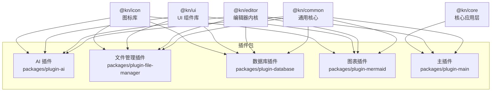
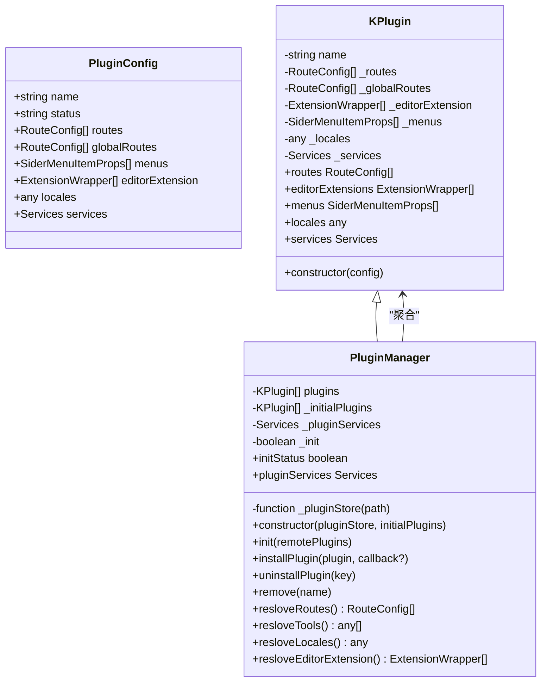
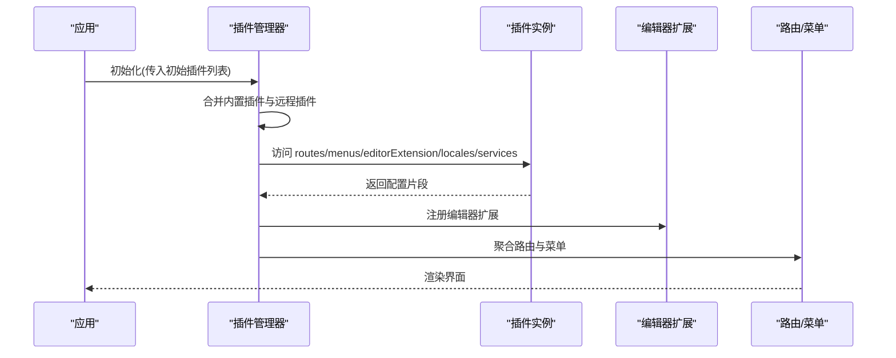
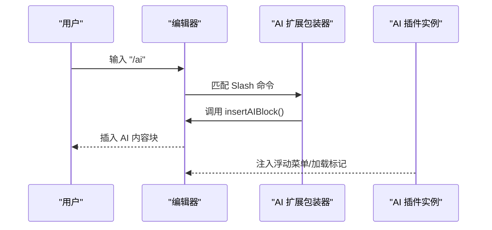
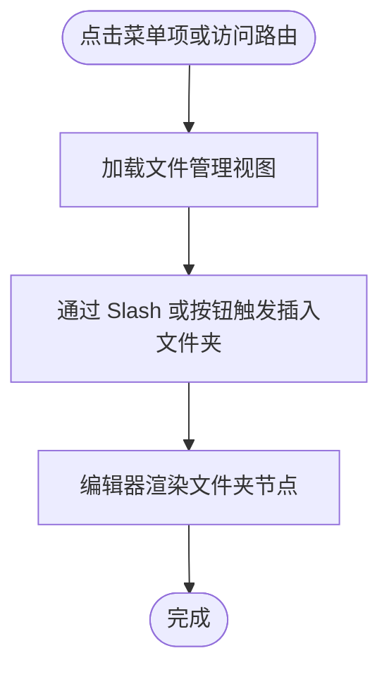
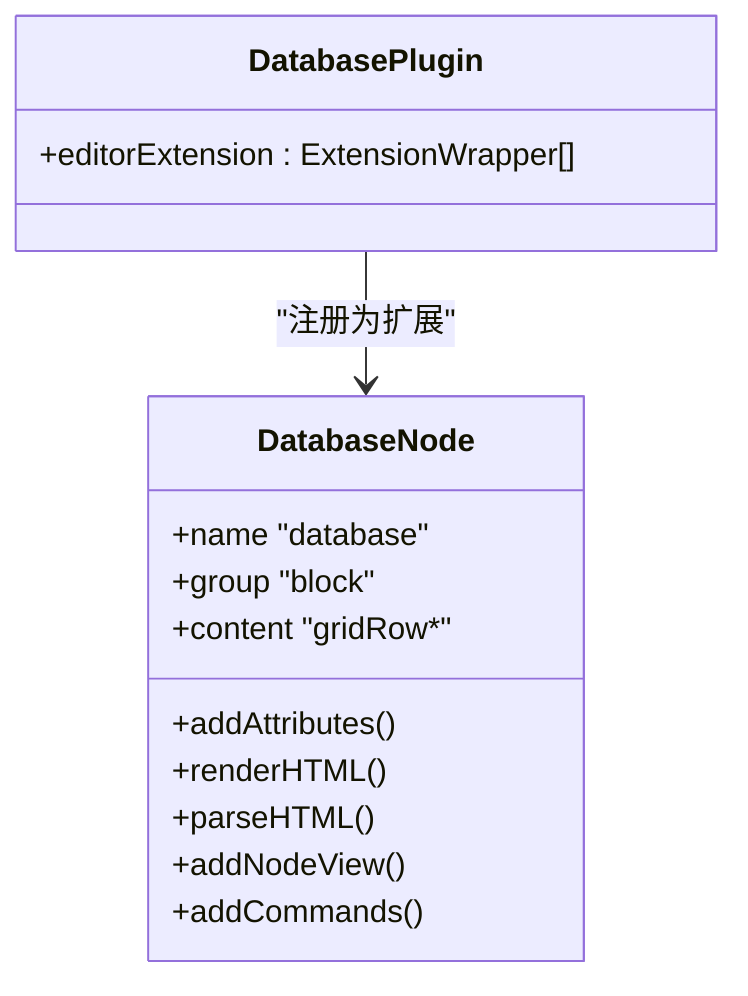
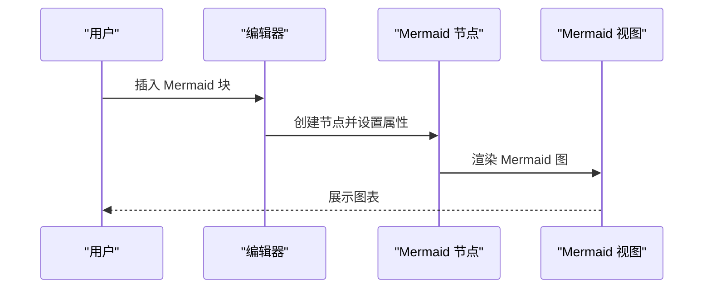
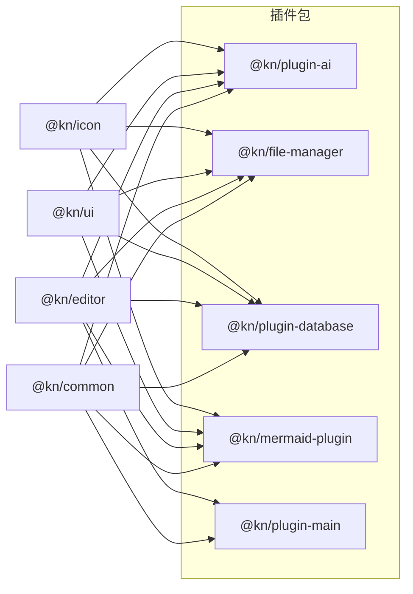

# 插件开发示例

<cite>
**本文引用的文件**
- [packages/plugin-ai/package.json](file://packages/plugin-ai/package.json)
- [packages/plugin-ai/src/index.tsx](file://packages/plugin-ai/src/index.tsx)
- [packages/plugin-ai/src/ai/index.tsx](file://packages/plugin-ai/src/ai/index.tsx)
- [packages/plugin-file-manager/package.json](file://packages/plugin-file-manager/package.json)
- [packages/plugin-file-manager/src/index.tsx](file://packages/plugin-file-manager/src/index.tsx)
- [packages/plugin-file-manager/src/editor-extensions/folder/index.tsx](file://packages/plugin-file-manager/src/editor-extensions/folder/index.tsx)
- [packages/plugin-database/package.json](file://packages/plugin-database/package.json)
- [packages/plugin-database/src/index.tsx](file://packages/plugin-database/src/index.tsx)
- [packages/plugin-database/src/database/database.ts](file://packages/plugin-database/src/database/database.ts)
- [packages/plugin-mermaid/package.json](file://packages/plugin-mermaid/package.json)
- [packages/plugin-mermaid/src/index.tsx](file://packages/plugin-mermaid/src/index.tsx)
- [packages/plugin-mermaid/src/editor-extension/mermaid/mermaid.ts](file://packages/plugin-mermaid/src/editor-extension/mermaid/mermaid.ts)
- [packages/plugin-main/src/index.tsx](file://packages/plugin-main/src/index.tsx)
- [packages/common/src/core/PluginManager.ts](file://packages/common/src/core/PluginManager.ts)
</cite>

## 目录
1. 引言
2. 项目结构
3. 核心组件
4. 架构总览
5. 详细组件分析
6. 依赖分析
7. 性能考虑
8. 故障排查指南
9. 结论
10. 附录

## 引言
本文件面向希望在现有知识库系统中开发插件的工程师与产品人员，提供从零到一的实践示例与模板思路。通过对官方插件（AI 插件、文件管理插件、数据库插件、图表插件）的源码解析，总结出可复用的插件开发模式：以统一的插件基类与插件管理器为核心，通过“编辑器扩展 + 路由 + 菜单 + 多语言 + 服务”的组合能力，快速构建从简单功能插件到复杂编辑器扩展插件。

## 项目结构
仓库采用多包工作区组织，插件位于 packages 下的独立包中，每个插件包均遵循一致的入口与构建约定：
- 每个插件包的入口文件通常位于 src/index.tsx，导出一个继承自通用插件基类的实例对象
- 插件包通过 package.json 的构建脚本使用 Rollup 进行打包
- 插件通过插件管理器聚合，支持动态安装/卸载与本地化资源合并

**图表来源**
- [packages/plugin-ai/package.json](file://packages/plugin-ai/package.json#L1-L31)
- [packages/plugin-file-manager/package.json](file://packages/plugin-file-manager/package.json#L1-L29)
- [packages/plugin-database/package.json](file://packages/plugin-database/package.json#L1-L35)
- [packages/plugin-mermaid/package.json](file://packages/plugin-mermaid/package.json#L1-L33)
- [packages/plugin-main/src/index.tsx](file://packages/plugin-main/src/index.tsx#L1-L118)

**章节来源**
- [packages/plugin-ai/package.json](file://packages/plugin-ai/package.json#L1-L31)
- [packages/plugin-file-manager/package.json](file://packages/plugin-file-manager/package.json#L1-L29)
- [packages/plugin-database/package.json](file://packages/plugin-database/package.json#L1-L35)
- [packages/plugin-mermaid/package.json](file://packages/plugin-mermaid/package.json#L1-L33)
- [packages/plugin-main/src/index.tsx](file://packages/plugin-main/src/index.tsx#L1-L118)

## 核心组件
- 插件基类与配置
  - 插件基类 KPlugin 提供统一的生命周期与属性访问器，包括路由、菜单、编辑器扩展、多语言与服务等
  - 插件配置接口 PluginConfig 定义了插件的基本字段与可选扩展点
- 插件管理器
  - PluginManager 负责插件的初始化、动态安装/卸载、路由与菜单的聚合、多语言合并以及服务合并
  - 支持远程插件加载与本地插件混合运行

**图表来源**
- [packages/common/src/core/PluginManager.ts](file://packages/common/src/core/PluginManager.ts#L1-L170)

**章节来源**
- [packages/common/src/core/PluginManager.ts](file://packages/common/src/core/PluginManager.ts#L1-L170)

## 架构总览
插件体系围绕“插件实例 + 插件管理器 + 编辑器扩展 + 应用路由/菜单/国际化/服务”协同工作：
- 插件实例负责声明自身的能力边界（路由、菜单、编辑器扩展、多语言、服务）
- 插件管理器负责装载与聚合，提供统一的查询与事件通知
- 编辑器扩展通过扩展包装器注入到编辑器内核，提供块级节点、浮动菜单、Slash 建议等
- 应用层通过插件管理器提供的聚合结果渲染页面、菜单与国际化文案

**图表来源**
- [packages/common/src/core/PluginManager.ts](file://packages/common/src/core/PluginManager.ts#L78-L170)
- [packages/plugin-ai/src/index.tsx](file://packages/plugin-ai/src/index.tsx#L1-L35)
- [packages/plugin-file-manager/src/index.tsx](file://packages/plugin-file-manager/src/index.tsx#L1-L38)
- [packages/plugin-database/src/index.tsx](file://packages/plugin-database/src/index.tsx#L1-L17)
- [packages/plugin-mermaid/src/index.tsx](file://packages/plugin-mermaid/src/index.tsx#L1-L17)

## 详细组件分析

### AI 插件：编辑器增强型插件
- 入口与配置
  - 在入口文件中导出一个继承自 KPlugin 的实例，声明编辑器扩展与多语言资源
- 编辑器扩展
  - 通过扩展包装器注册多个扩展（如 AI 文本生成、AI 图像生成、加载状态标记等），并提供浮动菜单与 Slash 建议
- 开发要点
  - 将编辑器命令与 UI 视图解耦，扩展包装器集中声明行为与交互
  - 利用多语言资源提升国际化体验

**图表来源**
- [packages/plugin-ai/src/ai/index.tsx](file://packages/plugin-ai/src/ai/index.tsx#L1-L42)
- [packages/plugin-ai/src/index.tsx](file://packages/plugin-ai/src/index.tsx#L1-L35)

**章节来源**
- [packages/plugin-ai/src/index.tsx](file://packages/plugin-ai/src/index.tsx#L1-L35)
- [packages/plugin-ai/src/ai/index.tsx](file://packages/plugin-ai/src/ai/index.tsx#L1-L42)

### 文件管理插件：路由+菜单+编辑器扩展
- 入口与配置
  - 导出插件实例，声明路由（如文件管理页面）、菜单项（如“文件管理”）与编辑器扩展（如插入文件夹、图片）
- 路由与菜单
  - 路由用于页面级导航；菜单用于侧边栏入口
- 编辑器扩展
  - 通过扩展包装器注册 Slash 命令，调用编辑器命令插入文件夹节点

**图表来源**
- [packages/plugin-file-manager/src/index.tsx](file://packages/plugin-file-manager/src/index.tsx#L1-L38)
- [packages/plugin-file-manager/src/editor-extensions/folder/index.tsx](file://packages/plugin-file-manager/src/editor-extensions/folder/index.tsx#L1-L28)

**章节来源**
- [packages/plugin-file-manager/src/index.tsx](file://packages/plugin-file-manager/src/index.tsx#L1-L38)
- [packages/plugin-file-manager/src/editor-extensions/folder/index.tsx](file://packages/plugin-file-manager/src/editor-extensions/folder/index.tsx#L1-L28)

### 数据库插件：块级节点与视图渲染
- 入口与配置
  - 导出插件实例，声明编辑器扩展（数据库块）
- 块级节点实现
  - 使用编辑器节点定义数据库块的属性、HTML 渲染、DOM 解析、节点视图与命令
  - 通过默认列配置与视图选项，支持表格/图表/日历等多种视图
- 开发要点
  - 将“节点定义 + 视图渲染 + 默认配置 + 编辑器命令”封装在一个扩展中，便于复用与维护

**图表来源**
- [packages/plugin-database/src/database/database.ts](file://packages/plugin-database/src/database/database.ts#L1-L120)
- [packages/plugin-database/src/index.tsx](file://packages/plugin-database/src/index.tsx#L1-L17)

**章节来源**
- [packages/plugin-database/src/index.tsx](file://packages/plugin-database/src/index.tsx#L1-L17)
- [packages/plugin-database/src/database/database.ts](file://packages/plugin-database/src/database/database.ts#L1-L120)

### 图表插件（Mermaid）：块级节点与可视化
- 入口与配置
  - 导出插件实例，声明编辑器扩展（Mermaid 节点）
- 节点实现
  - 定义 Mermaid 块的渲染、属性与插入命令，配合视图组件进行实时渲染
- 开发要点
  - 将第三方可视化库与编辑器节点绑定，提供统一的插入与渲染流程

**图表来源**
- [packages/plugin-mermaid/src/editor-extension/mermaid/mermaid.ts](file://packages/plugin-mermaid/src/editor-extension/mermaid/mermaid.ts#L1-L43)
- [packages/plugin-mermaid/src/index.tsx](file://packages/plugin-mermaid/src/index.tsx#L1-L17)

**章节来源**
- [packages/plugin-mermaid/src/index.tsx](file://packages/plugin-mermaid/src/index.tsx#L1-L17)
- [packages/plugin-mermaid/src/editor-extension/mermaid/mermaid.ts](file://packages/plugin-mermaid/src/editor-extension/mermaid/mermaid.ts#L1-L43)

### 主插件（默认插件）：页面路由与服务
- 入口与配置
  - 导出默认插件实例，声明首页、空间、页面等路由，侧边栏菜单，国际化资源，以及服务（如空间服务）
- 开发要点
  - 将页面级路由与菜单作为插件的核心能力，便于统一管理与扩展

**章节来源**
- [packages/plugin-main/src/index.tsx](file://packages/plugin-main/src/index.tsx#L1-L118)

## 依赖分析
- 插件包依赖
  - 所有插件包均依赖 @kn/common、@kn/editor、@kn/ui、@kn/icon 等通用包，确保统一的插件基类、编辑器扩展机制与 UI 能力
  - 部分插件引入额外依赖（如数据库插件的日期与表格库、图表插件的 mermaid 与编辑器库）
- 插件管理器依赖
  - 通过工具函数按路径加载远程插件脚本，聚合插件的服务与配置

**图表来源**
- [packages/plugin-ai/package.json](file://packages/plugin-ai/package.json#L1-L31)
- [packages/plugin-file-manager/package.json](file://packages/plugin-file-manager/package.json#L1-L29)
- [packages/plugin-database/package.json](file://packages/plugin-database/package.json#L1-L35)
- [packages/plugin-mermaid/package.json](file://packages/plugin-mermaid/package.json#L1-L33)
- [packages/plugin-main/src/index.tsx](file://packages/plugin-main/src/index.tsx#L1-L118)

**章节来源**
- [packages/plugin-ai/package.json](file://packages/plugin-ai/package.json#L1-L31)
- [packages/plugin-file-manager/package.json](file://packages/plugin-file-manager/package.json#L1-L29)
- [packages/plugin-database/package.json](file://packages/plugin-database/package.json#L1-L35)
- [packages/plugin-mermaid/package.json](file://packages/plugin-mermaid/package.json#L1-L33)
- [packages/plugin-main/src/index.tsx](file://packages/plugin-main/src/index.tsx#L1-L118)

## 性能考虑
- 动态加载与懒加载
  - 插件管理器支持远程插件的动态加载，建议对大型插件（如数据库、图表）采用按需加载策略，减少首屏开销
- 扩展聚合与去重
  - 插件管理器聚合编辑器扩展时，应避免重复注册相同扩展，必要时在插件层做去重处理
- 视图渲染优化
  - 对于复杂视图（如数据库表格、Mermaid 图），建议在视图层加入节流/防抖与虚拟滚动等优化手段
- 国际化合并
  - 多语言资源合并时注意键名冲突，建议在插件命名空间下组织翻译键

## 故障排查指南
- 插件未生效
  - 检查插件是否正确注册到插件管理器的初始列表
  - 确认插件的 editorExtension 是否被正确注入到编辑器
- 路由/菜单不显示
  - 核对插件 routes 与 menus 字段是否正确返回
  - 确认插件管理器已调用聚合方法（如 resloveRoutes/resloveMenus）
- 动态安装失败
  - 检查远程插件资源路径与缓存参数
  - 确认 importScript 加载成功且导出的插件实例符合 KPlugin 接口
- 编辑器命令无效
  - 检查扩展包装器中的命令映射是否与编辑器命令一致
  - 确认扩展已在编辑器初始化阶段注册

**章节来源**
- [packages/common/src/core/PluginManager.ts](file://packages/common/src/core/PluginManager.ts#L78-L170)

## 结论
通过统一的插件基类与插件管理器，官方插件展示了“编辑器扩展 + 页面路由 + 菜单 + 多语言 + 服务”的完整能力闭环。开发者可以据此快速搭建从简单功能插件到复杂编辑器扩展插件，同时保持良好的可维护性与扩展性。

## 附录

### 插件项目模板（步骤式）
- 项目初始化
  - 新建包目录，添加 package.json，配置构建脚本与依赖（依赖 common/editor/ui/icon 等）
- 入口文件
  - 在 src/index.tsx 中导出一个继承自 KPlugin 的实例，声明 name/status 与可选的 routes/menus/editorExtension/locales/services
- 编辑器扩展（可选）
  - 定义扩展包装器，注册扩展、浮动菜单、Slash 建议与编辑器命令
- 路由与菜单（可选）
  - 在插件配置中声明路由与菜单项，确保与应用路由系统兼容
- 多语言与服务（可选）
  - 提供多语言资源与服务对象，交由插件管理器合并
- 构建与发布
  - 使用 Rollup 打包，遵循统一的 dist 输出结构

**章节来源**
- [packages/plugin-ai/package.json](file://packages/plugin-ai/package.json#L1-L31)
- [packages/plugin-file-manager/package.json](file://packages/plugin-file-manager/package.json#L1-L29)
- [packages/plugin-database/package.json](file://packages/plugin-database/package.json#L1-L35)
- [packages/plugin-mermaid/package.json](file://packages/plugin-mermaid/package.json#L1-L33)
- [packages/plugin-main/src/index.tsx](file://packages/plugin-main/src/index.tsx#L1-L118)

### 分步教程（从简单到复杂）
- 简单功能插件（仅路由/菜单）
  - 参考主插件的路由与菜单声明方式，快速接入页面与入口
- 编辑器增强插件（扩展包装器）
  - 参考 AI 插件的扩展包装器，注册多个扩展与 Slash 命令
- 复杂编辑器扩展插件（块级节点）
  - 参考数据库与 Mermaid 插件，定义节点属性、视图渲染与默认配置

**章节来源**
- [packages/plugin-main/src/index.tsx](file://packages/plugin-main/src/index.tsx#L1-L118)
- [packages/plugin-ai/src/ai/index.tsx](file://packages/plugin-ai/src/ai/index.tsx#L1-L42)
- [packages/plugin-database/src/database/database.ts](file://packages/plugin-database/src/database/database.ts#L1-L120)
- [packages/plugin-mermaid/src/editor-extension/mermaid/mermaid.ts](file://packages/plugin-mermaid/src/editor-extension/mermaid/mermaid.ts#L1-L43)

### 最佳实践与代码规范
- 统一命名
  - 插件实例命名为小驼峰，插件包名使用语义化前缀（如 @kn/plugin-xxx）
- 配置清晰
  - 将路由、菜单、扩展、多语言、服务分别组织，避免混杂
- 扩展解耦
  - 将 UI 视图与编辑器命令分离，通过扩展包装器集中管理
- 动态加载
  - 对大型插件采用按需加载，减少初始化体积
- 国际化键规范
  - 使用插件名作为命名空间，避免键冲突