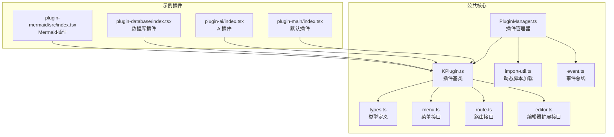
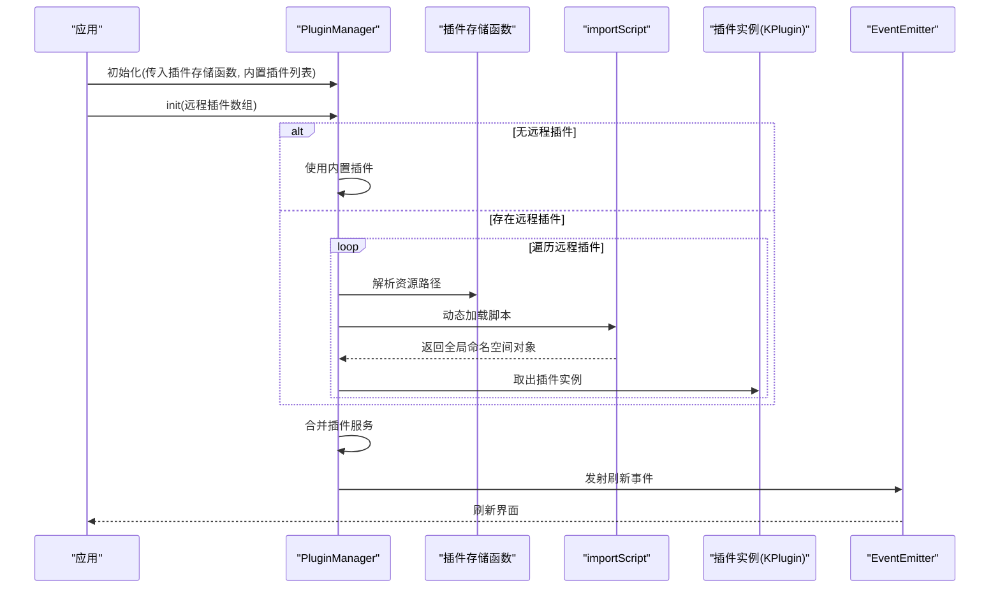
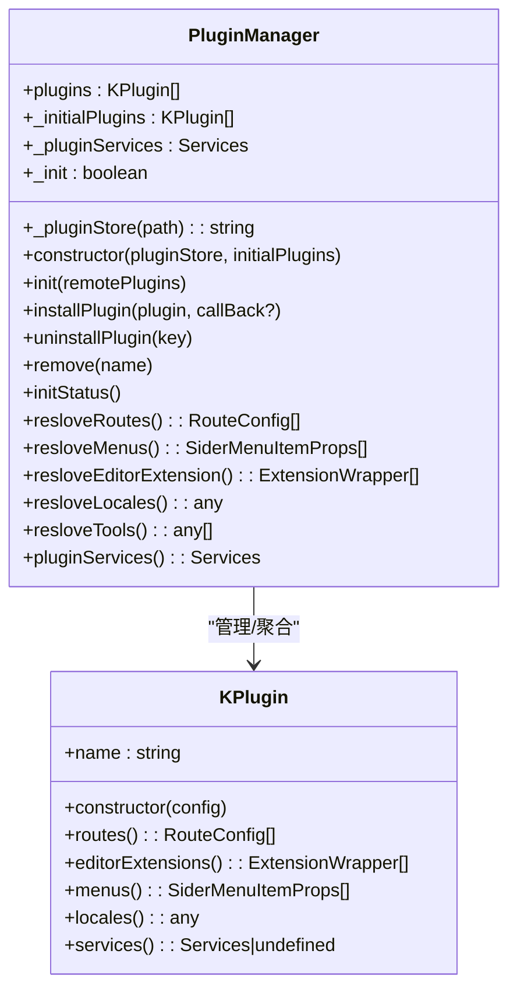
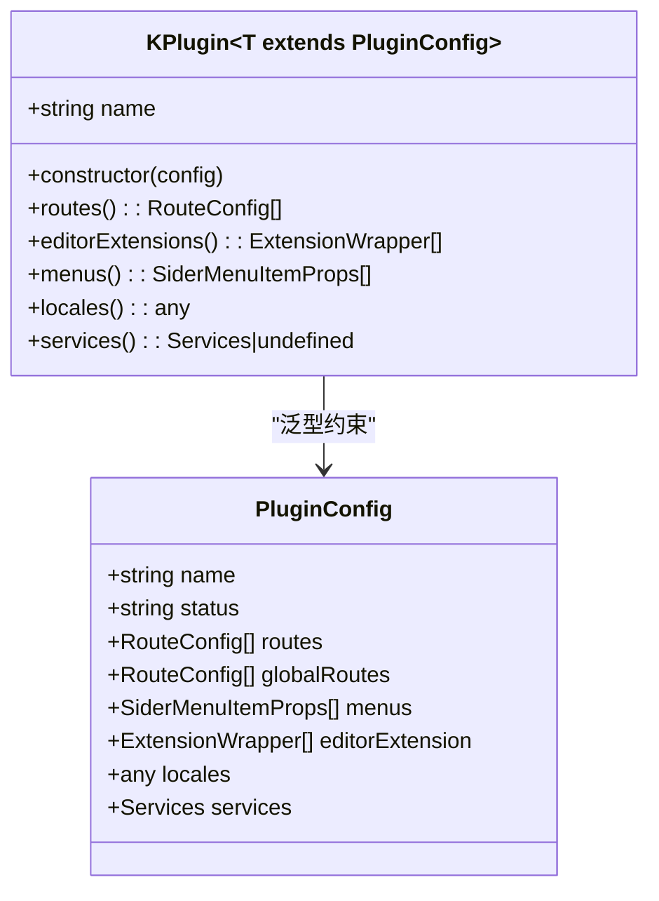
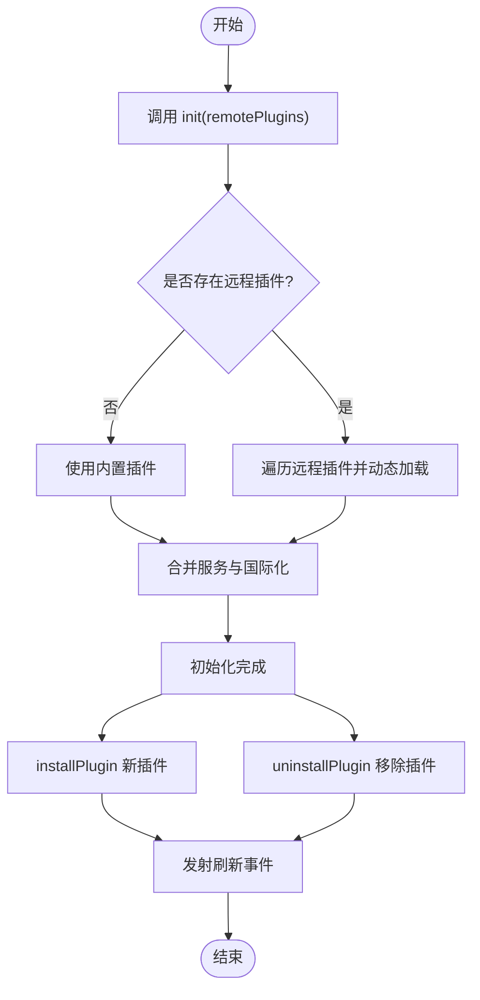
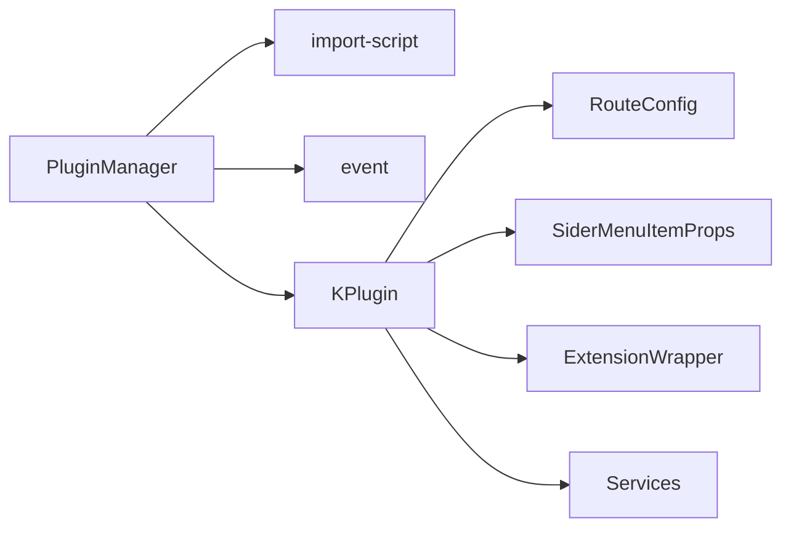

# 插件架构设计

<cite>
**本文引用的文件**
- [packages/common/src/core/PluginManager.ts](file://packages/common/src/core/PluginManager.ts)
- [packages/common/src/core/types.ts](file://packages/common/src/core/types.ts)
- [packages/common/src/core/menu.ts](file://packages/common/src/core/menu.ts)
- [packages/common/src/core/route.ts](file://packages/common/src/core/route.ts)
- [packages/common/src/core/editor.ts](file://packages/common/src/core/editor.ts)
- [packages/common/src/utils/import-util.ts](file://packages/common/src/utils/import-util.ts)
- [packages/common/src/event/event.ts](file://packages/common/src/event/event.ts)
- [packages/plugin-main/src/index.tsx](file://packages/plugin-main/src/index.tsx)
- [packages/plugin-ai/src/index.tsx](file://packages/plugin-ai/src/index.tsx)
- [packages/plugin-database/src/index.tsx](file://packages/plugin-database/src/index.tsx)
- [packages/plugin-mermaid/src/index.tsx](file://packages/plugin-mermaid/src/index.tsx)
</cite>

## 目录
1. [引言](#引言)
2. [项目结构](#项目结构)
3. [核心组件](#核心组件)
4. [架构总览](#架构总览)
5. [详细组件分析](#详细组件分析)
6. [依赖关系分析](#依赖关系分析)
7. [性能考量](#性能考量)
8. [故障排查指南](#故障排查指南)
9. [结论](#结论)
10. [附录](#附录)

## 引言
本技术文档围绕知识库管理系统的插件架构进行系统化梳理，重点阐述以下内容：
- PluginManager 类的设计理念与职责边界
- KPlugin 基类的结构与配置接口 PluginConfig 的规范
- 插件生命周期（初始化、加载、激活、卸载）的完整流程
- 插件配置体系：路由配置、菜单配置、编辑器扩展配置、国际化配置
- 插件服务注册与依赖注入机制
- 插件间通信方式与事件驱动模型
- 最佳实践与设计模式，帮助开发者构建可维护、可扩展的插件系统

## 项目结构
插件系统位于公共包 common 中，核心代码集中在 core 目录；各具体插件位于 packages 下独立包中，通过统一的 KPlugin 和 PluginManager 进行装配与运行时合并。

图表来源
- [packages/common/src/core/PluginManager.ts](file://packages/common/src/core/PluginManager.ts#L63-L170)
- [packages/common/src/core/types.ts](file://packages/common/src/core/types.ts#L1-L4)
- [packages/common/src/core/menu.ts](file://packages/common/src/core/menu.ts#L1-L25)
- [packages/common/src/core/route.ts](file://packages/common/src/core/route.ts#L1-L8)
- [packages/common/src/core/editor.ts](file://packages/common/src/core/editor.ts#L1-L31)
- [packages/common/src/utils/import-util.ts](file://packages/common/src/utils/import-util.ts#L1-L23)
- [packages/common/src/event/event.ts](file://packages/common/src/event/event.ts#L1-L44)
- [packages/plugin-main/src/index.tsx](file://packages/plugin-main/src/index.tsx#L1-L118)
- [packages/plugin-ai/src/index.tsx](file://packages/plugin-ai/src/index.tsx#L1-L35)
- [packages/plugin-database/src/index.tsx](file://packages/plugin-database/src/index.tsx#L1-L17)
- [packages/plugin-mermaid/src/index.tsx](file://packages/plugin-mermaid/src/index.tsx#L1-L17)

章节来源
- [packages/common/src/core/PluginManager.ts](file://packages/common/src/core/PluginManager.ts#L63-L170)
- [packages/common/src/core/types.ts](file://packages/common/src/core/types.ts#L1-L4)
- [packages/common/src/core/menu.ts](file://packages/common/src/core/menu.ts#L1-L25)
- [packages/common/src/core/route.ts](file://packages/common/src/core/route.ts#L1-L8)
- [packages/common/src/core/editor.ts](file://packages/common/src/core/editor.ts#L1-L31)
- [packages/common/src/utils/import-util.ts](file://packages/common/src/utils/import-util.ts#L1-L23)
- [packages/common/src/event/event.ts](file://packages/common/src/event/event.ts#L1-L44)
- [packages/plugin-main/src/index.tsx](file://packages/plugin-main/src/index.tsx#L1-L118)
- [packages/plugin-ai/src/index.tsx](file://packages/plugin-ai/src/index.tsx#L1-L35)
- [packages/plugin-database/src/index.tsx](file://packages/plugin-database/src/index.tsx#L1-L17)
- [packages/plugin-mermaid/src/index.tsx](file://packages/plugin-mermaid/src/index.tsx#L1-L17)

## 核心组件
- PluginManager：负责插件的远程/本地加载、安装、卸载、服务合并与配置解析（路由、菜单、编辑器扩展、国际化）。支持事件通知刷新界面。
- KPlugin：插件基类，封装插件名称、状态及各类配置项（路由、菜单、编辑器扩展、国际化、服务），提供只读访问器。
- PluginConfig：插件配置接口，定义 name、status 以及可选的 routes、globalRoutes、menus、editorExtension、locales、services 等字段。
- ExtensionWrapper：编辑器扩展包装器，承载扩展、菜单、浮动菜单、slash菜单、工具等能力。
- SiderMenuItemProps：侧边栏菜单项接口，支持分组、图标、点击回调、子菜单等。
- RouteConfig：路由配置接口，支持路径、名称、元素与子路由。
- Services：服务契约占位，用于插件间共享服务。
- importScript：动态加载插件脚本并缓存，返回全局命名空间中的插件导出对象。
- EventEmitter：轻量事件总线，用于插件安装/卸载后的界面刷新通知。

章节来源
- [packages/common/src/core/PluginManager.ts](file://packages/common/src/core/PluginManager.ts#L9-L170)
- [packages/common/src/core/types.ts](file://packages/common/src/core/types.ts#L1-L4)
- [packages/common/src/core/menu.ts](file://packages/common/src/core/menu.ts#L1-L25)
- [packages/common/src/core/route.ts](file://packages/common/src/core/route.ts#L1-L8)
- [packages/common/src/core/editor.ts](file://packages/common/src/core/editor.ts#L1-L31)
- [packages/common/src/utils/import-util.ts](file://packages/common/src/utils/import-util.ts#L1-L23)
- [packages/common/src/event/event.ts](file://packages/common/src/event/event.ts#L1-L44)

## 架构总览
插件系统采用“声明式配置 + 运行时聚合”的架构模式：
- 插件以独立包形式存在，每个插件导出一个 KPlugin 实例，包含自身配置（路由、菜单、编辑器扩展、国际化、服务）。
- 应用启动时，PluginManager 负责加载内置插件与远程插件，合并服务与配置，并通过事件通知界面刷新。
- 编辑器扩展通过 ExtensionWrapper 统一包装，便于在运行时注入 TipTap 编辑器。
- 国际化配置按插件维度聚合，最终形成全局语言包。

图表来源
- [packages/common/src/core/PluginManager.ts](file://packages/common/src/core/PluginManager.ts#L78-L112)
- [packages/common/src/utils/import-util.ts](file://packages/common/src/utils/import-util.ts#L1-L23)
- [packages/common/src/event/event.ts](file://packages/common/src/event/event.ts#L1-L44)

## 详细组件分析

### PluginManager 类分析
- 职责
  - 插件生命周期管理：init、installPlugin、uninstallPlugin、remove
  - 配置解析：resloveRoutes、resloveMenus、resloveEditorExtension、resloveLocales、resloveTools
  - 服务合并：pluginServices
  - 事件通知：REFRESH_PLUSINS
- 关键方法
  - init：支持内置与远程插件混合加载，远程插件通过 importScript 动态加载并缓存
  - installPlugin：动态安装新插件，更新插件列表与服务集合
  - uninstallPlugin/remove：移除插件并触发界面刷新
  - reslove*：聚合各插件配置，返回全局可用的路由、菜单、编辑器扩展、国际化与工具列表
- 设计要点
  - 使用 lodash.merge 合并服务与国际化，避免覆盖
  - 通过事件总线解耦界面刷新逻辑
  - 仅暴露只读访问器，保证配置不可变性

图表来源
- [packages/common/src/core/PluginManager.ts](file://packages/common/src/core/PluginManager.ts#L63-L170)
- [packages/common/src/core/PluginManager.ts](file://packages/common/src/core/PluginManager.ts#L21-L62)

章节来源
- [packages/common/src/core/PluginManager.ts](file://packages/common/src/core/PluginManager.ts#L63-L170)

### KPlugin 基类与 PluginConfig 接口
- KPlugin
  - 封装插件名称与配置项，提供只读访问器，确保配置在运行期不被修改
  - 支持 routes、menus、editorExtensions、locales、services 等字段
- PluginConfig
  - 必填字段：name、status
  - 可选字段：routes、globalRoutes、menus、editorExtension、locales、services
- 设计模式
  - 工厂/装配：每个插件以独立包导出单例实例，遵循统一接口
  - 配置驱动：通过配置决定插件行为（路由、菜单、编辑器扩展、国际化）

图表来源
- [packages/common/src/core/PluginManager.ts](file://packages/common/src/core/PluginManager.ts#L9-L62)
- [packages/common/src/core/route.ts](file://packages/common/src/core/route.ts#L1-L8)
- [packages/common/src/core/menu.ts](file://packages/common/src/core/menu.ts#L1-L25)
- [packages/common/src/core/editor.ts](file://packages/common/src/core/editor.ts#L1-L31)
- [packages/common/src/core/types.ts](file://packages/common/src/core/types.ts#L1-L4)

章节来源
- [packages/common/src/core/PluginManager.ts](file://packages/common/src/core/PluginManager.ts#L9-L62)

### 插件生命周期管理
- 初始化
  - 传入插件存储函数与内置插件列表
  - 若无远程插件，直接使用内置插件；否则动态加载远程插件
- 激活
  - 合并插件服务与国际化配置
  - 设置初始化完成标志
- 安装
  - 动态加载新插件脚本，注入到插件列表与服务集合
  - 触发界面刷新事件
- 卸载
  - 从插件列表移除指定插件，触发界面刷新事件

图表来源
- [packages/common/src/core/PluginManager.ts](file://packages/common/src/core/PluginManager.ts#L78-L112)
- [packages/common/src/utils/import-util.ts](file://packages/common/src/utils/import-util.ts#L1-L23)
- [packages/common/src/event/event.ts](file://packages/common/src/event/event.ts#L1-L44)

章节来源
- [packages/common/src/core/PluginManager.ts](file://packages/common/src/core/PluginManager.ts#L78-L112)
- [packages/common/src/utils/import-util.ts](file://packages/common/src/utils/import-util.ts#L1-L23)
- [packages/common/src/event/event.ts](file://packages/common/src/event/event.ts#L1-L44)

### 插件配置系统工作原理
- 路由配置（RouteConfig）
  - 插件通过 routes/globalRoutes 提供页面级路由，PluginManager 聚合后注入应用路由表
- 菜单配置（SiderMenuItemProps）
  - 插件通过 menus 提供侧边栏菜单项，支持图标、分组、子菜单、点击回调等
- 编辑器扩展配置（ExtensionWrapper）
  - 插件通过 editorExtension 提供 TipTap 扩展，支持气泡菜单、slash菜单、浮动菜单、工具等
- 国际化配置（locales）
  - 插件通过 locales 提供多语言翻译，PluginManager 聚合后形成全局语言包

章节来源
- [packages/common/src/core/route.ts](file://packages/common/src/core/route.ts#L1-L8)
- [packages/common/src/core/menu.ts](file://packages/common/src/core/menu.ts#L1-L25)
- [packages/common/src/core/editor.ts](file://packages/common/src/core/editor.ts#L1-L31)
- [packages/common/src/core/PluginManager.ts](file://packages/common/src/core/PluginManager.ts#L122-L169)

### 插件服务注册与依赖注入机制
- 服务注册
  - 插件在构造时通过 services 字段提供服务对象
  - PluginManager 在初始化与安装时合并服务集合
- 依赖注入
  - 通过 Services 契约抽象，插件间可通过统一的服务名访问所需能力
  - 注意：当前 Services 为空接口，实际注入需在插件实现中填充具体服务

章节来源
- [packages/common/src/core/types.ts](file://packages/common/src/core/types.ts#L1-L4)
- [packages/common/src/core/PluginManager.ts](file://packages/common/src/core/PluginManager.ts#L82-L96)
- [packages/common/src/core/PluginManager.ts](file://packages/common/src/core/PluginManager.ts#L105-L112)

### 插件间通信方式
- 事件驱动
  - PluginManager 在安装/卸载插件后发射 REFRESH_PLUSINS 事件
  - 订阅该事件的组件负责刷新界面，实现松耦合通信
- 共享服务
  - 通过 pluginServices 合并的服务集合，插件可共享能力（需在插件实现中定义）

章节来源
- [packages/common/src/event/event.ts](file://packages/common/src/event/event.ts#L1-L44)
- [packages/common/src/core/PluginManager.ts](file://packages/common/src/core/PluginManager.ts#L99-L112)

### 示例插件实现
- 默认插件（plugin-main）
  - 提供首页、空间、页面浏览/编辑、设置等路由
  - 提供侧边栏菜单
  - 注册 spaceService 服务
  - 提供中英文国际化配置
- AI 插件（plugin-ai）
  - 提供编辑器扩展与国际化
- 数据库插件（plugin-database）
  - 提供编辑器扩展
- Mermaid 插件（plugin-mermaid）
  - 提供编辑器扩展

章节来源
- [packages/plugin-main/src/index.tsx](file://packages/plugin-main/src/index.tsx#L1-L118)
- [packages/plugin-ai/src/index.tsx](file://packages/plugin-ai/src/index.tsx#L1-L35)
- [packages/plugin-database/src/index.tsx](file://packages/plugin-database/src/index.tsx#L1-L17)
- [packages/plugin-mermaid/src/index.tsx](file://packages/plugin-mermaid/src/index.tsx#L1-L17)

## 依赖关系分析
- 组件耦合
  - PluginManager 依赖 importScript 与 EventEmitter，实现动态加载与事件通知
  - KPlugin 依赖路由、菜单、编辑器扩展与服务类型定义
- 外部依赖
  - lodash.merge 用于深合并服务与国际化
  - @tiptap/core 用于编辑器扩展
  - React 用于 UI 与组件生态

图表来源
- [packages/common/src/core/PluginManager.ts](file://packages/common/src/core/PluginManager.ts#L1-L170)
- [packages/common/src/utils/import-util.ts](file://packages/common/src/utils/import-util.ts#L1-L23)
- [packages/common/src/event/event.ts](file://packages/common/src/event/event.ts#L1-L44)
- [packages/common/src/core/route.ts](file://packages/common/src/core/route.ts#L1-L8)
- [packages/common/src/core/menu.ts](file://packages/common/src/core/menu.ts#L1-L25)
- [packages/common/src/core/editor.ts](file://packages/common/src/core/editor.ts#L1-L31)
- [packages/common/src/core/types.ts](file://packages/common/src/core/types.ts#L1-L4)

章节来源
- [packages/common/src/core/PluginManager.ts](file://packages/common/src/core/PluginManager.ts#L1-L170)
- [packages/common/src/utils/import-util.ts](file://packages/common/src/utils/import-util.ts#L1-L23)
- [packages/common/src/event/event.ts](file://packages/common/src/event/event.ts#L1-L44)

## 性能考量
- 动态脚本加载
  - importScript 对同一 URL 使用缓存，避免重复下载与执行
  - 加载完成后立即移除 script 节点，减少 DOM 压力
- 配置聚合
  - 使用合并策略聚合服务与国际化，避免重复遍历
- 事件通知
  - 通过事件总线集中刷新界面，避免分散更新导致的多次重渲染

章节来源
- [packages/common/src/utils/import-util.ts](file://packages/common/src/utils/import-util.ts#L1-L23)
- [packages/common/src/core/PluginManager.ts](file://packages/common/src/core/PluginManager.ts#L82-L96)
- [packages/common/src/event/event.ts](file://packages/common/src/event/event.ts#L1-L44)

## 故障排查指南
- 插件未生效
  - 检查插件是否正确导出 KPlugin 实例并包含 name/status
  - 确认 PluginManager.init 是否被调用且远程插件路径有效
- 路由不显示
  - 核对 routes/globalRoutes 配置是否正确，路径与元素是否有效
- 菜单不显示
  - 核对 menus 配置是否正确，图标与 key 是否唯一
- 编辑器扩展无效
  - 检查 editorExtension 是否为有效的 ExtensionWrapper 数组
- 国际化缺失
  - 确认 locales 结构正确，语言键名与翻译键一致
- 事件未触发界面刷新
  - 检查 REFRESH_PLUSINS 事件订阅是否正确绑定

章节来源
- [packages/common/src/core/PluginManager.ts](file://packages/common/src/core/PluginManager.ts#L78-L112)
- [packages/common/src/event/event.ts](file://packages/common/src/event/event.ts#L1-L44)

## 结论
该插件架构以 KPlugin 为核心，通过 PluginManager 实现插件的声明式配置与运行时聚合，结合动态脚本加载与事件总线，实现了高内聚、低耦合的插件系统。建议在后续版本中：
- 明确 Services 接口，提供标准化的服务契约
- 增加插件依赖声明与加载顺序控制
- 提供插件健康检查与错误隔离机制
- 增强国际化与主题的模块化管理

## 附录
- 最佳实践
  - 插件应保持无副作用，配置即契约
  - 服务注册应遵循最小暴露原则，避免污染全局命名空间
  - 路由与菜单应具备唯一标识，避免冲突
  - 编辑器扩展应模块化，支持按需加载
  - 国际化键名应语义化，避免硬编码字符串