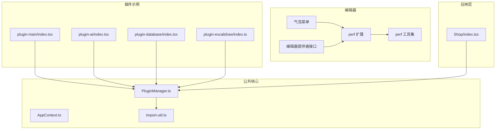
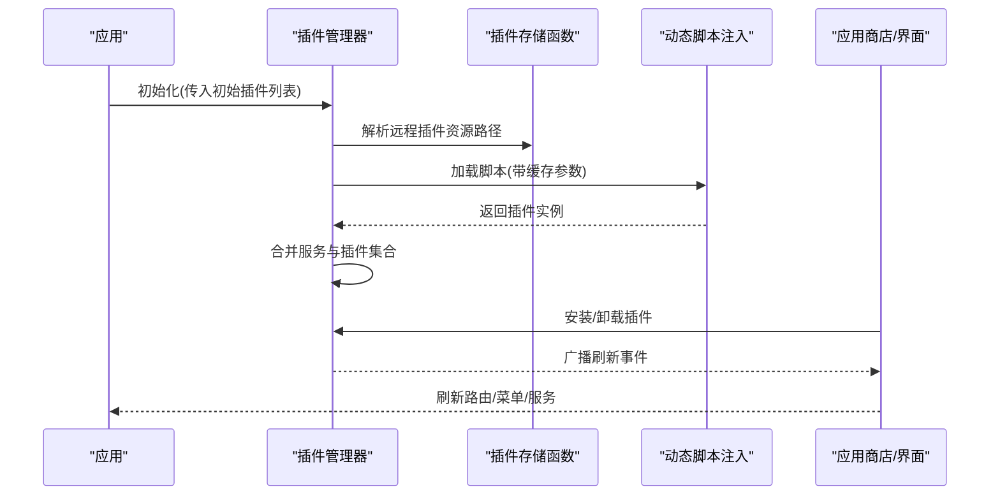
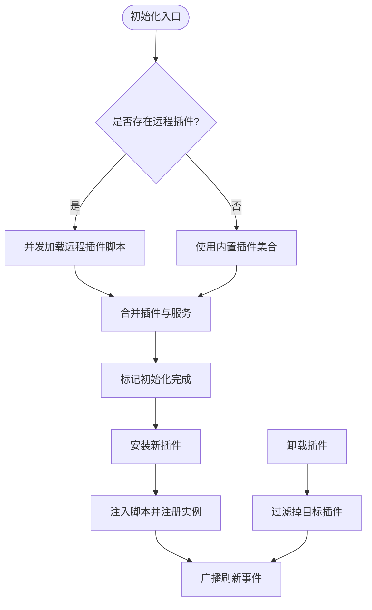
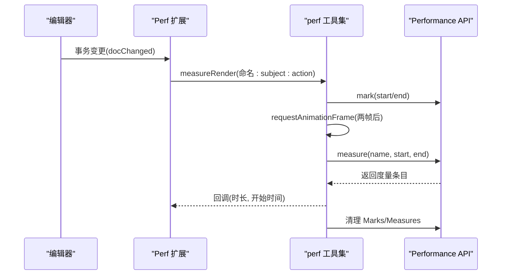
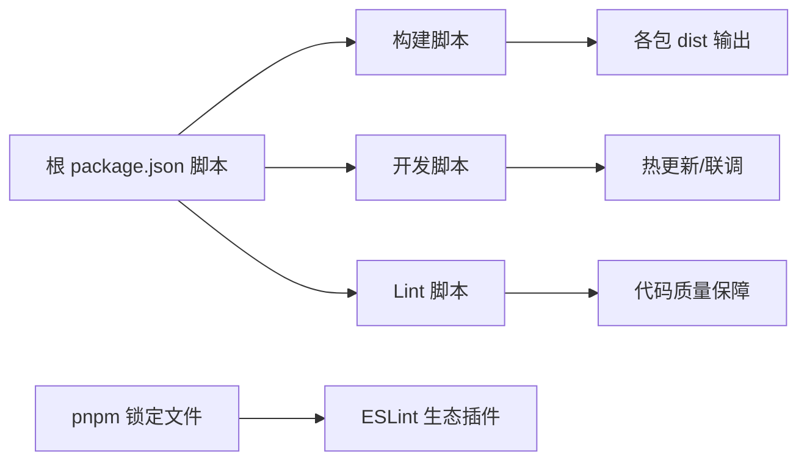

# 插件测试与调试

<cite>
**本文引用的文件**
- [packages/common/src/core/PluginManager.ts](file://packages/common/src/core/PluginManager.ts)
- [packages/common/src/utils/import-util.ts](file://packages/common/src/utils/import-util.ts)
- [packages/common/src/core/AppContext.ts](file://packages/common/src/core/AppContext.ts)
- [packages/plugin-main/src/index.tsx](file://packages/plugin-main/src/index.tsx)
- [packages/plugin-ai/src/index.tsx](file://packages/plugin-ai/src/index.tsx)
- [packages/plugin-database/src/index.tsx](file://packages/plugin-database/src/index.tsx)
- [packages/plugin-excalidraw/src/index.ts](file://packages/plugin-excalidraw/src/index.ts)
- [packages/core/src/components/Shop/index.tsx](file://packages/core/src/components/Shop/index.tsx)
- [packages/editor/src/extensions/perf/utilities.ts](file://packages/editor/src/extensions/perf/utilities.ts)
- [packages/editor/src/extensions/perf/perf.ts](file://packages/editor/src/extensions/perf/perf.ts)
- [packages/editor/src/editor/provider.ts](file://packages/editor/src/editor/provider.ts)
- [packages/editor/src/components/bubble-menu.tsx](file://packages/editor/src/components/bubble-menu.tsx)
- [package.json](file://package.json)
- [pnpm-lock.yaml](file://pnpm-lock.yaml)
</cite>

## 目录
1. [引言](#引言)
2. [项目结构](#项目结构)
3. [核心组件](#核心组件)
4. [架构总览](#架构总览)
5. [详细组件分析](#详细组件分析)
6. [依赖分析](#依赖分析)
7. [性能考虑](#性能考虑)
8. [故障排查指南](#故障排查指南)
9. [结论](#结论)
10. [附录](#附录)

## 引言
本指南面向插件开发者，围绕“测试与调试”主题，系统阐述插件开发过程中的测试策略（单元测试、集成测试、端到端测试）、调试工具与技巧（浏览器开发者工具、日志与断点）、性能监控与优化（内存泄漏检测、渲染性能分析、网络请求优化），以及发布前质量保证流程与最佳实践。文档以仓库现有代码为依据，结合插件加载、动态脚本注入、编辑器扩展与性能测量等实现，给出可操作的建议与流程图示。

## 项目结构
本仓库采用多包工作区组织，插件体系的关键模块分布如下：
- 公共核心：插件管理器、类型定义、上下文导出
- 编辑器内核与扩展：编辑器提供者接口、气泡菜单、性能测量扩展
- 插件示例：默认插件、AI 插件、数据库插件、Excalidraw 插件
- 应用商店与安装界面：插件安装、卸载、刷新事件
- 工程脚本与依赖：构建、打包、测试相关工具链

图表来源
- [packages/common/src/core/PluginManager.ts](file://packages/common/src/core/PluginManager.ts#L1-L170)
- [packages/common/src/utils/import-util.ts](file://packages/common/src/utils/import-util.ts#L1-L23)
- [packages/common/src/core/AppContext.ts](file://packages/common/src/core/AppContext.ts#L1-L13)
- [packages/plugin-main/src/index.tsx](file://packages/plugin-main/src/index.tsx#L1-L118)
- [packages/plugin-ai/src/index.tsx](file://packages/plugin-ai/src/index.tsx#L1-L35)
- [packages/plugin-database/src/index.tsx](file://packages/plugin-database/src/index.tsx#L1-L17)
- [packages/plugin-excalidraw/src/index.ts](file://packages/plugin-excalidraw/src/index.ts#L1-L19)
- [packages/core/src/components/Shop/index.tsx](file://packages/core/src/components/Shop/index.tsx#L75-L114)
- [packages/editor/src/extensions/perf/perf.ts](file://packages/editor/src/extensions/perf/perf.ts#L1-L41)
- [packages/editor/src/extensions/perf/utilities.ts](file://packages/editor/src/extensions/perf/utilities.ts#L1-L133)
- [packages/editor/src/editor/provider.ts](file://packages/editor/src/editor/provider.ts#L1-L53)
- [packages/editor/src/components/bubble-menu.tsx](file://packages/editor/src/components/bubble-menu.tsx#L1-L84)

章节来源
- [package.json](file://package.json#L1-L103)
- [pnpm-lock.yaml](file://pnpm-lock.yaml#L6180-L14337)

## 核心组件
- 插件管理器：负责插件初始化、远程插件动态加载、安装/卸载、路由与菜单解析、服务合并与事件广播。
- 动态脚本注入：通过脚本标签异步加载插件资源，并缓存已加载模块。
- 应用上下文：向消费方暴露插件管理器实例。
- 性能测量扩展：基于浏览器 Performance API 的渲染时长测量与事务分析。
- 编辑器提供者接口：统一用户、文件等外部能力接入点。
- 气泡菜单：编辑器交互 UI，支持节点级与普通气泡菜单。

章节来源
- [packages/common/src/core/PluginManager.ts](file://packages/common/src/core/PluginManager.ts#L1-L170)
- [packages/common/src/utils/import-util.ts](file://packages/common/src/utils/import-util.ts#L1-L23)
- [packages/common/src/core/AppContext.ts](file://packages/common/src/core/AppContext.ts#L1-L13)
- [packages/editor/src/extensions/perf/utilities.ts](file://packages/editor/src/extensions/perf/utilities.ts#L1-L133)
- [packages/editor/src/editor/provider.ts](file://packages/editor/src/editor/provider.ts#L1-L53)
- [packages/editor/src/components/bubble-menu.tsx](file://packages/editor/src/components/bubble-menu.tsx#L1-L84)

## 架构总览
下图展示插件生命周期与关键交互：应用启动时初始化插件管理器；远程插件通过统一存储函数解析路径并动态注入；安装/卸载触发事件刷新应用状态；编辑器侧通过性能扩展记录渲染耗时。

图表来源
- [packages/common/src/core/PluginManager.ts](file://packages/common/src/core/PluginManager.ts#L78-L112)
- [packages/common/src/utils/import-util.ts](file://packages/common/src/utils/import-util.ts#L1-L23)
- [packages/core/src/components/Shop/index.tsx](file://packages/core/src/components/Shop/index.tsx#L104-L114)

## 详细组件分析

### 插件管理器与动态加载
- 初始化流程：若无远程插件则直接使用内置插件；否则批量加载远程插件并合并服务。
- 安装/卸载：通过脚本注入新增插件，卸载后广播刷新事件。
- 路由/菜单/扩展解析：聚合各插件的路由、菜单与编辑器扩展，供上层使用。
- 服务合并：使用浅合并策略合并插件提供的服务对象。

图表来源
- [packages/common/src/core/PluginManager.ts](file://packages/common/src/core/PluginManager.ts#L78-L112)

章节来源
- [packages/common/src/core/PluginManager.ts](file://packages/common/src/core/PluginManager.ts#L1-L170)
- [packages/common/src/utils/import-util.ts](file://packages/common/src/utils/import-util.ts#L1-L23)
- [packages/core/src/components/Shop/index.tsx](file://packages/core/src/components/Shop/index.tsx#L104-L114)

### 插件示例与配置
- 默认插件：定义基础路由、菜单、编辑器扩展占位与服务对象，同时提供多语言资源。
- AI 插件：注册编辑器扩展与国际化文案。
- 数据库插件：注册数据库视图扩展。
- Excalidraw 插件：注册绘图扩展。

章节来源
- [packages/plugin-main/src/index.tsx](file://packages/plugin-main/src/index.tsx#L1-L118)
- [packages/plugin-ai/src/index.tsx](file://packages/plugin-ai/src/index.tsx#L1-L35)
- [packages/plugin-database/src/index.tsx](file://packages/plugin-database/src/index.tsx#L1-L17)
- [packages/plugin-excalidraw/src/index.ts](file://packages/plugin-excalidraw/src/index.ts#L1-L19)

### 编辑器性能测量扩展
- 渲染测量：利用 requestAnimationFrame 在下一帧时机测量渲染时长，结合 Performance API 记录度量。
- 事务分析：在编辑器事务变更时提取分析负载，按 subject 与 action 组合命名度量。
- 可观测性：提供 start/stop/clear 等工具函数，支持清理 Marks/Measures。

图表来源
- [packages/editor/src/extensions/perf/perf.ts](file://packages/editor/src/extensions/perf/perf.ts#L1-L41)
- [packages/editor/src/extensions/perf/utilities.ts](file://packages/editor/src/extensions/perf/utilities.ts#L1-L133)

章节来源
- [packages/editor/src/extensions/perf/perf.ts](file://packages/editor/src/extensions/perf/perf.ts#L1-L41)
- [packages/editor/src/extensions/perf/utilities.ts](file://packages/editor/src/extensions/perf/utilities.ts#L1-L133)

### 编辑器提供者与气泡菜单
- 提供者接口：统一抽象用户、文件等外部能力，便于插件扩展对接。
- 气泡菜单：支持节点级与常规气泡菜单，提供定位与显示控制。

章节来源
- [packages/editor/src/editor/provider.ts](file://packages/editor/src/editor/provider.ts#L1-L53)
- [packages/editor/src/components/bubble-menu.tsx](file://packages/editor/src/components/bubble-menu.tsx#L1-L84)

## 依赖分析
- 工具链与脚本：工程根脚本包含构建、清理、格式化、本地开发等命令，便于插件打包与联调。
- ESLint 插件生态：工作区包含多种 ESLint 插件，有助于规范代码风格与静态检查，间接提升插件质量。
- 运行时依赖：React、Redux、路由、lodash 等，为插件运行提供基础环境。

图表来源
- [package.json](file://package.json#L1-L103)
- [pnpm-lock.yaml](file://pnpm-lock.yaml#L6180-L14337)

章节来源
- [package.json](file://package.json#L1-L103)
- [pnpm-lock.yaml](file://pnpm-lock.yaml#L6180-L14337)

## 性能考虑
- 渲染性能分析
  - 使用编辑器性能扩展对关键编辑操作进行测量，关注“样式、布局、绘制、合成”阶段的总耗时。
  - 建议在高频编辑场景（如输入、粘贴、撤销重做）前后打点，观察平均值与 P95。
- 内存泄漏检测
  - 关注动态脚本注入与缓存：确保插件卸载后不再持有对旧实例的引用，避免闭包泄漏。
  - 对编辑器扩展的事件监听与订阅，应在组件卸载或插件移除时及时解绑。
- 网络请求优化
  - 远程插件加载时启用缓存参数，减少重复下载。
  - 将插件资源 CDN 化，缩短首屏加载时间；对大体积插件采用懒加载与分块策略。
- 事件与状态刷新
  - 安装/卸载插件后触发刷新事件，避免重复渲染与状态不一致。

章节来源
- [packages/common/src/utils/import-util.ts](file://packages/common/src/utils/import-util.ts#L1-L23)
- [packages/common/src/core/PluginManager.ts](file://packages/common/src/core/PluginManager.ts#L78-L112)
- [packages/editor/src/extensions/perf/utilities.ts](file://packages/editor/src/extensions/perf/utilities.ts#L1-L133)

## 故障排查指南
- 插件加载失败
  - 现象：远程插件未生效，控制台报错。
  - 排查要点：确认资源路径解析函数返回有效 URL；检查脚本注入错误回调；验证插件命名空间与全局容器键名一致。
- 功能异常
  - 现象：编辑器扩展不响应或 UI 不显示。
  - 排查要点：核对编辑器扩展注册顺序与依赖；检查气泡菜单定位与显示条件；确认提供者接口实现完整。
- 兼容性问题
  - 现象：不同浏览器表现不一致。
  - 排查要点：检查 Performance API 与 PerformanceObserver 支持情况；在不支持的环境中降级处理。
- 安装/卸载无效
  - 现象：应用商店安装/卸载后界面未刷新。
  - 排查要点：确认刷新事件是否正确广播；检查插件集合过滤逻辑与服务合并结果。

章节来源
- [packages/common/src/utils/import-util.ts](file://packages/common/src/utils/import-util.ts#L1-L23)
- [packages/common/src/core/PluginManager.ts](file://packages/common/src/core/PluginManager.ts#L78-L112)
- [packages/editor/src/components/bubble-menu.tsx](file://packages/editor/src/components/bubble-menu.tsx#L1-L84)
- [packages/editor/src/extensions/perf/utilities.ts](file://packages/editor/src/extensions/perf/utilities.ts#L1-L133)
- [packages/core/src/components/Shop/index.tsx](file://packages/core/src/components/Shop/index.tsx#L104-L114)

## 结论
本指南基于仓库现有实现，总结了插件测试与调试的关键路径：以插件管理器为核心，结合动态脚本注入、编辑器性能扩展与应用商店界面，形成从开发到上线的闭环。建议在实际项目中完善单元测试、集成测试与端到端测试，配合浏览器开发者工具与性能分析，持续优化插件的稳定性与用户体验。

## 附录
- 测试策略建议
  - 单元测试：针对插件配置、编辑器扩展注册、服务合并逻辑编写用例，覆盖边界与异常分支。
  - 集成测试：模拟插件初始化、安装/卸载、路由与菜单解析，验证整体流程一致性。
  - 端到端测试：在真实浏览器中验证插件加载、编辑器交互与性能指标采集。
- 调试工具与技巧
  - 浏览器开发者工具：断点调试、网络面板观察脚本加载、性能面板分析渲染耗时。
  - 日志与断点：在插件管理器关键路径添加日志；使用条件断点定位异步加载问题。
- 发布前质量保证
  - 代码规范：遵循 ESLint 规则，保持一致的风格与可读性。
  - 构建产物：校验打包产物大小与依赖树，避免冗余模块。
  - 回归测试：在多版本浏览器与设备上验证兼容性与性能回归。