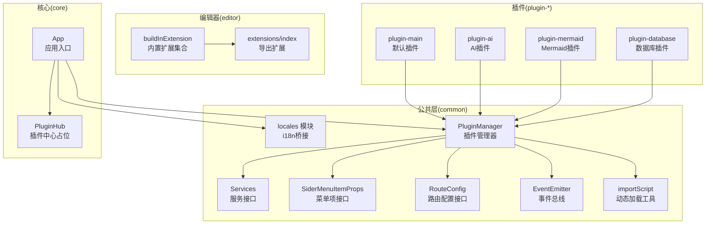
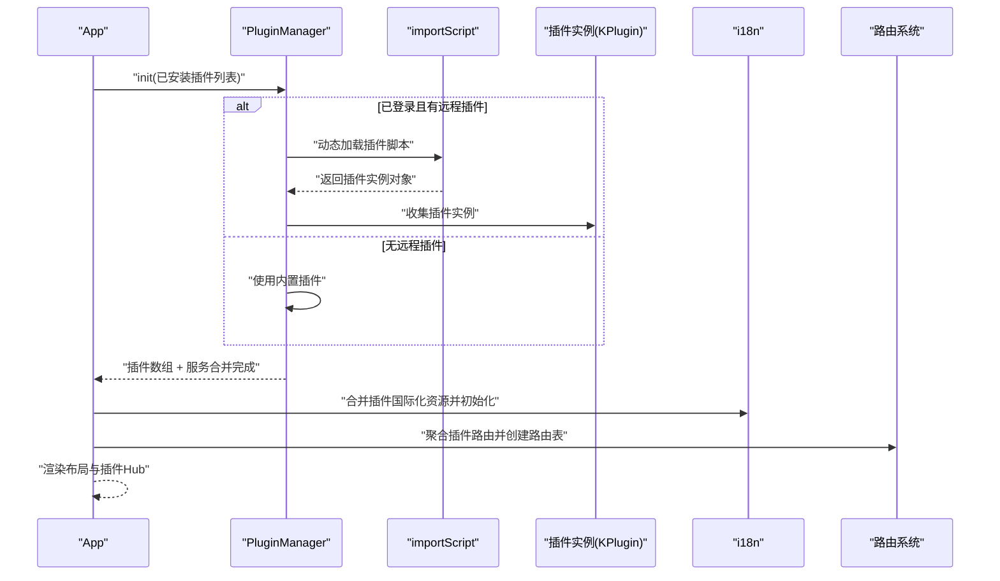
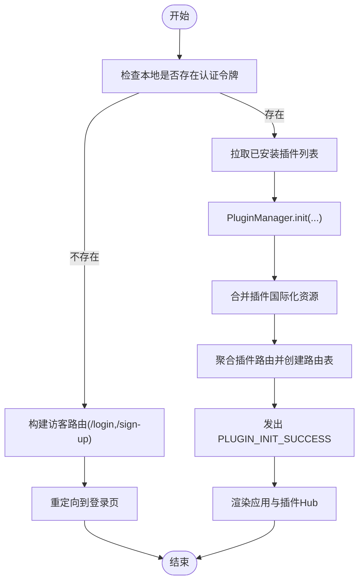
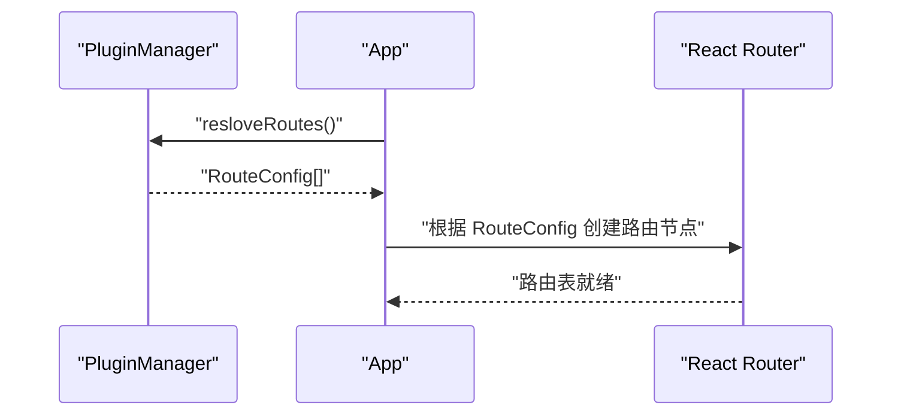
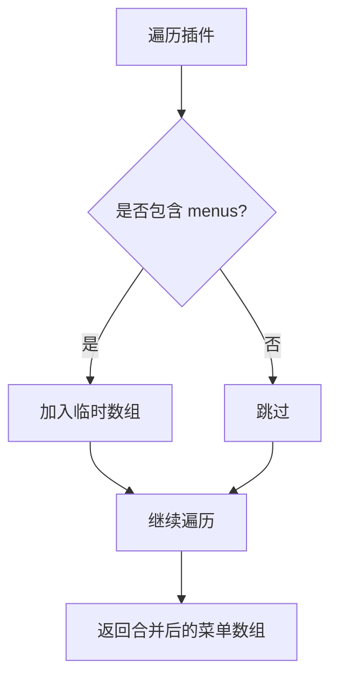
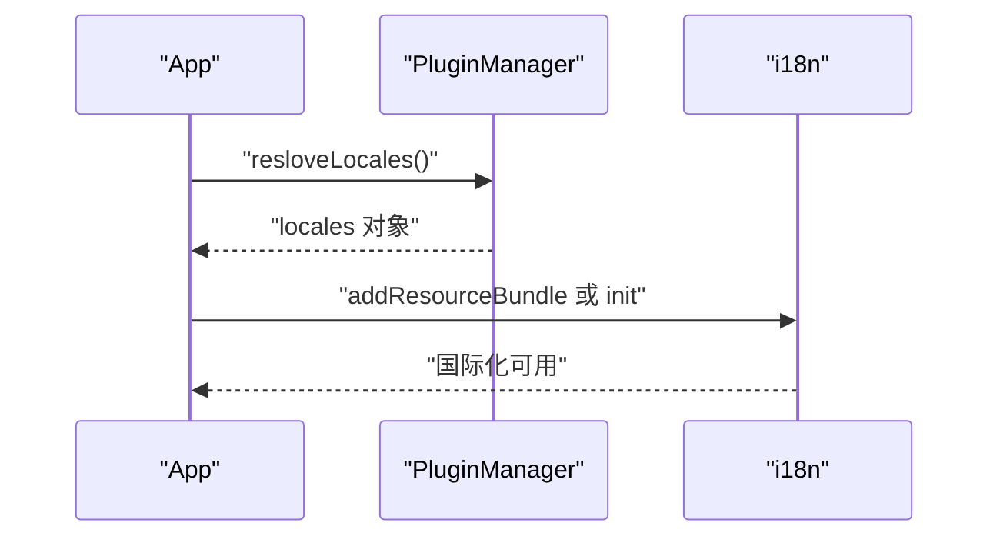
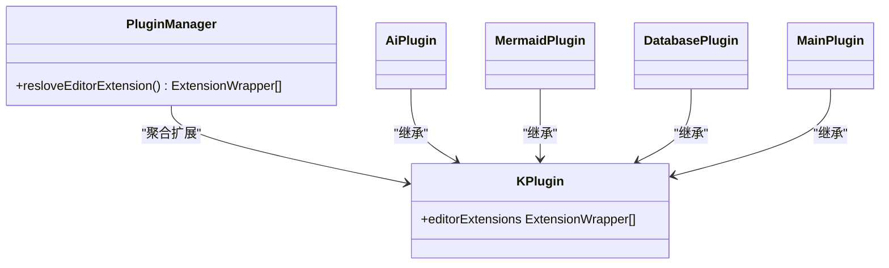
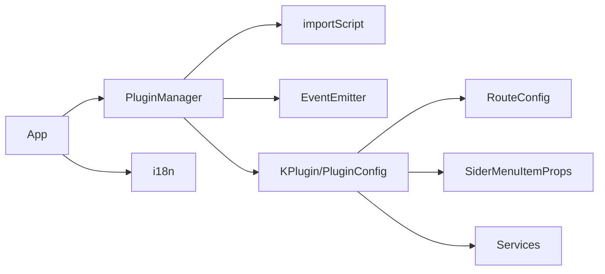
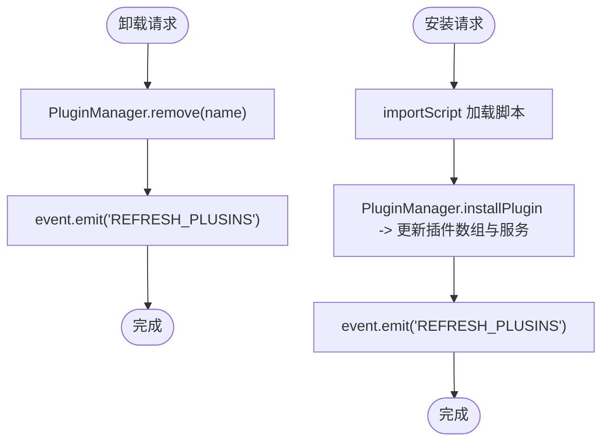

# 插件集成与配置

<cite>
**本文引用的文件**
- [packages/common/src/core/PluginManager.ts](file://packages/common/src/core/PluginManager.ts)
- [packages/common/src/core/route.ts](file://packages/common/src/core/route.ts)
- [packages/common/src/core/menu.ts](file://packages/common/src/core/menu.ts)
- [packages/common/src/core/types.ts](file://packages/common/src/core/types.ts)
- [packages/common/src/locales/index.ts](file://packages/common/src/locales/index.ts)
- [packages/common/src/utils/import-util.ts](file://packages/common/src/utils/import-util.ts)
- [packages/common/src/event/event.ts](file://packages/common/src/event/event.ts)
- [packages/core/src/App.tsx](file://packages/core/src/App.tsx)
- [packages/core/src/components/PluginHub/index.tsx](file://packages/core/src/components/PluginHub/index.tsx)
- [packages/plugin-main/src/index.tsx](file://packages/plugin-main/src/index.tsx)
- [packages/plugin-ai/src/index.tsx](file://packages/plugin-ai/src/index.tsx)
- [packages/plugin-mermaid/src/index.tsx](file://packages/plugin-mermaid/src/index.tsx)
- [packages/plugin-database/src/index.tsx](file://packages/plugin-database/src/index.tsx)
- [packages/editor/src/editor/build-in-extension.ts](file://packages/editor/src/editor/build-in-extension.ts)
- [packages/editor/src/extensions/index.ts](file://packages/editor/src/extensions/index.ts)
</cite>

## 目录
1. [引言](#引言)
2. [项目结构](#项目结构)
3. [核心组件](#核心组件)
4. [架构总览](#架构总览)
5. [详细组件分析](#详细组件分析)
6. [依赖关系分析](#依赖关系分析)
7. [性能考虑](#性能考虑)
8. [故障排除指南](#故障排除指南)
9. [结论](#结论)
10. [附录](#附录)

## 引言
本指南面向需要在知识库系统中集成与配置插件的开发者，目标是帮助你：
- 理解插件如何与核心系统集成（路由系统、菜单系统、国际化资源）；
- 掌握插件配置文件的编写规范（路由、菜单、编辑器扩展、服务、国际化）；
- 明确插件注册与初始化流程（动态加载、服务注入、事件监听）；
- 管理插件间依赖与冲突；
- 提供可直接参考的实际配置示例与常见问题排查方法。

## 项目结构
该仓库采用多包工作区组织，插件相关能力主要分布在以下模块：
- common：插件管理器、类型定义、国际化桥接、事件总线、脚本动态加载工具；
- core：应用入口、路由拼装、国际化资源合并、插件 Hub；
- editor：编辑器扩展生态与内置扩展集合；
- 各插件包：如 plugin-main、plugin-ai、plugin-mermaid、plugin-database 等，均通过 common 的 KPlugin/PluginManager 进行声明与注册。

图表来源
- [packages/common/src/core/PluginManager.ts](file://packages/common/src/core/PluginManager.ts#L63-L170)
- [packages/common/src/core/route.ts](file://packages/common/src/core/route.ts#L1-L8)
- [packages/common/src/core/menu.ts](file://packages/common/src/core/menu.ts#L1-L25)
- [packages/common/src/core/types.ts](file://packages/common/src/core/types.ts#L1-L4)
- [packages/common/src/locales/index.ts](file://packages/common/src/locales/index.ts#L1-L6)
- [packages/common/src/utils/import-util.ts](file://packages/common/src/utils/import-util.ts#L1-L23)
- [packages/common/src/event/event.ts](file://packages/common/src/event/event.ts#L1-L44)
- [packages/core/src/App.tsx](file://packages/core/src/App.tsx#L1-L187)
- [packages/core/src/components/PluginHub/index.tsx](file://packages/core/src/components/PluginHub/index.tsx#L1-L6)
- [packages/editor/src/editor/build-in-extension.ts](file://packages/editor/src/editor/build-in-extension.ts#L1-L56)
- [packages/editor/src/extensions/index.ts](file://packages/editor/src/extensions/index.ts#L1-L64)
- [packages/plugin-main/src/index.tsx](file://packages/plugin-main/src/index.tsx#L1-L118)
- [packages/plugin-ai/src/index.tsx](file://packages/plugin-ai/src/index.tsx#L1-L35)
- [packages/plugin-mermaid/src/index.tsx](file://packages/plugin-mermaid/src/index.tsx#L1-L17)
- [packages/plugin-database/src/index.tsx](file://packages/plugin-database/src/index.tsx#L1-L17)

章节来源
- [packages/common/src/core/PluginManager.ts](file://packages/common/src/core/PluginManager.ts#L1-L170)
- [packages/core/src/App.tsx](file://packages/core/src/App.tsx#L1-L187)

## 核心组件
- 插件配置接口与包装
  - PluginConfig：定义插件的名称、状态、路由、全局路由、菜单、编辑器扩展、国际化资源、服务等字段。
  - KPlugin：对 PluginConfig 的封装，提供只读访问器，便于统一读取各配置项。
- 插件管理器
  - PluginManager：负责插件的初始化、动态安装/卸载、路由/菜单/国际化/编辑器扩展的聚合解析、服务合并、事件广播。
- 路由与菜单
  - RouteConfig：用于描述页面路由树，支持嵌套子路由。
  - SiderMenuItemProps：用于描述侧边栏菜单项，支持分组、图标、点击回调等。
- 国际化
  - locales 模块：提供 i18n 初始化与语言检测桥接；App 在初始化后将插件国际化资源合并到全局。
- 动态加载与事件
  - importScript：基于 script 标签动态加载远程插件脚本，并缓存结果。
  - EventEmitter：轻量事件总线，用于触发“刷新插件列表”等事件。

章节来源
- [packages/common/src/core/PluginManager.ts](file://packages/common/src/core/PluginManager.ts#L9-L61)
- [packages/common/src/core/route.ts](file://packages/common/src/core/route.ts#L1-L8)
- [packages/common/src/core/menu.ts](file://packages/common/src/core/menu.ts#L1-L25)
- [packages/common/src/locales/index.ts](file://packages/common/src/locales/index.ts#L1-L6)
- [packages/common/src/utils/import-util.ts](file://packages/common/src/utils/import-util.ts#L1-L23)
- [packages/common/src/event/event.ts](file://packages/common/src/event/event.ts#L1-L44)

## 架构总览
下图展示了插件从“被发现/加载”到“路由/菜单/国际化/编辑器扩展生效”的全链路：

图表来源
- [packages/core/src/App.tsx](file://packages/core/src/App.tsx#L64-L170)
- [packages/common/src/core/PluginManager.ts](file://packages/common/src/core/PluginManager.ts#L78-L112)
- [packages/common/src/utils/import-util.ts](file://packages/common/src/utils/import-util.ts#L1-L23)

## 详细组件分析

### 插件配置文件编写规范
- 基本字段
  - name：插件唯一标识名，用于识别与卸载。
  - status：插件状态（如 ACTIVE），用于控制启用/禁用。
- 路由配置
  - routes/globalRoutes：数组，元素为 RouteConfig，支持 path、name、element、children。
  - 聚合时由 PluginManager.resloveRoutes 统一收集。
- 菜单配置
  - menus：数组，元素为 SiderMenuItemProps，支持 name/key/icon/attachTabs/id/onClick 等。
  - 聚合时由 PluginManager.resloveMenus 统一收集。
- 编辑器扩展配置
  - editorExtension：数组，元素为 ExtensionWrapper，通常来自 @kn/editor 的扩展。
  - 聚合时由 PluginManager.resloveEditorExtension 统一收集。
- 国际化资源
  - locales：对象，键为语言码（如 zh/en），值为翻译树，最终与 core 的 resources 合并。
- 服务配置
  - services：对象，键为服务名，值为服务实现；由 PluginManager 合并到统一的服务字典。

章节来源
- [packages/common/src/core/PluginManager.ts](file://packages/common/src/core/PluginManager.ts#L9-L61)
- [packages/common/src/core/route.ts](file://packages/common/src/core/route.ts#L1-L8)
- [packages/common/src/core/menu.ts](file://packages/common/src/core/menu.ts#L1-L25)
- [packages/common/src/core/types.ts](file://packages/common/src/core/types.ts#L1-L4)

### 插件注册与初始化流程
- 注册阶段
  - 内置插件：通过构造函数传入 PluginManager。
  - 远程插件：通过 PluginManager.init 传入远程插件列表，内部使用 importScript 动态加载并注入。
- 初始化阶段
  - App 在登录成功后调用 pluginManager.init 获取插件清单；
  - 完成后：
    - 合并国际化资源并初始化 i18n；
    - 聚合路由并创建路由表；
    - 发出 PLUGIN_INIT_SUCCESS 事件；
    - 监听 REFRESH_PLUSINS 事件以刷新插件列表。
- 卸载与安装
  - uninstallPlugin：移除指定插件并广播 REFRESH_PLUSINS；
  - installPlugin：动态加载新插件并更新服务字典，随后广播 REFRESH_PLUSINS。

图表来源
- [packages/core/src/App.tsx](file://packages/core/src/App.tsx#L81-L170)
- [packages/common/src/core/PluginManager.ts](file://packages/common/src/core/PluginManager.ts#L78-L112)

章节来源
- [packages/core/src/App.tsx](file://packages/core/src/App.tsx#L64-L170)
- [packages/common/src/core/PluginManager.ts](file://packages/common/src/core/PluginManager.ts#L78-L112)

### 路由系统集成
- 路由聚合
  - PluginManager.resloveRoutes 将所有插件的 routes 合并为一个 RouteConfig 数组；
  - App 使用 createRoutesFromElements 将 RouteConfig 渲染为 React Router 节点树。
- 全局路由
  - PluginConfig 支持 globalRoutes 字段，可在 App 中按需纳入全局路由树。

图表来源
- [packages/common/src/core/PluginManager.ts](file://packages/common/src/core/PluginManager.ts#L122-L130)
- [packages/core/src/App.tsx](file://packages/core/src/App.tsx#L153-L167)
- [packages/common/src/core/route.ts](file://packages/common/src/core/route.ts#L1-L8)

章节来源
- [packages/common/src/core/PluginManager.ts](file://packages/common/src/core/PluginManager.ts#L122-L130)
- [packages/core/src/App.tsx](file://packages/core/src/App.tsx#L153-L167)

### 菜单系统挂载
- 菜单聚合
  - PluginManager.resloveMenus 将所有插件的 menus 合并为 SiderMenuItemProps[]；
  - App 在渲染布局时可读取该数组并挂载到侧边栏组件。
- 菜单项属性
  - name/key/icon/attachTabs/id/isSelectable/children/indicator/className/onClick/actions/customerRender/height 等。

图表来源
- [packages/common/src/core/PluginManager.ts](file://packages/common/src/core/PluginManager.ts#L157-L165)
- [packages/common/src/core/menu.ts](file://packages/common/src/core/menu.ts#L1-L25)

章节来源
- [packages/common/src/core/PluginManager.ts](file://packages/common/src/core/PluginManager.ts#L157-L165)
- [packages/common/src/core/menu.ts](file://packages/common/src/core/menu.ts#L1-L25)

### 国际化资源合并
- 资源合并策略
  - App 在初始化后调用 pluginManager.resloveLocales 获取插件国际化资源；
  - 与 core 的 resources 合并后，若 i18n 已初始化则增量添加资源包，否则初始化 i18n 并设置支持语言、回退语言等。
- 语言检测
  - 使用 LanguageDetector，从本地存储中读取语言偏好。

图表来源
- [packages/core/src/App.tsx](file://packages/core/src/App.tsx#L131-L152)
- [packages/common/src/locales/index.ts](file://packages/common/src/locales/index.ts#L1-L6)
- [packages/common/src/core/PluginManager.ts](file://packages/common/src/core/PluginManager.ts#L136-L144)

章节来源
- [packages/core/src/App.tsx](file://packages/core/src/App.tsx#L131-L152)
- [packages/common/src/locales/index.ts](file://packages/common/src/locales/index.ts#L1-L6)

### 编辑器扩展集成
- 扩展聚合
  - PluginManager.resloveEditorExtension 将所有插件的 editorExtension 合并为 ExtensionWrapper[]；
  - 可与编辑器内置扩展 buildInExtension 结合使用。
- 插件扩展示例
  - plugin-ai：提供 AI 相关扩展；
  - plugin-mermaid：提供 Mermaid 图表扩展；
  - plugin-database：提供数据库视图扩展；
  - plugin-main：提供默认路由与服务。

图表来源
- [packages/common/src/core/PluginManager.ts](file://packages/common/src/core/PluginManager.ts#L146-L155)
- [packages/plugin-ai/src/index.tsx](file://packages/plugin-ai/src/index.tsx#L1-L35)
- [packages/plugin-mermaid/src/index.tsx](file://packages/plugin-mermaid/src/index.tsx#L1-L17)
- [packages/plugin-database/src/index.tsx](file://packages/plugin-database/src/index.tsx#L1-L17)
- [packages/plugin-main/src/index.tsx](file://packages/plugin-main/src/index.tsx#L1-L118)
- [packages/editor/src/editor/build-in-extension.ts](file://packages/editor/src/editor/build-in-extension.ts#L1-L56)
- [packages/editor/src/extensions/index.ts](file://packages/editor/src/extensions/index.ts#L1-L64)

章节来源
- [packages/common/src/core/PluginManager.ts](file://packages/common/src/core/PluginManager.ts#L146-L155)
- [packages/plugin-ai/src/index.tsx](file://packages/plugin-ai/src/index.tsx#L1-L35)
- [packages/plugin-mermaid/src/index.tsx](file://packages/plugin-mermaid/src/index.tsx#L1-L17)
- [packages/plugin-database/src/index.tsx](file://packages/plugin-database/src/index.tsx#L1-L17)
- [packages/plugin-main/src/index.tsx](file://packages/plugin-main/src/index.tsx#L1-L118)
- [packages/editor/src/editor/build-in-extension.ts](file://packages/editor/src/editor/build-in-extension.ts#L1-L56)
- [packages/editor/src/extensions/index.ts](file://packages/editor/src/extensions/index.ts#L1-L64)

### 插件间依赖关系与冲突处理
- 依赖管理
  - 插件之间不直接耦合，通过 PluginManager 的聚合与 App 的统一调度实现协作；
  - 路由与菜单的合并遵循“先到先得”的原则，建议在命名上避免冲突（如 path/key）。
- 冲突解决
  - 路由冲突：确保每个 path 唯一；如需共享父路径，使用 children 组织层级；
  - 菜单冲突：为不同插件分配独立 key 与 id；
  - 国际化冲突：不同语言域下键冲突可通过命名空间或前缀区分；
  - 服务冲突：services 键冲突时，后加载的插件会覆盖同名服务（由合并策略决定），应避免同名服务键。

章节来源
- [packages/common/src/core/PluginManager.ts](file://packages/common/src/core/PluginManager.ts#L122-L165)

## 依赖关系分析
- 组件耦合
  - App 依赖 PluginManager 与 i18n；
  - PluginManager 依赖 importScript、EventEmitter、各插件实例；
  - 插件实例依赖 common 的 KPlugin/PluginConfig。
- 外部依赖
  - i18next 与 react-i18next：用于国际化；
  - React Router：用于路由；
  - lodash.merge：用于资源合并。

图表来源
- [packages/core/src/App.tsx](file://packages/core/src/App.tsx#L1-L187)
- [packages/common/src/core/PluginManager.ts](file://packages/common/src/core/PluginManager.ts#L1-L170)
- [packages/common/src/utils/import-util.ts](file://packages/common/src/utils/import-util.ts#L1-L23)
- [packages/common/src/event/event.ts](file://packages/common/src/event/event.ts#L1-L44)
- [packages/common/src/core/route.ts](file://packages/common/src/core/route.ts#L1-L8)
- [packages/common/src/core/menu.ts](file://packages/common/src/core/menu.ts#L1-L25)
- [packages/common/src/core/types.ts](file://packages/common/src/core/types.ts#L1-L4)

章节来源
- [packages/core/src/App.tsx](file://packages/core/src/App.tsx#L1-L187)
- [packages/common/src/core/PluginManager.ts](file://packages/common/src/core/PluginManager.ts#L1-L170)

## 性能考虑
- 动态加载优化
  - importScript 已内置缓存，避免重复下载同一插件脚本；
  - 建议在生产环境为插件脚本开启缓存头与版本号，减少缓存穿透。
- 资源合并
  - 国际化资源合并使用增量方式，避免重复初始化；
  - 路由与菜单聚合为 O(n) 遍历，建议控制插件数量与层级深度。
- 事件驱动刷新
  - 使用 REFRESH_PLUSINS 事件触发局部刷新，避免全量重渲染。

[本节为通用指导，无需列出具体文件来源]

## 故障排除指南
- 插件未显示
  - 检查插件是否正确导出 KPlugin 实例并传入 PluginManager；
  - 确认 init 是否成功执行，以及是否触发了 REFRESH_PLUSINS。
- 路由无效
  - 确认 routes 中 path 唯一且与 App 路由拼装逻辑兼容；
  - 检查 children 是否正确嵌套。
- 菜单不出现
  - 确认 menus 字段存在且 key/id 唯一；
  - 检查侧边栏组件是否读取了 PluginManager.resloveMenus 的结果。
- 国际化不生效
  - 确认 locales 结构符合 i18next 资源包格式；
  - 检查 App 是否在初始化后执行了资源合并与 i18n 初始化。
- 动态加载失败
  - 检查 importScript 返回的 window 上是否存在插件命名空间；
  - 查看网络面板确认脚本地址与缓存参数正确。

章节来源
- [packages/common/src/utils/import-util.ts](file://packages/common/src/utils/import-util.ts#L1-L23)
- [packages/common/src/event/event.ts](file://packages/common/src/event/event.ts#L1-L44)
- [packages/core/src/App.tsx](file://packages/core/src/App.tsx#L131-L167)

## 结论
通过统一的插件配置接口与 PluginManager 聚合机制，系统实现了对路由、菜单、国际化与编辑器扩展的灵活集成。配合动态加载与事件驱动刷新，插件体系具备良好的可扩展性与运行时可控性。建议在实践中严格遵守命名规范与资源合并策略，以降低冲突概率并提升维护效率。

[本节为总结性内容，无需列出具体文件来源]

## 附录

### 实际配置示例（路径参考）
- 默认插件（路由、菜单、服务、国际化）
  - [packages/plugin-main/src/index.tsx](file://packages/plugin-main/src/index.tsx#L1-L118)
- AI 插件（编辑器扩展、国际化）
  - [packages/plugin-ai/src/index.tsx](file://packages/plugin-ai/src/index.tsx#L1-L35)
- Mermaid 插件（编辑器扩展）
  - [packages/plugin-mermaid/src/index.tsx](file://packages/plugin-mermaid/src/index.tsx#L1-L17)
- 数据库插件（编辑器扩展）
  - [packages/plugin-database/src/index.tsx](file://packages/plugin-database/src/index.tsx#L1-L17)
- 编辑器内置扩展集合
  - [packages/editor/src/editor/build-in-extension.ts](file://packages/editor/src/editor/build-in-extension.ts#L1-L56)
  - [packages/editor/src/extensions/index.ts](file://packages/editor/src/extensions/index.ts#L1-L64)

### 关键流程图：插件安装/卸载

图表来源
- [packages/common/src/core/PluginManager.ts](file://packages/common/src/core/PluginManager.ts#L99-L112)
- [packages/common/src/utils/import-util.ts](file://packages/common/src/utils/import-util.ts#L1-L23)
- [packages/common/src/event/event.ts](file://packages/common/src/event/event.ts#L1-L44)