# 插件集成与配置

<cite>
**本文引用的文件**
- [packages/common/src/core/PluginManager.ts](file://packages/common/src/core/PluginManager.ts)
- [packages/common/src/core/route.ts](file://packages/common/src/core/route.ts)
- [packages/common/src/core/menu.ts](file://packages/common/src/core/menu.ts)
- [packages/common/src/core/types.ts](file://packages/common/src/core/types.ts)
- [packages/common/src/locales/index.ts](file://packages/common/src/locales/index.ts)
- [packages/common/src/utils/import-util.ts](file://packages/common/src/utils/import-util.ts)
- [packages/common/src/event/event.ts](file://packages/common/src/event/event.ts)
- [packages/core/src/App.tsx](file://packages/core/src/App.tsx)
- [packages/core/src/components/PluginHub/index.tsx](file://packages/core/src/components/PluginHub/index.tsx)
- [packages/core/src/hooks/use-plugin-config.ts](file://packages/core/src/hooks/use-plugin-config.ts)
- [packages/core/src/services/plugin-config-service.ts](file://packages/core/src/services/plugin-config-service.ts)
- [packages/core/src/api/index.ts](file://packages/core/src/api/index.ts)
- [packages/core/src/hooks/use-api.tsx](file://packages/core/src/hooks/use-api.tsx)
- [apps/desktop/src/main/ipc.ts](file://apps/desktop/src/main/ipc.ts)
- [apps/desktop/src/preload/index.ts](file://apps/desktop/src/preload/index.ts)
- [packages/plugin-main/src/index.tsx](file://packages/plugin-main/src/index.tsx)
- [packages/plugin-ai/src/index.tsx](file://packages/plugin-ai/src/index.tsx)
- [packages/plugin-mermaid/src/index.tsx](file://packages/plugin-mermaid/src/index.tsx)
- [packages/plugin-database/src/index.tsx](file://packages/plugin-database/src/index.tsx)
- [packages/editor/src/editor/build-in-extension.ts](file://packages/editor/src/editor/build-in-extension.ts)
- [packages/editor/src/extensions/index.ts](file://packages/editor/src/extensions/index.ts)
</cite>

## 更新摘要
**所做更改**
- 新增桌面IPC处理器章节，详细说明pluginConfig:getAll和pluginConfig:getOrSave的实现
- 更新Electron IPC集成机制，包括URL到IPC通道映射和请求处理
- 增强usePluginConfig自动保存功能的说明，包括去抖动机制和错误处理
- 新增完整的插件配置系统架构图和数据流图
- 扩展故障排除指南，包含IPC通信和数据库操作相关问题

## 目录
1. [引言](#引言)
2. [项目结构](#项目结构)
3. [核心组件](#核心组件)
4. [架构总览](#架构总览)
5. [详细组件分析](#详细组件分析)
6. [插件配置系统](#插件配置系统)
7. [桌面IPC处理器](#桌面ipc处理器)
8. [Electron IPC集成](#electron-ipc集成)
9. [依赖关系分析](#依赖关系分析)
10. [性能考虑](#性能考虑)
11. [故障排除指南](#故障排除指南)
12. [结论](#结论)
13. [附录](#附录)

## 引言
本指南面向需要在知识库系统中集成与配置插件的开发者，目标是帮助你：
- 理解插件如何与核心系统集成（路由系统、菜单系统、国际化资源）；
- 掌握插件配置文件的编写规范（路由、菜单、编辑器扩展、服务、国际化、配置系统）；
- 明确插件注册与初始化流程（动态加载、服务注入、事件监听）；
- 管理插件间依赖与冲突；
- 利用新的插件配置系统实现自动持久化、去抖动保存、跨标签同步和冲突解决；
- 理解桌面应用中的IPC通信机制和数据库操作；
- 提供可直接参考的实际配置示例与常见问题排查方法。

## 项目结构
该仓库采用多包工作区组织，插件相关能力主要分布在以下模块：
- common：插件管理器、类型定义、国际化桥接、事件总线、脚本动态加载工具；
- core：应用入口、路由拼装、国际化资源合并、插件 Hub、插件配置系统、API请求处理；
- desktop：桌面应用主进程、IPC处理器、数据库操作、预加载脚本；
- editor：编辑器扩展生态与内置扩展集合；
- 各插件包：如 plugin-main、plugin-ai、plugin-mermaid、plugin-database 等，均通过 common 的 KPlugin/PluginManager 进行声明与注册。

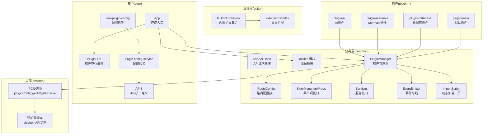
```mermaid
graph TB
subgraph "公共层(common)"
PM["PluginManager<br/>插件管理器"]
RT["RouteConfig<br/>路由配置接口"]
MN["SiderMenuItemProps<br/>菜单项接口"]
TS["Services<br/>服务接口"]
LO["locales 模块<br/>i18n桥接"]
EV["EventEmitter<br/>事件总线"]
IU["importScript<br/>动态加载工具"]
API["useApi Hook<br/>API请求处理"]
end
subgraph "核心(core)"
APP["App<br/>应用入口"]
PH["PluginHub<br/>插件中心占位"]
UPC["use-plugin-config<br/>配置钩子"]
PCS["plugin-config-service<br/>配置服务"]
APIS["APIS<br/>API接口定义"]
end
subgraph "桌面(desktop)"
IPC["IPC处理器<br/>pluginConfig:getAll/getOrSave"]
PRELOAD["预加载脚本<br/>electron API暴露"]
end
subgraph "编辑器(editor)"
BE["buildInExtension<br/>内置扩展集合"]
EX["extensions/index<br/>导出扩展"]
end
subgraph "插件(plugin-*)"
PMN["plugin-main<br/>默认插件"]
PAI["plugin-ai<br/>AI插件"]
PMD["plugin-mermaid<br/>Mermaid插件"]
PDB["plugin-database<br/>数据库插件"]
end
APP --> PM
APP --> LO
APP --> PH
PM --> IU
PM --> EV
PM --> RT
PM --> MN
PM --> TS
UPC --> PCS
PCS --> APIS
API --> IPC
IPC --> PRELOAD
PAI --> PM
PMD --> PM
PDB --> PM
PMN --> PM
BE --> EX
```

**图表来源**
- [packages/common/src/core/PluginManager.ts](file://packages/common/src/core/PluginManager.ts#L63-L170)
- [packages/common/src/core/route.ts](file://packages/common/src/core/route.ts#L1-L8)
- [packages/common/src/core/menu.ts](file://packages/common/src/core/menu.ts#L1-L25)
- [packages/common/src/core/types.ts](file://packages/common/src/core/types.ts#L1-L4)
- [packages/common/src/locales/index.ts](file://packages/common/src/locales/index.ts#L1-L6)
- [packages/common/src/utils/import-util.ts](file://packages/common/src/utils/import-util.ts#L1-L23)
- [packages/common/src/event/event.ts](file://packages/common/src/event/event.ts#L1-L44)
- [packages/core/src/App.tsx](file://packages/core/src/App.tsx#L1-L187)
- [packages/core/src/components/PluginHub/index.tsx](file://packages/core/src/components/PluginHub/index.tsx#L1-L6)
- [packages/core/src/hooks/use-plugin-config.ts](file://packages/core/src/hooks/use-plugin-config.ts#L1-L140)
- [packages/core/src/services/plugin-config-service.ts](file://packages/core/src/services/plugin-config-service.ts#L1-L241)
- [packages/core/src/api/index.ts](file://packages/core/src/api/index.ts#L1-L128)
- [packages/core/src/hooks/use-api.tsx](file://packages/core/src/hooks/use-api.tsx#L1-L231)
- [apps/desktop/src/main/ipc.ts](file://apps/desktop/src/main/ipc.ts#L426-L486)
- [apps/desktop/src/preload/index.ts](file://apps/desktop/src/preload/index.ts#L1-L29)
- [packages/editor/src/editor/build-in-extension.ts](file://packages/editor/src/editor/build-in-extension.ts#L1-L56)
- [packages/editor/src/extensions/index.ts](file://packages/editor/src/extensions/index.ts#L1-L64)
- [packages/plugin-main/src/index.tsx](file://packages/plugin-main/src/index.tsx#L1-L118)
- [packages/plugin-ai/src/index.tsx](file://packages/plugin-ai/src/index.tsx#L1-L35)
- [packages/plugin-mermaid/src/index.tsx](file://packages/plugin-mermaid/src/index.tsx#L1-L17)
- [packages/plugin-database/src/index.tsx](file://packages/plugin-database/src/index.tsx#L1-L17)

**章节来源**
- [packages/common/src/core/PluginManager.ts](file://packages/common/src/core/PluginManager.ts#L1-L170)
- [packages/core/src/App.tsx](file://packages/core/src/App.tsx#L1-L187)

## 核心组件
- 插件配置接口与包装
  - PluginConfig：定义插件的名称、状态、路由、全局路由、菜单、编辑器扩展、国际化资源、服务等字段。
  - KPlugin：对 PluginConfig 的封装，提供只读访问器，便于统一读取各配置项。
- 插件管理器
  - PluginManager：负责插件的初始化、动态安装/卸载、路由/菜单/国际化/编辑器扩展的聚合解析、服务合并、事件广播。
- 路由与菜单
  - RouteConfig：用于描述页面路由树，支持嵌套子路由。
  - SiderMenuItemProps：用于描述侧边栏菜单项，支持分组、图标、点击回调等。
- 国际化
  - locales 模块：提供 i18n 初始化与语言检测桥接；App 在初始化后将插件国际化资源合并到全局。
- 动态加载与事件
  - importScript：基于 script 标签动态加载远程插件脚本，并缓存结果。
  - EventEmitter：轻量事件总线，用于触发"刷新插件列表"等事件。
- **新增** 插件配置系统
  - usePluginConfig：React Hook，提供插件配置的状态管理、自动保存、去抖动处理和跨标签同步。
  - PluginConfigStore：单例存储服务，管理配置的缓存、订阅和通知机制。
  - Storage Adapters：localStorage、API 和混合适配器，支持多种存储后端。
- **新增** API请求处理
  - useApi：统一的API请求处理Hook，支持Electron IPC和HTTP两种传输方式。
  - URL到IPC映射：自动将RESTful API调用转换为对应的IPC通道。

**章节来源**
- [packages/common/src/core/PluginManager.ts](file://packages/common/src/core/PluginManager.ts#L9-L61)
- [packages/common/src/core/route.ts](file://packages/common/src/core/route.ts#L1-L8)
- [packages/common/src/core/menu.ts](file://packages/common/src/core/menu.ts#L1-L25)
- [packages/common/src/locales/index.ts](file://packages/common/src/locales/index.ts#L1-L6)
- [packages/common/src/utils/import-util.ts](file://packages/common/src/utils/import-util.ts#L1-L23)
- [packages/common/src/event/event.ts](file://packages/common/src/event/event.ts#L1-L44)
- [packages/core/src/hooks/use-plugin-config.ts](file://packages/core/src/hooks/use-plugin-config.ts#L1-L140)
- [packages/core/src/services/plugin-config-service.ts](file://packages/core/src/services/plugin-config-service.ts#L1-L241)
- [packages/core/src/hooks/use-api.tsx](file://packages/core/src/hooks/use-api.tsx#L1-L231)

## 架构总览
下图展示了插件从"被发现/加载"到"路由/菜单/国际化/编辑器扩展生效"的全链路，以及新增的插件配置系统集成和桌面IPC通信：

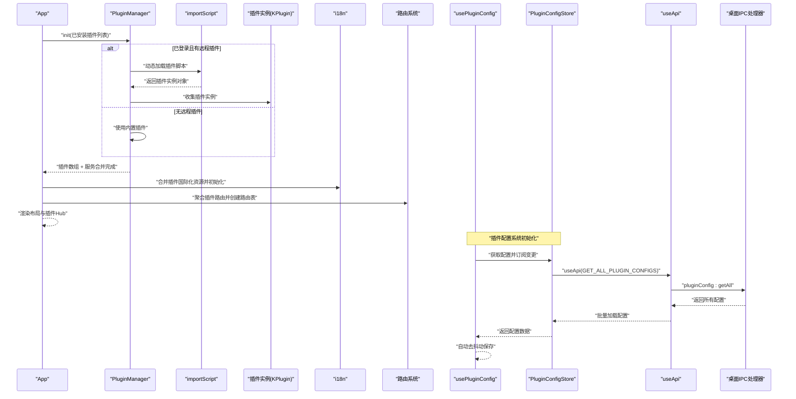
```mermaid
sequenceDiagram
participant APP as "App"
participant PM as "PluginManager"
participant IU as "importScript"
participant PL as "插件实例(KPlugin)"
participant LO as "i18n"
participant RT as "路由系统"
participant UPC as "usePluginConfig"
participant PCS as "PluginConfigStore"
participant API as "useApi"
participant IPC as "桌面IPC处理器"
APP->>PM : "init(已安装插件列表)"
alt 已登录且有远程插件
PM->>IU : "动态加载插件脚本"
IU-->>PM : "返回插件实例对象"
PM->>PL : "收集插件实例"
else 无远程插件
PM->>PM : "使用内置插件"
end
PM-->>APP : "插件数组 + 服务合并完成"
APP->>LO : "合并插件国际化资源并初始化"
APP->>RT : "聚合插件路由并创建路由表"
APP-->>APP : "渲染布局与插件Hub"
Note over UPC,PCS : "插件配置系统初始化"
UPC->>PCS : "获取配置并订阅变更"
PCS->>API : "useApi(GET_ALL_PLUGIN_CONFIGS)"
API->>IPC : "pluginConfig : getAll"
IPC-->>API : "返回所有配置"
API-->>PCS : "批量加载配置"
PCS-->>UPC : "返回配置数据"
UPC-->>UPC : "自动去抖动保存"
```

**图表来源**
- [packages/core/src/App.tsx](file://packages/core/src/App.tsx#L64-L170)
- [packages/common/src/core/PluginManager.ts](file://packages/common/src/core/PluginManager.ts#L78-L112)
- [packages/common/src/utils/import-util.ts](file://packages/common/src/utils/import-util.ts#L1-L23)
- [packages/core/src/hooks/use-plugin-config.ts](file://packages/core/src/hooks/use-plugin-config.ts#L48-L84)
- [packages/core/src/services/plugin-config-service.ts](file://packages/core/src/services/plugin-config-service.ts#L190-L203)
- [packages/core/src/hooks/use-api.tsx](file://packages/core/src/hooks/use-api.tsx#L141-L178)
- [apps/desktop/src/main/ipc.ts](file://apps/desktop/src/main/ipc.ts#L426-L486)

## 详细组件分析

### 插件配置文件编写规范
- 基本字段
  - name：插件唯一标识名，用于识别与卸载。
  - status：插件状态（如 ACTIVE），用于控制启用/禁用。
- 路由配置
  - routes/globalRoutes：数组，元素为 RouteConfig，支持 path、name、element、children。
  - 聚合时由 PluginManager.resloveRoutes 统一收集。
- 菜单配置
  - menus：数组，元素为 SiderMenuItemProps，支持 name/key/icon/attachTabs/id/onClick 等。
  - 聚合时由 PluginManager.resloveMenus 统一收集。
- 编辑器扩展配置
  - editorExtension：数组，元素为 ExtensionWrapper，通常来自 @kn/editor 的扩展。
  - 聚合时由 PluginManager.resloveEditorExtension 统一收集。
- 国际化资源
  - locales：对象，键为语言码（如 zh/en），值为翻译树，最终与 core 的 resources 合并。
- 服务配置
  - services：对象，键为服务名，值为服务实现；由 PluginManager 合并到统一的服务字典。
- **新增** 插件配置系统
  - 配置数据结构：PluginConfigData 接口支持任意键值对配置。
  - 存储适配器：LocalPluginConfigStorage、ApiPluginConfigStorage、HybridPluginConfigStorage。
  - 订阅机制：支持跨标签页的配置变更通知。

**章节来源**
- [packages/common/src/core/PluginManager.ts](file://packages/common/src/core/PluginManager.ts#L9-L61)
- [packages/common/src/core/route.ts](file://packages/common/src/core/route.ts#L1-L8)
- [packages/common/src/core/menu.ts](file://packages/common/src/core/menu.ts#L1-L25)
- [packages/common/src/core/types.ts](file://packages/common/src/core/types.ts#L1-L4)
- [packages/core/src/hooks/use-plugin-config.ts](file://packages/core/src/hooks/use-plugin-config.ts#L4-L30)
- [packages/core/src/services/plugin-config-service.ts](file://packages/core/src/services/plugin-config-service.ts#L14-L24)

### 插件注册与初始化流程
- 注册阶段
  - 内置插件：通过构造函数传入 PluginManager。
  - 远程插件：通过 PluginManager.init 传入远程插件列表，内部使用 importScript 动态加载并注入。
- 初始化阶段
  - App 在登录成功后调用 pluginManager.init 获取插件清单；
  - 完成后：
    - 合并国际化资源并初始化 i18n；
    - 聚合路由并创建路由表；
    - 发出 PLUGIN_INIT_SUCCESS 事件；
    - 监听 REFRESH_PLUSINS 事件以刷新插件列表。
- 卸载与安装
  - uninstallPlugin：移除指定插件并广播 REFRESH_PLUSINS；
  - installPlugin：动态加载新插件并更新服务字典，随后广播 REFRESH_PLUSINS。

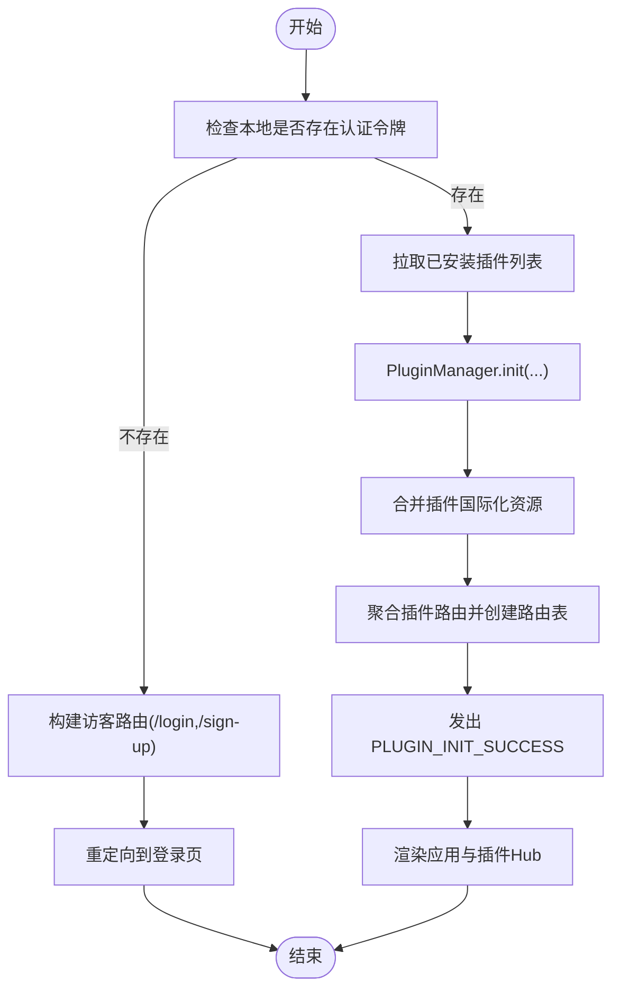
```mermaid
flowchart TD
Start(["开始"]) --> CheckToken["检查本地是否存在认证令牌"]
CheckToken --> |存在| LoadInstalled["拉取已安装插件列表"]
CheckToken --> |不存在| GuestRoutes["构建访客路由(/login,/sign-up)"]
LoadInstalled --> InitPM["PluginManager.init(...)"]
InitPM --> MergeLocales["合并插件国际化资源"]
MergeLocales --> BuildRoutes["聚合插件路由并创建路由表"]
BuildRoutes --> EmitInit["发出 PLUGIN_INIT_SUCCESS"]
GuestRoutes --> Redirect["重定向到登录页"]
EmitInit --> Render["渲染应用与插件Hub"]
Redirect --> End(["结束"])
Render --> End
```

**图表来源**
- [packages/core/src/App.tsx](file://packages/core/src/App.tsx#L81-L170)
- [packages/common/src/core/PluginManager.ts](file://packages/common/src/core/PluginManager.ts#L78-L112)

**章节来源**
- [packages/core/src/App.tsx](file://packages/core/src/App.tsx#L64-L170)
- [packages/common/src/core/PluginManager.ts](file://packages/common/src/core/PluginManager.ts#L78-L112)

### 路由系统集成
- 路由聚合
  - PluginManager.resloveRoutes 将所有插件的 routes 合并为一个 RouteConfig 数组；
  - App 使用 createRoutesFromElements 将 RouteConfig 渲染为 React Router 节点树。
- 全局路由
  - PluginConfig 支持 globalRoutes 字段，可在 App 中按需纳入全局路由树。

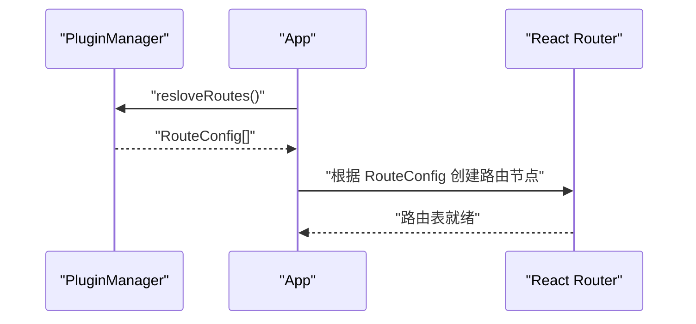
```mermaid
sequenceDiagram
participant PM as "PluginManager"
participant APP as "App"
participant RR as "React Router"
APP->>PM : "resloveRoutes()"
PM-->>APP : "RouteConfig[]"
APP->>RR : "根据 RouteConfig 创建路由节点"
RR-->>APP : "路由表就绪"
```

**图表来源**
- [packages/common/src/core/PluginManager.ts](file://packages/common/src/core/PluginManager.ts#L122-L130)
- [packages/core/src/App.tsx](file://packages/core/src/App.tsx#L153-L167)
- [packages/common/src/core/route.ts](file://packages/common/src/core/route.ts#L1-L8)

**章节来源**
- [packages/common/src/core/PluginManager.ts](file://packages/common/src/core/PluginManager.ts#L122-L130)
- [packages/core/src/App.tsx](file://packages/core/src/App.tsx#L153-L167)

### 菜单系统挂载
- 菜单聚合
  - PluginManager.resloveMenus 将所有插件的 menus 合并为 SiderMenuItemProps[]；
  - App 在渲染布局时可读取该数组并挂载到侧边栏组件。
- 菜单项属性
  - name/key/icon/attachTabs/id/isSelectable/children/indicator/className/onClick/actions/customerRender/height 等。

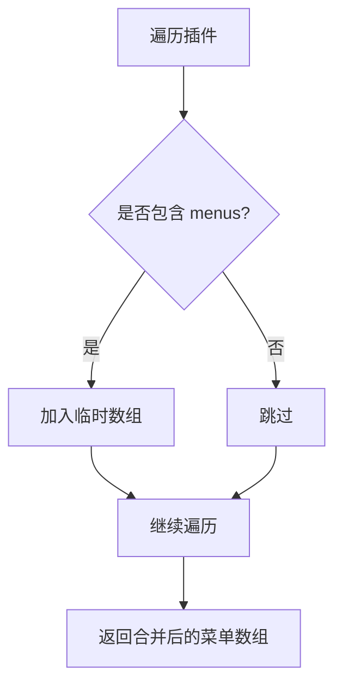
```mermaid
flowchart TD
A["遍历插件"] --> B{"是否包含 menus?"}
B --> |是| C["加入临时数组"]
B --> |否| D["跳过"]
C --> E["继续遍历"]
D --> E
E --> F["返回合并后的菜单数组"]
```

**图表来源**
- [packages/common/src/core/PluginManager.ts](file://packages/common/src/core/PluginManager.ts#L157-L165)
- [packages/common/src/core/menu.ts](file://packages/common/src/core/menu.ts#L1-L25)

**章节来源**
- [packages/common/src/core/PluginManager.ts](file://packages/common/src/core/PluginManager.ts#L157-L165)
- [packages/common/src/core/menu.ts](file://packages/common/src/core/menu.ts#L1-L25)

### 国际化资源合并
- 资源合并策略
  - App 在初始化后调用 pluginManager.resloveLocales 获取插件国际化资源；
  - 与 core 的 resources 合并后，若 i18n 已初始化则增量添加资源包，否则初始化 i18n 并设置支持语言、回退语言等。
- 语言检测
  - 使用 LanguageDetector，从本地存储中读取语言偏好。

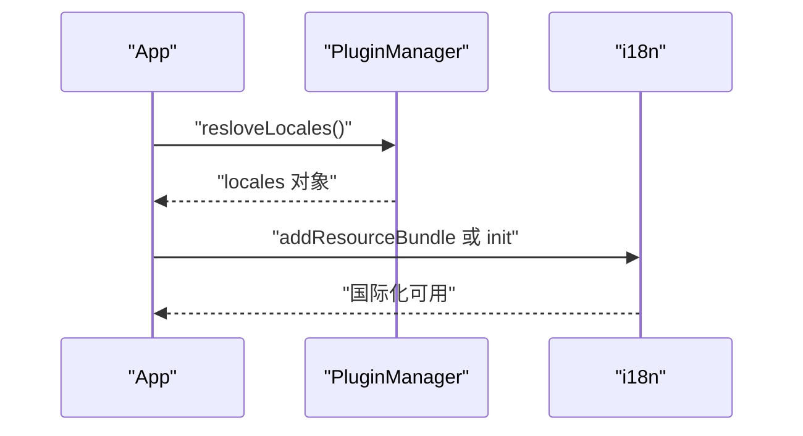
```mermaid
sequenceDiagram
participant APP as "App"
participant PM as "PluginManager"
participant LO as "i18n"
APP->>PM : "resloveLocales()"
PM-->>APP : "locales 对象"
APP->>LO : "addResourceBundle 或 init"
LO-->>APP : "国际化可用"
```

**图表来源**
- [packages/core/src/App.tsx](file://packages/core/src/App.tsx#L131-L152)
- [packages/common/src/locales/index.ts](file://packages/common/src/locales/index.ts#L1-L6)
- [packages/common/src/core/PluginManager.ts](file://packages/common/src/core/PluginManager.ts#L136-L144)

**章节来源**
- [packages/core/src/App.tsx](file://packages/core/src/App.tsx#L131-L152)
- [packages/common/src/locales/index.ts](file://packages/common/src/locales/index.ts#L1-L6)

### 编辑器扩展集成
- 扩展聚合
  - PluginManager.resloveEditorExtension 将所有插件的 editorExtension 合并为 ExtensionWrapper[]；
  - 可与编辑器内置扩展 buildInExtension 结合使用。
- 插件扩展示例
  - plugin-ai：提供 AI 相关扩展；
  - plugin-mermaid：提供 Mermaid 图表扩展；
  - plugin-database：提供数据库视图扩展；
  - plugin-main：提供默认路由与服务。

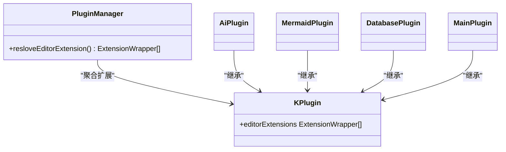
```mermaid
classDiagram
class PluginManager {
+resloveEditorExtension() ExtensionWrapper[]
}
class KPlugin {
+editorExtensions ExtensionWrapper[]
}
class AiPlugin
class MermaidPlugin
class DatabasePlugin
class MainPlugin
PluginManager --> KPlugin : "聚合扩展"
AiPlugin --> KPlugin : "继承"
MermaidPlugin --> KPlugin : "继承"
DatabasePlugin --> KPlugin : "继承"
MainPlugin --> KPlugin : "继承"
```

**图表来源**
- [packages/common/src/core/PluginManager.ts](file://packages/common/src/core/PluginManager.ts#L146-L155)
- [packages/plugin-ai/src/index.tsx](file://packages/plugin-ai/src/index.tsx#L1-L35)
- [packages/plugin-mermaid/src/index.tsx](file://packages/plugin-mermaid/src/index.tsx#L1-L17)
- [packages/plugin-database/src/index.tsx](file://packages/plugin-database/src/index.tsx#L1-L17)
- [packages/plugin-main/src/index.tsx](file://packages/plugin-main/src/index.tsx#L1-L118)
- [packages/editor/src/editor/build-in-extension.ts](file://packages/editor/src/editor/build-in-extension.ts#L1-L56)
- [packages/editor/src/extensions/index.ts](file://packages/editor/src/extensions/index.ts#L1-L64)

**章节来源**
- [packages/common/src/core/PluginManager.ts](file://packages/common/src/core/PluginManager.ts#L146-L155)
- [packages/plugin-ai/src/index.tsx](file://packages/plugin-ai/src/index.tsx#L1-L35)
- [packages/plugin-mermaid/src/index.tsx](file://packages/plugin-mermaid/src/index.tsx#L1-L17)
- [packages/plugin-database/src/index.tsx](file://packages/plugin-database/src/index.tsx#L1-L17)
- [packages/plugin-main/src/index.tsx](file://packages/plugin-main/src/index.tsx#L1-L118)
- [packages/editor/src/editor/build-in-extension.ts](file://packages/editor/src/editor/build-in-extension.ts#L1-L56)
- [packages/editor/src/extensions/index.ts](file://packages/editor/src/extensions/index.ts#L1-L64)

### 插件间依赖关系与冲突处理
- 依赖管理
  - 插件之间不直接耦合，通过 PluginManager 的聚合与 App 的统一调度实现协作；
  - 路由与菜单的合并遵循"先到先得"的原则，建议在命名上避免冲突（如 path/key）。
- 冲突解决
  - 路由冲突：确保每个 path 唯一；如需共享父路径，使用 children 组织层级；
  - 菜单冲突：为不同插件分配独立 key 与 id；
  - 国际化冲突：不同语言域下键冲突可通过命名空间或前缀区分；
  - 服务冲突：services 键冲突时，后加载的插件会覆盖同名服务（由合并策略决定），应避免同名服务键。

**章节来源**
- [packages/common/src/core/PluginManager.ts](file://packages/common/src/core/PluginManager.ts#L122-L165)

## 插件配置系统

### 概述
新的插件配置系统提供了完整的配置管理解决方案，支持自动持久化、去抖动保存、跨标签同步和冲突解决机制。该系统基于 React Hook 和单例存储模式设计，为插件开发者提供了统一的配置管理接口。

### 核心组件

#### usePluginConfig Hook
usePluginConfig 是一个 React Hook，为插件提供配置状态管理功能：

- **配置选项**
  - pluginKey：插件唯一标识符（必须与 PluginSettingsConfig.key 匹配）
  - defaultConfig：默认配置值，在首次加载时使用
  - autoSaveDelay：自动保存延迟时间（毫秒），默认 800ms

- **返回值**
  - config：当前配置状态（可能包含未保存的修改）
  - loading：加载状态
  - saving：保存状态
  - saveError：最后一次保存尝试的错误信息
  - updateConfig：合并部分配置到本地状态（不持久化）
  - saveConfig：将当前配置持久化到存储
  - resetConfig：将本地状态重置为最后保存的快照
  - isDirty：配置状态是否与最后保存的快照不同

#### PluginConfigStore 单例存储
PluginConfigStore 是配置系统的单例存储服务，负责：

- **初始化**：批量加载所有配置到缓存
- **获取配置**：返回缓存中的值或从存储中获取
- **保存配置**：更新缓存并通知订阅者
- **订阅机制**：支持跨标签页的配置变更通知

#### 存储适配器
系统提供三种存储适配器：

- **LocalPluginConfigStorage**：基于 localStorage 的本地存储
- **ApiPluginConfigStorage**：基于 API 的远程存储
- **HybridPluginConfigStorage**：混合存储（优先 API，失败时回退到本地）

### 自动持久化与去抖动保存
配置系统实现了智能的自动保存机制：

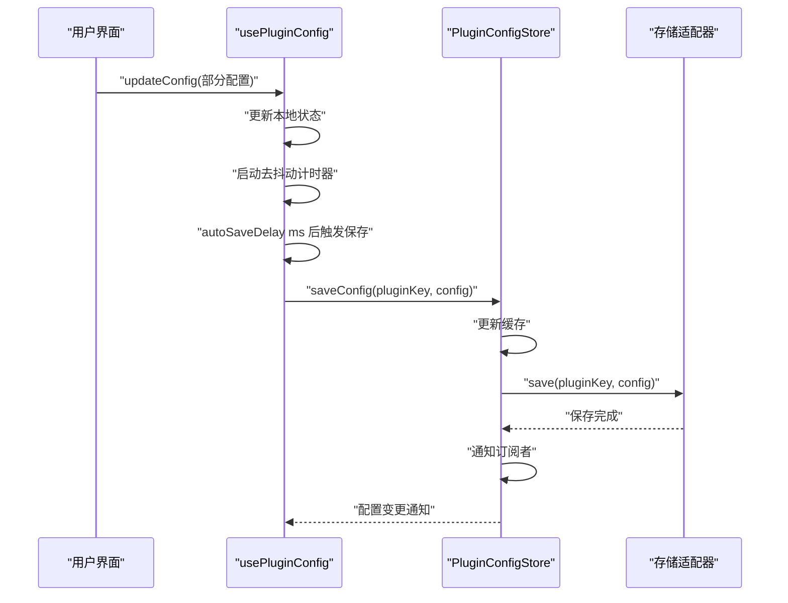
```mermaid
sequenceDiagram
participant UI as "用户界面"
participant Hook as "usePluginConfig"
participant Store as "PluginConfigStore"
participant Adapter as "存储适配器"
UI->>Hook : "updateConfig(部分配置)"
Hook->>Hook : "更新本地状态"
Hook->>Hook : "启动去抖动计时器"
Hook->>Hook : "autoSaveDelay ms 后触发保存"
Hook->>Store : "saveConfig(pluginKey, config)"
Store->>Store : "更新缓存"
Store->>Adapter : "save(pluginKey, config)"
Adapter-->>Store : "保存完成"
Store->>Store : "通知订阅者"
Store-->>Hook : "配置变更通知"
```

**图表来源**
- [packages/core/src/hooks/use-plugin-config.ts](file://packages/core/src/hooks/use-plugin-config.ts#L105-L130)
- [packages/core/src/services/plugin-config-service.ts](file://packages/core/src/services/plugin-config-service.ts#L219-L224)

### 跨标签同步与冲突解决
系统支持跨浏览器标签页的配置同步：

- **外部变更监听**：当其他标签页修改配置时，当前标签页会收到通知
- **自动同步**：接收到变更通知后，本地状态会自动更新
- **冲突解决**：采用"最后写入获胜"策略，确保最新配置优先

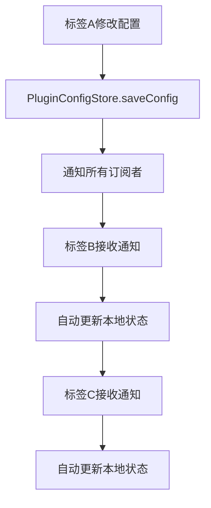
```mermaid
flowchart TD
A["标签A修改配置"] --> B["PluginConfigStore.saveConfig"]
B --> C["通知所有订阅者"]
C --> D["标签B接收通知"]
D --> E["自动更新本地状态"]
E --> F["标签C接收通知"]
F --> G["自动更新本地状态"]
```

**图表来源**
- [packages/core/src/hooks/use-plugin-config.ts](file://packages/core/src/hooks/use-plugin-config.ts#L70-L77)
- [packages/core/src/services/plugin-config-service.ts](file://packages/core/src/services/plugin-config-service.ts#L226-L239)

### 配置系统集成指南

#### 基本使用示例
```typescript
// 插件配置类型定义
interface MyPluginConfig {
  theme: 'light' | 'dark';
  fontSize: number;
  notifications: boolean;
}

// 使用配置系统
function MyPluginComponent() {
  const { 
    config, 
    loading, 
    saving, 
    saveError, 
    updateConfig, 
    saveConfig 
  } = usePluginConfig<MyPluginConfig>({
    pluginKey: 'my-plugin-key',
    defaultConfig: {
      theme: 'light',
      fontSize: 14,
      notifications: true
    },
    autoSaveDelay: 1000
  });

  const handleThemeChange = (theme: 'light' | 'dark') => {
    updateConfig({ theme });
  };

  return (
    <div>
      {/* 配置界面 */}
      <button 
        onClick={() => saveConfig()}
        disabled={saving}
      >
        {saving ? '保存中...' : '保存配置'}
      </button>
    </div>
  );
}
```

#### 高级配置选项
- **禁用自动保存**：设置 `autoSaveDelay: 0` 或省略该选项
- **自定义延迟时间**：根据插件特性调整去抖动时间
- **错误处理**：通过 `saveError` 属性处理保存失败的情况

#### API 接口集成
配置系统使用以下 API 接口：

- `GET /knowledge-wiki/plugin-config/:pluginKey` - 获取单个插件配置
- `POST /knowledge-wiki/plugin-config/:pluginKey` - 保存插件配置
- `GET /knowledge-wiki/plugin-config` - 获取所有插件配置

**章节来源**
- [packages/core/src/hooks/use-plugin-config.ts](file://packages/core/src/hooks/use-plugin-config.ts#L1-L140)
- [packages/core/src/services/plugin-config-service.ts](file://packages/core/src/services/plugin-config-service.ts#L1-L241)
- [packages/core/src/api/index.ts](file://packages/core/src/api/index.ts#L112-L127)

## 桌面IPC处理器

### 概述
桌面应用实现了完整的IPC处理器，专门用于处理插件配置的数据库操作。这些处理器提供了比Web API更高效的数据访问方式，特别是在本地存储场景下。

### pluginConfig:getAll 处理器
该处理器用于获取所有插件配置：

- **功能**：扫描数据库中所有以 `plugin_config:` 开头的设置记录
- **实现**：使用SQL查询过滤相关记录，解析JSON值并提取插件键
- **返回格式**：包含插件键、配置数据和更新时间的列表

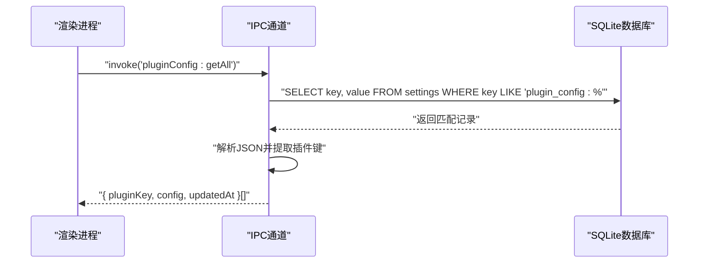
```mermaid
sequenceDiagram
participant Renderer as "渲染进程"
participant IPC as "IPC通道"
participant DB as "SQLite数据库"
Renderer->>IPC : "invoke('pluginConfig : getAll')"
IPC->>DB : "SELECT key, value FROM settings WHERE key LIKE 'plugin_config : %'"
DB-->>IPC : "返回匹配记录"
IPC->>IPC : "解析JSON并提取插件键"
IPC-->>Renderer : "{ pluginKey, config, updatedAt }[]"
```

**图表来源**
- [apps/desktop/src/main/ipc.ts](file://apps/desktop/src/main/ipc.ts#L428-L439)

### pluginConfig:getOrSave 处理器
该处理器支持两种操作模式：

#### GET 模式（获取配置）
- **输入**：插件键字符串
- **功能**：从数据库中检索指定插件的配置
- **返回**：包含插件键、配置数据和更新时间的对象

#### POST 模式（保存配置）
- **输入**：包含配置数据和插件键的对象
- **功能**：将配置数据保存到数据库，包含时间戳
- **返回**：保存成功的确认信息

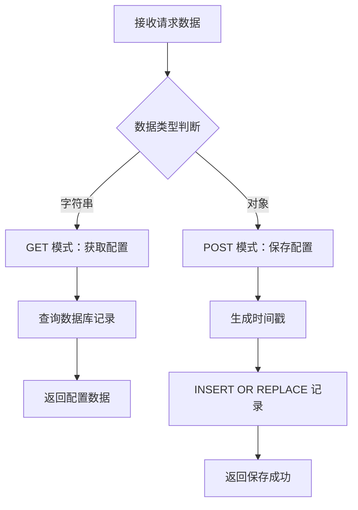
```mermaid
flowchart TD
A["接收请求数据"] --> B{"数据类型判断"}
B --> |字符串| C["GET 模式：获取配置"]
B --> |对象| D["POST 模式：保存配置"]
C --> E["查询数据库记录"]
E --> F["返回配置数据"]
D --> G["生成时间戳"]
G --> H["INSERT OR REPLACE 记录"]
H --> I["返回保存成功"]
```

**图表来源**
- [apps/desktop/src/main/ipc.ts](file://apps/desktop/src/main/ipc.ts#L441-L467)

### 数据库操作细节
处理器使用SQLite数据库进行配置存储：

- **表结构**：settings 表，包含 key、value、updated_at 字段
- **键命名约定**：使用 `plugin_config:{pluginKey}` 格式存储
- **数据序列化**：配置对象转换为JSON字符串存储
- **时间戳管理**：自动记录配置的最后更新时间

**章节来源**
- [apps/desktop/src/main/ipc.ts](file://apps/desktop/src/main/ipc.ts#L426-L486)

## Electron IPC集成

### 概述
Electron IPC集成为插件配置系统提供了高效的本地通信机制。通过URL到IPC通道的映射，RESTful API调用可以自动转换为对应的IPC处理器。

### URL到IPC通道映射
系统维护了一个完整的URL到IPC通道映射表：

- **静态映射**：直接对应的关系，如 `/knowledge-wiki/plugin-config` → `pluginConfig:getAll`
- **动态模式**：使用正则表达式匹配，如 `/knowledge-wiki/plugin-config/:pluginKey` → `pluginConfig:getOrSave`

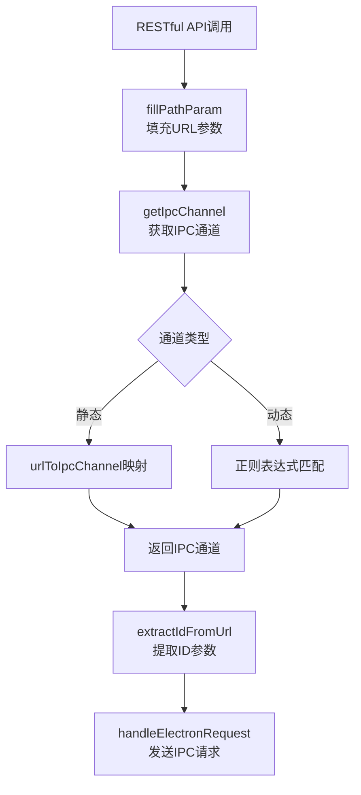
```mermaid
flowchart TD
A["RESTful API调用"] --> B["fillPathParam<br/>填充URL参数"]
B --> C["getIpcChannel<br/>获取IPC通道"]
C --> D{"通道类型"}
D --> |静态| E["urlToIpcChannel映射"]
D --> |动态| F["正则表达式匹配"]
E --> G["返回IPC通道"]
F --> G
G --> H["extractIdFromUrl<br/>提取ID参数"]
H --> I["handleElectronRequest<br/>发送IPC请求"]
```

**图表来源**
- [packages/core/src/hooks/use-api.tsx](file://packages/core/src/hooks/use-api.tsx#L65-L97)
- [packages/core/src/hooks/use-api.tsx](file://packages/core/src/hooks/use-api.tsx#L141-L178)

### 请求处理流程
完整的请求处理流程包括参数提取、数据组合和错误处理：

1. **URL填充**：将参数替换到URL模板中
2. **通道识别**：根据URL和HTTP方法确定IPC通道
3. **ID提取**：从动态URL中提取资源ID
4. **数据准备**：组合请求体和参数，处理特殊场景
5. **IPC调用**：通过electron API发送请求
6. **结果处理**：返回IPC响应给调用方

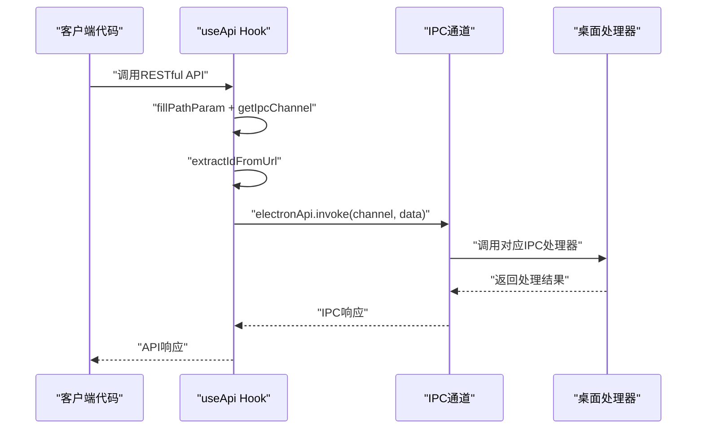
```mermaid
sequenceDiagram
participant Client as "客户端代码"
participant API as "useApi Hook"
participant IPC as "IPC通道"
participant Handler as "桌面处理器"
Client->>API : "调用RESTful API"
API->>API : "fillPathParam + getIpcChannel"
API->>API : "extractIdFromUrl"
API->>IPC : "electronApi.invoke(channel, data)"
IPC->>Handler : "调用对应IPC处理器"
Handler-->>IPC : "返回处理结果"
IPC-->>API : "IPC响应"
API-->>Client : "API响应"
```

**图表来源**
- [packages/core/src/hooks/use-api.tsx](file://packages/core/src/hooks/use-api.tsx#L141-L178)
- [apps/desktop/src/preload/index.ts](file://apps/desktop/src/preload/index.ts#L5-L12)

### 特殊处理规则
系统实现了几个特殊的处理规则：

- **HTTP-only URLs**：某些URL始终使用HTTP而非IPC，如登录、注册和WebSocket操作
- **动态路由合并**：POST请求中同时包含路径参数和请求体时，自动合并为IPC处理器可理解的格式
- **参数提取**：从URL中提取ID参数并添加到请求数据中

**章节来源**
- [packages/core/src/hooks/use-api.tsx](file://packages/core/src/hooks/use-api.tsx#L18-L97)
- [packages/core/src/hooks/use-api.tsx](file://packages/core/src/hooks/use-api.tsx#L141-L178)
- [apps/desktop/src/preload/index.ts](file://apps/desktop/src/preload/index.ts#L1-L29)

## 依赖关系分析
- 组件耦合
  - App 依赖 PluginManager 与 i18n；
  - PluginManager 依赖 importScript、EventEmitter、各插件实例；
  - 插件实例依赖 common 的 KPlugin/PluginConfig；
  - **新增** usePluginConfig 依赖 PluginConfigStore；
  - **新增** PluginConfigStore 依赖存储适配器和 API 接口；
  - **新增** useApi 依赖 Electron IPC 预加载脚本；
  - **新增** 桌面IPC处理器依赖数据库管理器。
- 外部依赖
  - i18next 与 react-i18next：用于国际化；
  - React Router：用于路由；
  - lodash.merge：用于资源合并；
  - **新增** @kn/common：用于日志记录和通用工具；
  - **新增** Electron：用于桌面应用和IPC通信。

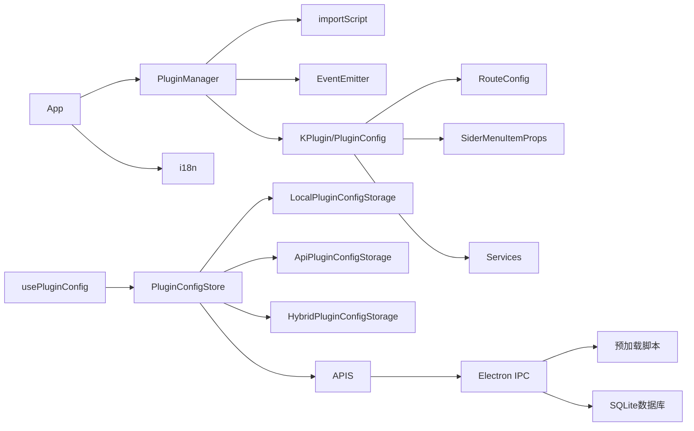
```mermaid
graph LR
APP["App"] --> PM["PluginManager"]
APP --> LO["i18n"]
PM --> IU["importScript"]
PM --> EV["EventEmitter"]
PM --> PC["KPlugin/PluginConfig"]
UPC["usePluginConfig"] --> PCS["PluginConfigStore"]
PCS --> LPS["LocalPluginConfigStorage"]
PCS --> APS["ApiPluginConfigStorage"]
PCS --> HPS["HybridPluginConfigStorage"]
PCS --> API["APIS"]
API --> IPC["Electron IPC"]
IPC --> PRELOAD["预加载脚本"]
IPC --> DB["SQLite数据库"]
PC --> RT["RouteConfig"]
PC --> MN["SiderMenuItemProps"]
PC --> SV["Services"]
```

**图表来源**
- [packages/core/src/App.tsx](file://packages/core/src/App.tsx#L1-L187)
- [packages/common/src/core/PluginManager.ts](file://packages/common/src/core/PluginManager.ts#L1-L170)
- [packages/common/src/utils/import-util.ts](file://packages/common/src/utils/import-util.ts#L1-L23)
- [packages/common/src/event/event.ts](file://packages/common/src/event/event.ts#L1-L44)
- [packages/common/src/core/route.ts](file://packages/common/src/core/route.ts#L1-L8)
- [packages/common/src/core/menu.ts](file://packages/common/src/core/menu.ts#L1-L25)
- [packages/common/src/core/types.ts](file://packages/common/src/core/types.ts#L1-L4)
- [packages/core/src/hooks/use-plugin-config.ts](file://packages/core/src/hooks/use-plugin-config.ts#L1-L2)
- [packages/core/src/services/plugin-config-service.ts](file://packages/core/src/services/plugin-config-service.ts#L1-L10)
- [packages/core/src/hooks/use-api.tsx](file://packages/core/src/hooks/use-api.tsx#L1-L231)
- [apps/desktop/src/main/ipc.ts](file://apps/desktop/src/main/ipc.ts#L426-L486)
- [apps/desktop/src/preload/index.ts](file://apps/desktop/src/preload/index.ts#L1-L29)

**章节来源**
- [packages/core/src/App.tsx](file://packages/core/src/App.tsx#L1-L187)
- [packages/common/src/core/PluginManager.ts](file://packages/common/src/core/PluginManager.ts#L1-L170)

## 性能考虑
- 动态加载优化
  - importScript 已内置缓存，避免重复下载同一插件脚本；
  - 建议在生产环境为插件脚本开启缓存头与版本号，减少缓存穿透。
- 资源合并
  - 国际化资源合并使用增量方式，避免重复初始化；
  - 路由与菜单聚合为 O(n) 遍历，建议控制插件数量与层级深度。
- 事件驱动刷新
  - 使用 REFRESH_PLUSINS 事件触发局部刷新，避免全量重渲染。
- **新增** 配置系统性能优化
  - PluginConfigStore 使用 Map 缓存，配置获取为 O(1) 时间复杂度；
  - 去抖动保存减少不必要的 API 调用；
  - 混合存储策略确保快速响应和可靠持久化。
- **新增** IPC通信优化
  - URL到IPC映射减少重复的条件判断；
  - 预加载脚本提供稳定的IPC接口；
  - 数据库操作使用索引和批量处理提高性能。

## 故障排除指南
- 插件未显示
  - 检查插件是否正确导出 KPlugin 实例并传入 PluginManager；
  - 确认 init 是否成功执行，以及是否触发了 REFRESH_PLUSINS。
- 路由无效
  - 确认 routes 中 path 唯一且与 App 路由拼装逻辑兼容；
  - 检查 children 是否正确嵌套。
- 菜单不出现
  - 确认 menus 字段存在且 key/id 唯一；
  - 检查侧边栏组件是否读取了 PluginManager.resloveMenus 的结果。
- 国际化不生效
  - 确认 locales 结构符合 i18next 资源包格式；
  - 检查 App 是否在初始化后执行了资源合并与 i18n 初始化。
- 动态加载失败
  - 检查 importScript 返回的 window 上是否存在插件命名空间；
  - 查看网络面板确认脚本地址与缓存参数正确。
- **新增** 配置系统问题
  - 配置不保存：检查 autoSaveDelay 设置和 saveError 错误信息；
  - 跨标签不同步：确认浏览器允许 localStorage 和跨标签通信；
  - API 调用失败：检查网络连接和 API 端点可达性；
  - 配置丢失：验证存储适配器是否正常工作，检查浏览器存储限制。
- **新增** IPC通信问题
  - 无法找到IPC通道：检查URL到IPC映射表中是否有对应条目；
  - IPC调用超时：确认桌面处理器是否正确注册和实现；
  - 数据库操作失败：检查SQLite连接和表结构是否正确。
- **新增** 桌面应用问题
  - 预加载脚本加载失败：检查preload脚本是否正确暴露API对象；
  - Electron环境检测失败：确认window.api对象是否在Electron环境中可用。

**章节来源**
- [packages/common/src/utils/import-util.ts](file://packages/common/src/utils/import-util.ts#L1-L23)
- [packages/common/src/event/event.ts](file://packages/common/src/event/event.ts#L1-L44)
- [packages/core/src/App.tsx](file://packages/core/src/App.tsx#L131-L167)
- [packages/core/src/hooks/use-plugin-config.ts](file://packages/core/src/hooks/use-plugin-config.ts#L90-L103)
- [packages/core/src/services/plugin-config-service.ts](file://packages/core/src/services/plugin-config-service.ts#L80-L114)
- [packages/core/src/hooks/use-api.tsx](file://packages/core/src/hooks/use-api.tsx#L141-L178)
- [apps/desktop/src/main/ipc.ts](file://apps/desktop/src/main/ipc.ts#L426-L486)
- [apps/desktop/src/preload/index.ts](file://apps/desktop/src/preload/index.ts#L1-L29)

## 结论
通过统一的插件配置接口与 PluginManager 聚合机制，系统实现了对路由、菜单、国际化与编辑器扩展的灵活集成。新增的插件配置系统进一步增强了系统的可扩展性和用户体验，提供了自动持久化、去抖动保存、跨标签同步和冲突解决等高级功能。桌面应用中的IPC处理器和数据库操作为本地配置提供了高性能的存储方案。Electron IPC集成使得RESTful API调用可以无缝转换为本地IPC通信，提升了整体性能和用户体验。建议在实践中严格遵守命名规范与资源合并策略，以降低冲突概率并提升维护效率。

## 附录

### 实际配置示例（路径参考）
- 默认插件（路由、菜单、服务、国际化）
  - [packages/plugin-main/src/index.tsx](file://packages/plugin-main/src/index.tsx#L1-L118)
- AI 插件（编辑器扩展、国际化）
  - [packages/plugin-ai/src/index.tsx](file://packages/plugin-ai/src/index.tsx#L1-L35)
- Mermaid 插件（编辑器扩展）
  - [packages/plugin-mermaid/src/index.tsx](file://packages/plugin-mermaid/src/index.tsx#L1-L17)
- 数据库插件（编辑器扩展）
  - [packages/plugin-database/src/index.tsx](file://packages/plugin-database/src/index.tsx#L1-L17)
- 编辑器内置扩展集合
  - [packages/editor/src/editor/build-in-extension.ts](file://packages/editor/src/editor/build-in-extension.ts#L1-L56)
  - [packages/editor/src/extensions/index.ts](file://packages/editor/src/extensions/index.ts#L1-L64)
- **新增** 插件配置系统
  - [packages/core/src/hooks/use-plugin-config.ts](file://packages/core/src/hooks/use-plugin-config.ts#L1-L140)
  - [packages/core/src/services/plugin-config-service.ts](file://packages/core/src/services/plugin-config-service.ts#L1-L241)
  - [packages/core/src/api/index.ts](file://packages/core/src/api/index.ts#L112-L127)
  - [packages/core/src/hooks/use-api.tsx](file://packages/core/src/hooks/use-api.tsx#L1-L231)
- **新增** 桌面IPC处理器
  - [apps/desktop/src/main/ipc.ts](file://apps/desktop/src/main/ipc.ts#L426-L486)
  - [apps/desktop/src/preload/index.ts](file://apps/desktop/src/preload/index.ts#L1-L29)

### 关键流程图：插件安装/卸载
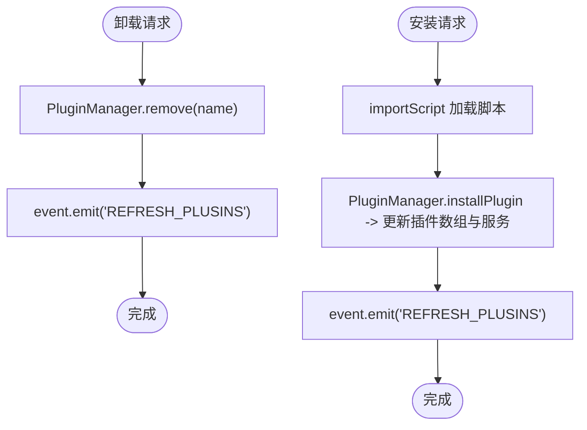
```mermaid
flowchart TD
UStart(["卸载请求"]) --> Remove["PluginManager.remove(name)"]
Remove --> Refresh["event.emit('REFRESH_PLUSINS')"]
Refresh --> UEnd(["完成"])
IStart(["安装请求"]) --> Load["importScript 加载脚本"]
Load --> Add["PluginManager.installPlugin -> 更新插件数组与服务"]
Add --> Refresh2["event.emit('REFRESH_PLUSINS')"]
Refresh2 --> IEnd(["完成"])
```

**图表来源**
- [packages/common/src/core/PluginManager.ts](file://packages/common/src/core/PluginManager.ts#L99-L112)
- [packages/common/src/utils/import-util.ts](file://packages/common/src/utils/import-util.ts#L1-L23)
- [packages/common/src/event/event.ts](file://packages/common/src/event/event.ts#L1-L44)

### 配置系统流程图
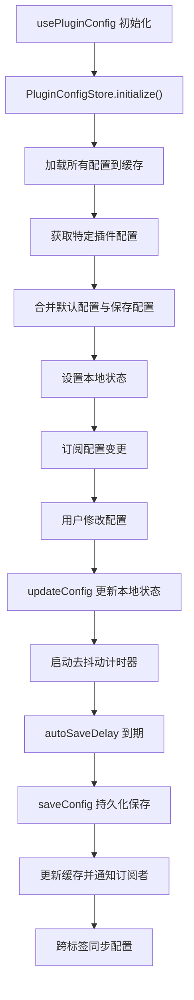
```mermaid
flowchart TD
A["usePluginConfig 初始化"] --> B["PluginConfigStore.initialize()"]
B --> C["加载所有配置到缓存"]
C --> D["获取特定插件配置"]
D --> E["合并默认配置与保存配置"]
E --> F["设置本地状态"]
F --> G["订阅配置变更"]
G --> H["用户修改配置"]
H --> I["updateConfig 更新本地状态"]
I --> J["启动去抖动计时器"]
J --> K["autoSaveDelay 到期"]
K --> L["saveConfig 持久化保存"]
L --> M["更新缓存并通知订阅者"]
M --> N["跨标签同步配置"]
```

**图表来源**
- [packages/core/src/hooks/use-plugin-config.ts](file://packages/core/src/hooks/use-plugin-config.ts#L48-L130)
- [packages/core/src/services/plugin-config-service.ts](file://packages/core/src/services/plugin-config-service.ts#L190-L239)

### IPC通信流程图
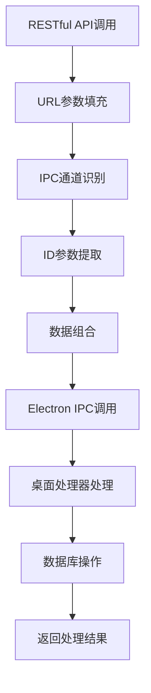
```mermaid
flowchart TD
A["RESTful API调用"] --> B["URL参数填充"]
B --> C["IPC通道识别"]
C --> D["ID参数提取"]
D --> E["数据组合"]
E --> F["Electron IPC调用"]
F --> G["桌面处理器处理"]
G --> H["数据库操作"]
H --> I["返回处理结果"]
```

**图表来源**
- [packages/core/src/hooks/use-api.tsx](file://packages/core/src/hooks/use-api.tsx#L141-L178)
- [apps/desktop/src/main/ipc.ts](file://apps/desktop/src/main/ipc.ts#L426-L486)
- [apps/desktop/src/preload/index.ts](file://apps/desktop/src/preload/index.ts#L1-L29)