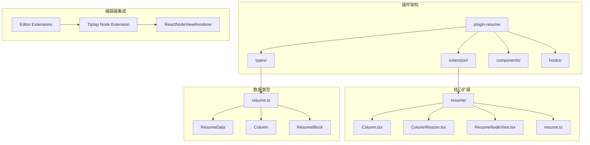
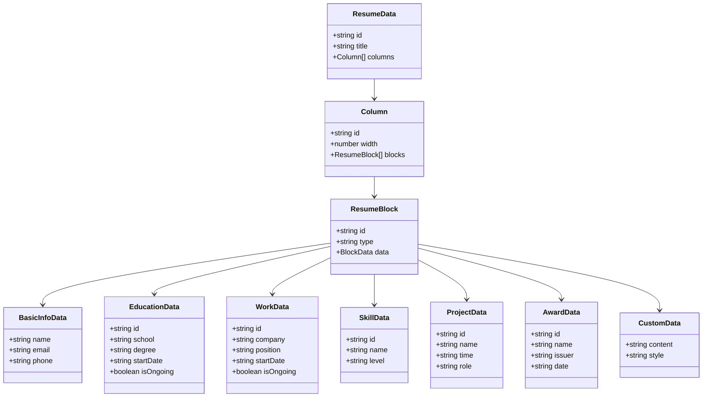
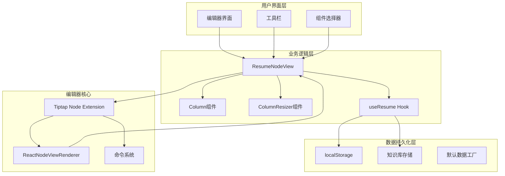
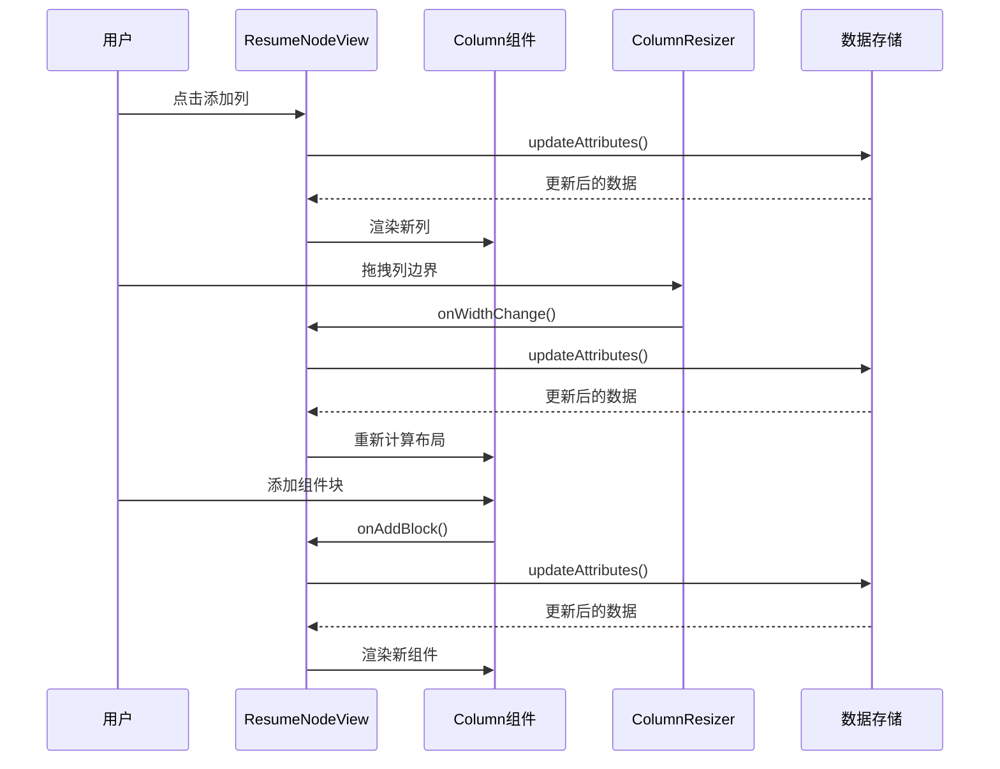
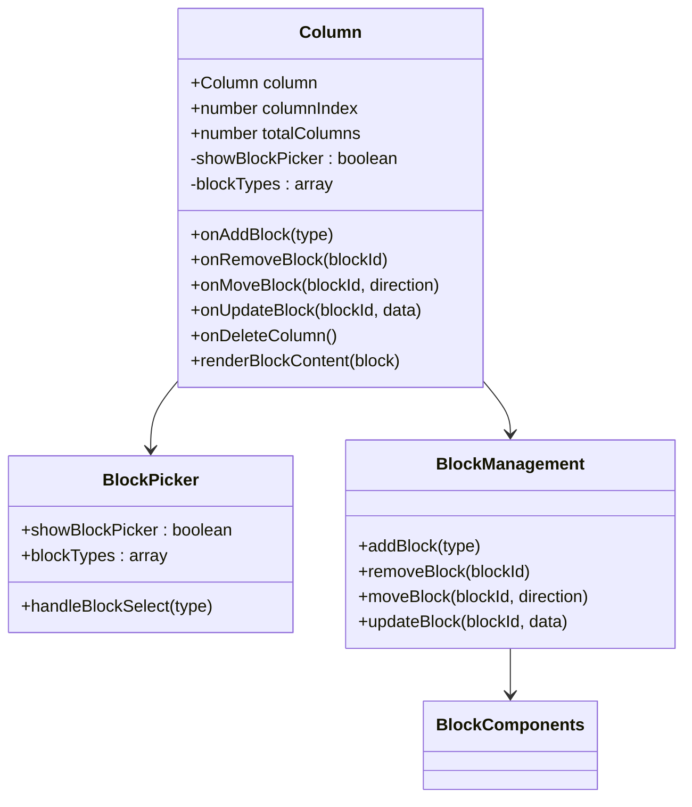
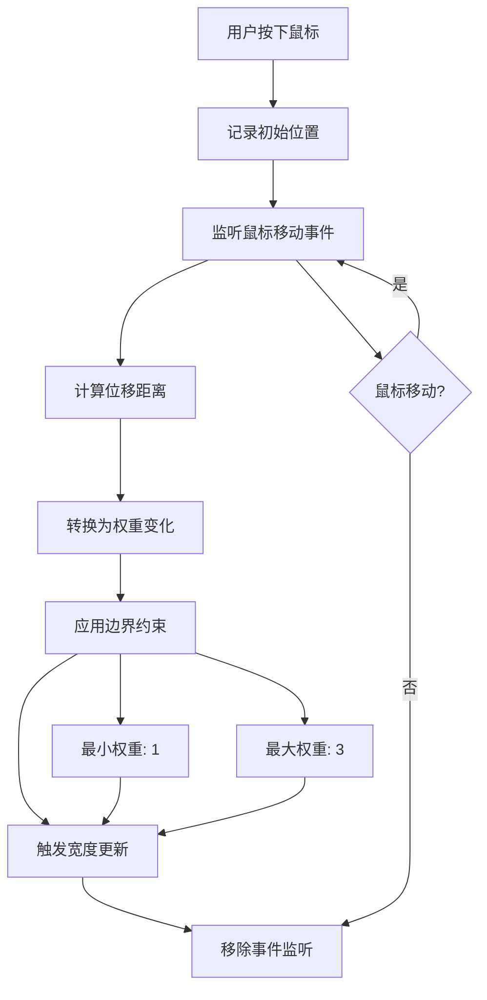
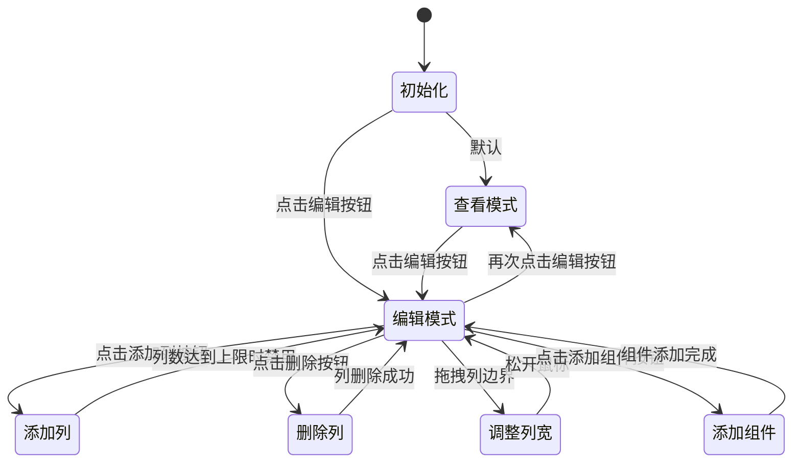
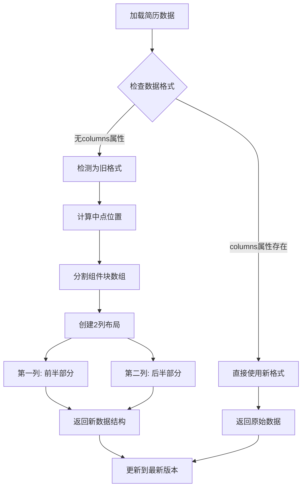

# 简历插件多列布局系统

<cite>
**本文档引用的文件**
- [2026-03-16-resume-column-layout.md](file://docs/superpowers/plans/2026-03-16-resume-column-layout.md)
- [2026-03-16-resume-column-layout-design.md](file://docs/superpowers/specs/2026-03-16-resume-column-layout-design.md)
- [2026-03-16-resume-plugin-implementation.md](file://docs/superpowers/plans/2026-03-16-resume-plugin-implementation.md)
- [2026-03-16-resume-plugin-design.md](file://docs/superpowers/specs/2026-03-16-resume-plugin-design.md)
- [column.tsx](file://packages/editor/src/extensions/columns/column.tsx)
</cite>

## 目录
1. [简介](#简介)
2. [项目结构](#项目结构)
3. [核心组件](#核心组件)
4. [架构概览](#架构概览)
5. [详细组件分析](#详细组件分析)
6. [依赖关系分析](#依赖关系分析)
7. [性能考虑](#性能考虑)
8. [故障排除指南](#故障排除指南)
9. [结论](#结论)

## 简介

简历插件多列布局系统是一个基于 Tiptap 编辑器的高级简历制作工具，支持将传统的垂直列表布局升级为灵活的多列网格布局。该系统允许用户创建2-4列的简历布局，每列可以独立管理组件块，支持拖拽调整列宽、动态添加删除列等高级功能。

本系统采用现代化的技术栈，包括 React 18、TypeScript、Tailwind CSS 和 Tiptap，提供了完整的简历编辑体验，从基础信息到复杂的工作经历都能通过直观的界面进行管理。

## 项目结构

简历插件多列布局系统遵循模块化的设计原则，主要分为以下几个核心部分：



**图表来源**
- [2026-03-16-resume-column-layout-design.md:113-122](file://docs/superpowers/specs/2026-03-16-resume-column-layout-design.md#L113-L122)
- [2026-03-16-resume-plugin-implementation.md:53-86](file://docs/superpowers/plans/2026-03-16-resume-plugin-implementation.md#L53-L86)

系统采用分层架构设计，每个层级都有明确的职责分工：

- **types层**：定义完整的数据结构和类型系统
- **extension层**：实现 Tiptap 扩展和节点视图
- **components层**：提供可复用的 UI 组件
- **hooks层**：管理状态和业务逻辑

**章节来源**
- [2026-03-16-resume-column-layout-design.md:1-133](file://docs/superpowers/specs/2026-03-16-resume-column-layout-design.md#L1-L133)
- [2026-03-16-resume-plugin-implementation.md:13-96](file://docs/superpowers/plans/2026-03-16-resume-plugin-implementation.md#L13-L96)

## 核心组件

### 数据类型系统

系统的核心数据结构经过精心设计，支持复杂的多列布局需求：



**图表来源**
- [2026-03-16-resume-column-layout-design.md:8-28](file://docs/superpowers/specs/2026-03-16-resume-column-layout-design.md#L8-L28)

### 列宽调节机制

系统实现了智能的列宽调节功能，支持1-3的权重范围：

```mermaid
flowchart TD
A[用户拖拽列边界] --> B{计算鼠标位移}
B --> C[计算权重变化]
C --> D[应用最小值约束]
D --> E[应用最大值约束]
E --> F[更新列宽权重]
F --> G[重新计算总权重]
G --> H[更新CSS样式]
H --> I[渲染更新后的布局]
D --> J[权重 = max(1, weight)]
E --> K[权重 = min(3, weight)]
J --> F
K --> F
```

**图表来源**
- [2026-03-16-resume-column-layout.md:263-293](file://docs/superpowers/plans/2026-03-16-resume-column-layout.md#L263-L293)

**章节来源**
- [2026-03-16-resume-column-layout-design.md:1-133](file://docs/superpowers/specs/2026-03-16-resume-column-layout-design.md#L1-L133)
- [2026-03-16-resume-column-layout.md:36-86](file://docs/superpowers/plans/2026-03-16-resume-column-layout.md#L36-L86)

## 架构概览

### 系统架构图



**图表来源**
- [2026-03-16-resume-column-layout-design.md:106-122](file://docs/superpowers/specs/2026-03-16-resume-column-layout-design.md#L106-L122)

### 数据流架构

系统采用双向数据绑定机制，确保用户操作能够实时反映到数据结构中：



**图表来源**
- [2026-03-16-resume-column-layout.md:328-496](file://docs/superpowers/plans/2026-03-16-resume-column-layout.md#L328-L496)

**章节来源**
- [2026-03-16-resume-column-layout-design.md:40-133](file://docs/superpowers/specs/2026-03-16-resume-column-layout-design.md#L40-L133)

## 详细组件分析

### Column 组件

Column 组件是多列布局系统的核心，负责管理单个列内的所有组件块：



**图表来源**
- [2026-03-16-resume-column-layout.md:98-229](file://docs/superpowers/plans/2026-03-16-resume-column-layout.md#L98-L229)

Column 组件的主要特性包括：

1. **组件块管理**：支持添加、删除、移动和更新组件块
2. **块类型选择**：提供7种不同的组件块类型
3. **交互控制**：支持块的上下移动和删除操作
4. **条件渲染**：根据列内是否有组件块显示不同内容

**章节来源**
- [2026-03-16-resume-column-layout.md:90-242](file://docs/superpowers/plans/2026-03-16-resume-column-layout.md#L90-L242)

### ColumnResizer 组件

ColumnResizer 组件实现了列宽的拖拽调节功能：



**图表来源**
- [2026-03-16-resume-column-layout.md:263-293](file://docs/superpowers/plans/2026-03-16-resume-column-layout.md#L263-L293)

该组件的关键实现细节：

- **拖拽事件处理**：使用原生 DOM 事件监听器
- **权重计算**：每10像素变化对应1个权重单位
- **边界保护**：确保权重在1-3范围内
- **事件清理**：及时移除事件监听器防止内存泄漏

**章节来源**
- [2026-03-16-resume-column-layout.md:248-306](file://docs/superpowers/plans/2026-03-16-resume-column-layout.md#L248-L306)

### ResumeNodeView 主视图

ResumeNodeView 是整个多列布局系统的主控制器，协调各个组件的工作：



**图表来源**
- [2026-03-16-resume-column-layout.md:328-496](file://docs/superpowers/plans/2026-03-16-resume-column-layout.md#L328-L496)

主视图的核心功能包括：

1. **状态管理**：维护编辑/查看两种模式
2. **列操作**：支持动态添加和删除列
3. **数据同步**：通过 updateAttributes 方法同步数据
4. **布局计算**：根据权重动态计算列宽

**章节来源**
- [2026-03-16-resume-column-layout.md:310-564](file://docs/superpowers/plans/2026-03-16-resume-column-layout.md#L310-L564)

### 数据迁移机制

系统实现了智能的数据迁移功能，确保向后兼容性：



**图表来源**
- [2026-03-16-resume-column-layout.md:704-735](file://docs/superpowers/plans/2026-03-16-resume-column-layout.md#L704-L735)

**章节来源**
- [2026-03-16-resume-column-layout.md:692-747](file://docs/superpowers/plans/2026-03-16-resume-column-layout.md#L692-L747)

## 依赖关系分析

### 技术栈依赖

系统采用现代化的技术栈，各组件之间的依赖关系清晰：

```mermaid
graph TB
subgraph "前端框架"
A[React 18]
B[Tailwind CSS]
C[TypeScript]
end
subgraph "编辑器核心"
D[Tiptap]
E[@tiptap/core]
F[@tiptap/react]
end
subgraph "UI组件库"
G[shadcn/ui]
H[@kn/ui]
end
subgraph "工具库"
I[uuid]
J[lucide-react]
end
A --> D
B --> G
C --> A
D --> E
D --> F
G --> H
A --> I
A --> J
```

**图表来源**
- [2026-03-16-resume-plugin-implementation.md:39-48](file://docs/superpowers/plans/2026-03-16-resume-plugin-implementation.md#L39-L48)

### 组件间耦合度分析

系统设计遵循低耦合高内聚的原则：

- **Column 组件**：与 ResumeNodeView 强关联，但内部封装良好
- **ColumnResizer 组件**：独立性强，仅依赖外部回调函数
- **数据类型**：纯 TypeScript 接口定义，无运行时依赖
- **扩展系统**：与 Tiptap 解耦，便于移植

**章节来源**
- [2026-03-16-resume-column-layout-design.md:106-133](file://docs/superpowers/specs/2026-03-16-resume-column-layout-design.md#L106-L133)

## 性能考虑

### 渲染优化策略

系统采用了多种性能优化策略：

1. **虚拟滚动**：对于大量组件块的情况，考虑实现虚拟滚动
2. **状态分离**：将编辑状态与展示状态分离，减少不必要的重渲染
3. **事件节流**：对拖拽事件进行节流处理
4. **懒加载**：组件块按需加载，提高初始渲染速度

### 内存管理

- **事件监听器清理**：确保拖拽结束后及时移除事件监听器
- **组件卸载处理**：正确处理组件卸载时的状态清理
- **数据缓存策略**：合理使用 localStorage 避免频繁读写

## 故障排除指南

### 常见问题及解决方案

| 问题类型 | 症状描述 | 可能原因 | 解决方案 |
|---------|---------|---------|---------|
| 布局异常 | 列宽不正确或布局错乱 | 数据权重计算错误 | 检查权重值范围和总权重计算 |
| 组件丢失 | 添加的组件块消失 | 数据更新失败 | 验证 updateAttributes 调用 |
| 拖拽失效 | 无法拖拽调整列宽 | 事件监听器未正确绑定 | 检查鼠标事件处理逻辑 |
| 性能问题 | 操作卡顿 | 渲染次数过多 | 实施虚拟滚动和状态优化 |

### 调试建议

1. **开发者工具**：使用浏览器开发者工具监控组件渲染
2. **日志输出**：在关键操作处添加日志输出
3. **单元测试**：为核心算法编写单元测试
4. **性能分析**：定期使用性能分析工具检查瓶颈

**章节来源**
- [2026-03-16-resume-column-layout.md:751-764](file://docs/superpowers/plans/2026-03-16-resume-column-layout.md#L751-L764)

## 结论

简历插件多列布局系统是一个设计精良、功能完善的现代简历制作工具。通过采用模块化的架构设计和先进的技术栈，系统不仅提供了丰富的功能特性，还保证了良好的用户体验和可维护性。

系统的主要优势包括：

1. **灵活的布局系统**：支持2-4列的自适应布局
2. **直观的交互设计**：拖拽操作简单易用
3. **完整的数据管理**：支持数据迁移和版本控制
4. **良好的扩展性**：模块化设计便于功能扩展
5. **优秀的性能表现**：优化的渲染和状态管理

该系统为用户提供了专业的简历制作体验，是知识库平台中不可或缺的重要组成部分。通过持续的功能完善和性能优化，相信该系统能够在未来的使用中发挥更大的价值。