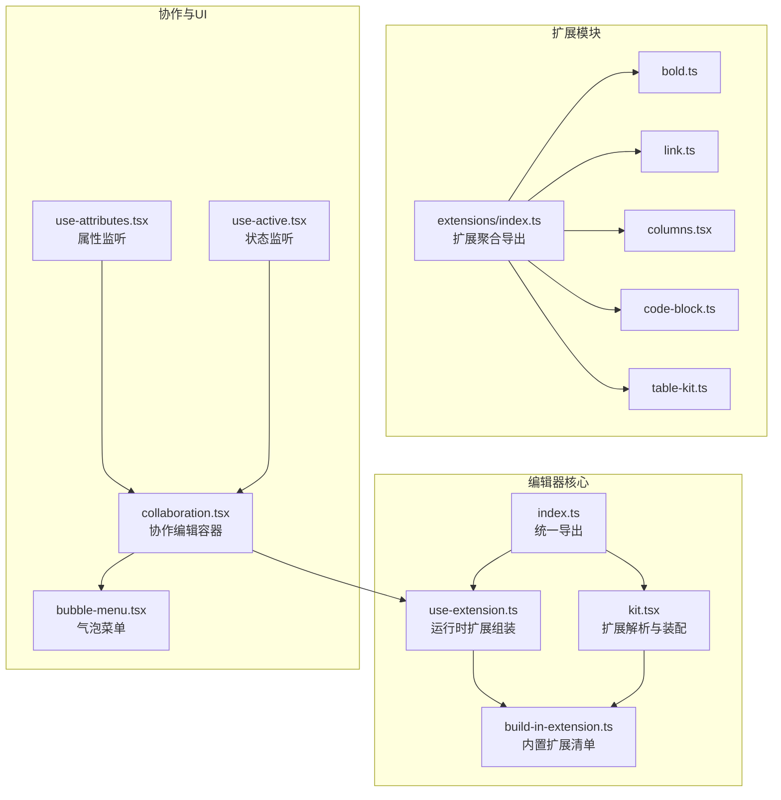
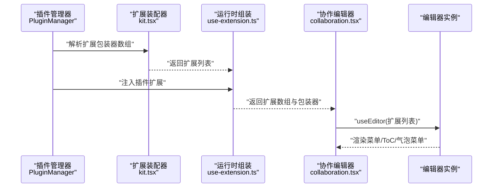
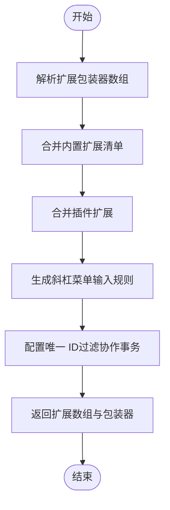
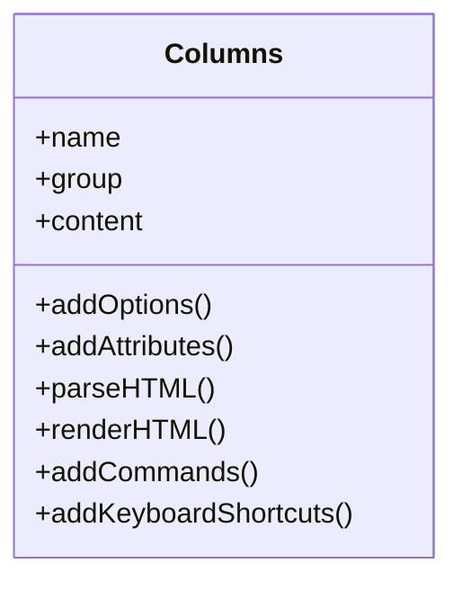
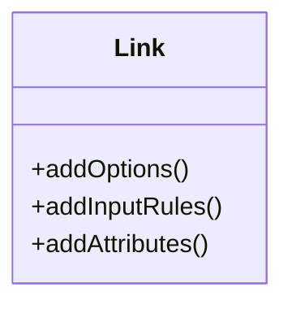
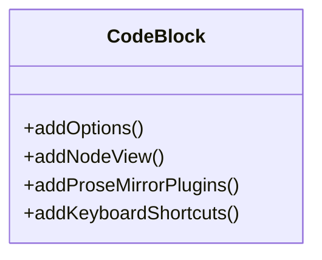
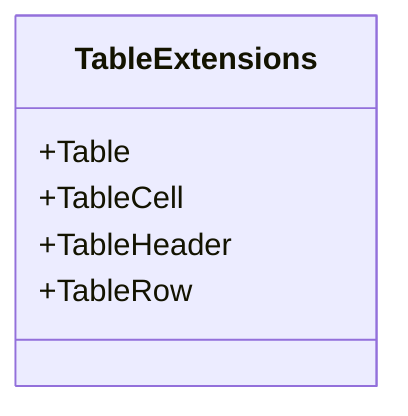
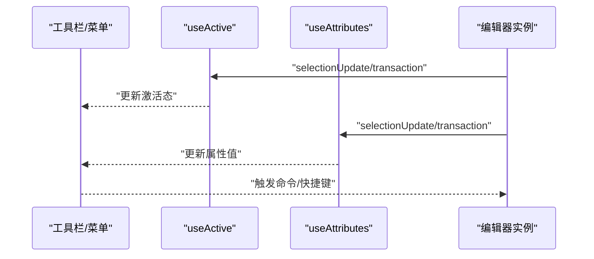
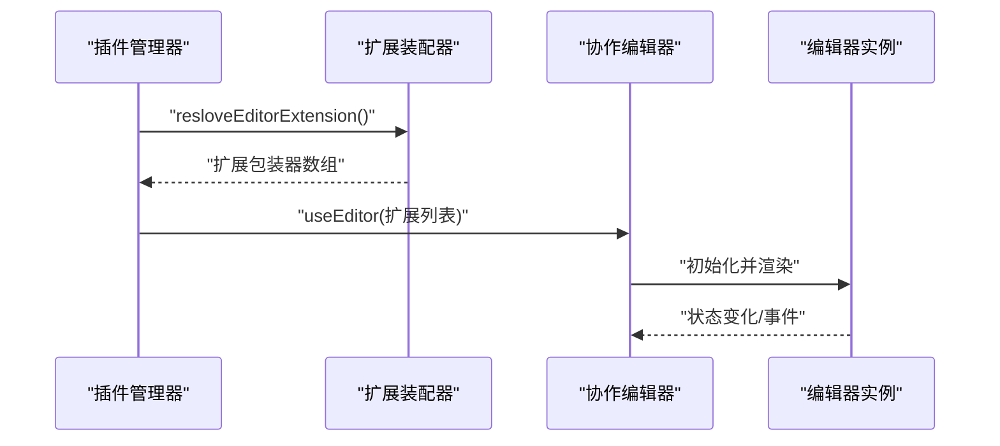
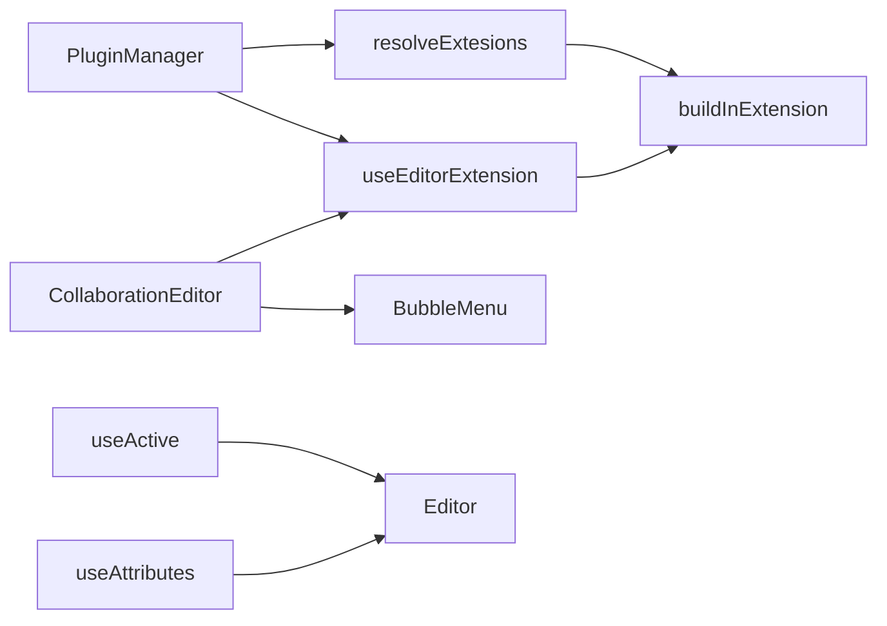

# 编辑器扩展开发

<cite>
**本文引用的文件**
- [packages/editor/src/index.ts](file://packages/editor/src/index.ts)
- [packages/editor/src/extensions/index.ts](file://packages/editor/src/extensions/index.ts)
- [packages/editor/src/editor/kit.tsx](file://packages/editor/src/editor/kit.tsx)
- [packages/editor/src/editor/use-extension.ts](file://packages/editor/src/editor/use-extension.ts)
- [packages/editor/src/editor/build-in-extension.ts](file://packages/editor/src/editor/build-in-extension.ts)
- [packages/editor/src/editor/collaboration.tsx](file://packages/editor/src/editor/collaboration.tsx)
- [packages/editor/src/hooks/use-active.tsx](file://packages/editor/src/hooks/use-active.tsx)
- [packages/editor/src/hooks/use-attributes.tsx](file://packages/editor/src/hooks/use-attributes.tsx)
- [packages/editor/src/components/bubble-menu.tsx](file://packages/editor/src/components/bubble-menu.tsx)
- [packages/editor/src/extensions/bold/bold.ts](file://packages/editor/src/extensions/bold/bold.ts)
- [packages/editor/src/extensions/link/link.ts](file://packages/editor/src/extensions/link/link.ts)
- [packages/editor/src/extensions/columns/columns.tsx](file://packages/editor/src/extensions/columns/columns.tsx)
- [packages/editor/src/extensions/code-block/code-block.ts](file://packages/editor/src/extensions/code-block/code-block.ts)
- [packages/editor/src/extensions/table/table-kit.ts](file://packages/editor/src/extensions/table/table-kit.ts)
- [packages/common/src/core/PluginManager.ts](file://packages/common/src/core/PluginManager.ts)
</cite>

## 目录
1. [引言](#引言)
2. [项目结构](#项目结构)
3. [核心组件](#核心组件)
4. [架构总览](#架构总览)
5. [详细组件分析](#详细组件分析)
6. [依赖关系分析](#依赖关系分析)
7. [性能考虑](#性能考虑)
8. [故障排查指南](#故障排查指南)
9. [结论](#结论)
10. [附录](#附录)

## 引言
本指南面向希望基于 Tiptap 框架开发自定义编辑器扩展的工程师与产品团队。文档系统性阐述扩展的基本结构、生命周期钩子与事件处理机制；解释扩展的分类与功能（节点扩展、标记扩展、输入规则、命令扩展等）；提供可落地的开发示例（自定义菜单项、工具栏按钮、快捷键绑定）；说明扩展与编辑器核心系统的集成方式（状态管理、撤销重做、协作同步）；并给出测试与调试技巧及性能优化最佳实践。

## 项目结构
编辑器扩展体系位于 packages/editor 中，围绕“内置扩展集合 + 插件扩展注入 + 扩展装配器”的模式组织：
- 扩展入口与导出：通过统一入口导出扩展、工具函数与 React 集成能力，便于上层按需引入。
- 扩展目录：按功能域拆分扩展模块，每个扩展通常包含扩展定义、菜单/气泡菜单、视图组件等。
- 装配器：负责将内置扩展与插件扩展合并、解析、配置，形成最终的扩展列表。
- 协作与状态：提供协作编辑容器、菜单、ToC 等配套能力，并通过 hooks 实现状态联动。

图表来源
- [packages/editor/src/index.ts](file://packages/editor/src/index.ts#L1-L23)
- [packages/editor/src/editor/kit.tsx](file://packages/editor/src/editor/kit.tsx#L1-L87)
- [packages/editor/src/editor/use-extension.ts](file://packages/editor/src/editor/use-extension.ts#L1-L63)
- [packages/editor/src/editor/build-in-extension.ts](file://packages/editor/src/editor/build-in-extension.ts#L1-L56)
- [packages/editor/src/extensions/index.ts](file://packages/editor/src/extensions/index.ts#L1-L64)
- [packages/editor/src/extensions/bold/bold.ts](file://packages/editor/src/extensions/bold/bold.ts#L1-L4)
- [packages/editor/src/extensions/link/link.ts](file://packages/editor/src/extensions/link/link.ts#L1-L66)
- [packages/editor/src/extensions/columns/columns.tsx](file://packages/editor/src/extensions/columns/columns.tsx#L1-L130)
- [packages/editor/src/extensions/code-block/code-block.ts](file://packages/editor/src/extensions/code-block/code-block.ts#L1-L84)
- [packages/editor/src/extensions/table/table-kit.ts](file://packages/editor/src/extensions/table/table-kit.ts#L1-L17)
- [packages/editor/src/editor/collaboration.tsx](file://packages/editor/src/editor/collaboration.tsx#L1-L142)
- [packages/editor/src/components/bubble-menu.tsx](file://packages/editor/src/components/bubble-menu.tsx#L1-L84)
- [packages/editor/src/hooks/use-active.tsx](file://packages/editor/src/hooks/use-active.tsx#L1-L32)
- [packages/editor/src/hooks/use-attributes.tsx](file://packages/editor/src/hooks/use-attributes.tsx#L1-L53)

章节来源
- [packages/editor/src/index.ts](file://packages/editor/src/index.ts#L1-L23)
- [packages/editor/src/extensions/index.ts](file://packages/editor/src/extensions/index.ts#L1-L64)

## 核心组件
- 扩展装配器
  - 解析扩展包装器数组，生成最终扩展列表；支持动态拼接内置扩展与插件扩展。
  - 提供斜杠菜单解析器，将插件扩展的“斜杠菜单”配置转换为输入规则。
- 运行时扩展组装
  - 在运行时组合基础扩展（标题、段落、文本、占位符、尾随节点、性能监控、唯一 ID 等），并注入插件扩展与斜杠菜单。
- 内置扩展清单
  - 统一导出所有内置扩展，便于集中管理与按需启用。
- 统一导出
  - 对外暴露扩展、工具函数、React 集成与 ProseMirror 类型，简化上层使用。

章节来源
- [packages/editor/src/editor/kit.tsx](file://packages/editor/src/editor/kit.tsx#L1-L87)
- [packages/editor/src/editor/use-extension.ts](file://packages/editor/src/editor/use-extension.ts#L1-L63)
- [packages/editor/src/editor/build-in-extension.ts](file://packages/editor/src/editor/build-in-extension.ts#L1-L56)
- [packages/editor/src/index.ts](file://packages/editor/src/index.ts#L1-L23)

## 架构总览
下图展示从“插件扩展注入”到“编辑器实例化”的端到端流程，包括扩展解析、装配、协作容器挂载与菜单联动。

图表来源
- [packages/common/src/core/PluginManager.ts](file://packages/common/src/core/PluginManager.ts#L1-L170)
- [packages/editor/src/editor/kit.tsx](file://packages/editor/src/editor/kit.tsx#L1-L87)
- [packages/editor/src/editor/use-extension.ts](file://packages/editor/src/editor/use-extension.ts#L1-L63)
- [packages/editor/src/editor/collaboration.tsx](file://packages/editor/src/editor/collaboration.tsx#L1-L142)

## 详细组件分析

### 扩展装配器与运行时组装
- 职责
  - 将扩展包装器转换为 Tiptap 扩展实例；合并内置扩展与插件扩展；生成斜杠菜单输入规则。
  - 在运行时组合基础扩展（标题/文档、段落、文本、占位符、尾随节点、性能监控、唯一 ID 等），并注入插件扩展与斜杠菜单。
- 关键点
  - 唯一 ID 的类型过滤与事务过滤，避免协作变更被重复写入。
  - 斜杠菜单的字符、插件键与条目由扩展包装器汇总生成。
- 典型调用链
  - 插件管理器收集各插件扩展包装器 → 装配器解析 → 运行时组装 → 编辑器实例化。

图表来源
- [packages/editor/src/editor/kit.tsx](file://packages/editor/src/editor/kit.tsx#L23-L87)
- [packages/editor/src/editor/use-extension.ts](file://packages/editor/src/editor/use-extension.ts#L20-L63)
- [packages/editor/src/editor/build-in-extension.ts](file://packages/editor/src/editor/build-in-extension.ts#L1-L56)

章节来源
- [packages/editor/src/editor/kit.tsx](file://packages/editor/src/editor/kit.tsx#L1-L87)
- [packages/editor/src/editor/use-extension.ts](file://packages/editor/src/editor/use-extension.ts#L1-L63)
- [packages/editor/src/editor/build-in-extension.ts](file://packages/editor/src/editor/build-in-extension.ts#L1-L56)

### 扩展分类与示例

#### 节点扩展（以 Columns 为例）
- 结构要点
  - 定义节点名称、分组、内容约束、HTML 解析/渲染、属性、命令、键盘快捷键等。
  - 可选：注册 NodeView 渲染器以承载复杂交互视图。
- 示例路径
  - 节点定义与命令、快捷键：[packages/editor/src/extensions/columns/columns.tsx](file://packages/editor/src/extensions/columns/columns.tsx#L1-L130)

图表来源
- [packages/editor/src/extensions/columns/columns.tsx](file://packages/editor/src/extensions/columns/columns.tsx#L1-L130)

章节来源
- [packages/editor/src/extensions/columns/columns.tsx](file://packages/editor/src/extensions/columns/columns.tsx#L1-L130)

#### 标记扩展（以 Link 为例）
- 结构要点
  - 基于内置 Link 扩展进行扩展，覆盖选项、输入规则与属性解析。
  - 支持 Markdown 链接语法与 URL 自动识别的输入规则。
- 示例路径
  - 扩展定义与输入规则：[packages/editor/src/extensions/link/link.ts](file://packages/editor/src/extensions/link/link.ts#L1-L66)

图表来源
- [packages/editor/src/extensions/link/link.ts](file://packages/editor/src/extensions/link/link.ts#L1-L66)

章节来源
- [packages/editor/src/extensions/link/link.ts](file://packages/editor/src/extensions/link/link.ts#L1-L66)

#### 输入规则扩展（以 CodeBlock 为例）
- 结构要点
  - 在内置代码块基础上扩展：注册 NodeView、注入低亮插件、自定义键盘行为（如在末尾双换行自动退出代码块）。
- 示例路径
  - 代码块扩展与键盘处理：[packages/editor/src/extensions/code-block/code-block.ts](file://packages/editor/src/extensions/code-block/code-block.ts#L1-L84)

图表来源
- [packages/editor/src/extensions/code-block/code-block.ts](file://packages/editor/src/extensions/code-block/code-block.ts#L1-L84)

章节来源
- [packages/editor/src/extensions/code-block/code-block.ts](file://packages/editor/src/extensions/code-block/code-block.ts#L1-L84)

#### 表格扩展（以 TableKit 为例）
- 结构要点
  - 将 Table、TableCell、TableHeader、TableRow 组合为一组扩展，统一配置（如可调整列宽）。
- 示例路径
  - 扩展组合：[packages/editor/src/extensions/table/table-kit.ts](file://packages/editor/src/extensions/table/table-kit.ts#L1-L17)

图表来源
- [packages/editor/src/extensions/table/table-kit.ts](file://packages/editor/src/extensions/table/table-kit.ts#L1-L17)

章节来源
- [packages/editor/src/extensions/table/table-kit.ts](file://packages/editor/src/extensions/table/table-kit.ts#L1-L17)

#### 简单扩展（以 Bold 为例）
- 结构要点
  - 直接导出内置 Bold 扩展，作为最小化扩展样例。
- 示例路径
  - 扩展导出：[packages/editor/src/extensions/bold/bold.ts](file://packages/editor/src/extensions/bold/bold.ts#L1-L4)

章节来源
- [packages/editor/src/extensions/bold/bold.ts](file://packages/editor/src/extensions/bold/bold.ts#L1-L4)

### 工具栏与菜单集成
- 气泡菜单
  - 提供默认样式与定位选项，支持“节点级气泡菜单”，在拖拽过程中保持可见。
  - 示例路径：[packages/editor/src/components/bubble-menu.tsx](file://packages/editor/src/components/bubble-menu.tsx#L1-L84)
- 状态监听
  - 使用 hooks 订阅 selectionUpdate/transaction 事件，实时计算当前激活状态或属性值。
  - 示例路径：
    - [packages/editor/src/hooks/use-active.tsx](file://packages/editor/src/hooks/use-active.tsx#L1-L32)
    - [packages/editor/src/hooks/use-attributes.tsx](file://packages/editor/src/hooks/use-attributes.tsx#L1-L53)

图表来源
- [packages/editor/src/components/bubble-menu.tsx](file://packages/editor/src/components/bubble-menu.tsx#L1-L84)
- [packages/editor/src/hooks/use-active.tsx](file://packages/editor/src/hooks/use-active.tsx#L1-L32)
- [packages/editor/src/hooks/use-attributes.tsx](file://packages/editor/src/hooks/use-attributes.tsx#L1-L53)

章节来源
- [packages/editor/src/components/bubble-menu.tsx](file://packages/editor/src/components/bubble-menu.tsx#L1-L84)
- [packages/editor/src/hooks/use-active.tsx](file://packages/editor/src/hooks/use-active.tsx#L1-L32)
- [packages/editor/src/hooks/use-attributes.tsx](file://packages/editor/src/hooks/use-attributes.tsx#L1-L53)

### 协作编辑与状态管理
- 协作编辑器容器
  - 负责加载扩展、渲染菜单与目录、处理失焦回调、销毁时断开协作连接。
  - 示例路径：[packages/editor/src/editor/collaboration.tsx](file://packages/editor/src/editor/collaboration.tsx#L1-L142)
- 插件管理与扩展注入
  - 插件通过扩展包装器向编辑器注入扩展、菜单、路由等资源。
  - 示例路径：[packages/common/src/core/PluginManager.ts](file://packages/common/src/core/PluginManager.ts#L1-L170)

图表来源
- [packages/common/src/core/PluginManager.ts](file://packages/common/src/core/PluginManager.ts#L146-L155)
- [packages/editor/src/editor/kit.tsx](file://packages/editor/src/editor/kit.tsx#L23-L87)
- [packages/editor/src/editor/collaboration.tsx](file://packages/editor/src/editor/collaboration.tsx#L1-L142)

章节来源
- [packages/editor/src/editor/collaboration.tsx](file://packages/editor/src/editor/collaboration.tsx#L1-L142)
- [packages/common/src/core/PluginManager.ts](file://packages/common/src/core/PluginManager.ts#L1-L170)

## 依赖关系分析
- 组件耦合
  - 装配器与运行时组装高度依赖插件管理器提供的扩展包装器；协作编辑器依赖运行时组装结果。
  - 气泡菜单与 hooks 与编辑器实例强耦合，订阅其事件以驱动 UI 更新。
- 外部依赖
  - Tiptap 生态（@tiptap/*）、@hocuspocus/provider（协作）、@floating-ui/dom（气泡菜单定位）。
- 潜在循环依赖
  - 当前结构通过“统一导出 + 装配器解析”降低直接循环依赖风险；建议新增扩展时遵循“导出扩展定义，由装配器统一合并”。

图表来源
- [packages/common/src/core/PluginManager.ts](file://packages/common/src/core/PluginManager.ts#L146-L155)
- [packages/editor/src/editor/kit.tsx](file://packages/editor/src/editor/kit.tsx#L23-L87)
- [packages/editor/src/editor/use-extension.ts](file://packages/editor/src/editor/use-extension.ts#L1-L63)
- [packages/editor/src/editor/build-in-extension.ts](file://packages/editor/src/editor/build-in-extension.ts#L1-L56)
- [packages/editor/src/editor/collaboration.tsx](file://packages/editor/src/editor/collaboration.tsx#L1-L142)
- [packages/editor/src/components/bubble-menu.tsx](file://packages/editor/src/components/bubble-menu.tsx#L1-L84)
- [packages/editor/src/hooks/use-active.tsx](file://packages/editor/src/hooks/use-active.tsx#L1-L32)
- [packages/editor/src/hooks/use-attributes.tsx](file://packages/editor/src/hooks/use-attributes.tsx#L1-L53)

章节来源
- [packages/editor/src/editor/kit.tsx](file://packages/editor/src/editor/kit.tsx#L1-L87)
- [packages/editor/src/editor/use-extension.ts](file://packages/editor/src/editor/use-extension.ts#L1-L63)
- [packages/editor/src/editor/build-in-extension.ts](file://packages/editor/src/editor/build-in-extension.ts#L1-L56)
- [packages/editor/src/editor/collaboration.tsx](file://packages/editor/src/editor/collaboration.tsx#L1-L142)
- [packages/editor/src/components/bubble-menu.tsx](file://packages/editor/src/components/bubble-menu.tsx#L1-L84)
- [packages/editor/src/hooks/use-active.tsx](file://packages/editor/src/hooks/use-active.tsx#L1-L32)
- [packages/editor/src/hooks/use-attributes.tsx](file://packages/editor/src/hooks/use-attributes.tsx#L1-L53)
- [packages/common/src/core/PluginManager.ts](file://packages/common/src/core/PluginManager.ts#L1-L170)

## 性能考虑
- 渲染与事务
  - 合理使用“立即渲染”与“事务重渲染”策略，避免不必要的重绘；在协作场景中过滤非本地事务以减少无效更新。
- 扩展数量与复杂度
  - 控制扩展数量与每个扩展的插件数量；对高开销扩展（如语法高亮、NodeView）采用懒加载或按需启用。
- 事件监听
  - hooks 订阅 selectionUpdate/transaction 时注意去抖与浅比较，避免频繁状态更新导致的 UI 抖动。
- 气泡菜单
  - 默认定位与显示策略已优化，避免拖拽过程中的闪烁；如需自定义，确保定位计算轻量且稳定。

## 故障排查指南
- 扩展未生效
  - 检查是否正确通过扩展包装器注入；确认装配器已解析并合并至最终扩展列表。
  - 参考：[packages/common/src/core/PluginManager.ts](file://packages/common/src/core/PluginManager.ts#L146-L155)，[packages/editor/src/editor/kit.tsx](file://packages/editor/src/editor/kit.tsx#L23-L87)
- 快捷键冲突
  - 在扩展中覆盖或组合键盘映射时，优先级与条件判断需明确；必要时在输入规则中拦截特定场景。
  - 参考：[packages/editor/src/extensions/columns/columns.tsx](file://packages/editor/src/extensions/columns/columns.tsx#L110-L128)，[packages/editor/src/extensions/code-block/code-block.ts](file://packages/editor/src/extensions/code-block/code-block.ts#L49-L79)
- 气泡菜单不显示
  - 确认 shouldShow 条件与 getReferenceClientRect 返回值；节点级气泡菜单需显式设置 forNode。
  - 参考：[packages/editor/src/components/bubble-menu.tsx](file://packages/editor/src/components/bubble-menu.tsx#L25-L84)
- 协作连接异常
  - 断开与销毁时清理状态，避免重复连接；检查用户信息与 provider 配置。
  - 参考：[packages/editor/src/editor/collaboration.tsx](file://packages/editor/src/editor/collaboration.tsx#L106-L113)
- 状态不同步
  - 使用 hooks 订阅 selectionUpdate/transaction 并进行浅比较；确保 UI 组件在依赖变化时才重新渲染。
  - 参考：[packages/editor/src/hooks/use-active.tsx](file://packages/editor/src/hooks/use-active.tsx#L1-L32)，[packages/editor/src/hooks/use-attributes.tsx](file://packages/editor/src/hooks/use-attributes.tsx#L1-L53)

章节来源
- [packages/common/src/core/PluginManager.ts](file://packages/common/src/core/PluginManager.ts#L146-L155)
- [packages/editor/src/editor/kit.tsx](file://packages/editor/src/editor/kit.tsx#L23-L87)
- [packages/editor/src/extensions/columns/columns.tsx](file://packages/editor/src/extensions/columns/columns.tsx#L110-L128)
- [packages/editor/src/extensions/code-block/code-block.ts](file://packages/editor/src/extensions/code-block/code-block.ts#L49-L79)
- [packages/editor/src/components/bubble-menu.tsx](file://packages/editor/src/components/bubble-menu.tsx#L25-L84)
- [packages/editor/src/editor/collaboration.tsx](file://packages/editor/src/editor/collaboration.tsx#L106-L113)
- [packages/editor/src/hooks/use-active.tsx](file://packages/editor/src/hooks/use-active.tsx#L1-L32)
- [packages/editor/src/hooks/use-attributes.tsx](file://packages/editor/src/hooks/use-attributes.tsx#L1-L53)

## 结论
本指南梳理了基于 Tiptap 的编辑器扩展开发路径：从扩展装配器与运行时组装，到协作编辑与菜单集成，再到状态监听与性能优化。通过统一的扩展包装器与装配流程，可以高效地将插件扩展注入编辑器；借助 hooks 与气泡菜单，实现与编辑器核心的深度联动。建议在实际开发中遵循“最小可用 + 可测试 + 可维护”的原则，逐步完善扩展的功能边界与交互细节。

## 附录
- 开发步骤建议
  - 明确扩展类型与职责（节点/标记/输入规则/命令）。
  - 编写扩展定义与必要的输入规则、命令、快捷键。
  - 设计菜单/气泡菜单与工具栏按钮，结合 hooks 实现状态联动。
  - 通过扩展包装器注入到插件管理器，经装配器合并后进入编辑器。
  - 在协作编辑器中验证扩展在多用户场景下的表现。
- 测试与调试
  - 使用编辑器事件钩子（selectionUpdate/transaction）验证状态变化。
  - 对高开销扩展进行性能基准测试，关注渲染与事务频率。
  - 利用日志与断点定位协作场景中的异常（如事务过滤、连接状态）。