# 编辑器扩展开发

<cite>
**本文引用的文件**
- [packages/editor/src/index.ts](file://packages/editor/src/index.ts)
- [packages/editor/src/extensions/index.ts](file://packages/editor/src/extensions/index.ts)
- [packages/editor/src/editor/kit.tsx](file://packages/editor/src/editor/kit.tsx)
- [packages/editor/src/editor/use-extension.ts](file://packages/editor/src/editor/use-extension.ts)
- [packages/editor/src/editor/build-in-extension.ts](file://packages/editor/src/editor/build-in-extension.ts)
- [packages/editor/src/editor/collaboration.tsx](file://packages/editor/src/editor/collaboration.tsx)
- [packages/editor/src/editor/render.tsx](file://packages/editor/src/editor/render.tsx)
- [packages/editor/src/editor/ToC.tsx](file://packages/editor/src/editor/ToC.tsx)
- [packages/editor/src/editor/EditorMenu.tsx](file://packages/editor/src/editor/EditorMenu.tsx)
- [packages/editor/src/extensions/table-of-content/index.tsx](file://packages/editor/src/extensions/table-of-content/index.tsx)
- [packages/editor/src/extensions/table-of-content/table-of-content.ts](file://packages/editor/src/extensions/table-of-content/table-of-content.ts)
- [packages/editor/src/extensions/page-content/PageContentView.tsx](file://packages/editor/src/extensions/page-content/PageContentView.tsx)
- [packages/editor/src/components/toc/index.tsx](file://packages/editor/src/components/toc/index.tsx)
- [packages/editor/src/components/toc/style/index.module.less](file://packages/editor/src/components/toc/style/index.module.less)
- [packages/editor/src/styles/editor.css](file://packages/editor/src/styles/editor.css)
- [packages/editor/src/hooks/use-active.tsx](file://packages/editor/src/hooks/use-active.tsx)
- [packages/editor/src/hooks/use-attributes.tsx](file://packages/editor/src/hooks/use-attributes.tsx)
- [packages/editor/src/components/bubble-menu.tsx](file://packages/editor/src/components/bubble-menu.tsx)
- [packages/editor/src/extensions/bold/bold.ts](file://packages/editor/src/extensions/bold/bold.ts)
- [packages/editor/src/extensions/link/link.ts](file://packages/editor/src/extensions/link/link.ts)
- [packages/editor/src/extensions/columns/columns.tsx](file://packages/editor/src/extensions/columns/columns.tsx)
- [packages/editor/src/extensions/code-block/code-block.ts](file://packages/editor/src/extensions/code-block/code-block.ts)
- [packages/editor/src/extensions/table/table-kit.ts](file://packages/editor/src/extensions/table/table-kit.ts)
- [packages/common/src/core/PluginManager.ts](file://packages/common/src/core/PluginManager.ts)
</cite>

## 更新摘要
**所做更改**
- 新增ToC功能重大改进章节，涵盖固定定位面板设计、滑出动画实现、工具栏集成等新特性
- 更新协作编辑器中的ToC集成部分，包括Toggle按钮和滑出动画
- 新增ToC样式和动画效果的详细说明
- 更新ToC组件的交互逻辑和用户体验改进

## 目录
1. [引言](#引言)
2. [项目结构](#项目结构)
3. [核心组件](#核心组件)
4. [架构总览](#架构总览)
5. [详细组件分析](#详细组件分析)
6. [ToC功能重大改进](#toc功能重大改进)
7. [依赖关系分析](#依赖关系分析)
8. [性能考虑](#性能考虑)
9. [故障排查指南](#故障排查指南)
10. [结论](#结论)
11. [附录](#附录)

## 引言
本指南面向希望基于 Tiptap 框架开发自定义编辑器扩展的工程师与产品团队。文档系统性阐述扩展的基本结构、生命周期钩子与事件处理机制；解释扩展的分类与功能（节点扩展、标记扩展、输入规则、命令扩展等）；提供可落地的开发示例（自定义菜单项、工具栏按钮、快捷键绑定）；说明扩展与编辑器核心系统的集成方式（状态管理、撤销重做、协作同步）；并给出测试与调试技巧及性能优化最佳实践。

**更新** 本版本特别关注ToC（目录）功能的重大改进，包括固定定位面板设计、滑出动画实现、工具栏集成等新特性，这些改进显著提升了目录导航的用户体验和交互效果。

## 项目结构
编辑器扩展体系位于 packages/editor 中，围绕"内置扩展集合 + 插件扩展注入 + 扩展装配器"的模式组织：
- 扩展入口与导出：通过统一入口导出扩展、工具函数与 React 集成能力，便于上层按需引入。
- 扩展目录：按功能域拆分扩展模块，每个扩展通常包含扩展定义、菜单/气泡菜单、视图组件等。
- 装配器：负责将内置扩展与插件扩展合并、解析、配置，形成最终的扩展列表。
- 协作与状态：提供协作编辑容器、菜单、ToC 等配套能力，并通过 hooks 实现状态联动。

```mermaid
graph TB
subgraph "编辑器核心"
IDX["index.ts<br/>统一导出"]
KIT["kit.tsx<br/>扩展解析与装配"]
USEEXT["use-extension.ts<br/>运行时扩展组装"]
BUILTIN["build-in-extension.ts<br/>内置扩展清单"]
TOCEXT["table-of-content<br/>目录扩展"]
END
subgraph "扩展模块"
EXTIDX["extensions/index.ts<br/>扩展聚合导出"]
BOLD["bold.ts"]
LINK["link.ts"]
COLS["columns.tsx"]
CODE["code-block.ts"]
TABLEKIT["table-kit.ts"]
PAGECONTENT["page-content<br/>页面内容扩展"]
END
subgraph "协作与UI"
COLLAB["collaboration.tsx<br/>协作编辑容器"]
RENDER["render.tsx<br/>基础编辑器渲染"]
EDITORMENU["EditorMenu.tsx<br/>工具栏菜单"]
TOCCOMP["ToC.tsx<br/>目录组件"]
BUBBLE["bubble-menu.tsx<br/>气泡菜单"]
UA["use-active.tsx<br/>状态监听"]
UATTR["use-attributes.tsx<br/>属性监听"]
END
subgraph "ToC样式与动画"
TOCSTYLE["style/index.module.less<br/>固定定位样式"]
TOCCSS["styles/editor.css<br/>动画效果"]
END
IDX --> KIT
IDX --> USEEXT
KIT --> BUILTIN
KIT --> TOCEXT
USEEXT --> BUILTIN
USEEXT --> TOCEXT
EXTIDX --> BOLD
EXTIDX --> LINK
EXTIDX --> COLS
EXTIDX --> CODE
EXTIDX --> TABLEKIT
EXTIDX --> PAGECONTENT
COLLAB --> USEEXT
COLLAB --> RENDER
COLLAB --> EDITORMENU
COLLAB --> TOCCOMP
RENDER --> TOCCOMP
EDITORMENU --> TOCCOMP
TOCCOMP --> TOCSTYLE
TOCCOMP --> TOCCSS
UA --> COLLAB
UATTR --> COLLAB
```

**图表来源**
- [packages/editor/src/index.ts](file://packages/editor/src/index.ts#L1-L23)
- [packages/editor/src/editor/kit.tsx](file://packages/editor/src/editor/kit.tsx#L1-L87)
- [packages/editor/src/editor/use-extension.ts](file://packages/editor/src/editor/use-extension.ts#L1-L63)
- [packages/editor/src/editor/build-in-extension.ts](file://packages/editor/src/editor/build-in-extension.ts#L1-L56)
- [packages/editor/src/extensions/index.ts](file://packages/editor/src/extensions/index.ts#L1-L64)
- [packages/editor/src/extensions/table-of-content/index.tsx](file://packages/editor/src/extensions/table-of-content/index.tsx#L1-L12)
- [packages/editor/src/editor/collaboration.tsx](file://packages/editor/src/editor/collaboration.tsx#L1-L208)
- [packages/editor/src/editor/render.tsx](file://packages/editor/src/editor/render.tsx#L1-L140)
- [packages/editor/src/editor/EditorMenu.tsx](file://packages/editor/src/editor/EditorMenu.tsx#L1-L157)
- [packages/editor/src/editor/ToC.tsx](file://packages/editor/src/editor/ToC.tsx#L1-L180)
- [packages/editor/src/components/toc/style/index.module.less](file://packages/editor/src/components/toc/style/index.module.less#L1-L47)
- [packages/editor/src/styles/editor.css](file://packages/editor/src/styles/editor.css#L73-L87)

**章节来源**
- [packages/editor/src/index.ts](file://packages/editor/src/index.ts#L1-L23)
- [packages/editor/src/extensions/index.ts](file://packages/editor/src/extensions/index.ts#L1-L64)

## 核心组件
- 扩展装配器
  - 解析扩展包装器数组，生成最终扩展列表；支持动态拼接内置扩展与插件扩展。
  - 提供斜杠菜单解析器，将插件扩展的"斜杠菜单"配置转换为输入规则。
- 运行时扩展组装
  - 在运行时组合基础扩展（标题、段落、文本、占位符、尾随节点、性能监控、唯一 ID 等），并注入插件扩展与斜杠菜单。
- 内置扩展清单
  - 统一导出所有内置扩展，便于集中管理与按需启用。
- 统一导出
  - 对外暴露扩展、工具函数、React 集成与 ProseMirror 类型，简化上层使用。

**更新** 新增ToC扩展集成，包括TableOfContents扩展的配置和PageContentView的集成。

**章节来源**
- [packages/editor/src/editor/kit.tsx](file://packages/editor/src/editor/kit.tsx#L1-L87)
- [packages/editor/src/editor/use-extension.ts](file://packages/editor/src/editor/use-extension.ts#L1-L63)
- [packages/editor/src/editor/build-in-extension.ts](file://packages/editor/src/editor/build-in-extension.ts#L1-L56)
- [packages/editor/src/index.ts](file://packages/editor/src/index.ts#L1-L23)

## 架构总览
下图展示从"插件扩展注入"到"编辑器实例化"的端到端流程，包括扩展解析、装配、协作容器挂载与菜单联动。

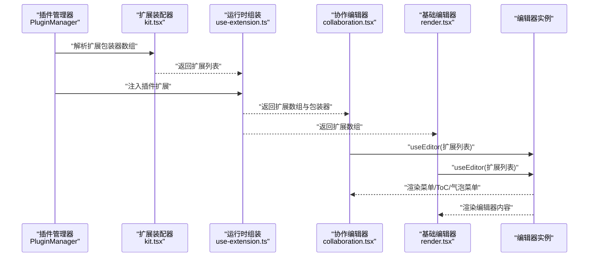
```mermaid
sequenceDiagram
participant PM as "插件管理器<br/>PluginManager"
participant KIT as "扩展装配器<br/>kit.tsx"
participant USE as "运行时组装<br/>use-extension.ts"
participant COLLAB as "协作编辑器<br/>collaboration.tsx"
participant RENDER as "基础编辑器<br/>render.tsx"
participant EDITOR as "编辑器实例"
PM->>KIT : "解析扩展包装器数组"
KIT-->>USE : "返回扩展列表"
PM->>USE : "注入插件扩展"
USE-->>COLLAB : "返回扩展数组与包装器"
USE-->>RENDER : "返回扩展数组"
COLLAB->>EDITOR : "useEditor(扩展列表)"
RENDER->>EDITOR : "useEditor(扩展列表)"
EDITOR-->>COLLAB : "渲染菜单/ToC/气泡菜单"
EDITOR-->>RENDER : "渲染编辑器内容"
```

**图表来源**
- [packages/common/src/core/PluginManager.ts](file://packages/common/src/core/PluginManager.ts#L1-L170)
- [packages/editor/src/editor/kit.tsx](file://packages/editor/src/editor/kit.tsx#L1-L87)
- [packages/editor/src/editor/use-extension.ts](file://packages/editor/src/editor/use-extension.ts#L1-L63)
- [packages/editor/src/editor/collaboration.tsx](file://packages/editor/src/editor/collaboration.tsx#L1-L208)
- [packages/editor/src/editor/render.tsx](file://packages/editor/src/editor/render.tsx#L1-L140)

## 详细组件分析

### 扩展装配器与运行时组装
- 职责
  - 将扩展包装器转换为 Tiptap 扩展实例；合并内置扩展与插件扩展；生成斜杠菜单输入规则。
  - 在运行时组合基础扩展（标题/文档、段落、文本、占位符、尾随节点、性能监控、唯一 ID 等），并注入插件扩展与斜杠菜单。
- 关键点
  - 唯一 ID 的类型过滤与事务过滤，避免协作变更被重复写入。
  - 斜杠菜单的字符、插件键与条目由扩展包装器汇总生成。
- 典型调用链
  - 插件管理器收集各插件扩展包装器 → 装配器解析 → 运行时组装 → 编辑器实例化。

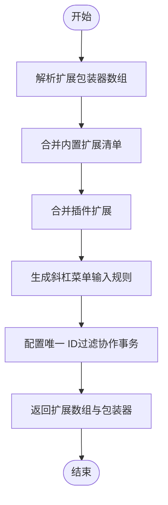
```mermaid
flowchart TD
Start(["开始"]) --> Resolve["解析扩展包装器数组"]
Resolve --> MergeBuiltin["合并内置扩展清单"]
MergeBuiltin --> MergePlugins["合并插件扩展"]
MergePlugins --> Slash["生成斜杠菜单输入规则"]
Slash --> UniqueID["配置唯一 ID过滤协作事务"]
UniqueID --> Assemble["返回扩展数组与包装器"]
Assemble --> End(["结束"])
```

**图表来源**
- [packages/editor/src/editor/kit.tsx](file://packages/editor/src/editor/kit.tsx#L23-L87)
- [packages/editor/src/editor/use-extension.ts](file://packages/editor/src/editor/use-extension.ts#L20-L63)
- [packages/editor/src/editor/build-in-extension.ts](file://packages/editor/src/editor/build-in-extension.ts#L1-L56)

**章节来源**
- [packages/editor/src/editor/kit.tsx](file://packages/editor/src/editor/kit.tsx#L1-L87)
- [packages/editor/src/editor/use-extension.ts](file://packages/editor/src/editor/use-extension.ts#L1-L63)
- [packages/editor/src/editor/build-in-extension.ts](file://packages/editor/src/editor/build-in-extension.ts#L1-L56)

### 扩展分类与示例

#### 节点扩展（以 Columns 为例）
- 结构要点
  - 定义节点名称、分组、内容约束、HTML 解析/渲染、属性、命令、键盘快捷键等。
  - 可选：注册 NodeView 渲染器以承载复杂交互视图。
- 示例路径
  - 节点定义与命令、快捷键：[packages/editor/src/extensions/columns/columns.tsx](file://packages/editor/src/extensions/columns/columns.tsx#L1-L130)

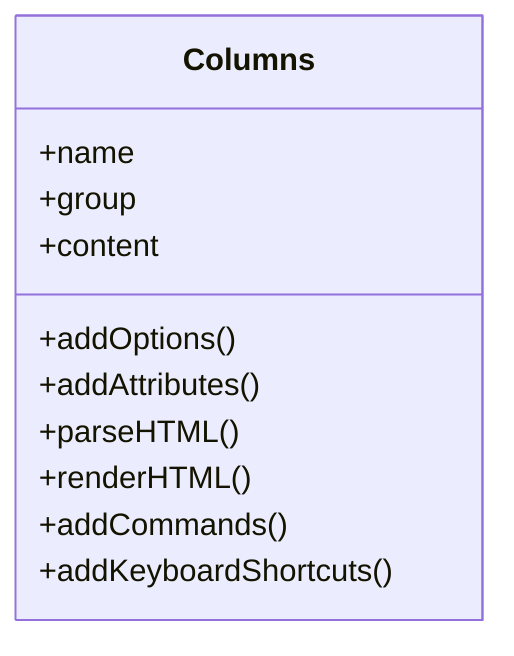
```mermaid
classDiagram
class Columns {
+name
+group
+content
+addOptions()
+addAttributes()
+parseHTML()
+renderHTML()
+addCommands()
+addKeyboardShortcuts()
}
```

**图表来源**
- [packages/editor/src/extensions/columns/columns.tsx](file://packages/editor/src/extensions/columns/columns.tsx#L1-L130)

**章节来源**
- [packages/editor/src/extensions/columns/columns.tsx](file://packages/editor/src/extensions/columns/columns.tsx#L1-L130)

#### 标记扩展（以 Link 为例）
- 结构要点
  - 基于内置 Link 扩展进行扩展，覆盖选项、输入规则与属性解析。
  - 支持 Markdown 链接语法与 URL 自动识别的输入规则。
- 示例路径
  - 扩展定义与输入规则：[packages/editor/src/extensions/link/link.ts](file://packages/editor/src/extensions/link/link.ts#L1-L66)

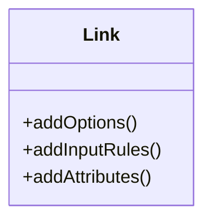
```mermaid
classDiagram
class Link {
+addOptions()
+addInputRules()
+addAttributes()
}
```

**图表来源**
- [packages/editor/src/extensions/link/link.ts](file://packages/editor/src/extensions/link/link.ts#L1-L66)

**章节来源**
- [packages/editor/src/extensions/link/link.ts](file://packages/editor/src/extensions/link/link.ts#L1-L66)

#### 输入规则扩展（以 CodeBlock 为例）
- 结构要点
  - 在内置代码块基础上扩展：注册 NodeView、注入低亮插件、自定义键盘行为（如在末尾双换行自动退出代码块）。
- 示例路径
  - 代码块扩展与键盘处理：[packages/editor/src/extensions/code-block/code-block.ts](file://packages/editor/src/extensions/code-block/code-block.ts#L1-L84)

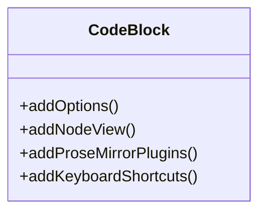
```mermaid
classDiagram
class CodeBlock {
+addOptions()
+addNodeView()
+addProseMirrorPlugins()
+addKeyboardShortcuts()
}
```

**图表来源**
- [packages/editor/src/extensions/code-block/code-block.ts](file://packages/editor/src/extensions/code-block/code-block.ts#L1-L84)

**章节来源**
- [packages/editor/src/extensions/code-block/code-block.ts](file://packages/editor/src/extensions/code-block/code-block.ts#L1-L84)

#### 表格扩展（以 TableKit 为例）
- 结构要点
  - 将 Table、TableCell、TableHeader、TableRow 组合为一组扩展，统一配置（如可调整列宽）。
- 示例路径
  - 扩展组合：[packages/editor/src/extensions/table/table-kit.ts](file://packages/editor/src/extensions/table/table-kit.ts#L1-L17)

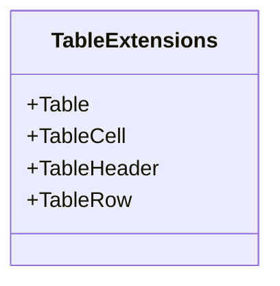
```mermaid
classDiagram
class TableExtensions {
+Table
+TableCell
+TableHeader
+TableRow
}
```

**图表来源**
- [packages/editor/src/extensions/table/table-kit.ts](file://packages/editor/src/extensions/table/table-kit.ts#L1-L17)

**章节来源**
- [packages/editor/src/extensions/table/table-kit.ts](file://packages/editor/src/extensions/table/table-kit.ts#L1-L17)

#### 简单扩展（以 Bold 为例）
- 结构要点
  - 直接导出内置 Bold 扩展，作为最小化扩展样例。
- 示例路径
  - 扩展导出：[packages/editor/src/extensions/bold/bold.ts](file://packages/editor/src/extensions/bold/bold.ts#L1-L4)

**章节来源**
- [packages/editor/src/extensions/bold/bold.ts](file://packages/editor/src/extensions/bold/bold.ts#L1-L4)

### 工具栏与菜单集成
- 气泡菜单
  - 提供默认样式与定位选项，支持"节点级气泡菜单"，在拖拽过程中保持可见。
  - 示例路径：[packages/editor/src/components/bubble-menu.tsx](file://packages/editor/src/components/bubble-menu.tsx#L1-L84)
- 状态监听
  - 使用 hooks 订阅 selectionUpdate/transaction 事件，实时计算当前激活状态或属性值。
  - 示例路径：
    - [packages/editor/src/hooks/use-active.tsx](file://packages/editor/src/hooks/use-active.tsx#L1-L32)
    - [packages/editor/src/hooks/use-attributes.tsx](file://packages/editor/src/hooks/use-attributes.tsx#L1-L53)

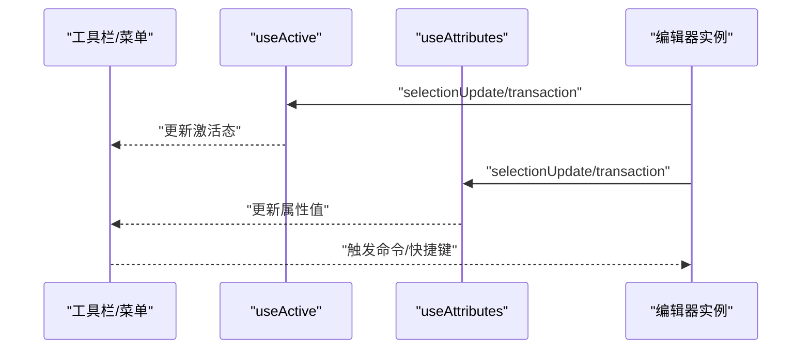
```mermaid
sequenceDiagram
participant UI as "工具栏/菜单"
participant UA as "useActive"
participant UATTR as "useAttributes"
participant EDITOR as "编辑器实例"
EDITOR->>UA : "selectionUpdate/transaction"
UA-->>UI : "更新激活态"
EDITOR->>UATTR : "selectionUpdate/transaction"
UATTR-->>UI : "更新属性值"
UI-->>EDITOR : "触发命令/快捷键"
```

**图表来源**
- [packages/editor/src/components/bubble-menu.tsx](file://packages/editor/src/components/bubble-menu.tsx#L1-L84)
- [packages/editor/src/hooks/use-active.tsx](file://packages/editor/src/hooks/use-active.tsx#L1-L32)
- [packages/editor/src/hooks/use-attributes.tsx](file://packages/editor/src/hooks/use-attributes.tsx#L1-L53)

**章节来源**
- [packages/editor/src/components/bubble-menu.tsx](file://packages/editor/src/components/bubble-menu.tsx#L1-L84)
- [packages/editor/src/hooks/use-active.tsx](file://packages/editor/src/hooks/use-active.tsx#L1-L32)
- [packages/editor/src/hooks/use-attributes.tsx](file://packages/editor/src/hooks/use-attributes.tsx#L1-L53)

### 协作编辑与状态管理
- 协作编辑器容器
  - 负责加载扩展、渲染菜单与目录、处理失焦回调、销毁时断开协作连接。
  - 示例路径：[packages/editor/src/editor/collaboration.tsx](file://packages/editor/src/editor/collaboration.tsx#L1-L208)
- 插件管理与扩展注入
  - 插件通过扩展包装器向编辑器注入扩展、菜单、路由等资源。
  - 示例路径：[packages/common/src/core/PluginManager.ts](file://packages/common/src/core/PluginManager.ts#L1-L170)

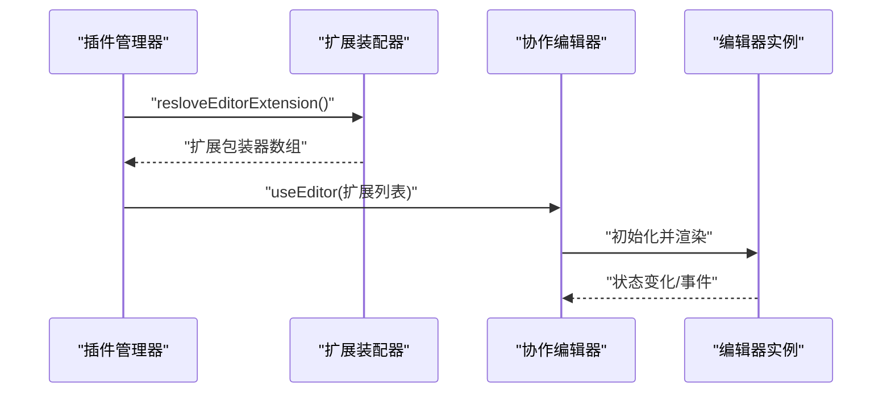
```mermaid
sequenceDiagram
participant PM as "插件管理器"
participant KIT as "扩展装配器"
participant COLLAB as "协作编辑器"
participant EDITOR as "编辑器实例"
PM->>KIT : "resloveEditorExtension()"
KIT-->>PM : "扩展包装器数组"
PM->>COLLAB : "useEditor(扩展列表)"
COLLAB->>EDITOR : "初始化并渲染"
EDITOR-->>COLLAB : "状态变化/事件"
```

**图表来源**
- [packages/common/src/core/PluginManager.ts](file://packages/common/src/core/PluginManager.ts#L146-L155)
- [packages/editor/src/editor/kit.tsx](file://packages/editor/src/editor/kit.tsx#L23-L87)
- [packages/editor/src/editor/collaboration.tsx](file://packages/editor/src/editor/collaboration.tsx#L1-L208)

**章节来源**
- [packages/editor/src/editor/collaboration.tsx](file://packages/editor/src/editor/collaboration.tsx#L1-L208)
- [packages/common/src/core/PluginManager.ts](file://packages/common/src/core/PluginManager.ts#L1-L170)

## ToC功能重大改进

### 固定定位面板设计
ToC功能经过重大改进，采用了现代化的固定定位设计，提供了更好的用户体验：

- **固定位置布局**：ToC面板采用固定定位，位于编辑器右侧，不会随内容滚动而移动。
- **响应式尺寸**：面板宽度为300px，高度占满整个视口高度，顶部留有80px间距，底部留有80px间距。
- **层级管理**：使用z-index层级控制，确保ToC面板始终显示在编辑器内容之上。
- **边框设计**：左侧添加垂直边框，与编辑器内容形成视觉分隔。

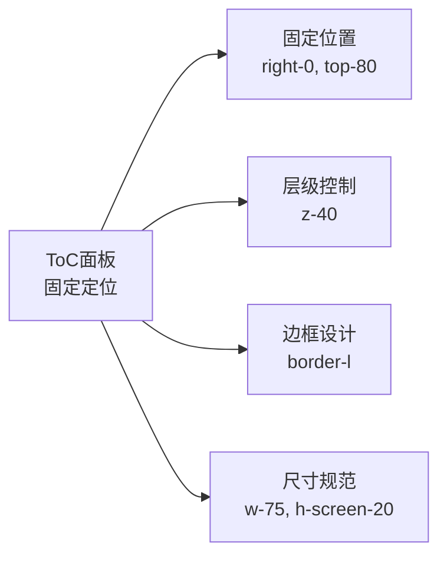
```mermaid
graph LR
TOCPanel["ToC面板<br/>固定定位"] --> FixedPos["固定位置<br/>right-0, top-80"]
TOCPanel --> ZIndex["层级控制<br/>z-40"]
TOCPanel --> Border["边框设计<br/>border-l"]
TOCPanel --> Width["尺寸规范<br/>w-75, h-screen-20"]
```

**图表来源**
- [packages/editor/src/editor/collaboration.tsx](file://packages/editor/src/editor/collaboration.tsx#L190-L197)
- [packages/editor/src/editor/render.tsx](file://packages/editor/src/editor/render.tsx#L124-L131)

### 滑出动画实现
ToC功能实现了流畅的滑出动画效果，提升了用户交互体验：

- **平滑过渡**：使用transition-transform和duration-300实现300ms的滑出动画。
- **位移效果**：通过translate-x-0和translate-x-full控制面板的显示和隐藏状态。
- **智能定位**：根据tocVisible状态动态切换面板位置，实现无缝切换效果。
- **按钮联动**：Toggle按钮与面板动画同步，提供直观的操作反馈。

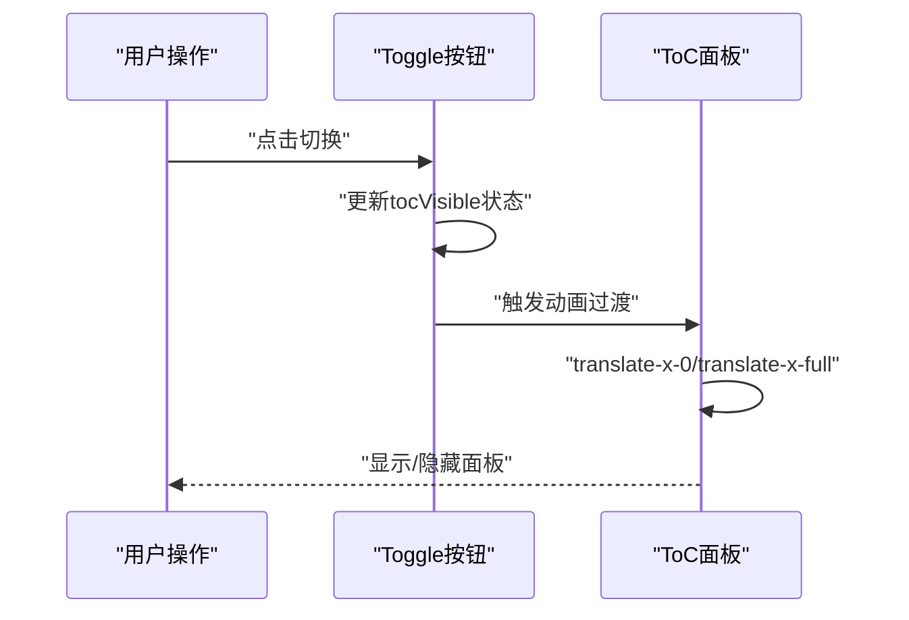
```mermaid
sequenceDiagram
participant User as "用户操作"
participant Button as "Toggle按钮"
participant Panel as "ToC面板"
User->>Button : "点击切换"
Button->>Button : "更新tocVisible状态"
Button->>Panel : "触发动画过渡"
Panel->>Panel : "translate-x-0/translate-x-full"
Panel-->>User : "显示/隐藏面板"
```

**图表来源**
- [packages/editor/src/editor/collaboration.tsx](file://packages/editor/src/editor/collaboration.tsx#L178-L197)
- [packages/editor/src/editor/render.tsx](file://packages/editor/src/editor/render.tsx#L112-L131)

### 工具栏集成
ToC功能与编辑器工具栏深度集成，提供了便捷的访问方式：

- **Toggle按钮**：在编辑器工具栏中添加ToC切换按钮，支持一键显示/隐藏目录。
- **按钮样式**：使用固定定位的按钮设计，位于编辑器右上角，z-index层级高于面板。
- **状态同步**：按钮图标根据面板显示状态动态切换（List/ X图标）。
- **位置调整**：当面板显示时，按钮位置会相应调整，避免遮挡面板内容。

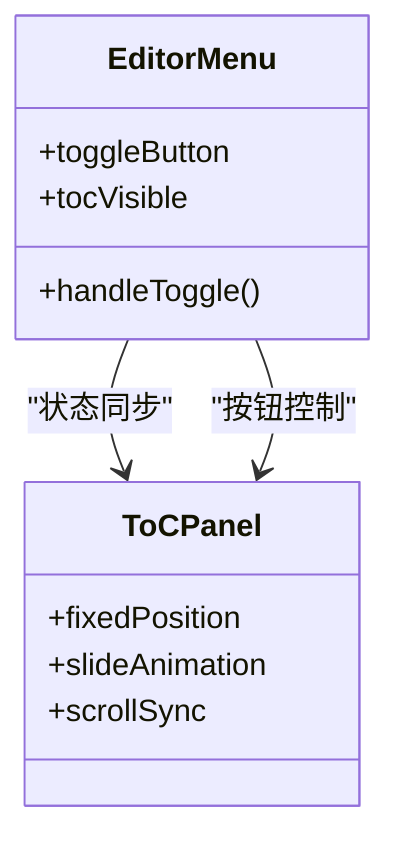
```mermaid
classDiagram
class EditorMenu {
+toggleButton
+tocVisible
+handleToggle()
}
class ToCPanel {
+fixedPosition
+slideAnimation
+scrollSync
}
EditorMenu --> ToCPanel : "状态同步"
EditorMenu --> ToCPanel : "按钮控制"
```

**图表来源**
- [packages/editor/src/editor/EditorMenu.tsx](file://packages/editor/src/editor/EditorMenu.tsx#L115-L157)
- [packages/editor/src/editor/collaboration.tsx](file://packages/editor/src/editor/collaboration.tsx#L178-L188)

### 目录项交互增强
ToC组件实现了多项交互增强功能：

- **滚动同步**：实时监听编辑器滚动，高亮显示当前可视区域对应的目录项。
- **平滑滚动**：使用scrollIntoView实现平滑滚动到目标位置。
- **选中效果**：点击目录项后，自动设置编辑器选中位置并添加高亮效果。
- **视觉反馈**：添加toc-highlight-flash动画效果，提供即时的视觉反馈。

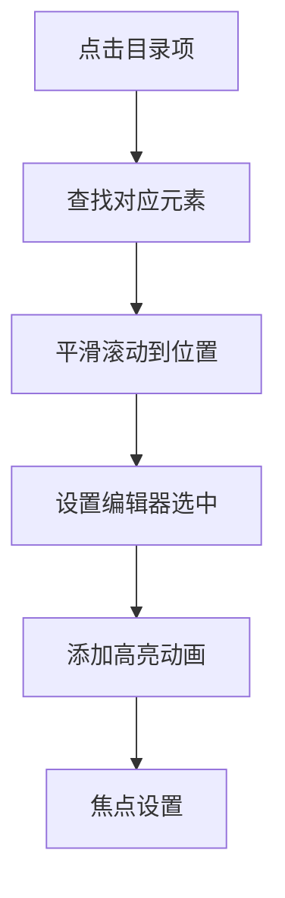
```mermaid
flowchart TD
Click["点击目录项"] --> Find["查找对应元素"]
Find --> Scroll["平滑滚动到位置"]
Scroll --> Select["设置编辑器选中"]
Select --> Flash["添加高亮动画"]
Flash --> Focus["焦点设置"]
```

**图表来源**
- [packages/editor/src/editor/ToC.tsx](file://packages/editor/src/editor/ToC.tsx#L113-L150)
- [packages/editor/src/styles/editor.css](file://packages/editor/src/styles/editor.css#L73-L87)

### 样式与主题适配
ToC功能支持深色/浅色主题自动适配：

- **颜色方案**：根据标题级别自动选择不同的颜色方案，支持深色模式适配。
- **透明度控制**：使用opacity控制不同级别的文本透明度，提升层次感。
- **悬停效果**：提供hover状态的颜色变化和背景高亮效果。
- **激活状态**：当前可视区域对应的目录项显示特殊激活样式。

**章节来源**
- [packages/editor/src/editor/ToC.tsx](file://packages/editor/src/editor/ToC.tsx#L1-L180)
- [packages/editor/src/editor/collaboration.tsx](file://packages/editor/src/editor/collaboration.tsx#L174-L200)
- [packages/editor/src/editor/render.tsx](file://packages/editor/src/editor/render.tsx#L108-L134)
- [packages/editor/src/styles/editor.css](file://packages/editor/src/styles/editor.css#L73-L87)

## 依赖关系分析
- 组件耦合
  - 装配器与运行时组装高度依赖插件管理器提供的扩展包装器；协作编辑器依赖运行时组装结果。
  - 气泡菜单与 hooks 与编辑器实例强耦合，订阅其事件以驱动 UI 更新。
  - **更新** ToC功能与编辑器核心紧密集成，通过TableOfContents扩展获取内容，通过PageContentView渲染目录。
- 外部依赖
  - Tiptap 生态（@tiptap/*）、@hocuspocus/provider（协作）、@floating-ui/dom（气泡菜单）、scroll-into-view-if-needed（平滑滚动）。
- 潜在循环依赖
  - 当前结构通过"统一导出 + 装配器解析"降低直接循环依赖风险；建议新增扩展时遵循"导出扩展定义，由装配器统一合并"。

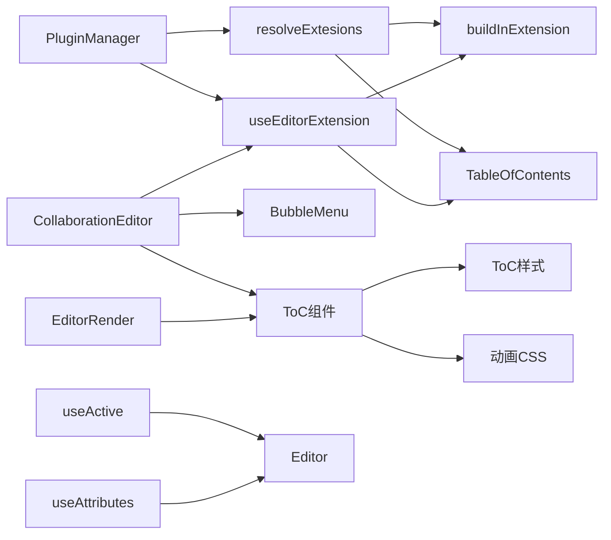
```mermaid
graph LR
PM["PluginManager"] --> KIT["resolveExtesions"]
PM --> USEEXT["useEditorExtension"]
KIT --> BUILTIN["buildInExtension"]
KIT --> TOCEXT["TableOfContents"]
USEEXT --> BUILTIN
USEEXT --> TOCEXT
COLLAB["CollaborationEditor"] --> USEEXT
COLLAB --> BUBBLE["BubbleMenu"]
COLLAB --> TOCCOMP["ToC组件"]
RENDER["EditorRender"] --> TOCCOMP
TOCCOMP --> TOCSTYLE["ToC样式"]
TOCCOMP --> TOCCSS["动画CSS"]
UA["useActive"] --> EDITOR["Editor"]
UATTR["useAttributes"] --> EDITOR
```

**图表来源**
- [packages/common/src/core/PluginManager.ts](file://packages/common/src/core/PluginManager.ts#L146-L155)
- [packages/editor/src/editor/kit.tsx](file://packages/editor/src/editor/kit.tsx#L23-L87)
- [packages/editor/src/editor/use-extension.ts](file://packages/editor/src/editor/use-extension.ts#L1-L63)
- [packages/editor/src/editor/build-in-extension.ts](file://packages/editor/src/editor/build-in-extension.ts#L1-L56)
- [packages/editor/src/editor/collaboration.tsx](file://packages/editor/src/editor/collaboration.tsx#L1-L208)
- [packages/editor/src/editor/render.tsx](file://packages/editor/src/editor/render.tsx#L1-L140)
- [packages/editor/src/editor/ToC.tsx](file://packages/editor/src/editor/ToC.tsx#L1-L180)
- [packages/editor/src/components/toc/style/index.module.less](file://packages/editor/src/components/toc/style/index.module.less#L1-L47)
- [packages/editor/src/styles/editor.css](file://packages/editor/src/styles/editor.css#L73-L87)

**章节来源**
- [packages/editor/src/editor/kit.tsx](file://packages/editor/src/editor/kit.tsx#L1-L87)
- [packages/editor/src/editor/use-extension.ts](file://packages/editor/src/editor/use-extension.ts#L1-L63)
- [packages/editor/src/editor/build-in-extension.ts](file://packages/editor/src/editor/build-in-extension.ts#L1-L56)
- [packages/editor/src/editor/collaboration.tsx](file://packages/editor/src/editor/collaboration.tsx#L1-L208)
- [packages/editor/src/editor/render.tsx](file://packages/editor/src/editor/render.tsx#L1-L140)
- [packages/editor/src/editor/ToC.tsx](file://packages/editor/src/editor/ToC.tsx#L1-L180)
- [packages/editor/src/components/toc/style/index.module.less](file://packages/editor/src/components/toc/style/index.module.less#L1-L47)
- [packages/editor/src/styles/editor.css](file://packages/editor/src/styles/editor.css#L73-L87)
- [packages/editor/src/components/bubble-menu.tsx](file://packages/editor/src/components/bubble-menu.tsx#L1-L84)
- [packages/editor/src/hooks/use-active.tsx](file://packages/editor/src/hooks/use-active.tsx#L1-L32)
- [packages/editor/src/hooks/use-attributes.tsx](file://packages/editor/src/hooks/use-attributes.tsx#L1-L53)
- [packages/common/src/core/PluginManager.ts](file://packages/common/src/core/PluginManager.ts#L1-L170)

## 性能考虑
- 渲染与事务
  - 合理使用"立即渲染"与"事务重渲染"策略，避免不必要的重绘；在协作场景中过滤非本地事务以减少无效更新。
- 扩展数量与复杂度
  - 控制扩展数量与每个扩展的插件数量；对高开销扩展（如语法高亮、NodeView）采用懒加载或按需启用。
- 事件监听
  - hooks 订阅 selectionUpdate/transaction 时注意去抖与浅比较，避免频繁状态更新导致的 UI 抖动。
- 气泡菜单
  - 默认定位与显示策略已优化，避免拖拽过程中的闪烁；如需自定义，确保定位计算轻量且稳定。
- **更新** ToC性能优化
  - 使用节流/防抖优化滚动监听，避免频繁的状态更新。
  - 通过CSS transform实现滑出动画，利用GPU加速提升动画性能。
  - 使用Intersection Observer API替代传统的滚动监听，提升性能表现。

## 故障排查指南
- 扩展未生效
  - 检查是否正确通过扩展包装器注入；确认装配器已解析并合并至最终扩展列表。
  - 参考：[packages/common/src/core/PluginManager.ts](file://packages/common/src/core/PluginManager.ts#L146-L155)，[packages/editor/src/editor/kit.tsx](file://packages/editor/src/editor/kit.tsx#L23-L87)
- 快捷键冲突
  - 在扩展中覆盖或组合键盘映射时，优先级与条件判断需明确；必要时在输入规则中拦截特定场景。
  - 参考：[packages/editor/src/extensions/columns/columns.tsx](file://packages/editor/src/extensions/columns/columns.tsx#L110-L128)，[packages/editor/src/extensions/code-block/code-block.ts](file://packages/editor/src/extensions/code-block/code-block.ts#L49-L79)
- 气泡菜单不显示
  - 确认 shouldShow 条件与 getReferenceClientRect 返回值；节点级气泡菜单需显式设置 forNode。
  - 参考：[packages/editor/src/components/bubble-menu.tsx](file://packages/editor/src/components/bubble-menu.tsx#L25-L84)
- 协作连接异常
  - 断开与销毁时清理状态，避免重复连接；检查用户信息与 provider 配置。
  - 参考：[packages/editor/src/editor/collaboration.tsx](file://packages/editor/src/editor/collaboration.tsx#L106-L113)
- 状态不同步
  - 使用 hooks 订阅 selectionUpdate/transaction 并进行浅比较；确保 UI 组件在依赖变化时才重新渲染。
  - 参考：[packages/editor/src/hooks/use-active.tsx](file://packages/editor/src/hooks/use-active.tsx#L1-L32)，[packages/editor/src/hooks/use-attributes.tsx](file://packages/editor/src/hooks/use-attributes.tsx#L1-L53)
- **更新** ToC功能问题排查
  - 目录项不显示：检查TableOfContents扩展是否正确配置，确认getIndex函数正常工作。
  - 动画不流畅：检查CSS transition属性，确认transform动画未被其他样式覆盖。
  - 滚动不同步：验证scrollIntoView配置，检查编辑器容器的overflow属性设置。
  - 主题适配问题：确认深色/浅色模式下的颜色变量正确应用。

**章节来源**
- [packages/common/src/core/PluginManager.ts](file://packages/common/src/core/PluginManager.ts#L146-L155)
- [packages/editor/src/editor/kit.tsx](file://packages/editor/src/editor/kit.tsx#L23-L87)
- [packages/editor/src/extensions/columns/columns.tsx](file://packages/editor/src/extensions/columns/columns.tsx#L110-L128)
- [packages/editor/src/extensions/code-block/code-block.ts](file://packages/editor/src/extensions/code-block/code-block.ts#L49-L79)
- [packages/editor/src/components/bubble-menu.tsx](file://packages/editor/src/components/bubble-menu.tsx#L25-L84)
- [packages/editor/src/editor/collaboration.tsx](file://packages/editor/src/editor/collaboration.tsx#L106-L113)
- [packages/editor/src/hooks/use-active.tsx](file://packages/editor/src/hooks/use-active.tsx#L1-L32)
- [packages/editor/src/hooks/use-attributes.tsx](file://packages/editor/src/hooks/use-attributes.tsx#L1-L53)
- [packages/editor/src/editor/ToC.tsx](file://packages/editor/src/editor/ToC.tsx#L76-L107)

## 结论
本指南梳理了基于 Tiptap 的编辑器扩展开发路径：从扩展装配器与运行时组装，到协作编辑与菜单集成，再到状态监听与性能优化。通过统一的扩展包装器与装配流程，可以高效地将插件扩展注入编辑器；借助 hooks 与气泡菜单，实现与编辑器核心的深度联动。

**更新** ToC功能的重大改进显著提升了编辑器的用户体验，包括固定定位面板设计、流畅的滑出动画、与工具栏的深度集成，以及增强的交互反馈。这些改进体现了现代编辑器界面设计的最佳实践，为用户提供了更加直观和高效的文档导航体验。

建议在实际开发中遵循"最小可用 + 可测试 + 可维护"的原则，逐步完善扩展的功能边界与交互细节。对于ToC功能的开发，应重点关注性能优化、主题适配和跨浏览器兼容性，确保在各种环境下都能提供一致的用户体验。

## 附录
- 开发步骤建议
  - 明确扩展类型与职责（节点/标记/输入规则/命令）。
  - 编写扩展定义与必要的输入规则、命令、快捷键。
  - 设计菜单/气泡菜单与工具栏按钮，结合 hooks 实现状态联动。
  - 通过扩展包装器注入到插件管理器，经装配器合并后进入编辑器。
  - 在协作编辑器中验证扩展在多用户场景下的表现。
  - **更新** ToC开发建议：关注滚动同步性能、动画流畅性和主题适配。
- 测试与调试
  - 使用编辑器事件钩子（selectionUpdate/transaction）验证状态变化。
  - 对高开销扩展进行性能基准测试，关注渲染与事务频率。
  - 利用日志与断点定位协作场景中的异常（如事务过滤、连接状态）。
  - **更新** ToC测试要点：验证滚动同步准确性、动画性能表现和跨设备兼容性。