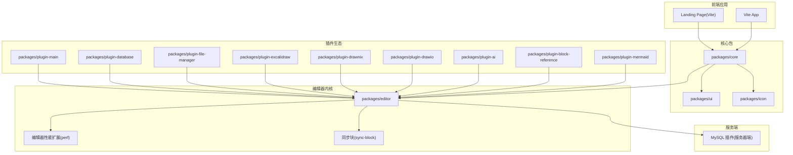
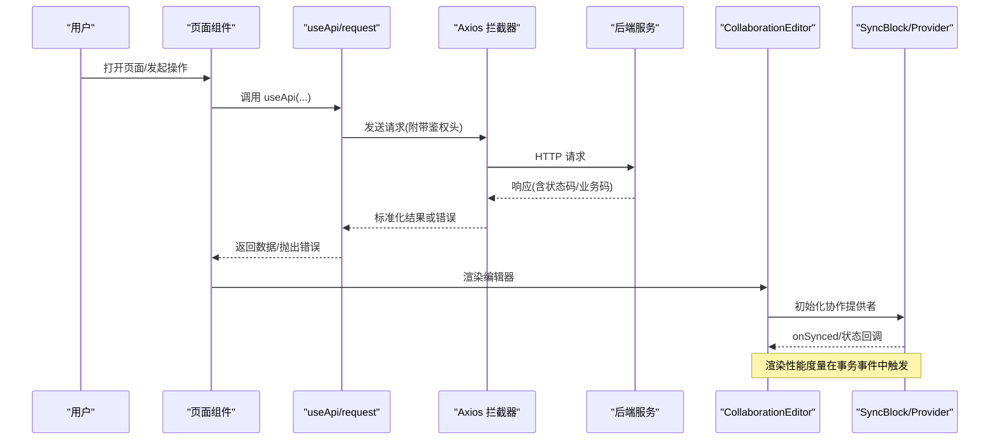
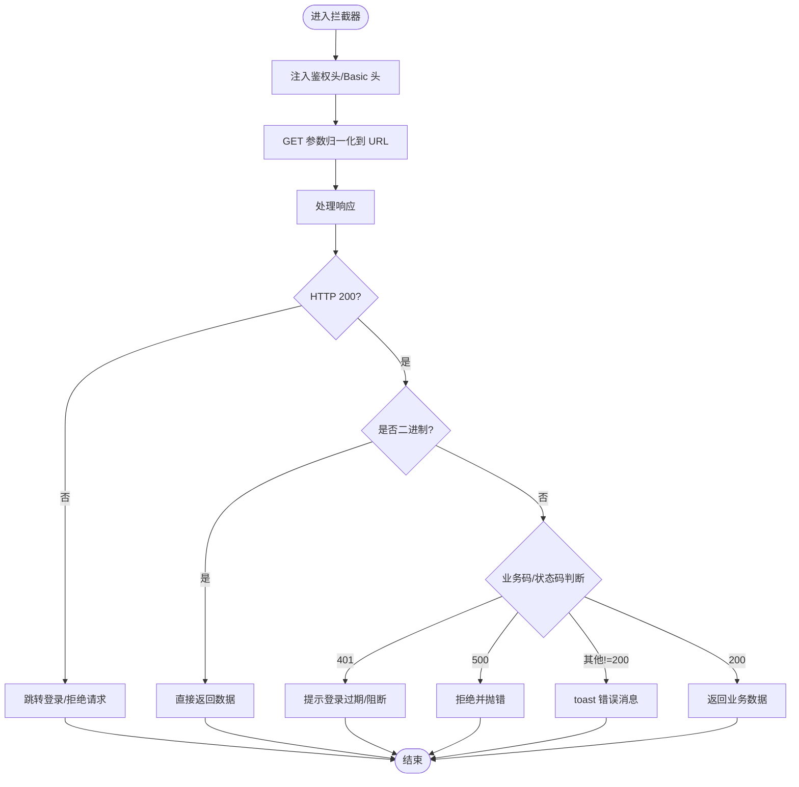
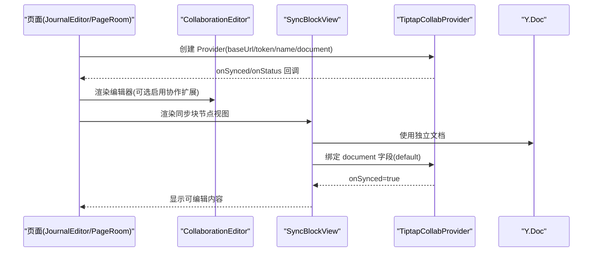
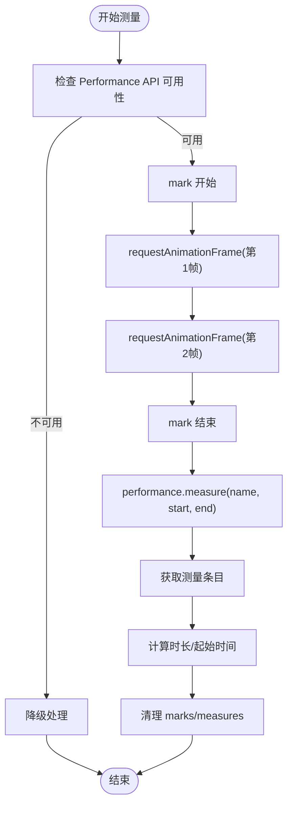
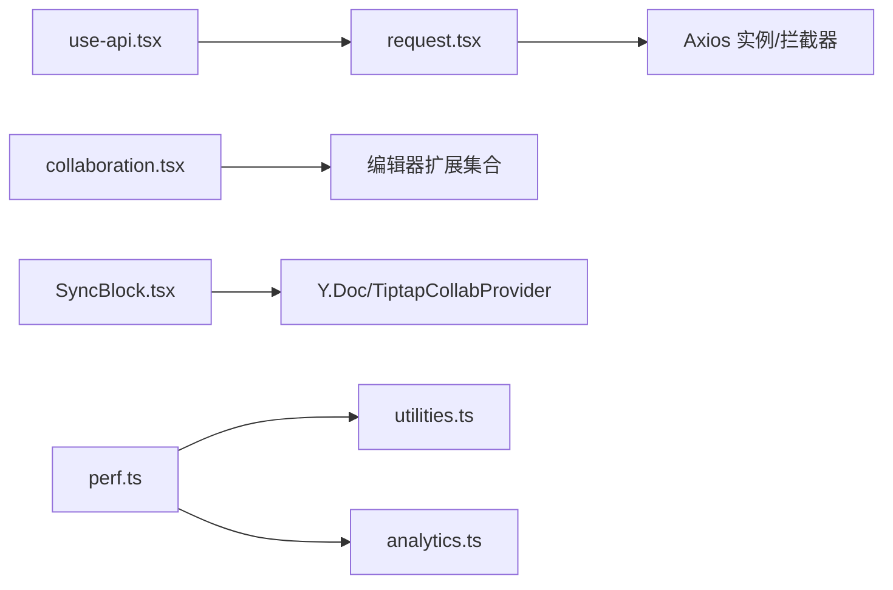

# 故障排除

<cite>
**本文引用的文件**
- [packages/core/src/utils/request.tsx](file://packages/core/src/utils/request.tsx)
- [packages/core/src/components/ErrorPage.tsx](file://packages/core/src/components/ErrorPage.tsx)
- [packages/editor/src/extensions/perf/utilities.ts](file://packages/editor/src/extensions/perf/utilities.ts)
- [packages/editor/src/extensions/perf/perf.ts](file://packages/editor/src/extensions/perf/perf.ts)
- [packages/editor/src/extensions/perf/analytics.ts](file://packages/editor/src/extensions/perf/analytics.ts)
- [packages/editor/src/editor/collaboration.tsx](file://packages/editor/src/editor/collaboration.tsx)
- [packages/editor/src/extensions/sync-block/SyncBlock.tsx](file://packages/editor/src/extensions/sync-block/SyncBlock.tsx)
- [packages/editor/src/extensions/sync-block/sync-block.ts](file://packages/editor/src/extensions/sync-block/sync-block.ts)
- [packages/plugin-main/src/pages/Journals/JournalEditor/index.tsx](file://packages/plugin-main/src/pages/Journals/JournalEditor/index.tsx)
- [packages/plugin-main/src/pages/SpaceDetail/PageEditor/index.tsx](file://packages/plugin-main/src/pages/SpaceDetail/PageEditor/index.tsx)
- [packages/plugin-main/src/pages/PageRoom/index.tsx](file://packages/plugin-main/src/pages/PageRoom/index.tsx)
- [packages/core/src/hooks/use-api.tsx](file://packages/core/src/hooks/use-api.tsx)
- [apps/landing-page-vite/Dockerfile](file://apps/landing-page-vite/Dockerfile)
- [apps/vite/Dockerfile](file://apps/vite/Dockerfile)
- [packages/editor/src/server/plugin/mysql/MysqlPlugin.mjs](file://packages/editor/src/server/plugin/mysql/MysqlPlugin.mjs)
</cite>

## 目录
1. 引言
2. 项目结构
3. 核心组件
4. 架构总览
5. 详细组件分析
6. 依赖关系分析
7. 性能考虑
8. 故障排除指南
9. 结论
10. 附录（如有需要）

## 引言
本指南面向知识库管理系统的使用者与维护者，聚焦于安装、运行时错误、功能异常的系统化排查；提供浏览器开发者工具、网络请求检查与日志分析方法；覆盖性能问题诊断与优化（内存泄漏、渲染性能、网络延迟）；描述协作编辑的连接失败、同步异常与冲突处理；给出错误页定制与错误上报机制建议，并总结预防性维护与健康监控要点。

## 项目结构
系统采用多包工作区组织，核心能力分布在 core、editor、plugin-* 等包中，前端通过 Next/Vite 应用承载页面与插件生态，编辑器内核基于 Tiptap/Yjs 实现协作编辑，数据库侧通过 MySQL 插件扩展。

图表来源
- [packages/core/src/utils/request.tsx](file://packages/core/src/utils/request.tsx#L1-L118)
- [packages/editor/src/extensions/perf/perf.ts](file://packages/editor/src/extensions/perf/perf.ts#L1-L41)
- [packages/editor/src/extensions/sync-block/SyncBlock.tsx](file://packages/editor/src/extensions/sync-block/SyncBlock.tsx#L1-L87)
- [packages/plugin-main/src/pages/Journals/JournalEditor/index.tsx](file://packages/plugin-main/src/pages/Journals/JournalEditor/index.tsx#L1-L54)
- [packages/editor/src/server/plugin/mysql/MysqlPlugin.mjs](file://packages/editor/src/server/plugin/mysql/MysqlPlugin.mjs#L43-L88)

章节来源
- [packages/core/src/utils/request.tsx](file://packages/core/src/utils/request.tsx#L1-L118)
- [apps/landing-page-vite/Dockerfile](file://apps/landing-page-vite/Dockerfile#L1-L9)
- [apps/vite/Dockerfile](file://apps/vite/Dockerfile#L1-L9)

## 核心组件
- 请求与拦截器：统一的 Axios 实例与请求/响应拦截器，负责鉴权头注入、状态码与业务码处理、错误提示与跳转、超时/网络错误归一化。
- 错误页组件：统一的错误页 UI，提供“返回首页”导航。
- 协作编辑器：封装 Tiptap/Yjs 的协作编辑容器，支持状态回调与资源清理。
- 同步块：以节点视图形式嵌入的子文档协作编辑器，按块维度独立同步。
- 性能扩展：基于 Performance API 与 requestAnimationFrame 的渲染耗时测量，结合事务事件触发分析。

章节来源
- [packages/core/src/utils/request.tsx](file://packages/core/src/utils/request.tsx#L1-L118)
- [packages/core/src/components/ErrorPage.tsx](file://packages/core/src/components/ErrorPage.tsx#L1-L21)
- [packages/editor/src/editor/collaboration.tsx](file://packages/editor/src/editor/collaboration.tsx#L1-L142)
- [packages/editor/src/extensions/sync-block/SyncBlock.tsx](file://packages/editor/src/extensions/sync-block/SyncBlock.tsx#L1-L87)
- [packages/editor/src/extensions/perf/utilities.ts](file://packages/editor/src/extensions/perf/utilities.ts#L1-L133)

## 架构总览
下图展示从页面到编辑器、协作提供者与后端的调用链路，以及性能度量与错误处理的关键节点。

图表来源
- [packages/core/src/hooks/use-api.tsx](file://packages/core/src/hooks/use-api.tsx#L1-L51)
- [packages/core/src/utils/request.tsx](file://packages/core/src/utils/request.tsx#L1-L118)
- [packages/editor/src/editor/collaboration.tsx](file://packages/editor/src/editor/collaboration.tsx#L1-L142)
- [packages/editor/src/extensions/sync-block/SyncBlock.tsx](file://packages/editor/src/extensions/sync-block/SyncBlock.tsx#L1-L87)
- [packages/editor/src/extensions/perf/perf.ts](file://packages/editor/src/extensions/perf/perf.ts#L1-L41)

## 详细组件分析

### 组件A：请求与错误处理（统一拦截器）
- 关键点
  - 鉴权头注入与 Basic 认证头设置
  - GET 参数拼接到 URL，避免重复 params
  - 响应状态码与业务码分支处理，401 提示并阻断后续流程
  - 网络错误、超时、HTTP 异常的统一消息映射
  - Blob/arraybuffer 直接透传
- 典型问题定位
  - 登录态失效：401 分支触发提示与阻断
  - 接口超时/网络异常：错误消息统一提示
  - 业务异常：根据 code 判断并 toast 提示

图表来源
- [packages/core/src/utils/request.tsx](file://packages/core/src/utils/request.tsx#L1-L118)

章节来源
- [packages/core/src/utils/request.tsx](file://packages/core/src/utils/request.tsx#L1-L118)
- [packages/core/src/hooks/use-api.tsx](file://packages/core/src/hooks/use-api.tsx#L1-L51)

### 组件B：协作编辑器与同步块
- 关键点
  - CollaborationEditor 封装编辑器初始化、TOC、菜单与销毁逻辑
  - SyncBlock 以节点视图形式创建独立 Y.Doc，通过 TiptapCollabProvider 连接远端
  - 页面级协作编辑在 JournalEditor/PageRoom 中配置 provider、awareness、onSynced/onStatus 回调
- 典型问题定位
  - 连接失败：检查 provider 的 baseUrl/token/name 是否正确
  - 同步未完成：确认 onSynced 回调与状态显示
  - 资源未释放：确保 useUnmount 中断连并销毁 provider

图表来源
- [packages/editor/src/editor/collaboration.tsx](file://packages/editor/src/editor/collaboration.tsx#L1-L142)
- [packages/editor/src/extensions/sync-block/SyncBlock.tsx](file://packages/editor/src/extensions/sync-block/SyncBlock.tsx#L1-L87)
- [packages/editor/src/extensions/sync-block/sync-block.ts](file://packages/editor/src/extensions/sync-block/sync-block.ts#L1-L40)
- [packages/plugin-main/src/pages/Journals/JournalEditor/index.tsx](file://packages/plugin-main/src/pages/Journals/JournalEditor/index.tsx#L1-L54)
- [packages/plugin-main/src/pages/PageRoom/index.tsx](file://packages/plugin-main/src/pages/PageRoom/index.tsx#L77-L105)

章节来源
- [packages/editor/src/editor/collaboration.tsx](file://packages/editor/src/editor/collaboration.tsx#L1-L142)
- [packages/editor/src/extensions/sync-block/SyncBlock.tsx](file://packages/editor/src/extensions/sync-block/SyncBlock.tsx#L1-L87)
- [packages/editor/src/extensions/sync-block/sync-block.ts](file://packages/editor/src/extensions/sync-block/sync-block.ts#L1-L40)
- [packages/plugin-main/src/pages/Journals/JournalEditor/index.tsx](file://packages/plugin-main/src/pages/Journals/JournalEditor/index.tsx#L1-L54)
- [packages/plugin-main/src/pages/PageRoom/index.tsx](file://packages/plugin-main/src/pages/PageRoom/index.tsx#L77-L105)

### 组件C：性能度量与渲染分析
- 关键点
  - 基于 Performance API 与 requestAnimationFrame 的双 rAF 测量法
  - startMeasure/stopMeasure/clearMeasure 的配对使用
  - 在编辑器事务中通过 Perf 插件触发渲染耗时统计
- 典型问题定位
  - 性能 API 不可用：降级路径与条件判断
  - 长任务检测：通过 PerformanceObserver.longtask 支持情况判定
  - 日志输出：控制台打印分析结果，便于定位长尾帧

图表来源
- [packages/editor/src/extensions/perf/utilities.ts](file://packages/editor/src/extensions/perf/utilities.ts#L1-L133)
- [packages/editor/src/extensions/perf/perf.ts](file://packages/editor/src/extensions/perf/perf.ts#L1-L41)
- [packages/editor/src/extensions/perf/analytics.ts](file://packages/editor/src/extensions/perf/analytics.ts#L1-L95)

章节来源
- [packages/editor/src/extensions/perf/utilities.ts](file://packages/editor/src/extensions/perf/utilities.ts#L1-L133)
- [packages/editor/src/extensions/perf/perf.ts](file://packages/editor/src/extensions/perf/perf.ts#L1-L41)
- [packages/editor/src/extensions/perf/analytics.ts](file://packages/editor/src/extensions/perf/analytics.ts#L1-L95)

## 依赖关系分析
- 请求层依赖
  - useApi 依赖 request，request 依赖 axios 实例与拦截器
- 编辑器层依赖
  - CollaborationEditor 依赖扩展管线、主题、样式与上下文
  - SyncBlock 依赖 Tiptap/Yjs 提供者，独立文档隔离
- 性能层依赖
  - Perf 插件依赖事务中的 AnalyticsStep，结合 utilities 的测量函数

图表来源
- [packages/core/src/hooks/use-api.tsx](file://packages/core/src/hooks/use-api.tsx#L1-L51)
- [packages/core/src/utils/request.tsx](file://packages/core/src/utils/request.tsx#L1-L118)
- [packages/editor/src/editor/collaboration.tsx](file://packages/editor/src/editor/collaboration.tsx#L1-L142)
- [packages/editor/src/extensions/sync-block/SyncBlock.tsx](file://packages/editor/src/extensions/sync-block/SyncBlock.tsx#L1-L87)
- [packages/editor/src/extensions/perf/perf.ts](file://packages/editor/src/extensions/perf/perf.ts#L1-L41)
- [packages/editor/src/extensions/perf/utilities.ts](file://packages/editor/src/extensions/perf/utilities.ts#L1-L133)
- [packages/editor/src/extensions/perf/analytics.ts](file://packages/editor/src/extensions/perf/analytics.ts#L1-L95)

章节来源
- [packages/core/src/hooks/use-api.tsx](file://packages/core/src/hooks/use-api.tsx#L1-L51)
- [packages/core/src/utils/request.tsx](file://packages/core/src/utils/request.tsx#L1-L118)
- [packages/editor/src/editor/collaboration.tsx](file://packages/editor/src/editor/collaboration.tsx#L1-L142)
- [packages/editor/src/extensions/sync-block/SyncBlock.tsx](file://packages/editor/src/extensions/sync-block/SyncBlock.tsx#L1-L87)
- [packages/editor/src/extensions/perf/perf.ts](file://packages/editor/src/extensions/perf/perf.ts#L1-L41)
- [packages/editor/src/extensions/perf/utilities.ts](file://packages/editor/src/extensions/perf/utilities.ts#L1-L133)
- [packages/editor/src/extensions/perf/analytics.ts](file://packages/editor/src/extensions/perf/analytics.ts#L1-L95)

## 性能考虑
- 渲染性能
  - 使用双 rAF 测量法评估关键操作的渲染耗时，关注长尾帧
  - 在事务事件中触发测量，避免全局监听造成抖动
- 网络延迟优化
  - 合理设置超时与重试策略，区分网络错误与业务异常
  - 对大体积响应采用流式/分页加载，减少首屏压力
- 内存泄漏检测
  - 协作编辑器销毁时断开连接并销毁 provider，避免残留监听
  - 同步块独立文档，退出时清理引用，防止跨块影响
- 数据库健康
  - MySQL 插件定时 ping 并在错误时重建连接，保持长连稳定

章节来源
- [packages/editor/src/extensions/perf/utilities.ts](file://packages/editor/src/extensions/perf/utilities.ts#L1-L133)
- [packages/editor/src/editor/collaboration.tsx](file://packages/editor/src/editor/collaboration.tsx#L1-L142)
- [packages/editor/src/extensions/sync-block/SyncBlock.tsx](file://packages/editor/src/extensions/sync-block/SyncBlock.tsx#L1-L87)
- [packages/editor/src/server/plugin/mysql/MysqlPlugin.mjs](file://packages/editor/src/server/plugin/mysql/MysqlPlugin.mjs#L43-L88)

## 故障排除指南

### 安装与部署问题
- 症状
  - 静态站点无法访问或证书/端口异常
- 排查
  - 检查 Nginx 配置与证书拷贝路径
  - 确认容器暴露端口与反向代理规则
- 建议
  - 使用官方 Dockerfile 作为基线，核对静态资源目录与权限

章节来源
- [apps/landing-page-vite/Dockerfile](file://apps/landing-page-vite/Dockerfile#L1-L9)
- [apps/vite/Dockerfile](file://apps/vite/Dockerfile#L1-L9)

### 登录态与鉴权异常
- 症状
  - 401 提示、自动跳转登录、部分接口报“会话无效”
- 排查
  - 检查请求拦截器是否注入了正确的鉴权头与 Basic 头
  - 确认后端会话有效期与刷新策略
- 建议
  - 在 401 场景下避免重复弹窗，使用一次性提示

章节来源
- [packages/core/src/utils/request.tsx](file://packages/core/src/utils/request.tsx#L1-L118)

### 网络请求超时与失败
- 症状
  - “后端接口连接异常”、“系统接口请求超时”、“系统接口XXX异常”
- 排查
  - 使用浏览器 Network 面板查看具体请求与响应
  - 区分超时、DNS 解析失败、TLS 握手失败等不同错误类型
- 建议
  - 对关键接口增加重试与降级策略，记录错误上下文

章节来源
- [packages/core/src/utils/request.tsx](file://packages/core/src/utils/request.tsx#L1-L118)

### 功能异常与页面错误
- 症状
  - 页面白屏、空白错误页、按钮无响应
- 排查
  - 检查错误页组件是否被渲染（返回首页导航）
  - 查看控制台是否有未捕获异常
- 建议
  - 自定义错误页：在路由层包裹错误边界，提供更友好的恢复路径

章节来源
- [packages/core/src/components/ErrorPage.tsx](file://packages/core/src/components/ErrorPage.tsx#L1-L21)

### 协作编辑连接失败与同步异常
- 症状
  - “connecting”状态长时间不变化、无法协同、光标/用户列表不同步
- 排查
  - 核对 provider 的 baseUrl/token/name/document 配置
  - 检查 onSynced/onStatus 回调是否触发
  - 确认页面卸载时是否断开并销毁 provider
- 建议
  - 在页面级编辑器中保留 awareness 更新与同步状态的可视化反馈

章节来源
- [packages/editor/src/editor/collaboration.tsx](file://packages/editor/src/editor/collaboration.tsx#L1-L142)
- [packages/editor/src/extensions/sync-block/SyncBlock.tsx](file://packages/editor/src/extensions/sync-block/SyncBlock.tsx#L1-L87)
- [packages/plugin-main/src/pages/Journals/JournalEditor/index.tsx](file://packages/plugin-main/src/pages/Journals/JournalEditor/index.tsx#L1-L54)
- [packages/plugin-main/src/pages/PageRoom/index.tsx](file://packages/plugin-main/src/pages/PageRoom/index.tsx#L77-L105)

### 性能问题诊断与优化
- 症状
  - 输入卡顿、滚动掉帧、页面切换慢
- 排查
  - 使用性能面板观察长任务与主线程占用
  - 通过编辑器性能扩展测量关键操作渲染耗时
- 建议
  - 优先优化高频操作的渲染路径，拆分大文档、延迟加载非关键内容

章节来源
- [packages/editor/src/extensions/perf/utilities.ts](file://packages/editor/src/extensions/perf/utilities.ts#L1-L133)
- [packages/editor/src/extensions/perf/perf.ts](file://packages/editor/src/extensions/perf/perf.ts#L1-L41)

### 数据库连接与稳定性
- 症状
  - 数据库连接中断、查询失败
- 排查
  - 观察定时 ping 日志与错误重连逻辑
- 建议
  - 在生产环境开启连接池与健康检查，设置合理的重试与退避

章节来源
- [packages/editor/src/server/plugin/mysql/MysqlPlugin.mjs](file://packages/editor/src/server/plugin/mysql/MysqlPlugin.mjs#L43-L88)

### 工具与方法论
- 浏览器开发者工具
  - Console：查看错误堆栈与性能日志
  - Network：筛选 XHR/Fetch，查看请求头、响应体与耗时
  - Performance/Rendering：启用长任务、FPS、内存采样
- 日志分析
  - 统一错误消息映射，保留请求 ID 与时间戳
  - 对关键路径埋点（如 onSynced、事务测量），便于回放
- 错误页与上报
  - 错误页提供“返回首页”快速恢复
  - 建议集成错误上报 SDK，收集前端异常与性能指标

章节来源
- [packages/core/src/utils/request.tsx](file://packages/core/src/utils/request.tsx#L1-L118)
- [packages/core/src/components/ErrorPage.tsx](file://packages/core/src/components/ErrorPage.tsx#L1-L21)

## 结论
通过统一的请求拦截器、协作编辑器与性能扩展，系统具备了较好的可观测性与可维护性。建议在日常运维中坚持：规范的日志与错误上报、严格的连接与健康检查、持续的性能回归测试，以保障知识库管理系统的稳定性与用户体验。

## 附录（如有需要）
- 预防性维护清单
  - 定期巡检数据库连接与 ping 健康
  - 监控网络延迟与超时率
  - 回归测试关键协作编辑路径
- 系统健康监控建议
  - 关键指标：登录成功率、编辑器首次渲染耗时、协作同步时延、数据库连接可用率
  - 告警阈值：针对异常波动与趋势变化设置分级告警