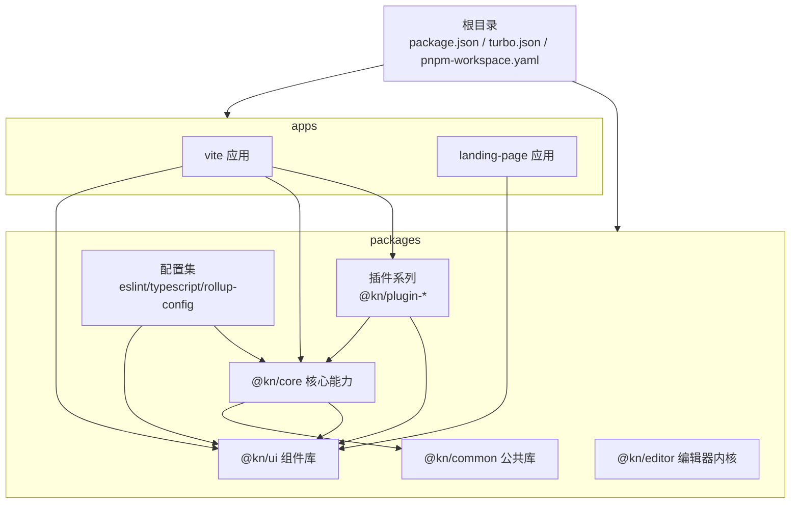
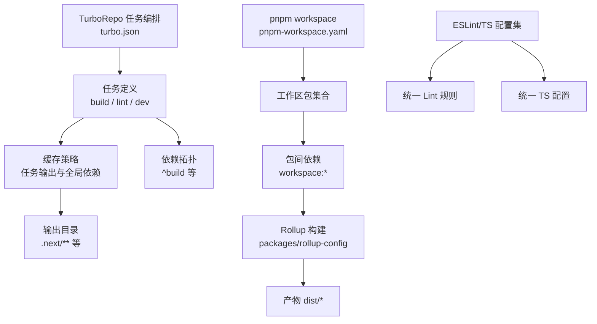
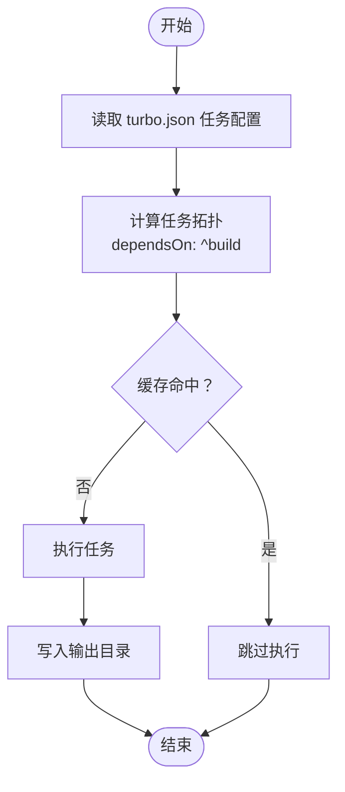
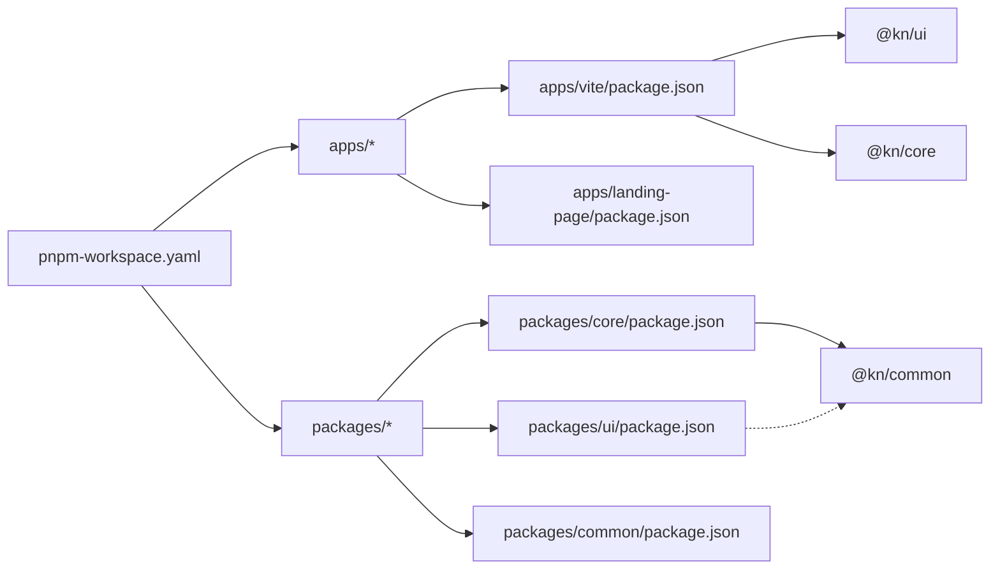
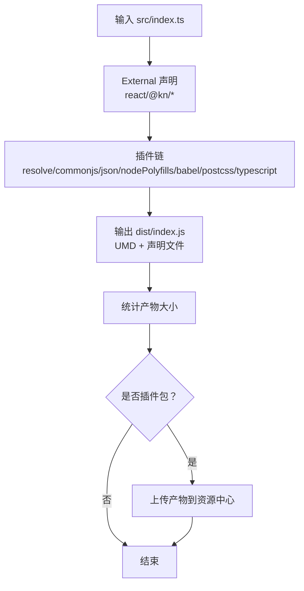
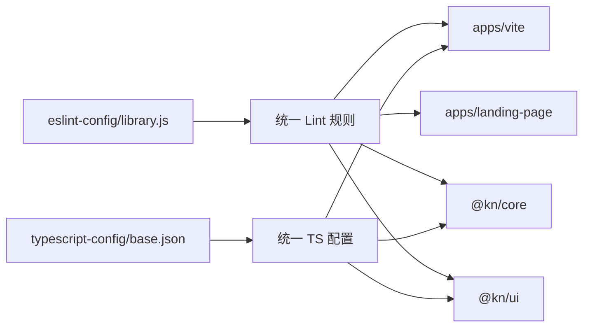
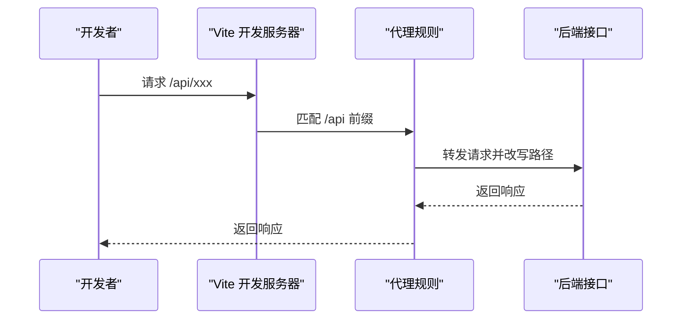
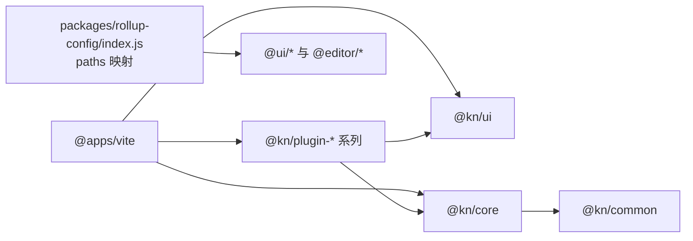
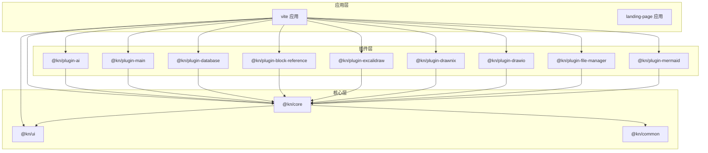

# Monorepo架构设计

<cite>
**本文引用的文件**
- [package.json](file://package.json)
- [turbo.json](file://turbo.json)
- [pnpm-workspace.yaml](file://pnpm-workspace.yaml)
- [.npmrc](file://.npmrc)
- [README.md](file://README.md)
- [packages/common/package.json](file://packages/common/package.json)
- [packages/core/package.json](file://packages/core/package.json)
- [packages/ui/package.json](file://packages/ui/package.json)
- [apps/vite/package.json](file://apps/vite/package.json)
- [apps/landing-page/package.json](file://apps/landing-page/package.json)
- [packages/rollup-config/index.js](file://packages/rollup-config/index.js)
- [packages/eslint-config/library.js](file://packages/eslint-config/library.js)
- [packages/typescript-config/base.json](file://packages/typescript-config/base.json)
- [apps/vite/vite.config.ts](file://apps/vite/vite.config.ts)
- [packages/core/src/index.ts](file://packages/core/src/index.ts)
</cite>

## 目录
1. [引言](#引言)
2. [项目结构](#项目结构)
3. [核心组件](#核心组件)
4. [架构总览](#架构总览)
5. [详细组件分析](#详细组件分析)
6. [依赖分析](#依赖分析)
7. [性能考虑](#性能考虑)
8. [故障排查指南](#故障排查指南)
9. [结论](#结论)
10. [附录](#附录)

## 引言
本文件面向知识库管理系统的Monorepo架构，系统性阐述TurboRepo在工作区中的任务编排与缓存策略、pnpm workspace在多包依赖与版本管理上的机制，并结合实际仓库目录结构（apps与packages分离）解析包间依赖关系与导入路径规则。同时总结Monorepo在代码复用、版本一致性与并行开发方面的优势，并给出可落地的配置示例与最佳实践建议。

## 项目结构
仓库采用典型的Monorepo分层组织：根目录通过工作区配置声明apps与packages两大集合；每个子包独立维护package.json与构建配置，统一由TurboRepo进行任务编排与缓存。

- 工作区定义
  - pnpm workspace通过工作区文件声明apps与packages下的所有包均纳入统一管理。
- 应用层（apps）
  - 包含多个前端应用与服务端相关入口，例如基于Vite的应用、Next.js落地页应用等。
- 包层（packages）
  - 包含共享库、UI组件库、编辑器内核、插件生态、通用工具与配置集等。

图表来源
- [pnpm-workspace.yaml](file://pnpm-workspace.yaml#L1-L4)
- [apps/vite/package.json](file://apps/vite/package.json#L1-L46)
- [apps/landing-page/package.json](file://apps/landing-page/package.json#L1-L26)
- [packages/common/package.json](file://packages/common/package.json#L1-L35)
- [packages/core/package.json](file://packages/core/package.json#L1-L41)
- [packages/ui/package.json](file://packages/ui/package.json#L1-L90)

章节来源
- [pnpm-workspace.yaml](file://pnpm-workspace.yaml#L1-L4)
- [README.md](file://README.md#L1-L56)

## 核心组件
- TurboRepo（任务编排与缓存）
  - 通过根级任务配置定义构建、lint、dev等任务的依赖拓扑与输出缓存范围，支持跨包增量构建与持久化开发进程。
- pnpm workspace（多包依赖与版本）
  - 基于工作区文件统一管理包集合，使用workspace协议在包间建立本地依赖与版本同步。
- 构建与发布
  - Rollup统一承担库包构建，配合自研Rollup配置集实现外部依赖剥离、CSS处理、UMD导出与产物统计上报。
- 质量保障
  - ESLint配置集与TypeScript基础配置集中管理，确保全仓库一致的编码规范与类型检查。

章节来源
- [turbo.json](file://turbo.json#L1-L27)
- [package.json](file://package.json#L1-L103)
- [packages/rollup-config/index.js](file://packages/rollup-config/index.js#L1-L143)
- [packages/eslint-config/library.js](file://packages/eslint-config/library.js#L1-L35)
- [packages/typescript-config/base.json](file://packages/typescript-config/base.json#L1-L21)

## 架构总览
下图展示Monorepo中“任务编排—包管理—构建发布—质量保障”的整体流程与交互关系。

图表来源
- [turbo.json](file://turbo.json#L1-L27)
- [pnpm-workspace.yaml](file://pnpm-workspace.yaml#L1-L4)
- [packages/rollup-config/index.js](file://packages/rollup-config/index.js#L1-L143)
- [packages/eslint-config/library.js](file://packages/eslint-config/library.js#L1-L35)
- [packages/typescript-config/base.json](file://packages/typescript-config/base.json#L1-L21)

## 详细组件分析

### TurboRepo 任务编排与缓存
- 任务依赖
  - 构建任务依赖上游包的构建结果，形成自底向上的拓扑执行顺序，避免重复构建。
- 输出与缓存
  - 指定任务输出目录，TurboRepo据此判断任务是否需要重新执行；全局依赖文件变更会触发相关任务失效。
- 开发模式
  - dev任务不启用缓存并标记为持久化，适合长期运行的开发服务器。

图表来源
- [turbo.json](file://turbo.json#L1-L27)

章节来源
- [turbo.json](file://turbo.json#L1-L27)

### pnpm workspace 多包依赖与版本控制
- 工作区声明
  - 通过工作区文件将apps与packages纳入统一管理，便于跨包依赖解析与版本同步。
- 本地依赖
  - 包间使用workspace协议进行本地依赖绑定，保证本地联调与版本一致性。
- 发布与注册表
  - 通过根级与包级publishConfig指定私有注册表，统一发布渠道。

图表来源
- [pnpm-workspace.yaml](file://pnpm-workspace.yaml#L1-L4)
- [apps/vite/package.json](file://apps/vite/package.json#L1-L46)
- [apps/landing-page/package.json](file://apps/landing-page/package.json#L1-L26)
- [packages/core/package.json](file://packages/core/package.json#L1-L41)
- [packages/ui/package.json](file://packages/ui/package.json#L1-L90)
- [packages/common/package.json](file://packages/common/package.json#L1-L35)

章节来源
- [pnpm-workspace.yaml](file://pnpm-workspace.yaml#L1-L4)
- [package.json](file://package.json#L1-L103)
- [.npmrc](file://.npmrc#L1-L7)

### 构建与发布流水线（Rollup）
- 外部依赖剥离
  - 将React与核心@kn包列为external，避免将这些依赖打入库包，降低体积并提升复用性。
- 插件链
  - 采用CommonJS、Node解析、JSON、Polyfills、Babel、PostCSS、TypeScript等插件，统一处理JS/TS/CSS资源。
- UMD导出与命名导出
  - 生成UMD格式产物并映射globals，便于浏览器直接使用；同时保留ESM入口供现代打包器消费。
- 产物统计与上报
  - 在打包完成后统计产物大小并按插件包名触发上传流程（用于内部资源中心），随后记录打包耗时。

图表来源
- [packages/rollup-config/index.js](file://packages/rollup-config/index.js#L1-L143)

章节来源
- [packages/rollup-config/index.js](file://packages/rollup-config/index.js#L1-L143)

### 质量保障（ESLint 与 TypeScript）
- ESLint
  - 使用统一配置集，结合类型感知解析器，确保全仓库一致的规则与导入解析。
- TypeScript
  - 提供基础TS配置模板，统一严格模式、模块解析策略与目标环境，减少各包差异带来的问题。

图表来源
- [packages/eslint-config/library.js](file://packages/eslint-config/library.js#L1-L35)
- [packages/typescript-config/base.json](file://packages/typescript-config/base.json#L1-L21)

章节来源
- [packages/eslint-config/library.js](file://packages/eslint-config/library.js#L1-L35)
- [packages/typescript-config/base.json](file://packages/typescript-config/base.json#L1-L21)

### 应用侧集成与代理配置（Vite）
- 代理
  - 在开发阶段将/api前缀代理至后端接口地址，支持HTTPS与路径重写，便于前后端联调。
- 路径别名
  - 通过Vite的tsconfig路径映射插件，使IDE与构建工具对路径别名解析一致。

图表来源
- [apps/vite/vite.config.ts](file://apps/vite/vite.config.ts#L1-L21)

章节来源
- [apps/vite/vite.config.ts](file://apps/vite/vite.config.ts#L1-L21)

### 包间依赖关系与导入路径规则
- 依赖关系
  - 应用层依赖UI与核心库；核心库依赖公共库与UI；插件生态依赖核心与UI；配置集被UI与核心复用。
- 导入路径
  - 通过Rollup配置中的paths映射，将@ui与@editor等别名指向对应源码目录，保证库内与库外的一致解析。

图表来源
- [apps/vite/package.json](file://apps/vite/package.json#L1-L46)
- [packages/core/package.json](file://packages/core/package.json#L1-L41)
- [packages/common/package.json](file://packages/common/package.json#L1-L35)
- [packages/rollup-config/index.js](file://packages/rollup-config/index.js#L1-L143)

章节来源
- [apps/vite/package.json](file://apps/vite/package.json#L1-L46)
- [packages/core/package.json](file://packages/core/package.json#L1-L41)
- [packages/common/package.json](file://packages/common/package.json#L1-L35)
- [packages/rollup-config/index.js](file://packages/rollup-config/index.js#L1-L143)

## 依赖分析
- 包间耦合与内聚
  - UI与公共库承担低耦合的通用能力；核心库聚合AI、API、组件与工具，形成高内聚的能力中心；插件通过扩展点与核心解耦。
- 直接与间接依赖
  - 应用直接依赖UI与核心；核心间接依赖公共库；插件间接依赖UI与核心。
- 外部依赖
  - React、@kn/*等作为peer依赖或external，避免重复打包；其他业务依赖集中在应用层或插件层。

图表来源
- [apps/vite/package.json](file://apps/vite/package.json#L1-L46)
- [packages/core/package.json](file://packages/core/package.json#L1-L41)
- [packages/common/package.json](file://packages/common/package.json#L1-L35)
- [packages/ui/package.json](file://packages/ui/package.json#L1-L90)

章节来源
- [apps/vite/package.json](file://apps/vite/package.json#L1-L46)
- [packages/core/package.json](file://packages/core/package.json#L1-L41)
- [packages/common/package.json](file://packages/common/package.json#L1-L35)
- [packages/ui/package.json](file://packages/ui/package.json#L1-L90)

## 性能考虑
- 增量构建与缓存
  - 利用TurboRepo的任务输出与全局依赖缓存，避免不必要的重复构建；在开发模式禁用缓存并持久化任务，提升迭代效率。
- 并行执行
  - 通过拓扑排序并行执行无依赖链的任务，缩短整体构建时间。
- 产物体积优化
  - 将React与@kn核心包设为external，减少重复打包；启用压缩与最小化处理，控制最终产物体积。
- 类型与Lint开销控制
  - 使用集中式TS与ESLint配置，避免各包重复配置导致的性能损耗。

## 故障排查指南
- 构建失败或缓存异常
  - 清理任务缓存与产物后重试；检查任务输出目录与全局依赖变更是否触发了错误的失效。
- 包间依赖解析失败
  - 确认工作区文件已包含目标包；检查workspace协议依赖是否正确；验证Rollup路径映射是否覆盖到对应别名。
- 开发代理不可用
  - 检查代理规则与目标地址；确认HTTPS证书与rewrite逻辑；验证Vite插件加载顺序。
- 发布失败
  - 校验注册表认证信息与权限；确认publishConfig中的主入口与类型入口指向正确产物。

章节来源
- [turbo.json](file://turbo.json#L1-L27)
- [pnpm-workspace.yaml](file://pnpm-workspace.yaml#L1-L4)
- [packages/rollup-config/index.js](file://packages/rollup-config/index.js#L1-L143)
- [apps/vite/vite.config.ts](file://apps/vite/vite.config.ts#L1-L21)
- [.npmrc](file://.npmrc#L1-L7)

## 结论
该Monorepo以TurboRepo为核心任务编排引擎，结合pnpm workspace实现多包依赖与版本统一；通过集中式配置与Rollup构建体系，达成代码复用、版本一致性与并行开发的协同增效。建议在团队内推广统一的构建与发布流程，持续完善质量保障与监控指标，以支撑更大规模的插件化生态演进。

## 附录
- 快速上手
  - 安装与构建：参考根README中的安装与构建步骤。
- 常用脚本
  - 根级脚本涵盖全量构建、按包构建、开发、Lint与格式化等，便于快速执行常用任务。
- 最佳实践
  - 保持workspace协议的本地依赖一致性；在Rollup中合理划分external与paths映射；在turbo.json中明确任务依赖与输出；统一ESLint与TS配置，减少差异化带来的维护成本。

章节来源
- [README.md](file://README.md#L1-L56)
- [package.json](file://package.json#L1-L103)