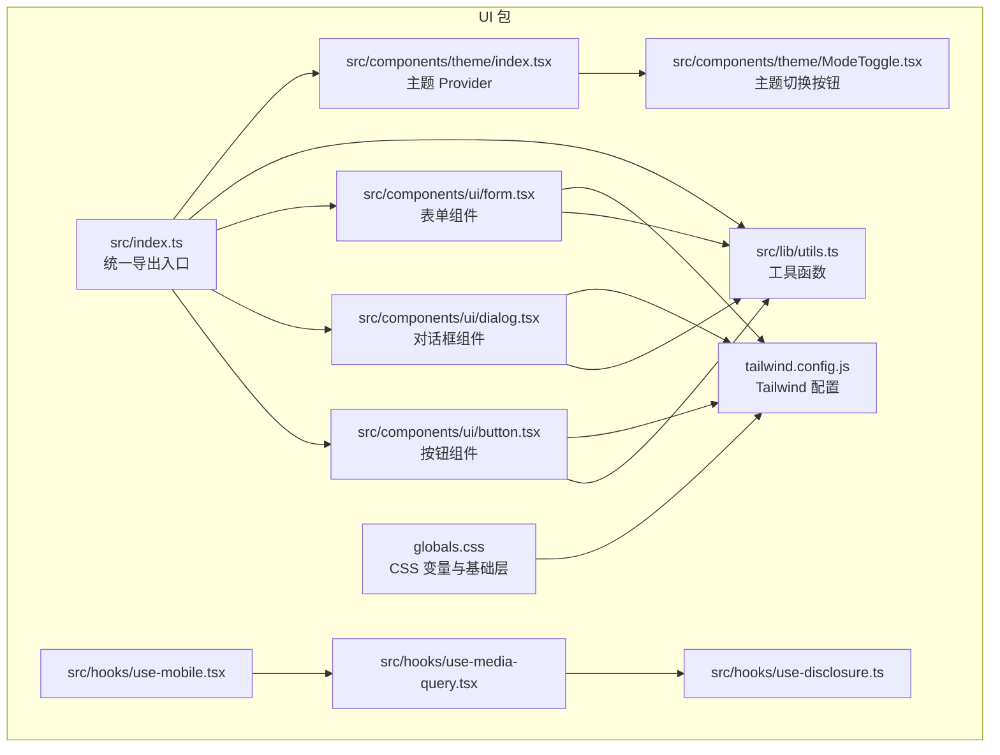
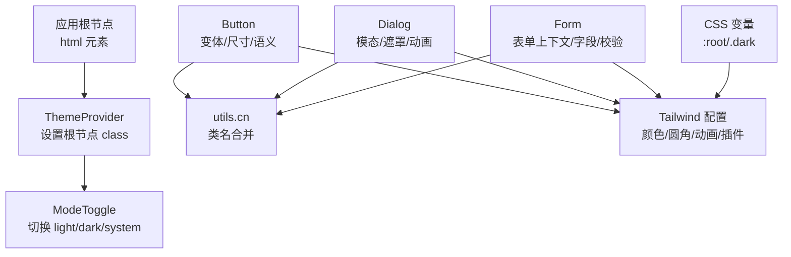
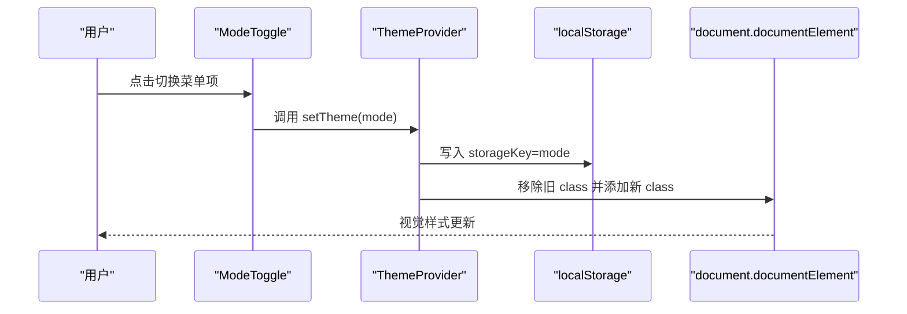
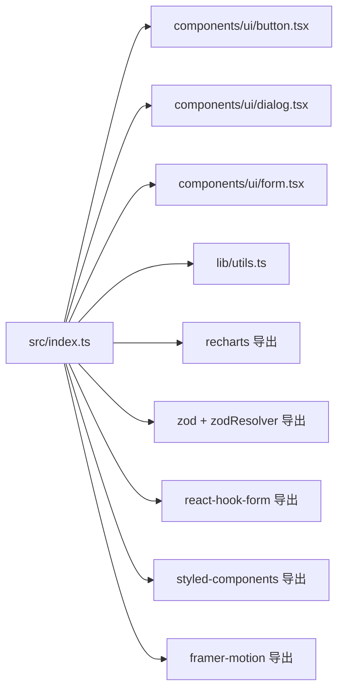
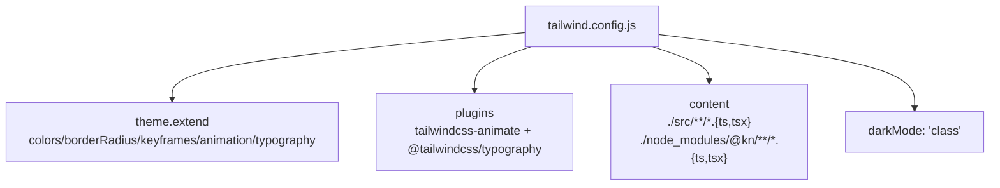
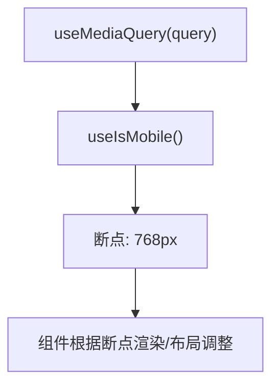
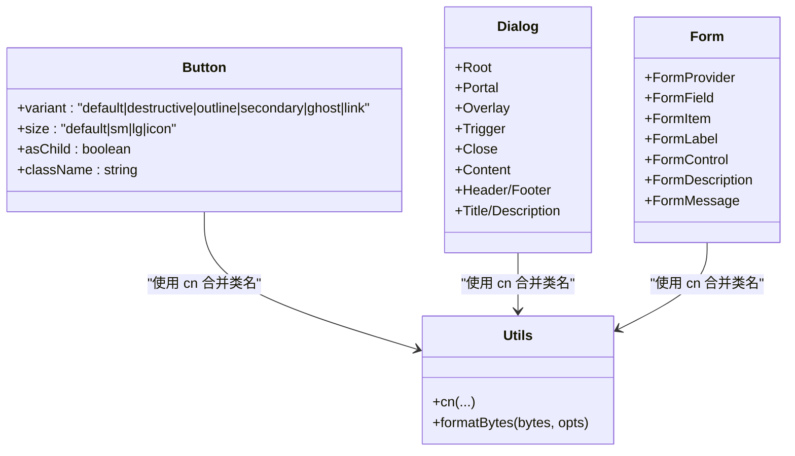
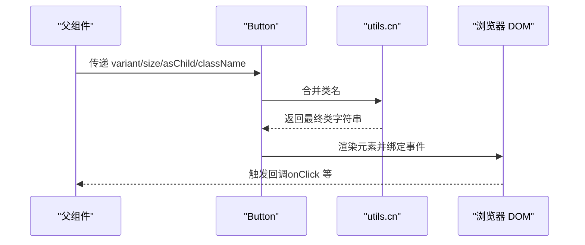
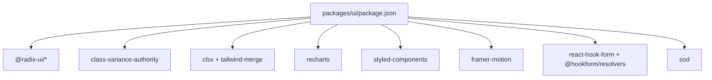

# UI组件架构

<cite>
**本文引用的文件**
- [packages/ui/package.json](file://packages/ui/package.json)
- [packages/ui/tailwind.config.js](file://packages/ui/tailwind.config.js)
- [packages/ui/globals.css](file://packages/ui/globals.css)
- [packages/ui/src/index.ts](file://packages/ui/src/index.ts)
- [packages/ui/src/lib/utils.ts](file://packages/ui/src/lib/utils.ts)
- [packages/ui/src/hooks/use-mobile.tsx](file://packages/ui/src/hooks/use-mobile.tsx)
- [packages/ui/src/hooks/use-media-query.tsx](file://packages/ui/src/hooks/use-media-query.tsx)
- [packages/ui/src/hooks/use-disclosure.ts](file://packages/ui/src/hooks/use-disclosure.ts)
- [packages/ui/src/components/theme/index.tsx](file://packages/ui/src/components/theme/index.tsx)
- [packages/ui/src/components/theme/ModeToggle.tsx](file://packages/ui/src/components/theme/ModeToggle.tsx)
- [packages/ui/src/components/ui/button.tsx](file://packages/ui/src/components/ui/button.tsx)
- [packages/ui/src/components/ui/dialog.tsx](file://packages/ui/src/components/ui/dialog.tsx)
- [packages/ui/src/components/ui/form.tsx](file://packages/ui/src/components/ui/form.tsx)
</cite>

## 目录
1. [简介](#简介)
2. [项目结构](#项目结构)
3. [核心组件](#核心组件)
4. [架构总览](#架构总览)
5. [详细组件分析](#详细组件分析)
6. [依赖关系分析](#依赖关系分析)
7. [性能考量](#性能考量)
8. [故障排查指南](#故障排查指南)
9. [结论](#结论)
10. [附录](#附录)

## 简介
本文件面向知识库管理系统的UI组件架构，聚焦于基于 Shadcn/UI 的设计系统集成与定制策略，系统性阐述主题系统（明暗模式）的实现、颜色变量与样式覆盖机制、组件库的模块化导出方式、Tailwind CSS 配置与自定义规则、响应式设计与移动端适配方案，并给出组件开发规范与主题定制的最佳实践建议。文档同时提供多类可视化图示，帮助读者从整体到细节理解该UI体系。

## 项目结构
UI 组件库位于 packages/ui，采用 monorepo 工作区组织，核心由以下部分构成：
- 组件层：packages/ui/src/components/ui 下为基于 Radix UI 的可组合基础组件；packages/ui/src/components/theme 提供主题上下文与切换入口。
- 工具与钩子：packages/ui/src/lib/utils.ts 提供样式合并与格式化工具；hooks 目录提供移动端检测、媒体查询、弹窗状态等通用能力。
- 样式与主题：packages/ui/globals.css 定义 CSS 变量与基础层样式；packages/ui/tailwind.config.js 扩展 Tailwind 主题与插件。
- 统一导出：packages/ui/src/index.ts 汇聚组件、工具与第三方导出，形成包的统一入口。

图表来源
- [packages/ui/src/index.ts](file://packages/ui/src/index.ts#L1-L18)
- [packages/ui/src/lib/utils.ts](file://packages/ui/src/lib/utils.ts#L1-L25)
- [packages/ui/src/components/theme/index.tsx](file://packages/ui/src/components/theme/index.tsx#L1-L75)
- [packages/ui/src/components/theme/ModeToggle.tsx](file://packages/ui/src/components/theme/ModeToggle.tsx#L1-L37)
- [packages/ui/src/components/ui/button.tsx](file://packages/ui/src/components/ui/button.tsx#L1-L57)
- [packages/ui/src/components/ui/dialog.tsx](file://packages/ui/src/components/ui/dialog.tsx#L1-L121)
- [packages/ui/src/components/ui/form.tsx](file://packages/ui/src/components/ui/form.tsx#L1-L177)
- [packages/ui/src/hooks/use-mobile.tsx](file://packages/ui/src/hooks/use-mobile.tsx#L1-L20)
- [packages/ui/src/hooks/use-media-query.tsx](file://packages/ui/src/hooks/use-media-query.tsx#L1-L23)
- [packages/ui/src/hooks/use-disclosure.ts](file://packages/ui/src/hooks/use-disclosure.ts#L1-L12)
- [packages/ui/tailwind.config.js](file://packages/ui/tailwind.config.js#L1-L145)
- [packages/ui/globals.css](file://packages/ui/globals.css#L1-L122)

章节来源
- [packages/ui/src/index.ts](file://packages/ui/src/index.ts#L1-L18)
- [packages/ui/tailwind.config.js](file://packages/ui/tailwind.config.js#L1-L145)
- [packages/ui/globals.css](file://packages/ui/globals.css#L1-L122)

## 核心组件
本节聚焦 UI 组件库的关键构件及其职责边界：
- 统一导出入口：src/index.ts 将组件、工具与常用第三方库（如 recharts、zod、react-hook-form、styled-components、framer-motion 等）集中导出，便于上层应用按需引入。
- 样式工具：lib/utils.ts 提供 cn（clsx + tailwind-merge）与文件大小格式化等实用方法，确保类名合并与显示一致。
- 基础组件：ui 目录下组件均以 Radix UI 为基础，结合 class-variance-authority 实现变体与尺寸控制，遵循语义化与无障碍标准。
- 主题系统：theme 目录提供 ThemeProvider 与 ModeToggle，支持 light/dark/system 三种模式，持久化存储于 localStorage 并通过根节点 class 切换。
- 响应式与交互：hooks 提供移动端断点检测、媒体查询监听与弹窗状态管理，支撑移动端适配与交互行为。

章节来源
- [packages/ui/src/index.ts](file://packages/ui/src/index.ts#L1-L18)
- [packages/ui/src/lib/utils.ts](file://packages/ui/src/lib/utils.ts#L1-L25)
- [packages/ui/src/components/theme/index.tsx](file://packages/ui/src/components/theme/index.tsx#L1-L75)
- [packages/ui/src/components/theme/ModeToggle.tsx](file://packages/ui/src/components/theme/ModeToggle.tsx#L1-L37)
- [packages/ui/src/hooks/use-mobile.tsx](file://packages/ui/src/hooks/use-mobile.tsx#L1-L20)
- [packages/ui/src/hooks/use-media-query.tsx](file://packages/ui/src/hooks/use-media-query.tsx#L1-L23)
- [packages/ui/src/hooks/use-disclosure.ts](file://packages/ui/src/hooks/use-disclosure.ts#L1-L12)

## 架构总览
UI 组件架构围绕“主题系统 + 设计系统组件 + 工具与钩子 + Tailwind 配置”展开，形成可复用、可扩展且易于维护的前端组件生态。

图表来源
- [packages/ui/src/components/theme/index.tsx](file://packages/ui/src/components/theme/index.tsx#L1-L75)
- [packages/ui/src/components/theme/ModeToggle.tsx](file://packages/ui/src/components/theme/ModeToggle.tsx#L1-L37)
- [packages/ui/src/components/ui/button.tsx](file://packages/ui/src/components/ui/button.tsx#L1-L57)
- [packages/ui/src/components/ui/dialog.tsx](file://packages/ui/src/components/ui/dialog.tsx#L1-L121)
- [packages/ui/src/components/ui/form.tsx](file://packages/ui/src/components/ui/form.tsx#L1-L177)
- [packages/ui/src/lib/utils.ts](file://packages/ui/src/lib/utils.ts#L1-L25)
- [packages/ui/tailwind.config.js](file://packages/ui/tailwind.config.js#L1-L145)
- [packages/ui/globals.css](file://packages/ui/globals.css#L1-L122)

## 详细组件分析

### 主题系统与明暗模式
主题系统通过 ThemeProvider 在根节点添加 light 或 dark 类，配合 CSS 变量实现全局样式切换；ModeToggle 提供用户交互入口，支持本地持久化与系统跟随。

图表来源
- [packages/ui/src/components/theme/ModeToggle.tsx](file://packages/ui/src/components/theme/ModeToggle.tsx#L1-L37)
- [packages/ui/src/components/theme/index.tsx](file://packages/ui/src/components/theme/index.tsx#L1-L75)

章节来源
- [packages/ui/src/components/theme/index.tsx](file://packages/ui/src/components/theme/index.tsx#L1-L75)
- [packages/ui/src/components/theme/ModeToggle.tsx](file://packages/ui/src/components/theme/ModeToggle.tsx#L1-L37)
- [packages/ui/globals.css](file://packages/ui/globals.css#L1-L122)

### 组件库的模块化设计与统一导出
UI 包通过 src/index.ts 将组件、工具与常用第三方库统一导出，形成单一入口，便于上层应用按需导入并减少路径复杂度。

图表来源
- [packages/ui/src/index.ts](file://packages/ui/src/index.ts#L1-L18)

章节来源
- [packages/ui/src/index.ts](file://packages/ui/src/index.ts#L1-L18)

### Tailwind CSS 配置与自定义样式规则
Tailwind 配置启用 darkMode 为 class，content 指向组件源码，确保按需生成样式；extend 中定义了容器、颜色、圆角、动画、排版等主题扩展，并加载 tailwindcss-animate 与 @tailwindcss/typography 插件。

图表来源
- [packages/ui/tailwind.config.js](file://packages/ui/tailwind.config.js#L1-L145)

章节来源
- [packages/ui/tailwind.config.js](file://packages/ui/tailwind.config.js#L1-L145)

### 响应式设计与移动端适配
- 断点与容器：Tailwind 配置中定义了 xs 到 3xl 的多级屏幕断点，满足不同设备布局需求。
- 移动端检测：useIsMobile 与 useMediaQuery 提供基于媒体查询的断点监听，便于在组件内部进行条件渲染或行为切换。
- 移动优先：组件普遍使用 Tailwind 的响应式前缀与 flex/grid 排版，保证在小屏设备上的可读性与可用性。

图表来源
- [packages/ui/src/hooks/use-media-query.tsx](file://packages/ui/src/hooks/use-media-query.tsx#L1-L23)
- [packages/ui/src/hooks/use-mobile.tsx](file://packages/ui/src/hooks/use-mobile.tsx#L1-L20)

章节来源
- [packages/ui/src/hooks/use-media-query.tsx](file://packages/ui/src/hooks/use-media-query.tsx#L1-L23)
- [packages/ui/src/hooks/use-mobile.tsx](file://packages/ui/src/hooks/use-mobile.tsx#L1-L20)
- [packages/ui/tailwind.config.js](file://packages/ui/tailwind.config.js#L1-L145)

### 组件开发规范
- 命名约定：组件文件与导出保持一致，如 Button、Dialog、Form 等，避免歧义。
- Props 设计：组件通过 Variants（如 Button 的 variant/size）与 Radix Slot 支持 asChild，提升可组合性与可访问性。
- 事件处理：组件遵循原生事件透传与无障碍属性（如 aria-*），并在需要时提供受控/非受控两种形态。
- 样式合并：统一使用 utils.cn 合并类名，避免冲突并减少冗余样式。
- 表单集成：Form 组件基于 react-hook-form，提供 FormField、FormItem、FormLabel、FormControl、FormMessage 等上下文，简化表单开发。

图表来源
- [packages/ui/src/components/ui/button.tsx](file://packages/ui/src/components/ui/button.tsx#L1-L57)
- [packages/ui/src/components/ui/dialog.tsx](file://packages/ui/src/components/ui/dialog.tsx#L1-L121)
- [packages/ui/src/components/ui/form.tsx](file://packages/ui/src/components/ui/form.tsx#L1-L177)
- [packages/ui/src/lib/utils.ts](file://packages/ui/src/lib/utils.ts#L1-L25)

章节来源
- [packages/ui/src/components/ui/button.tsx](file://packages/ui/src/components/ui/button.tsx#L1-L57)
- [packages/ui/src/components/ui/dialog.tsx](file://packages/ui/src/components/ui/dialog.tsx#L1-L121)
- [packages/ui/src/components/ui/form.tsx](file://packages/ui/src/components/ui/form.tsx#L1-L177)
- [packages/ui/src/lib/utils.ts](file://packages/ui/src/lib/utils.ts#L1-L25)

### 组件调用链与交互流程（以按钮为例）

图表来源
- [packages/ui/src/components/ui/button.tsx](file://packages/ui/src/components/ui/button.tsx#L1-L57)
- [packages/ui/src/lib/utils.ts](file://packages/ui/src/lib/utils.ts#L1-L25)

## 依赖关系分析
UI 包依赖 Radix UI、class-variance-authority、clsx、tailwind-merge 等核心库，用于构建可组合、可变体的基础组件；同时集成 recharts、styled-components、framer-motion 等增强视觉与交互体验。

图表来源
- [packages/ui/package.json](file://packages/ui/package.json#L1-L90)

章节来源
- [packages/ui/package.json](file://packages/ui/package.json#L1-L90)

## 性能考量
- 按需样式：Tailwind content 指向组件源码，避免未使用样式进入产物，降低体积。
- 类名合并：使用 twMerge 与 clsx 合并类名，减少重复与冲突，避免无用样式叠加。
- 动画与过渡：通过 Tailwind 动画与 Radix 过渡实现流畅交互，避免过度复杂动画导致掉帧。
- 组件拆分：基础组件保持单一职责，配合变体与尺寸控制，减少不必要的重渲染。
- 媒体查询监听：useMediaQuery 仅在必要时触发，避免频繁重绘。

## 故障排查指南
- 主题不生效
  - 检查根节点是否正确添加 light/dark/class；确认 localStorage 中存储键值是否被修改。
  - 确认 CSS 变量在 :root 与 .dark 中定义完整。
- 样式冲突
  - 使用 utils.cn 合并类名，避免重复覆盖；检查 Tailwind 版本与插件版本兼容性。
- 响应式异常
  - 核对断点与媒体查询监听逻辑；确认 useIsMobile/useMediaQuery 的断点常量与 Tailwind 配置一致。
- 表单问题
  - 确保在 FormProvider 内部使用 FormField/FormItem 等上下文组件；校验器与字段名匹配。

章节来源
- [packages/ui/src/components/theme/index.tsx](file://packages/ui/src/components/theme/index.tsx#L1-L75)
- [packages/ui/globals.css](file://packages/ui/globals.css#L1-L122)
- [packages/ui/src/lib/utils.ts](file://packages/ui/src/lib/utils.ts#L1-L25)
- [packages/ui/src/hooks/use-media-query.tsx](file://packages/ui/src/hooks/use-media-query.tsx#L1-L23)
- [packages/ui/src/components/ui/form.tsx](file://packages/ui/src/components/ui/form.tsx#L1-L177)

## 结论
本 UI 组件架构以 Shadcn/UI 为基础，结合 Radix UI 的可组合性与 Tailwind 的原子化样式，辅以主题系统、工具函数与钩子，形成了高内聚、低耦合且易于扩展的组件生态。通过统一导出入口与完善的响应式策略，能够快速搭建一致性的知识库管理界面，并支持品牌化与主题定制的长期演进。

## 附录
- 主题定制最佳实践
  - 使用 CSS 变量集中管理色彩与圆角，避免硬编码颜色。
  - 在 globals.css 中补充品牌色系变量，并在 tailwind.config.js 的 theme.extend.colors 中映射。
  - 通过 ModeToggle 与 ThemeProvider 的 storageKey 自定义持久化键，避免多环境冲突。
- 品牌化建议
  - 以主色与辅助色为核心，派生前景/背景/强调色，确保明暗两套主题下对比度与可读性。
  - 为关键组件（如 Button、Dialog、Form）定义品牌专属变体，统一视觉语言。
  - 使用 Tailwind 插件（如 @tailwindcss/typography）统一排版风格，提升内容可读性。