# UI组件架构

<cite>
**本文引用的文件**
- [packages/ui/package.json](file://packages/ui/package.json)
- [packages/ui/tailwind.config.js](file://packages/ui/tailwind.config.js)
- [packages/ui/globals.css](file://packages/ui/globals.css)
- [packages/ui/postcss.config.js](file://packages/ui/postcss.config.js)
- [packages/ui/src/index.ts](file://packages/ui/src/index.ts)
- [packages/ui/src/lib/utils.ts](file://packages/ui/src/lib/utils.ts)
- [packages/ui/src/hooks/use-mobile.tsx](file://packages/ui/src/hooks/use-mobile.tsx)
- [packages/ui/src/hooks/use-media-query.tsx](file://packages/ui/src/hooks/use-media-query.tsx)
- [packages/ui/src/hooks/use-disclosure.ts](file://packages/ui/src/hooks/use-disclosure.ts)
- [packages/ui/src/components/theme/index.tsx](file://packages/ui/src/components/theme/index.tsx)
- [packages/ui/src/components/theme/ModeToggle.tsx](file://packages/ui/src/components/theme/ModeToggle.tsx)
- [packages/ui/src/components/ui/button.tsx](file://packages/ui/src/components/ui/button.tsx)
- [packages/ui/src/components/ui/dialog.tsx](file://packages/ui/src/components/ui/dialog.tsx)
- [packages/ui/src/components/ui/form.tsx](file://packages/ui/src/components/ui/form.tsx)
- [packages/ui/src/components/ui/expandable-chat.tsx](file://packages/ui/src/components/ui/expandable-chat.tsx)
- [packages/ui/src/components/index.ts](file://packages/ui/src/components/index.ts)
</cite>

## 更新摘要
**变更内容**
- 新增expandable-chat组件章节，详细介绍React context集成和状态管理改进
- 更新组件库模块化设计，包含expandable-chat的统一导出机制
- 增强组件间通信机制说明，展示context provider的实际应用
- 更新依赖关系分析，包含新的组件依赖

## 目录
1. [简介](#简介)
2. [项目结构](#项目结构)
3. [核心组件](#核心组件)
4. [架构总览](#架构总览)
5. [详细组件分析](#详细组件分析)
6. [依赖关系分析](#依赖关系分析)
7. [性能考量](#性能考量)
8. [故障排查指南](#故障排查指南)
9. [结论](#结论)
10. [附录](#附录)

## 简介
本文件面向知识库管理系统的UI组件架构，聚焦于基于 Shadcn/UI 的设计系统集成与定制策略，系统性阐述主题系统（明暗模式）的实现、颜色变量与样式覆盖机制、组件库的模块化导出方式、Tailwind CSS 配置与自定义规则、响应式设计与移动端适配方案，并给出组件开发规范与主题定制的最佳实践建议。文档同时提供多类可视化图示，帮助读者从整体到细节理解该UI体系。

**更新** 本次更新重点反映了expandable-chat组件的增强，包括React context集成和更好的状态管理机制，以及组件间通信的改进。

## 项目结构
UI 组件库位于 packages/ui，采用 monorepo 工作区组织，核心由以下部分构成：
- 组件层：packages/ui/src/components/ui 下为基于 Radix UI 的可组合基础组件；packages/ui/src/components/theme 提供主题上下文与切换入口；新增packages/ui/src/components/ui/expandable-chat.tsx提供聊天组件生态。
- 工具与钩子：packages/ui/src/lib/utils.ts 提供样式合并与格式化工具；hooks 目录提供移动端检测、媒体查询、弹窗状态等通用能力。
- 样式与主题：packages/ui/globals.css 定义 CSS 变量与基础层样式；packages/ui/tailwind.config.js 扩展 Tailwind 主题与插件；packages/ui/postcss.config.js 配置 PostCSS 处理流程。
- 统一导出：packages/ui/src/index.ts 汇聚组件、工具与第三方导出，形成包的统一入口；packages/ui/src/components/index.ts 提供组件层的统一导出。

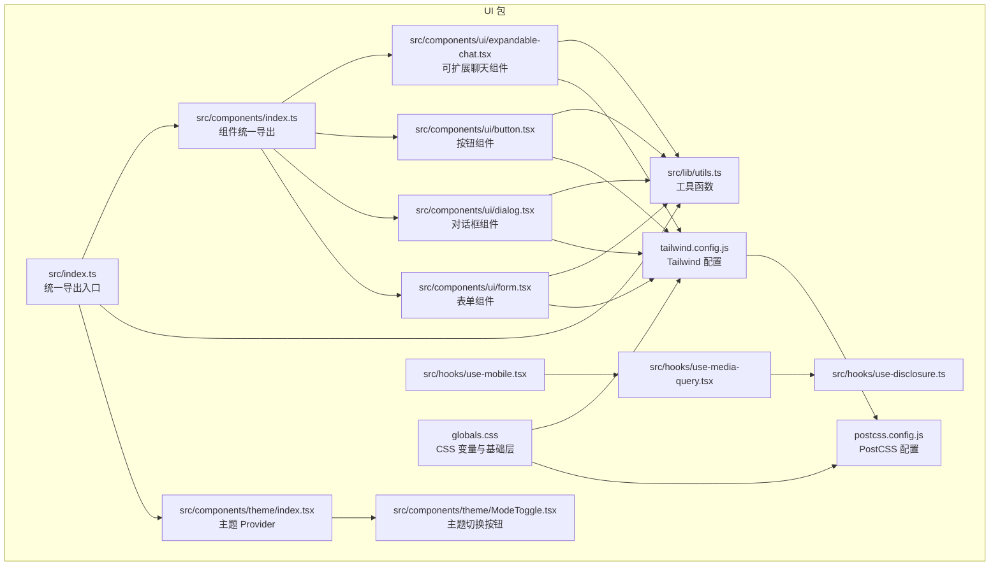

**图表来源**
- [packages/ui/src/index.ts:1-26](file://packages/ui/src/index.ts#L1-L26)
- [packages/ui/src/components/index.ts:1-80](file://packages/ui/src/components/index.ts#L1-L80)
- [packages/ui/src/lib/utils.ts:1-25](file://packages/ui/src/lib/utils.ts#L1-L25)
- [packages/ui/src/components/theme/index.tsx:1-75](file://packages/ui/src/components/theme/index.tsx#L1-L75)
- [packages/ui/src/components/theme/ModeToggle.tsx:1-37](file://packages/ui/src/components/theme/ModeToggle.tsx#L1-L37)
- [packages/ui/src/components/ui/button.tsx:1-57](file://packages/ui/src/components/ui/button.tsx#L1-L57)
- [packages/ui/src/components/ui/dialog.tsx:1-121](file://packages/ui/src/components/ui/dialog.tsx#L1-L121)
- [packages/ui/src/components/ui/form.tsx:1-177](file://packages/ui/src/components/ui/form.tsx#L1-L177)
- [packages/ui/src/components/ui/expandable-chat.tsx:1-427](file://packages/ui/src/components/ui/expandable-chat.tsx#L1-L427)
- [packages/ui/src/hooks/use-mobile.tsx:1-20](file://packages/ui/src/hooks/use-mobile.tsx#L1-L20)
- [packages/ui/src/hooks/use-media-query.tsx:1-23](file://packages/ui/src/hooks/use-media-query.tsx#L1-L23)
- [packages/ui/src/hooks/use-disclosure.ts:1-12](file://packages/ui/src/hooks/use-disclosure.ts#L1-L12)
- [packages/ui/tailwind.config.js:1-211](file://packages/ui/tailwind.config.js#L1-L211)
- [packages/ui/globals.css:1-140](file://packages/ui/globals.css#L1-L140)
- [packages/ui/postcss.config.js:1-8](file://packages/ui/postcss.config.js#L1-L8)

**章节来源**
- [packages/ui/src/index.ts:1-26](file://packages/ui/src/index.ts#L1-L26)
- [packages/ui/src/components/index.ts:1-80](file://packages/ui/src/components/index.ts#L1-L80)
- [packages/ui/tailwind.config.js:1-211](file://packages/ui/tailwind.config.js#L1-L211)
- [packages/ui/globals.css:1-140](file://packages/ui/globals.css#L1-L140)
- [packages/ui/postcss.config.js:1-8](file://packages/ui/postcss.config.js#L1-L8)

## 核心组件
本节聚焦 UI 组件库的关键构件及其职责边界：
- 统一导出入口：src/index.ts 将组件、工具与常用第三方库（如 recharts、zod、react-hook-form、styled-components、framer-motion 等）集中导出，便于上层应用按需引入。
- 组件统一导出：components/index.ts 提供组件层的统一导出，包含expandable-chat在内的所有UI组件。
- 样式工具：lib/utils.ts 提供 cn（clsx + tailwind-merge）与文件大小格式化等实用方法，确保类名合并与显示一致。
- 基础组件：ui 目录下组件均以 Radix UI 为基础，结合 class-variance-authority 实现变体与尺寸控制，遵循语义化与无障碍标准。
- 主题系统：theme 目录提供 ThemeProvider 与 ModeToggle，支持 light/dark/system 三种模式，持久化存储于 localStorage 并通过根节点 class 切换。
- 响应式与交互：hooks 提供移动端断点检测、媒体查询监听与弹窗状态管理，支撑移动端适配与交互行为。
- **新增** 聊天组件生态：expandable-chat 提供完整的聊天界面解决方案，包含上下文状态管理与组件间通信机制。

**更新** expandable-chat组件增强了React context集成，提供更好的状态管理和组件间通信能力。

**章节来源**
- [packages/ui/src/index.ts:1-26](file://packages/ui/src/index.ts#L1-L26)
- [packages/ui/src/components/index.ts:1-80](file://packages/ui/src/components/index.ts#L1-L80)
- [packages/ui/src/lib/utils.ts:1-25](file://packages/ui/src/lib/utils.ts#L1-L25)
- [packages/ui/src/components/theme/index.tsx:1-75](file://packages/ui/src/components/theme/index.tsx#L1-L75)
- [packages/ui/src/components/theme/ModeToggle.tsx:1-37](file://packages/ui/src/components/theme/ModeToggle.tsx#L1-L37)
- [packages/ui/src/hooks/use-mobile.tsx:1-20](file://packages/ui/src/hooks/use-mobile.tsx#L1-L20)
- [packages/ui/src/hooks/use-media-query.tsx:1-23](file://packages/ui/src/hooks/use-media-query.tsx#L1-L23)
- [packages/ui/src/hooks/use-disclosure.ts:1-12](file://packages/ui/src/hooks/use-disclosure.ts#L1-L12)
- [packages/ui/src/components/ui/expandable-chat.tsx:1-427](file://packages/ui/src/components/ui/expandable-chat.tsx#L1-L427)

## 架构总览
UI 组件架构围绕"主题系统 + 设计系统组件 + 工具与钩子 + Tailwind 配置 + PostCSS处理 + 聊天组件生态"展开，形成可复用、可扩展且易于维护的前端组件生态。

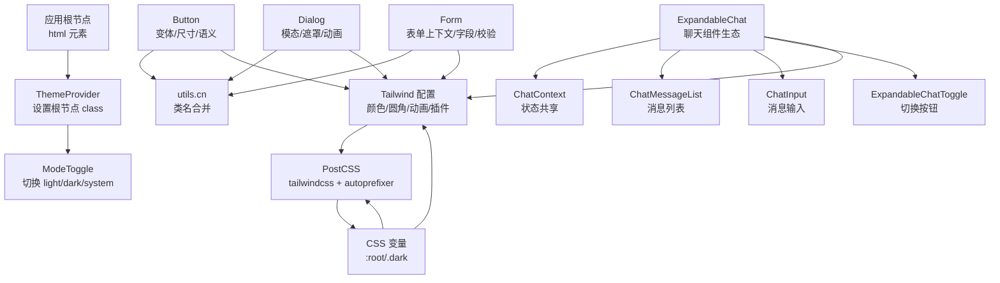

**图表来源**
- [packages/ui/src/components/theme/index.tsx:1-75](file://packages/ui/src/components/theme/index.tsx#L1-L75)
- [packages/ui/src/components/theme/ModeToggle.tsx:1-37](file://packages/ui/src/components/theme/ModeToggle.tsx#L1-L37)
- [packages/ui/src/components/ui/button.tsx:1-57](file://packages/ui/src/components/ui/button.tsx#L1-L57)
- [packages/ui/src/components/ui/dialog.tsx:1-121](file://packages/ui/src/components/ui/dialog.tsx#L1-L121)
- [packages/ui/src/components/ui/form.tsx:1-177](file://packages/ui/src/components/ui/form.tsx#L1-L177)
- [packages/ui/src/components/ui/expandable-chat.tsx:1-427](file://packages/ui/src/components/ui/expandable-chat.tsx#L1-L427)
- [packages/ui/src/lib/utils.ts:1-25](file://packages/ui/src/lib/utils.ts#L1-L25)
- [packages/ui/tailwind.config.js:1-211](file://packages/ui/tailwind.config.js#L1-L211)
- [packages/ui/globals.css:1-140](file://packages/ui/globals.css#L1-L140)
- [packages/ui/postcss.config.js:1-8](file://packages/ui/postcss.config.js#L1-L8)

## 详细组件分析

### 主题系统与明暗模式
主题系统通过 ThemeProvider 在根节点添加 light 或 dark 类，配合 CSS 变量实现全局样式切换；ModeToggle 提供用户交互入口，支持本地持久化与系统跟随。

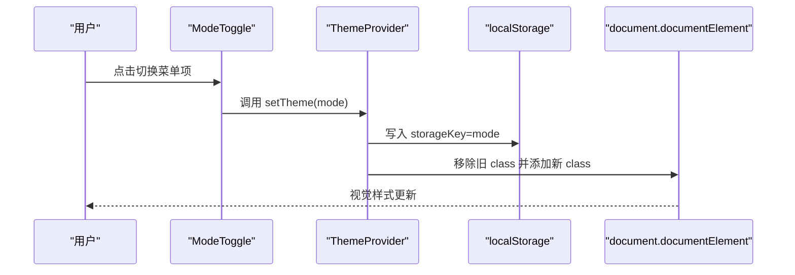

**图表来源**
- [packages/ui/src/components/theme/ModeToggle.tsx:1-37](file://packages/ui/src/components/theme/ModeToggle.tsx#L1-L37)
- [packages/ui/src/components/theme/index.tsx:1-75](file://packages/ui/src/components/theme/index.tsx#L1-L75)

**章节来源**
- [packages/ui/src/components/theme/index.tsx:1-75](file://packages/ui/src/components/theme/index.tsx#L1-L75)
- [packages/ui/src/components/theme/ModeToggle.tsx:1-37](file://packages/ui/src/components/theme/ModeToggle.tsx#L1-L37)
- [packages/ui/globals.css:1-140](file://packages/ui/globals.css#L1-L140)

### 样式基础设施重构与CSS变量管理
UI 组件库采用了现代化的样式基础设施，从传统的独立CSS文件迁移到基于CSS变量和@layer指令的组织方式：

- **CSS变量系统**：在 :root 和 .dark 选择器中定义完整的颜色变量体系，包括背景、前景、卡片、弹出层、主要、次要、破坏性、静音、强调、边框、输入、环形等
- **@layer指令**：使用 Tailwind 的 base、components、utilities 层次结构，确保样式的正确优先级和组织
- **滚动条优化**：针对桌面和移动设备提供不同的滚动条样式，移动端隐藏滚动条以提升用户体验
- **响应式基础**：通过 @apply 指令统一应用边框、背景和文本颜色，确保组件的一致性

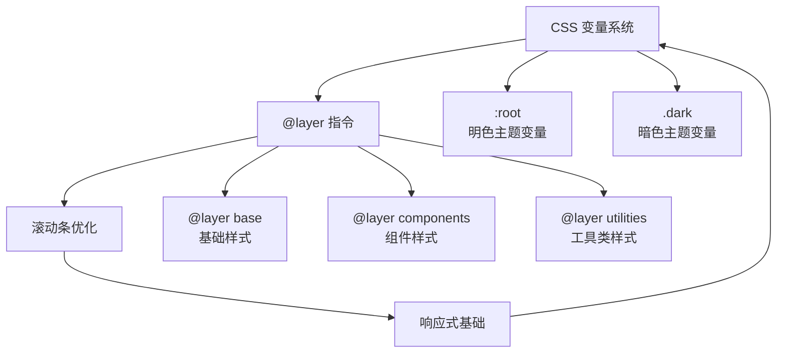

**图表来源**
- [packages/ui/globals.css:1-140](file://packages/ui/globals.css#L1-L140)

**章节来源**
- [packages/ui/globals.css:1-140](file://packages/ui/globals.css#L1-L140)

### 组件库的模块化设计与统一导出
UI 包通过 src/index.ts 和 components/index.ts 将组件、工具与常用第三方库统一导出，形成单一入口，便于上层应用按需导入并减少路径复杂度。

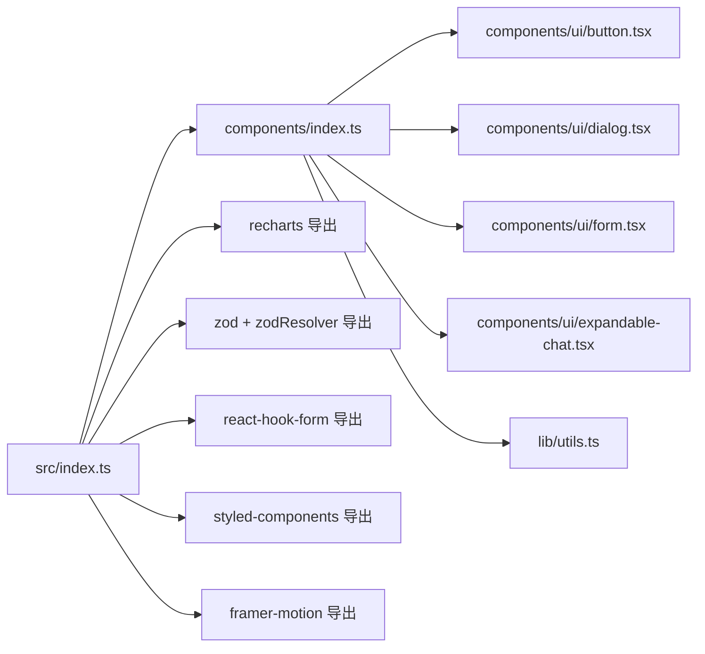

**图表来源**
- [packages/ui/src/components/index.ts:1-80](file://packages/ui/src/components/index.ts#L1-L80)
- [packages/ui/src/index.ts:1-26](file://packages/ui/src/index.ts#L1-L26)

**章节来源**
- [packages/ui/src/components/index.ts:1-80](file://packages/ui/src/components/index.ts#L1-L80)
- [packages/ui/src/index.ts:1-26](file://packages/ui/src/index.ts#L1-L26)

### Tailwind CSS 配置与自定义样式规则
Tailwind 配置启用 darkMode 为 class，content 指向组件源码，确保按需生成样式；extend 中定义了容器、颜色、圆角、动画、排版等主题扩展，并加载 tailwindcss-animate 与 @tailwindcss/typography 插件。

**更新** 配置现在支持更广泛的动态类名模式，包括网格列数、间距、尺寸等动态属性。

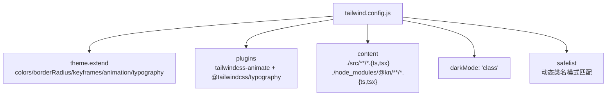

**图表来源**
- [packages/ui/tailwind.config.js:1-211](file://packages/ui/tailwind.config.js#L1-L211)

**章节来源**
- [packages/ui/tailwind.config.js:1-211](file://packages/ui/tailwind.config.js#L1-L211)

### PostCSS配置与构建流程
所有应用现在都引入了PostCSS配置，通过postcss.config.js文件管理CSS预处理器流程：

- **tailwindcss插件**：处理Tailwind指令和生成的CSS
- **autoprefixer插件**：自动添加浏览器前缀，确保跨浏览器兼容性
- **构建优化**：PostCSS在构建过程中处理CSS，提供更好的性能和兼容性

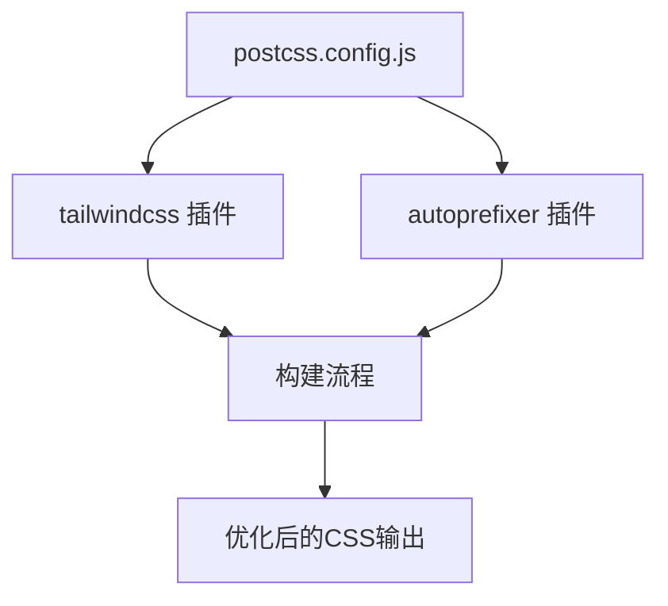

**图表来源**
- [packages/ui/postcss.config.js:1-8](file://packages/ui/postcss.config.js#L1-L8)

**章节来源**
- [packages/ui/postcss.config.js:1-8](file://packages/ui/postcss.config.js#L1-L8)

### 响应式设计与移动端适配
- **断点与容器**：Tailwind 配置中定义了 xs 到 3xl 的多级屏幕断点，满足不同设备布局需求。
- **移动端检测**：useIsMobile 与 useMediaQuery 提供基于媒体查询的断点监听，便于在组件内部进行条件渲染或行为切换。
- **移动优先**：组件普遍使用 Tailwind 的响应式前缀与 flex/grid 排版，保证在小屏设备上的可读性与可用性。
- **滚动条优化**：针对移动设备隐藏滚动条，提供更好的触摸体验。

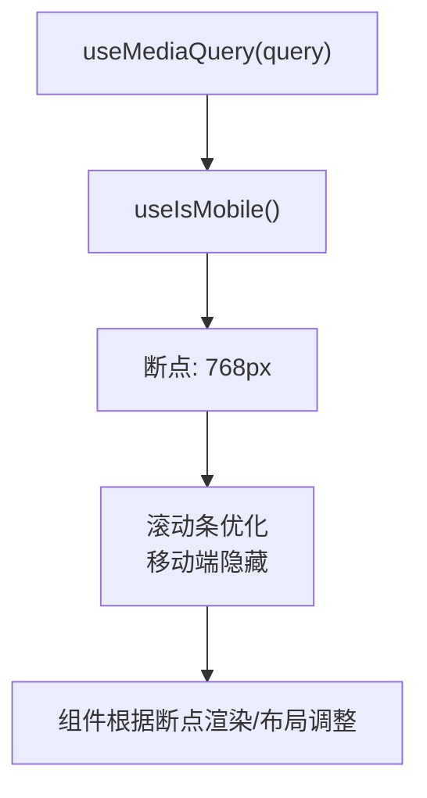

**图表来源**
- [packages/ui/src/hooks/use-media-query.tsx:1-23](file://packages/ui/src/hooks/use-media-query.tsx#L1-L23)
- [packages/ui/src/hooks/use-mobile.tsx:1-20](file://packages/ui/src/hooks/use-mobile.tsx#L1-L20)
- [packages/ui/globals.css:115-130](file://packages/ui/globals.css#L115-L130)

**章节来源**
- [packages/ui/src/hooks/use-media-query.tsx:1-23](file://packages/ui/src/hooks/use-media-query.tsx#L1-L23)
- [packages/ui/src/hooks/use-mobile.tsx:1-20](file://packages/ui/src/hooks/use-mobile.tsx#L1-L20)
- [packages/ui/tailwind.config.js:1-211](file://packages/ui/tailwind.config.js#L1-L211)
- [packages/ui/globals.css:115-130](file://packages/ui/globals.css#L115-L130)

### ExpandableChat组件与React Context集成

**更新** 新增expandable-chat组件章节，详细介绍React context集成和状态管理改进。

ExpandableChat组件是UI库中的重要聊天组件，它实现了完整的聊天界面解决方案，包含React context集成和更好的状态管理机制：

#### React Context集成
组件通过ChatContext提供状态共享机制，允许子组件访问聊天状态和操作方法：

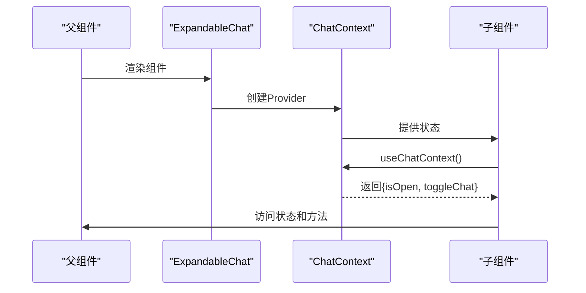

**图表来源**
- [packages/ui/src/components/ui/expandable-chat.tsx:9-20](file://packages/ui/src/components/ui/expandable-chat.tsx#L9-L20)

#### 状态管理与组件间通信
- **状态共享**：通过ChatContext共享isOpen状态和toggleChat方法
- **子组件访问**：ExpandableChatHeader等子组件通过useChatContext()访问状态
- **事件处理**：toggleChat方法在父组件中定义，子组件通过context调用
- **无障碍支持**：自动焦点管理，提升可访问性

#### 组件生态与模块化
组件包含多个子组件，形成完整的聊天界面：

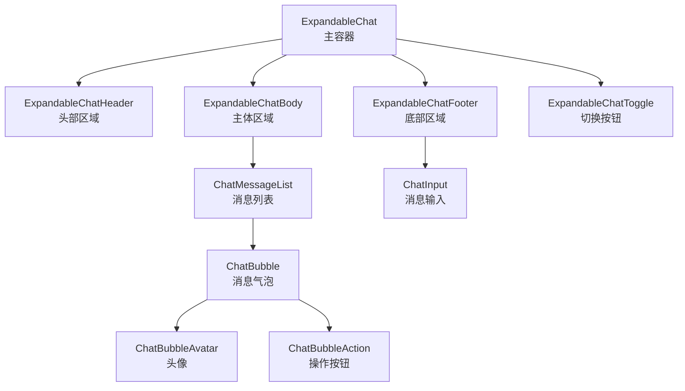

**图表来源**
- [packages/ui/src/components/ui/expandable-chat.tsx:123-427](file://packages/ui/src/components/ui/expandable-chat.tsx#L123-L427)

**章节来源**
- [packages/ui/src/components/ui/expandable-chat.tsx:1-427](file://packages/ui/src/components/ui/expandable-chat.tsx#L1-L427)

### 组件开发规范
- **命名约定**：组件文件与导出保持一致，如 Button、Dialog、Form、ExpandableChat 等，避免歧义。
- **Props 设计**：组件通过 Variants（如 Button 的 variant/size）与 Radix Slot 支持 asChild，提升可组合性与可访问性。
- **事件处理**：组件遵循原生事件透传与无障碍属性（如 aria-*），并在需要时提供受控/非受控两种形态。
- **样式合并**：统一使用 utils.cn 合并类名，避免冲突并减少冗余样式。
- **表单集成**：Form 组件基于 react-hook-form，提供 FormField、FormItem、FormLabel、FormControl、FormMessage 等上下文，简化表单开发。
- **CSS变量使用**：组件现在可以利用全局CSS变量，实现更灵活的主题定制。
- **Context集成**：新增的expandable-chat组件展示了正确的React context使用模式，提供状态共享和组件间通信。

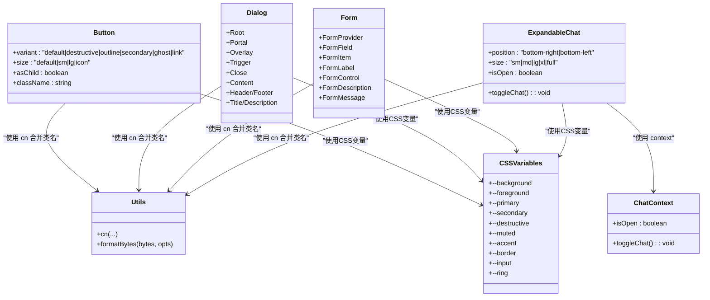

**图表来源**
- [packages/ui/src/components/ui/button.tsx:1-57](file://packages/ui/src/components/ui/button.tsx#L1-L57)
- [packages/ui/src/components/ui/dialog.tsx:1-121](file://packages/ui/src/components/ui/dialog.tsx#L1-L121)
- [packages/ui/src/components/ui/form.tsx:1-177](file://packages/ui/src/components/ui/form.tsx#L1-L177)
- [packages/ui/src/components/ui/expandable-chat.tsx:1-427](file://packages/ui/src/components/ui/expandable-chat.tsx#L1-L427)
- [packages/ui/src/lib/utils.ts:1-25](file://packages/ui/src/lib/utils.ts#L1-L25)
- [packages/ui/globals.css:8-79](file://packages/ui/globals.css#L8-L79)

**章节来源**
- [packages/ui/src/components/ui/button.tsx:1-57](file://packages/ui/src/components/ui/button.tsx#L1-L57)
- [packages/ui/src/components/ui/dialog.tsx:1-121](file://packages/ui/src/components/ui/dialog.tsx#L1-L121)
- [packages/ui/src/components/ui/form.tsx:1-177](file://packages/ui/src/components/ui/form.tsx#L1-L177)
- [packages/ui/src/components/ui/expandable-chat.tsx:1-427](file://packages/ui/src/components/ui/expandable-chat.tsx#L1-L427)
- [packages/ui/src/lib/utils.ts:1-25](file://packages/ui/src/lib/utils.ts#L1-L25)
- [packages/ui/globals.css:8-79](file://packages/ui/globals.css#L8-L79)

### 组件调用链与交互流程（以按钮为例）
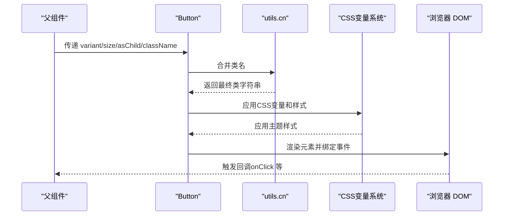

**图表来源**
- [packages/ui/src/components/ui/button.tsx:1-57](file://packages/ui/src/components/ui/button.tsx#L1-L57)
- [packages/ui/src/lib/utils.ts:1-25](file://packages/ui/src/lib/utils.ts#L1-L25)
- [packages/ui/globals.css:8-79](file://packages/ui/globals.css#L8-L79)

### 组件调用链与交互流程（以ExpandableChat为例）
**更新** 新增expandable-chat组件的调用链和交互流程说明。

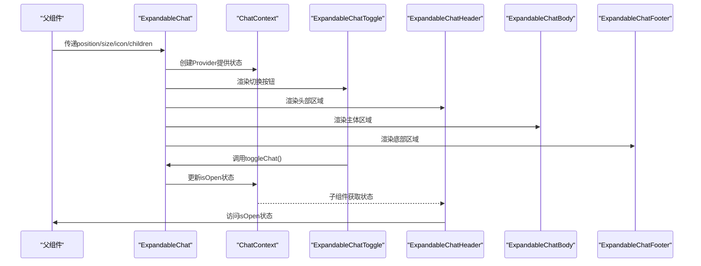

**图表来源**
- [packages/ui/src/components/ui/expandable-chat.tsx:55-119](file://packages/ui/src/components/ui/expandable-chat.tsx#L55-L119)

## 依赖关系分析
UI 包依赖 Radix UI、class-variance-authority、clsx、tailwind-merge 等核心库，用于构建可组合、可变体的基础组件；同时集成 recharts、styled-components、framer-motion 等增强视觉与交互体验。

**更新** 依赖关系现在包括新增的expandable-chat组件依赖。

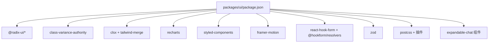

**图表来源**
- [packages/ui/package.json:1-91](file://packages/ui/package.json#L1-L91)

**章节来源**
- [packages/ui/package.json:1-91](file://packages/ui/package.json#L1-L91)

## 性能考量
- **按需样式**：Tailwind content 指向组件源码，避免未使用样式进入产物，降低体积。
- **类名合并**：使用 twMerge 与 clsx 合并类名，减少重复与冲突，避免无用样式叠加。
- **动画与过渡**：通过 Tailwind 动画与 Radix 过渡实现流畅交互，避免过度复杂动画导致掉帧。
- **组件拆分**：基础组件保持单一职责，配合变体与尺寸控制，减少不必要的重渲染。
- **媒体查询监听**：useMediaQuery 仅在必要时触发，避免频繁重绘。
- **CSS变量优化**：使用CSS变量替代硬编码颜色，提高主题切换性能。
- **PostCSS优化**：通过PostCSS自动添加浏览器前缀，减少手动维护成本。
- **Context优化**：expandable-chat组件使用React context进行状态共享，避免深层组件树的状态传递开销。
- **懒加载支持**：组件支持按需加载，减少初始包体积。

**更新** 新增了expandable-chat组件相关的性能考量，包括context优化和懒加载支持。

## 故障排查指南
- **主题不生效**
  - 检查根节点是否正确添加 light/dark/class；确认 localStorage 中存储键值是否被修改。
  - 确认 CSS 变量在 :root 与 .dark 中定义完整。
- **样式冲突**
  - 使用 utils.cn 合并类名，避免重复覆盖；检查 Tailwind 版本与插件版本兼容性。
- **响应式异常**
  - 核对断点与媒体查询监听逻辑；确认 useIsMobile/useMediaQuery 的断点常量与 Tailwind 配置一致。
- **表单问题**
  - 确保在 FormProvider 内部使用 FormField/FormItem 等上下文组件；校验器与字段名匹配。
- **CSS变量问题**
  - 检查CSS变量是否正确声明和使用；确认@layer指令的优先级。
- **PostCSS构建问题**
  - 确认postcss.config.js配置正确；检查tailwindcss和autoprefixer插件版本兼容性。
- **Context问题**
  - 确保在ChatContext.Provider范围内使用useChatContext；检查context值是否正确传递。
- **组件通信问题**
  - 验证子组件是否正确使用useChatContext；检查toggleChat方法的调用时机。

**更新** 新增了expandable-chat组件相关的故障排查指导，包括context和组件通信问题。

**章节来源**
- [packages/ui/src/components/theme/index.tsx:1-75](file://packages/ui/src/components/theme/index.tsx#L1-L75)
- [packages/ui/globals.css:1-140](file://packages/ui/globals.css#L1-L140)
- [packages/ui/src/lib/utils.ts:1-25](file://packages/ui/src/lib/utils.ts#L1-L25)
- [packages/ui/src/hooks/use-media-query.tsx:1-23](file://packages/ui/src/hooks/use-media-query.tsx#L1-L23)
- [packages/ui/src/components/ui/form.tsx:1-177](file://packages/ui/src/components/ui/form.tsx#L1-L177)
- [packages/ui/src/components/ui/expandable-chat.tsx:1-427](file://packages/ui/src/components/ui/expandable-chat.tsx#L1-L427)
- [packages/ui/postcss.config.js:1-8](file://packages/ui/postcss.config.js#L1-L8)

## 结论
本 UI 组件架构以 Shadcn/UI 为基础，结合 Radix UI 的可组合性与 Tailwind 的原子化样式，辅以主题系统、工具函数与钩子，形成了高内聚、低耦合且易于扩展的组件生态。通过统一导出入口与完善的响应式策略，能够快速搭建一致性的知识库管理界面，并支持品牌化与主题定制的长期演进。

**更新** 本次重构显著提升了样式的现代化程度和维护效率，CSS变量系统和PostCSS配置为未来的主题定制和品牌化提供了更强的灵活性。新增的expandable-chat组件展示了现代React开发的最佳实践，包括React context集成、状态管理和组件间通信机制，为复杂的交互场景提供了可靠的解决方案。

## 附录
- **主题定制最佳实践**
  - 使用 CSS 变量集中管理色彩与圆角，避免硬编码颜色。
  - 在 globals.css 中补充品牌色系变量，并在 tailwind.config.js 的 theme.extend.colors 中映射。
  - 通过 ModeToggle 与 ThemeProvider 的 storageKey 自定义持久化键，避免多环境冲突。
  - 利用@layer指令确保样式的正确优先级和组织。
- **品牌化建议**
  - 以主色与辅助色为核心，派生前景/背景/强调色，确保明暗两套主题下对比度与可读性。
  - 为关键组件（如 Button、Dialog、Form、ExpandableChat）定义品牌专属变体，统一视觉语言。
  - 使用 Tailwind 插件（如 @tailwindcss/typography）统一排版风格，提升内容可读性。
  - 通过PostCSS配置实现跨浏览器兼容性和CSS优化。
- **现代化样式开发指南**
  - 采用CSS变量替代硬编码颜色，提升主题切换性能。
  - 使用@layer指令组织样式层次，确保优先级正确。
  - 利用Tailwind的动态类名模式，支持更灵活的样式定制。
  - 通过PostCSS插件链实现CSS预处理和优化。
- **组件开发最佳实践**
  - 使用React context进行状态共享，避免深层组件树的状态传递。
  - 提供清晰的组件API和类型定义，确保良好的开发体验。
  - 实现无障碍支持，提升用户体验。
  - 编写完整的测试用例，确保组件稳定性。
  - 提供详细的文档和使用示例，降低学习成本。