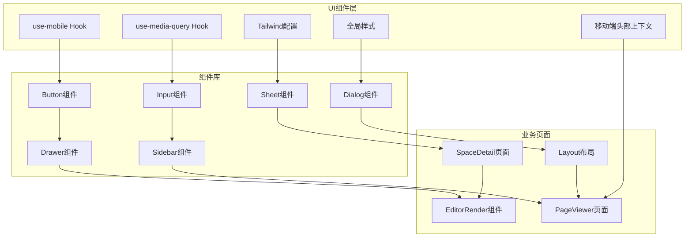
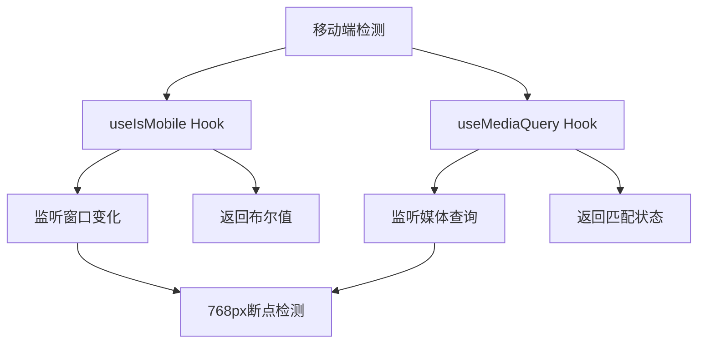
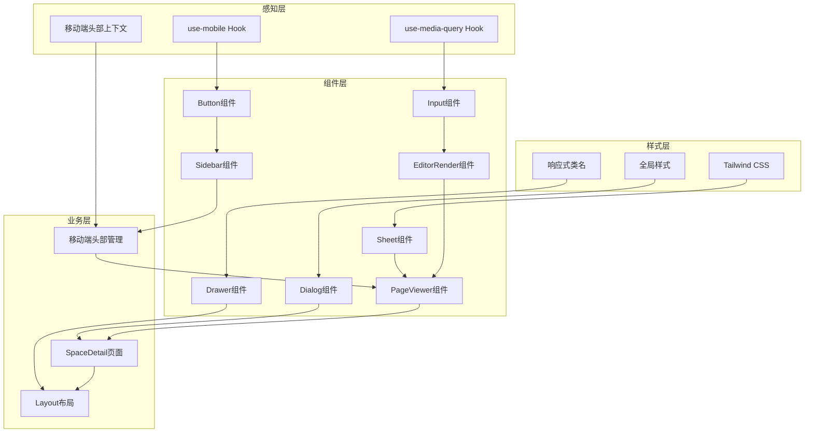
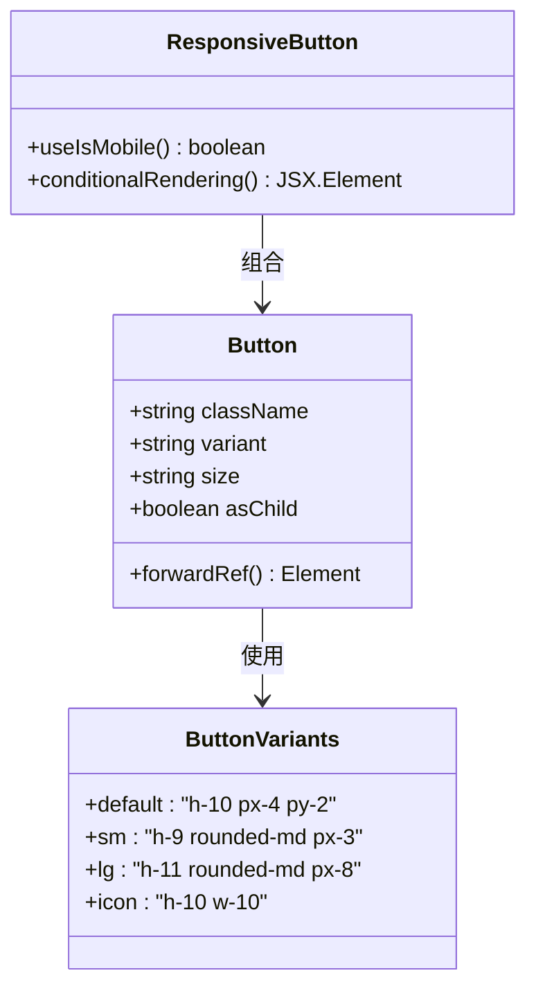
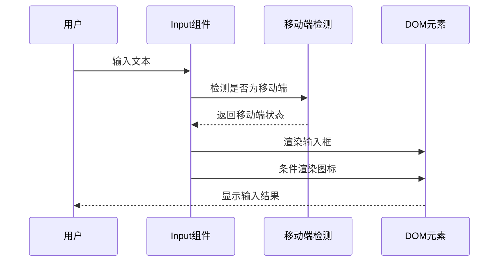
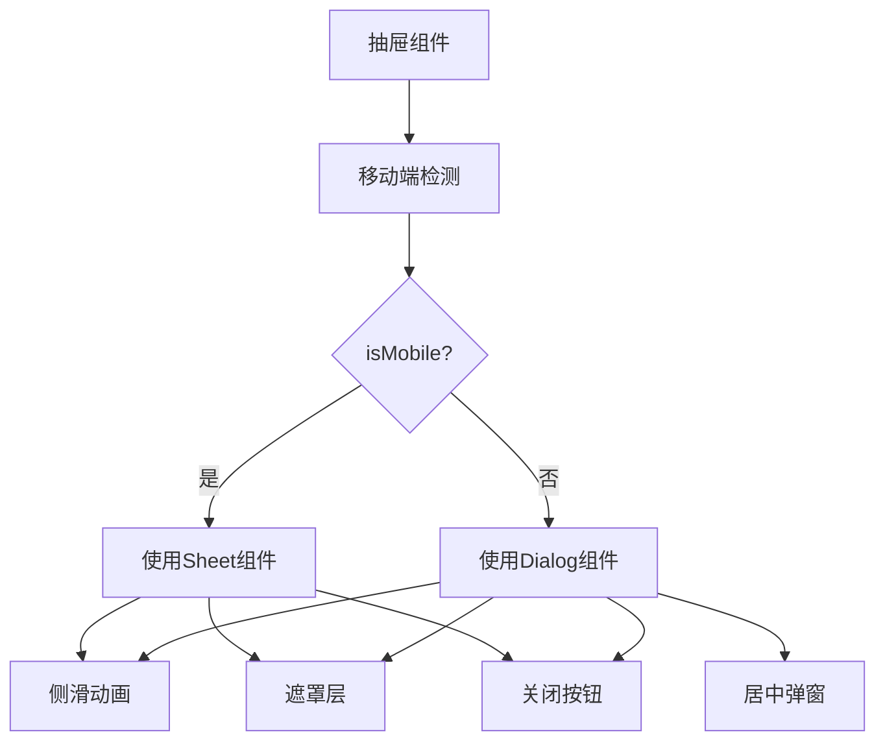
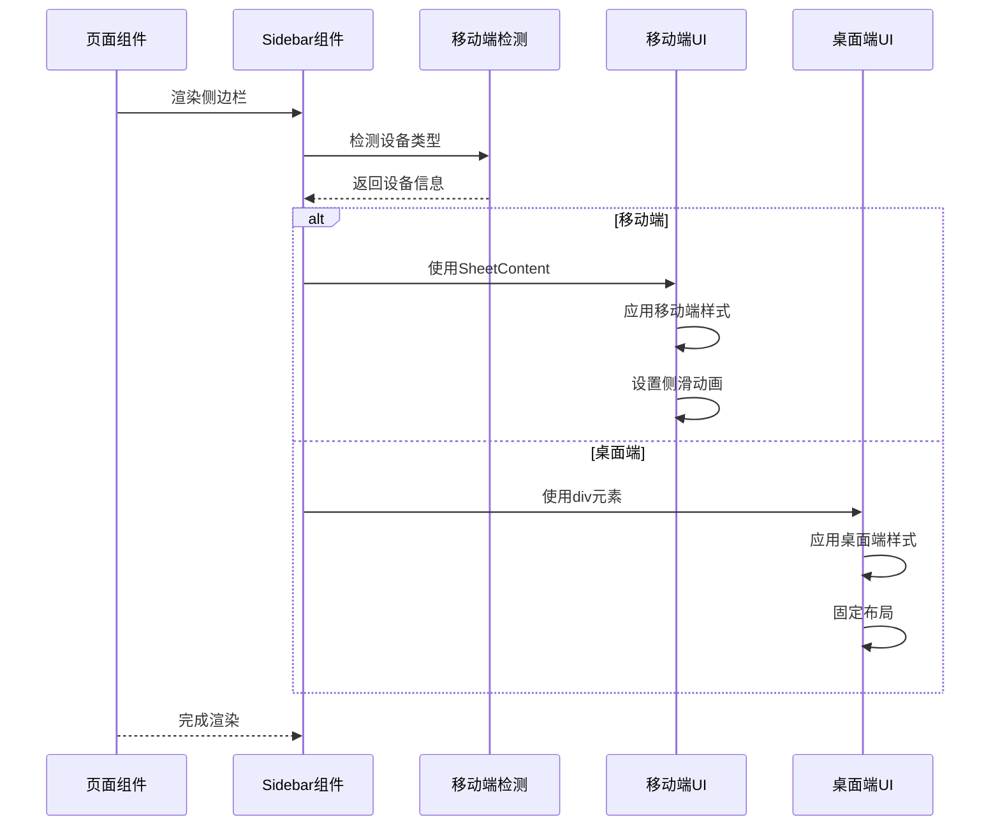
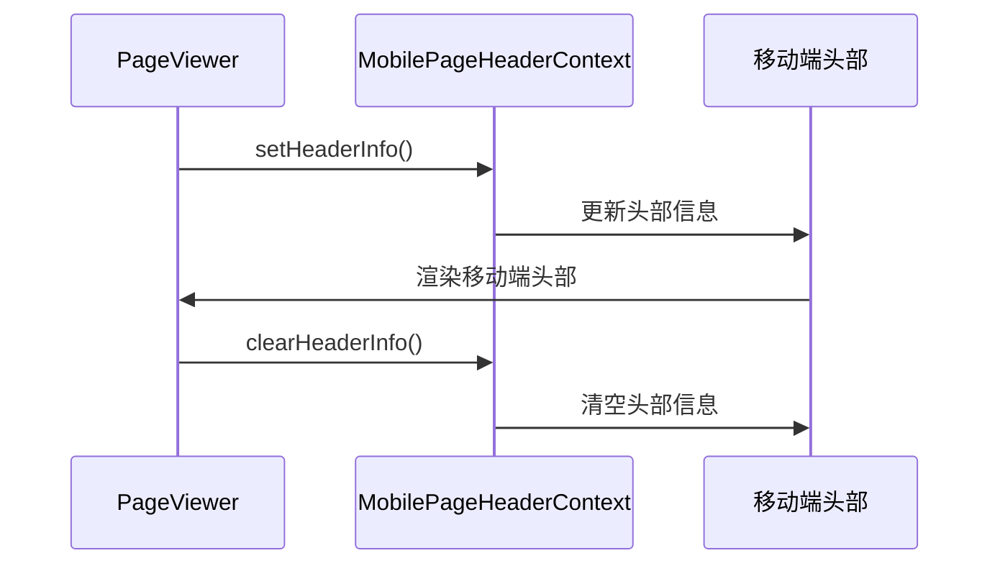
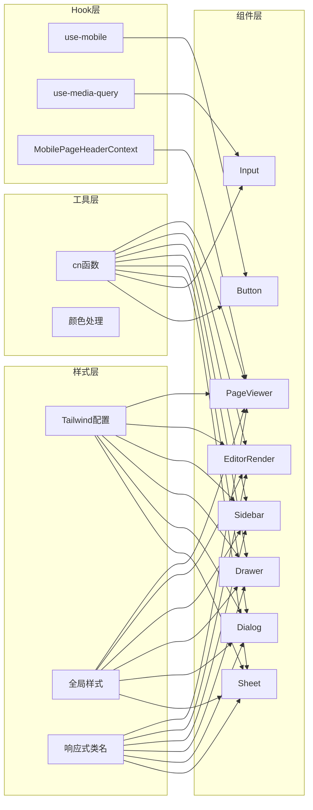

# 移动端UI适配

<cite>
**本文档引用的文件**
- [use-mobile.tsx](file://packages/ui/src/hooks/use-mobile.tsx)
- [use-media-query.tsx](file://packages/ui/src/hooks/use-media-query.tsx)
- [tailwind.config.js](file://packages/ui/tailwind.config.js)
- [globals.css](file://packages/ui/globals.css)
- [button.tsx](file://packages/ui/src/components/ui/button.tsx)
- [input.tsx](file://packages/ui/src/components/ui/input.tsx)
- [sheet.tsx](file://packages/ui/src/components/ui/sheet.tsx)
- [dialog.tsx](file://packages/ui/src/components/ui/dialog.tsx)
- [drawer.tsx](file://packages/ui/src/components/ui/drawer.tsx)
- [sidebar.tsx](file://packages/ui/src/components/ui/sidebar.tsx)
- [SpaceDetail/index.tsx](file://packages/plugin-main/src/pages/SpaceDetail/index.tsx)
- [Layout/index.tsx](file://apps/landing-page-vite/src/pages/Layout/index.tsx)
- [PageViewer/index.tsx](file://packages/plugin-main/src/pages/SpaceDetail/PageViewer/index.tsx)
- [render.tsx](file://packages/editor/src/editor/render.tsx)
- [MobilePageHeaderContext.tsx](file://packages/core/src/context/MobilePageHeaderContext.tsx)
</cite>

## 更新摘要
**变更内容**
- 新增页面查看器组件移动端响应式改进分析
- 更新主容器高度计算和条件类应用
- 添加移动端头部上下文管理机制
- 改进EditorRender组件的移动端适配策略

## 目录
1. [简介](#简介)
2. [项目结构](#项目结构)
3. [核心组件](#核心组件)
4. [架构概览](#架构概览)
5. [详细组件分析](#详细组件分析)
6. [移动端响应式改进](#移动端响应式改进)
7. [依赖关系分析](#依赖关系分析)
8. [性能考虑](#性能考虑)
9. [故障排除指南](#故障排除指南)
10. [结论](#结论)

## 简介

本项目采用现代化的移动端UI适配方案，通过响应式设计、自定义Hook和Tailwind CSS实现跨设备的一致用户体验。系统基于768像素断点进行移动端识别，结合Radix UI组件库提供丰富的交互体验。最新的移动端改进包括页面查看器组件的条件类应用、主容器高度计算优化以及EditorRender组件的显式高度类移除。

## 项目结构

项目采用Monorepo架构，移动端适配相关的核心文件分布如下：



**图表来源**
- [use-mobile.tsx](file://packages/ui/src/hooks/use-mobile.tsx#L1-L20)
- [tailwind.config.js](file://packages/ui/tailwind.config.js#L1-L211)
- [button.tsx](file://packages/ui/src/components/ui/button.tsx#L1-L57)
- [PageViewer/index.tsx](file://packages/plugin-main/src/pages/SpaceDetail/PageViewer/index.tsx#L20-L232)

**章节来源**
- [use-mobile.tsx](file://packages/ui/src/hooks/use-mobile.tsx#L1-L20)
- [use-media-query.tsx](file://packages/ui/src/hooks/use-media-query.tsx#L1-L23)
- [tailwind.config.js](file://packages/ui/tailwind.config.js#L1-L211)

## 核心组件

### 移动端检测Hook

系统提供了两种移动端检测方案：

1. **useIsMobile Hook**：基于窗口宽度检测
2. **useMediaQuery Hook**：基于CSS媒体查询检测



**图表来源**
- [use-mobile.tsx](file://packages/ui/src/hooks/use-mobile.tsx#L5-L19)
- [use-media-query.tsx](file://packages/ui/src/hooks/use-media-query.tsx#L3-L23)

### 响应式设计系统

Tailwind CSS配置支持多种屏幕尺寸：

| 断点 | 尺寸 | 用途 |
|------|------|------|
| xs | 460px | 超小屏设备 |
| sm | 576px | 小屏设备 |
| md | 768px | 中等屏设备（默认移动端断点） |
| lg | 1024px | 大屏设备 |
| xl | 1280px | 超大屏设备 |
| 2xl | 1440px | 2XL屏设备 |
| 3xl | 1900px | 3XL屏设备 |

**章节来源**
- [tailwind.config.js](file://packages/ui/tailwind.config.js#L35-L44)
- [tailwind.config.js](file://packages/ui/tailwind.config.js#L46-L48)

## 架构概览

系统采用分层架构实现移动端适配：



**图表来源**
- [button.tsx](file://packages/ui/src/components/ui/button.tsx#L7-L34)
- [input.tsx](file://packages/ui/src/components/ui/input.tsx#L10-L36)
- [sheet.tsx](file://packages/ui/src/components/ui/sheet.tsx#L55-L74)
- [MobilePageHeaderContext.tsx](file://packages/core/src/context/MobilePageHeaderContext.tsx#L1-L42)

## 详细组件分析

### 按钮组件移动端适配

按钮组件通过CVA（Class Variance Authority）实现响应式设计：



**图表来源**
- [button.tsx](file://packages/ui/src/components/ui/button.tsx#L7-L34)
- [button.tsx](file://packages/ui/src/components/ui/button.tsx#L42-L54)

### 输入组件移动端优化

输入组件支持图标显示和响应式布局：



**图表来源**
- [input.tsx](file://packages/ui/src/components/ui/input.tsx#L10-L36)

**章节来源**
- [input.tsx](file://packages/ui/src/components/ui/input.tsx#L1-L36)

### 抽屉组件移动端交互

抽屉组件提供移动端专用的滑动交互：



**图表来源**
- [sheet.tsx](file://packages/ui/src/components/ui/sheet.tsx#L55-L74)
- [drawer.tsx](file://packages/ui/src/components/ui/drawer.tsx#L35-L76)

### 侧边栏移动端适配

侧边栏在移动端使用抽屉模式，在桌面端使用固定布局：



**图表来源**
- [sidebar.tsx](file://packages/ui/src/components/ui/sidebar.tsx#L175-L210)
- [SpaceDetail/index.tsx](file://packages/plugin-main/src/pages/SpaceDetail/index.tsx#L548-L581)

**章节来源**
- [sidebar.tsx](file://packages/ui/src/components/ui/sidebar.tsx#L156-L210)
- [SpaceDetail/index.tsx](file://packages/plugin-main/src/pages/SpaceDetail/index.tsx#L548-L581)

## 移动端响应式改进

### 页面查看器组件的条件类应用

最新的移动端改进主要体现在PageViewer组件中，该组件使用基于移动设备检测的条件类来优化用户体验：

```mermaid
flowchart TD
A[PageViewer组件] --> B[移动端检测]
B --> C{isMobile?}
C --> |是| D[应用移动端样式类]
C --> |否| E[应用桌面端样式类]
D --> F[h-[calc(100%-56px)]]
D --> G[w-full]
E --> H[h-[calc(100%-44px)]]
E --> I[w-[calc(100vw-350px)]]
F --> J[移动端头部高度适配]
G --> K[全屏宽度显示]
H --> L[桌面端标题栏高度适配]
I --> M[保留侧边栏空间]
```

**图表来源**
- [PageViewer/index.tsx](file://packages/plugin-main/src/pages/SpaceDetail/PageViewer/index.tsx#L22-L232)

### 主容器高度计算优化

PageViewer组件实现了智能的高度计算机制：

1. **移动端高度计算**：使用`h-[calc(100%-56px)]`减去移动端头部高度
2. **桌面端高度计算**：使用`h-[calc(100%-44px)]`减去桌面端标题栏高度
3. **动态宽度适配**：移动端使用`w-full`，桌面端使用`w-[calc(100vw-350px)]`

### EditorRender组件的显式高度类移除

EditorRender组件的改进包括：

1. **移除显式高度类**：不再强制设置固定的`h-full`类
2. **父组件控制**：让PageViewer组件控制EditorRender的高度
3. **灵活的容器适配**：支持不同的容器高度计算策略

### 移动端头部上下文管理

新增的移动端头部上下文管理系统：



**图表来源**
- [MobilePageHeaderContext.tsx](file://packages/core/src/context/MobilePageHeaderContext.tsx#L1-L42)
- [PageViewer/index.tsx](file://packages/plugin-main/src/pages/SpaceDetail/PageViewer/index.tsx#L87-L130)

**章节来源**
- [PageViewer/index.tsx](file://packages/plugin-main/src/pages/SpaceDetail/PageViewer/index.tsx#L20-L232)
- [render.tsx](file://packages/editor/src/editor/render.tsx#L44-L141)
- [MobilePageHeaderContext.tsx](file://packages/core/src/context/MobilePageHeaderContext.tsx#L1-L42)

## 依赖关系分析

系统各组件间的依赖关系如下：



**图表来源**
- [use-mobile.tsx](file://packages/ui/src/hooks/use-mobile.tsx#L1-L20)
- [utils.ts](file://packages/ui/src/lib/utils.ts#L5-L7)
- [MobilePageHeaderContext.tsx](file://packages/core/src/context/MobilePageHeaderContext.tsx#L1-L42)

**章节来源**
- [use-mobile.tsx](file://packages/ui/src/hooks/use-mobile.tsx#L1-L20)
- [use-media-query.tsx](file://packages/ui/src/hooks/use-media-query.tsx#L1-L23)
- [utils.ts](file://packages/ui/src/lib/utils.ts#L1-L238)

## 性能考虑

### 响应式性能优化

1. **媒体查询缓存**：使用`useMediaQuery` Hook缓存媒体查询结果
2. **条件渲染**：根据设备类型选择最优组件实现
3. **样式优化**：利用Tailwind CSS的按需生成机制
4. **移动端头部上下文**：避免重复的DOM操作和状态管理

### 内存管理

- 合理清理事件监听器
- 及时移除不需要的DOM节点
- 避免内存泄漏

## 故障排除指南

### 常见问题及解决方案

1. **移动端检测不准确**
   - 检查断点设置是否正确
   - 确认CSS媒体查询语法

2. **样式冲突**
   - 检查Tailwind配置中的safelist设置
   - 验证组件样式的优先级

3. **触摸交互问题**
   - 确认CSS中滚动条隐藏的媒体查询
   - 检查触摸事件的处理逻辑

4. **移动端头部显示异常**
   - 检查MobilePageHeaderContext的设置
   - 确认移动端头部的条件渲染逻辑

**章节来源**
- [globals.css](file://packages/ui/globals.css#L115-L130)
- [PageViewer/index.tsx](file://packages/plugin-main/src/pages/SpaceDetail/PageViewer/index.tsx#L87-L130)

## 结论

本项目的移动端UI适配方案通过以下方式实现了优秀的跨设备体验：

1. **统一的检测机制**：提供多种移动端检测方案确保准确性
2. **响应式设计**：基于Tailwind CSS的完整响应式系统
3. **组件化适配**：每个组件都针对移动端进行了专门优化
4. **智能的高度计算**：PageViewer组件实现了灵活的高度适配策略
5. **移动端头部管理**：通过上下文系统提供统一的移动端头部体验
6. **性能优化**：通过合理的架构设计保证了良好的性能表现

最新的移动端响应式改进进一步提升了用户体验，特别是页面查看器组件的条件类应用和主容器高度计算优化，为后续的功能扩展和维护奠定了坚实的基础，能够适应不断变化的移动端需求。